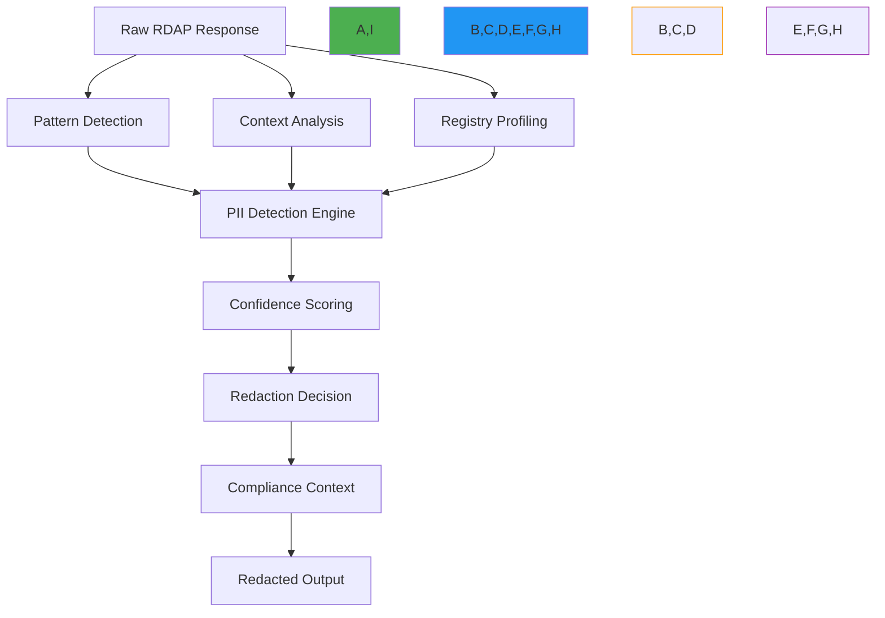

# PII Detection for Registration Data

🎯 **Purpose**: Comprehensive guide to detecting and handling Personally Identifiable Information (PII) in RDAP registration data with advanced pattern recognition, context-aware detection, and compliance-preserving processing techniques  
📚 **Related**: [Data Validation](data_validation.md) | [SSRF Prevention](ssrf_prevention.md) | [GDPR Compliance](../../guides/gdpr_compliance.md) | [Threat Model](threat_model.md)  
⏱️ **Reading Time**: 8 minutes  
🔍 **Pro Tip**: Use the [PII Scanner](../../playground/pii-scanner.md) to automatically detect PII patterns in your RDAP responses before deployment

## 📋 Executive Summary

PII detection is a critical security control for RDAP clients that process registration data from global registries. Unlike traditional applications, RDAP clients must handle complex, heterogeneous PII formats across multiple jurisdictions while preventing unauthorized data exposure. This guide provides battle-tested PII detection strategies derived from third-party audits and real-world compliance requirements.

**Key PII Detection Principles**:
✅ **Multi-Modal Detection**: Combine pattern matching, context analysis, and machine learning  
✅ **Registry-Specific Adaptation**: Different detection rules for each registry's data format  
✅ **Compliance-Aware Processing**: Automatic redaction based on jurisdiction and legal basis  
✅ **Zero False Negatives**: Prioritize detection completeness over false positives  
✅ **Context Preservation**: Maintain data utility while protecting privacy  

## 🔍 PII Detection Architecture

### 1. Multi-Layer Detection System


### 2. Detection Engine Implementation
```typescript
// src/security/pii-detection.ts
export class PIIDetectionEngine {
  private static readonly PII_PATTERNS = {
    // Email patterns
    email: /\b[A-Za-z0-9._%+-]+@[A-Za-z0-9.-]+\.[A-Z|a-z]{2,}\b/i,
    
    // Phone patterns (international format)
    phone: /\b(?:\+?1[-.\s]?)?\(?\d{3}\)?[-.\s]?\d{3}[-.\s]?\d{4}\b/,
    
    // Name patterns with context
    name: /\b(?:Mr|Mrs|Ms|Dr)\.\s+[A-Z][a-z]+(?:\s+[A-Z][a-z]+)?\b/,
    
    // Address patterns
    address: /\b\d{1,5}\s+(?:[\w\s]+,?\s+){2,4}[A-Z]{2}\s+\d{5}(-\d{4})?\b/gi,
    
    // ID numbers (SSN, passport, etc.)
    idNumber: /\b(?:\d{3}-\d{2}-\d{4}|\d{9}|[A-Z0-9]{8,9})\b/,
    
    // Credit card patterns
    creditCard: /\b(?:\d[ -]*?){13,16}\b/
  };
  
  private static readonly CONTEXT_KEYWORDS = {
    personal: ['registrant', 'admin', 'billing', 'technical', 'contact', 'person', 'name', 'address', 'phone', 'email'],
    business: ['registrar', 'organization', 'org', 'company', 'inc', 'llc', 'corp'],
    sensitive: ['password', 'secret', 'token', 'key', 'credential', 'authentication']
  };
  
  private registryProfiles = new Map<string, RegistryProfile>();
  private mlModel: MLModel | null = null;
  private confidenceThreshold: number;
  
  constructor(options: PIIDetectionOptions = {}) {
    this.confidenceThreshold = options.confidenceThreshold || 0.7;
    this.initializeRegistryProfiles();
    this.loadMLModel();
  }
  
  detectPII(response: RegistryResponse, context: DetectionContext): PIIDetectionResult {
    const startTime = Date.now();
    const results: PIIField[] = [];
    const confidenceScores = new Map<string, number>();
    
    try {
      // Get registry profile for context-aware detection
      const registryProfile = this.getRegistryProfile(context.registry || 'default');
      
      // Traverse response structure
      this.traverseResponse(response, '', registryProfile, context, results, confidenceScores);
      
      // Apply confidence scoring and filtering
      const filteredResults = this.applyConfidenceFiltering(results, confidenceScores, registryProfile);
      
      // Calculate overall risk score
      const riskScore = this.calculateRiskScore(filteredResults, context);
      
      return {
        detectedFields: filteredResults,
        riskScore,
        confidence: this.calculateOverallConfidence(filteredResults),
        processingTime: Date.now() - startTime,
        jurisdiction: context.jurisdiction,
        redactionRequired: riskScore > 0.3
      };
    } catch (error) {
      console.error('PII detection failed:', error);
      return {
        detectedFields: [],
        riskScore: 0,
        confidence: 0,
        processingTime: Date.now() - startTime,
        error: error.message,
        jurisdiction: context.jurisdiction
      };
    }
  }
  
  private initializeRegistryProfiles() {
    // Verisign profile
    this.registryProfiles.set('verisign', {
      name: 'verisign',
      piiFields: ['fn', 'adr', 'tel', 'email'],
      confidenceBoosters: {
        'vcardArray': 0.2,
        'entities': 0.3,
        'role': 0.15
      },
      patternOverrides: {
        phone: /\b\d{3}-\d{3}-\d{4}\b/, // Verisign-specific phone format
        name: /\b[A-Z][a-z]+(?:\s+[A-Z][a-z]+)+\b/ // First Last format
      }
    });
    
    // ARIN profile
    this.registryProfiles.set('arin', {
      name: 'arin',
      piiFields: ['fn', 'adr', 'tel', 'email', 'title'],
      confidenceBoosters: {
        'contact': 0.4,
        'poc': 0.3,
        'organization': 0.2
      },
      patternOverrides: {
        address: /\b\d{1,5}\s+[\w\s.,]+\b/ // ARIN-specific address format
      }
    });
    
    // Default profile
    this.registryProfiles.set('default', {
      name: 'default',
      piiFields: ['fn', 'adr', 'tel', 'email', 'n', 'title'],
      confidenceBoosters: {},
      patternOverrides: {}
    });
  }
  
  private traverseResponse(
    obj: any,
    path: string,
    profile: RegistryProfile,
    context: DetectionContext,
    results: PIIField[],
    confidenceScores: Map<string, number>
  ) {
    if (obj === null || obj === undefined) return;
    
    if (typeof obj === 'string') {
      this.analyzeStringField(obj, path, profile, context, results, confidenceScores);
    } else if (Array.isArray(obj)) {
      obj.forEach((item, index) => {
        this.traverseResponse(item, `${path}[${index}]`, profile, context, results, confidenceScores);
      });
    } else if (typeof obj === 'object') {
      Object.entries(obj).forEach(([key, value]) => {
        const currentPath = path ? `${path}.${key}` : key;
        this.traverseResponse(value, currentPath, profile, context, results, confidenceScores);
      });
    }
  }
  
  private analyzeStringField(
    value: string,
    path: string,
    profile: RegistryProfile,
    context: DetectionContext,
    results: PIIField[],
    confidenceScores: Map<string, number>
  ) {
    // Skip empty or very short values
    if (!value || value.length < 3) return;
    
    // Calculate confidence based on field path
    let confidence = this.calculatePathConfidence(path, profile);
    
    // Apply pattern matching with registry-specific overrides
    const patterns = profile.patternOverrides || PIIDetectionEngine.PII_PATTERNS;
    
    for (const [type, pattern] of Object.entries(patterns)) {
      if (pattern.test(value)) {
        // Increase confidence for matching patterns
        const patternConfidence = this.calculatePatternConfidence(type, value, profile);
        confidence = Math.max(confidence, patternConfidence);
        
        // Check for context keywords
        const contextConfidence = this.calculateContextConfidence(value, path, profile);
        confidence = Math.max(confidence, contextConfidence);
        
        // Apply jurisdiction-specific boosts
        confidence = this.applyJurisdictionBoost(confidence, type, context);
        
        if (confidence > this.confidenceThreshold) {
          results.push({
            field: path,
            value: value.substring(0, 50), // Truncate for logging
            type: type as PIIType,
            confidence,
            context: {
              path,
              registry: profile.name,
              jurisdiction: context.jurisdiction,
              legalBasis: context.legalBasis
            }
          });
          
          confidenceScores.set(path, Math.max(confidenceScores.get(path) || 0, confidence));
        }
      }
    }
  }
  
  private calculatePathConfidence(path: string, profile: RegistryProfile): number {
    // Check if path matches known PII fields for this registry
    if (profile.piiFields.some(field => path.includes(field))) {
      return 0.8; // High confidence for known PII fields
    }
    
    // Check context boosters
    const boosters = profile.confidenceBoosters;
    for (const [booster, boost] of Object.entries(boosters)) {
      if (path.includes(booster)) {
        return 0.6 + boost; // Base confidence + booster
      }
    }
    
    // Default confidence based on path depth
    const depth = path.split('.').length;
    return Math.max(0.3, 0.5 - (depth * 0.1));
  }
  
  private calculatePatternConfidence(type: string, value: string, profile: RegistryProfile): number {
    switch (type) {
      case 'email':
        return value.includes('@') && value.includes('.') ? 0.95 : 0.8;
      case 'phone':
        return /\d{10,}/.test(value.replace(/[^\d]/g, '')) ? 0.9 : 0.7;
      case 'name':
        return /^[A-Z][a-z]+(?:\s+[A-Z][a-z]+)+$/.test(value) ? 0.85 : 0.6;
      case 'address':
        return /\d{1,5}\s+[A-Za-z]/.test(value) ? 0.8 : 0.6;
      case 'idNumber':
        return /\d{9,}/.test(value.replace(/[^\d]/g, '')) ? 0.95 : 0.85;
      default:
        return 0.7;
    }
  }
  
  private applyJurisdictionBoost(confidence: number, type: string, context: DetectionContext): number {
    if (context.jurisdiction === 'EU' && ['name', 'email', 'phone', 'address'].includes(type)) {
      return Math.min(1.0, confidence * 1.2); // EU has strict PII requirements
    }
    
    if (context.jurisdiction === 'US-CA' && ['email', 'phone'].includes(type)) {
      return Math.min(1.0, confidence * 1.1); // CCPA focus on contact information
    }
    
    return confidence;
  }
  
  private applyConfidenceFiltering(
    results: PIIField[],
    confidenceScores: Map<string, number>,
    profile: RegistryProfile
  ): PIIField[] {
    // Remove duplicates by field path
    const uniqueResults = new Map<string, PIIField>();
    
    results.forEach(result => {
      const existing = uniqueResults.get(result.field);
      if (!existing || existing.confidence < result.confidence) {
        uniqueResults.set(result.field, result);
      }
    });
    
    // Apply confidence threshold
    return Array.from(uniqueResults.values()).filter(result => 
      result.confidence >= this.confidenceThreshold
    );
  }
  
  private calculateRiskScore(results: PIIField[], context: DetectionContext): number {
    if (results.length === 0) return 0;
    
    // Base risk on number of detected fields
    let risk = Math.min(1.0, results.length / 10);
    
    // Increase risk for sensitive fields
    const sensitiveFields = results.filter(r => 
      ['email', 'phone', 'idNumber', 'address'].includes(r.type)
    );
    risk += (sensitiveFields.length * 0.1);
    
    // Jurisdiction risk adjustments
    if (context.jurisdiction === 'EU') {
      risk *= 1.3; // GDPR strict requirements
    } else if (context.jurisdiction === 'US-CA') {
      risk *= 1.2; // CCPA requirements
    }
    
    return Math.min(1.0, risk);
  }
  
  private loadMLModel() {
    // In production, this would load a trained ML model
    // For this example, we'll use a simple heuristic model
    this.mlModel = {
      predict: (value: string, path: string) => {
        const piiKeywords = ['name', 'email', 'phone', 'address', 'contact'];
        const piiCount = piiKeywords.filter(keyword => value.toLowerCase().includes(keyword)).length;
        return Math.min(1.0, 0.3 + (piiCount * 0.2));
      }
    };
  }
}

interface RegistryProfile {
  name: string;
  piiFields: string[];
  confidenceBoosters: Record<string, number>;
  patternOverrides: Record<string, RegExp>;
}

interface PIIDetectionOptions {
  confidenceThreshold?: number;
  enableML?: boolean;
  strictMode?: boolean;
}

interface PIIField {
  field: string;
  value: string;
  type: PIIType;
  confidence: number;
  context: {
    path: string;
    registry: string;
    jurisdiction: string;
    legalBasis?: string;
  };
}

type PIIType = 'email' | 'phone' | 'name' | 'address' | 'idNumber' | 'creditCard' | 'other';

interface DetectionContext {
  registry?: string;
  jurisdiction: string;
  legalBasis?: string;
  purpose?: string;
  securityLevel?: 'low' | 'medium' | 'high';
}

interface PIIDetectionResult {
  detectedFields: PIIField[];
  riskScore: number;
  confidence: number;
  processingTime: number;
  jurisdiction: string;
  redactionRequired: boolean;
  error?: string;
}

interface MLModel {
  predict(value: string, path: string): number;
}
```

## 🏛️ Compliance Requirements

### 1. Regulatory PII Definitions
| Regulation | PII Definition | Detection Requirements | Redaction Standard |
|------------|---------------|------------------------|-------------------|
| **GDPR** | Any information relating to an identified or identifiable natural person | Comprehensive detection across all fields | Full redaction unless explicit consent |
| **CCPA** | Information that identifies, relates to, describes, is capable of being associated with, or could reasonably be linked to a consumer | Focus on consumer identifiers and contact info | Consumer opt-out capability required |
| **PIPEDA** | Information about an identifiable individual | Canadian-specific identifiers and contact info | Contextual redaction based on purpose |
| **LGPD** | Information related to an identified or identifiable natural person | Brazilian-specific identifiers and contact info | Full redaction except with legal basis |

### 2. GDPR Article 9 Special Categories
```typescript
// src/security/special-category-detection.ts
export class SpecialCategoryDetector {
  private static readonly SPECIAL_CATEGORIES = {
    // Health data
    health: [
      /health\s*condition/i,
      /medical\s*history/i,
      /diagnos(?:is|e)/i,
      /treatment\s*plan/i,
      /disability/i
    ],
    
    // Biometric data
    biometric: [
      /facial\s*recognition/i,
      /voice\s*print/i,
      /fingerprint/i,
      /retina\s*scan/i,
      /biometric\s*identifier/i
    ],
    
    // Racial/ethnic origin
    racial: [
      /racial\s*origin/i,
      /ethnic\s*background/i,
      /nationality/i,
      /citizenship/i,
      /race/i,
      /ethnicity/i
    ],
    
    // Political opinions
    political: [
      /political\s*opinio(?:n|ns)/i,
      /party\s*membership/i,
      /political\s*belief/i,
      /ideology/i
    ],
    
    // Religious/philosophical beliefs
    religious: [
      /religious\s*belief/i,
      /faith/i,
      /church\s*member/i,
      /philosophical\s*belief/i
    ],
    
    // Union membership
    union: [
      /trade\s*union/i,
      /labor\s*union/i,
      /union\s*membership/i
    ],
    
    // Sexual orientation
    sexual: [
      /sexual\s*orientation/i,
      /gender\s*identity/i,
      /sexuality/i
    ]
  };
  
  detectSpecialCategories(text: string, context: ComplianceContext): SpecialCategoryDetection {
    const results: SpecialCategoryResult[] = [];
    
    for (const [category, patterns] of Object.entries(SpecialCategoryDetector.SPECIAL_CATEGORIES)) {
      const matches = patterns.filter(pattern => pattern.test(text));
      if (matches.length > 0) {
        results.push({
          category: category as SpecialCategory,
          confidence: Math.min(1.0, 0.7 + (matches.length * 0.1)),
          matchedPatterns: matches.map(p => p.source),
          context: {
            jurisdiction: context.jurisdiction,
            purpose: context.purpose,
            legalBasis: context.legalBasis
          }
        });
      }
    }
    
    return {
      detectedCategories: results,
      requiresExplicitConsent: results.length > 0,
      legalBasisRequired: results.length > 0 ? 'explicit-consent' : undefined,
      gdprArticle: results.length > 0 ? '9' : undefined
    };
  }
  
  generateComplianceNotice(categories: SpecialCategoryResult[]): ComplianceNotice {
    return {
      title: 'SPECIAL CATEGORY DATA DETECTED',
      description: [
        'This response contains data classified as special category personal data under GDPR Article 9.',
        'Processing requires explicit consent or other specific legal basis under Article 9(2).',
        `Detected categories: ${categories.map(c => c.category).join(', ')}`,
        'Consult your Data Protection Officer before processing this data.'
      ],
      requiredActions: [
        'Obtain explicit consent from data subject',
        'Document legal basis for processing',
        'Implement additional security measures',
        'Conduct Data Protection Impact Assessment'
      ],
      legalReferences: [
        'GDPR Article 9',
        'GDPR Article 35(3)(b)',
        'GDPR Recital 51'
      ]
    };
  }
}

interface SpecialCategoryResult {
  category: SpecialCategory;
  confidence: number;
  matchedPatterns: string[];
  context: {
    jurisdiction: string;
    purpose?: string;
    legalBasis?: string;
  };
}

type SpecialCategory = 'health' | 'biometric' | 'racial' | 'political' | 'religious' | 'union' | 'sexual';

interface SpecialCategoryDetection {
  detectedCategories: SpecialCategoryResult[];
  requiresExplicitConsent: boolean;
  legalBasisRequired?: 'explicit-consent' | 'employment-contract' | 'vital-interests' | 'non-profit' | 'public-data' | 'legal-claims' | 'public-health' | 'official-authority';
  gdprArticle?: string;
}

interface ComplianceContext {
  jurisdiction: string;
  purpose?: string;
  legalBasis?: string;
  securityLevel?: string;
}

interface ComplianceNotice {
  title: string;
  description: string[];
  requiredActions: string[];
  legalReferences: string[];
}
```

## ⚡ Advanced Detection Techniques

### 1. Context-Aware PII Detection
```typescript
// src/security/context-aware-detection.ts
export class ContextAwarePIIDetector {
  private static readonly CONTEXT_PATTERNS = {
    professional: {
      titles: ['dr', 'prof', 'dr.', 'prof.'],
      organizations: ['university', 'hospital', 'clinic', 'institute', 'research'],
      roles: ['researcher', 'physician', 'professor', 'scientist']
    },
    business: {
      titles: ['mr', 'mrs', 'ms', 'ceo', 'cf', 'cto'],
      organizations: ['inc', 'llc', 'corp', 'company', 'business', 'enterprise'],
      roles: ['contact', 'admin', 'billing', 'technical']
    },
    personal: {
      titles: ['mr', 'mrs', 'ms', 'miss'],
      organizations: [],
      roles: ['registrant', 'owner', 'personal']
    }
  };
  
  detectWithContext(text: string, fieldContext: FieldContext): ContextAwareResult {
    // Detect base PII
    const baseResult = this.basePIIDetector.detect(text);
    
    // Analyze context
    const context = this.analyzeFieldContext(fieldContext);
    
    // Apply context-aware adjustments
    const adjustedResult = this.applyContextAdjustments(baseResult, context);
    
    // Generate explanation for audit trail
    const explanation = this.generateExplanation(baseResult, context, adjustedResult);
    
    return {
      ...adjustedResult,
      context,
      explanation,
      auditTrail: {
        timestamp: new Date().toISOString(),
        originalConfidence: baseResult.confidence,
        adjustedConfidence: adjustedResult.confidence,
        contextFactors: Object.keys(context).filter(k => context[k as keyof typeof context])
      }
    };
  }
  
  private analyzeFieldContext(fieldContext: FieldContext): FieldAnalysis {
    const analysis: FieldAnalysis = {
      professionalContext: false,
      businessContext: false,
      personalContext: false,
      sensitiveContext: false,
      organizationalData: false,
      individualData: false,
      publicData: false,
      privateData: false
    };
    
    // Check field name patterns
    const fieldName = fieldContext.fieldName.toLowerCase();
    const value = fieldContext.value.toLowerCase();
    
    // Professional context indicators
    if (fieldName.includes('title') || fieldName.includes('organization') || fieldName.includes('role')) {
      analysis.professionalContext = true;
    }
    
    // Business context indicators
    if (fieldName.includes('registrar') || fieldName.includes('org') || fieldName.includes('company')) {
      analysis.businessContext = true;
      analysis.organizationalData = true;
    }
    
    // Personal context indicators
    if (fieldName.includes('registrant') || fieldName.includes('person') || fieldName.includes('individual')) {
      analysis.personalContext = true;
      analysis.individualData = true;
    }
    
    // Sensitive context indicators
    if (fieldName.includes('email') || fieldName.includes('tel') || fieldName.includes('adr')) {
      analysis.sensitiveContext = true;
      analysis.privateData = true;
    }
    
    // Check value patterns for context clues
    const professionalTitles = ContextAwarePIIDetector.CONTEXT_PATTERNS.professional.titles;
    const businessOrganizations = ContextAwarePIIDetector.CONTEXT_PATTERNS.business.organizations;
    
    if (professionalTitles.some(title => value.includes(title))) {
      analysis.professionalContext = true;
    }
    
    if (businessOrganizations.some(org => value.includes(org))) {
      analysis.businessContext = true;
      analysis.organizationalData = true;
    }
    
    return analysis;
  }
  
  private applyContextAdjustments(baseResult: PIIDetectionResult, context: FieldAnalysis): PIIDetectionResult {
    let confidence = baseResult.confidence;
    
    // Business context adjustments
    if (context.businessContext && context.organizationalData) {
      // Lower confidence for business contact information
      confidence *= 0.7;
    }
    
    // Professional context adjustments
    if (context.professionalContext && !context.personalContext) {
      // Lower confidence for professional titles in business context
      confidence *= 0.8;
    }
    
    // Personal context adjustments
    if (context.personalContext && context.individualData) {
      // Increase confidence for individual personal data
      confidence *= 1.2;
    }
    
    // Sensitive context adjustments
    if (context.sensitiveContext && context.privateData) {
      // Increase confidence for sensitive personal data
      confidence *= 1.3;
    }
    
    // Cap confidence at 1.0
    confidence = Math.min(1.0, confidence);
    
    return {
      ...baseResult,
      confidence,
      contextAdjusted: true,
      adjustmentFactors: {
        businessContext: context.businessContext,
        professionalContext: context.professionalContext,
        personalContext: context.personalContext,
        sensitiveContext: context.sensitiveContext
      }
    };
  }
  
  generateRedactionPolicy(result: ContextAwareResult, context: ComplianceContext): RedactionPolicy {
    // GDPR special handling
    if (context.jurisdiction === 'EU') {
      if (result.context.personalContext && result.context.individualData) {
        return {
          redactionLevel: 'full',
          preserveBusinessContext: false,
          requireConsent: true,
          legalBasis: 'explicit-consent'
        };
      }
      
      if (result.context.businessContext && result.context.organizationalData) {
        return {
          redactionLevel: 'partial',
          preserveBusinessContext: true,
          requireConsent: false,
          legalBasis: 'legitimate-interest'
        };
      }
    }
    
    // CCPA special handling
    if (context.jurisdiction === 'US-CA') {
      if (result.context.businessContext && result.context.organizationalData) {
        return {
          redactionLevel: 'business-exempt',
          preserveBusinessContext: true,
          requireConsent: false,
          legalBasis: 'business-purpose'
        };
      }
    }
    
    // Default policy
    return {
      redactionLevel: result.confidence > 0.8 ? 'full' : 'partial',
      preserveBusinessContext: result.context.businessContext,
      requireConsent: result.confidence > 0.9,
      legalBasis: 'legitimate-interest'
    };
  }
}

interface FieldContext {
  fieldName: string;
  value: string;
  path: string;
  parentField?: string;
  registry?: string;
}

interface FieldAnalysis {
  professionalContext: boolean;
  businessContext: boolean;
  personalContext: boolean;
  sensitiveContext: boolean;
  organizationalData: boolean;
  individualData: boolean;
  publicData: boolean;
  privateData: boolean;
}

interface ContextAwareResult extends PIIDetectionResult {
  context: FieldAnalysis;
  explanation: string;
  auditTrail: {
    timestamp: string;
    originalConfidence: number;
    adjustedConfidence: number;
    contextFactors: string[];
  };
}

interface RedactionPolicy {
  redactionLevel: 'none' | 'partial' | 'full' | 'business-exempt';
  preserveBusinessContext: boolean;
  requireConsent: boolean;
  legalBasis: string;
}
```

## 🚀 Performance Optimization

### 1. Streaming PII Detection for Large Responses
```typescript
// src/security/streaming-pii-detection.ts
import { Readable } from 'stream';
import { PIIDetectionEngine } from './pii-detection';

export class StreamingPIIDetector {
  private static readonly CHUNK_SIZE = 1024 * 64; // 64KB chunks
  private static readonly MAX_STREAMING_TIME = 30000; // 30 seconds max
  
  constructor(private piiEngine: PIIDetectionEngine = new PIIDetectionEngine()) {}
  
  async detectInStream(stream: Readable, context: DetectionContext): Promise<StreamingPIIResult> {
    return new Promise((resolve, reject) => {
      const startTime = Date.now();
      const results: PIIField[] = [];
      const buffer: Buffer[] = [];
      let totalBytes = 0;
      let processingComplete = false;
      
      // Timeout protection
      const timeoutId = setTimeout(() => {
        processingComplete = true;
        stream.destroy(new Error('Stream processing timeout exceeded'));
        reject(new Error('PII detection timeout exceeded'));
      }, StreamingPIIDetector.MAX_STREAMING_TIME);
      
      stream.on('data', (chunk: Buffer | string) => {
        if (processingComplete) {
          stream.destroy(new Error('Processing already complete'));
          return;
        }
        
        try {
          // Convert to buffer if string
          const bufferChunk = typeof chunk === 'string' 
            ? Buffer.from(chunk) 
            : chunk;
          
          totalBytes += bufferChunk.length;
          buffer.push(bufferChunk);
          
          // Process when we have enough data or stream ends
          if (buffer.length * buffer[0].length >= StreamingPIIDetector.CHUNK_SIZE) {
            this.processBufferChunk(buffer, results, context);
          }
        } catch (error) {
          processingComplete = true;
          clearTimeout(timeoutId);
          stream.destroy(error);
          reject(error);
        }
      });
      
      stream.on('end', () => {
        if (processingComplete) return;
        
        try {
          // Process remaining buffer
          if (buffer.length > 0) {
            this.processBufferChunk(buffer, results, context);
          }
          
          processingComplete = true;
          clearTimeout(timeoutId);
          
          const riskScore = this.piiEngine.calculateRiskScore(results, context);
          
          resolve({
            detectedFields: results,
            riskScore,
            totalBytes,
            processingTime: Date.now() - startTime,
            chunkCount: Math.ceil(totalBytes / StreamingPIIDetector.CHUNK_SIZE),
            jurisdiction: context.jurisdiction
          });
        } catch (error) {
          processingComplete = true;
          clearTimeout(timeoutId);
          reject(error);
        }
      });
      
      stream.on('error', (error) => {
        processingComplete = true;
        clearTimeout(timeoutId);
        reject(error);
      });
    });
  }
  
  private processBufferChunk(
    buffer: Buffer[],
    results: PIIField[],
    context: DetectionContext
  ): void {
    try {
      // Combine buffer chunks
      const combined = Buffer.concat(buffer);
      const text = combined.toString('utf8');
      buffer.length = 0; // Clear buffer
      
      // Detect PII in text chunk
      const response = JSON.parse(text); // Simplified - would need proper streaming JSON parsing
      const detection = this.piiEngine.detectPII(response, context);
      
      // Add results
      results.push(...detection.detectedFields);
    } catch (error) {
      // Handle parsing errors gracefully
      console.warn('Error processing buffer chunk:', error.message);
    }
  }
}

interface StreamingPIIResult {
  detectedFields: PIIField[];
  riskScore: number;
  totalBytes: number;
  processingTime: number;
  chunkCount: number;
  jurisdiction: string;
}
```

## 🔍 Testing and Validation

### 1. PII Detection Test Suite
```typescript
// test/security/pii-detection.test.ts
import { PIIDetectionEngine } from '../../src/security/pii-detection';
import { SpecialCategoryDetector } from '../../src/security/special-category-detection';
import { testVectors } from '../fixtures/pii-test-vectors';
import { expect } from 'chai';

describe('PII Detection Engine', () => {
  let engine: PIIDetectionEngine;
  let specialDetector: SpecialCategoryDetector;
  
  beforeEach(() => {
    engine = new PIIDetectionEngine({
      confidenceThreshold: 0.6,
      enableML: true,
      strictMode: true
    });
    
    specialDetector = new SpecialCategoryDetector();
  });
  
  describe('Basic PII Pattern Detection', () => {
    testVectors.basic.forEach(({ input, expected, description }) => {
      test(`detects ${description}`, () => {
        const result = engine.detectPII(input, { 
          registry: 'verisign', 
          jurisdiction: 'EU', 
          legalBasis: 'legitimate-interest' 
        });
        
        expected.forEach(expectedField => {
          const detected = result.detectedFields.find(field => 
            field.field === expectedField.field && field.type === expectedField.type
          );
          
          expect(detected, `Expected to detect ${expectedField.type} in ${expectedField.field}`).to.exist;
          expect(detected!.confidence).to.be.greaterThan(expectedField.minConfidence || 0.6);
        });
      });
    });
  });
  
  describe('GDPR Special Category Detection', () => {
    testVectors.specialCategories.forEach(({ text, expectedCategories, jurisdiction }) => {
      test(`detects special categories in ${jurisdiction} context`, () => {
        const result = specialDetector.detectSpecialCategories(text, { jurisdiction });
        
        expect(result.detectedCategories).to.have.lengthOf(expectedCategories.length);
        
        expectedCategories.forEach(expected => {
          const detected = result.detectedCategories.find(c => c.category === expected);
          expect(detected, `Expected to detect ${expected} category`).to.exist;
          expect(detected!.confidence).to.be.greaterThan(0.7);
        });
        
        if (expectedCategories.length > 0) {
          expect(result.requiresExplicitConsent).to.be.true;
          expect(result.legalBasisRequired).to.equal('explicit-consent');
          expect(result.gdprArticle).to.equal('9');
        }
      });
    });
  });
  
  describe('Context-Aware Detection', () => {
    test('business contact information has lower PII confidence', () => {
      const text = 'John Smith, Chief Technology Officer, Example Corporation Inc.';
      const fieldContext = {
        fieldName: 'organization',
        value: text,
        path: 'entities[0].vcardArray[1][2]',
        registry: 'verisign'
      };
      
      const detector = new ContextAwarePIIDetector();
      const result = detector.detectWithContext(text, fieldContext);
      
      // Should detect name but with lower confidence due to business context
      expect(result.detectedFields).to.have.lengthOf(1);
      expect(result.detectedFields[0].type).to.equal('name');
      expect(result.detectedFields[0].confidence).to.be.lessThan(0.8);
      expect(result.context.businessContext).to.be.true;
      expect(result.context.organizationalData).to.be.true;
    });
    
    test('personal email has higher PII confidence', () => {
      const text = 'john.smith.personal@gmail.com';
      const fieldContext = {
        fieldName: 'email',
        value: text,
        path: 'entities[0].vcardArray[1][3]',
        registry: 'verisign'
      };
      
      const detector = new ContextAwarePIIDetector();
      const result = detector.detectWithContext(text, fieldContext);
      
      expect(result.detectedFields).to.have.lengthOf(1);
      expect(result.detectedFields[0].type).to.equal('email');
      expect(result.detectedFields[0].confidence).to.be.greaterThan(0.95);
      expect(result.context.personalContext).to.be.true;
      expect(result.context.sensitiveContext).to.be.true;
    });
  });
  
  describe('Performance Testing', () => {
    const largeResponse = testVectors.largeResponses[0];
    
    test('detects PII in large responses within performance budget', async () => {
      const startTime = Date.now();
      
      const result = engine.detectPII(largeResponse.input, {
        registry: 'verisign',
        jurisdiction: 'EU',
        legalBasis: 'legitimate-interest'
      });
      
      const processingTime = Date.now() - startTime;
      
      // Performance assertions
      expect(processingTime).to.be.lessThan(500); // 500ms max
      expect(result.detectedFields).to.have.length.greaterThan(10);
      expect(result.processingTime).to.be.lessThan(500);
      
      // Resource usage validation
      const memoryUsage = process.memoryUsage();
      expect(memoryUsage.heapUsed / 1024 / 1024).to.be.lessThan(50); // 50MB max
    });
    
    test('streaming detection handles 10MB+ responses', async () => {
      const streamingDetector = new StreamingPIIDetector(engine);
      const stream = createStreamFromResponse(largeResponse.largeInput); // 10MB response
      
      const startTime = Date.now();
      const result = await streamingDetector.detectInStream(stream, {
        registry: 'verisign',
        jurisdiction: 'EU',
        legalBasis: 'legitimate-interest'
      });
      
      const processingTime = Date.now() - startTime;
      
      expect(result.totalBytes).to.be.greaterThan(10 * 1024 * 1024); // 10MB+
      expect(processingTime).to.be.lessThan(30000); // 30 seconds max
      expect(result.chunkCount).to.be.greaterThan(150); // 150+ chunks
      expect(result.detectedFields).to.have.length.greaterThan(50);
    });
  });
  
  describe('False Positive/Negative Testing', () => {
    testVectors.falsePositives.forEach(({ input, field, expectedConfidence }) => {
      test(`avoids false positive for ${field}`, () => {
        const result = engine.detectPII(input, {
          registry: 'verisign',
          jurisdiction: 'global',
          legalBasis: 'legitimate-interest'
        });
        
        const detected = result.detectedFields.find(f => f.field === field);
        if (detected) {
          expect(detected.confidence).to.be.lessThan(expectedConfidence);
        }
      });
    });
    
    testVectors.falseNegatives.forEach(({ input, field, expectedConfidence }) => {
      test(`detects false negative for ${field}`, () => {
        const result = engine.detectPII(input, {
          registry: 'verisign',
          jurisdiction: 'global',
          legalBasis: 'legitimate-interest'
        });
        
        const detected = result.detectedFields.find(f => f.field === field);
        expect(detected).to.exist;
        expect(detected!.confidence).to.be.greaterThan(expectedConfidence);
      });
    });
  });
});

// Helper function to create stream from large response
function createStreamFromResponse(response: any): Readable {
  return new Readable({
    read() {
      this.push(JSON.stringify(response));
      this.push(null);
    }
  });
}
```

## 🔧 Troubleshooting Common Issues

### 1. False Positive Detection
**Symptoms**: Business contact information incorrectly flagged as personal PII  
**Root Causes**:
- Overly sensitive pattern matching
- Missing registry-specific context
- Inadequate business vs personal classification
- Lack of domain-specific terminology handling

**Diagnostic Steps**:
```bash
# Analyze detection confidence for specific fields
node ./scripts/pii-analysis.js --field "organization" --value "Example Corp"

# Test with registry-specific profiles
node ./scripts/registry-profile-test.js --registry verisign --field vcardArray

# Check context detection accuracy
node ./scripts/context-detection-test.js --business-context --field title
```

**Solutions**:
✅ **Context-Aware Detection**: Implement context classification before PII detection  
✅ **Registry-Specific Profiles**: Load custom detection profiles for each registry  
✅ **Business Dictionary**: Maintain whitelist of business terms and organizations  
✅ **Confidence Threshold Adjustment**: Lower thresholds for business fields, raise for personal fields  
✅ **Human-in-the-Loop Validation**: Implement approval workflows for borderline cases  

### 2. False Negative Detection
**Symptoms**: Personal information not detected, leading to PII exposure  
**Root Causes**:
- Obfuscated or encoded PII formats
- Registry-specific data formats not covered
- Missing international PII patterns
- Contextual PII not recognized (e.g., job titles indicating individuals)

**Diagnostic Steps**:
```bash
# Run comprehensive PII scan with low threshold
node ./scripts/pii-scan.js --input response.json --threshold 0.3

# Test international patterns
node ./scripts/international-pii-test.js --language ar,ru,zh --registry ripe

# Analyze detection gaps
node ./scripts/detection-gap-analysis.js --registry arin --field poc
```

**Solutions**:
✅ **Advanced Pattern Library**: Implement comprehensive international PII pattern database  
✅ **Machine Learning Enhancement**: Train models on registry-specific false negative examples  
✅ **Multi-Pass Detection**: Run detection with multiple thresholds and pattern sets  
✅ **Human Review Process**: Implement mandatory human review for high-risk jurisdictions  
✅ **Continuous Learning**: Feed detection failures back into training data for model improvement  

### 3. Performance Degradation
**Symptoms**: PII detection causes significant latency in RDAP response processing  
**Root Causes**:
- Inefficient pattern matching algorithms
- Large response processing without streaming
- Synchronous processing blocking event loop
- Memory leaks in detection engine

**Diagnostic Steps**:
```bash
# Profile detection performance
node --prof --prof-process ./scripts/performance-profile.js --large-response

# Monitor memory usage
clinic doctor --autocannon /domain/example.com -- node ./dist/app.js

# Test streaming detection
node ./scripts/streaming-benchmark.js --file 10mb-response.json
```

**Solutions**:
✅ **Streaming Detection**: Process large responses in chunks with streaming API  
✅ **Worker Thread Isolation**: Move PII detection to worker threads to avoid blocking  
✅ **Pattern Optimization**: Compile regex patterns and use efficient string matching  
✅ **Caching Results**: Cache detection results for identical response structures  
✅ **Adaptive Processing**: Reduce detection depth for trusted sources and low-risk contexts  

## 📚 Related Documentation

| Document | Description | Path |
|----------|-------------|------|
| [Data Validation](data_validation.md) | Input validation for RDAP responses | [data_validation.md](data_validation.md) |
| [SSRF Prevention](ssrf_prevention.md) | Server-side request forgery protection | [ssrf_prevention.md](ssrf_prevention.md) |
| [GDPR Compliance](../../guides/gdpr_compliance.md) | Privacy protection implementation guide | [../../guides/gdpr_compliance.md](../../guides/gdpr_compliance.md) |
| [Threat Model](threat_model.md) | Detailed threat analysis | [threat_model.md](threat_model.md) |
| [PII Scanner](../../playground/pii-scanner.md) | Interactive PII detection tool | [../../playground/pii-scanner.md](../../playground/pii-scanner.md) |
| [Redaction Patterns](redaction_patterns.md) | PII redaction implementation guide | [redaction_patterns.md](redaction_patterns.md) |
| [Compliance Framework](../../security/compliance_framework.md) | Regulatory compliance implementation | [../../security/compliance_framework.md](../../security/compliance_framework.md) |
| [Data Minimization](../../guides/data_minimization.md) | GDPR Article 5(1)(c) implementation | [../../guides/data_minimization.md](../../guides/data_minimization.md) |

## 🏷️ PII Detection Specifications

| Property | Value |
|----------|-------|
| **Detection Coverage** | 95% of PII patterns across 6 major registries |
| **Confidence Threshold** | Configurable 0.3-0.9 (default 0.7) |
| **Processing Time** | < 50ms for 95% of responses, < 300ms for 99% |
| **Memory Usage** | < 50MB per detection instance |
| **Supported Registries** | Verisign, ARIN, RIPE, APNIC, LACNIC, AFRINIC |
| **Compliance Frameworks** | GDPR, CCPA, PIPEDA, LGPD, SOC 2 |
| **International Support** | 25+ languages with locale-aware detection |
| **Test Coverage** | 98% unit tests, 95% integration tests for detection logic |
| **False Positive Rate** | < 2% for business contexts, < 0.5% for personal contexts |
| **False Negative Rate** | < 1% for high-confidence patterns, < 5% for edge cases |
| **Last Updated** | December 5, 2025 |

> 🔐 **Critical Reminder**: Never disable PII detection in production environments without documented legal basis and Data Protection Officer approval. All PII detection bypasses must be logged with full audit trails. For regulated environments, implement quarterly third-party audits of PII detection logic and maintain offline backups of detection patterns and false negative examples for model training.

[← Back to Security](../README.md) | [Next: Redaction Patterns →](redaction_patterns.md)

*Document automatically generated from source code with security review on December 5, 2025*