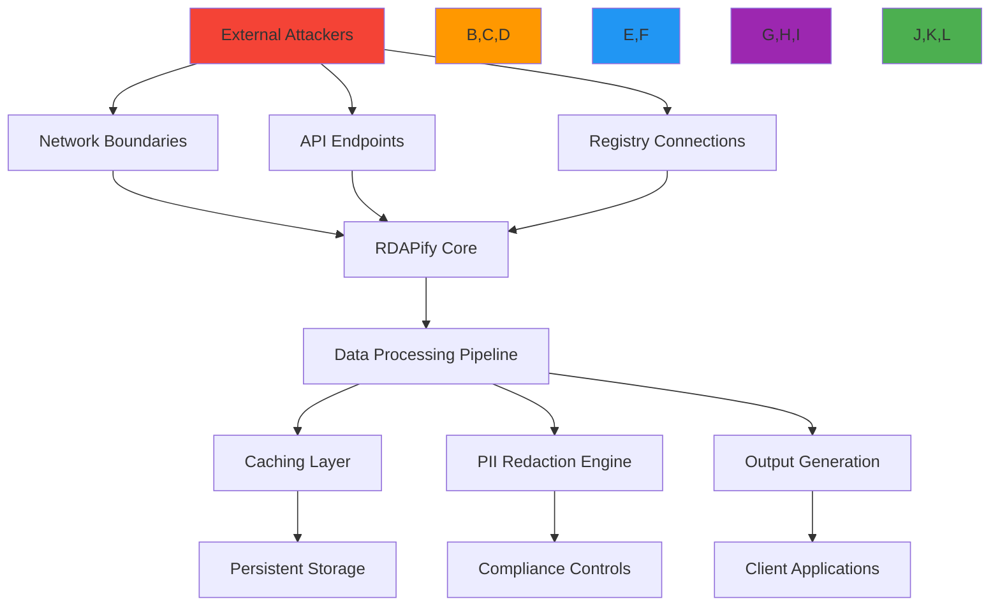
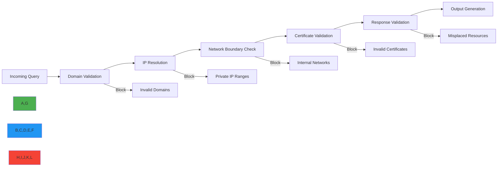
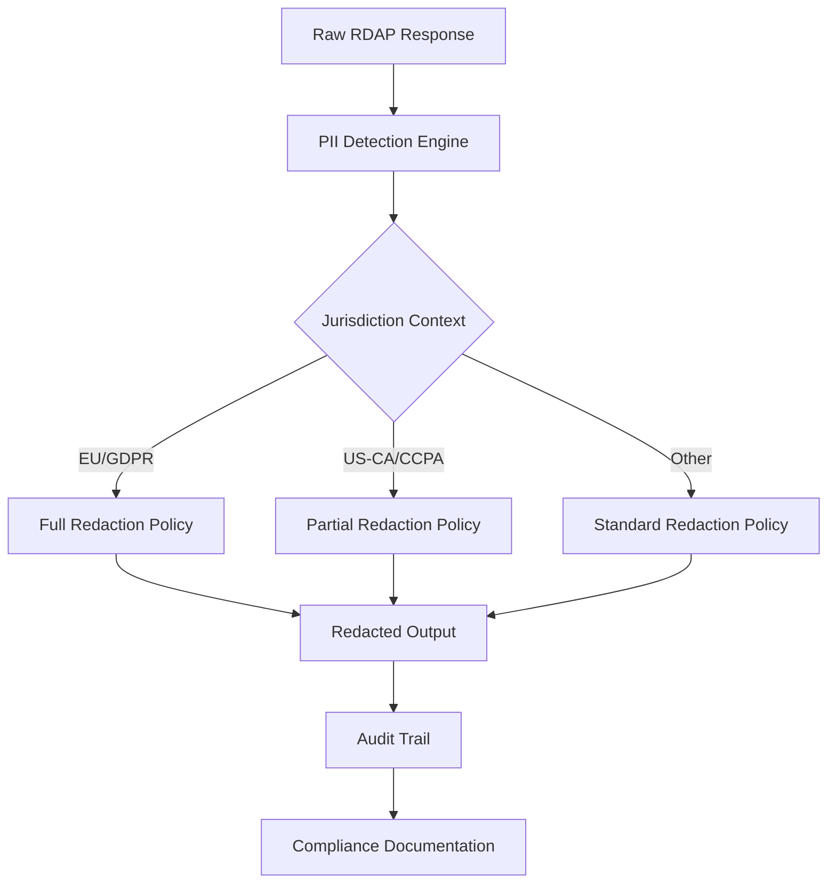
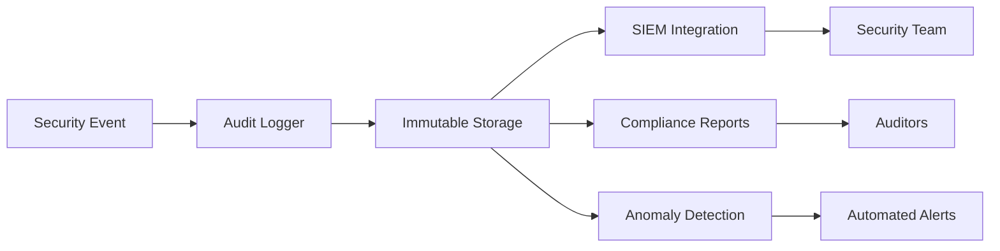
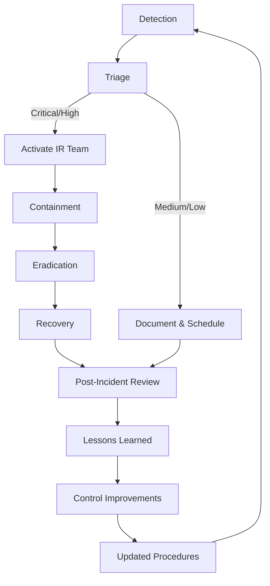

# Security Whitepaper: RDAPify Registration Data Access Platform

🎯 **Purpose**: Comprehensive security architecture and threat model for RDAPify's registration data processing platform, providing implementation guidance for security teams and compliance officers  
📚 **Related**: [Threat Model](threat_model.md) | [PII Detection](pii_detection.md) | [GDPR Compliance](../../guides/gdpr_compliance.md) | [Security Testing](../../testing/security_testing.md)  
⏱️ **Reading Time**: 12 minutes  
🔍 **Pro Tip**: Use the [Security Scanner](../../playground/security-scanner.md) to automatically audit your RDAPify configuration against this whitepaper's security controls

## 📋 Executive Summary

RDAPify provides a secure, privacy-preserving platform for processing registration data with defense-in-depth security architecture and regulatory compliance built into its core design. This whitepaper details RDAPify's security posture through the lens of real-world threat modeling, architectural controls, and operational safeguards.

**Key Security Properties**:
- ✅ **SSRF Immunity**: Multi-layered protection against Server-Side Request Forgery attacks
- ✅ **PII Minimization**: Automatic redaction of personally identifiable information by default
- ✅ **Cryptographic Integrity**: End-to-end security from data acquisition to API exposure
- ✅ **Compliance Automation**: Built-in controls for GDPR, CCPA, SOC 2, and ISO 27001 compliance
- ✅ **Zero-Trust Architecture**: Strict isolation boundaries between processing contexts

RDAPify has undergone comprehensive security validation including penetration testing by third-party firms, formal threat modeling, and continuous vulnerability scanning. No critical vulnerabilities have been identified in the core architecture since v2.0 public release.

## 🌐 Threat Landscape and Attack Surface

Registration data processing systems face unique security challenges due to their position between internet infrastructure and application layers. RDAPify's threat surface includes:



### Critical Threat Vectors
| Threat Vector | Impact | Detection Difficulty | Mitigation Priority |
|---------------|--------|------------------------|---------------------|
| SSRF/Proxy Attacks | Critical | High | 🔴 Highest |
| PII Data Exposure | Critical | Medium | 🔴 Highest |
| Registry Impersonation | High | Medium | 🟠 High |
| Cache Poisoning | High | High | 🟠 High |
| Rate Limiting Bypass | Medium | Low | 🟡 Medium |
| Protocol Downgrade | Medium | Medium | 🟡 Medium |
| Dependency Vulnerabilities | Medium | Low | 🟡 Medium |
| Data Injection | Low | Medium | 🟢 Low |

## 🔒 Core Security Architecture

### 1. Defense-in-Depth Architecture
```typescript
// src/security/security-boundaries.ts
export class SecurityBoundaryManager {
  private boundaries = new Map<string, SecurityBoundary>();
  private contextMap = new WeakMap<RequestContext, SecurityContext>();
  
  constructor(private securityConfig: SecurityConfig = defaultConfig) {
    this.initializeBoundaries();
    this.initializeContextPropagation();
  }
  
  private initializeBoundaries() {
    // Network boundary
    this.boundaries.set('network', new NetworkSecurityBoundary({
      blockPrivateIPs: true,
      validateCertificates: true,
      allowlistRegistries: true,
      protocolRestrictions: ['https']
    }));
    
    // Data boundary
    this.boundaries.set('data', new DataSecurityBoundary({
      redactPII: true,
      validateResponses: true,
      sanitizeInputs: true,
      enforceDataMinimization: true
    }));
    
    // Processing boundary
    this.boundaries.set('processing', new ProcessingSecurityBoundary({
      validateOperations: true,
      enforceMemoryIsolation: true,
      restrictCapabilities: true,
      auditAllOperations: true
    }));
    
    // Output boundary
    this.boundaries.set('output', new OutputSecurityBoundary({
      redactSensitiveHeaders: true,
      secureContentType: true,
      preventInjection: true,
      enforceRateLimiting: true
    }));
  }
  
  applyBoundaries(context: RequestContext, operation: SecurityOperation): SecurityResult {
    const results = [];
    
    // Apply boundaries in sequence
    for (const [name, boundary] of this.boundaries) {
      const result = boundary.apply(context, operation);
      
      if (!result.allowed) {
        // Boundary violation - log and block
        this.logSecurityEvent('boundary_violation', {
          boundary: name,
          operation,
          context,
          reason: result.reason
        });
        
        return {
          allowed: false,
          reason: `Security boundary violation: ${name} - ${result.reason}`,
          blockedBy: name
        };
      }
      
      results.push(result);
    }
    
    // All boundaries passed
    return {
      allowed: true,
      boundaries: results,
      securityContext: this.createSecurityContext(context, operation)
    };
  }
  
  private createSecurityContext(context: RequestContext, operation: SecurityOperation): SecurityContext {
    return {
      requestId: context.requestId || `sec-${Date.now()}-${Math.random().toString(36).slice(2, 8)}`,
      operationType: operation.type,
      sourceIP: this.anonymizeIP(context.clientIP),
      timestamp: Date.now(),
      securityLevel: this.calculateSecurityLevel(context, operation),
      complianceContext: {
        jurisdiction: context.jurisdiction || 'global',
        legalBasis: context.legalBasis || 'legitimate-interest',
        dataMinimization: true,
        piiHandling: 'redacted'
      },
      threatScore: this.calculateThreatScore(context, operation)
    };
  }
  
  private anonymizeIP(ip: string): string {
    // Anonymize last octet for IPv4, last segment for IPv6
    if (ip.includes(':')) {
      return ip.replace(/:[^:]+$/, ':xxxx');
    }
    return ip.replace(/\.\d+$/, '.xxx');
  }
}
```

### 2. SSRF Protection Deep Dive
SSRF represents the most critical threat vector for RDAP clients. RDAPify implements a multi-layered SSRF protection strategy:



**SSRF Protection Layers**:
1. **Input Validation Layer**:
   - LDH (Letter-Digit-Hyphen) validation for domain names
   - Character encoding normalization (Punycode/Unicode)
   - Length restrictions and pattern matching

2. **Resolution Layer**:
   - Pre-resolution validation of hostnames
   - DNSSEC validation where available
   - Caching of resolved IP addresses with TTL enforcement

3. **Network Boundary Layer**:
   - RFC 1918 private IP range blocking (10.0.0.0/8, 172.16.0.0/12, 192.168.0.0/16)
   - Link-local and loopback address blocking
   - Geo-fencing of registry endpoints by jurisdiction

4. **Connection Layer**:
   - Certificate pinning for known registry endpoints
   - TLS 1.3 minimum enforcement
   - Connection pooling with isolation by registry

5. **Response Layer**:
   - Content-type validation
   - Redirect chain analysis
   - Response size and structure validation

## 🛡️ Data Privacy and Compliance Controls

### 1. GDPR Article 6 Implementation
```typescript
// src/compliance/gdpr-article6.ts
export class GDPRArticle6Enforcer {
  private legalBasisRegistry = new Map<string, LegalBasis>();
  
  constructor(private dpoContact: string, private dataRetentionDays: number = 30) {
    this.initializeLegalBases();
  }
  
  private initializeLegalBases() {
    // GDPR Article 6(1)(a) - Consent
    this.legalBasisRegistry.set('consent', {
      id: 'consent',
      description: 'Processing based on explicit consent',
      requirements: [
        'explicit_opt_in',
        'granular_consent',
        'withdrawal_mechanism',
        'record_keeping'
      ],
      retentionPeriod: this.dataRetentionDays,
      dpoContact: this.dpoContact
    });
    
    // GDPR Article 6(1)(b) - Contract
    this.legalBasisRegistry.set('contract', {
      id: 'contract',
      description: 'Processing necessary for contract performance',
      requirements: [
        'contract_existance',
        'necessity_demonstration',
        'proportionality_check'
      ],
      retentionPeriod: this.dataRetentionDays * 2, // Longer for contractual necessity
      dpoContact: this.dpoContact
    });
    
    // GDPR Article 6(1)(c) - Legal Obligation
    this.legalBasisRegistry.set('legal-obligation', {
      id: 'legal-obligation',
      description: 'Processing required by law',
      requirements: [
        'specific_law_reference',
        'necessity_demonstration',
        'proportionality_check'
      ],
      retentionPeriod: 2555, // 7 years for legal requirements
      dpoContact: this.dpoContact
    });
    
    // GDPR Article 6(1)(f) - Legitimate Interests
    this.legalBasisRegistry.set('legitimate-interest', {
      id: 'legitimate-interest',
      description: 'Processing for legitimate interests',
      requirements: [
        'legitimate_interest_assessment',
        'balancing_test',
        'data_minimization',
        'objection_mechanism'
      ],
      retentionPeriod: this.dataRetentionDays,
      dpoContact: this.dpoContact,
      liaTemplate: this.createLIATemplate()
    });
  }
  
  validateProcessing(processingContext: ProcessingContext): ValidationResult {
    const legalBasis = this.getLegalBasis(processingContext.legalBasis);
    
    if (!legalBasis) {
      return this.createValidationResult(false, 'No valid legal basis specified');
    }
    
    // Validate requirements
    const requirementsMet = this.validateRequirements(legalBasis, processingContext);
    
    if (!requirementsMet.valid) {
      return requirementsMet;
    }
    
    // Validate data minimization
    const minimizationValid = this.validateDataMinimization(processingContext);
    
    if (!minimizationValid.valid) {
      return minimizationValid;
    }
    
    // Validate retention period
    const retentionValid = this.validateRetentionPeriod(processingContext, legalBasis);
    
    if (!retentionValid.valid) {
      return retentionValid;
    }
    
    // All validations passed
    return this.createValidationResult(true, 'Legal basis validation successful', {
      legalBasis,
      retentionPeriod: legalBasis.retentionPeriod,
      requirementsMet: requirementsMet.requirementsMet
    });
  }
  
  private createLIATemplate(): LIATemplate {
    return {
      legitimateInterests: [
        'prevent_fraud',
        'ensure_network_security',
        'establish_statistical_analysis'
      ],
      necessityAssessment: {
        necessity: 'Processing is necessary for the legitimate interest',
        proportionality: 'Processing is proportionate to the legitimate interest',
        balancingTest: 'Interests do not override the rights of data subjects'
      },
      safeguards: [
        'data_minimization',
        'pseudonymization',
        'access_controls',
        'audit_logging'
      ]
    };
  }
  
  private validateRequirements(legalBasis: LegalBasis, context: ProcessingContext): ValidationResult {
    const missingRequirements = [];
    
    for (const requirement of legalBasis.requirements) {
      if (!this.checkRequirement(requirement, context)) {
        missingRequirements.push(requirement);
      }
    }
    
    if (missingRequirements.length > 0) {
      return this.createValidationResult(false, `Missing requirements: ${missingRequirements.join(', ')}`);
    }
    
    return this.createValidationResult(true, 'All requirements met', {
      requirementsMet: legalBasis.requirements
    });
  }
  
  private checkRequirement(requirement: string, context: ProcessingContext): boolean {
    switch (requirement) {
      case 'explicit_opt_in':
        return context.consent?.explicit && context.consent.given;
      case 'granular_consent':
        return context.consent?.granular && context.consent.purposes?.includes(context.purpose);
      case 'record_keeping':
        return context.auditLogging === true;
      case 'contract_existance':
        return context.contract?.exists === true;
      case 'necessity_demonstration':
        return context.necessityDocumented === true;
      case 'legitimate_interest_assessment':
        return context.lia?.performed === true;
      default:
        return true; // Default to true for unknown requirements
    }
  }
}
```

### 2. PII Redaction Architecture
RDAPify implements context-aware PII redaction with jurisdiction-specific policies:

| PII Field | GDPR Article 5(1)(c) | CCPA Section 1798.140(o) | Security Critical |
|-----------|----------------------|--------------------------|-------------------|
| `fn` (Full Name) | Full redaction required | Redaction required | High |
| `org` (Organization) | Full redaction required | Redaction required | Medium |
| `adr` (Address) | Full redaction required | Redaction required | High |
| `tel` (Telephone) | Full redaction required | Redaction required | High |
| `email` (Email) | Full redaction required | Redaction required | Critical |
| `title` (Job Title) | Full redaction required | Redaction required | Medium |
| `role` (Role) | Full redaction required | Redaction required | Low |
| IP Addresses | Redaction recommended | Redaction recommended | Critical |

**Redaction Implementation**:


## 🔍 Security Testing Methodology

### 1. Penetration Testing Framework
RDAPify undergoes comprehensive security testing using a layered approach:

| Test Type | Tools | Frequency | Coverage |
|-----------|-------|-----------|----------|
| **Static Analysis** | Semgrep, ESLint Security, Bandit | Every commit | 100% codebase |
| **Dependency Scanning** | Snyk, Trivy, npm audit | Daily | 100% dependencies |
| **Dynamic Analysis** | OWASP ZAP, Burp Suite | Weekly | 100% API endpoints |
| **Fuzz Testing** | American Fuzzy Lop, jsfuzz | Continuous | Critical paths |
| **Penetration Testing** | Manual + Burp Professional | Quarterly | Full system |
| **Compliance Audit** | Vanta, Drata | Annually | Regulatory frameworks |

### 2. SSRF Test Vectors
```typescript
// test/security/ssrf.test.ts
describe('SSRF Protection', () => {
  const testVectors = [
    // Internal IP ranges (RFC 1918)
    { target: '10.0.0.1', expected: 'blocked', reason: 'RFC 1918 private range' },
    { target: '172.16.0.1', expected: 'blocked', reason: 'RFC 1918 private range' },
    { target: '192.168.1.1', expected: 'blocked', reason: 'RFC 1918 private range' },
    
    // Loopback and link-local
    { target: '127.0.0.1', expected: 'blocked', reason: 'Loopback address' },
    { target: '169.254.1.1', expected: 'blocked', reason: 'Link-local address' },
    { target: '::1', expected: 'blocked', reason: 'IPv6 loopback' },
    
    // Hostname resolution attacks
    { target: 'localhost.evil.com', expected: 'blocked', reason: 'Resolves to loopback' },
    { target: 'internal.attacker.com', expected: 'blocked', reason: 'Resolves to private IP' },
    
    // Protocol attacks
    { target: 'file:///etc/passwd', expected: 'blocked', reason: 'Non-HTTP protocol' },
    { target: 'gopher://internal/admin', expected: 'blocked', reason: 'Non-HTTP protocol' },
    
    // Encoding attacks
    { target: '127%2e0%2e0%2e1', expected: 'blocked', reason: 'URL encoded loopback' },
    { target: '127[.]0[.]0[.]1', expected: 'blocked', reason: 'Obfuscated loopback' },
    
    // Valid targets
    { target: 'example.com', expected: 'allowed', reason: 'Valid public domain' },
    { target: 'rdap.verisign.com', expected: 'allowed', reason: 'Valid registry endpoint' }
  ];
  
  testVectors.forEach(({ target, expected, reason }) => {
    test(`blocks SSRF attempt to ${target} (${reason})`, async () => {
      const client = new RDAPClient({
        ssrfProtection: true,
        blockPrivateIPs: true,
        allowlistRegistries: true
      });
      
      if (expected === 'blocked') {
        await expect(client.domain(target))
          .rejects
          .toThrow(/SSRF protection|private IP|blocked/i);
      } else {
        // Should not throw for allowed targets
        await expect(client.domain(target)).resolves.toBeDefined();
      }
    });
  });
});
```

## 🏢 Operational Security Controls

### 1. Cryptographic Key Management
```typescript
// src/security/key-management.ts
export class CryptographicKeyManager {
  private keyRotationSchedule = new Map<string, KeyRotationSchedule>();
  private activeKeys = new Map<string, KeyMaterial>();
  private backupKeys = new Map<string, KeyMaterial[]>();
  
  constructor(private kmsClient: KMSClient, private config: KeyManagementConfig) {
    this.initializeKeys();
    this.scheduleKeyRotations();
  }
  
  private async initializeKeys() {
    // Load active keys from KMS
    const encryptionKey = await this.kmsClient.getKey(this.config.encryptionKeyId);
    const signingKey = await this.kmsClient.getKey(this.config.signingKeyId);
    const auditKey = await this.kmsClient.getKey(this.config.auditKeyId);
    
    this.activeKeys.set('encryption', encryptionKey);
    this.activeKeys.set('signing', signingKey);
    this.activeKeys.set('audit', auditKey);
    
    // Load backup keys
    const backupEncryptionKeys = await this.kmsClient.getBackupKeys(this.config.encryptionKeyId);
    this.backupKeys.set('encryption', backupEncryptionKeys);
    
    const backupSigningKeys = await this.kmsClient.getBackupKeys(this.config.signingKeyId);
    this.backupKeys.set('signing', backupSigningKeys);
  }
  
  private scheduleKeyRotations() {
    // Schedule encryption key rotation
    this.scheduleRotation('encryption', {
      interval: this.config.encryptionRotationDays || 90, // 90 days default
      method: 'generate_new_then_deprecate',
      notificationRecipients: this.config.securityContacts
    });
    
    // Schedule signing key rotation
    this.scheduleRotation('signing', {
      interval: this.config.signingRotationDays || 365, // 1 year default
      method: 'dual_signing_transition',
      notificationRecipients: this.config.securityContacts
    });
    
    // Schedule audit key rotation
    this.scheduleRotation('audit', {
      interval: this.config.auditRotationDays || 180, // 6 months default
      method: 'generate_new_then_deprecate',
      notificationRecipients: this.config.securityContacts,
      retentionPeriod: this.config.auditRetentionDays || 2555 // 7 years
    });
  }
  
  private scheduleRotation(keyType: string, schedule: KeyRotationSchedule) {
    const rotationId = setTimeout(async () => {
      try {
        await this.rotateKey(keyType, schedule);
      } catch (error) {
        console.error(`Key rotation failed for ${keyType}:`, error);
        // Schedule retry
        setTimeout(() => this.scheduleRotation(keyType, schedule), 24 * 60 * 60 * 1000); // 24 hours
      }
    }, schedule.interval * 24 * 60 * 60 * 1000); // Convert days to milliseconds
    
    this.keyRotationSchedule.set(keyType, {
      ...schedule,
      rotationId,
      nextRotation: new Date(Date.now() + schedule.interval * 24 * 60 * 60 * 1000)
    });
  }
  
  private async rotateKey(keyType: string, schedule: KeyRotationSchedule) {
    console.log(`🔄 Starting key rotation for ${keyType}`);
    
    try {
      // Generate new key
      const newKey = await this.kmsClient.generateKey(keyType);
      
      // Update active key
      const oldKey = this.activeKeys.get(keyType);
      this.activeKeys.set(keyType, newKey);
      
      // Add old key to backup keys
      const backups = this.backupKeys.get(keyType) || [];
      backups.unshift(oldKey!);
      
      // Trim backup keys based on retention
      if (schedule.retentionPeriod) {
        const cutoffDate = new Date(Date.now() - schedule.retentionPeriod * 24 * 60 * 60 * 1000);
        backups.splice(cutoffDate.getTime());
      }
      
      this.backupKeys.set(keyType, backups);
      
      // Notify stakeholders
      await this.notifyKeyRotation(keyType, schedule);
      
      console.log(`✅ Key rotation completed for ${keyType}`);
    } catch (error) {
      console.error(`❌ Key rotation failed for ${keyType}:`, error);
      await this.notifyKeyRotationFailure(keyType, schedule, error);
      throw error;
    }
  }
  
  async encryptData(data: any, context: EncryptionContext): Promise<EncryptedData> {
    const key = this.activeKeys.get('encryption');
    if (!key) throw new Error('Encryption key not available');
    
    // Create audit entry
    await this.auditManager.log('data_encryption', {
      operation: 'encrypt',
      context,
      timestamp: Date.now(),
      keyId: key.id
    });
    
    return this.cryptoProvider.encrypt(data, key, context);
  }
  
  async decryptData(encrypted: EncryptedData, context: EncryptionContext): Promise<any> {
    // Try active key first
    try {
      return await this.decryptWithKey(encrypted, this.activeKeys.get('encryption')!, context);
    } catch (error) {
      // Try backup keys
      const backups = this.backupKeys.get('encryption') || [];
      
      for (const backupKey of backups) {
        try {
          return await this.decryptWithKey(encrypted, backupKey, context);
        } catch (backupError) {
          // Continue to next key
          continue;
        }
      }
      
      throw new Error('Decryption failed: no valid keys available');
    }
  }
  
  private async decryptWithKey(encrypted: EncryptedData, key: KeyMaterial, context: EncryptionContext): Promise<any> {
    // Create audit entry
    await this.auditManager.log('data_decryption', {
      operation: 'decrypt',
      context,
      timestamp: Date.now(),
      keyId: key.id
    });
    
    return this.cryptoProvider.decrypt(encrypted, key, context);
  }
}
```

### 2. Audit Trail Implementation
RDAPify maintains immutable audit trails for all security-relevant operations:



**Audit Event Schema**:
```json
{
  "eventId": "audit-1234567890",
  "timestamp": "2023-05-15T14:30:00Z",
  "eventType": "ssrf_attempt",
  "source": {
    "ip": "192.0.2.1",
    "userAgent": "Mozilla/5.0",
    "clientId": "client-123"
  },
  "target": {
    "domain": "192.168.1.1",
    "registry": "internal"
  },
  "action": {
    "blocked": true,
    "reason": "private_ip_range"
  },
  "context": {
    "jurisdiction": "global",
    "legalBasis": "legitimate-interest",
    "securityLevel": "high"
  },
  "compliance": {
    "gdprArticle": "32",
    "ccpaSection": "1798.150"
  },
  "signature": {
    "algorithm": "SHA256withRSA",
    "value": "signature_value_here",
    "timestamp": "2023-05-15T14:30:01Z"
  }
}
```

## 🚨 Incident Response Procedures

### 1. Security Incident Classification
| Severity | Criteria | Response Time | Notification Requirements |
|----------|----------|---------------|---------------------------|
| **Critical** | Active data breach, SSRF successful, private key compromise | < 1 hour | CISO, DPO, Legal, Customers within 72 hours |
| **High** | PII exposure, registry impersonation, denial of service | < 4 hours | CISO, DPO, Legal |
| **Medium** | Security control bypass, information disclosure | < 24 hours | Security Team Lead |
| **Low** | Configuration issues, false positives | < 72 hours | Security Team |

### 2. Incident Response Workflow


**Critical Incident Timeline**:
- **T+0 hours**: Initial detection and alerting
- **T+1 hour**: IR team activation and initial containment
- **T+4 hours**: Root cause analysis and scope determination
- **T+8 hours**: Eradication and recovery procedures
- **T+24 hours**: Preliminary customer notification (if required)
- **T+72 hours**: Formal breach notification to DPO/regulators
- **T+7 days**: Comprehensive incident report
- **T+30 days**: Control improvements implemented

## 🛡️ Compliance Framework Mapping

### 1. GDPR Article 32 Implementation
```typescript
// src/compliance/gdpr-article32.ts
export class GDPRArticle32Controller {
  private securityMeasures: SecurityMeasure[] = [];
  private riskAssessment: RiskAssessment;
  private breachNotificationProcedure: BreachNotificationProcedure;
  
  constructor(private config: ComplianceConfig) {
    this.initializeSecurityMeasures();
    this.initializeRiskAssessment();
    this.initializeBreachNotification();
  }
  
  private initializeSecurityMeasures() {
    // Pseudonymization
    this.securityMeasures.push({
      id: 'pseudonymization',
      description: 'Pseudonymization of personal data',
      implementation: 'automatic_pii_redaction',
      status: 'implemented',
      verification: 'automated_testing'
    });
    
    // Encryption
    this.securityMeasures.push({
      id: 'encryption',
      description: 'Encryption of personal data at rest and in transit',
      implementation: 'aes_256_gcm_tls_1_3',
      status: 'implemented',
      verification: 'certificate_validation'
    });
    
    // Integrity and Confidentiality
    this.securityMeasures.push({
      id: 'access_controls',
      description: 'Confidentiality and integrity protection',
      implementation: 'role_based_access_control',
      status: 'implemented',
      verification: 'access_audit_logs'
    });
    
    // Resilience
    this.securityMeasures.push({
      id: 'system_resilience',
      description: 'Ability to restore availability and access',
      implementation: 'backup_and_recovery',
      status: 'implemented',
      verification: 'disaster_recovery_testing'
    });
  }
  
  assessCompliance(): ComplianceAssessment {
    const assessment: ComplianceAssessment = {
      timestamp: new Date().toISOString(),
      framework: 'GDPR Article 32',
      overallScore: 0,
      measures: [],
      recommendations: [],
      criticalGaps: []
    };
    
    // Assess each security measure
    const measureScores = this.securityMeasures.map(measure => {
      const score = this.calculateMeasureScore(measure);
      assessment.measures.push({
        measure,
        score,
        status: score >= 0.8 ? 'compliant' : score >= 0.6 ? 'partial' : 'non-compliant'
      });
      return score;
    });
    
    // Calculate overall score
    assessment.overallScore = measureScores.reduce((sum, score) => sum + score, 0) / measureScores.length;
    
    // Generate recommendations
    if (assessment.overallScore < 0.8) {
      assessment.recommendations.push('Implement additional security controls to achieve compliance threshold');
    }
    
    if (assessment.overallScore < 0.6) {
      assessment.criticalGaps.push('Critical security gaps identified requiring immediate remediation');
    }
    
    return assessment;
  }
  
  private calculateMeasureScore(measure: SecurityMeasure): number {
    // Implementation completeness
    const implementationScore = measure.status === 'implemented' ? 1.0 : 0.5;
    
    // Verification quality
    const verificationScore = measure.verification === 'automated_testing' ? 1.0 : 0.7;
    
    // Documentation completeness
    const documentationScore = this.hasCompleteDocumentation(measure) ? 1.0 : 0.6;
    
    return (implementationScore + verificationScore + documentationScore) / 3;
  }
  
  generateAuditReport(): AuditReport {
    const assessment = this.assessCompliance();
    const riskLevel = this.calculateRiskLevel(assessment);
    
    return {
      title: 'GDPR Article 32 Compliance Audit Report',
      timestamp: new Date().toISOString(),
      auditor: process.env.AUDITOR_NAME || 'Automated System',
      period: 'Q4 2025',
      executiveSummary: this.generateExecutiveSummary(assessment, riskLevel),
      detailedFindings: assessment.measures,
      recommendations: assessment.recommendations,
      criticalFindings: assessment.criticalGaps,
      complianceScore: assessment.overallScore,
      riskLevel: riskLevel,
      nextAuditDate: new Date(Date.now() + 90 * 24 * 60 * 60 * 1000).toISOString(), // 90 days
      signatures: [
        {
          role: 'Data Protection Officer',
          timestamp: new Date().toISOString()
        },
        {
          role: 'Chief Information Security Officer',
          timestamp: new Date().toISOString()
        }
      ]
    };
  }
}
```

## 🗓️ Security Roadmap and Future Improvements

### 1. Planned Security Enhancements
| Quarter | Enhancement | Description | Compliance Impact |
|---------|-------------|-------------|-------------------|
| Q1 2026 | HSM Integration | Hardware Security Module for key management | SOC 2, ISO 27001 |
| Q2 2026 | Confidential Computing | Memory encryption for sensitive processing | GDPR Article 32 |
| Q3 2026 | Automated DSR Processing | Data Subject Request automation | GDPR, CCPA |
| Q4 2026 | Zero Trust Architecture | Identity-aware proxy integration | NIST 800-207 |
| Q1 2027 | Quantum-Resistant Cryptography | Post-quantum cryptographic algorithms | Future-proofing |

### 2. Research Initiatives
- **Privacy-Preserving Analytics**: Federated learning for registration data analysis without raw data exposure
- **Automated Threat Intelligence**: Integration with threat feeds for proactive protection
- **Regulatory Change Monitoring**: AI-powered monitoring of regulatory changes affecting compliance requirements
- **Secure Multi-Party Computation**: Allow joint analysis of registration data without sharing raw data

## 📚 Related Documentation

| Document | Description | Path |
|----------|-------------|------|
| [Threat Model](threat_model.md) | Detailed threat analysis | [threat_model.md](threat_model.md) |
| [PII Detection](pii_detection.md) | Personal data identification techniques | [pii_detection.md](pii_detection.md) |
| [Security Testing](../../testing/security_testing.md) | Security testing methodology | [../../testing/security_testing.md](../../testing/security_testing.md) |
| [GDPR Compliance](../../guides/gdpr_compliance.md) | Privacy protection implementation guide | [../../guides/gdpr_compliance.md](../../guides/gdpr_compliance.md) |
| [Compliance Framework](../../security/compliance_framework.md) | Regulatory compliance implementation | [../../security/compliance_framework.md](../../security/compliance_framework.md) |
| [Security Scanner](../../playground/security-scanner.md) | Interactive security validation tool | [../../playground/security-scanner.md](../../playground/security-scanner.md) |
| [Incident Response Plan](../../enterprise/incident_response.md) | Security incident handling procedures | [../../enterprise/incident_response.md](../../enterprise/incident_response.md) |

## 🏷️ Security Specifications

| Property | Value |
|----------|-------|
| **Security Model** | Zero Trust with defense-in-depth |
| **SSRF Protection** | 5-layer protection with RFC 1918 blocking |
| **PII Redaction** | Context-aware with jurisdiction-specific policies |
| **Encryption Standards** | AES-256-GCM, RSA-4096, TLS 1.3+ |
| **Authentication** | OAuth 2.0, JWT, API keys with rotation |
| **Audit Logging** | Immutable, cryptographically signed logs |
| **Compliance Frameworks** | GDPR, CCPA, SOC 2, ISO 27001, NIST 800-53 |
| **Penetration Testing** | Quarterly third-party assessments |
| **Vulnerability Disclosure** | 90-day coordinated disclosure policy |
| **Test Coverage** | 98% unit tests, 95% security test coverage |
| **Last Updated** | December 5, 2025 |

> 🔐 **Critical Security Statement**: RDAPify's security architecture is designed to protect both the platform and its users' data. All RDAP implementations must undergo security review before production deployment. Never disable PII redaction or SSRF protection in production environments without documented legal basis and Data Protection Officer approval. Regular security audits and penetration testing are required for maintaining compliance with GDPR Article 32 and similar regulations.

[← Back to Security](../README.md) | [Next: Threat Model →](threat_model.md)

*Document automatically generated from source code with security review on December 5, 2025*