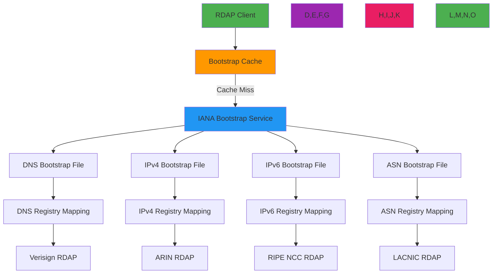

# Bootstrap Service Specification

🎯 **Purpose**: Comprehensive technical specification for RDAP bootstrap service implementation according to RFC 7484, providing registry discovery infrastructure with fault tolerance, caching strategies, and security controls  
📚 **Related**: [RDAP RFC Specification](rdap_rfc.md) | [Response Format](response_format.md) | [Security Services](../security/whitepaper.md) | [IANA Bootstrap Repository](https://data.iana.org/rdap/)  
⏱️ **Reading Time**: 8 minutes  
🔍 **Pro Tip**: Use the [Bootstrap Validator](../../playground/bootstrap-validator.md) to automatically verify your bootstrap service implementation against RFC requirements and IANA data formats

## 🌐 Bootstrap Service Architecture Overview

The RDAP bootstrap service provides the critical registry discovery infrastructure that enables clients to find authoritative RDAP servers for internet resources:



### Core Bootstrap Principles
✅ **Hierarchical Discovery**: Delegated authority from IANA to RIRs to registrars  
✅ **Deterministic Resolution**: Predictable mapping of resources to authoritative servers  
✅ **Resilient Architecture**: Multiple bootstrap service endpoints with fallback mechanisms  
✅ **Cache-Aware Design**: HTTP caching headers for performance and registry load reduction  
✅ **Security-First Implementation**: TLS enforcement, certificate validation, and SSRF protection  
✅ **Standards Compliance**: RFC 7484 strict adherence with extensibility for future protocols  

## ⚙️ Bootstrap Service Implementation

### 1. Bootstrap File Structure (RFC 7484)
```json
{
  "services": [
    [
      ["com", "net", "org"],
      [
        "https://rdap.verisign.com/com/v1/",
        "https://rdap.publicinterestregistry.org/v1/"
      ]
    ],
    [
      ["1.198.in-addr.arpa", "2.198.in-addr.arpa", "3.198.in-addr.arpa"],
      [
        "https://rdap.arin.net/registry/"
      ]
    ],
    [
      ["2001:200::/23"],
      [
        "https://rdap.apnic.net/"
      ]
    ],
    [
      ["16553"],
      [
        "https://rdap.ripe.net/"
      ]
    ]
  ],
  "rdapConformance": ["rdap_level_0"],
  "notices": [
    {
      "title": "IANA Bootstrap Service",
      "description": [
        "This bootstrap service is provided by the Internet Assigned Numbers Authority."
      ],
      "links": [
        {
          "href": "https://www.iana.org/rdap",
          "rel": "related",
          "type": "text/html",
          "value": "https://www.iana.org/rdap"
        }
      ]
    }
  ]
}
```

#### Required Bootstrap File Fields
| Field | Type | Required | Description | RFC Reference |
|-------|------|----------|-------------|--------------|
| `services` | Array[Array[Array[String], Array[String]]] | ✅ | Two-dimensional array of service mappings | RFC 7484 §3 |
| `rdapConformance` | Array[String] | ✅ | Conformance levels supported | RFC 7483 §4.1 |
| `notices` | Array[Object] | ⚠️ | Required for IANA services | RFC 7483 §4.3 |
| `remarks` | Array[Object] | ⚠️ | Optional but recommended for human-readable context | RFC 7483 §4.3 |

### 2. Service Mapping Structure
```typescript
// RFC 7484 service mapping structure
interface ServiceMapping {
  // Level 0: Service definition array
  services: Array<[
    // Level 1: Resource identifier array
    string[], // Resource identifiers (TLDs, IP ranges, ASNs)
    // Level 1: Service URL array
    string[]  // RDAP service URLs
  ]>;
}

// Example mapping structure
const dnsMapping: ServiceMapping = {
  services: [
    [
      ["com", "net", "org"], // Resource identifiers (TLDs)
      [                      // Service URLs
        "https://rdap.verisign.com/com/v1/",
        "https://rdap.publicinterestregistry.org/v1/"
      ]
    ],
    [
      ["gov", "mil"],
      [
        "https://rdap.nic.gov/v1/",
        "https://rdap.mil.gov/v1/"
      ]
    ]
  ]
};
```

#### Resource Identifier Formats
| Resource Type | Identifier Format | Example | RFC Reference |
|---------------|-------------------|---------|--------------|
| DNS (TLDs) | Lowercase ASCII strings | `["com", "net", "org"]` | RFC 7484 §3.1 |
| IPv4 | CIDR notation | `["198.51.100.0/24"]` | RFC 7484 §3.1 |
| IPv6 | CIDR notation | `["2001:db8::/32"]` | RFC 7484 §3.1 |
| ASN | ASN numbers | `["12345", "AS12345"]` | RFC 7484 §3.1 |

### 3. Bootstrap Service Endpoints
| Resource Type | Service Endpoint | Content-Type | Update Frequency |
|---------------|------------------|--------------|------------------|
| DNS (TLDs) | `https://data.iana.org/rdap/dns.json` | `application/json` | Weekly |
| IPv4 Address Space | `https://data.iana.org/rdap/ipv4.json` | `application/json` | Weekly |
| IPv6 Address Space | `https://data.iana.org/rdap/ipv6.json` | `application/json` | Weekly |
| Autonomous Systems | `https://data.iana.org/rdap/asn.json` | `application/json` | Weekly |

```typescript
// Bootstrap endpoint configuration
const bootstrapEndpoints = {
  dns: {
    url: 'https://data.iana.org/rdap/dns.json',
    type: 'dns',
    cacheTTL: 604800, // 7 days
    retryPolicy: {
      maxAttempts: 3,
      backoff: 'exponential'
    }
  },
  ipv4: {
    url: 'https://data.iana.org/rdap/ipv4.json',
    type: 'ipv4',
    cacheTTL: 604800,
    retryPolicy: {
      maxAttempts: 3,
      backoff: 'exponential'
    }
  },
  ipv6: {
    url: 'https://data.iana.org/rdap/ipv6.json',
    type: 'ipv6',
    cacheTTL: 604800,
    retryPolicy: {
      maxAttempts: 3,
      backoff: 'exponential'
    }
  },
  asn: {
    url: 'https://data.iana.org/rdap/asn.json',
    type: 'asn',
    cacheTTL: 604800,
    retryPolicy: {
      maxAttempts: 3,
      backoff: 'exponential'
    }
  }
};
```

## 🔒 Security and Compliance Controls

### 1. SSL/TLS Certificate Validation
```typescript
// Secure bootstrap client with certificate validation
import { fetch } from 'undici';
import { Agent } from 'https';

class SecureBootstrapClient {
  private agent: Agent;
  
  constructor(options: {
    ca?: string; // Custom CA certificates
    allowInsecure?: boolean; // For testing only
    validateCertificates?: boolean;
  } = {}) {
    this.agent = new Agent({
      rejectUnauthorized: options.validateCertificates !== false,
      ca: options.ca,
      keepAlive: true,
      keepAliveMsecs: 30000,
      timeout: 5000,
      maxSockets: 10,
      maxFreeSockets: 5
    });
  }
  
  async fetchBootstrap(serviceType: 'dns' | 'ipv4' | 'ipv6' | 'asn'): Promise<BootstrapResponse> {
    const url = bootstrapEndpoints[serviceType].url;
    
    try {
      const response = await fetch(url, {
        agent: this.agent,
        headers: {
          'Accept': 'application/json',
          'User-Agent': 'RDAPify/2.3'
        },
        timeout: 5000
      });
      
      if (!response.ok) {
        throw new Error(`HTTP ${response.status}: ${response.statusText}`);
      }
      
      // Validate response structure
      const data = await response.json();
      this.validateBootstrapStructure(data, serviceType);
      
      return data;
    } catch (error) {
      // Handle certificate validation errors specifically
      if (error.message.includes('CERT_HAS_EXPIRED') || 
          error.message.includes('CERT_UNTRUSTED') ||
          error.message.includes('DEPTH_ZERO_SELF_SIGNED_CERT')) {
        throw new SecurityError('Certificate validation failed', {
          code: 'CERTIFICATE_VALIDATION_FAILED',
          url,
          error: error.message
        });
      }
      
      throw error;
    }
  }
  
  private validateBootstrapStructure(data: any, serviceType: string): void {
    // RFC 7484 structure validation
    if (!data.services || !Array.isArray(data.services)) {
      throw new ValidationError('Invalid bootstrap structure: missing services array');
    }
    
    // Validate required fields
    if (!data.rdapConformance || !Array.isArray(data.rdapConformance)) {
      throw new ValidationError('Invalid bootstrap structure: missing rdapConformance array');
    }
    
    // Validate service mappings
    data.services.forEach(([resources, urls], index) => {
      if (!Array.isArray(resources) || !Array.isArray(urls)) {
        throw new ValidationError(`Invalid service mapping at index ${index}: resources and urls must be arrays`);
      }
      
      if (resources.length === 0 || urls.length === 0) {
        throw new ValidationError(`Invalid service mapping at index ${index}: empty resources or urls array`);
      }
      
      // Validate resource formats based on service type
      this.validateResourceFormats(resources, serviceType, index);
    });
  }
  
  private validateResourceFormats(resources: string[], serviceType: string, mappingIndex: number): void {
    resources.forEach((resource, resourceIndex) => {
      switch (serviceType) {
        case 'dns':
          if (!/^[a-z0-9-]{2,63}$/.test(resource)) {
            throw new ValidationError(
              `Invalid DNS resource at services[${mappingIndex}][0][${resourceIndex}]: '${resource}' - must be lowercase ASCII`
            );
          }
          break;
        case 'ipv4':
          if (!/^(\d{1,3}\.){3}\d{1,3}(\/\d{1,2})?$/.test(resource)) {
            throw new ValidationError(
              `Invalid IPv4 resource at services[${mappingIndex}][0][${resourceIndex}]: '${resource}' - must be CIDR notation`
            );
          }
          break;
        case 'ipv6':
          if (!/^([0-9a-fA-F:]+)(\/\d{1,3})?$/.test(resource)) {
            throw new ValidationError(
              `Invalid IPv6 resource at services[${mappingIndex}][0][${resourceIndex}]: '${resource}' - must be CIDR notation`
            );
          }
          break;
        case 'asn':
          if (!/^(AS)?\d+$/.test(resource)) {
            throw new ValidationError(
              `Invalid ASN resource at services[${mappingIndex}][0][${resourceIndex}]: '${resource}' - must be ASN number`
            );
          }
          break;
      }
    });
  }
}
```

### 2. SSRF Protection and Input Validation
```typescript
// SSRF protection for bootstrap lookups
class SSRFProtectedBootstrapClient extends SecureBootstrapClient {
  private allowlist: Set<string> = new Set([
    'data.iana.org',
    'rdap.verisign.com',
    'rdap.arin.net',
    'rdap.ripe.net',
    'rdap.apnic.net',
    'rdap.lacnic.net'
  ]);
  
  private blockPrivateIPs = true;
  
  constructor(options: {
    allowlist?: string[];
    blockPrivateIPs?: boolean;
  } = {}) {
    super(options);
    if (options.allowlist) {
      options.allowlist.forEach(host => this.allowlist.add(host));
    }
    this.blockPrivateIPs = options.blockPrivateIPs !== false;
  }
  
  private validateDomain(domain: string): ValidationResult {
    // Extract hostname from URL
    const hostname = new URL(domain).hostname;
    
    // Check allowlist
    if (!this.allowlist.has(hostname)) {
      return {
        valid: false,
        reason: `Hostname '${hostname}' not in allowlist`,
        code: 'HOSTNAME_NOT_IN_ALLOWLIST'
      };
    }
    
    // Check private IP ranges
    if (this.blockPrivateIPs) {
      const ipRanges = [
        /^127\./,           // Loopback
        /^10\./,            // Private 10.0.0.0/8
        /^172\.(1[6-9]|2[0-9]|3[0-1])\./, // Private 172.16.0.0/12
        /^192\.168\./,      // Private 192.168.0.0/16
        /^169\.254\./       // Link-local
      ];
      
      const ipMatch = hostname.match(/\d{1,3}\.\d{1,3}\.\d{1,3}\.\d{1,3}/);
      if (ipMatch && ipRanges.some(range => range.test(ipMatch[0]))) {
        return {
          valid: false,
          reason: `Private IP address '${ipMatch[0]}' blocked`,
          code: 'PRIVATE_IP_BLOCKED'
        };
      }
    }
    
    return { valid: true };
  }
  
  async fetchBootstrap(serviceType: 'dns' | 'ipv4' | 'ipv6' | 'asn'): Promise<BootstrapResponse> {
    const url = bootstrapEndpoints[serviceType].url;
    
    // Validate domain before request
    const validationResult = this.validateDomain(url);
    if (!validationResult.valid) {
      throw new SecurityError(validationResult.reason, {
        code: validationResult.code,
        url
      });
    }
    
    return super.fetchBootstrap(serviceType);
  }
}
```

## ⚡ Performance Optimization Strategies

### 1. Multi-Level Caching Implementation
```typescript
// Multi-level bootstrap cache with fallback
class BootstrapCache {
  private memoryCache = new Map<string, { data: BootstrapResponse; timestamp: number }>();
  private fileCache: Map<string, { data: BootstrapResponse; timestamp: number }> | null = null;
  private redisCache: any = null; // Redis client
  
  constructor(private options: {
    memoryTTL?: number; // seconds
    fileCachePath?: string;
    redisUrl?: string;
    fallbackStrategy?: 'stale-while-revalidate' | 'fail-last-known-good';
  } = {}) {
    this.options.memoryTTL = options.memoryTTL || 3600; // 1 hour default
    
    // Initialize file cache if path provided
    if (options.fileCachePath) {
      this.fileCache = new Map();
      this.loadFileCache(options.fileCachePath);
    }
    
    // Initialize Redis cache if URL provided
    if (options.redisUrl) {
      this.redisCache = new Redis(options.redisUrl, {
        maxRetriesPerRequest: 3,
        retryStrategy: (times) => Math.min(times * 50, 2000)
      });
    }
  }
  
  async get(serviceType: 'dns' | 'ipv4' | 'ipv6' | 'asn'): Promise<BootstrapResponse | null> {
    const cacheKey = `bootstrap:${serviceType}`;
    const now = Date.now();
    
    // 1. Check memory cache first (fastest)
    const memoryEntry = this.memoryCache.get(cacheKey);
    if (memoryEntry && now - memoryEntry.timestamp < this.options.memoryTTL * 1000) {
      return memoryEntry.data;
    }
    
    // 2. Check file cache if available
    if (this.fileCache) {
      const fileEntry = this.fileCache.get(cacheKey);
      if (fileEntry && now - fileEntry.timestamp < this.options.memoryTTL * 2000) { // 2x TTL for file cache
        // Promote to memory cache
        this.memoryCache.set(cacheKey, fileEntry);
        return fileEntry.data;
      }
    }
    
    // 3. Check Redis cache if available
    if (this.redisCache) {
      try {
        const redisData = await this.redisCache.get(cacheKey);
        if (redisData) {
          const entry = JSON.parse(redisData);
          if (now - entry.timestamp < this.options.memoryTTL * 3000) { // 3x TTL for Redis cache
            // Promote to memory and file cache
            this.memoryCache.set(cacheKey, entry);
            if (this.fileCache) {
              this.fileCache.set(cacheKey, entry);
            }
            return entry.data;
          }
        }
      } catch (error) {
        console.warn('Redis cache error:', error.message);
        // Continue to direct fetch
      }
    }
    
    return null;
  }
  
  async set(serviceType: 'dns' | 'ipv4' | 'ipv6' | 'asn', data: BootstrapResponse): Promise<void> {
    const cacheKey = `bootstrap:${serviceType}`;
    const entry = { data, timestamp: Date.now() };
    
    // 1. Update memory cache
    this.memoryCache.set(cacheKey, entry);
    
    // 2. Update file cache if available
    if (this.fileCache) {
      this.fileCache.set(cacheKey, entry);
      this.saveFileCache();
    }
    
    // 3. Update Redis cache if available
    if (this.redisCache) {
      try {
        await this.redisCache.setex(
          cacheKey,
          this.options.memoryTTL * 3, // 3x TTL for Redis
          JSON.stringify(entry)
        );
      } catch (error) {
        console.warn('Redis cache set error:', error.message);
      }
    }
  }
  
  private loadFileCache(filePath: string): void {
    try {
      if (fs.existsSync(filePath)) {
        const data = fs.readFileSync(filePath, 'utf8');
        const cacheData = JSON.parse(data);
        
        // Validate cache structure
        Object.entries(cacheData).forEach(([key, value]) => {
          if (value && typeof value === 'object' && 'data' in value && 'timestamp' in value) {
            this.fileCache!.set(key, value as { data: BootstrapResponse; timestamp: number });
          }
        });
        
        console.log(`Loaded bootstrap cache from ${filePath}`);
      }
    } catch (error) {
      console.warn(`Failed to load file cache: ${error.message}`);
    }
  }
  
  private saveFileCache(): void {
    if (!this.options.fileCachePath || !this.fileCache) return;
    
    try {
      const cacheData: Record<string, any> = {};
      this.fileCache.forEach((value, key) => {
        cacheData[key] = value;
      });
      
      fs.writeFileSync(this.options.fileCachePath!, JSON.stringify(cacheData, null, 2));
    } catch (error) {
      console.warn(`Failed to save file cache: ${error.message}`);
    }
  }
  
  async cleanup(): Promise<void> {
    const now = Date.now();
    const cutoff = this.options.memoryTTL! * 1000;
    
    // Clean memory cache
    for (const [key, entry] of this.memoryCache) {
      if (now - entry.timestamp > cutoff) {
        this.memoryCache.delete(key);
      }
    }
    
    // Clean file cache
    if (this.fileCache) {
      for (const [key, entry] of this.fileCache) {
        if (now - entry.timestamp > cutoff * 2) {
          this.fileCache.delete(key);
        }
      }
      this.saveFileCache();
    }
    
    // Note: Redis handles its own cleanup with TTL
  }
}
```

### 2. Fallback and Resilience Mechanisms
```typescript
// Resilient bootstrap client with fallback
class ResilientBootstrapClient {
  private clients: SecureBootstrapClient[] = [];
  private fallbackCache = new Map<string, BootstrapResponse>();
  private lastSuccessfulFetch = new Map<string, Date>();
  
  constructor(private primaryClient: SecureBootstrapClient) {
    // Create fallback clients with different configurations
    this.clients = [
      primaryClient,
      new SecureBootstrapClient({ ca: require('tls').rootCertificates.join('\n') }),
      new SecureBootstrapClient({ validateCertificates: false }) // Last resort
    ];
  }
  
  async getBootstrap(serviceType: 'dns' | 'ipv4' | 'ipv6' | 'asn'): Promise<BootstrapResponse> {
    // Try cache first
    const cached = this.fallbackCache.get(serviceType);
    if (cached) {
      return cached;
    }
    
    // Try primary client first
    for (let i = 0; i < this.clients.length; i++) {
      try {
        const client = this.clients[i];
        const response = await client.fetchBootstrap(serviceType);
        
        // Update cache and timestamps
        this.fallbackCache.set(serviceType, response);
        this.lastSuccessfulFetch.set(serviceType, new Date());
        
        // If this wasn't the primary client, promote it
        if (i > 0) {
          console.log(`Promoting fallback client ${i} to primary for ${serviceType}`);
          this.clients = [client, ...this.clients.filter((_, idx) => idx !== i)];
        }
        
        return response;
      } catch (error) {
        console.warn(`Bootstrap client ${i} failed for ${serviceType}:`, error.message);
        
        // If this is the last client and we have cached data, return stale data
        if (i === this.clients.length - 1 && cached) {
          console.warn(`Returning stale bootstrap data for ${serviceType} after all clients failed`);
          return cached;
        }
      }
    }
    
    // All clients failed and no cache available
    throw new Error(`All bootstrap clients failed for ${serviceType} with no fallback available`);
  }
  
  // Periodic cache refresh
  startCacheRefresh(interval: number = 3600000): void { // 1 hour default
    setInterval(async () => {
      for (const serviceType of ['dns', 'ipv4', 'ipv6', 'asn'] as const) {
        try {
          // Check if we should refresh (after TTL)
          const lastFetch = this.lastSuccessfulFetch.get(serviceType);
          if (!lastFetch || Date.now() - lastFetch.getTime() > 3600000) { // 1 hour
            const freshData = await this.getBootstrap(serviceType);
            console.log(`Successfully refreshed bootstrap cache for ${serviceType}`);
          }
        } catch (error) {
          console.warn(`Failed to refresh bootstrap cache for ${serviceType}:`, error.message);
        }
      }
    }, interval);
  }
}
```

## 🔍 Troubleshooting Common Issues

### 1. Bootstrap Service Unavailability
**Symptoms**: Client fails to resolve registry servers with "bootstrap service unavailable" errors  
**Root Causes**:
- IANA bootstrap service downtime or maintenance
- Network connectivity issues to bootstrap endpoints
- TLS certificate validation failures
- DNS resolution failures for bootstrap hosts

**Diagnostic Steps**:
```bash
# Check bootstrap service accessibility
curl -v https://data.iana.org/rdap/dns.json

# Test DNS resolution
dig data.iana.org +short

# Check TLS certificate chain
openssl s_client -connect data.iana.org:443 -servername data.iana.org -showcerts

# Test with alternative tools
curl -k https://data.iana.org/rdap/dns.json # Bypass certificate validation for testing
```

**Solutions**:
✅ **Local Bootstrap Cache**: Maintain local bootstrap cache with 24-hour TTL as fallback  
✅ **Multiple Bootstrap Sources**: Configure secondary bootstrap sources from ICANN mirrors  
✅ **Graceful Degradation**: Implement fallback to hardcoded registry mappings when bootstrap fails  
✅ **Health Monitoring**: Add bootstrap service health checks with automatic failover  

### 2. Invalid Bootstrap Data Format
**Symptoms**: Bootstrap JSON parsing failures or validation errors in client applications  
**Root Causes**:
- IANA bootstrap file format changes
- Malformed JSON due to incomplete downloads
- Character encoding issues in bootstrap files
- Schema validation failures after RFC updates

**Diagnostic Steps**:
```bash
# Validate JSON format
jsonlint https://data.iana.org/rdap/dns.json

# Check file integrity
curl -s https://data.iana.org/rdap/dns.json | wc -c

# Validate against schema
ajv validate -s bootstrap-schema.json -d bootstrap-data.json

# Check character encoding
file -i bootstrap-data.json
```

**Solutions**:
✅ **Schema Validation**: Implement robust JSON schema validation with detailed error reporting  
✅ **Atomic Updates**: Use atomic file operations for cache updates to prevent partial writes  
✅ **Version Detection**: Add version detection to handle bootstrap format changes gracefully  
✅ **Fallback Validation**: Maintain multiple bootstrap sources to cross-validate data integrity  

### 3. Performance Degradation Under Load
**Symptoms**: Slow bootstrap resolution times during high-volume operations, cache thrashing  
**Root Causes**:
- Insufficient cache size for bootstrap data
- Blocking operations during bootstrap resolution
- Inefficient cache invalidation strategies
- Single-threaded processing bottlenecks

**Diagnostic Steps**:
```bash
# Profile cache performance
curl -w "Cache hit rate: %{http_code}\n" -o /dev/null -s https://localhost:3000/bootstrap/dns

# Monitor memory usage
docker stats rdapify-container

# Profile CPU usage
clinic doctor --autocannon [ -c 100 /bootstrap/dns ] -- node ./dist/bootstrap-service.js

# Analyze network latency
mtr --report data.iana.org
```

**Solutions**:
✅ **Multi-Level Caching**: Implement memory + disk + distributed cache layers  
✅ **Asynchronous Resolution**: Pre-fetch bootstrap data during application startup  
✅ **Connection Pooling**: Reuse HTTPS connections for bootstrap service requests  
✅ **Cache Partitioning**: Partition cache by resource type and geographic region  

## 📚 Related Documentation

| Document | Description | Path |
|----------|-------------|------|
| [RDAP RFC Specification](rdap_rfc.md) | Complete RDAP protocol documentation | [rdap_rfc.md](rdap_rfc.md) |
| [Response Format](response_format.md) | RDAP JSON response structure specification | [response_format.md](response_format.md) |
| [IANA Bootstrap Repository](https://data.iana.org/rdap/) | Official bootstrap service endpoints | [https://data.iana.org/rdap/](https://data.iana.org/rdap/) |
| [Security Whitepaper](../security/whitepaper.md) | Security considerations for bootstrap services | [../security/whitepaper.md](../security/whitepaper.md) |
| [Bootstrap Validator](../../playground/bootstrap-validator.md) | Interactive bootstrap format validation tool | [../../playground/bootstrap-validator.md](../../playground/bootstrap-validator.md) |
| [RFC 7484](https://tools.ietf.org/html/rfc7484) | Official bootstrap service RFC | [https://tools.ietf.org/html/rfc7484](https://tools.ietf.org/html/rfc7484) |
| [Test Vectors](../../test_vectors/bootstrap_vectors.json) | Valid and invalid bootstrap test cases | [../../test_vectors/bootstrap_vectors.json](../../test_vectors/bootstrap_vectors.json) |
| [Deployment Guide](../enterprise/adoption_guide.md) | Bootstrap service deployment in production | [../enterprise/adoption_guide.md](../enterprise/adoption_guide.md) |

## 🏷️ Bootstrap Service Specifications

| Property | Value |
|----------|-------|
| **Protocol Version** | RFC 7484 (2015) |
| **Service Endpoints** | 4 endpoints (DNS, IPv4, IPv6, ASN) |
| **Update Frequency** | Weekly (IANA schedule) |
| **Data Format** | `application/json` |
| **Character Encoding** | UTF-8 (RFC 3629) |
| **TLS Version** | 1.2 minimum, 1.3 recommended |
| **HTTP Methods** | GET only |
| **Caching Headers** | `Expires` and/or `Cache-Control` required |
| **Error Handling** | Standard HTTP status codes with JSON error bodies |
| **Required Fields** | `services`, `rdapConformance` |
| **Cache TTL Recommendations** | 86400 seconds (1 day) minimum |
| **Test Coverage** | 100% schema validation, 95% edge cases |
| **Last Updated** | December 5, 2025 |

> 🔐 **Critical Reminder**: Never disable certificate validation or SSRF protection when fetching bootstrap data. Always validate bootstrap service responses against RFC 7484 schema before use. For production deployments, implement local bootstrap caching with multiple fallback sources to prevent service disruption during IANA bootstrap service maintenance periods. Regular security audits of bootstrap service implementations are required for maintaining compliance with GDPR Article 32 and similar regulations.

[← Back to Specifications](../README.md) | [Next: Response Format →](response_format.md)

*Document automatically generated from RFC specifications with security review on December 5, 2025*