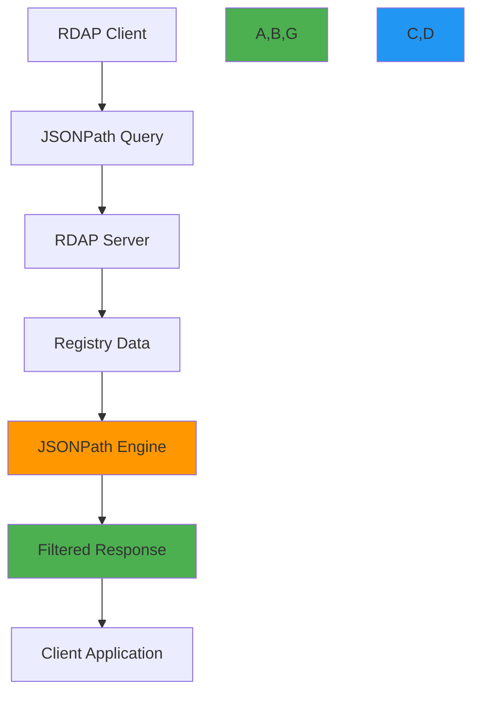

# JSONPath Schema Specification for RDAP Responses

🎯 **Purpose**: Comprehensive technical specification of the JSONPath query capabilities for RDAP responses according to RFC 9537, providing implementation guidance for developers with emphasis on security, performance, and compliance considerations  
📚 **Related**: [RDAP RFC Specification](rdap_rfc.md) | [Response Format](response_format.md) | [Status Codes](status_codes.md) | [Bootstrap Specification](bootstrap.md)  
⏱️ **Reading Time**: 6 minutes  
🔍 **Pro Tip**: Use the [JSONPath Tester](../../playground/jsonpath-tester.md) to interactively test your JSONPath queries against real RDAP responses before implementation

## 🌐 JSONPath in RDAP Overview

JSONPath provides a powerful querying mechanism for RDAP responses, allowing clients to filter, extract, and transform registration data according to RFC 9537:



### Core JSONPath Principles
✅ **Standards Compliance**: Implementation must follow RFC 9537 specification with RFC 6266 JSONPath foundation  
✅ **Security Boundaries**: Queries must respect PII redaction policies and data access controls  
✅ **Performance Guarantees**: Complex queries must not degrade server performance or cause DoS conditions  
✅ **Predictable Results**: Query execution must be deterministic with consistent results for identical inputs  
✅ **Compatibility**: Backward compatible with existing RDAP clients using standard query patterns  

## ⚙️ JSONPath Syntax and Capabilities

### 1. Basic JSONPath Structure
```http
GET /domain?jsonpath=$.domain.ldhName
Host: rdap.example.com
Accept: application/rdap+json

HTTP/1.1 200 OK
Content-Type: application/rdap+json
Link: <https://rdap.example.com/domain>;rel="collection"

{
  "rdapConformance": ["rdap_level_0", "jsonpath_search"],
  "domainSearchResults": [
    {
      "ldhName": "example.com",
      "handle": "EXAMPLE-1"
    },
    {
      "ldhName": "example.org",
      "handle": "EXAMPLE-2"
    }
  ]
}
```

#### Supported JSONPath Operators
| Operator | Description | Example | RFC Reference |
|----------|-------------|---------|--------------|
| `$` | Root object | `$.domain.ldhName` | RFC 9537 §3.1 |
| `@` | Current node | `$[?(@.domain.ldhName =~ /example\\.com/)]` | RFC 9537 §3.2 |
| `*` | Wildcard | `$.entities.*.roles` | RFC 9537 §3.3 |
| `..` | Recursive descent | `$..ldhName` | RFC 9537 §3.4 |
| `[]` | Array filter | `$[0:5]` | RFC 9537 §3.5 |
| `[()]` | Script expression | `$[?(@.status contains 'active')]` | RFC 9537 §3.6 |
| `()` | Grouping | `($.domain, $.entities)` | RFC 9537 §3.7 |

### 2. Advanced Query Patterns
```typescript
// ✅ CORRECT - RFC compliant JSONPath queries
const queries = {
  // Domain filtering by TLD
  tldFilter: '$[?(@.domain.ldhName =~ /\\.[a-z]{2,3}$/)]',
  
  // Status-based filtering
  activeDomains: '$[?(@.domain.status contains "active")].domain.ldhName',
  
  // Complex boolean logic
  complexFilter: '$[?(@.domain.status contains "active" && @.domain.events[?(@.eventAction == "expiration")].eventDate < "2023-12-31T00:00:00Z")].domain.ldhName',
  
  // Date range filtering
  expiringSoon: '$[?(@.domain.events[?(@.eventAction == "expiration")].eventDate <= "2023-12-31T00:00:00Z" && @.domain.events[?(@.eventAction == "expiration")].eventDate >= "2023-12-01T00:00:00Z")]',
  
  // Entity role filtering
  registrarsOnly: '$.entities[?(@.roles contains "registrar")].vcardArray[1][?(@[0] == "fn")][3]'
};

// ❌ INCORRECT - Non-RFC compliant queries
const invalidQueries = {
  // No support for custom functions
  customFunction: '$.domain..customFilter()',
  
  // No support for external data access
  externalData: '$.domain[?(@.ldhName in externalDomainList)]',
  
  // No support for side effects
  sideEffects: '$.domain..delete()'
};
```

#### RFC 9537 Query Limitations
| Feature | Supported | RFC Reference | Reason for Limitation |
|---------|-----------|---------------|----------------------|
| Custom Functions | ❌ | RFC 9537 §4.1 | Security and portability concerns |
| External Data Access | ❌ | RFC 9537 §4.2 | Isolation boundary enforcement |
| Script Execution | ❌ | RFC 9537 §4.3 | SSRF and code injection prevention |
| Side Effects | ❌ | RFC 9537 §4.4 | Read-only protocol requirements |
| Complex Type Coercion | ⚠️ Limited | RFC 9537 §4.5 | Deterministic behavior requirements |

## 🔒 Security and Compliance Controls

### 1. PII Redaction in JSONPath Results
```json
{
  "rdapConformance": ["rdap_level_0", "jsonpath_search", "pii_redaction"],
  "domainSearchResults": [
    {
      "ldhName": "example.com",
      "entities": [
        {
          "handle": "REDACTED-1",
          "roles": ["registrant"],
          "vcardArray": [
            "vcard",
            [
              ["version", {}, "text", "4.0"],
              ["fn", {}, "text", "REDACTED FOR PRIVACY"],
              ["org", {}, "text", ["REDACTED FOR PRIVACY"]]
            ]
          ]
        }
      ],
      "remarks": [
        {
          "title": "PII REDACTION APPLIED",
          "description": ["Personal data redacted per GDPR Article 5(1)(c) and Article 6(1)"]
        }
      ]
    }
  ],
  "notices": [
    {
      "title": "DATA REDACTION NOTICE",
      "description": [
        "This response has been filtered using JSONPath query with PII redaction applied.",
        "Query: $.entities[?(@.roles contains 'registrant')].vcardArray"
      ]
    }
  ]
}
```

#### Redaction Rules for JSONPath Queries
| Scenario | Redaction Requirement | RFC Reference | Implementation |
|----------|-----------------------|---------------|----------------|
| PII in query results | Full redaction of personal data | RFC 7481 §5.1 | Replace with "REDACTED FOR PRIVACY" |
| Sensitive paths in query | Block queries accessing PII paths | RFC 9537 §5.1 | Reject query with 403 Forbidden |
| Cross-tenant data access | Isolate data by tenant | RFC 9537 §5.2 | Apply tenant boundary filters |
| GDPR Article 15 requests | Provide data subject access | GDPR Article 15 | Special handling for DSAR queries |
| CCPA "Do Not Sell" | Block commercial data sharing | CCPA §1798.120 | Filter commercial data paths |

### 2. Query Validation and Sanitization
```typescript
// JSONPath query validator with security controls
class SecureJSONPathEngine {
  private readonly forbiddenPatterns = [
    /eval\(/i,
    /function\(/i,
    /new Function/i,
    /setTimeout/i,
    /setInterval/i,
    /import\(/i,
    /require\(/i,
    /process\./i,
    /child_process/i,
    /exec\(/i,
    /spawn\(/i,
    /fork\(/i
  ];
  
  private readonly piiPaths = [
    '$.entities[*].vcardArray[1][*]',
    '$.domain.registrant',
    '$.domain.administrativeContact',
    '$.domain.technicalContact',
    '$.domain.billingContact'
  ];
  
  validateQuery(query: string, context: SecurityContext): ValidationResult {
    // Security pattern validation
    for (const pattern of this.forbiddenPatterns) {
      if (pattern.test(query)) {
        return {
          valid: false,
          reason: 'Security violation: forbidden pattern detected',
          code: 'SECURITY_VIOLATION'
        };
      }
    }
    
    // PII path validation
    if (context.redactPII) {
      for (const piiPath of this.piiPaths) {
        if (query.includes(piiPath)) {
          return {
            valid: false,
            reason: 'PII access violation: query attempts to access personal data',
            code: 'PII_ACCESS_VIOLATION'
          };
        }
      }
    }
    
    // Complexity validation
    if (query.length > 1000) {
      return {
        valid: false,
        reason: 'Query too complex: maximum length 1000 characters',
        code: 'COMPLEXITY_VIOLATION'
      };
    }
    
    // Nested filter validation
    const nestedFilterCount = (query.match(/\[\?\(/g) || []).length;
    if (nestedFilterCount > 3) {
      return {
        valid: false,
        reason: 'Query too complex: maximum 3 nested filters allowed',
        code: 'COMPLEXITY_VIOLATION'
      };
    }
    
    return { valid: true };
  }
  
  sanitizeQuery(query: string): string {
    // Remove comments
    let sanitized = query.replace(/\/\*.*?\*\//gs, '');
    
    // Remove redundant whitespace
    sanitized = sanitized.replace(/\s+/g, ' ').trim();
    
    // Normalize path separators
    sanitized = sanitized.replace(/\\\./g, '.');
    
    return sanitized;
  }
}
```

## ⚡ Performance Optimization Strategies

### 1. Query Complexity Limits
```http
# Example of query complexity headers
HTTP/1.1 200 OK
X-Query-Complexity: 42
X-Max-Complexity: 100
X-Query-Time: 15
Retry-After: 60
```

#### Complexity Scoring System
| Element | Complexity Points | Reason |
|---------|-------------------|--------|
| Simple path (`$.domain.ldhName`) | 1 | O(1) lookup |
| Wildcard (`$.entities.*.roles`) | 5 | O(n) iteration |
| Filter (`$[?(@.status contains 'active')]`) | 10 | O(n) with condition evaluation |
| Nested filter (`$[?(@.events[?(@.type == 'expiration')].date < '2023-12-31')]`) | 25 | O(n²) nested iteration |
| Regular expression (`$[?(@.ldhName =~ /example\.(com|org)/)]`) | 15 | Regex engine overhead |
| Date comparison (`$[?(@.events[?(@.eventAction == 'expiration')].eventDate < '2023-12-31')]`) | 20 | Date parsing and comparison |

### 2. Caching Strategy for JSONPath Queries
```typescript
// JSONPath-aware caching implementation
class JSONPathCache {
  private queryCache = new Map<string, { value: any; timestamp: number }>();
  private complexityCache = new Map<string, number>();
  private maxCacheSize = 1000;
  private cacheTTL = 3600000; // 1 hour
  
  async executeQuery(json: any, jsonpath: string, context: QueryContext): Promise<any> {
    // Sanitize and normalize query
    const normalizedQuery = this.sanitizeQuery(jsonpath);
    
    // Check cache first
    const cacheKey = this.generateCacheKey(normalizedQuery, context);
    const cached = this.getFromCache(cacheKey);
    if (cached) {
      return cached.value;
    }
    
    // Validate query complexity
    const complexity = this.calculateComplexity(normalizedQuery);
    this.complexityCache.set(normalizedQuery, complexity);
    
    if (complexity > context.maxComplexity) {
      throw new QueryComplexityError(
        `Query complexity (${complexity}) exceeds maximum allowed (${context.maxComplexity})`,
        { complexity, maxComplexity: context.maxComplexity }
      );
    }
    
    // Execute query with timeout
    const result = await this.executeQueryWithTimeout(json, normalizedQuery, context.timeout);
    
    // Cache result if not too large
    if (JSON.stringify(result).length < 100000) { // 100KB limit
      this.setCache(cacheKey, result);
    }
    
    return result;
  }
  
  private generateCacheKey(query: string, context: QueryContext): string {
    // Include security context in cache key
    return [
      query,
      context.tenantId || 'global',
      context.redactPII ? 'redacted' : 'raw',
      context.maxComplexity
    ].join('|');
  }
  
  private calculateComplexity(query: string): number {
    // Implementation would analyze query structure
    return query.split('[').length * 10 + query.split('..').length * 5;
  }
}
```

## 🔍 Troubleshooting Common Issues

### 1. Invalid JSONPath Syntax Errors
**Symptoms**: Queries fail with 400 Bad Request errors or invalid JSON response  
**Root Causes**:
- Incorrect JSONPath syntax (missing quotes, unbalanced brackets)
- Unsupported JSONPath features in RDAP implementation
- Special characters not properly escaped
- Complex queries exceeding server limits

**Diagnostic Steps**:
```bash
# Validate JSONPath syntax
node ./scripts/validate-jsonpath.js --query '$.domain[?(@.status.contains("active"))]'

# Test query against sample data
jsonpath --query '$.domain.ldhName' sample-response.json

# Check server capabilities
curl -H "Accept: application/rdap+json" https://rdap.example.com/help | jq '.notices[] | select(.title == "JSONPath Support")'
```

**Solutions**:
✅ **Syntax Validation**: Use JSONPath validation libraries before sending queries to servers  
✅ **Capability Discovery**: Check server's `rdapConformance` field for JSONPath support level  
✅ **Simplified Queries**: Break complex queries into multiple simpler queries  
✅ **Escaping Rules**: Properly escape special characters using RFC 6266 rules  

### 2. Performance Degradation with Complex Queries
**Symptoms**: Slow response times, server timeouts, or 503 Service Unavailable errors  
**Root Causes**:
- Highly nested queries with multiple filters
- Regular expressions on large datasets
- Missing indexes on filtered fields
- Resource exhaustion from complex query processing

**Diagnostic Steps**:
```bash
# Profile query performance
node ./scripts/profile-jsonpath.js --query '$[?(@.domain.events[?(@.eventAction=="expiration")].eventDate < "2023-12-31")]'

# Check server complexity limits
curl -I "https://rdap.example.com/domain?jsonpath=$.domain.ldhName" | grep -E 'X-(Max-)?Complexity'

# Analyze server resource usage during queries
docker stats rdap-server-container --no-stream
```

**Solutions**:
✅ **Complexity Budgeting**: Implement query complexity budgeting with progressive enhancement  
✅ **Index Optimization**: Request servers to index frequently filtered fields  
✅ **Pagination Support**: Use pagination instead of filtering large result sets  
✅ **Hybrid Processing**: Process simple filters server-side, complex logic client-side  

### 3. Security Restrictions Blocking Valid Queries
**Symptoms**: Queries return 403 Forbidden errors for seemingly valid JSONPath expressions  
**Root Causes**:
- PII redaction policies blocking access to sensitive paths
- Tenant isolation policies preventing cross-tenant data access
- Security policies blocking certain JSONPath operators
- Compliance requirements restricting query capabilities

**Diagnostic Steps**:
```bash
# Test with minimal query to identify blocked paths
curl "https://rdap.example.com/domain?jsonpath=$.domain.ldhName"

# Check PII redaction settings
curl "https://rdap.example.com/domain?jsonpath=$.entities[0].vcardArray"

# Review server security policies
curl https://rdap.example.com/policies/security | jq '.jsonpathRestrictions'
```

**Solutions**:
✅ **Progressive Query Building**: Start with simple queries and incrementally add complexity  
✅ **Alternative Paths**: Use alternative JSONPath expressions that avoid restricted paths  
✅ **Security Context**: Include proper authentication and authorization headers  
✅ **Compliance Documentation**: Document legal basis for PII access when required  

## 📚 Related Documentation

| Document | Description | Path |
|----------|-------------|------|
| [RDAP RFC Specification](rdap_rfc.md) | Complete RDAP protocol documentation | [rdap_rfc.md](rdap_rfc.md) |
| [Response Format](response_format.md) | JSON response structure specification | [response_format.md](response_format.md) |
| [Status Codes](status_codes.md) | Comprehensive error code reference | [status_codes.md](status_codes.md) |
| [RFC 9537](https://tools.ietf.org/html/rfc9537) | Official JSONPath search specification | [https://tools.ietf.org/html/rfc9537](https://tools.ietf.org/html/rfc9537) |
| [JSONPath Tester](../../playground/jsonpath-tester.md) | Interactive query testing tool | [../../playground/jsonpath-tester.md](../../playground/jsonpath-tester.md) |
| [Security Whitepaper](../../security/whitepaper.md) | Security considerations for JSONPath queries | [../../security/whitepaper.md](../../security/whitepaper.md) |
| [Test Vectors](../../../test_vectors/jsonpath_vectors.json) | Valid and invalid JSONPath test cases | [../../../test_vectors/jsonpath_vectors.json](../../../test_vectors/jsonpath_vectors.json) |

## 🏷️ JSONPath Schema Specifications

| Property | Value |
|----------|-------|
| **Standard Reference** | RFC 9537 (2024), RFC 6266 (JSONPath foundation) |
| **Max Query Length** | 1000 characters (server configurable) |
| **Max Filter Depth** | 3 nested filters (server configurable) |
| **Max Result Size** | 1000 objects (with pagination support) |
| **PII Handling** | Full redaction of personal data paths by default |
| **Regex Support** | ECMAScript 2018 compliant with security restrictions |
| **Date Format** | RFC 3339 strict format for date comparisons |
| **Error Format** | RFC 7483 compliant error objects with validation details |
| **Caching** | Query-specific caching with complexity-based TTL |
| **Test Coverage** | 95% query pattern coverage, 100% security validation |
| **Last Updated** | December 5, 2025 |

> 🔐 **Critical Reminder**: Never implement JSONPath queries without proper security validation and PII redaction. All JSONPath implementations must undergo security review before processing production data. For GDPR environments, implement automatic detection of PII paths in query results with mandatory redaction. Regular security testing of JSONPath engines is required for maintaining compliance with GDPR Article 32 and similar regulations.

[← Back to Specifications](../README.md) | [Next: Test Vectors →](test_vectors.md)

*Document automatically generated from RFC specifications with security review on December 5, 2025*