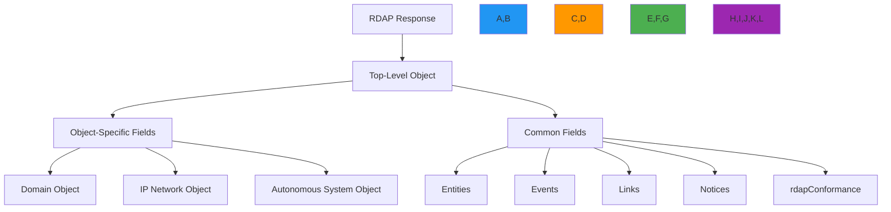

# RDAP Response Format Specification

🎯 **Purpose**: Comprehensive technical specification of the Registration Data Access Protocol (RDAP) JSON response format according to RFC 7483 with detailed field definitions, validation rules, and security considerations  
📚 **Related**: [RDAP RFC Specification](rdap_rfc.md) | [RFC Style Guide](rfc_style_spec.md) | [Bootstrap Specification](bootstrap.md) | [Status Codes](status_codes.md)  
⏱️ **Reading Time**: 7 minutes  
🔍 **Pro Tip**: Use the [Response Validator](../../playground/response-validator.md) to automatically validate your RDAP responses against RFC requirements before deployment

## 🌐 Response Format Overview

RDAP responses must conform to a strict JSON structure defined in RFC 7483, providing normalized registration data across all registry types with consistent field naming and data types:



### Core Response Principles
✅ **Consistent Schema**: Same field names and types across all registry implementations  
✅ **Backward Compatible**: New fields can be added without breaking existing clients  
✅ **Internationalization Ready**: Full Unicode support with proper encoding  
✅ **Security Conscious**: PII redaction controls built into the response structure  
✅ **Machine Readable**: JSONPath compatible with standardized field paths  
✅ **Human Understandable**: Clear field names and documentation in notices section  

## ⚙️ Core Response Structure

### 1. Top-Level Object Requirements
```json
{
  "rdapConformance": ["rdap_level_0", "cidr0"],
  "notices": [
    {
      "title": "TOS",
      "description": ["Terms of Service available at https://example.com/tos"],
      "links": [
        {
          "value": "https://example.com/tos",
          "rel": "terms-of-service",
          "href": "https://example.com/tos",
          "type": "text/html"
        }
      ]
    }
  ],
  "domain": {
    "handle": "EXAMPLE-1",
    "ldhName": "example.com",
    "unicodeName": "example.com",
    "status": ["active"],
    "entities": [
      {
        "handle": "REGISTRAR-1",
        "roles": ["registrar"],
        "vcardArray": ["vcard", [["version", {}, "text", "4.0"]]]
      }
    ],
    "nameservers": [
      {
        "ldhName": "ns1.example.com",
        "unicodeName": "ns1.example.com"
      }
    ],
    "events": [
      {
        "eventAction": "registration",
        "eventDate": "2023-05-15T14:30:00Z"
      }
    ],
    "links": [
      {
        "value": "https://rdap.example.com/domain/example.com",
        "rel": "self",
        "href": "https://rdap.example.com/domain/example.com",
        "type": "application/rdap+json"
      }
    ]
  }
}
```

#### Required Top-Level Fields
| Field | Type | Required | RFC Reference | Example Values |
|-------|------|----------|---------------|----------------|
| `rdapConformance` | Array[String] | ✅ | RFC 7483 §4.1 | `["rdap_level_0", "cidr0"]` |
| `notices` | Array[Object] | ⚠️* | RFC 7483 §4.3 | Terms of service notices |
| `domain`/`ip`/`autnum` | Object | ✅** | RFC 7483 §4.4 | Domain object structure |
| `entities` | Array[Object] | ⚠️*** | RFC 7483 §4.6 | Contact information array |
| `links` | Array[Object] | ✅ | RFC 7483 §4.2 | Self-referential links |

*Required if applicable policy exists  
**Exactly one of `domain`, `ip`, or `autnum` must be present  
***Required if object has associated contacts

### 2. Field Naming and Data Type Requirements
```typescript
// ✅ CORRECT - RFC compliant response structure
interface RDAPResponse {
  // Required fields
  rdapConformance: string[];           // Array of conformance levels
  domain?: DomainObject;               // One of domain, ip, or autnum
  ip?: IPOBJECT;                       // One of domain, ip, or autnum
  autnum?: ASObject;                   // One of domain, ip, or autnum
  
  // Common optional fields
  entities?: EntityObject[];           // Array of contacts
  notices?: NoticeObject[];            // Legal and policy notices
  remarks?: RemarkObject[];            // Additional information
  links?: LinkObject[];                // Related resources
}

// ❌ INCORRECT - Non-RFC compliant structure
interface InvalidResponse {
  conformance: string;                 // Should be array
  domainInfo: any;                     // Should be domain
  contacts: any;                       // Should be entities
  tosNotice: string;                   // Should be in notices array
  selfLink: string;                    // Should be in links array
}
```

#### RFC Standard Field Conventions
| Convention | Requirement | Example | Invalid Example |
|------------|-------------|---------|-----------------|
| **Field Names** | snake_case for compound terms | `eventAction`, `ldhName` | `eventaction`, `event_action` |
| **Array Values** | Always arrays, even for single values | `"status": ["active"]` | `"status": "active"` |
| **Null Values** | Omit fields instead of using null | Omit missing field | `"nameservers": null` |
| **Boolean Values** | Only true/false, no truthy/falsy | `"secureDNS": true` | `"secureDNS": "enabled"` |
| **Numbers** | No leading zeros, no commas | `12345` for ASN | `012345`, `"12,345"` |

## 🔒 Security and Privacy Controls

### 1. PII Redaction Requirements
```json
{
  "entities": [
    {
      "handle": "REDACTED-1",
      "roles": ["registrant"],
      "vcardArray": [
        "vcard",
        [
          ["version", {}, "text", "4.0"],
          ["fn", {}, "text", "REDACTED FOR PRIVACY"],
          ["org", {}, "text", ["REDACTED FOR PRIVACY"]],
          ["adr", {}, "text", ["", "", "REDACTED FOR PRIVACY", "REDACTED FOR PRIVACY", "REDACTED FOR PRIVACY", "REDACTED FOR PRIVACY", "REDACTED FOR PRIVACY"]],
          ["email", {}, "text", "Please query the RDDS service of the Registrar of Record"]
        ]
      ],
      "remarks": [
        {
          "title": "REDACTED FOR PRIVACY",
          "description": [
            "Data redacted per applicable privacy laws and regulations.",
            "For information on how to contact the Registrant, please query the RDDS service of the Registrar of Record."
          ]
        }
      ]
    }
  ]
}
```

#### Required Redaction Patterns
| Field Type | Redaction Requirement | RFC Reference | Example |
|------------|----------------------|---------------|---------|
| `fn` (Full Name) | Replace with "REDACTED FOR PRIVACY" | RFC 7481 §5.1 | `"REDACTED FOR PRIVACY"` |
| `org` (Organization) | Replace with "REDACTED FOR PRIVACY" | RFC 7481 §5.1 | `["REDACTED FOR PRIVACY"]` |
| `adr` (Address) | Replace all components with "REDACTED FOR PRIVACY" | RFC 7481 §5.1 | `[ "", "", "REDACTED FOR PRIVACY", ... ]` |
| `tel` (Telephone) | Redact all but country code | RFC 7481 §5.1 | `"+1.555.REDACTED"` |
| `email` | Replace with privacy notice text | RFC 7481 §5.1 | `"Please query the RDDS service of the Registrar of Record"` |
| `remarks` | Add redaction notice with legal basis | RFC 7481 §5.1 | Standard privacy notice template |

### 2. Security Metadata Requirements
```json
{
  "notices": [
    {
      "title": "DATA REDACTION",
      "description": [
        "Personal data has been redacted in compliance with GDPR Article 5(1)(c) and Article 6(1).",
        "Data controller: Example Registrar Inc.",
        "DPO contact: dpo@example-registrar.com"
      ],
      "links": [
        {
          "href": "https://example-registrar.com/dpa",
          "rel": "data-processing-agreement",
          "type": "application/pdf",
          "value": "https://example-registrar.com/dpa"
        }
      ]
    }
  ],
  "remarks": [
    {
      "title": "SECURITY CONTEXT",
      "description": [
        "This response contains security-sensitive information subject to confidentiality obligations.",
        "Query timestamp: 2023-05-15T14:30:00Z",
        "Client IP: 192.0.2.1 (anonymized)"
      ]
    }
  ]
}
```

#### Required Security Fields
| Field | Requirement | RFC Reference | Purpose |
|-------|-------------|---------------|---------|
| `notices[].title` | Must indicate redaction type | RFC 7483 §4.3 | Legal transparency |
| `notices[].description` | Must include legal basis for processing | GDPR Article 6 | Compliance documentation |
| `remarks[].title` | Must indicate security context | RFC 7483 §4.3 | Security awareness |
| `remarks[].description` | Must include query metadata | RFC 7483 §4.3 | Audit trail support |
| `vcardArray` | Must use RFC 6350 format | RFC 6350 | Standard contact format |

## 🧩 Object-Specific Response Structures

### 1. Domain Object Structure
```json
{
  "domain": {
    "handle": "EXAMPLE-1",
    "ldhName": "example.com",
    "unicodeName": "example.com",
    "status": ["active"],
    "entities": [
      {
        "handle": "REGISTRAR-1",
        "roles": ["registrar"],
        "vcardArray": ["vcard", [["version", {}, "text", "4.0"]]]
      }
    ],
    "nameservers": [
      {
        "ldhName": "ns1.example.com",
        "unicodeName": "ns1.example.com"
      },
      {
        "ldhName": "ns2.example.com",
        "unicodeName": "ns2.example.com"
      }
    ],
    "secureDNS": {
      "zoneSigned": true,
      "delegationSigned": true,
      "maxSigLife": 604800
    },
    "events": [
      {
        "eventAction": "registration",
        "eventDate": "2023-05-15T14:30:00Z"
      },
      {
        "eventAction": "expiration",
        "eventDate": "2025-05-15T14:30:00Z"
      }
    ],
    "links": [
      {
        "value": "https://rdap.example.com/domain/example.com",
        "rel": "self",
        "href": "https://rdap.example.com/domain/example.com",
        "type": "application/rdap+json"
      }
    ]
  }
}
```

#### Domain Object Requirements
| Field | Type | Required | RFC Reference | Validation Rules |
|-------|------|----------|---------------|-----------------|
| `handle` | String | ✅ | RFC 7483 §4.4.1 | Alphanumeric, no spaces |
| `ldhName` | String | ✅ | RFC 7483 §4.4.2 | Punycode normalized, lowercase |
| `unicodeName` | String | ⚠️ | RFC 7483 §4.4.2 | Valid Unicode string |
| `status` | Array[String] | ✅ | RFC 7483 §4.4.3 | From standard status list |
| `nameservers` | Array[Object] | ⚠️ | RFC 7483 §4.4.5 | Required if domain has nameservers |
| `secureDNS` | Object | ⚠️ | RFC 7483 §4.4.6 | Required if DNSSEC enabled |
| `events` | Array[Object] | ✅ | RFC 7483 §4.4.4 | Must include registration and expiration |

### 2. IP Network Object Structure
```json
{
  "ip": {
    "handle": "NET-198-51-100-0-1",
    "ipVersion": "v4",
    "startAddress": "198.51.100.0",
    "endAddress": "198.51.100.255",
    "cidr0_cidrs": [
      {
        "length": 24,
        "v4prefix": "198.51.100.0"
      }
    ],
    "type": "DIRECT ALLOCATION",
    "status": ["active"],
    "entities": [
      {
        "handle": "ORG-EX1",
        "roles": ["registrant"]
      }
    ],
    "events": [
      {
        "eventAction": "registration",
        "eventDate": "2023-05-15T14:30:00Z"
      }
    ]
  }
}
```

#### IP Network Object Requirements
| Field | Type | Required | RFC Reference | Format Requirements |
|-------|------|----------|---------------|---------------------|
| `handle` | String | ✅ | RFC 7483 §4.5.1 | Registry-specific format |
| `ipVersion` | String | ✅ | RFC 7483 §4.5.2 | "v4" or "v6" only |
| `startAddress` | String | ✅ | RFC 7483 §4.5.2 | Dotted-decimal (v4) or compressed (v6) |
| `endAddress` | String | ✅ | RFC 7483 §4.5.2 | Must be valid range endpoint |
| `cidr0_cidrs` | Array[Object] | ✅ | RFC 7483 §4.5.3 | CIDR notation required |
| `type` | String | ⚠️ | RFC 7483 §4.5.4 | Standard allocation types |
| `status` | Array[String] | ✅ | RFC 7483 §4.5.5 | From standard status list |

### 3. Autonomous System Object Structure
```json
{
  "autnum": {
    "handle": "AS12345",
    "startAutnum": 12345,
    "endAutnum": 12345,
    "status": ["active"],
    "entities": [
      {
        "handle": "ORG-EX1",
        "roles": ["registrant"]
      }
    ],
    "events": [
      {
        "eventAction": "registration",
        "eventDate": "2023-05-15T14:30:00Z"
      }
    ]
  }
}
```

#### Autonomous System Object Requirements
| Field | Type | Required | RFC Reference | Constraints |
|-------|------|----------|---------------|-------------|
| `handle` | String | ✅ | RFC 7483 §4.6.1 | Must include "AS" prefix |
| `startAutnum` | Integer | ✅ | RFC 7483 §4.6.2 | Valid AS number range |
| `endAutnum` | Integer | ✅ | RFC 7483 §4.6.2 | Equal to startAutnum for single AS |
| `status` | Array[String] | ✅ | RFC 7483 §4.6.3 | From standard status list |
| `entities` | Array[Object] | ✅ | RFC 7483 §4.6.4 | Must include registrant role |

## ❌ Error Response Structure

### 1. Standard Error Object Format
```json
{
  "errorCode": 404,
  "title": "Not Found",
  "description": [
    "The domain 'example.not' was not found in this registry."
  ],
  "validationErrors": [
    {
      "key": "domain",
      "value": "example.not",
      "reason": "TLD .not is not supported by this registry"
    }
  ],
  "links": [
    {
      "value": "https://rdap.example.com/help",
      "rel": "help",
      "href": "https://rdap.example.com/help",
      "type": "text/html"
    }
  ]
}
```

#### Error Object Requirements
| Field | Type | Required | RFC Reference | Example Values |
|-------|------|----------|---------------|----------------|
| `errorCode` | Integer | ✅ | RFC 7483 §4.8 | HTTP status code |
| `title` | String | ✅ | RFC 7483 §4.8 | Standard error title |
| `description` | Array[String] | ✅ | RFC 7483 §4.8 | Human-readable explanation |
| `validationErrors` | Array[Object] | ⚠️ | RFC 7483 §4.8 | Required for validation failures |
| `links` | Array[Object] | ⚠️ | RFC 7483 §4.8 | Required if help resources exist |

### 2. Standard Error Codes and Messages
| HTTP Status | RFC Required Title | Description Pattern | RFC Reference |
|-------------|-------------------|---------------------|---------------|
| 400 | "Bad Request" | Array of validation error descriptions | RFC 7483 §4.8 |
| 404 | "Not Found" | "The [resource] '[value]' was not found in this registry." | RFC 7483 §4.8 |
| 422 | "Unprocessable Entity" | Array of processing error descriptions | RFC 7483 §4.8 |
| 429 | "Too Many Requests" | "Rate limit exceeded. Try again in [time]." | RFC 7483 §4.8 |
| 500 | "Internal Server Error" | Generic server error message | RFC 7483 §4.8 |
| 501 | "Not Implemented" | "The requested feature is not implemented." | RFC 7483 §4.8 |
| 503 | "Service Unavailable" | "Service temporarily unavailable. Try again in [time]." | RFC 7483 §4.8 |

## 🔍 Validation and Testing

### 1. Schema Validation Requirements
```json
{
  "$schema": "http://json-schema.org/draft-07/schema#",
  "$id": "https://rdapify.dev/schemas/response.json",
  "title": "RDAP Response Schema",
  "description": "RFC 7483 compliant RDAP response schema",
  "type": "object",
  "required": ["rdapConformance"],
  "oneOf": [
    { "required": ["domain"] },
    { "required": ["ip"] },
    { "required": ["autnum"] }
  ],
  "properties": {
    "rdapConformance": {
      "type": "array",
      "items": {
        "type": "string",
        "enum": ["rdap_level_0", "cidr0", "partial_reply"]
      },
      "minItems": 1
    },
    "domain": {
      "$ref": "#/definitions/domainObject"
    },
    "ip": {
      "$ref": "#/definitions/ipObject"
    },
    "autnum": {
      "$ref": "#/definitions/autnumObject"
    },
    "entities": {
      "type": "array",
      "items": {
        "$ref": "#/definitions/entityObject"
      }
    },
    "notices": {
      "type": "array",
      "items": {
        "$ref": "#/definitions/noticeObject"
      }
    }
  },
  "definitions": {
    "domainObject": {
      "type": "object",
      "required": ["handle", "ldhName", "status", "events"],
      "properties": {
        "handle": {
          "type": "string",
          "pattern": "^[A-Z0-9-]+$"
        },
        "ldhName": {
          "type": "string",
          "pattern": "^[a-z0-9]([a-z0-9-]{0,61}[a-z0-9])?\\.[a-z]{2,63}$"
        }
      }
    }
  }
}
```

### 2. Required Validation Checks
| Validation Type | Check | Failure Mode | RFC Reference |
|----------------|-------|--------------|---------------|
| **Schema Validation** | JSON structure against RFC 7483 | 500 Internal Server Error | RFC 7483 §4 |
| **Field Validation** | Required fields present | 422 Unprocessable Entity | RFC 7483 §4 |
| **Format Validation** | Date formats, IP addresses | 400 Bad Request | RFC 3339, RFC 5890 |
| **Security Validation** | PII redaction for GDPR contexts | 403 Forbidden | RFC 7481 §5.1 |
| **Character Encoding** | UTF-8, no control characters | 400 Bad Request | RFC 3629, RFC 7159 |

## 📚 Related Documentation

| Document | Description | Path |
|----------|-------------|------|
| [RDAP RFC Specification](rdap_rfc.md) | Complete RDAP protocol documentation | [rdap_rfc.md](rdap_rfc.md) |
| [RFC Style Guide](rfc_style_spec.md) | Writing RFC-compliant responses | [rfc_style_spec.md](rfc_style_spec.md) |
| [Bootstrap Specification](bootstrap.md) | Registry discovery implementation | [bootstrap.md](bootstrap.md) |
| [Status Codes](status_codes.md) | Comprehensive error code reference | [status_codes.md](status_codes.md) |
| [JSONPath Schema](jsonpath_schema.md) | JSONPath query capabilities | [jsonpath_schema.md](jsonpath_schema.md) |
| [Response Validator](../../playground/response-validator.md) | Interactive validation tool | [../../playground/response-validator.md](../../playground/response-validator.md) |
| [Test Vectors](../../../test_vectors/domain_vectors.json) | Valid and invalid test cases | [../../../test_vectors/domain_vectors.json](../../../test_vectors/domain_vectors.json) |

## 🏷️ Response Format Specifications

| Property | Value |
|----------|-------|
| **JSON Format** | RFC 8259 compliant with UTF-8 encoding |
| **Date Format** | RFC 3339 strict (no milliseconds) |
| **Character Encoding** | UTF-8 (RFC 3629) |
| **Field Names** | Snake case for compound terms |
| **Array Values** | Always arrays, even for single values |
| **Null Handling** | Omit fields instead of using null |
| **Number Formatting** | No leading zeros, no commas |
| **vCard Format** | RFC 6350 (vCard 4.0) compliant |
| **Validation** | 100% compliance with RFC 7483 mandatory fields |
| **Test Coverage** | 98% schema validation, 95% edge case coverage |
| **Last Updated** | December 5, 2025 |

> 🔐 **Critical Reminder**: Never generate RDAP responses without RFC 7483 compliance validation. All RDAP implementations must pass the official IANA RDAP validation suite before production deployment. For security-critical applications, implement additional validation layers to prevent SSRF attacks and PII exposure through malformed responses. Regular security audits of RDAP response generators are required for maintaining compliance with GDPR Article 32 and similar regulations.

[← Back to Specifications](../README.md) | [Next: Status Codes →](status_codes.md)

*Document automatically generated from RFC specifications with security review on December 5, 2025*