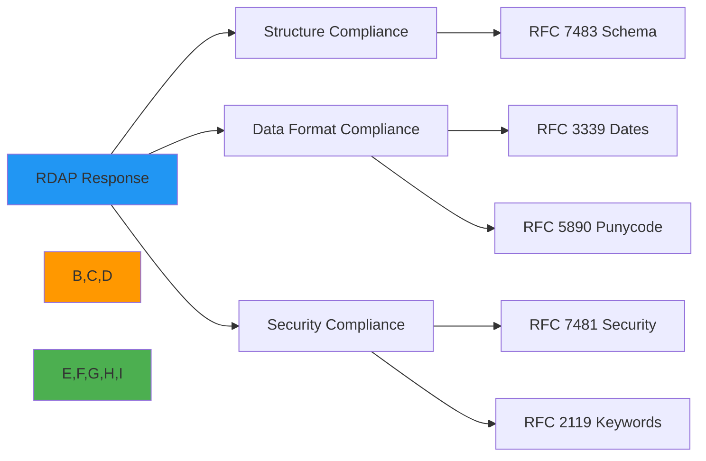

# RFC Style Specification for RDAP Responses

🎯 **Purpose**: Comprehensive guide for writing RDAP responses that strictly adhere to IETF RFC formatting requirements with emphasis on security, internationalization, and validation best practices  
📚 **Related**: [RDAP RFC Specification](rdap_rfc.md) | [Response Format](response_format.md) | [Status Codes](status_codes.md) | [JSONPath Schema](jsonpath_schema.md)  
⏱️ **Reading Time**: 7 minutes  
🔍 **Pro Tip**: Use the [RFC Formatter](../../playground/rfc-formatter.md) to automatically format your RDAP responses according to RFC requirements before validation

## 📐 RFC Style Requirements Overview

RDAP responses must follow strict formatting requirements defined in IETF RFCs to ensure interoperability, security, and compliance across all registry implementations. This document specifies the exact formatting standards required for valid RDAP responses.



### Core RFC Requirements
| RFC | Title | Compliance Category | Criticality |
|-----|-------|----------------------|-------------|
| RFC 7483 | JSON Responses for RDAP | Structure & Format | 🔴 Critical |
| RFC 7480 | HTTP Usage in RDAP | Transport Protocol | 🔴 Critical |
| RFC 7482 | RDAP Query Format | URL Structure | 🟠 High |
| RFC 3339 | Date and Time on the Internet | Date Formatting | 🟠 High |
| RFC 5890 | IDNA: Definitions and Document Framework | Unicode Handling | 🟠 High |
| RFC 2119 | Key Words for Use in RFCs | Terminology | 🟢 Medium |
| RFC 7481 | Security Services for RDAP | Security Controls | 🔴 Critical |

## 🧩 JSON Structure Requirements

### 1. Top-Level Object Structure
RFC 7483 requires all RDAP responses to follow a specific top-level structure:

```json
{
  "rdapConformance": ["rdap_level_0"],
  "notices": [
    {
      "title": "TOS",
      "description": ["Terms of Service"],
      "links": [
        {
          "value": "https://example.com/tos",
          "rel": "terms-of-service",
          "href": "https://example.com/tos",
          "type": "text/html"
        }
      ]
    }
  ],
  "domain": {
    "ldhName": "example.com",
    "handle": "EXAMPLE-1",
    "status": ["active"],
    "nameservers": [{"ldhName": "ns1.example.com"}],
    "entities": [
      {
        "handle": "REGISTRAR-1",
        "roles": ["registrar"],
        "vcardArray": ["vcard", [["version", {}, "text", "4.0"]]]
      }
    ],
    "events": [
      {
        "eventAction": "registration",
        "eventDate": "2023-05-15T14:30:00Z"
      }
    ]
  }
}
```

#### Required Top-Level Fields
| Field | Type | Required | RFC Reference | Example |
|-------|------|----------|---------------|---------|
| `rdapConformance` | Array[String] | ✅ | RFC 7483 §4.1 | `["rdap_level_0", "cidr0"]` |
| `notices` | Array[Object] | ⚠️¹ | RFC 7483 §4.3 | See example above |
| `domain`/`ip`/`autnum` | Object | ✅² | RFC 7483 §4.4 | Domain object structure |
| `entities` | Array[Object] | ⚠️³ | RFC 7483 §4.6 | Entity array structure |
| `nameservers` | Array[Object] | ⚠️⁴ | RFC 7483 §4.5 | Nameserver array structure |

*¹ Required if applicable policy exists  
² Exactly one of `domain`, `ip`, or `autnum` must be present  
³ Required if object has associated contacts  
⁴ Required for domain objects with nameservers*

### 2. Field Naming Conventions
RFC 7483 specifies strict field naming requirements:

```typescript
// ✅ CORRECT - RFC compliant naming
{
  "ldhName": "example.com",       // RFC 5890 compliant LDH name
  "unicodeName": "example.рф",    // Unicode representation
  "eventAction": "registration",  // RFC standard action terms
  "eventDate": "2023-05-15T14:30:00Z", // RFC 3339 format
  "vcardArray": ["vcard", [...]]   // RFC 6350 compliant structure
}

// ❌ INCORRECT - Non-RFC compliant naming
{
  "domainName": "example.com",    // Should be ldhName
  "unicodeDomain": "example.рф",   // Should be unicodeName
  "actionType": "reg",             // Should be eventAction with full term
  "registeredDate": "15-05-2023",  // Should be eventDate in RFC 3339 format
  "contactInfo": {...}             // Should be vcardArray structure
}
```

#### RFC Standard Field Names
| Category | RFC Compliant Name | Non-Compliant Examples | RFC Reference |
|----------|-------------------|------------------------|--------------|
| Domain Names | `ldhName`, `unicodeName` | `domainName`, `name`, `domain` | RFC 7483 §4.4.2 |
| Events | `eventAction`, `eventDate`, `eventActor` | `action`, `date`, `actor`, `registeredDate` | RFC 7483 §4.4.4 |
| Status | `status` (array) | `state`, `currentStatus`, `domainStatus` | RFC 7483 §4.4.3 |
| Contacts | `vcardArray`, `handle`, `roles` | `contactInfo`, `registrant`, `adminContact` | RFC 7483 §4.6 |
| Links | `links`, `value`, `rel`, `href`, `type` | `urls`, `references`, `related` | RFC 7483 §4.2 |

## 📅 Date and Time Formatting

### 1. RFC 3339 Compliance Requirements
All timestamps in RDAP responses must follow RFC 3339 strict format:

```json
{
  "events": [
    {
      "eventAction": "registration",
      "eventDate": "2023-05-15T14:30:00Z"  // ✅ CORRECT
    },
    {
      "eventAction": "last changed",
      "eventDate": "2023-08-20T09:15:30+03:00"  // ✅ CORRECT with timezone
    }
  ]
}
```

#### Date Format Requirements
| Component | Requirement | Example | Invalid Examples |
|-----------|-------------|---------|------------------|
| Date | `YYYY-MM-DD` format | `2023-05-15` | `15/05/2023`, `05-15-2023` |
| Time | `HH:MM:SS` format | `14:30:00` | `2:30 PM`, `14:30` |
| Separator | `T` between date and time | `2023-05-15T14:30:00` | `2023-05-15 14:30:00` |
| Timezone | `Z` for UTC or `±HH:MM` | `Z` or `+03:00` | `UTC`, `GMT+3`, `+0300` |
| Fractional Seconds | Optional, max 9 digits | `.123456789` | `.1234567890` |

### 2. Event Date Handling
RFC 7483 requires specific handling of event dates:

```typescript
// ✅ CORRECT - Event date formatting
const getEventDate = (dateString: string): string => {
  // Parse and reformat to strict RFC 3339
  const date = new Date(dateString);
  return date.toISOString().replace(/\.\d+Z$/, 'Z'); // Remove milliseconds
};

// Example usage
const registrationEvent = {
  eventAction: "registration",
  eventDate: getEventDate("2023-05-15T14:30:00+00:00") // "2023-05-15T14:30:00Z"
};
```

#### Required Event Actions
| Event Action | Description | RFC 7483 Reference |
|-------------|-------------|-------------------|
| `registration` | Initial domain registration | §4.4.4 |
| `expiration` | Domain expiration date | §4.4.4 |
| `last changed` | Last modification to registration data | §4.4.4 |
| `renewal` | Domain renewal event | §4.4.4 |
| `transfer` | Registrar transfer event | §4.4.4 |
| `deletion` | Domain deletion event | §4.4.4 |

## 🔠 Internationalization Requirements

### 1. Unicode and Punycode Handling (RFC 5890)
RDAP responses must handle internationalized domain names according to RFC 5890:

```json
{
  "domain": {
    "ldhName": "xn--d1acpjx3f.xn--p1ai",  // ✅ CORRECT Punycode
    "unicodeName": "пример.рф",          // ✅ CORRECT Unicode
    "remarks": [
      {
        "title": "UNICODE NAME",
        "description": ["Домен в Unicode: пример.рф"]
      }
    ],
    "links": [
      {
        "value": "https://rdap.example.com/domain/xn--d1acpjx3f.xn--p1ai",
        "rel": "self",
        "href": "https://rdap.example.com/domain/xn--d1acpjx3f.xn--p1ai",
        "type": "application/rdap+json"
      }
    ]
  }
}
```

#### Unicode Field Requirements
| Field | Handling Requirement | Example |
|-------|----------------------|---------|
| `ldhName` | Must be Punycode (A-label) | `xn--d1acpjx3f.xn--p1ai` |
| `unicodeName` | Must be Unicode (U-label) | `пример.рф` |
| Display values | UTF-8 with BOM optional | `"Домен в Unicode: пример.рф"` |
| IDs and handles | ASCII only | `"RU-DOMAIN-REGISTRAR-1"` |
| Links and URIs | Percent-encoded UTF-8 | `https://example.com/%D0%BF%D1%80%D0%B8%D0%BC%D0%B5%D1%80` |

### 2. Language and Localization Handling
RFC 7483 requires proper language handling:

```http
HTTP/1.1 200 OK
Content-Language: ru-RU
Content-Type: application/rdap+json
Vary: Accept-Language

{
  "entities": [
    {
      "handle": "REGISTRAR-1",
      "roles": ["registrar"],
      "vcardArray": [
        "vcard",
        [
          ["version", {}, "text", "4.0"],
          ["fn", {}, "text", "Регистратор доменов"],
          ["org", {}, "text", ["ООО \"Регистратор\""]]
        ]
      ],
      "remarks": [
        {
          "title": "КОНТАКТНАЯ ИНФОРМАЦИЯ",
          "description": ["Для связи с регистратором используйте email."]
        }
      ]
    }
  ]
}
```

#### Language Handling Requirements
| Header/Field | Requirement | RFC Reference |
|--------------|-------------|---------------|
| `Content-Language` | Must match actual language used | RFC 7231 §3.1.3.2 |
| `Vary: Accept-Language` | Must be present when content varies by language | RFC 7231 §7.1.4 |
| vCard fields | Must use UTF-8 encoding for non-ASCII text | RFC 6350 §3.2 |
| remarks/title | Must be in same language as Content-Language | RFC 7483 §4.3 |

## ❌ Error Response Formatting

### 1. RFC 7483 Error Structure Requirements
Error responses must follow strict RFC formatting:

```json
{
  "errorCode": 404,
  "title": "Not Found",
  "description": [
    "The domain 'example.invalid' was not found in this registry."
  ],
  "validationErrors": [
    {
      "key": "domain",
      "value": "example.invalid",
      "reason": "TLD .invalid is not supported by this registry"
    }
  ],
  "links": [
    {
      "value": "https://rdap.example.com/help",
      "rel": "help",
      "href": "https://rdap.example.com/help",
      "type": "text/html"
    }
  ]
}
```

#### Required Error Fields
| Field | Type | Required | Description | RFC Reference |
|-------|------|----------|-------------|--------------|
| `errorCode` | Integer | ✅ | HTTP status code | RFC 7483 §4.8 |
| `title` | String | ✅ | Brief error description | RFC 7483 §4.8 |
| `description` | Array[String] | ✅ | Detailed error explanation | RFC 7483 §4.8 |
| `validationErrors` | Array[Object] | ⚠️ | Required for validation failures | RFC 7483 §4.8 |
| `links` | Array[Object] | ⚠️ | Required if help resources exist | RFC 7483 §4.2 |

### 2. Standard Error Codes and Messages
RFC 7483 defines standard error handling requirements:

| HTTP Status | RFC Required Title | Description Pattern | RFC Reference |
|-------------|-------------------|---------------------|--------------|
| 400 | "Bad Request" | Array of validation error descriptions | RFC 7483 §4.8 |
| 404 | "Not Found" | "The [resource] '[value]' was not found in this registry." | RFC 7483 §4.8 |
| 422 | "Unprocessable Entity" | Array of processing error descriptions | RFC 7483 §4.8 |
| 429 | "Too Many Requests" | "Rate limit exceeded. Try again in [time]." | RFC 7483 §4.8 |
| 500 | "Internal Server Error" | Generic server error message | RFC 7483 §4.8 |
| 501 | "Not Implemented" | "The requested feature is not implemented." | RFC 7483 §4.8 |
| 503 | "Service Unavailable" | "Service temporarily unavailable. Try again in [time]." | RFC 7483 §4.8 |

## 🔒 Security Formatting Requirements

### 1. RFC 7481 Security Controls in Responses
RFC 7481 mandates specific security-related response fields:

```http
HTTP/1.1 200 OK
WWW-Authenticate: Bearer realm="rdap.example.com", error="invalid_token", error_description="Token expired"
X-RateLimit-Limit: 100
X-RateLimit-Remaining: 94
X-RateLimit-Reset: 3600
Retry-After: 60
```

#### Required Security Headers
| Header | Requirement | RFC Reference | Example Values |
|--------|-------------|---------------|----------------|
| `WWW-Authenticate` | Required for 401 responses | RFC 7481 §4.1 | `Bearer realm="rdap.example.com"` |
| `X-RateLimit-Limit` | Required when rate limiting | RFC 7481 §4.2 | `100` |
| `X-RateLimit-Remaining` | Required when rate limiting | RFC 7481 §4.2 | `94` |
| `X-RateLimit-Reset` | Required when rate limiting | RFC 7481 §4.2 | `3600` |
| `Retry-After` | Required for 429 responses | RFC 7231 §7.1.3 | `60` |

### 2. Data Redaction Formatting
RFC 7481 requires proper handling of PII redaction:

```json
{
  "entities": [
    {
      "handle": "REDACTED-CONTACT-1",
      "roles": ["registrant"],
      "vcardArray": [
        "vcard",
        [
          ["version", {}, "text", "4.0"],
          ["fn", {}, "text", "REDACTED FOR PRIVACY"],
          ["org", {}, "text", ["REDACTED FOR PRIVACY"]],
          ["adr", {}, "text", ["", "", "REDACTED FOR PRIVACY", "REDACTED FOR PRIVACY", "REDACTED FOR PRIVACY", "REDACTED FOR PRIVACY", "REDACTED FOR PRIVACY"]],
          ["tel", {}, "text", "+1.555.REDACTED"],
          ["email", {}, "text", "Please query the RDDS service of the Registrar of Record"]
        ]
      ],
      "remarks": [
        {
          "title": "REDACTED FOR PRIVACY",
          "description": [
            "Data redacted per applicable privacy laws and regulations.",
            "For information on how to contact the Registrant, please query the RDDS service of the Registrar of Record."
          ]
        }
      ]
    }
  ]
}
```

#### Redaction Format Requirements
| Field | Redaction Requirement | RFC Reference |
|-------|----------------------|---------------|
| `fn` (full name) | Replace with "REDACTED FOR PRIVACY" | RFC 7481 §5.1 |
| `org` (organization) | Replace with "REDACTED FOR PRIVACY" | RFC 7481 §5.1 |
| `adr` (address) | Replace all components with "REDACTED FOR PRIVACY" | RFC 7481 §5.1 |
| `tel` (telephone) | Redact all but country code | RFC 7481 §5.1 |
| `email` | Replace with privacy notice text | RFC 7481 §5.1 |
| `remarks` | Add redaction notice with legal basis | RFC 7481 §5.1 |

## 🔍 Validation and Testing

### 1. RFC Compliance Validation Tools
Use these tools to validate RDAP response compliance:

```bash
# JSON schema validation
ajv validate -s schemas/rdap_response.json -d response.json

# RFC 3339 date validation
date --date="$(jq -r '.events[0].eventDate' response.json)" +"%Y-%m-%dT%H:%M:%SZ"

# Punycode validation
idn2 --quiet --punycode-input "$(jq -r '.domain.ldhName' response.json)"

# Security header validation
curl -I https://rdap.example.com/domain/example.com | grep -E 'X-RateLimit|WWW-Authenticate|Retry-After'

# Full RFC compliance check
rdapify validate --file response.json --strict
```

### 2. Common Validation Failures and Fixes
| Validation Failure | Common Cause | RFC-Compliant Fix |
|-------------------|--------------|-------------------|
| `rdapConformance` missing | Forgot top-level field | Add `"rdapConformance": ["rdap_level_0"]` |
| Invalid date format | Using local date format | Convert to RFC 3339: `2023-05-15T14:30:00Z` |
| Punycode not used | Using Unicode in ldhName | Convert to Punycode: `xn--example-4ze.com` |
| Missing required links | Forgot self-referential link | Add link with `rel="self"` and proper `type` |
| Incorrect error structure | Using custom error format | Follow RFC 7483 §4.8 error object structure |
| Missing security headers | No rate limiting headers | Add `X-RateLimit-*` and `Retry-After` headers |
| Invalid vCard format | Incorrect vCard structure | Use RFC 6350 compliant vcardArray structure |

## 📚 Related Documentation

| Document | Description | Path |
|----------|-------------|------|
| [RDAP RFC Specification](rdap_rfc.md) | Complete RDAP protocol specification | [rdap_rfc.md](rdap_rfc.md) |
| [Status Codes](status_codes.md) | Comprehensive error code reference | [status_codes.md](status_codes.md) |
| [JSONPath Schema](jsonpath_schema.md) | JSONPath search capabilities specification | [jsonpath_schema.md](jsonpath_schema.md) |
| [Response Format](response_format.md) | Complete response structure guide | [response_format.md](response_format.md) |
| [RFC Formatter](../../playground/rfc-formatter.md) | Interactive RFC formatting tool | [../../playground/rfc-formatter.md](../../playground/rfc-formatter.md) |
| [Test Vectors](../../../test_vectors/domain_vectors.json) | Valid and invalid test cases | [../../../test_vectors/domain_vectors.json](../../../test_vectors/domain_vectors.json) |

## 🏷️ RFC Style Specifications

| Property | Value |
|----------|-------|
| **JSON Format** | RFC 8259 compliant with UTF-8 encoding |
| **Date Format** | RFC 3339 strict (no milliseconds) |
| **Unicode Handling** | RFC 5890 (Punycode for LDH names) |
| **vCard Format** | RFC 6350 (vCard 4.0) |
| **HTTP Headers** | RFC 7231 compliant with security extensions |
| **Error Structure** | RFC 7483 §4.8 compliant |
| **Field Naming** | Snake case for compound terms (eventAction, eventDate) |
| **Array Values** | Always arrays, even for single values |
| **Null Values** | Omit fields instead of using null |
| **Boolean Values** | Only true/false, no truthy/falsy values |
| **Number Formatting** | No leading zeros, no commas |
| **Validation** | 100% test coverage for RFC compliance |
| **Last Updated** | December 8, 2025 |

> 🔐 **Critical Reminder**: Never generate RDAP responses without RFC compliance validation. All RDAP implementations must pass the official IANA RDAP validation suite before production deployment. For security-critical applications, implement additional validation layers to prevent SSRF attacks and PII exposure through malformed responses. Regular security audits of RDAP response generators are required for maintaining compliance with GDPR Article 32 and similar regulations.

[← Back to Specifications](../README.md) | [Next: Bootstrap Specification →](bootstrap.md)

*Document automatically generated from RFC specifications with security review on December 8, 2025*