# HTTP Status Codes Specification for RDAP

🎯 **Purpose**: Comprehensive technical specification of HTTP status codes used in RDAP (Registration Data Access Protocol) implementations with implementation guidance for error handling, security considerations, and compliance requirements  
📚 **Related**: [RDAP RFC Specification](rdap_rfc.md) | [Response Format](response_format.md) | [RFC Style Guide](rfc_style_spec.md) | [Error Handling Guide](../../guides/error_handling.md)  
⏱️ **Reading Time**: 6 minutes  
🔍 **Pro Tip**: Use the [Status Code Validator](../../playground/status-validator.md) to automatically test your RDAP implementation's error handling against all defined status codes

## 🌐 Status Code Categories in RDAP

RDAP implementations use standard HTTP status codes with specific semantic meanings defined in RFC 7483. Understanding these categories is essential for robust client implementations:

```mermaid
graph TD
    A[HTTP Status Codes] --> B[1xx Informational]
    A --> C[2xx Success]
    A --> D[3xx Redirection]
    A --> E[4xx Client Errors]
    A --> F[5xx Server Errors]
    
    C --> C1[200 OK - Successful response]
    C --> C2[206 Partial Content - Paginated results]
    
    E --> E1[400 Bad Request - Invalid query]
    E --> E2[401 Unauthorized - Auth required]
    E --> E3[403 Forbidden - Permission denied]
    E --> E4[404 Not Found - Resource not found]
    E --> E5[422 Unprocessable Entity - Validation error]
    E --> E6[429 Too Many Requests - Rate limited]
    
    F --> F1[500 Internal Server Error - Generic server error]
    F --> F2[501 Not Implemented - Feature unavailable]
    F --> F3[503 Service Unavailable - Temporary outage]
    
    style A fill:#FF9800
    style C fill:#4CAF50
    style E fill:#F44336
    style F fill:#FF5722
    style B,D fill:#9E9E9E
```



### Core Status Code Principles
✅ **RFC Compliance**: All codes must follow RFC 7231 semantics with RDAP-specific extensions  
✅ **Consistent Error Structure**: Uniform JSON error objects across all status codes  
✅ **Security-Aware Responses**: Error messages must not leak sensitive system information  
✅ **Machine-Readable First**: Structured error codes with human-readable descriptions  
✅ **Cacheable When Appropriate**: Proper cache control headers for error responses  

## ⚙️ Detailed Status Code Reference

### 2xx Success Codes

#### 200 OK
```json
{
  "rdapConformance": ["rdap_level_0"],
  "domain": {
    "ldhName": "example.com",
    "handle": "EXAMPLE-1",
    "status": ["active"],
    "entities": [
      {
        "handle": "REGISTRAR-1",
        "roles": ["registrar"],
        "vcardArray": ["vcard", [...]]
      }
    ],
    "events": [
      {
        "eventAction": "registration",
        "eventDate": "2023-05-15T14:30:00Z"
      }
    ]
  }
}
```

**Usage Guidelines**:
- Standard successful response for all valid RDAP queries
- Must include required top-level fields (`rdapConformance`, domain/IP/ASN object)
- Cache according to `Cache-Control`/`Expires` headers (typically 1 hour)

#### 206 Partial Content
```json
{
  "rdapConformance": ["rdap_level_0", "partial_reply"],
  "domainSearchResults": [
    {"ldhName": "example1.com", "handle": "EX1-1"},
    {"ldhName": "example2.com", "handle": "EX2-1"}
  ],
  "notices": [
    {
      "title": "Result Truncated",
      "description": ["Query returned partial results. Use 'cursor' parameter for next page."]
    }
  ],
  "links": [
    {
      "href": "https://rdap.example.com/domains?name=example*&cursor=next_page_token",
      "rel": "next",
      "type": "application/rdap+json",
      "value": "https://rdap.example.com/domains?name=example*&cursor=next_page_token"
    }
  ]
}
```

**Usage Guidelines**:
- Used for paginated search results
- Must include `partial_reply` in `rdapConformance`
- Must provide `links` with `rel="next"` for pagination
- Include `notices` explaining result truncation

### 4xx Client Error Codes

#### 400 Bad Request
```json
{
  "errorCode": 400,
  "title": "Bad Request",
  "description": [
    "Invalid domain name format. Domain names must be in LDH format (lowercase ASCII)"
  ],
  "validationErrors": [
    {
      "key": "domain",
      "value": "exa mple.com",
      "reason": "Domain name contains whitespace characters"
    }
  ],
  "links": [
    {
      "href": "https://rdap.example.com/help/validation",
      "rel": "help",
      "type": "text/html",
      "value": "https://rdap.example.com/help/validation"
    }
  ]
}
```

**Common Causes**:
- Invalid query parameters (malformed domain names, IP addresses)
- Missing required parameters
- Invalid characters in resource identifiers
- Improperly formatted JSON in POST requests

**Client Handling**:
```typescript
try {
  await client.domain('invalid..domain');
} catch (error) {
  if (error.code === 400) {
    const validationErrors = error.validationErrors || [];
    validationErrors.forEach(err => {
      console.error(`Validation failed for ${err.key}: ${err.reason}`);
    });
    // Provide user with specific validation guidance
  }
}
```

#### 404 Not Found
```json
{
  "errorCode": 404,
  "title": "Not Found",
  "description": [
    "The domain 'example.not' was not found in this registry."
  ],
  "validationErrors": [
    {
      "key": "domain",
      "value": "example.not",
      "reason": "TLD .not is not supported by this registry"
    }
  ]
}
```

**Common Causes**:
- Resource does not exist in the registry
- TLD not supported by the queried registry
- Invalid IP range or autonomous system number
- Resource has been deleted or expired

**Security Consideration**:  
Responses must not distinguish between "not found" and "access denied" for security-sensitive resources to prevent enumeration attacks.

```typescript
// Secure handling that doesn't leak existence information
async function secureDomainLookup(domain: string): Promise<DomainResponse | null> {
  try {
    return await client.domain(domain);
  } catch (error) {
    if (error.code === 404) {
      // Return null without indicating whether domain exists
      return null;
    }
    throw error;
  }
}
```

#### 429 Too Many Requests
```http
HTTP/1.1 429 Too Many Requests
Retry-After: 60
X-RateLimit-Limit: 100
X-RateLimit-Remaining: 0
X-RateLimit-Reset: 1634567890
Content-Type: application/rdap+json

{
  "errorCode": 429,
  "title": "Too Many Requests",
  "description": [
    "Rate limit of 100 requests per hour exceeded. Please try again in 60 seconds."
  ],
  "links": [
    {
      "href": "https://rdap.example.com/rate-limits",
      "rel": "rate-limit-policy",
      "type": "text/html",
      "value": "https://rdap.example.com/rate-limits"
    }
  ]
}
```

**Required Headers**:
| Header | Purpose | Example Value |
|--------|---------|---------------|
| `Retry-After` | Seconds to wait before retrying | `60` |
| `X-RateLimit-Limit` | Maximum requests allowed in window | `100` |
| `X-RateLimit-Remaining` | Requests remaining in current window | `0` |
| `X-RateLimit-Reset` | Time when rate limit resets (Unix timestamp) | `1634567890` |

**Client Implementation**:
```typescript
class RateLimitAwareClient {
  private rateLimitState = new Map<string, RateLimitInfo>();
  
  async getWithRetry<T>(url: string, options: any = {}): Promise<T> {
    const maxRetries = options.maxRetries || 3;
    
    for (let attempt = 0; attempt <= maxRetries; attempt++) {
      try {
        return await this.makeRequest<T>(url, options);
      } catch (error) {
        if (error.code === 429 && attempt < maxRetries) {
          const retryAfter = error.headers?.['retry-after'] || 60;
          console.warn(`Rate limited. Waiting ${retryAfter} seconds before retry ${attempt + 1}/${maxRetries}`);
          
          // Exponential backoff with jitter
          const delay = (Math.pow(2, attempt) * retryAfter * 1000) + (Math.random() * 1000);
          await new Promise(resolve => setTimeout(resolve, delay));
          
          continue;
        }
        throw error;
      }
    }
    
    throw new Error('Max retries exceeded');
  }
}
```

### 5xx Server Error Codes

#### 503 Service Unavailable
```http
HTTP/1.1 503 Service Unavailable
Retry-After: 300
Cache-Control: no-store
Content-Type: application/rdap+json

{
  "errorCode": 503,
  "title": "Service Unavailable",
  "description": [
    "The RDAP service is temporarily unavailable due to maintenance.",
    "Service is expected to be restored within 5 minutes."
  ],
  "links": [
    {
      "href": "https://status.rdap.example.com",
      "rel": "service-status",
      "type": "text/html",
      "value": "https://status.rdap.example.com"
    }
  ]
}
```

**Common Causes**:
- Scheduled maintenance windows
- Registry server outages
- Connection failures to authoritative sources
- Resource exhaustion (CPU, memory, connections)

**Client Handling Strategy**:
- Implement exponential backoff with jitter
- Respect `Retry-After` header strictly
- Provide fallback to cached data when available
- Display appropriate user messages with estimated restoration time

```typescript
async function resilientLookup(domain: string): Promise<DomainResponse> {
  const MAX_RETRY_DELAY = 3600000; // 1 hour
  
  return new Promise((resolve, reject) => {
    const attempt = async (retryCount = 0) => {
      try {
        const result = await client.domain(domain);
        resolve(result);
      } catch (error) {
        if (error.code === 503 && retryCount < 10) {
          const retryAfter = parseInt(error.headers?.['retry-after'] || '300');
          const delay = Math.min(
            retryAfter * 1000 * Math.pow(1.5, retryCount),
            MAX_RETRY_DELAY
          );
          
          console.log(`Service unavailable. Retrying in ${delay/1000} seconds...`);
          setTimeout(() => attempt(retryCount + 1), delay);
        } else {
          // Check cache for stale data as fallback
          const cached = cache.get(domain);
          if (cached && error.code === 503) {
            console.warn('Using stale cache data due to service unavailability');
            resolve(cached);
          } else {
            reject(error);
          }
        }
      }
    };
    
    attempt();
  });
}
```

## 🔒 Security and Compliance Requirements

### Error Message Content Restrictions
RFC 7481 requires strict limitations on error message content to prevent information disclosure:

```typescript
// ✅ SECURE - Appropriate error messages
{
  "errorCode": 404,
  "title": "Not Found",
  "description": ["The requested resource was not found."]
}

// ❌ INSECURE - Information disclosure
{
  "errorCode": 404,
  "title": "Not Found",
  "description": [
    "Domain 'example.com' not found in Verisign registry at 192.0.2.1",
    "Registry database version: 2023.05.15",
    "Internal error: SQLSTATE[42S02]: Base table not found"
  ]
}
```

**Security Rules for Error Messages**:
1. **No System Information**: Never expose server versions, file paths, or internal identifiers
2. **No Database Details**: Never reveal database schema, queries, or connection details
3. **No Network Topology**: Never disclose internal IPs, load balancer configurations, or failover strategies
4. **No Debug Traces**: Never include stack traces in production error responses
5. **Uniform Responses**: Use identical error structures for "not found" and "access denied" scenarios

### GDPR Article 32 Compliance
For EU data subjects, error responses must:

1. **Minimize PII Exposure**: Redact any personal data that might appear in error messages
2. **Document Processing**: Maintain audit logs of error conditions that involve personal data
3. **Limit Retention**: Error logs containing PII must be automatically purged after 30 days
4. **Breach Notification**: Errors exposing PII must trigger GDPR Article 33 breach notification procedures

```typescript
// GDPR-compliant error handling
async function handleRequest(request: Request, context: ComplianceContext) {
  try {
    return await processRequest(request);
  } catch (error) {
    // Redact PII from error context before logging
    const redactedError = gdprRedactionEngine.redactError(error, context);
    
    // Log with retention policy
    await auditLogger.log('error', {
      ...redactedError,
      retentionPeriod: '30d',
      jurisdiction: context.jurisdiction
    });
    
    // Return generic error to client
    return {
      errorCode: error.isClientError ? error.code : 500,
      title: error.isClientError ? error.title : 'Internal Server Error',
      description: [error.isClientError ? error.description[0] : 'An unexpected error occurred']
    };
  }
}
```

## 🔍 Troubleshooting Common Issues

### 1. Intermittent 5xx Errors
**Symptoms**: Random 500/502/503 errors during normal operation  
**Root Causes**:
- Connection pool exhaustion during peak loads
- Backend registry timeouts during high-volume periods
- Memory leaks causing resource exhaustion
- Network instability between RDAP client and registries

**Diagnostic Steps**:
```bash
# Monitor connection pool metrics
curl -s http://localhost:3000/metrics | grep connection_pool

# Check registry response times
curl -s http://localhost:3000/metrics | grep registry_response_time

# Analyze error patterns by time
grep " 5[0-9][0-9] " access.log | awk '{print $4}' | cut -d: -f2 | sort | uniq -c

# Profile memory usage during errors
clinic doctor --autocannon [ -c 50 /domain/example.com ] -- node ./dist/app.js
```

**Solutions**:
✅ **Connection Pool Tuning**: Increase pool size with proper timeout management  
✅ **Circuit Breaker Pattern**: Implement circuit breakers to fail fast during registry outages  
✅ **Graceful Degradation**: Serve stale cached data during registry failures  
✅ **Connection Health Checks**: Implement active connection validation before reuse  

### 2. 429 Rate Limiting Issues
**Symptoms**: Application suddenly starts receiving 429 responses despite unchanged usage patterns  
**Root Causes**:
- Registry policy changes reducing rate limits
- IP address sharing with other high-volume clients
- Missing client identification headers causing stricter limits
- Distributed deployment without shared rate limiting state

**Diagnostic Steps**:
```bash
# Check current rate limit headers
curl -I https://rdap.example.com/domain/example.com | grep -E 'X-RateLimit|Retry-After'

# Monitor rate limit consumption over time
node ./scripts/rate-limit-monitor.js --target https://rdap.example.com --duration 24h

# Test from different network locations
for region in us-east-1 eu-west-1 ap-southeast-1; do
  aws ec2 run-instances --region $region --instance-type t3.micro \
    --user-data "curl -v https://rdap.example.com/domain/example.com"
done
```

**Solutions**:
✅ **Client Identification**: Add `User-Agent` and `From` headers to identify your application  
✅ **Distributed Rate Limiting**: Implement shared rate limiting with Redis for multi-instance deployments  
✅ **Request Prioritization**: Prioritize critical requests over bulk operations during limit periods  
✅ **Registry-Specific Limits**: Maintain separate rate limiters for each registry with appropriate limits  

## 📚 Related Documentation

| Document | Description | Path |
|----------|-------------|------|
| [RDAP RFC Specification](rdap_rfc.md) | Complete RDAP protocol documentation | [rdap_rfc.md](rdap_rfc.md) |
| [Response Format](response_format.md) | JSON response structure specification | [response_format.md](response_format.md) |
| [RFC Style Guide](rfc_style_spec.md) | RFC-compliant response formatting | [rfc_style_spec.md](rfc_style_spec.md) |
| [Error Handling Guide](../../guides/error_handling.md) | Practical error handling patterns | [../../guides/error_handling.md](../../guides/error_handling.md) |
| [Security Whitepaper](../../security/whitepaper.md) | Security considerations for error handling | [../../security/whitepaper.md](../../security/whitepaper.md) |
| [Status Code Validator](../../playground/status-validator.md) | Interactive status code testing tool | [../../playground/status-validator.md](../../playground/status-validator.md) |
| [Test Vectors](../../../test_vectors/status_codes.json) | Comprehensive status code test cases | [../../../test_vectors/status_codes.json](../../../test_vectors/status_codes.json) |

## 🏷️ Status Code Specifications

| Property | Value |
|----------|-------|
| **Standard Reference** | RFC 7231, RFC 7483 |
| **Required Error Fields** | `errorCode`, `title`, `description` |
| **Optional Error Fields** | `validationErrors`, `links`, `instance` |
| **Cacheability** | 4xx errors: private, no-store; 5xx errors: no-cache |
| **Retry Behavior** | 429: respect Retry-After; 5xx: exponential backoff |
| **Security Requirements** | No information disclosure, uniform responses for sensitive resources |
| **Compliance Requirements** | GDPR Article 32, CCPA §1798.150 breach notification |
| **Test Coverage** | 100% coverage of all defined error scenarios |
| **Last Updated** | December 5, 2025 |

> 🔐 **Critical Reminder**: Never implement custom error messages that reveal system internals or sensitive configuration details. All error responses must undergo security review before production deployment. For GDPR environments, implement automatic PII redaction in error logs with 30-day retention policies. Regular security testing of error handling code is required for maintaining compliance with GDPR Article 32 and similar regulations.

[← Back to Specifications](../README.md) | [Next: JSONPath Schema →](jsonpath_schema.md)

*Document automatically generated from RFC specifications with security review on December 5, 2025*