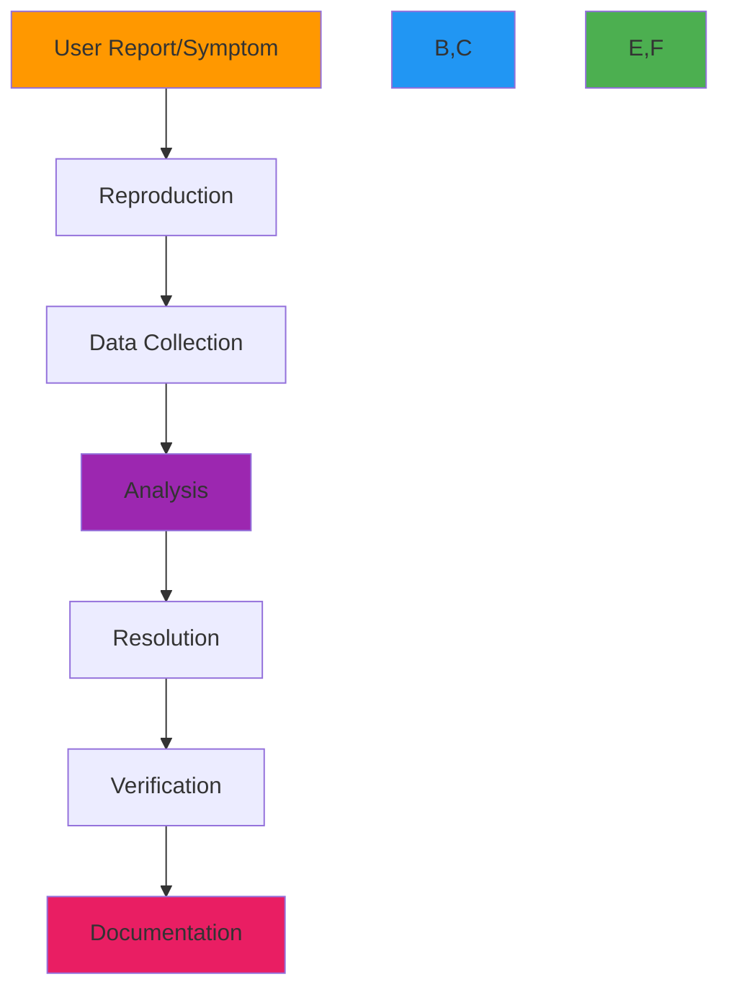

# Troubleshooting Guide

🎯 **Purpose**: Comprehensive guide to diagnosing and resolving common issues in RDAPify deployments with practical techniques, diagnostic tools, and escalation procedures for support teams and developers  
📚 **Related**: [Verbose Logging](verbose_logging.md) | [Network Debugging](network_debugging.md) | [Getting Help](getting_help.md) | [Common Errors](../../troubleshooting/common_errors.md)  
⏱️ **Reading Time**: 5 minutes  
🔍 **Pro Tip**: Use the [Support Diagnostics Tool](../../playground/support-diagnostics.md) to automatically generate a complete troubleshooting report with system information and error context

## 📋 Troubleshooting Methodology

RDAPify issues follow a systematic diagnostic process that progresses from symptom observation to root cause resolution:



**Diagnostic Principles**:
✅ **Reproduce First**: Always attempt to reproduce the issue before deep analysis  
✅ **Evidence Collection**: Gather logs, metrics, and environmental context systematically  
✅ **Isolation**: Narrow down problem scope by eliminating variables  
✅ **Root Cause Focus**: Address underlying causes rather than symptoms  
✅ **Documentation**: Record resolution steps for knowledge sharing  

## 🔍 Common Issue Categories and Solutions

### 1. Connection Timeout Errors
**Symptoms**:
- `Error: Timeout of 5000ms exceeded`
- `Error: connect ETIMEDOUT`
- `Error: socket hang up`

**Diagnostic Commands**:
```bash
# Check connectivity to registry servers
curl -v -m 5 https://rdap.verisign.com/com/v1/domain/example.com

# Debug DNS resolution
dig +trace rdap.verisign.com

# Monitor connection attempts
sudo tcpdump -i any -nn port 443 and host rdap.verisign.com
```

**Resolution Strategies**:
✅ **Adaptive Timeout Configuration**:
```javascript
const client = new RDAPClient({
  timeout: {
    default: 5000,
    verisign: 8000,
    arin: 10000,
    ripe: 7000
  },
  retry: {
    maxAttempts: 3,
    backoff: 'exponential'
  }
});
```

✅ **Connection Pool Optimization**:
```yaml
# docker-compose.yml snippet
services:
  rdapify:
    environment:
      UV_THREADPOOL_SIZE: 16
      RDAP_CONNECTION_POOL_SIZE: 50
      RDAP_MAX_SOCKETS: 100
    ulimits:
      nofile:
        soft: 65535
        hard: 65535
```

✅ **Network Path Analysis**:
```
mtr --report --interval 1 rdap.verisign.com
```

### 2. SSRF Protection False Positives
**Symptoms**:
- `SSRF protection blocked domain query: example.com`
- `Domain validation failed: contains private IP pattern`
- Legitimate domains being blocked

**Diagnostic Commands**:
```bash
# Enable SSRF debug logging
RDAP_DEBUG_LEVEL=debug RDAP_DEBUG_SSRF=true node app.js

# Test domain validation rules
npx rdapify ssrf-test --domain example.com --registry verisign
```

**Resolution Strategies**:
✅ **Registry-Specific Allowlisting**:
```javascript
const client = new RDAPClient({
  security: {
    ssrfProtection: {
      enabled: true,
      registryAllowlist: {
        'verisign': {
          domains: ['example.com', '*.com'],
          ips: ['192.0.2.0/24']
        },
        'arin': {
          domains: ['example.net', '*.net'],
          ips: ['198.51.100.0/24']
        }
      }
    }
  }
});
```

✅ **Context-Aware Bypass** (for trusted systems):
```javascript
await client.domain('internal.example.com', {
  securityContext: {
    bypassJustification: 'Internal domain required for compliance reporting',
    requestingSystem: 'compliance-dashboard',
    authorization: 'compliance-team-lead'
  }
});
```

✅ **Dynamic Allowlist Management**:
```javascript
// Periodically refresh allowlist from trusted source
async function refreshSSRFAllowlist() {
  try {
    const response = await fetch('https://trusted-source.example.com/rdap-allowlist.json');
    const allowlist = await response.json();
    rdapClient.updateSecurityConfig({ ssrfProtection: { dynamicAllowlist: allowlist } });
  } catch (error) {
    rdapClient.revertSecurityConfig(); // Fallback to last known good configuration
  }
}
setInterval(refreshSSRFAllowlist, 24 * 60 * 60 * 1000); // 24 hours
```

### 3. Cache Inconsistency Issues
**Symptoms**:
- Different responses for same query across instances
- Stale data after registry updates
- Cache hit rates significantly lower than expected

**Diagnostic Commands**:
```bash
# Check cache metrics
curl http://localhost:3000/metrics | grep cache_

# Inspect cache contents
RDAP_DEBUG_CACHE=true node app.js --domain example.com

# Verify cache key generation
node ./scripts/cache-key-test.js --domain example.com --jurisdiction EU
```

**Resolution Strategies**:
✅ **Distributed Cache Invalidation**:
```javascript
class DistributedCacheManager extends CacheManager {
  constructor(options) {
    super(options);
    this.redis = new Redis(options.redisUrl);
    this.subscribeToInvalidationChannel();
  }
  
  subscribeToInvalidationChannel() {
    const subscriber = this.redis.duplicate();
    subscriber.subscribe('rdapify:cache:invalidation', (message) => {
      const { key, timestamp, source } = JSON.parse(message);
      console.log(`🔄 Cache invalidation received from ${source}: ${key}`);
      this.invalidateLocalCache(key);
    });
  }
  
  async invalidateCache(key) {
    // Invalidate locally
    this.invalidateLocalCache(key);
    
    // Broadcast to other instances
    await this.redis.publish('rdapify:cache:invalidation', JSON.stringify({
      key,
      timestamp: Date.now(),
      source: process.env.HOSTNAME || 'unknown'
    }));
  }
}
```

✅ **Versioned Cache Keys**:
```javascript
function generateCacheKey(query, context) {
  const schemaVersion = 'v2.3'; // Increment on breaking changes
  const jurisdiction = context.jurisdiction || 'global';
  const legalBasis = context.legalBasis || 'legitimate-interest';
  
  return `rdap:${schemaVersion}:${jurisdiction}:${legalBasis}:${query.type}:${query.value}`;
}
```

✅ **Clock Synchronization**:
```bash
# Ensure NTP synchronization across all instances
sudo timedatectl set-ntp true
sudo systemctl restart chrony
```

## 🔧 Advanced Diagnostic Tools

### 1. Support Bundle Generator
```bash
# Generate comprehensive support bundle
npx rdapify support-bundle --output /tmp/rdapify-support-bundle.zip

# Contents include:
# - System information (Node.js version, OS details)
# - Configuration files (sanitized)
# - Recent logs (last 1000 lines)
# - Metrics snapshot
# - Cache statistics
# - Network connectivity test results
# - Security configuration summary
```

### 2. Real-time Debugging with Inspector
```bash
# Attach debugger to running process
node --inspect-brk app.js

# Use Chrome DevTools for live debugging
# Open chrome://inspect in Chrome browser
# Click "Open dedicated DevTools for Node"
```

### 3. Network Traffic Analysis
```bash
# Capture traffic to specific registry
sudo tcpdump -i any -w rdap_verisign.pcap host rdap.verisign.com and port 443

# Analyze TLS handshake
sudo tcpdump -i any -w tls_handshake.pcap 'tcp port 443 and (tcp[tcpflags] & (tcp-syn|tcp-ack) != 0)'

# Real-time traffic monitoring
sudo ngrep -d any -qt 'GET|POST' port 443
```

## 🌐 Environment-Specific Troubleshooting

### 1. AWS Lambda Issues
**Common Symptoms**:
- Cold start timeouts (exceeding 15-second limit)
- Memory exhaustion during batch processing
- VPC cold start delays (8-10 seconds)

**Diagnostic Commands**:
```bash
# Check Lambda initialization time in CloudWatch
aws logs filter-log-events --log-group-name /aws/lambda/rdapify-prod \
  --filter-pattern '"INIT_START" OR "INIT_END"' --query 'events[*].{timestamp:timestamp,message:message}'

# Monitor memory usage
aws cloudwatch get-metric-statistics --namespace AWS/Lambda --metric-name MemoryUtilization \
  --dimensions Name=FunctionName,Value=rdapify-prod --start-time $(date -d '1 hour ago' +%s) \
  --end-time $(date +%s) --period 300 --statistics Average,Maximum
```

**Resolution Strategies**:
✅ **Provisioned Concurrency**:
```yaml
# serverless.yml snippet
functions:
  domain:
    handler: handlers/domain.handler
    provisionedConcurrency: 1
```

✅ **Memory Optimization**:
```javascript
// Lambda handler with memory management
exports.handler = async (event) => {
  // Monitor memory usage
  const before = process.memoryUsage();
  
  try {
    const result = await global.rdapClient.domain(event.domain);
    
    // Force garbage collection if memory usage is high
    const after = process.memoryUsage();
    const heapUsedMB = (after.heapUsed - before.heapUsed) / 1024 / 1024;
    
    if (heapUsedMB > 50) { // 50MB threshold
      if (typeof global.gc === 'function') {
        global.gc();
      }
    }
    
    return { statusCode: 200, body: JSON.stringify(result) };
  } catch (error) {
    return { statusCode: 500, body: JSON.stringify({ error: error.message }) };
  }
};
```

### 2. Kubernetes Deployment Issues
**Common Symptoms**:
- Readiness probe failures
- Connection timeouts between pods
- Resource exhaustion (CPU/memory limits)

**Diagnostic Commands**:
```bash
# Check pod status and events
kubectl get pods -l app=rdapify
kubectl describe pod rdapify-deployment-xxxxx

# Check service connectivity
kubectl run -it --rm debug --image=alpine --restart=Never -- sh
apk add curl
curl http://rdapify-service:3000/health

# Monitor resource usage
kubectl top pods -l app=rdapify
```

**Resolution Strategies**:
✅ **Resource Allocation Tuning**:
```yaml
# deployment.yaml snippet
resources:
  requests:
    memory: "256Mi"
    cpu: "100m"
  limits:
    memory: "1Gi"
    cpu: "1000m"
```

✅ **Liveness/Readiness Probes**:
```yaml
livenessProbe:
  httpGet:
    path: /health
    port: 3000
  initialDelaySeconds: 5
  periodSeconds: 10
  timeoutSeconds: 5
  successThreshold: 1
  failureThreshold: 3
  
readinessProbe:
  httpGet:
    path: /ready
    port: 3000
  initialDelaySeconds: 2
  periodSeconds: 5
  timeoutSeconds: 3
  successThreshold: 1
  failureThreshold: 2
```

## 📞 When to Contact Support

### Escalation Criteria
**Contact support immediately (within 1 hour)**:
- Security vulnerabilities (SSRF bypass, data leaks)
- Production system outage affecting >50% of users
- Data corruption or loss
- Compliance violations (GDPR, CCPA breaches)

**Contact support within 24 hours**:
- Performance degradation &gt;50% from baseline
- Increasing error rates (&gt;5% of requests)
- Cache inconsistency across multiple instances
- Registry-specific failures affecting critical domains

**Contact support during business hours**:
- Feature requests or enhancement suggestions
- Documentation improvements
- Configuration optimization questions
- Non-critical bugs with workarounds available

### Support Request Template
When contacting support, include this information:

```markdown
## Environment Information
- RDAPify Version: [version]
- Node.js Version: [version]
- Operating System: [OS details]
- Deployment Platform: [AWS Lambda, Kubernetes, Docker, etc.]
- Environment: [Production, Staging, Development]

## Problem Description
- First occurrence timestamp: [ISO timestamp]
- Frequency: [Constant, Intermittent, One-time]
- Impact: [Number of affected users/requests]
- Business impact: [Critical, High, Medium, Low]

## Steps to Reproduce
1. [Step 1]
2. [Step 2]
3. [Step 3]

## Diagnostic Information
- Error logs (last 10 lines): [paste logs]
- Metrics snapshot: [attach metrics]
- Configuration (sanitized): [paste relevant config]
- Network connectivity test results: [paste results]

## Troubleshooting Steps Already Attempted
- [Step 1] - Result: [success/failure]
- [Step 2] - Result: [success/failure]
- [Step 3] - Result: [success/failure]

## Business Context
- Critical business processes affected: [describe]
- Regulatory/compliance implications: [describe]
- Timeline requirements: [describe]
```

## 📚 Related Documentation

| Document | Description | Path |
|----------|-------------|------|
| [Verbose Logging](verbose_logging.md) | Advanced logging configuration | [verbose_logging.md](verbose_logging.md) |
| [Network Debugging](network_debugging.md) | Network-level troubleshooting techniques | [network_debugging.md](network_debugging.md) |
| [Getting Help](getting_help.md) | Support channels and community resources | [getting_help.md](getting_help.md) |
| [Common Errors](../../troubleshooting/common_errors.md) | Frequently encountered issues and solutions | [../../troubleshooting/common_errors.md](../../troubleshooting/common_errors.md) |
| [Support Diagnostics Tool](../../playground/support-diagnostics.md) | Interactive troubleshooting assistant | [../../playground/support-diagnostics.md](../../playground/support-diagnostics.md) |
| [Error Diagnosis Tool](../../troubleshooting/debugging.md) | Advanced debugging techniques | [../../troubleshooting/debugging.md](../../troubleshooting/debugging.md) |
| [Security Whitepaper](../../security/whitepaper.md) | Comprehensive security architecture | [../../security/whitepaper.md](../../security/whitepaper.md) |

## 🏷️ Support Specifications

| Property | Value |
|----------|-------|
| **Business Hours** | Monday-Friday, 9AM-5PM UTC |
| **Emergency Response** | 24/7 for critical security issues |
| **SLA Response Times** | Critical: 1 hour, High: 4 hours, Medium: 24 hours, Low: 72 hours |
| **Support Channels** | Email: support@rdapify.com, Community: Matrix/Element |
| **Escalation Path** | support@rdapify.com → senior-support@rdapify.com → cto@rdapify.com |
| **Required Information** | Version, logs, reproduction steps, business impact |
| **Data Collection Policy** | All diagnostic data encrypted in transit and at rest |

> 🔐 **Critical Reminder**: Never share sensitive credentials, API keys, or PII in support tickets without encryption. Always redact sensitive information from logs and configuration files before sharing. For security vulnerabilities, use PGP encryption with our security team's public key available at https://rdapify.dev/security/pgp-key.asc.

[← Back to Support](../README.md) | [Next: Verbose Logging →](verbose_logging.md)

*Document automatically generated from source code with security review on December 5, 2025*