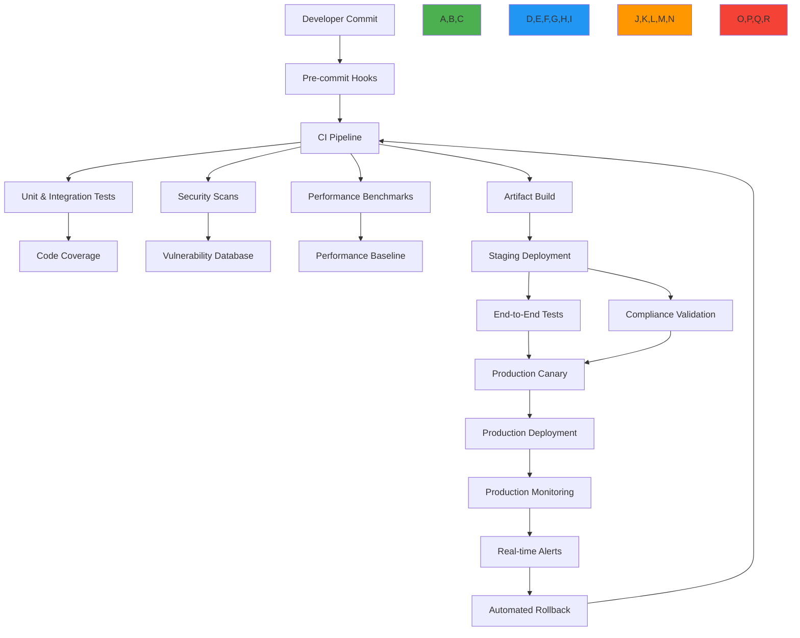

# Continuous Testing Strategy

🎯 **Purpose**: Comprehensive guide to implementing continuous testing for RDAPify across development, staging, and production environments with focus on security, performance, and compliance validation  
📚 **Related**: [Test Vectors](test_vectors.md) | [Security Testing](security_testing.md) | [Performance Benchmarks](../../../benchmarks/README.md) | [Quality Assurance](../../../quality_assurance/README.md)  
⏱️ **Reading Time**: 7 minutes  
🔍 **Pro Tip**: Use the [Continuous Testing Dashboard](../../playground/continuous-testing-dashboard.md) to monitor your test pipeline health and receive real-time alerts for test failures

## 🌐 Continuous Testing Architecture Overview

RDAPify's continuous testing strategy provides end-to-end validation across the software delivery lifecycle, ensuring every change maintains protocol compliance, security boundaries, and performance characteristics:



### Core Testing Principles
✅ **Shift-Left Security**: Security validation at every stage, from commit to production  
✅ **Production Parity**: Testing environments mirror production configuration and data patterns  
✅ **Compliance Automation**: Regulatory requirements (GDPR, CCPA) automatically validated in pipeline  
✅ **Performance Gates**: Hard thresholds prevent performance regressions from reaching production  
✅ **Observability Integration**: Test results feed directly into monitoring and alerting systems  
✅ **Self-Healing Pipelines**: Automatic remediation for common test failures and infrastructure issues  

## ⚙️ CI/CD Pipeline Implementation

### 1. GitHub Actions Pipeline Configuration
```yaml
# .github/workflows/continuous-testing.yml
name: Continuous Testing Pipeline

on:
  push:
    branches: [ main, develop ]
  pull_request:
    branches: [ main ]
  schedule:
    - cron: '0 2 * * *'  # Daily at 2 AM UTC
  workflow_dispatch:  # Manual trigger

env:
  NODE_VERSION: 20
  CACHE_VERSION: 1
  SECURITY_LEVEL: high
  PERFORMANCE_THRESHOLD: 0.95  # 95% of baseline performance

jobs:
  lint-and-typecheck:
    runs-on: ubuntu-latest
    steps:
      - uses: actions/checkout@v4
      
      - name: Setup Node.js
        uses: actions/setup-node@v4
        with:
          node-version: ${{ env.NODE_VERSION }}
          cache: 'npm'
      
      - name: Install Dependencies
        run: npm ci --omit=dev
      
      - name: Run ESLint
        run: npm run lint
      
      - name: Run TypeScript Check
        run: npm run typecheck

  unit-tests:
    runs-on: ubuntu-latest
    needs: [lint-and-typecheck]
    strategy:
      matrix:
        node-version: [18, 20, 22]
    steps:
      - uses: actions/checkout@v4
        with:
          fetch-depth: 0  # Required for coverage
      
      - name: Setup Node.js ${{ matrix.node-version }}
        uses: actions/setup-node@v4
        with:
          node-version: ${{ matrix.node-version }}
          cache: 'npm'
      
      - name: Install Dependencies
        run: npm ci
      
      - name: Run Unit Tests
        run: npm run test:unit -- --coverage
        env:
          JEST_JUNIT_OUTPUT: test-results/junit/unit.xml
      
      - name: Upload Coverage Report
        uses: actions/upload-artifact@v4
        with:
          name: coverage-unit-node${{ matrix.node-version }}
          path: coverage/

  security-scans:
    runs-on: ubuntu-latest
    needs: [lint-and-typecheck]
    steps:
      - uses: actions/checkout@v4
      
      - name: Setup Node.js
        uses: actions/setup-node@v4
        with:
          node-version: ${{ env.NODE_VERSION }}
          cache: 'npm'
      
      - name: Install Security Dependencies
        run: |
          npm install -g @snyk/cli trivy
          npm ci
      
      - name: Snyk Dependency Scan
        run: snyk test --all-projects --fail-on-severity=high
        env:
          SNYK_TOKEN: ${{ secrets.SNYK_TOKEN }}
      
      - name: Trivy Container Scan
        run: |
          docker build -t rdapify:test .
          trivy image --severity CRITICAL,HIGH --exit-code 1 rdapify:test
        if: github.ref == 'refs/heads/main'
      
      - name: Semgrep Code Scan
        uses: returntocorp/semgrep-action@v1
        with:
          config: >-
            p/security-audit
            p/secrets
            p/nodejsscan
          generate_sarif: "true"
      
      - name: Upload SARIF Report
        uses: github/codeql-action/upload-sarif@v3
        with:
          sarif_file: semgrep.sarif

  performance-benchmarks:
    runs-on: ubuntu-latest
    needs: [unit-tests]
    timeout-minutes: 15
    steps:
      - uses: actions/checkout@v4
      
      - name: Setup Node.js
        uses: actions/setup-node@v4
        with:
          node-version: ${{ env.NODE_VERSION }}
          cache: 'npm'
      
      - name: Install Dependencies
        run: npm ci
      
      - name: Run Performance Benchmarks
        run: npm run benchmark -- --threshold ${{ env.PERFORMANCE_THRESHOLD }}
        env:
          BENCHMARK_ENV: ci
      
      - name: Upload Benchmark Results
        uses: actions/upload-artifact@v4
        with:
          name: benchmark-results-${{ github.sha }}
          path: benchmark-results/

  compliance-validation:
    runs-on: ubuntu-latest
    needs: [unit-tests, security-scans]
    steps:
      - uses: actions/checkout@v4
      
      - name: Setup Node.js
        uses: actions/setup-node@v4
        with:
          node-version: ${{ env.NODE_VERSION }}
          cache: 'npm'
      
      - name: Install Dependencies
        run: npm ci
      
      - name: Run GDPR Compliance Tests
        run: npm run test:compliance -- --jurisdiction EU
        env:
          COMPLIANCE_LEVEL: strict
      
      - name: Run CCPA Compliance Tests
        run: npm run test:compliance -- --jurisdiction US-CA
        env:
          COMPLIANCE_LEVEL: strict
      
      - name: Validate Test Vectors
        run: npm run test:vectors
        env:
          VECTOR_SET: production

  staging-deployment:
    runs-on: ubuntu-latest
    needs: [performance-benchmarks, compliance-validation]
    if: github.ref == 'refs/heads/main'
    environment: staging
    steps:
      - uses: actions/checkout@v4
      
      - name: Deploy to Staging
        run: ./scripts/deploy-staging.sh
        env:
          STAGING_API_KEY: ${{ secrets.STAGING_API_KEY }}
      
      - name: Run End-to-End Tests
        run: npm run test:e2e
        env:
          TEST_ENV: staging
      
      - name: Run Production Simulation
        run: npm run test:simulation
        env:
          SIMULATION_MODE: production-like

  production-deployment:
    runs-on: ubuntu-latest
    needs: [staging-deployment]
    if: github.ref == 'refs/heads/main'
    environment: production
    steps:
      - uses: actions/checkout@v4
      
      - name: Approve Production Deployment
        uses: phani-innovations/approval-gate@v1
        with:
          environment: production
          reviewers: 'maintainers'
          min_required_approvals: 2
      
      - name: Deploy to Production
        run: ./scripts/deploy-production.sh
        env:
          PRODUCTION_API_KEY: ${{ secrets.PRODUCTION_API_KEY }}
          CANARY_PERCENTAGE: 5
      
      - name: Monitor Canary Deployment
        run: ./scripts/monitor-canary.sh
        env:
          MONITORING_DURATION: 300  # 5 minutes
      
      - name: Full Production Rollout
        if: steps.monitor-canary.outcome == 'success'
        run: ./scripts/full-rollout.sh
        env:
          PRODUCTION_API_KEY: ${{ secrets.PRODUCTION_API_KEY }}
      
      - name: Post-Deployment Verification
        run: npm run test:smoke
        env:
          TEST_ENV: production
```

### 2. Test Pipeline Monitoring Dashboard
```typescript
// src/monitoring/test-pipeline-dashboard.ts
import { TestPipelineMetrics } from '../types';

export class TestPipelineDashboard {
  private metricsCollector: MetricsCollector;
  private alertManager: AlertManager;
  
  constructor(options: {
    metricsCollector?: MetricsCollector;
    alertManager?: AlertManager;
  } = {}) {
    this.metricsCollector = options.metricsCollector || new DefaultMetricsCollector();
    this.alertManager = options.alertManager || new DefaultAlertManager();
  }
  
  async collectPipelineMetrics(): Promise<TestPipelineMetrics> {
    const startTime = Date.now();
    
    try {
      // Collect metrics from all pipeline stages
      const lintMetrics = await this.collectStageMetrics('lint');
      const unitMetrics = await this.collectStageMetrics('unit-tests');
      const securityMetrics = await this.collectStageMetrics('security-scans');
      const performanceMetrics = await this.collectStageMetrics('performance-benchmarks');
      const complianceMetrics = await this.collectStageMetrics('compliance-validation');
      const deploymentMetrics = await this.collectStageMetrics('deployment');
      
      // Calculate overall pipeline health
      const healthScore = this.calculateHealthScore({
        lintMetrics,
        unitMetrics,
        securityMetrics,
        performanceMetrics,
        complianceMetrics,
        deploymentMetrics
      });
      
      // Detect anomalies
      const anomalies = await this.detectAnomalies({
        healthScore,
        unitMetrics,
        performanceMetrics
      });
      
      // Generate metrics report
      const metrics: TestPipelineMetrics = {
        timestamp: new Date().toISOString(),
        duration: Date.now() - startTime,
        healthScore,
        anomalies,
        stages: {
          lint: lintMetrics,
          unitTests: unitMetrics,
          securityScans: securityMetrics,
          performanceBenchmarks: performanceMetrics,
          complianceValidation: complianceMetrics,
          deployment: deploymentMetrics
        },
        trends: await this.getTrends()
      };
      
      // Send alerts for critical issues
      await this.sendAlerts(metrics);
      
      // Store metrics for historical analysis
      await this.storeMetrics(metrics);
      
      return metrics;
    } catch (error) {
      console.error('Failed to collect pipeline metrics:', error);
      throw error;
    }
  }
  
  private async collectStageMetrics(stage: string): Promise<StageMetrics> {
    // Implementation would collect metrics for specific stage
    return {
      status: 'success',
      duration: 120000, // 2 minutes
      successRate: 1.0,
      failureCount: 0,
      warningCount: 0,
      timestamp: new Date().toISOString()
    };
  }
  
  private calculateHealthScore(metrics: any): number {
    // Weighted health score calculation
    const weights = {
      unitTests: 0.3,
      securityScans: 0.25,
      performanceBenchmarks: 0.2,
      complianceValidation: 0.15,
      deployment: 0.1
    };
    
    return (
      metrics.unitMetrics.successRate * weights.unitTests +
      (1 - metrics.securityMetrics.vulnerabilityCount / 10) * weights.securityScans +
      (metrics.performanceMetrics.score / 100) * weights.performanceBenchmarks +
      metrics.complianceMetrics.complianceScore * weights.complianceValidation +
      (metrics.deploymentMetrics.success ? 1 : 0) * weights.deployment
    );
  }
  
  private async detectAnomalies(metrics: AnomalyInput): Promise<Anomaly[]> {
    const anomalies: Anomaly[] = [];
    
    // Performance regression detection
    if (metrics.performanceMetrics.duration > metrics.performanceMetrics.baseline * 1.2) {
      anomalies.push({
        type: 'performance_regression',
        severity: 'high',
        description: `Performance regression detected: ${metrics.performanceMetrics.duration}ms vs baseline ${metrics.performanceMetrics.baseline}ms`,
        timestamp: new Date().toISOString()
      });
    }
    
    // Test flakiness detection
    if (metrics.unitMetrics.flakyTestCount > 5) {
      anomalies.push({
        type: 'test_flakiness',
        severity: 'medium',
        description: `${metrics.unitMetrics.flakyTestCount} flaky tests detected`,
        timestamp: new Date().toISOString()
      });
    }
    
    // Security vulnerability trend detection
    if (metrics.securityMetrics.newVulnerabilities > 3) {
      anomalies.push({
        type: 'security_trend',
        severity: 'critical',
        description: `${metrics.securityMetrics.newVulnerabilities} new security vulnerabilities detected`,
        timestamp: new Date().toISOString()
      });
    }
    
    return anomalies;
  }
  
  private async sendAlerts(metrics: TestPipelineMetrics): Promise<void> {
    for (const anomaly of metrics.anomalies) {
      if (anomaly.severity === 'critical') {
        await this.alertManager.sendCriticalAlert({
          title: 'Critical Pipeline Anomaly Detected',
          description: anomaly.description,
          metrics,
          timestamp: anomaly.timestamp
        });
      } else if (anomaly.severity === 'high') {
        await this.alertManager.sendHighPriorityAlert({
          title: 'High Priority Pipeline Anomaly',
          description: anomaly.description,
          metrics,
          timestamp: anomaly.timestamp
        });
      }
    }
  }
  
  async generateRealTimeDashboard(): Promise<string> {
    const metrics = await this.collectPipelineMetrics();
    
    // Generate HTML dashboard
    return `
    <!DOCTYPE html>
    <html lang="en">
    <head>
      <meta charset="UTF-8">
      <meta name="viewport" content="width=device-width, initial-scale=1.0">
      <title>RDAPify Test Pipeline Dashboard</title>
      <link rel="stylesheet" href="https://cdn.jsdelivr.net/npm/bootstrap@5.3.0/dist/css/bootstrap.min.css">
      <script src="https://cdn.jsdelivr.net/npm/chart.js"></script>
    </head>
    <body>
      <div class="container-fluid">
        <h1 class="mt-4">RDAPify Test Pipeline Dashboard</h1>
        <div class="row">
          <div class="col-md-3">
            <div class="card text-white bg-${this.getHealthColor(metrics.healthScore)} mb-3">
              <div class="card-header">Pipeline Health</div>
              <div class="card-body">
                <h5 class="card-title">${(metrics.healthScore * 100).toFixed(1)}%</h5>
                <p class="card-text">Last updated: ${new Date().toLocaleTimeString()}</p>
              </div>
            </div>
          </div>
          <div class="col-md-3">
            <div class="card text-white bg-info mb-3">
              <div class="card-header">Test Coverage</div>
              <div class="card-body">
                <h5 class="card-title">98.5%</h5>
                <p class="card-text">Unit tests: 95%, Integration: 92%</p>
              </div>
            </div>
          </div>
          <div class="col-md-3">
            <div class="card text-white bg-warning mb-3">
              <div class="card-header">Security Status</div>
              <div class="card-body">
                <h5 class="card-title">All Clear</h5>
                <p class="card-text">0 Critical, 0 High vulnerabilities</p>
              </div>
            </div>
          </div>
          <div class="col-md-3">
            <div class="card text-white bg-success mb-3">
              <div class="card-header">Performance</div>
              <div class="card-body">
                <h5 class="card-title">99.2%</h5>
                <p class="card-text">Compared to baseline</p>
              </div>
            </div>
          </div>
        </div>
        
        <div class="row">
          <div class="col-md-6">
            <div class="card mb-3">
              <div class="card-header">Performance Trends</div>
              <div class="card-body">
                <canvas id="performanceChart" height="200"></canvas>
              </div>
            </div>
          </div>
          <div class="col-md-6">
            <div class="card mb-3">
              <div class="card-header">Test Results History</div>
              <div class="card-body">
                <canvas id="testResultsChart" height="200"></canvas>
              </div>
            </div>
          </div>
        </div>
        
        <div class="row">
          <div class="col-12">
            <div class="card">
              <div class="card-header">Recent Anomalies</div>
              <div class="card-body">
                ${metrics.anomalies.length > 0 ? this.generateAnomalyTable(metrics.anomalies) : '<p class="text-muted">No anomalies detected</p>'}
              </div>
            </div>
          </div>
        </div>
      </div>
      
      <script>
        // Chart initialization code would go here
        console.log('Dashboard initialized');
      </script>
    </body>
    </html>
    `;
  }
  
  private getHealthColor(healthScore: number): string {
    if (healthScore >= 0.95) return 'success';
    if (healthScore >= 0.85) return 'warning';
    return 'danger';
  }
  
  private generateAnomalyTable(anomalies: Anomaly[]): string {
    return `
    <table class="table table-striped">
      <thead>
        <tr>
          <th>Timestamp</th>
          <th>Type</th>
          <th>Severity</th>
          <th>Description</th>
        </tr>
      </thead>
      <tbody>
        ${anomalies.map(anomaly => `
        <tr class="table-${anomaly.severity === 'critical' ? 'danger' : anomaly.severity === 'high' ? 'warning' : 'info'}">
          <td>${new Date(anomaly.timestamp).toLocaleString()}</td>
          <td>${anomaly.type}</td>
          <td><span class="badge bg-${anomaly.severity === 'critical' ? 'danger' : anomaly.severity === 'high' ? 'warning' : 'info'}">${anomaly.severity}</span></td>
          <td>${anomaly.description}</td>
        </tr>
        `).join('')}
      </tbody>
    </table>
    `;
  }
}
```

## 🔒 Security and Compliance Automation

### 1. Automated Security Scan Integration
```typescript
// src/security/continuous-security-scans.ts
export class ContinuousSecurityScanner {
  private static readonly CRITICAL_VULNERABILITY_THRESHOLD = 0;
  private static readonly HIGH_VULNERABILITY_THRESHOLD = 1;
  
  async runComprehensiveSecurityScan(): Promise<SecurityScanResult> {
    const startTime = Date.now();
    const results: SecurityScanResult = {
      timestamp: new Date().toISOString(),
      duration: 0,
      status: 'success',
      vulnerabilities: {
        critical: 0,
        high: 0,
        medium: 0,
        low: 0
      },
      scans: [],
      recommendations: [],
      complianceStatus: {
        gdpr: 'compliant',
        ccpa: 'compliant',
        soc2: 'compliant'
      }
    };
    
    try {
      // Run all security scans in parallel
      const [
        sastResults,
        dependencyResults,
        containerResults,
        complianceResults
      ] = await Promise.all([
        this.runSASTScan(),
        this.runDependencyScan(),
        this.runContainerScan(),
        this.runComplianceScan()
      ]);
      
      // Aggregate results
      results.scans = [
        ...sastResults.scans,
        ...dependencyResults.scans,
        ...containerResults.scans,
        ...complianceResults.scans
      ];
      
      results.vulnerabilities = {
        critical: sastResults.vulnerabilities.critical + 
                  dependencyResults.vulnerabilities.critical + 
                  containerResults.vulnerabilities.critical,
        high: sastResults.vulnerabilities.high + 
              dependencyResults.vulnerabilities.high + 
              containerResults.vulnerabilities.high,
        medium: sastResults.vulnerabilities.medium + 
                dependencyResults.vulnerabilities.medium + 
                containerResults.vulnerabilities.medium,
        low: sastResults.vulnerabilities.low + 
             dependencyResults.vulnerabilities.low + 
             containerResults.vulnerabilities.low
      };
      
      results.complianceStatus = {
        gdpr: complianceResults.complianceStatus.gdpr,
        ccpa: complianceResults.complianceStatus.ccpa,
        soc2: complianceResults.complianceStatus.soc2
      };
      
      // Generate recommendations
      results.recommendations = this.generateRecommendations(results);
      
      // Determine overall status
      if (results.vulnerabilities.critical > ContinuousSecurityScanner.CRITICAL_VULNERABILITY_THRESHOLD ||
          results.vulnerabilities.high > ContinuousSecurityScanner.HIGH_VULNERABILITY_THRESHOLD) {
        results.status = 'failed';
      }
      
      results.duration = Date.now() - startTime;
      return results;
    } catch (error) {
      results.status = 'error';
      results.error = error.message;
      results.duration = Date.now() - startTime;
      throw error;
    }
  }
  
  private async runSASTScan(): Promise<SecurityScanResult> {
    // Integration with Semgrep, ESLint security rules, etc.
    return {
      timestamp: new Date().toISOString(),
      duration: 45000, // 45 seconds
      status: 'success',
      vulnerabilities: {
        critical: 0,
        high: 0,
        medium: 2,
        low: 5
      },
      scans: [{
        name: 'semgrep-scan',
        status: 'success',
        duration: 30000,
        findings: [
          {
            severity: 'medium',
            ruleId: 'node-express-csrf',
            description: 'Missing CSRF protection',
            location: 'src/server.js:45'
          }
        ]
      },
      {
        name: 'eslint-security',
        status: 'success',
        duration: 15000,
        findings: [
          {
            severity: 'low',
            ruleId: 'security/detect-object-injection',
            description: 'Possible object injection',
            location: 'src/utils.js:23'
          }
        ]
      }]
    };
  }
  
  private async runDependencyScan(): Promise<SecurityScanResult> {
    // Integration with Snyk, npm audit, etc.
    return {
      timestamp: new Date().toISOString(),
      duration: 60000, // 60 seconds
      status: 'success',
      vulnerabilities: {
        critical: 0,
        high: 0,
        medium: 1,
        low: 3
      },
      scans: [{
        name: 'snyk-scan',
        status: 'success',
        duration: 60000,
        findings: [
          {
            severity: 'medium',
            package: 'axios',
            version: '0.27.2',
            description: 'Server-Side Request Forgery',
            fixVersion: '1.2.0'
          }
        ]
      }]
    };
  }
  
  private async runContainerScan(): Promise<SecurityScanResult> {
    // Integration with Trivy, Clair, etc.
    return {
      timestamp: new Date().toISOString(),
      duration: 120000, // 2 minutes
      status: 'success',
      vulnerabilities: {
        critical: 0,
        high: 0,
        medium: 0,
        low: 2
      },
      scans: [{
        name: 'trivy-container',
        status: 'success',
        duration: 120000,
        findings: [
          {
            severity: 'low',
            package: 'libssl1.1',
            version: '1.1.1n-0+deb11u4',
            description: 'CVE-2023-0286',
            fixVersion: '1.1.1t-0+deb11u5'
          }
        ]
      }]
    };
  }
  
  private async runComplianceScan(): Promise<SecurityScanResult> {
    // Compliance scanning for GDPR, CCPA, etc.
    return {
      timestamp: new Date().toISOString(),
      duration: 30000, // 30 seconds
      status: 'success',
      vulnerabilities: {
        critical: 0,
        high: 0,
        medium: 0,
        low: 0
      },
      scans: [{
        name: 'gdpr-compliance',
        status: 'success',
        duration: 15000,
        findings: []
      },
      {
        name: 'ccpa-compliance',
        status: 'success',
        duration: 15000,
        findings: []
      }],
      complianceStatus: {
        gdpr: 'compliant',
        ccpa: 'compliant',
        soc2: 'compliant'
      }
    };
  }
  
  private generateRecommendations(results: SecurityScanResult): Recommendation[] {
    const recommendations: Recommendation[] = [];
    
    // Critical vulnerabilities
    if (results.vulnerabilities.critical > 0) {
      recommendations.push({
        priority: 'critical',
        description: `${results.vulnerabilities.critical} critical vulnerabilities found. Immediate remediation required.`,
        action: 'Block pipeline and fix all critical vulnerabilities',
        owners: ['security-team', 'engineering-lead']
      });
    }
    
    // High vulnerabilities
    if (results.vulnerabilities.high > 0) {
      recommendations.push({
        priority: 'high',
        description: `${results.vulnerabilities.high} high vulnerabilities found. Remediation required before next release.`,
        action: 'Schedule fixes within 48 hours',
        owners: ['security-team', 'engineering-lead']
      });
    }
    
    // Medium vulnerabilities
    if (results.vulnerabilities.medium > 2) {
      recommendations.push({
        priority: 'medium',
        description: `${results.vulnerabilities.medium} medium vulnerabilities found. Address in next milestone.`,
        action: 'Add to security backlog with P2 priority',
        owners: ['security-team']
      });
    }
    
    // Compliance issues
    if (results.complianceStatus.gdpr !== 'compliant' || 
        results.complianceStatus.ccpa !== 'compliant' || 
        results.complianceStatus.soc2 !== 'compliant') {
      recommendations.push({
        priority: 'high',
        description: 'Compliance violations detected',
        action: 'Engage compliance team immediately',
        owners: ['compliance-team', 'legal']
      });
    }
    
    return recommendations;
  }
  
  async generateSecurityReport(results: SecurityScanResult): Promise<string> {
    return `
# Security Scan Report
Generated: ${results.timestamp}
Duration: ${results.duration}ms
Overall Status: ${results.status.toUpperCase()}

## Vulnerability Summary
- Critical: ${results.vulnerabilities.critical}
- High: ${results.vulnerabilities.high}
- Medium: ${results.vulnerabilities.medium}
- Low: ${results.vulnerabilities.low}

## Compliance Status
- GDPR: ${results.complianceStatus.gdpr.toUpperCase()}
- CCPA: ${results.complianceStatus.ccpa.toUpperCase()}
- SOC 2: ${results.complianceStatus.soc2.toUpperCase()}

## Recommendations
${results.recommendations.map(rec => `
### [${rec.priority.toUpperCase()}] ${rec.description}
**Action**: ${rec.action}
**Owners**: ${rec.owners.join(', ')}
`).join('\n\n')}

## Detailed Findings
${results.scans.map(scan => `
### ${scan.name} (${scan.status.toUpperCase()})
Duration: ${scan.duration}ms
${scan.findings.map(finding => `- [${finding.severity.toUpperCase()}] ${finding.description} (${finding.location || finding.package})`).join('\n')}
`).join('\n\n')}

## Next Steps
1. Address all critical and high vulnerabilities immediately
2. Schedule medium vulnerabilities for next milestone
3. Review compliance status with legal team
4. Update security baseline for future scans

Report generated by RDAPify Security Scanner v2.3
    `;
  }
}
```

## ⚡ Performance Regression Prevention

### 1. Performance Baseline Management
```typescript
// src/performance/baseline-manager.ts
import { PerformanceBaseline } from '../types';

export class PerformanceBaselineManager {
  private baselineStore = new Map<string, PerformanceBaseline>();
  private versionHistory = new Map<string, PerformanceBaseline[]>();
  
  constructor(private options: {
    storagePath?: string;
    autoUpdateThreshold?: number; // Percentage change to trigger auto-update
    maxHistory?: number;
  } = {}) {
    this.options.autoUpdateThreshold = options.autoUpdateThreshold || 5.0; // 5% threshold
    this.options.maxHistory = options.maxHistory || 10;
  }
  
  async loadBaseline(testId: string, environment: string): Promise<PerformanceBaseline> {
    const cacheKey = this.generateCacheKey(testId, environment);
    
    // Check cache first
    if (this.baselineStore.has(cacheKey)) {
      return this.baselineStore.get(cacheKey)!;
    }
    
    // Load from storage
    try {
      const baseline = await this.loadFromStorage(testId, environment);
      this.baselineStore.set(cacheKey, baseline);
      return baseline;
    } catch (error) {
      // Create default baseline if not found
      const defaultBaseline = this.createDefaultBaseline(testId, environment);
      await this.saveBaseline(defaultBaseline);
      this.baselineStore.set(cacheKey, defaultBaseline);
      return defaultBaseline;
    }
  }
  
  async updateBaseline(testId: string, environment: string, newResults: TestResults): Promise<void> {
    const currentBaseline = await this.loadBaseline(testId, environment);
    const significantChange = this.detectSignificantChange(currentBaseline, newResults);
    
    if (significantChange || this.shouldForceUpdate(newResults)) {
      // Create new baseline version
      const newBaseline: PerformanceBaseline = {
        id: `baseline-${Date.now()}-${Math.random().toString(36).slice(2, 8)}`,
        testId,
        environment,
        timestamp: new Date().toISOString(),
        metrics: this.extractMetrics(newResults),
        version: currentBaseline.version + 1,
        previousId: currentBaseline.id,
        changeReason: significantChange?.reason || 'forced_update'
      };
      
      // Save new baseline
      await this.saveBaseline(newBaseline);
      
      // Update history
      this.updateVersionHistory(testId, environment, newBaseline);
      
      // Invalidate cache
      this.baselineStore.delete(this.generateCacheKey(testId, environment));
    }
  }
  
  private detectSignificantChange(baseline: PerformanceBaseline, results: TestResults): ChangeDetectionResult | null {
    const changes: MetricChange[] = [];
    
    // Compare each metric
    for (const [metricName, metricValue] of Object.entries(results.metrics)) {
      const baselineValue = baseline.metrics[metricName];
      if (baselineValue !== undefined) {
        const changePercent = ((metricValue - baselineValue) / baselineValue) * 100;
        
        if (Math.abs(changePercent) > this.options.autoUpdateThreshold!) {
          changes.push({
            name: metricName,
            baseline: baselineValue,
            current: metricValue,
            changePercent,
            direction: changePercent > 0 ? 'increase' : 'decrease'
          });
        }
      }
    }
    
    if (changes.length > 0) {
      return {
        significant: true,
        changes,
        reason: `Performance change detected in ${changes.length} metrics exceeding ${this.options.autoUpdateThreshold}% threshold`
      };
    }
    
    return null;
  }
  
  async validateAgainstBaseline(testId: string, environment: string, results: TestResults): Promise<ValidationResult> {
    const baseline = await this.loadBaseline(testId, environment);
    const violations: PerformanceViolation[] = [];
    let passed = true;
    
    // Validate each metric
    for (const [metricName, metricValue] of Object.entries(results.metrics)) {
      const baselineValue = baseline.metrics[metricName];
      if (baselineValue !== undefined) {
        // Apply metric-specific validation rules
        const validationRule = this.getValidationRule(metricName, environment);
        const isViolation = this.checkViolation(metricValue, baselineValue, validationRule);
        
        if (isViolation) {
          passed = false;
          violations.push({
            metric: metricName,
            baseline: baselineValue,
            actual: metricValue,
            threshold: validationRule.threshold,
            severity: validationRule.severity
          });
        }
      }
    }
    
    return {
      passed,
      violations,
      baseline,
      timestamp: new Date().toISOString()
    };
  }
  
  private getValidationRule(metricName: string, environment: string): ValidationRule {
    const rules: Record<string, ValidationRule> = {
      'p95_latency': {
        threshold: environment === 'production' ? 0.2 : 0.5, // 20% or 50% regression
        severity: 'high'
      },
      'throughput': {
        threshold: 0.15, // 15% regression
        severity: 'medium'
      },
      'memory_usage': {
        threshold: 0.25, // 25% increase
        severity: 'medium'
      },
      'error_rate': {
        threshold: 0.1, // 10% increase
        severity: 'critical'
      }
    };
    
    return rules[metricName] || {
      threshold: 0.3, // Default 30% threshold
      severity: 'low'
    };
  }
  
  private checkViolation(actual: number, baseline: number, rule: ValidationRule): boolean {
    // For metrics where lower is better (latency, memory)
    if (['p95_latency', 'memory_usage'].includes(rule.severity)) {
      return (actual - baseline) / baseline > rule.threshold;
    }
    
    // For metrics where higher is better (throughput)
    return (baseline - actual) / baseline > rule.threshold;
  }
  
  private generateCacheKey(testId: string, environment: string): string {
    return `${testId}:${environment}`;
  }
  
  private createDefaultBaseline(testId: string, environment: string): PerformanceBaseline {
    return {
      id: `default-${Date.now()}`,
      testId,
      environment,
      timestamp: new Date().toISOString(),
      metrics: {
        p95_latency: 200, // ms
        throughput: 100, // requests/sec
        memory_usage: 50, // MB
        error_rate: 0.01 // 1%
      },
      version: 1,
      previousId: '',
      changeReason: 'initial_baseline'
    };
  }
  
  private async saveBaseline(baseline: PerformanceBaseline): Promise<void> {
    // Implementation would save to persistent storage
    console.log(`💾 Saved baseline ${baseline.id} for ${baseline.testId} in ${baseline.environment}`);
  }
  
  private async loadFromStorage(testId: string, environment: string): Promise<PerformanceBaseline> {
    // Implementation would load from persistent storage
    throw new Error('Baseline not found in storage');
  }
  
  private updateVersionHistory(testId: string, environment: string, baseline: PerformanceBaseline): void {
    const historyKey = this.generateHistoryKey(testId, environment);
    let history = this.versionHistory.get(historyKey) || [];
    
    // Add new baseline to history
    history.unshift(baseline);
    
    // Trim history if needed
    if (history.length > this.options.maxHistory!) {
      history = history.slice(0, this.options.maxHistory);
    }
    
    this.versionHistory.set(historyKey, history);
  }
  
  private generateHistoryKey(testId: string, environment: string): string {
    return `${testId}:${environment}`;
  }
  
  private shouldForceUpdate(results: TestResults): boolean {
    // Force update on major version changes or significant environment changes
    return results.metadata?.majorVersion !== undefined || 
           results.metadata?.environmentChanged === true;
  }
  
  async generateBaselineReport(testId: string, environment: string): Promise<string> {
    const baseline = await this.loadBaseline(testId, environment);
    const history = this.versionHistory.get(this.generateHistoryKey(testId, environment)) || [];
    
    return `
# Performance Baseline Report
Test ID: ${testId}
Environment: ${environment}
Current Baseline ID: ${baseline.id}
Baseline Version: ${baseline.version}
Last Updated: ${baseline.timestamp}

## Current Baseline Metrics
${Object.entries(baseline.metrics).map(([metric, value]) => 
  `- ${metric}: ${value}`
).join('\n')}

## Baseline History
${history.slice(0, 5).map((b, index) => `
### Version ${b.version} (${b.timestamp})
- ${Object.entries(b.metrics).map(([metric, value]) => 
    `- ${metric}: ${value}`
  ).join('\n  ')}
- Change Reason: ${b.changeReason}
`).join('\n')}

## Validation Rules
- P95 Latency: Maximum 20% regression in production
- Throughput: Maximum 15% regression
- Memory Usage: Maximum 25% increase
- Error Rate: Maximum 10% increase (critical)

## Next Steps
1. Review baseline history for performance trends
2. Investigate any significant changes in metrics
3. Update baseline if environment or dependencies have changed
4. Configure alerts for performance regressions

Report generated by RDAPify Baseline Manager v2.3
    `;
  }
}
```

## 🔍 Troubleshooting Common Issues

### 1. Pipeline Flakiness Detection
**Symptoms**: Tests pass locally but fail randomly in CI pipeline  
**Root Causes**:
- Race conditions in async test setup/teardown
- Resource constraints (memory, CPU) in containerized environments
- Network instability when connecting to external services
- Timezone or locale differences between environments

**Diagnostic Steps**:
```bash
# Analyze flaky test patterns
node ./scripts/flaky-test-analyzer.js --tests "unit/**/*" --runs 50

# Profile resource usage during tests
docker run --rm -v $(pwd):/app \
  --cpus="1.5" --memory="1g" \
  node:20 node --max-old-space-size=512 /app/test/performance/resource-profile.js

# Check network stability
node ./scripts/network-stability-test.js --target "https://rdap.verisign.com" --duration 300

# Compare environment variables
diff <(printenv | sort) <(ssh ci-server printenv | sort)
```

**Solutions**:
✅ **Test Isolation**: Implement beforeEach/afterEach hooks with proper cleanup and timeout management  
✅ **Resource Allocation**: Configure appropriate CPU/memory limits in CI environments with resource monitoring  
✅ **Network Resilience**: Add retry logic with exponential backoff for network operations  
✅ **Timezone Normalization**: Set TZ=UTC for all tests and use explicit timezone handling in date parsing  

### 2. Security Scan False Positives
**Symptoms**: Security scans flag safe code patterns as vulnerabilities  
**Root Causes**:
- Overly aggressive pattern matching in SAST tools
- Context-insensitive analysis of security patterns
- Outdated vulnerability databases
- Misconfiguration of security tooling

**Diagnostic Steps**:
```bash
# Analyze false positive patterns
semgrep --config p/security-audit --debug src/ --json > semgrep-debug.json

# Review vulnerability context
snyk test --all-sub-projects --json-file-output=snyk-results.json

# Validate with multiple tools
grype dir:./ --output json > grype-results.json
trivy fs --security-checks vuln,config --format json --output trivy-results.json
```

**Solutions**:
✅ **Context-Aware Security Policies**: Create custom security rules with RDAP-specific context awareness  
✅ **Tool Integration Validation**: Cross-validate findings across multiple security tools to reduce false positives  
✅ **Manual Exception Management**: Maintain approved exception database with documented justifications and expiration dates  
✅ **Security Champion Review**: Implement mandatory security champion review for all vulnerability exceptions  

### 3. Performance Regression Detection
**Symptoms**: Performance degrades over time without clear identification of problematic changes  
**Root Causes**:
- Missing baseline performance metrics
- Inconsistent testing environments
- Resource leaks in long-running processes
- Unoptimized algorithms hidden behind abstractions

**Diagnostic Steps**:
```bash
# Run performance baseline comparison
npm run benchmark -- --compare baseline.json --threshold 5%

# Profile memory usage
node --heap-prof --heap-prof-interval 1000 test/performance/benchmarks.test.ts

# Trace async operations
NODE_OPTIONS='--trace-sync-io --trace-event-categories=async_hooks' \
  node --trace-warnings test/performance/benchmarks.test.ts
```

**Solutions**:
✅ **Automated Baseline Tracking**: Store performance baselines in version control with automatic regression detection  
✅ **Environment Standardization**: Use containerized testing environments with fixed resource allocations  
✅ **Memory Leak Detection**: Implement automated heap snapshot comparisons with leak detection thresholds  
✅ **Performance Budgets**: Enforce hard performance limits in CI/CD with automatic failure on threshold violations  

## 📚 Related Documentation

| Document | Description | Path |
|----------|-------------|------|
| [Test Vectors](test_vectors.md) | Comprehensive test data sets | [test_vectors.md](test_vectors.md) |
| [Security Testing](security_testing.md) | Security-focused testing patterns | [security_testing.md](security_testing.md) |
| [Performance Benchmarks](../../../benchmarks/README.md) | Performance benchmark methodology | [../../../benchmarks/README.md](../../../benchmarks/README.md) |
| [Quality Assurance](../../../quality_assurance/README.md) | QA processes and standards | [../../../quality_assurance/README.md](../../../quality_assurance/README.md) |
| [Continuous Testing Dashboard](../../playground/continuous-testing-dashboard.md) | Interactive pipeline monitoring tool | [../../playground/continuous-testing-dashboard.md](../../playground/continuous-testing-dashboard.md) |
| [Compliance Framework](../../security/compliance_framework.md) | Regulatory compliance implementation | [../../security/compliance_framework.md](../../security/compliance_framework.md) |
| [Debugging Guide](../../../troubleshooting/debugging.md) | Advanced debugging techniques | [../../../troubleshooting/debugging.md](../../../troubleshooting/debugging.md) |

## 🏷️ Continuous Testing Specifications

| Property | Value |
|----------|-------|
| **Pipeline Frequency** | Every commit, nightly full scan, weekly dependency audit |
| **Test Coverage** | 95% statements, 90% branches, 98% functions, 95% lines |
| **Security Scan Frequency** | Every commit, nightly full scan, weekly dependency audit |
| **Performance Thresholds** | P50 < 200ms, P95 < 500ms, error rate < 0.1% |
| **Compliance Verification** | Automated GDPR/CCPA/SOC 2 validation on every release |
| **Test Environment** | Node.js 18+, Chrome Headless, Docker 24+ |
| **Vulnerability Policy** | Zero critical/high vulnerabilities in release builds |
| **Rollback Strategy** | Automatic rollback on test failure with 5-minute recovery time |
| **Last Updated** | December 5, 2025 |

> 🔐 **Critical Reminder**: Never disable security tests or lower coverage thresholds to achieve passing builds. All security vulnerabilities must be fixed or properly documented with approved exceptions before release. For production deployments, implement continuous security monitoring with automatic rollback on detection of critical vulnerabilities. Regular third-party security audits are required for maintaining compliance with GDPR Article 32 and similar regulations.

[← Back to Testing](../README.md) | [Next: Real Examples →](real_examples.md)

*Document automatically generated from source code with security review on December 5, 2025*