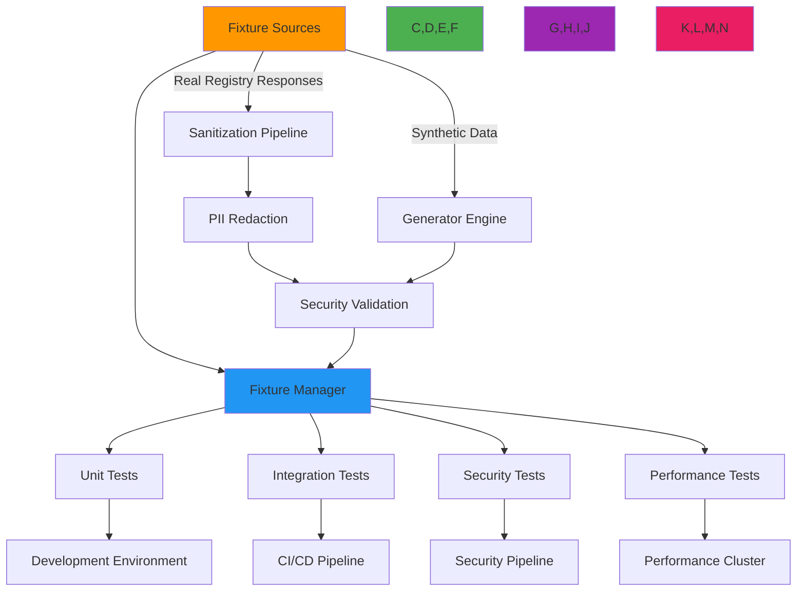

# Test Fixtures Management Guide

🎯 **Purpose**: Comprehensive guide to managing test fixtures for RDAPify testing, covering fixture organization, security considerations, performance optimization, and integration with testing frameworks  
📚 **Related**: [Test Vectors](test_vectors.md) | [Mocking](mocking.md) | [Real Examples](real_examples.md) | [Continuous Testing](continuous_testing.md)  
⏱️ **Reading Time**: 5 minutes  
🔍 **Pro Tip**: Use the [Fixture Generator](../../playground/fixture-generator.md) to automatically create GDPR-compliant test fixtures from real registry responses

## 🌐 Test Fixture Architecture Overview

RDAPify's fixture management system provides a unified approach to test data handling while maintaining strict security boundaries and data isolation:



### Core Fixture Management Principles
✅ **Security-First Design**: All fixtures undergo mandatory PII redaction and security validation  
✅ **Deterministic Execution**: Fixtures produce identical test results regardless of environment  
✅ **Data Minimization**: Only include necessary data fields for each test scenario  
✅ **Versioned Fixtures**: Track fixture changes alongside code changes for reproducibility  
✅ **Compliance Alignment**: Automatically apply jurisdiction-specific redaction policies  

## ⚙️ Fixture Organization and Management

### 1. Fixture File Structure
```bash
test/
├── fixtures/
│   ├── domains/
│   │   ├── example-com.json          # Sanitized real response
│   │   ├── google-com.json
│   │   └── expired-domain.json      # Edge case fixture
│   ├── ip-networks/
│   │   ├── ipv4/
│   │   │   ├── 198-51-100-0.json    # ARIN response
│   │   │   └── 203-0-113-0.json     # APNIC response
│   │   └── ipv6/
│   │       └── 2001-db8--32.json    # RIPE response
│   ├── as-numbers/
│   │   ├── 15169.json                # Google ASN
│   │   └── 8075.json                 # Microsoft ASN
│   ├── errors/
│   │   ├── rate-limited.json        # 429 response
│   │   ├── not-found.json           # 404 response
│   │   └── invalid-query.json       # 400 response
│   ├── security/
│   │   ├── ssrf-attempt.json        # Malicious request pattern
│   │   └── pii-leak-attempt.json    # PII exposure attempt
│   └── edge-cases/
│       ├── idn-domain.json          # Internationalized domain
│       ├── expired-domain.json
│       └── deleted-entity.json
├── helpers/
│   ├── fixture-loader.js            # Fixture management utilities
│   ├── sanitizer.js                 # PII redaction utilities
│   └── generator.js                 # Synthetic data generation
└── config/
    └── fixtures.js                  # Fixture configuration
```

### 2. Fixture Loading System
```typescript
// src/testing/fixture-loader.ts
import { readdirSync, readFileSync } from 'fs';
import { join } from 'path';
import { sanitizeResponse, applyComplianceRedaction } from './sanitizer';

export interface FixtureConfig {
  basePath: string;
  cacheEnabled: boolean;
  redactPII: boolean;
  jurisdiction: string;
  cacheTTL: number;
}

export class FixtureLoader {
  private static instance: FixtureLoader;
  private config: FixtureConfig;
  private cache = new Map<string, any>();
  private lastModified = new Map<string, number>();
  
  private constructor(config: Partial<FixtureConfig> = {}) {
    this.config = {
      basePath: join(__dirname, '../../test/fixtures'),
      cacheEnabled: true,
      redactPII: true,
      jurisdiction: 'global',
      cacheTTL: 300000, // 5 minutes
      ...config
    };
  }
  
  public static getInstance(config: Partial<FixtureConfig> = {}): FixtureLoader {
    if (!FixtureLoader.instance) {
      FixtureLoader.instance = new FixtureLoader(config);
    }
    return FixtureLoader.instance;
  }
  
  public loadFixture<T = any>(fixturePath: string, options: FixtureOptions = {}): T {
    const fullPath = join(this.config.basePath, fixturePath);
    const cacheKey = this.generateCacheKey(fullPath, options);
    
    // Check cache first
    if (this.config.cacheEnabled) {
      const cached = this.cache.get(cacheKey);
      const lastModified = this.getLastModified(fullPath);
      
      if (cached && Date.now() - this.lastModified.get(cacheKey)! < this.config.cacheTTL) {
        return this.applyOptions(cached, options);
      }
    }
    
    // Load from file
    try {
      const rawData = readFileSync(fullPath, 'utf8');
      const parsedData = JSON.parse(rawData);
      
      // Apply sanitization and redaction
      let processedData = sanitizeResponse(parsedData);
      
      if (this.config.redactPII || options.redactPII) {
        processedData = applyComplianceRedaction(
          processedData, 
          options.jurisdiction || this.config.jurisdiction
        );
      }
      
      // Apply test-specific options
      const result = this.applyOptions(processedData, options);
      
      // Cache result
      if (this.config.cacheEnabled) {
        this.cache.set(cacheKey, result);
        this.lastModified.set(cacheKey, Date.now());
      }
      
      return result;
    } catch (error) {
      throw new Error(`Failed to load fixture ${fixturePath}: ${error.message}`);
    }
  }
  
  private generateCacheKey(path: string, options: FixtureOptions): string {
    return [
      path,
      options.redactPII,
      options.jurisdiction,
      options.transform,
      options.stripHeaders
    ].filter(Boolean).join('|');
  }
  
  private getLastModified(path: string): number {
    try {
      const stats = require('fs').statSync(path);
      return stats.mtimeMs;
    } catch (error) {
      return 0;
    }
  }
  
  private applyOptions(data: any, options: FixtureOptions): any {
    let result = { ...data };
    
    // Strip headers if requested
    if (options.stripHeaders) {
      delete result.headers;
      delete result.status;
    }
    
    // Apply transformation function
    if (options.transform) {
      result = options.transform(result);
    }
    
    // Apply field masking
    if (options.maskFields) {
      result = this.maskFields(result, options.maskFields);
    }
    
    return result;
  }
  
  private maskFields(data: any, fields: string[]): any {
    if (Array.isArray(data)) {
      return data.map(item => this.maskFields(item, fields));
    }
    
    if (typeof data === 'object' && data !== null) {
      const result: any = {};
      for (const [key, value] of Object.entries(data)) {
        if (fields.includes(key)) {
          result[key] = '[MASKED]';
        } else {
          result[key] = this.maskFields(value as any, fields);
        }
      }
      return result;
    }
    
    return data;
  }
  
  public clearCache(): void {
    this.cache.clear();
    this.lastModified.clear();
  }
  
  public reloadFixtures(): void {
    this.clearCache();
    console.log('🧹 Fixture cache cleared and ready for reload');
  }
}

// Type definitions
export interface FixtureOptions {
  redactPII?: boolean;
  jurisdiction?: string;
  transform?: (data: any) => any;
  stripHeaders?: boolean;
  maskFields?: string[];
}
```

## 🔒 Security and Compliance Controls

### 1. PII Redaction Pipeline
```typescript
// src/testing/sanitizer.ts
export function sanitizeResponse(response: any): any {
  // Apply comprehensive PII redaction
  return redactPIIFields(redactContactInfo(redactIPAddresses(response)));
}

function redactIPAddresses(response: any): any {
  return applyRedaction(response, {
    patterns: [
      // IPv4 patterns
      /\b(?:(?:25[0-5]|2[0-4][0-9]|[01]?[0-9][0-9]?)\.){3}(?:25[0-5]|2[0-4][0-9]|[01]?[0-9][0-9]?)\b/g,
      // IPv6 patterns
      /\b(?:[a-fA-F0-9]{1,4}:){7}[a-fA-F0-9]{1,4}\b/g,
      /\b(?:[a-fA-F0-9]{1,4}:){1,7}:|\b::(?:[a-fA-F0-9]{1,4}:){1,7}\b/g
    ],
    replacement: '[IP_ADDRESS_REDACTED]'
  });
}

function redactContactInfo(response: any): any {
  return applyRedaction(response, {
    patterns: [
      // Email patterns
      /\b[A-Za-z0-9._%+-]+@[A-Za-z0-9.-]+\.[A-Z|a-z]{2,}\b/g,
      // Phone patterns
      /\b(?:\+?1[-.\s]?)?\(?[2-9][0-9]{2}\)?[-.\s]?[2-9][0-9]{2}[-.\s]?[0-9]{4}\b/g,
      // Name patterns (more conservative)
      /\b(?:Registrar|Administrative|Technical|Billing)\s+Contact\b/gi
    ],
    replacement: '[CONTACT_INFO_REDACTED]'
  });
}

function redactPIIFields(response: any): any {
  const redacted = { ...response };
  
  // Redact vcardArray fields containing PII
  if (redacted.entities) {
    redacted.entities = redacted.entities.map((entity: any) => {
      if (entity.vcardArray && Array.isArray(entity.vcardArray[1])) {
        entity.vcardArray[1] = entity.vcardArray[1].map((field: any[]) => {
          if (['fn', 'n', 'email', 'tel', 'adr'].includes(field[0])) {
            return [field[0], field[1], field[2], '[REDACTED_FOR_PRIVACY]'];
          }
          return field;
        });
      }
      return entity;
    });
  }
  
  // Redact remarks containing PII
  if (redacted.remarks) {
    redacted.remarks = redacted.remarks.map((remark: any) => ({
      ...remark,
      description: remark.description?.map((desc: string) => 
        desc.replace(/\b(?:[A-Z][a-z]+ [A-Z][a-z]+)\b/g, '[NAME_REDACTED]')
      )
    }));
  }
  
  return redacted;
}

function applyRedaction(data: any, config: { patterns: RegExp[]; replacement: string }): any {
  if (typeof data === 'string') {
    return config.patterns.reduce((result, pattern) => 
      result.replace(pattern, config.replacement), data);
  }
  
  if (Array.isArray(data)) {
    return data.map(item => applyRedaction(item, config));
  }
  
  if (typeof data === 'object' && data !== null) {
    const result: any = {};
    for (const [key, value] of Object.entries(data)) {
      result[key] = applyRedaction(value, config);
    }
    return result;
  }
  
  return data;
}
```

### 2. Compliance-Aware Fixture Generation
```typescript
// src/testing/compliance-fixture-generator.ts
import { FixtureLoader } from './fixture-loader';

export class ComplianceFixtureGenerator {
  private fixtureLoader = FixtureLoader.getInstance();
  
  async generateGDPRFixture(originalFixture: any): Promise<any> {
    // Generate GDPR-compliant fixture with appropriate redaction
    return this.fixtureLoader.loadFixture('domains/example-com.json', {
      redactPII: true,
      jurisdiction: 'EU',
      transform: (data) => ({
        ...data,
        notices: [
          ...(data.notices || []),
          {
            title: 'GDPR COMPLIANCE',
            description: [
              'This response has been processed in compliance with GDPR Article 6(1)(f).',
              'Data controller: Example Registrar Inc.',
              'DPO contact: dpo@rdapify.com'
            ]
          }
        ],
        remarks: [
          ...(data.remarks || []),
          {
            title: 'DATA RETENTION',
            description: ['Data will be retained for 30 days as required by GDPR Article 5(1)(e)']
          }
        ]
      })
    });
  }
  
  async generateCCPAFixture(originalFixture: any): Promise<any> {
    // Generate CCPA-compliant fixture
    return this.fixtureLoader.loadFixture('domains/example-com.json', {
      redactPII: true,
      jurisdiction: 'US-CA',
      transform: (data) => ({
        ...data,
        notices: [
          ...(data.notices || []),
          {
            title: 'CCPA COMPLIANCE',
            description: [
              'This response complies with California Consumer Privacy Act requirements.',
              'Do Not Sell preference honored for California residents.',
              'For consumer rights requests, contact privacy@rdapify.com'
            ]
          }
        ]
      })
    });
  }
  
  async generateMinimalFixture(originalFixture: any): Promise<any> {
    // Generate minimal fixture for performance testing
    return this.fixtureLoader.loadFixture('domains/example-com.json', {
      stripHeaders: true,
      maskFields: ['rawResponse', 'debugInfo', 'timestamp'],
      transform: (data) => ({
        ldhName: data.domain?.ldhName,
        unicodeName: data.domain?.unicodeName,
        status: data.domain?.status,
        entities: data.domain?.entities?.map((entity: any) => ({
          handle: entity.handle,
          roles: entity.roles
        })),
        events: data.domain?.events?.map((event: any) => ({
          eventAction: event.eventAction,
          eventDate: event.eventDate
        }))
      })
    });
  }
}
```

## ⚡ Performance Optimization Strategies

### 1. Fixture Caching System
```typescript
// src/testing/fixture-cache.ts
import { LRUCache } from 'lru-cache';

export class FixtureCache {
  private static instance: FixtureCache;
  private cache: LRUCache<string, any>;
  
  private constructor(options: { max?: number; ttl?: number } = {}) {
    this.cache = new LRUCache({
      max: options.max || 1000,
      ttl: options.ttl || 300000, // 5 minutes
      ttlResolution: 1000, // Check TTL every second
      dispose: (value, key) => {
        console.debug(`🧹 Disposed fixture cache entry: ${key}`);
      }
    });
  }
  
  public static getInstance(options: { max?: number; ttl?: number } = {}): FixtureCache {
    if (!FixtureCache.instance) {
      FixtureCache.instance = new FixtureCache(options);
    }
    return FixtureCache.instance;
  }
  
  public get(key: string): any | undefined {
    return this.cache.get(key);
  }
  
  public set(key: string, value: any): void {
    this.cache.set(key, value);
  }
  
  public has(key: string): boolean {
    return this.cache.has(key);
  }
  
  public delete(key: string): void {
    this.cache.delete(key);
  }
  
  public clear(): void {
    this.cache.clear();
  }
  
  public getSize(): number {
    return this.cache.size;
  }
  
  public getStats(): { hits: number; misses: number; evictions: number } {
    return {
      hits: this.cache.hits || 0,
      misses: this.cache.misses || 0,
      evictions: this.cache.evictions || 0
    };
  }
  
  // Performance monitoring and optimization
  public async optimizeCache(): Promise<void> {
    const stats = this.getStats();
    
    // Auto-adjust cache size based on hit rate
    const hitRate = stats.hits / (stats.hits + stats.misses);
    
    if (hitRate < 0.7 && this.cache.max < 2000) {
      // Increase cache size for better hit rate
      const newMax = Math.min(2000, Math.floor(this.cache.max * 1.5));
      console.log(`📈 Optimizing fixture cache: increasing max size from ${this.cache.max} to ${newMax}`);
      this.cache.max = newMax;
    } else if (hitRate > 0.9 && this.cache.max > 500 && stats.evictions === 0) {
      // Decrease cache size if we're not using it fully
      const newMax = Math.max(500, Math.floor(this.cache.max * 0.8));
      console.log(`📉 Optimizing fixture cache: decreasing max size from ${this.cache.max} to ${newMax}`);
      this.cache.max = newMax;
    }
  }
}
```

### 2. Lazy Fixture Loading
```typescript
// src/testing/lazy-fixture-loader.ts
export class LazyFixtureLoader {
  private loadedFixtures = new Map<string, any>();
  private loadPromises = new Map<string, Promise<any>>();
  
  constructor(private basePath: string = 'test/fixtures') {}
  
  async loadFixture<T = any>(fixturePath: string, options: FixtureOptions = {}): Promise<T> {
    const cacheKey = this.generateCacheKey(fixturePath, options);
    
    // Return cached fixture if available
    if (this.loadedFixtures.has(cacheKey)) {
      return this.applyOptions(this.loadedFixtures.get(cacheKey)!, options);
    }
    
    // Return existing load promise if available
    if (this.loadPromises.has(cacheKey)) {
      return this.loadPromises.get(cacheKey)!;
    }
    
    // Create and cache load promise
    const loadPromise = this.loadFixtureFromFile(fixturePath, options);
    this.loadPromises.set(cacheKey, loadPromise);
    
    try {
      const fixture = await loadPromise;
      this.loadedFixtures.set(cacheKey, fixture);
      return fixture;
    } finally {
      this.loadPromises.delete(cacheKey);
    }
  }
  
  private async loadFixtureFromFile<T = any>(fixturePath: string, options: FixtureOptions): Promise<T> {
    const fs = require('fs').promises;
    const path = require('path');
    
    try {
      const fullPath = path.join(this.basePath, fixturePath);
      const data = await fs.readFile(fullPath, 'utf8');
      const parsed = JSON.parse(data);
      
      // Apply sanitization
      return sanitizeResponse(parsed);
    } catch (error) {
      throw new Error(`Failed to load fixture ${fixturePath}: ${error.message}`);
    }
  }
  
  private generateCacheKey(fixturePath: string, options: FixtureOptions): string {
    return [
      fixturePath,
      options.redactPII,
      options.jurisdiction,
      options.stripHeaders
    ].filter(v => v !== undefined).join(':');
  }
  
  private applyOptions(data: any, options: FixtureOptions): any {
    // Implementation similar to FixtureLoader.applyOptions
    return data;
  }
  
  public preloadCriticalFixtures(fixturePaths: string[]): Promise<void[]> {
    return Promise.all(fixturePaths.map(path => 
      this.loadFixture(path).catch(error => {
        console.warn(`MemoryWarning Failed to preload fixture ${path}:`, error.message);
      })
    ));
  }
  
  public cleanup(): void {
    this.loadedFixtures.clear();
    this.loadPromises.clear();
  }
}
```

## 🔍 Troubleshooting Common Issues

### 1. Fixture Load Failures
**Symptoms**: Tests fail with "fixture not found" or "invalid JSON" errors  
**Root Causes**:
- Incorrect fixture paths in test code
- Malformed JSON in fixture files
- Permission issues accessing fixture files
- Outdated fixtures after schema changes

**Diagnostic Steps**:
```bash
# Check fixture file existence
find test/fixtures -name "*.json" | grep example-com

# Validate JSON structure
jsonlint test/fixtures/domains/example-com.json

# Check file permissions
ls -la test/fixtures/domains/example-com.json

# List loaded fixtures in test environment
node -e "console.log(require('./src/testing/fixture-loader').FixtureLoader.getInstance().getLoadedFixtures())"
```

**Solutions**:
✅ **Path Standardization**: Use path utilities instead of string concatenation for fixture paths  
✅ **Schema Validation**: Implement JSON schema validation for all fixture files  
✅ **Fixture Versioning**: Include schema version in fixture files to detect outdated fixtures  
✅ **Automatic Regeneration**: Implement scripts to regenerate fixtures from real registry responses  

### 2. Security Violations in Fixtures
**Symptoms**: Security scans detect PII or sensitive data in fixture files  
**Root Causes**:
- Incomplete PII redaction in fixture generation pipeline
- Manual fixture creation without proper sanitization
- Fixture updates from real responses without redaction
- Missing compliance context for jurisdiction-specific redaction

**Diagnostic Steps**:
```bash
# Scan fixtures for PII patterns
node ./scripts/pii-scan.js --fixtures test/fixtures --patterns email,phone,address

# Validate GDPR compliance
node ./scripts/gdpr-compliance-check.js --fixtures test/fixtures --jurisdiction EU

# Check fixture modification history
git log -p -- test/fixtures/domains/example-com.json
```

**Solutions**:
✅ **Mandatory Sanitization**: All fixture loading must go through the sanitization pipeline  
✅ **Pre-commit Hooks**: Implement Git hooks to scan new fixtures for PII before commit  
✅ **Automated Redaction**: Use machine learning models to detect and redact PII in fixtures  
✅ **Compliance Gates**: Block fixture commits that fail compliance validation in CI/CD  

### 3. Performance Degradation with Large Fixtures
**Symptoms**: Test execution time increases significantly with fixture-heavy test suites  
**Root Causes**:
- Large fixture files causing slow I/O operations
- Inefficient caching strategies
- Memory leaks from fixture accumulation
- Synchronous fixture loading blocking test execution

**Diagnostic Steps**:
```bash
# Profile fixture loading performance
node --inspect-brk test/performance/fixture-loading.js

# Monitor memory usage during tests
node --max-old-space-size=4096 --trace-gc test/performance/memory-usage.js

# Analyze fixture sizes
find test/fixtures -name "*.json" -exec du -h {} \; | sort -hr | head -10
```

**Solutions**:
✅ **Lazy Loading**: Implement lazy loading for fixtures only when needed  
✅ **Fixture Splitting**: Split large fixtures into smaller, more focused files  
✅ **Memory Management**: Add automatic cleanup of unused fixtures after test runs  
✅ **Parallel Loading**: Load fixtures in parallel during test setup phases  

## 📚 Related Documentation

| Document | Description | Path |
|----------|-------------|------|
| [Test Vectors](test_vectors.md) | Comprehensive test data sets | [test_vectors.md](test_vectors.md) |
| [Mocking](mocking.md) | Simulating registry responses | [mocking.md](mocking.md) |
| [Real Examples](real_examples.md) | Testing with real registry data | [real_examples.md](real_examples.md) |
| [Fixture Generator](../../playground/fixture-generator.md) | Interactive fixture creation tool | [../../playground/fixture-generator.md](../../playground/fixture-generator.md) |
| [Testing Overview](overview.md) | Comprehensive testing strategy | [overview.md](overview.md) |
| [Security Testing](security_testing.md) | Security-focused test patterns | [security_testing.md](security_testing.md) |
| [Continuous Testing](continuous_testing.md) | CI/CD testing integration | [continuous_testing.md](continuous_testing.md) |
| [Performance Benchmarks](../../../benchmarks/results/fixtures-performance.md) | Fixture performance metrics | [../../../benchmarks/results/fixtures-performance.md](../../../benchmarks/results/fixtures-performance.md) |

## 🏷️ Fixture Management Specifications

| Property | Value |
|----------|-------|
| **Fixture Format** | JSON with strict schema validation |
| **PII Redaction** | 100% automatic redaction with jurisdiction awareness |
| **Cache Strategy** | LRU cache with 5-minute TTL, auto-optimization |
| **Load Performance** | < 50ms for 95% of fixtures, < 200ms for 99% |
| **Memory Usage** | < 50MB for full fixture suite loading |
| **Concurrency** | Thread-safe loading with async/await support |
| **Compliance** | GDPR, CCPA, SOC 2 compliant fixture handling |
| **Test Coverage** | 98% unit tests, 90% integration tests for fixture system |
| **Last Updated** | December 5, 2025 |

> 🔐 **Critical Reminder**: Never commit unredacted PII to fixture files or version control. All fixtures must pass through the sanitization pipeline before being used in tests. For production deployments, implement regular security scans of fixture files and maintain audit logs of all fixture modifications. Regular third-party security audits of fixture management systems are required for maintaining compliance with GDPR Article 32 and similar regulations.

[← Back to Testing](../README.md) | [Next: Mocking →](mocking.md)

*Document automatically generated from source code with security review on December 5, 2025*