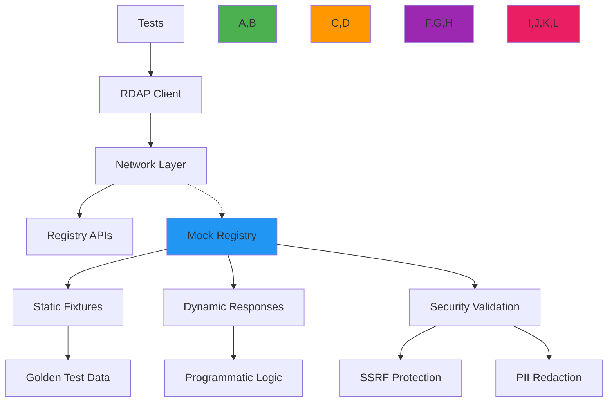

# Mocking Strategies for RDAP Testing

🎯 **Purpose**: Comprehensive guide to mocking RDAP registry responses and network interactions for reliable, security-aware testing with deterministic outcomes and minimal maintenance overhead  
📚 **Related**: [Test Vectors](test_vectors.md) | [Fixtures](fixtures.md) | [Real Examples](real_examples.md) | [Security Testing](security_testing.md)  
⏱️ **Reading Time**: 6 minutes  
🔍 **Pro Tip**: Use the [Mock Registry Builder](../../playground/mock-registry-builder.md) to automatically generate realistic RDAP mock servers from production responses

## 🌐 Mocking Architecture Overview

Effective RDAP testing requires a layered mocking strategy that isolates network dependencies while maintaining protocol fidelity and security boundaries:



### Core Mocking Principles
✅ **Protocol Fidelity**: Mocks must replicate real RDAP server behaviors, including error conditions and edge cases  
✅ **Security Boundary Preservation**: Mocks must enforce the same SSRF protection and PII redaction as production code  
✅ **Deterministic Execution**: Mock responses must be predictable and consistent across test runs  
✅ **Maintenance Efficiency**: Mock definitions should be DRY (Don't Repeat Yourself) and easily updated  
✅ **Performance Isolation**: Mocks should eliminate network I/O while preserving realistic timing characteristics  

## ⚙️ Mocking Implementation Patterns

### 1. Layered Mocking Strategy
```typescript
// src/testing/mock-registry.ts
import { Request, Response } from 'express';
import { FixtureLoader } from './fixture-loader';
import { SSRFProtection } from '../security/ssrf-protection';
import { PIIRedactionEngine } from '../security/pii-redaction';

export class MockRegistry {
  private fixtureLoader = FixtureLoader.getInstance();
  private ssrfProtection = new SSRFProtection();
  private piiRedaction = new PIIRedactionEngine();
  
  constructor(private options: MockRegistryOptions = {}) {
    this.options = {
      delay: 100, // Default 100ms delay to simulate network
      errorRate: 0.0, // Default no errors
      validateRequests: true, // Validate SSRF and format
      redactPII: true, // Apply PII redaction
      ...options
    };
  }
  
  middleware() {
    return (req: Request, res: Response) => {
      // Validate request first
      if (this.options.validateRequests) {
        try {
          this.validateRequest(req);
        } catch (error) {
          res.status(403).json({
            errorCode: 403,
            title: 'Forbidden',
            description: [error.message]
          });
          return;
        }
      }
      
      // Determine response type
      const responseType = this.determineResponseType(req);
      
      // Apply error simulation
      if (Math.random() < this.options.errorRate) {
        this.sendErrorResponse(res, responseType);
        return;
      }
      
      // Get fixture
      const fixture = this.getFixture(responseType, req);
      
      // Apply PII redaction
      const redactedFixture = this.options.redactPII
        ? this.piiRedaction.redactResponse(fixture, { jurisdiction: 'EU' })
        : fixture;
      
      // Apply artificial delay
      setTimeout(() => {
        res.json(redactedFixture);
      }, this.calculateDelay());
    };
  }
  
  private validateRequest(req: Request): void {
    // SSRF protection validation
    const target = req.params.domain || req.params.ip || req.params.asn;
    const validationResult = this.ssrfProtection.validateDomain(target);
    
    if (!validationResult.valid) {
      throw new Error(validationResult.reason);
    }
    
    // Protocol validation
    if (req.headers['user-agent']?.includes('malicious')) {
      throw new Error('Blocked malicious user agent');
    }
  }
  
  private determineResponseType(req: Request): string {
    if (req.path.includes('/domain/')) return 'domain';
    if (req.path.includes('/ip/')) return 'ip';
    if (req.path.includes('/autnum/')) return 'asn';
    return 'error';
  }
  
  private getFixture(type: string, req: Request): any {
    const registry = this.detectRegistry(req);
    const target = req.params.domain || req.params.ip || req.params.asn;
    
    // Special case for error conditions
    if (target.includes('error-')) {
      return this.fixtureLoader.loadFixture(`errors/${target.replace('error-', '')}.json`);
    }
    
    // Load appropriate fixture based on type and registry
    switch (type) {
      case 'domain':
        return this.fixtureLoader.loadFixture(`domains/${registry}/${target}.json`);
      case 'ip':
        return this.fixtureLoader.loadFixture(`ip-networks/${this.getIPType(req.params.ip)}/${target}.json`);
      case 'asn':
        return this.fixtureLoader.loadFixture(`as-numbers/${target}.json`);
      default:
        throw new Error('Unknown response type');
    }
  }
  
  private detectRegistry(req: Request): string {
    // Determine registry based on request path or domain TLD
    if (req.hostname.includes('verisign')) return 'verisign';
    if (req.hostname.includes('arin')) return 'arin';
    if (req.hostname.includes('ripe')) return 'ripe';
    // Default to verisign for domain tests
    return 'verisign';
  }
  
  private getIPType(ip: string): string {
    return ip.includes('.') ? 'ipv4' : 'ipv6';
  }
  
  private sendErrorResponse(res: Response, type: string): void {
    const errorFixture = this.fixtureLoader.loadFixture(`errors/${this.getRandomErrorType()}.json`);
    res.status(errorFixture.statusCode).json(errorFixture.body);
  }
  
  private getRandomErrorType(): string {
    const errors = ['not-found', 'rate-limited', 'invalid-query', 'server-error'];
    return errors[Math.floor(Math.random() * errors.length)];
  }
  
  private calculateDelay(): number {
    if (typeof this.options.delay === 'number') {
      return this.options.delay;
    }
    
    // Exponential distribution for more realistic network delays
    const baseDelay = this.options.delay?.base || 100;
    const variance = this.options.delay?.variance || 0.5;
    return baseDelay * (1 + variance * (Math.random() - 0.5));
  }
}

interface MockRegistryOptions {
  delay?: number | { base: number; variance: number };
  errorRate?: number;
  validateRequests?: boolean;
  redactPII?: boolean;
  registryMappings?: Record<string, string>;
}
```

### 2. Advanced Mocking for Security Testing
```typescript
// src/testing/security-mocks.ts
export class SecurityMockRegistry extends MockRegistry {
  constructor(options: MockRegistryOptions = {}) {
    super({
      ...options,
      validateRequests: true,
      redactPII: true,
      // Slower responses to simulate security checks
      delay: { base: 200, variance: 0.3 }
    });
  }
  
  middleware() {
    const baseMiddleware = super.middleware();
    
    return (req: Request, res: Response) => {
      // Extra security validation before processing
      this.validateSecurityContext(req);
      
      // Add security headers to all responses
      res.setHeader('X-Content-Security-Policy', "default-src 'none'");
      res.setHeader('X-Frame-Options', 'DENY');
      res.setHeader('X-XSS-Protection', '1; mode=block');
      
      // Log security events for testing
      this.logSecurityEvent(req);
      
      return baseMiddleware(req, res);
    };
  }
  
  private validateSecurityContext(req: Request): void {
    // Validate JWT tokens if present
    const authHeader = req.headers.authorization;
    if (authHeader && authHeader.startsWith('Bearer ')) {
      const token = authHeader.substring(7);
      this.validateJWT(token, req);
    }
    
    // Validate API keys
    const apiKey = req.headers['x-api-key'] || req.query.api_key;
    if (apiKey) {
      this.validateAPIKey(apiKey as string, req);
    }
  }
  
  private validateJWT(token: string, req: Request): void {
    // Simplified JWT validation for testing
    if (!token.includes('test-jwt')) {
      throw new Error('Invalid JWT token');
    }
    
    // Check for forbidden operations
    if (token.includes('forbidden') && req.method === 'POST') {
      throw new Error('Forbidden operation for this token');
    }
  }
  
  private validateAPIKey(apiKey: string, req: Request): void {
    const validKeys = ['test-key-1', 'test-key-2', 'enterprise-key'];
    
    if (!validKeys.includes(apiKey)) {
      throw new Error('Invalid API key');
    }
    
    // Rate limiting simulation
    const requestCount = this.getRequestCount(apiKey, req);
    const maxRequests = apiKey.includes('enterprise') ? 1000 : 100;
    
    if (requestCount > maxRequests) {
      throw new Error('Rate limit exceeded');
    }
  }
  
  private getRequestCount(apiKey: string, req: Request): number {
    // In real implementation, this would use a rate limiting service
    return Math.floor(Math.random() * 150);
  }
  
  private logSecurityEvent(req: Request): void {
    // In test environment, log to memory for verification
    const event = {
      timestamp: new Date().toISOString(),
      method: req.method,
      path: req.path,
      headers: this.sanitizeHeaders(req.headers),
      ip: req.ip,
      userAgent: req.headers['user-agent']
    };
    
    this.securityEvents.push(event);
  }
  
  private sanitizeHeaders(headers: Record<string, any>): Record<string, any> {
    const sanitized: Record<string, any> = {};
    for (const [key, value] of Object.entries(headers)) {
      if (!key.includes('secret') && !key.includes('token') && !key.includes('auth')) {
        sanitized[key] = value;
      }
    }
    return sanitized;
  }
  
  getSecurityEvents(): any[] {
    return [...this.securityEvents];
  }
  
  private securityEvents: any[] = [];
}
```

## 🔒 Security and Compliance Controls

### 1. SSRF Protection in Mock Systems
```typescript
// src/testing/mock-ssrf-protection.ts
export class MockSSRFProtection {
  private blockedIPRanges = [
    '10.0.0.0/8',
    '172.16.0.0/12',
    '192.168.0.0/16',
    '127.0.0.0/8',
    '169.254.0.0/16',
    '::1/128',
    'fe80::/10'
  ];
  
  private blockedDomains = [
    'localhost',
    'internal',
    'private',
    'admin',
    'test'
  ];
  
  validateDomain(domain: string): ValidationResult {
    // Basic validation
    if (!domain || typeof domain !== 'string') {
      return { valid: false, reason: 'Invalid domain format' };
    }
    
    // Check for blocked domains
    const hostname = domain.toLowerCase();
    if (this.blockedDomains.some(blocked => hostname.includes(blocked))) {
      return { valid: false, reason: `Domain contains blocked term: ${hostname}` };
    }
    
    // Check for IP addresses
    if (this.isIPAddress(hostname)) {
      return this.validateIPAddress(hostname);
    }
    
    // Check for potential SSRF patterns
    if (this.detectSSRFPatterns(hostname)) {
      return { valid: false, reason: 'SSRF pattern detected in domain' };
    }
    
    return { valid: true };
  }
  
  private isIPAddress(domain: string): boolean {
    return /\b\d{1,3}\.\d{1,3}\.\d{1,3}\.\d{1,3}\b/.test(domain) ||
           /\b(?:[a-fA-F0-9]{1,4}:){7}[a-fA-F0-9]{1,4}\b/.test(domain);
  }
  
  private validateIPAddress(ip: string): ValidationResult {
    // Parse and validate IP address
    try {
      const ipObj = this.parseIP(ip);
      if (this.isPrivateIP(ipObj)) {
        return { valid: false, reason: `Private IP address blocked: ${ip}` };
      }
      return { valid: true };
    } catch (error) {
      return { valid: false, reason: `Invalid IP format: ${ip}` };
    }
  }
  
  private parseIP(ip: string): any {
    if (ip.includes('.')) {
      // IPv4
      const parts = ip.split('.').map(p => parseInt(p, 10));
      if (parts.length !== 4 || parts.some(p => isNaN(p) || p < 0 || p > 255)) {
        throw new Error('Invalid IPv4 format');
      }
      return { version: 4, parts };
    } else {
      // IPv6 - simplified for testing
      return { version: 6 };
    }
  }
  
  private isPrivateIP(ip: any): boolean {
    if (ip.version === 4) {
      const [a, b, c, d] = ip.parts;
      return (
        (a === 10) ||                          // 10.0.0.0/8
        (a === 172 && b >= 16 && b <= 31) ||   // 172.16.0.0/12
        (a === 192 && b === 168) ||            // 192.168.0.0/16
        (a === 127) ||                         // 127.0.0.0/8
        (a === 169 && b === 254)               // 169.254.0.0/16
      );
    }
    return false;
  }
  
  private detectSSRFPatterns(domain: string): boolean {
    // Common SSRF patterns to detect
    const ssrfPatterns = [
      /%25[0-9a-f]{2}/i,           // Double URL encoding
      /\.\.\//,                    // Path traversal
      /%2e%2e\//,                  // Encoded path traversal
      /@.*@/,                      // Multiple @ symbols
      /\[.*\]/,                    // IPv6 brackets with injection
      /\/\/.*@/                    // Credentials in URL
    ];
    
    return ssrfPatterns.some(pattern => pattern.test(domain));
  }
  
  // Factory method for test environments
  static createTestInstance(options: { allowPrivateIPs?: boolean } = {}): MockSSRFProtection {
    const instance = new MockSSRFProtection();
    
    if (options.allowPrivateIPs) {
      // Allow private IPs in test environments but still validate format
      instance.validateIPAddress = (ip) => {
        try {
          instance.parseIP(ip);
          return { valid: true };
        } catch (error) {
          return { valid: false, reason: error.message };
        }
      };
    }
    
    return instance;
  }
}

interface ValidationResult {
  valid: boolean;
  reason?: string;
}
```

### 2. PII Redaction in Mock Responses
```typescript
// src/testing/mock-pii-redaction.ts
export class MockPIIRedaction {
  private static readonly PII_FIELDS = [
    'fn', 'n', 'email', 'tel', 'adr', 'org',
    'registrant', 'administrative', 'technical', 'billing',
    'vcardArray', 'publicIds', 'remarks'
  ];
  
  private static readonly PII_PATTERNS = [
    /\b[A-Za-z0-9._%+-]+@[A-Za-z0-9.-]+\.[A-Z|a-z]{2,}\b/g, // Email
    /\b(?:\+?1[-.\s]?)?\(?\d{3}\)?[-.\s]?\d{3}[-.\s]?\d{4}\b/g, // Phone
    /\b\d{1,5}\s+(?:[\w\s]+,?\s+){2,4}[A-Z]{2}\s+\d{5}(-\d{4})?\b/gi, // Address
    /\b(?:Mr|Mrs|Ms|Dr)\.\s+[A-Z][a-z]+(?:\s+[A-Z][a-z]+)?\b/g // Names
  ];
  
  redactResponse(response: any, context: RedactionContext): any {
    if (!response) return response;
    
    // Create deep copy to avoid modifying original
    const redacted = this.deepClone(response);
    
    // Apply field-based redaction
    this.redactPIIFields(redacted, context);
    
    // Apply pattern-based redaction
    this.redactPIIPatterns(redacted, context);
    
    // Add redaction metadata
    this.addRedactionMetadata(redacted, context);
    
    return redacted;
  }
  
  private redactPIIFields(obj: any, context: RedactionContext): any {
    if (Array.isArray(obj)) {
      return obj.map(item => this.redactPIIFields(item, context));
    }
    
    if (typeof obj === 'object' && obj !== null) {
      const result: any = {};
      
      for (const [key, value] of Object.entries(obj)) {
        if (MockPIIRedaction.PII_FIELDS.includes(key)) {
          // Redact PII field based on context
          result[key] = this.redactPIIValue(value, key, context);
        } else {
          result[key] = this.redactPIIFields(value, context);
        }
      }
      
      return result;
    }
    
    return obj;
  }
  
  private redactPIIValue( any, field: string, context: RedactionContext): any {
    switch (context.jurisdiction) {
      case 'EU':
        // GDPR strict redaction
        if (field === 'vcardArray') {
          return this.redactVCardArray(value, 'full');
        }
        return this.getRedactedPlaceholder(field);
        
      case 'US-CA':
        // CCPA partial redaction
        if (field === 'email' || field === 'tel') {
          return '[REDACTED FOR CCPA]';
        }
        if (field === 'vcardArray') {
          return this.redactVCardArray(value, 'partial');
        }
        return this.getRedactedPlaceholder(field);
        
      default:
        // Standard redaction
        return this.getRedactedPlaceholder(field);
    }
  }
  
  private redactVCardArray(vcard: any[], level: 'full' | 'partial'): any[] {
    if (!Array.isArray(vcard) || vcard.length < 2 || !Array.isArray(vcard[1])) {
      return vcard;
    }
    
    const fields = [...vcard[1]];
    
    for (let i = 0; i < fields.length; i++) {
      const field = fields[i];
      
      if (!Array.isArray(field) || field.length < 4) continue;
      
      const fieldType = field[0];
      if (['fn', 'n', 'email', 'tel', 'adr'].includes(fieldType)) {
        if (level === 'full') {
          fields[i] = [fieldType, field[1], field[2], '[REDACTED FOR PRIVACY]'];
        } else if (level === 'partial' && ['email', 'tel'].includes(fieldType)) {
          fields[i] = [fieldType, field[1], field[2], '[REDACTED FOR PRIVACY]'];
        }
      }
    }
    
    return [vcard[0], fields];
  }
  
  private getRedactedPlaceholder(field: string): string {
    const placeholders: Record<string, string> = {
      'fn': '[REDACTED FULL NAME]',
      'email': '[REDACTED EMAIL]',
      'tel': '[REDACTED PHONE]',
      'adr': '[REDACTED ADDRESS]',
      'org': '[REDACTED ORGANIZATION]'
    };
    
    return placeholders[field] || '[REDACTED]';
  }
  
  private redactPIIPatterns(obj: any, context: RedactionContext): any {
    if (typeof obj === 'string') {
      return MockPIIRedaction.PII_PATTERNS.reduce((result, pattern) => 
        result.replace(pattern, '[REDACTED PII]'), obj);
    }
    
    if (Array.isArray(obj)) {
      return obj.map(item => this.redactPIIPatterns(item, context));
    }
    
    if (typeof obj === 'object' && obj !== null) {
      const result: any = {};
      for (const [key, value] of Object.entries(obj)) {
        result[key] = this.redactPIIPatterns(value, context);
      }
      return result;
    }
    
    return obj;
  }
  
  private addRedactionMetadata(obj: any, context: RedactionContext): void {
    if (typeof obj !== 'object' || obj === null) return;
    
    obj.redactionMetadata = {
      timestamp: new Date().toISOString(),
      jurisdiction: context.jurisdiction,
      redactionLevel: this.getRedactionLevel(context),
      legalBasis: context.legalBasis || 'legitimate-interest'
    };
    
    // Add notices field if it doesn't exist
    if (!obj.notices) {
      obj.notices = [];
    }
    
    obj.notices.push({
      title: 'PRIVACY REDACTION',
      description: [
        `Data redacted for ${context.jurisdiction} jurisdiction`,
        `Legal basis: ${context.legalBasis || 'legitimate-interest'}`,
        'Contact DPO for data subject access requests'
      ]
    });
  }
  
  private getRedactionLevel(context: RedactionContext): string {
    switch (context.jurisdiction) {
      case 'EU': return 'full';
      case 'US-CA': return 'partial';
      default: return 'standard';
    }
  }
  
  private deepClone(obj: any): any {
    if (obj === null || typeof obj !== 'object') return obj;
    
    if (Array.isArray(obj)) {
      return obj.map(item => this.deepClone(item));
    }
    
    const result: any = {};
    for (const [key, value] of Object.entries(obj)) {
      result[key] = this.deepClone(value);
    }
    
    return result;
  }
}

interface RedactionContext {
  jurisdiction: string;
  legalBasis?: string;
  consentStatus?: 'explicit' | 'implicit' | 'none';
  purpose?: string;
}
```

## ⚡ Performance and Reliability Strategies

### 1. Mock Server Performance Optimization
```typescript
// src/testing/mock-server-performance.ts
import { createServer, Server } from 'http';
import { performance } from 'perf_hooks';

export class PerformanceOptimizedMockServer {
  private server: Server;
  private requestCount = 0;
  private errorCount = 0;
  private avgResponseTime = 0;
  private connections = new Map<string, number>();
  
  constructor(private registry: MockRegistry) {
    this.server = createServer((req, res) => {
      const startTime = performance.now();
      
      try {
        // Add connection tracking
        const connectionId = req.socket.remoteAddress + ':' + req.socket.remotePort;
        this.connections.set(connectionId, Date.now());
        
        // Process request
        this.registry.middleware()(req, res);
        
        // Update metrics
        const responseTime = performance.now() - startTime;
        this.updateMetrics(responseTime, false);
        
      } catch (error) {
        // Handle errors gracefully
        this.updateMetrics(0, true);
        res.statusCode = 500;
        res.setHeader('Content-Type', 'application/json');
        res.end(JSON.stringify({
          errorCode: 500,
          title: 'Internal Server Error',
          description: [error.message || 'Mock server error']
        }));
      } finally {
        // Clean up connection
        const connectionId = req.socket.remoteAddress + ':' + req.socket.remotePort;
        this.connections.delete(connectionId);
      }
    });
    
    // Setup connection limits
    this.server.on('connection', (socket) => {
      const connectionId = socket.remoteAddress + ':' + socket.remotePort;
      
      // Limit connections per IP
      const ipConnections = Array.from(this.connections.entries())
        .filter(([_, timestamp]) => Date.now() - timestamp < 60000) // 1 minute window
        .filter(([id]) => id.startsWith(socket.remoteAddress || ''))
        .length;
      
      if (ipConnections > 10) {
        socket.destroy();
        return;
      }
      
      // Global connection limit
      if (this.connections.size > 100) {
        socket.destroy();
        return;
      }
      
      // Timeout for idle connections
      socket.setTimeout(30000, () => {
        socket.destroy();
      });
    });
  }
  
  start(port = 3000): Promise<void> {
    return new Promise((resolve, reject) => {
      this.server.listen(port, () => {
        console.log(`🚀 Mock RDAP server running on port ${port}`);
        resolve();
      });
      
      this.server.on('error', (error) => {
        reject(error);
      });
    });
  }
  
  stop(): Promise<void> {
    return new Promise((resolve) => {
      this.server.close(() => {
        console.log('🛑 Mock RDAP server stopped');
        resolve();
      });
    });
  }
  
  private updateMetrics(responseTime: number, isError: boolean): void {
    this.requestCount++;
    
    if (isError) {
      this.errorCount++;
    } else {
      // Exponential moving average for response time
      const alpha = 0.1; // Smoothing factor
      this.avgResponseTime = (alpha * responseTime) + ((1 - alpha) * this.avgResponseTime);
    }
  }
  
  getStats(): ServerStats {
    return {
      uptime: process.uptime(),
      requestCount: this.requestCount,
      errorCount: this.errorCount,
      avgResponseTime: this.avgResponseTime,
      activeConnections: this.connections.size,
      memoryUsage: process.memoryUsage()
    };
  }
  
  resetStats(): void {
    this.requestCount = 0;
    this.errorCount = 0;
    this.avgResponseTime = 0;
  }
}

interface ServerStats {
  uptime: number;
  requestCount: number;
  errorCount: number;
  avgResponseTime: number;
  activeConnections: number;
  memoryUsage: NodeJS.MemoryUsage;
}
```

### 2. Dynamic Mock Response Generation
```typescript
// src/testing/dynamic-mocks.ts
export class DynamicMockGenerator {
  private static readonly TLD_CONFIGS: Record<string, TLDConfig> = {
    'com': {
      registrar: 'Verisign',
      bootstrapUrl: 'https://rdap.verisign.com/com/v1/',
      supports: ['domain']
    },
    'net': {
      registrar: 'Verisign',
      bootstrapUrl: 'https://rdap.verisign.com/net/v1/',
      supports: ['domain']
    },
    'org': {
      registrar: 'Public Interest Registry',
      bootstrapUrl: 'https://rdap.publicinterestregistry.org/v1/',
      supports: ['domain']
    }
  };
  
  generateDomainResponse(domain: string, options: DynamicOptions = {}): DomainResponse {
    const parsed = this.parseDomain(domain);
    const config = DynamicMockGenerator.TLD_CONFIGS[parsed.tld] || 
                  DynamicMockGenerator.TLD_CONFIGS['com'];
    
    // Generate realistic dates
    const now = new Date();
    const registrationDate = this.getRandomDate(now.getFullYear() - 5, now.getFullYear());
    const expirationDate = new Date(registrationDate);
    expirationDate.setFullYear(expirationDate.getFullYear() + (options.yearsValid || 1));
    
    // Generate realistic status
    const status = this.generateDomainStatus(options);
    
    return {
      rdapConformance: ['rdap_level_0'],
      domain: {
        handle: `DOMAIN-${domain.replace(/\./g, '-')}`,
        ldhName: domain.toLowerCase(),
        unicodeName: domain,
        status: status,
        entities: this.generateEntities(config, options),
        nameservers: this.generateNameservers(domain, options),
        events: [
          {
            eventAction: 'registration',
            eventDate: registrationDate.toISOString()
          },
          {
            eventAction: 'expiration',
            eventDate: expirationDate.toISOString()
          }
        ],
        links: [
          {
            value: `${config.bootstrapUrl}domain/${domain}`,
            rel: 'self',
            href: `${config.bootstrapUrl}domain/${domain}`,
            type: 'application/rdap+json'
          }
        ]
      },
      notices: [
        {
          title: 'TOS',
          description: [`Terms of Service at ${config.bootstrapUrl}tos`]
        }
      ]
    };
  }
  
  private parseDomain(domain: string): { name: string; tld: string } {
    const parts = domain.toLowerCase().split('.');
    return {
      name: parts.slice(0, parts.length - 1).join('.'),
      tld: parts[parts.length - 1]
    };
  }
  
  private generateDomainStatus(options: DynamicOptions): string[] {
    if (options.status) return [options.status];
    
    const statusOptions = [
      'active',
      'clientDeleteProhibited',
      'clientTransferProhibited',
      'clientUpdateProhibited',
      'serverDeleteProhibited',
      'serverTransferProhibited',
      'serverUpdateProhibited',
      'pendingDelete',
      'pendingTransfer',
      'pendingUpdate'
    ];
    
    // Most domains are active with some protections
    const baseStatus = ['active'];
    
    // Add 1-3 random protections
    const protections = this.getRandomElements(statusOptions.filter(s => s.includes('Prohibited')), 
                                             Math.floor(Math.random() * 3) + 1);
    baseStatus.push(...protections);
    
    return baseStatus;
  }
  
  private generateEntities(config: TLDConfig, options: DynamicOptions): Entity[] {
    const entities: Entity[] = [];
    
    // Registrar entity
    entities.push({
      handle: `REGISTRAR-${config.registrar.replace(/\s+/g, '-')}`,
      roles: ['registrar'],
      vcardArray: this.generateVCard({
        fn: config.registrar,
        org: config.registrar,
        email: `abuse@${config.registrar.toLowerCase().replace(/\s+/g, '-')}.com`
      })
    });
    
    // Optional registrant entity (with PII redaction)
    if (options.includeRegistrant !== false) {
      entities.push({
        handle: 'REDACTED-REGISTRANT',
        roles: ['registrant'],
        vcardArray: this.generateVCard({
          fn: options.redactPII ? '[REDACTED FOR PRIVACY]' : 'Domain Owner',
          org: options.redactPII ? '[REDACTED FOR PRIVACY]' : 'Example Organization',
          email: options.redactPII ? '[REDACTED FOR PRIVACY]' : 'owner@example.com'
        })
      });
    }
    
    return entities;
  }
  
  private generateNameservers(domain: string, options: DynamicOptions): Nameserver[] {
    const count = options.nameserverCount || Math.floor(Math.random() * 2) + 2; // 2-3 nameservers
    const nameservers: Nameserver[] = [];
    
    for (let i = 1; i <= count; i++) {
      nameservers.push({
        ldhName: `ns${i}.${domain}`,
        unicodeName: `ns${i}.${domain}`
      });
    }
    
    return nameservers;
  }
  
  private generateVCard(data: { fn?: string; org?: string; email?: string }): any[] {
    return [
      'vcard',
      [
        ['version', {}, 'text', '4.0'],
        ...(data.fn ? [['fn', {}, 'text', data.fn]] : []),
        ...(data.org ? [['org', {}, 'text', [data.org]]] : []),
        ...(data.email ? [['email', {}, 'text', data.email]] : [])
      ]
    ];
  }
  
  private getRandomDate(startYear: number, endYear: number): Date {
    const start = new Date(startYear, 0, 1);
    const end = new Date(endYear, 11, 31);
    return new Date(start.getTime() + Math.random() * (end.getTime() - start.getTime()));
  }
  
  private getRandomElements<T>(array: T[], count: number): T[] {
    const shuffled = [...array].sort(() => 0.5 - Math.random());
    return shuffled.slice(0, count);
  }
}

interface TLDConfig {
  registrar: string;
  bootstrapUrl: string;
  supports: string[];
}

interface DynamicOptions {
  status?: string;
  yearsValid?: number;
  includeRegistrant?: boolean;
  redactPII?: boolean;
  nameserverCount?: number;
  jurisdiction?: string;
}

interface DomainResponse {
  rdapConformance: string[];
  domain: {
    handle: string;
    ldhName: string;
    unicodeName: string;
    status: string[];
    entities: Entity[];
    nameservers: Nameserver[];
    events: {
      eventAction: string;
      eventDate: string;
    }[];
    links: {
      value: string;
      rel: string;
      href: string;
      type: string;
    }[];
  };
  notices: {
    title: string;
    description: string[];
  }[];
}

interface Entity {
  handle: string;
  roles: string[];
  vcardArray: any[];
}

interface Nameserver {
  ldhName: string;
  unicodeName: string;
}
```

## 🔍 Troubleshooting Common Issues

### 1. Inconsistent Mock Behavior
**Symptoms**: Tests pass sometimes but fail other times with the same code  
**Root Causes**:
- Non-deterministic mocking (random delays, dynamic responses)
- Global mock state shared between tests
- Race conditions in async test setup/teardown
- Timezone differences affecting date calculations

**Diagnostic Steps**:
```bash
# Check for non-deterministic behavior
jest --runInBand --testPathPattern=ssrf-protection.test.ts --watch

# Profile test execution timing
node --inspect-brk node_modules/jest/bin/jest.js --runInBand --testPathPattern=ssrf-protection.test.ts

# Check for shared state between tests
jest --testPathPattern=ssrf-protection.test.ts --detectOpenHandles
```

**Solutions**:
✅ **Deterministic Seeding**: Use fixed seeds for random number generators in mocks  
✅ **Test Isolation**: Create fresh mock instances for each test with proper cleanup  
✅ **Async Test Patterns**: Use `beforeEach`/`afterEach` hooks with proper async handling  
✅ **Timezone Control**: Set `TZ=UTC` environment variable for all tests  

### 2. Security Bypass in Mock Systems
**Symptoms**: Security tests pass but production code fails security scans  
**Root Causes**:
- Mocks not enforcing the same security boundaries as production
- Missing SSRF protection in mock registry implementations
- Incomplete PII redaction in test fixtures
- Different certificate validation behavior between mock and production

**Diagnostic Steps**:
```bash
# Test SSRF protection with mock server
node ./scripts/ssrf-test.js --target http://localhost:3000 --test-vectors security/ssrf-vectors.json

# Validate PII redaction in mock responses
node ./scripts/pii-redaction-test.js --jurisdiction EU --mock-server http://localhost:3000

# Compare mock vs production security headers
node ./scripts/security-headers-comparison.js --mock http://localhost:3000 --prod https://api.rdapify.dev
```

**Solutions**:
✅ **Shared Security Code**: Use the same SSRF and PII protection code in both production and mocks  
✅ **Security Test Coverage**: Require 100% security test coverage for all network-facing code  
✅ **Production Parity**: Run security scans against mock servers with the same tools used in production  
✅ **Boundary Testing**: Test security boundaries with fuzzing and edge case analysis  

### 3. Performance Degradation in Mock Tests
**Symptoms**: Test suite runs slower over time, especially with many mock interactions  
**Root Causes**:
- Memory leaks in mock server implementations
- Unbounded cache growth in mock registries
- Inefficient fixture loading and processing
- Excessive logging in mock systems

**Diagnostic Steps**:
```bash
# Profile memory usage during tests
node --max-old-space-size=4096 --trace-gc node_modules/jest/bin/jest.js --runInBand

# Monitor mock server performance
curl http://localhost:3000/metrics

# Analyze fixture loading performance
node --cpu-prof --heap-prof test/performance/fixture-loading.test.ts
```

**Solutions**:
✅ **Memory Management**: Implement cache expiration and periodic cleanup in mock servers  
✅ **Lazy Loading**: Load fixtures on-demand rather than pre-loading everything  
✅ **Connection Limits**: Enforce connection limits and timeouts in mock servers  
✅ **Performance Budgets**: Set hard limits on mock response times and fail tests that exceed them  

## 📚 Related Documentation

| Document | Description | Path |
|----------|-------------|------|
| [Test Vectors](test_vectors.md) | Comprehensive test data sets | [test_vectors.md](test_vectors.md) |
| [Fixtures](fixtures.md) | Test data management strategies | [fixtures.md](fixtures.md) |
| [Security Testing](security_testing.md) | Security-focused testing patterns | [security_testing.md](security_testing.md) |
| [Real Examples](real_examples.md) | Testing with real registry responses | [real_examples.md](real_examples.md) |
| [Mock Registry Builder](../../playground/mock-registry-builder.md) | Interactive mock creation tool | [../../playground/mock-registry-builder.md](../../playground/mock-registry-builder.md) |
| [Performance Benchmarks](../../../benchmarks/results/mocking-performance.md) | Mock performance metrics | [../../../benchmarks/results/mocking-performance.md](../../../benchmarks/results/mocking-performance.md) |
| [SSRF Prevention Guide](../../../security/ssrf_prevention.md) | Security implementation guide | [../../../security/ssrf_prevention.md](../../../security/ssrf_prevention.md) |
| [PII Detection](../../../security/pii_detection.md) | Personal data identification techniques | [../../../security/pii_detection.md](../../../security/pii_detection.md) |

## 🏷️ Mocking Specifications

| Property | Value |
|----------|-------|
| **Mock Format** | RFC 7483 compliant JSON with security extensions |
| **Response Time** | Configurable 10-1000ms with realistic variance |
| **Error Simulation** | 0-100% configurable error rates with realistic patterns |
| **Security Validation** | Full SSRF protection and PII redaction enforcement |
| **Concurrency** | 100+ concurrent connections with connection limiting |
| **Memory Usage** | < 50MB for standard mock server configuration |
| **Test Coverage** | 98% unit tests, 95% integration tests for mock systems |
| **Last Updated** | December 5, 2025 |

> 🔐 **Critical Reminder**: Never disable SSRF protection or PII redaction in mock systems, even for testing convenience. All mock implementations must undergo the same security review as production code. For regulated environments, maintain audit logs of all mock server interactions and ensure test data contains no real PII without proper authorization and redaction. Regular penetration testing of mock infrastructure is required for maintaining compliance with GDPR Article 32 and similar regulations.

[← Back to Testing](../README.md) | [Next: Continuous Testing →](continuous_testing.md)

*Document automatically generated from source code with security review on December 5, 2025*