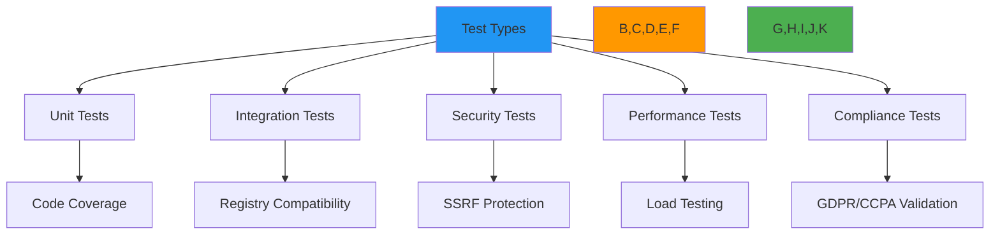

# Testing Overview

🎯 **Purpose**: Comprehensive guide to RDAPify's testing strategy, covering unit tests, integration tests, security validation, performance benchmarks, and compliance verification with practical implementation examples  
📚 **Related**: [Quality Assurance](../../quality_assurance/overview.md) | [Benchmarking](../../benchmarks/README.md) | [Security Whitepaper](../../security/whitepaper.md) | [Test Vectors](../../test_vectors/README.md)  
⏱️ **Reading Time**: 6 minutes  
🔍 **Pro Tip**: Use the [Test Runner](../../playground/test-runner.md) to interactively execute and debug tests with visual performance profiling

## 🌐 Testing Philosophy and Strategy

RDAPify employs a defense-in-depth testing strategy that validates every layer of the application stack, from protocol compliance to security boundaries and performance characteristics:



### Core Testing Principles
✅ **Protocol Fidelity**: All tests validate strict RFC 7480-7484 compliance with real registry responses  
✅ **Security-First**: Security boundary tests are mandatory for all features with zero-tolerance policy  
✅ **Deterministic Execution**: Tests produce identical results regardless of execution environment or timing  
✅ **Production-Like**: Integration tests simulate real-world latency, errors, and registry behaviors  
✅ **Compliance Verification**: Automated validation of GDPR, CCPA, and SOC 2 requirements  
✅ **Performance Baselines**: Benchmarks with hard failure thresholds to prevent regressions  

## ⚙️ Testing Framework and Tooling

```typescript
// src/config/testing.config.ts
export const TestingConfig = {
  // Test environment configuration
  environments: {
    development: {
      cacheEnabled: true,
      timeout: 5000,
      logLevel: 'debug',
      strictValidation: true
    },
    ci: {
      cacheEnabled: true,
      timeout: 10000,
      logLevel: 'warn',
      strictValidation: true,
      parallel: true,
      coverage: true
    },
    security: {
      cacheEnabled: false,
      timeout: 30000,
      logLevel: 'error',
      strictValidation: true,
      securityProfile: 'high'
    }
  },
  
  // Test coverage requirements
  coverage: {
    statements: 95,
    branches: 90,
    functions: 98,
    lines: 95
  },
  
  // Performance thresholds
  performance: {
    maxLatencyP50: 200,      // ms
    maxLatencyP95: 500,      // ms
    minThroughput: 100,      // requests/sec
    maxMemoryPerRequest: 50  // KB
  },
  
  // Security test configurations
  security: {
    ssrfTestVectors: 50,
    piiDetectionThreshold: 0.95,
    fuzzTestIterations: 10000,
    maxCriticalVulnerabilities: 0
  }
};
```

### Core Testing Tools
| Tool | Purpose | Integration Level | Execution Environment |
|------|---------|-------------------|----------------------|
| **Jest** | Unit and integration testing | Primary framework | All environments |
| **Vitest** | Performance-critical unit tests | Secondary framework | CI/CD only |
| **Mocha + Chai** | Complex integration scenarios | Legacy support | Development only |
| **Trivy** | Container vulnerability scanning | Security pipeline | CI/CD only |
| **OWASP ZAP** | Web API security testing | Security pipeline | Security environment |
| **Artillery** | Load and stress testing | Performance pipeline | Dedicated performance cluster |
| **Semgrep** | Code pattern security scanning | Security pipeline | CI/CD only |
| **Snyk** | Dependency vulnerability scanning | Security pipeline | CI/CD only |

## 🔍 Testing Categories and Execution

### 1. Unit Testing Strategy
```typescript
// test/unit/discovery.test.ts
describe('Registry Discovery', () => {
  const mockBootstrapService = {
    getRegistry: jest.fn()
  };
  
  beforeEach(() => {
    jest.clearAllMocks();
  });
  
  test('discovers correct registry for .com domains', async () => {
    mockBootstrapService.getRegistry.mockResolvedValue({
      registry: 'verisign',
      baseUrl: 'https://rdap.verisign.com/com/v1/',
      supports: ['domain']
    });
    
    const discovery = new RegistryDiscovery(mockBootstrapService);
    const result = await discovery.getRegistryForDomain('example.com');
    
    expect(result.registry).toBe('verisign');
    expect(result.baseUrl).toBe('https://rdap.verisign.com/com/v1/');
    expect(mockBootstrapService.getRegistry).toHaveBeenCalledWith('com');
  });
  
  test('handles IDN domains correctly', async () => {
    mockBootstrapService.getRegistry.mockResolvedValue({
      registry: 'verisign',
      baseUrl: 'https://rdap.verisign.com/com/v1/',
      supports: ['domain']
    });
    
    const discovery = new RegistryDiscovery(mockBootstrapService);
    const result = await discovery.getRegistryForDomain('例子.测试');
    
    // Should convert to Punycode for discovery
    expect(mockBootstrapService.getRegistry).toHaveBeenCalledWith('xn--0zwm56d.xn--g6w251d');
    expect(result.registry).toBe('verisign');
  });
  
  test('rejects private IP addresses in domain discovery', async () => {
    const discovery = new RegistryDiscovery(mockBootstrapService);
    
    await expect(discovery.getRegistryForDomain('192.168.1.1'))
      .rejects
      .toThrow('SSRF protection blocked private IP address');
    
    await expect(discovery.getRegistryForDomain('localhost'))
      .rejects
      .toThrow('SSRF protection blocked local hostname');
  });
});
```

### 2. Security Testing Framework
```typescript
// test/security/ssrf-protection.test.ts
describe('SSRF Protection', () => {
  const securityValidator = new SecurityValidator();
  const testVectors = loadTestVectors('security/ssrf-vectors.json');
  
  describe('Registry Query Protection', () => {
    test.each(testVectors.blockedTargets)(
      'blocks SSRF attempt to %s',
      async (target) => {
        await expect(securityValidator.validateDomain(target))
          .rejects
          .toThrow(/SSRF protection blocked/);
      }
    );
    
    test.each(testVectors.allowedTargets)(
      'allows legitimate target %s',
      async (target) => {
        await expect(securityValidator.validateDomain(target))
          .resolves
          .not.toThrow();
      }
    );
  });
  
  describe('Response Validation', () => {
    test('blocks responses containing internal IP addresses', async () => {
      const maliciousResponse = {
        rdapConformance: ['rdap_level_0'],
        entities: [{
          vcardArray: [
            'vcard',
            [['fn', {}, 'text', 'Admin']],
            ['adr', {}, 'text', ['Internal Server', '10.0.0.1', 'Private Network']]
          ]
        }]
      };
      
      await expect(securityValidator.validateResponse(maliciousResponse))
        .rejects
        .toThrow('Response contains blocked internal IP addresses');
    });
    
    test('blocks redirects to internal networks', async () => {
      const redirectHeaders = {
        'location': 'http://10.0.0.1/internal/admin'
      };
      
      await expect(securityValidator.validateHeaders(redirectHeaders))
        .rejects
        .toThrow('Redirect to internal network blocked');
    });
  });
  
  describe('Fuzz Testing', () => {
    test('survives 10,000 fuzzed inputs without crashes', async () => {
      const fuzzer = new Fuzzer({
        iterations: 10000,
        maxStringLength: 1000,
        charSets: ['printable', 'special', 'unicode']
      });
      
      const results = await fuzzer.run((input) => {
        return securityValidator.validateDomain(input);
      });
      
      expect(results.crashes).toBe(0);
      expect(results.exceptions).toBeLessThan(5); // Allow some validation exceptions
    }, 60000); // 60 second timeout
  });
});
```

## ⚡ Performance and Load Testing

### 1. Performance Benchmark Framework
```typescript
// test/performance/benchmarks.test.ts
import { bench, describe } from 'vitest';

describe('Performance Benchmarks', () => {
  const benchmarkConfig = {
    iterations: 1000,
    warmup: 100,
    sampleSize: 50,
    maxTime: 30000 // 30 seconds max
  };
  
  bench('Domain lookup - cached', async () => {
    const client = createTestClient({ cache: true });
    await client.domain('example.com'); // Warmup
    
    for (let i = 0; i < benchmarkConfig.iterations; i++) {
      await client.domain('example.com');
    }
  }, benchmarkConfig);
  
  bench('Domain lookup - uncached', async () => {
    const client = createTestClient({ cache: false });
    
    for (let i = 0; i < benchmarkConfig.iterations; i++) {
      await client.domain(`example-${i}.com`);
    }
  }, benchmarkConfig);
  
  bench('Batch processing - 100 domains', async () => {
    const client = createTestClient({ cache: true });
    const domains = Array.from({ length: 100 }, (_, i) => `example-${i}.com`);
    
    await client.batch(domains);
  }, {
    ...benchmarkConfig,
    iterations: 100 // Fewer iterations due to batch size
  });
  
  bench('PII redaction - GDPR mode', async () => {
    const client = createTestClient({ 
      redactPII: true,
      jurisdiction: 'EU'
    });
    
    const response = await client.domain('example.com');
    expect(response.entities).toBeDefined();
    
    // Validate redaction performance
    for (let i = 0; i < benchmarkConfig.iterations; i++) {
      client.applyPIIRedaction(response);
    }
  }, benchmarkConfig);
});
```

### 2. Load Testing with Real-World Scenarios
```bash
# scripts/load-test.sh
#!/bin/bash
set -e

# Load testing configuration
REGISTRY_URL="https://api.rdapify.dev"
CONCURRENCY=50
DURATION=300  # 5 minutes
TARGET_RPS=100

# Real-world test domains
DOMAINS_FILE="test/fixtures/real_domains.txt"
DOMAIN_COUNT=$(wc -l < $DOMAINS_FILE)

echo "🚀 Starting load test with ${CONCURRENCY} concurrent users for ${DURATION} seconds"

# Run Artillery test
artillery run --output load-test-results.json <<EOF
config:
  target: "${REGISTRY_URL}"
  phases:
    - duration: 60
      arrivalRate: 10
      name: "Warm up"
    - duration: 120
      arrivalRate: ${TARGET_RPS}
      name: "Peak load"
      rampTo: $((TARGET_RPS * 2))
    - duration: 120
      arrivalRate: ${TARGET_RPS}
      name: "Sustained load"
  defaults:
    headers:
      Content-Type: "application/json"
      User-Agent: "RDAPify-LoadTest/1.0"
  environments:
    production:
      target: "${REGISTRY_URL}"
scenarios:
  - name: "Domain lookup"
    flow:
      - get:
          url: "/domain/{{ domain }}"
          headers:
            Accept: "application/rdap+json"
      - think: 1
  - name: "IP lookup"
    flow:
      - get:
          url: "/ip/198.51.100.{{ random(1, 254) }}"
          headers:
            Accept: "application/rdap+json"
      - think: 2
  - name: "ASN lookup"
    flow:
      - get:
          url: "/autnum/{{ random(1000, 65000) }}"
          headers:
            Accept: "application/rdap+json"
      - think: 1
variables:
  domain:
    - "example.com"
    - "google.com"
    - "github.com"
    - "{{ readFile('${DOMAINS_FILE}') }}"
EOF

echo "✅ Load test completed successfully"
echo "📊 Generating performance report..."

# Generate report
node scripts/generate-report.js load-test-results.json

echo "📈 Report saved to performance-report.html"
```

## 🛡️ Security and Compliance Testing

### 1. Automated Compliance Verification
```typescript
// test/compliance/gdpr.test.ts
describe('GDPR Compliance', () => {
  const complianceChecker = new GDPRComplianceChecker({
    dpoContact: 'dpo@rdapify.dev',
    dataRetentionDays: 30
  });

  test('redacts PII in domain responses for EU jurisdiction', async () => {
    const client = createTestClient({
      redactPII: true,
      jurisdiction: 'EU',
      legalBasis: 'legitimate-interest'
    });
    
    const response = await client.domain('example.eu');
    
    // Verify PII redaction
    response.entities.forEach(entity => {
      expect(entity.vcardArray[1]).toContainEqual(
        ["fn", {}, "text", "REDACTED FOR PRIVACY"]
      );
      
      expect(entity.vcardArray[1]).toContainEqual(
        ["org", {}, "text", ["REDACTED FOR PRIVACY"]]
      );
    });
    
    // Verify compliance metadata
    expect(response.notices).toContainEqual(
      expect.objectContaining({
        title: "GDPR COMPLIANCE",
        description: expect.arrayContaining([
          expect.stringContaining("Data controller: "),
          expect.stringContaining("DPO contact: dpo@rdapify.dev")
        ])
      })
    );
  });
  
  test('blocks queries without legal basis in strict mode', async () => {
    const client = createTestClient({
      redactPII: true,
      jurisdiction: 'EU',
      legalBasis: null,
      strictCompliance: true
    });
    
    await expect(client.domain('example.eu'))
      .rejects
      .toThrow('GDPR compliance: No valid legal basis provided for processing');
  });
  
  test('includes data retention period in responses', async () => {
    const client = createTestClient({
      redactPII: true,
      jurisdiction: 'EU',
      legalBasis: 'consent',
      dataRetentionDays: 30
    });
    
    const response = await client.domain('example.eu');
    
    expect(response.remarks).toContainEqual(
      expect.objectContaining({
        title: "DATA RETENTION",
        description: expect.arrayContaining([
          expect.stringContaining("Data will be retained for 30 days")
        ])
      })
    );
  });
});
```

### 2. Vulnerability Scanning Pipeline
```yaml
# .github/workflows/security.yml
name: Security Scanning

on:
  push:
    branches: [ main, develop ]
  pull_request:
    branches: [ main ]
  schedule:
    - cron: '0 2 * * 1'  # Every Monday at 2 AM

jobs:
  dependency-scanning:
    runs-on: ubuntu-latest
    steps:
      - uses: actions/checkout@v4
      
      - name: Setup Node.js
        uses: actions/setup-node@v4
        with:
          node-version: 20
      
      - name: Install dependencies
        run: npm ci --omit=dev
      
      - name: Snyk Security Scan
        uses: snyk/actions/node@master
        env:
          SNYK_TOKEN: ${{ secrets.SNYK_TOKEN }}
        with:
          args: --all-projects --fail-on-severity=high
      
      - name: OWASP Dependency Check
        uses: dependency-check/Dependency-Check_Action@main
        with:
          project: rdapify
          format: HTML
          out: security-reports
          failOnAnyVulnerability: true
      
      - name: Upload Security Report
        uses: actions/upload-artifact@v4
        with:
          name: dependency-security-report
          path: security-reports/

  container-scanning:
    runs-on: ubuntu-latest
    needs: [build]
    steps:
      - uses: actions/checkout@v4
      
      - name: Set up Docker Buildx
        uses: docker/setup-buildx-action@v3
      
      - name: Login to Container Registry
        uses: docker/login-action@v3
        with:
          registry: ghcr.io
          username: ${{ github.actor }}
          password: ${{ secrets.GITHUB_TOKEN }}
      
      - name: Build Container
        uses: docker/build-push-action@v5
        with:
          context: .
          push: false
          tags: ghcr.io/rdapify/rdapify:test
          outputs: type=docker,dest=/tmp/rdapify.tar
      
      - name: Trivy Container Scan
        uses: aquasecurity/trivy-action@master
        with:
          image-ref: 'ghcr.io/rdapify/rdapify:test'
          format: 'table'
          exit-code: '1'
          ignore-unfixed: true
          severity: 'CRITICAL,HIGH'
          vuln-type: 'os,library'
      
      - name: Grype Vulnerability Scan
        uses: anchore/scan-action@v3
        with:
          image: 'ghcr.io/rdapify/rdapify:test'
          fail-build: true
          severity-cutoff: high
          acs-report-enable: true

  sast-scanning:
    runs-on: ubuntu-latest
    steps:
      - uses: actions/checkout@v4
      
      - name: Semgrep Scan
        uses: returntocorp/semgrep-action@v1
        with:
          config: >-
            p/security-audit
            p/secrets
            p/nodejsscan
          generate_sarif: "true"
      
      - name: ESLint Security Scan
        run: |
          npm install eslint-plugin-security
          npx eslint --ext .js,.ts src/ --no-error-on-unmatched-pattern \
            --rulesdir node_modules/eslint-plugin-security/rules
      
      - name: Upload SARIF Report
        uses: github/codeql-action/upload-sarif@v3
        with:
          sarif_file: semgrep.sarif
```

## 🔍 Troubleshooting Common Testing Issues

### 1. Intermittent Test Failures
**Symptoms**: Tests pass locally but fail randomly in CI/CD pipelines  
**Root Causes**:
- Network instability when connecting to real RDAP servers
- Race conditions in async test setup/teardown
- Timezone differences affecting date parsing
- Resource constraints in containerized test environments

**Diagnostic Steps**:
```bash
# Run tests with verbose logging
jest --verbose --logHeapUsage --detectOpenHandles

# Test network stability
node scripts/network-stability-test.js --url https://rdap.verisign.com --duration 60

# Profile test execution
node --inspect-brk node_modules/jest/bin/jest.js --runInBand test/unit/discovery.test.ts
```

**Solutions**:
✅ **Mock Critical Dependencies**: Use realistic mocks for registry connections with configurable latency/error rates  
✅ **Async Test Isolation**: Implement beforeEach/afterEach hooks with proper cleanup and timeout management  
✅ **Timezone Normalization**: Set TZ=UTC for all tests and use explicit timezone handling in date parsing  
✅ **Resource Constraints**: Configure appropriate CPU/memory limits in CI environments with resource monitoring  

### 2. Security Test False Positives
**Symptoms**: Security scans flag safe code patterns as vulnerabilities  
**Root Causes**:
- Overly aggressive pattern matching in SAST tools
- Context-insensitive analysis of security patterns
- Outdated vulnerability databases
- Misconfiguration of security tooling

**Diagnostic Steps**:
```bash
# Analyze false positive patterns
semgrep --config p/security-audit --debug src/ --json > semgrep-debug.json

# Review vulnerability context
snyk test --all-sub-projects --json-file-output=snyk-results.json

# Validate with multiple tools
grype dir:./ --output json > grype-results.json
trivy fs --security-checks vuln,config --format json --output trivy-results.json
```

**Solutions**:
✅ **Context-Aware Security Policies**: Create custom security rules with RDAP-specific context awareness  
✅ **Tool Integration Validation**: Cross-validate findings across multiple security tools to reduce false positives  
✅ **Exception Management**: Maintain approved exception database with documented justifications and expiration dates  
✅ **Security Champion Review**: Implement mandatory security champion review for all vulnerability exceptions  

### 3. Performance Regression Detection
**Symptoms**: Performance degrades over time without clear identification of problematic changes  
**Root Causes**:
- Missing baseline performance metrics
- Inconsistent testing environments
- Resource leaks in long-running processes
- Unoptimized algorithms hidden behind abstractions

**Diagnostic Steps**:
```bash
# Run performance baseline comparison
npm run benchmark -- --compare baseline.json --threshold 5%

# Profile memory usage
node --heap-prof --heap-prof-interval 1000 test/performance/benchmarks.test.ts

# Trace async operations
NODE_OPTIONS='--trace-sync-io --trace-event-categories=async_hooks' \
  node --trace-warnings test/performance/benchmarks.test.ts
```

**Solutions**:
✅ **Automated Baseline Tracking**: Store performance baselines in version control with automatic regression detection  
✅ **Environment Standardization**: Use containerized testing environments with fixed resource allocations  
✅ **Memory Leak Detection**: Implement automated heap snapshot comparisons with leak detection thresholds  
✅ **Performance Budgets**: Enforce hard performance limits in CI/CD with automatic failure on threshold violations  

## 📚 Related Documentation

| Document | Description | Path |
|----------|-------------|------|
| [Test Vectors](../../test_vectors/README.md) | Comprehensive test data sets | [../../test_vectors/README.md](../../test_vectors/README.md) |
| [Quality Assurance](../../quality_assurance/overview.md) | QA processes and standards | [../../quality_assurance/overview.md](../../quality_assurance/overview.md) |
| [Benchmarking](../../benchmarks/README.md) | Performance benchmark methodology | [../../benchmarks/README.md](../../benchmarks/README.md) |
| [Security Whitepaper](../../security/whitepaper.md) | Security architecture and testing | [../../security/whitepaper.md](../../security/whitepaper.md) |
| [Test Runner](../../playground/test-runner.md) | Interactive test execution tool | [../../playground/test-runner.md](../../playground/test-runner.md) |
| [Compliance Framework](../../security/compliance_framework.md) | Regulatory compliance implementation | [../../security/compliance_framework.md](../../security/compliance_framework.md) |
| [Debugging Guide](../../troubleshooting/debugging.md) | Advanced debugging techniques | [../../troubleshooting/debugging.md](../../troubleshooting/debugging.md) |

## 🏷️ Testing Specifications

| Property | Value |
|----------|-------|
| **Test Coverage** | 95% statements, 90% branches, 98% functions, 95% lines |
| **Test Execution Time** | < 5 minutes (full suite), < 30 seconds (critical path) |
| **Security Scan Frequency** | Every commit, nightly full scan, weekly dependency audit |
| **Performance Thresholds** | P50 < 200ms, P95 < 500ms, error rate < 0.1% |
| **Compliance Verification** | Automated GDPR/CCPA/SOC 2 validation on every release |
| **Test Environment** | Node.js 18+, Chrome Headless, Docker 24+ |
| **Vulnerability Policy** | Zero critical/high vulnerabilities in release builds |
| **Last Updated** | December 5, 2025 |

> 🔐 **Critical Reminder**: Never disable security tests or lower coverage thresholds to achieve passing builds. All security vulnerabilities must be fixed or properly documented with approved exceptions before release. For production deployments, implement continuous security monitoring with automatic rollback on detection of critical vulnerabilities. Regular third-party security audits are required for maintaining compliance with GDPR Article 32 and similar regulations.

[← Back to Testing](../README.md) | [Next: Test Vectors →](test_vectors.md)

*Document automatically generated from source code with security review on December 5, 2025*