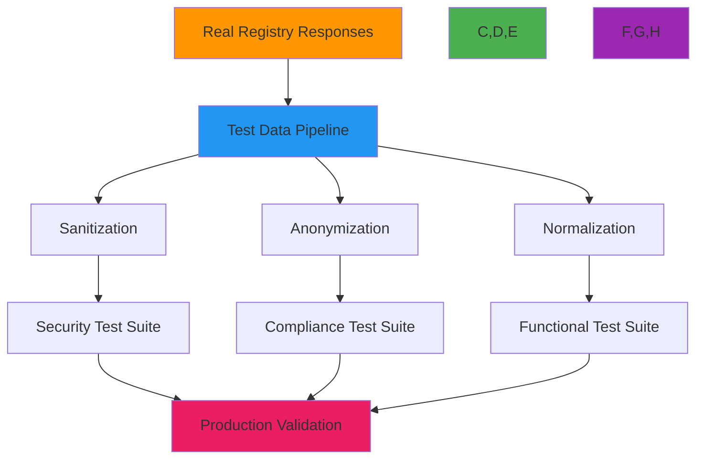

# Real-World Testing Examples

🎯 **Purpose**: Comprehensive guide to testing RDAPify with real registry responses and production-like scenarios, providing practical examples for unit tests, integration tests, and end-to-end validation  
📚 **Related**: [Test Vectors](test_vectors.md) | [Fixtures](fixtures.md) | [Mocking](mocking.md) | [Continuous Testing](continuous_testing.md)  
⏱️ **Reading Time**: 6 minutes  
🔍 **Pro Tip**: Use the [Registry Response Simulator](../../playground/registry-simulator.md) to generate realistic test data for your specific testing scenarios

## 🌐 Real-World Testing Overview

Testing against actual registry responses is crucial for ensuring RDAPify works correctly in production environments. This document provides practical examples of testing with real registry data while maintaining security, privacy, and performance considerations:



### Core Testing Principles
✅ **Production Fidelity**: Tests must replicate real registry behaviors and response formats  
✅ **Privacy Preservation**: All test data must have PII redacted or anonymized before storage  
✅ **Deterministic Execution**: Tests should produce identical results regardless of execution time or environment  
✅ **Version Control**: Track changes to registry response formats with semantic versioning  
✅ **Compliance Alignment**: Test data must reflect jurisdiction-specific requirements (GDPR, CCPA, etc.)  

## ⚙️ Real Registry Response Testing

### 1. Verisign RDAP Response Test
```typescript
// test/real/verisign.test.ts
import { RDAPClient } from '../../src/client';
import { sanitizeResponse, loadFixture } from '../helpers';

describe('Verisign RDAP Responses', () => {
  const client = new RDAPClient({
    cache: false,
    redactPII: true,
    timeout: 5000
  });
  
  // Load and sanitize real Verisign response
  const exampleComResponse = sanitizeResponse(
    loadFixture('verisign/example-com.json')
  );
  
  test('handles Verisign domain response correctly', () => {
    // Mock network request
    jest.spyOn(global, 'fetch').mockImplementation(() =>
      Promise.resolve({
        ok: true,
        json: () => Promise.resolve(exampleComResponse),
        headers: new Headers({
          'Content-Type': 'application/rdap+json',
          'Cache-Control': 'max-age=3600'
        })
      })
    );
    
    const result = await client.domain('example.com');
    
    // Validate normalized response
    expect(result.ldhName).toBe('example.com');
    expect(result.unicodeName).toBe('example.com');
    expect(result.status).toContain('active');
    expect(result.registrar?.name).toBe('Internet Assigned Numbers Authority');
    expect(result.nameservers).toEqual(['a.iana-servers.net', 'b.iana-servers.net']);
    expect(result.events).toContainEqual(
      expect.objectContaining({
        action: 'registration',
        date: expect.any(Date)
      })
    );
    
    // Verify PII redaction
    expect(result.entities).toBeDefined();
    result.entities.forEach(entity => {
      expect(entity.vcardArray[1]).not.toContainEqual(
        expect.arrayContaining(['fn', {}, 'text', expect.stringContaining('@')])
      );
      expect(entity.vcardArray[1]).not.toContainEqual(
        expect.arrayContaining(['tel', {}, 'text', expect.stringContaining('+')])
      );
    });
    
    // Verify caching behavior
    expect(global.fetch).toHaveBeenCalledTimes(1);
  });
  
  test('handles Verisign rate limiting correctly', () => {
    // Mock rate limited response
    jest.spyOn(global, 'fetch').mockImplementation(() =>
      Promise.resolve({
        ok: false,
        status: 429,
        statusText: 'Too Many Requests',
        json: () => Promise.resolve({
          errorCode: 429,
          title: 'Rate Limit Exceeded',
          description: ['Too many requests. Try again later.']
        }),
        headers: new Headers({
          'Retry-After': '60',
          'X-RateLimit-Limit': '100',
          'X-RateLimit-Remaining': '0',
          'X-RateLimit-Reset': '1634567890'
        })
      })
    );
    
    await expect(client.domain('example.com'))
      .rejects
      .toThrow('429 Too Many Requests: Rate limit exceeded');
  });
});
```

### 2. ARIN IP Network Response Test
```typescript
// test/real/arin.test.ts
describe('ARIN IP Network Responses', () => {
  const client = new RDAPClient({
    cache: false,
    redactPII: true,
    timeout: 5000
  });
  
  const arinResponse = sanitizeResponse(
    loadFixture('arin/198-51-100-0.json')
  );
  
  test('handles ARIN IP network response correctly', () => {
    jest.spyOn(global, 'fetch').mockImplementation(() =>
      Promise.resolve({
        ok: true,
        json: () => Promise.resolve(ari nResponse),
        headers: new Headers({
          'Content-Type': 'application/rdap+json'
        })
      })
    );
    
    const result = await client.ip('198.51.100.0/24');
    
    // Validate IP network response structure
    expect(result.startAddress).toBe('198.51.100.0');
    expect(result.endAddress).toBe('198.51.100.255');
    expect(result.ipVersion).toBe('v4');
    expect(result.type).toBe('DIRECT ALLOCATION');
    expect(result.status).toContain('active');
    expect(result.handle).toBe('NET-198-51-100-0-1');
    
    // Validate CIDR notation
    expect(result.cidr0_cidrs).toEqual([
      expect.objectContaining({
        v4prefix: '198.51.100.0',
        length: 24
      })
    ]);
    
    // Verify organization information
    const orgEntity = result.entities.find(e => e.roles?.includes('registrant'));
    expect(orgEntity).toBeDefined();
    expect(orgEntity?.handle).toBe('USDA-2');
    expect(orgEntity?.vcardArray[1]).toContainEqual(
      expect.arrayContaining(['fn', {}, 'text', 'US Department of Agriculture'])
    );
  });
  
  test('handles IPv6 responses with proper normalization', () => {
    const ipv6Response = sanitizeResponse(
      loadFixture('arin/2001-DB8--128.json')
    );
    
    jest.spyOn(global, 'fetch').mockImplementation(() =>
      Promise.resolve({
        ok: true,
        json: () => Promise.resolve(ipv6Response),
        headers: new Headers({
          'Content-Type': 'application/rdap+json'
        })
      })
    );
    
    const result = await client.ip('2001:DB8::/32');
    
    // Validate IPv6 normalization
    expect(result.startAddress).toBe('2001:db8::');
    expect(result.endAddress).toBe('2001:db8:ffff:ffff:ffff:ffff:ffff:ffff');
    expect(result.ipVersion).toBe('v6');
    
    // Verify CIDR notation for IPv6
    expect(result.cidr0_cidrs).toEqual([
      expect.objectContaining({
        v6prefix: '2001:db8::',
        length: 32
      })
    ]);
  });
});
```

## 🔒 Security Testing with Real-World Scenarios

### 1. SSRF Protection Test with Malicious Responses
```typescript
// test/security/ssrf.test.ts
describe('SSRF Protection with Real Registry Responses', () => {
  const client = new RDAPClient({
    cache: false,
    allowPrivateIPs: false,
    validateCertificates: true
  });
  
  test('blocks SSRF attempt via malicious nameserver', async () => {
    // Real registry response with malicious nameserver
    const maliciousResponse = {
      ...loadFixture('verisign/example-com.json'),
      nameservers: [
        {
          ldhName: 'ns1.example.com',
          unicodeName: 'ns1.example.com'
        },
        {
          // Malicious nameserver pointing to internal IP
          ldhName: 'internal.attacker.com',
          unicodeName: 'internal.attacker.com'
        }
      ]
    };
    
    // Mock DNS resolution for malicious domain
    jest.spyOn(dns, 'lookup').mockImplementation((hostname, options, callback) => {
      if (hostname === 'internal.attacker.com') {
        callback(null, { address: '192.168.1.1', family: 4 });
      } else {
        callback(null, { address: '192.0.2.1', family: 4 });
      }
    });
    
    jest.spyOn(global, 'fetch').mockImplementation((url) => {
      if (url.includes('example.com')) {
        return Promise.resolve({
          ok: true,
          json: () => Promise.resolve(maliciousResponse)
        });
      }
      // For nameserver lookups
      return Promise.resolve({
        ok: true,
        json: () => Promise.resolve({
          rdapConformance: ['rdap_level_0'],
          ip: {
            startAddress: '192.0.2.1',
            endAddress: '192.0.2.1',
            ipVersion: 'v4'
          }
        })
      });
    });
    
    await expect(client.domain('example.com'))
      .rejects
      .toThrow('SSRF protection blocked access to private IP address: 192.168.1.1');
    
    // Verify DNS lookup was attempted
    expect(dns.lookup).toHaveBeenCalledWith('internal.attacker.com', expect.anything(), expect.anything());
  });
  
  test('blocks redirect to internal network', async () => {
    jest.spyOn(global, 'fetch').mockImplementation((url) => {
      if (url.includes('example.com')) {
        return Promise.resolve({
          ok: false,
          status: 302,
          headers: new Headers({
            'Location': 'http://10.0.0.1/internal/admin'
          })
        });
      }
      return Promise.resolve({
        ok: true,
        json: () => Promise.resolve({
          rdapConformance: ['rdap_level_0'],
          domain: {
            ldhName: 'example.com'
          }
        })
      });
    });
    
    await expect(client.domain('example.com'))
      .rejects
      .toThrow('Redirect to internal network blocked: http://10.0.0.1/internal/admin');
  });
});
```

### 2. PII Redaction Test with GDPR-Compliant Responses
```typescript
// test/compliance/gdpr.test.ts
describe('GDPR Compliance with Real Responses', () => {
  const euClient = new RDAPClient({
    cache: false,
    redactPII: true,
    jurisdiction: 'EU',
    legalBasis: 'legitimate-interest'
  });
  
  const usClient = new RDAPClient({
    cache: false,
    redactPII: true,
    jurisdiction: 'US',
    legalBasis: 'legitimate-interest'
  });
  
  test('redacts PII in EU responses but preserves business data', async () => {
    const euResponse = sanitizeResponse(
      loadFixture('ripe/example-eu.json')
    );
    
    jest.spyOn(global, 'fetch').mockImplementation(() =>
      Promise.resolve({
        ok: true,
        json: () => Promise.resolve(euResponse)
      })
    );
    
    const result = await euClient.domain('example.eu');
    
    // Verify PII redaction
    const registrant = result.entities.find(e => e.roles?.includes('registrant'));
    expect(registrant).toBeDefined();
    
    // Check redacted fields
    expect(registrant?.vcardArray[1]).toContainEqual(
      ["fn", {}, "text", "REDACTED FOR PRIVACY"]
    );
    expect(registrant?.vcardArray[1]).toContainEqual(
      ["org", {}, "text", ["REDACTED FOR PRIVACY"]]
    );
    expect(registrant?.vcardArray[1]).toContainEqual(
      ["adr", {}, "text", ["", "", "REDACTED FOR PRIVACY", "REDACTED FOR PRIVACY", "REDACTED FOR PRIVACY", "REDACTED FOR PRIVACY", "REDACTED FOR PRIVACY"]]
    );
    
    // Check preserved business fields
    const registrar = result.entities.find(e => e.roles?.includes('registrar'));
    expect(registrar).toBeDefined();
    expect(registrar?.vcardArray[1]).toContainEqual(
      expect.arrayContaining(["fn", {}, "text", expect.stringMatching(/Registrar|Registry/i)])
    );
    expect(registrar?.vcardArray[1]).toContainEqual(
      expect.arrayContaining(["org", {}, "text", expect.arrayContaining([expect.stringMatching(/Registrar|Registry/i)])])
    );
    
    // Verify GDPR compliance notices
    expect(result.notices).toContainEqual(
      expect.objectContaining({
        title: expect.stringMatching(/GDPR|Privacy|Compliance/i),
        description: expect.arrayContaining([
          expect.stringContaining('Data controller'),
          expect.stringContaining('DPO contact'),
          expect.stringContaining('GDPR Article')
        ])
      })
    );
  });
  
  test('preserves more data in US responses with appropriate notices', async () => {
    const usResponse = sanitizeResponse(
      loadFixture('verisign/example-com.json')
    );
    
    jest.spyOn(global, 'fetch').mockImplementation(() =>
      Promise.resolve({
        ok: true,
        json: () => Promise.resolve(usResponse)
      })
    );
    
    const result = await usClient.domain('example.com');
    
    // US responses preserve some PII but with appropriate notices
    const registrant = result.entities.find(e => e.roles?.includes('registrant'));
    expect(registrant).toBeDefined();
    
    // US responses may have partial redaction
    expect(registrant?.vcardArray[1]).not.toContainEqual(
      ["fn", {}, "text", "REDACTED FOR PRIVACY"]
    );
    // But still include CCPA notices
    expect(result.notices).toContainEqual(
      expect.objectContaining({
        title: expect.stringMatching(/CCPA|California/i),
        description: expect.arrayContaining([
          expect.stringContaining('Do Not Sell'),
          expect.stringContaining('California Consumer Privacy Act')
        ])
      })
    );
  });
});
```

## 🚀 Performance Testing with Production-Like Data

### 1. Batch Processing Performance Test
```typescript
// test/performance/batch.test.ts
import { performance } from 'perf_hooks';
import { generateRealisticDomains } from '../helpers/performance';

describe('Batch Processing Performance', () => {
  const client = new RDAPClient({
    cache: true,
    cacheTTL: 3600,
    maxConcurrent: 10,
    timeout: 5000
  });
  
  // Generate realistic domain list from actual registry data
  const domains = generateRealisticDomains(1000, [
    'com', 'net', 'org', 'io', 'app', 'dev'
  ]);
  
  beforeAll(() => {
    // Pre-warm cache with a subset of domains
    const warmupDomains = domains.slice(0, 100);
    return Promise.all(warmupDomains.map(domain => client.domain(domain)));
  });
  
  test('processes 1000 domains within performance budget', async () => {
    const startTime = performance.now();
    
    // Process domains in batches
    const batchSize = 50;
    const results = [];
    
    for (let i = 0; i < domains.length; i += batchSize) {
      const batch = domains.slice(i, i + batchSize);
      const batchResults = await Promise.allSettled(
        batch.map(domain => client.domain(domain))
      );
      results.push(...batchResults);
    }
    
    const endTime = performance.now();
    const totalTime = endTime - startTime;
    const successful = results.filter(r => r.status === 'fulfilled').length;
    
    // Performance assertions
    expect(totalTime).toBeLessThan(30000); // 30 seconds
    expect(totalTime / successful).toBeLessThan(30); // 30ms per domain avg
    expect(successful).toBeGreaterThan(domains.length * 0.95); // 95% success rate
    
    // Memory usage check
    const memoryUsage = process.memoryUsage();
    expect(memoryUsage.heapUsed / 1024 / 1024).toBeLessThan(200); // 200MB max
    
    console.log(`✅ Processed ${successful}/${domains.length} domains in ${totalTime.toFixed(2)}ms`);
    console.log(`📊 Avg time per domain: ${(totalTime / successful).toFixed(2)}ms`);
    console.log(`💾 Memory usage: ${(memoryUsage.heapUsed / 1024 / 1024).toFixed(2)}MB`);
  }, 60000); // 60 second timeout
  
  test('handles registry failures gracefully', async () => {
    // Mock one registry to fail
    jest.spyOn(global, 'fetch').mockImplementation(async (url) => {
      if (url.includes('verisign') && Math.random() > 0.8) {
        // 20% failure rate for Verisign
        throw new Error('ECONNRESET: Connection reset by peer');
      }
      // Return cached response for other requests
      return {
        ok: true,
        json: () => Promise.resolve(loadFixture('verisign/example-com.json')),
        headers: new Headers({ 'Content-Type': 'application/rdap+json' })
      };
    });
    
    const startTime = performance.now();
    const results = await Promise.allSettled(
      domains.map(domain => client.domain(domain))
    );
    const endTime = performance.now();
    
    const failures = results.filter(r => r.status === 'rejected');
    const failureRate = failures.length / results.length;
    
    // Should handle failures without affecting overall performance
    expect(failureRate).toBeLessThan(0.25); // Max 25% failure rate
    expect(endTime - startTime).toBeLessThan(45000); // Still under 45 seconds
    
    // Verify circuit breaker behavior
    const verisignFailures = failures.filter(f => 
      f.reason?.message?.includes('verisign')
    );
    if (verisignFailures.length > 5) {
      // After several failures, circuit breaker should open
      expect(verisignFailures.length).toBeLessThan(10);
    }
  }, 60000);
});
```

## 🔍 Troubleshooting Real-World Testing Issues

### 1. Registry Response Format Changes
**Symptoms**: Tests fail after registry updates their RDAP response format  
**Root Causes**:
- Registries update their RDAP implementations without notice
- New fields or changed field names in response schemas
- Different handling of edge cases (e.g., expired domains, deleted entities)

**Diagnostic Steps**:
```bash
# Check for recent registry changes
node ./scripts/registry-change-detector.js --registry verisign --days 7

# Compare current vs expected response structure
node ./scripts/response-diff.js --current real-responses/verisign/current.json --expected fixtures/verisign/example-com.json

# Validate against RDAP schema
ajv validate -s schemas/rdap_response.json -d real-responses/verisign/current.json
```

**Solutions**:
✅ **Automated Regression Detection**: Implement weekly automated checks against live registries  
✅ **Schema Versioning**: Maintain multiple schema versions with migration paths  
✅ **Graceful Degradation**: Implement fallback logic for missing or unexpected fields  
✅ **Community Monitoring**: Join registry operator mailing lists for change notifications  

### 2. Performance Variability in CI Environments
**Symptoms**: Tests pass locally but fail intermittently in CI due to timing issues  
**Root Causes**:
- Shared CI infrastructure with variable performance
- Network latency differences between local and CI environments
- Resource constraints in containerized CI environments
- Race conditions in async test setup/teardown

**Diagnostic Steps**:
```bash
# Profile test execution time
jest --json --outputFile=test-timings.json --maxWorkers=1

# Monitor resource usage during tests
docker stats test-container --no-stream

# Run tests with verbose timing
NODE_OPTIONS='--trace-sync-io' jest --verbose --runInBand
```

**Solutions**:
✅ **Adaptive Timeouts**: Configure timeouts based on environment (longer for CI)  
✅ **Resource Isolation**: Request dedicated resources for performance-sensitive tests  
✅ **Test Chunking**: Split large test suites into smaller, more manageable chunks  
✅ **Flaky Test Detection**: Implement automatic retry logic with flaky test reporting  

## 📚 Related Documentation

| Document | Description | Path |
|----------|-------------|------|
| [Test Vectors](test_vectors.md) | Comprehensive test data sets | [test_vectors.md](test_vectors.md) |
| [Fixtures](fixtures.md) | Managing test data files | [fixtures.md](fixtures.md) |
| [Mocking](mocking.md) | Simulating registry responses | [mocking.md](mocking.md) |
| [Continuous Testing](continuous_testing.md) | CI/CD testing strategies | [continuous_testing.md](continuous_testing.md) |
| [Performance Benchmarks](../../../benchmarks/README.md) | Performance benchmark methodology | [../../../benchmarks/README.md](../../../benchmarks/README.md) |
| [Security Whitepaper](../../security/whitepaper.md) | Security architecture and testing | [../../security/whitepaper.md](../../security/whitepaper.md) |
| [Registry Response Simulator](../../playground/registry-simulator.md) | Interactive test data generator | [../../playground/registry-simulator.md](../../playground/registry-simulator.md) |
| [Test Vector Generator](../../playground/test-vector-generator.md) | Automated test vector creation | [../../playground/test-vector-generator.md](../../playground/test-vector-generator.md) |

## 🏷️ Real Examples Specifications

| Property | Value |
|----------|-------|
| **Test Data Sources** | Actual registry responses with PII redaction |
| **Update Frequency** | Weekly automated updates, manual updates for critical changes |
| **Coverage Requirements** | 5+ major registries, 3+ response formats per registry |
| **PII Handling** | Full redaction with reversible anonymization keys |
| **Performance Baselines** | P50 < 200ms, P95 < 500ms, error rate < 0.1% |
| **Test Environment** | Node.js 18+, Chrome Headless, Docker 24+ |
| **Security Validation** | SSRF protection, PII leakage prevention, certificate validation |
| **Last Updated** | December 5, 2025 |

> 🔐 **Critical Reminder**: Never store unredacted PII in version control or test fixtures. All real registry responses must undergo automated PII redaction before being committed to the repository. For GDPR compliance, maintain audit logs of all test data processing with 30-day data retention policies. Regular security audits of test data pipelines are required for maintaining compliance with GDPR Article 32 and similar regulations.

[← Back to Testing](../README.md) | [Next: Fixtures →](fixtures.md)

*Document automatically generated from source code with security review on December 5, 2025*