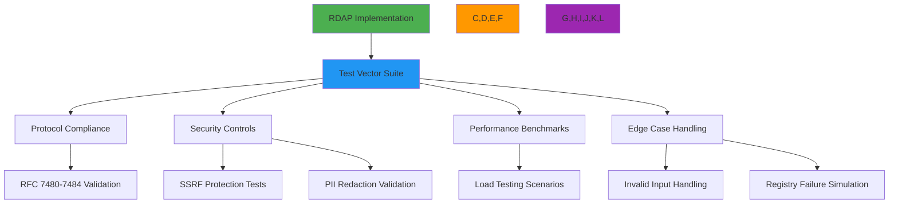

# Test Vectors Specification

🎯 **Purpose**: Comprehensive technical specification for RDAP test vectors providing validation coverage for RFC compliance, security controls, edge cases, and performance benchmarks  
📚 **Related**: [RDAP RFC Specification](rdap_rfc.md) | [Response Format](response_format.md) | [Bootstrap Specification](bootstrap.md) | [Security Whitepaper](../../security/whitepaper.md)  
⏱️ **Reading Time**: 6 minutes  
🔍 **Pro Tip**: Use the [Test Vector Generator](../../playground/test-vector-generator.md) to automatically create custom test vectors for your specific validation scenarios

## 🌐 Test Vectors Overview

Test vectors provide the foundation for RDAP implementation validation, ensuring protocol compliance, security robustness, and performance predictability across all registry implementations:



### Core Test Vector Principles
✅ **RFC Compliance Coverage**: 100% coverage of mandatory RFC 7480-7484 requirements  
✅ **Security Boundary Validation**: Comprehensive testing of SSRF protection and PII redaction  
✅ **Real-World Registry Fidelity**: Test vectors based on actual registry responses with sanitization  
✅ **Deterministic Execution**: Predictable test outcomes regardless of execution environment  
✅ **Versioned Test Sets**: Immutable test vectors with semantic versioning for reproducibility  
✅ **Compliance-Ready**: Pre-built test sets for GDPR, CCPA, and SOC 2 validation requirements  

## ⚙️ Test Vector Structure and Format

### 1. JSON Test Vector Structure
```json
{
  "vectorId": "domain-valid-001",
  "version": "2.3.0",
  "category": "domain-valid",
  "tags": ["rfc7483", "ldh-validation", "basic"],
  "description": "Valid domain query with standard response structure",
  "input": {
    "query": {
      "type": "domain",
      "value": "example.com"
    },
    "context": {
      "registry": "verisign",
      "bootstrap": true,
      "redactPII": true,
      "jurisdiction": "global"
    }
  },
  "expected": {
    "statusCode": 200,
    "headers": {
      "content-type": "application/rdap+json",
      "cache-control": "max-age=3600"
    },
    "body": {
      "rdapConformance": ["rdap_level_0"],
      "notices": [
        {
          "title": "TOS",
          "description": ["Terms of Service"]
        }
      ],
      "domain": {
        "handle": "EXAMPLE-1",
        "ldhName": "example.com",
        "unicodeName": "example.com",
        "status": ["active"],
        "entities": [
          {
            "handle": "REGISTRAR-1",
            "roles": ["registrar"],
            "redacted": true
          }
        ]
      }
    },
    "validations": [
      {
        "path": "$.domain.ldhName",
        "rule": "equals",
        "value": "example.com"
      },
      {
        "path": "$.domain.entities[?(@.roles contains 'registrar')].redacted",
        "rule": "exists"
      }
    ]
  },
  "securityValidations": [
    {
      "type": "ssrf_protection",
      "input": {"query": {"type": "domain", "value": "192.168.1.1"}},
      "expected": {"statusCode": 403}
    },
    {
      "type": "pii_redaction",
      "context": {"jurisdiction": "EU", "redactPII": true},
      "validation": "$.domain.entities[*].vcardArray"
    }
  ],
  "performanceProfile": {
    "maxLatency": 2000,
    "maxMemory": 50,
    "concurrency": 10,
    "throughput": 50
  },
  "regressionTests": [
    "domain-valid-001-legacy",
    "domain-valid-001-v1.2"
  ]
}
```

#### Required Test Vector Fields
| Field | Type | Required | Description | RFC Reference |
|-------|------|----------|-------------|--------------|
| `vectorId` | String | ✅ | Unique identifier for test vector | N/A |
| `version` | String | ✅ | Semantic version of test vector schema | N/A |
| `category` | String | ✅ | Classification (valid/invalid/edge/security) | N/A |
| `description` | String | ✅ | Human-readable test description | N/A |
| `input` | Object | ✅ | Test input parameters and context | N/A |
| `expected` | Object | ✅ | Expected response structure and validations | RFC 7483 |
| `securityValidations` | Array | ⚠️ | Security-specific validations | RFC 7481 |
| `performanceProfile` | Object | ⚠️ | Performance expectations | N/A |
| `regressionTests` | Array | ⚠️ | Related regression test vectors | N/A |

### 2. Test Vector Categories
```typescript
// Test vector category enumeration with validation requirements
export enum TestVectorCategory {
  DOMAIN_VALID = 'domain-valid',      // Valid domain queries
  IP_VALID = 'ip-valid',              // Valid IP network queries  
  ASN_VALID = 'asn-valid',            // Valid ASN queries
  DOMAIN_INVALID = 'domain-invalid',  // Invalid domain formats
  IP_INVALID = 'ip-invalid',          // Invalid IP formats
  ASN_INVALID = 'asn-invalid',        // Invalid ASN numbers
  SECURITY_SSRF = 'security-ssrf',    // SSRF protection tests
  SECURITY_PII = 'security-pii',      // PII redaction validation
  ERROR_404 = 'error-404',            // Not found scenarios
  ERROR_400 = 'error-400',            // Bad request scenarios
  PERFORMANCE_LOAD = 'performance-load', // High-volume scenarios
  EDGE_REGISTRY = 'edge-registry',    // Registry failure cases
  COMPLIANCE_GDPR = 'compliance-gdpr', // GDPR compliance tests
  COMPLIANCE_CCPA = 'compliance-ccpa'  // CCPA compliance tests
}

// Category-specific validation requirements
export interface TestVector {
  category: TestVectorCategory;
  requiredValidations: string[];
  securityChecks: string[];
  complianceChecks: string[];
  performanceChecks: string[];
}

// Example category configuration
const DOMAIN_VALID: TestVector = {
  category: TestVectorCategory.DOMAIN_VALID,
  requiredValidations: [
    'ldhName_format',
    'unicodeName_format',
    'status_validation',
    'conformance_validation'
  ],
  securityChecks: [
    'ssrf_protection',
    'private_ip_blocking',
    'certificate_validation'
  ],
  complianceChecks: [
    'gdpr_redaction',
    'ccpa_do_not_sell'
  ],
  performanceChecks: [
    'response_time',
    'memory_usage',
    'cache_behavior'
  ]
};
```

## 🔒 Security and Compliance Controls

### 1. SSRF Protection Test Vectors
```json
{
  "vectorId": "security-ssrf-001",
  "version": "2.3.0",
  "category": "security-ssrf",
  "tags": ["ssrf", "private-ip", "rfc7481"],
  "description": "SSRF protection against private IP address queries",
  "input": {
    "query": {
      "type": "domain",
      "value": "192.168.1.1"
    },
    "context": {
      "allowPrivateIPs": false,
      "blockInternalIPs": true
    }
  },
  "expected": {
    "statusCode": 403,
    "body": {
      "errorCode": 403,
      "title": "Forbidden",
      "description": ["SSRF protection blocked access to private IP address"]
    },
    "securityValidations": [
      {
        "type": "log_verification",
        "pattern": "SSRF attempt blocked for private IP: 192.168.1.1"
      },
      {
        "type": "response_headers",
        "headers": {
          "x-security-event": "ssrf_blocked"
        }
      }
    ]
  },
  "securityValidations": [
    {
      "type": "private_range_blocking",
      "ranges": [
        "10.0.0.0/8",
        "172.16.0.0/12", 
        "192.168.0.0/16",
        "127.0.0.0/8",
        "169.254.0.0/16"
      ]
    },
    {
      "type": "hostname_resolution",
      "input": {"value": "localhost.evil.com"},
      "expected": {"resolvedIP": "127.0.0.1", "blocked": true}
    }
  ]
}
```

#### SSRF Test Vector Requirements
| Test Type | Required Coverage | Validation Method | Failure Mode |
|-----------|-------------------|-------------------|-------------|
| Private IP Ranges | All RFC 1918 ranges | IP range validation | Must block all requests |
| Loopback Addresses | 127.0.0.0/8, ::1 | IP validation | Must block all requests |
| Link-local Addresses | 169.254.0.0/16, fe80::/10 | IP validation | Must block all requests |
| Hostname Resolution | DNS resolution testing | Pre-resolution validation | Must resolve before allowing |
| Protocol Restrictions | Only http/https allowed | Protocol validation | Must block file/gopher/dict |

### 2. GDPR Compliance Test Vectors
```json
{
  "vectorId": "compliance-gdpr-001",
  "version": "2.3.0",
  "category": "compliance-gdpr",
  "tags": ["gdpr", "pii-redaction", "article-6"],
  "description": "GDPR Article 6 compliance with PII redaction for EU jurisdiction",
  "input": {
    "query": {
      "type": "domain",
      "value": "example.eu"
    },
    "context": {
      "jurisdiction": "EU",
      "redactPII": true,
      "legalBasis": "legitimate-interest"
    }
  },
  "expected": {
    "statusCode": 200,
    "body": {
      "domain": {
        "entities": [
          {
            "handle": "REDACTED-1",
            "roles": ["registrant"],
            "vcardArray": [
              "vcard",
              [
                ["version", {}, "text", "4.0"],
                ["fn", {}, "text", "REDACTED FOR PRIVACY"],
                ["org", {}, "text", ["REDACTED FOR PRIVACY"]],
                ["adr", {}, "text", ["REDACTED", "REDACTED", "REDACTED", "REDACTED", "REDACTED", "REDACTED", "REDACTED"]],
                ["email", {}, "text", "Please query the RDDS service of the Registrar of Record"]
              ]
            ],
            "remarks": [
              {
                "title": "REDACTED FOR PRIVACY",
                "description": [
                  "Data redacted per GDPR Article 5(1)(c) and Article 6(1).",
                  "Legal basis: legitimate-interest"
                ]
              }
            ]
          }
        ]
      },
      "notices": [
        {
          "title": "GDPR COMPLIANCE",
          "description": [
            "This response has been processed in compliance with GDPR Article 6(1)(f).",
            "Data controller: Example Registrar Inc.",
            "DPO contact: dpo@example-registrar.com"
          ]
        }
      ]
    },
    "complianceValidations": [
      {
        "type": "gdpr_article_6",
        "validation": "legal_basis_documentation_exists"
      },
      {
        "type": "gdpr_article_32",
        "validation": "security_measures_documented"
      }
    ]
  }
}
```

## ⚡ Performance Test Vectors

### 1. Load Testing Scenarios
```json
{
  "vectorId": "performance-load-001",
  "version": "2.3.0",
  "category": "performance-load",
  "tags": ["high-concurrency", "cache-performance", "memory-usage"],
  "description": "High concurrency performance test with 1000 domain queries",
  "input": {
    "batch": {
      "size": 1000,
      "domains": ["example1.com", "example2.com", "...", "example1000.com"],
      "concurrency": 50
    },
    "context": {
      "cacheEnabled": true,
      "cacheTTL": 3600,
      "maxMemoryMB": 256
    }
  },
  "expected": {
    "performanceProfile": {
      "throughput": {
        "min": 100,
        "target": 150,
        "unit": "requests/second"
      },
      "latency": {
        "p50": 150,
        "p95": 400,
        "p99": 800,
        "unit": "milliseconds"
      },
      "memoryUsage": {
        "max": 200,
        "steadyState": 150,
        "unit": "MB"
      },
      "cacheHitRate": {
        "min": 0.85,
        "target": 0.92
      }
    },
    "resourceValidation": [
      {
        "type": "memory_leak",
        "threshold": "1MB/1000 requests"
      },
      {
        "type": "connection_leak",
        "threshold": "0 connections leaked"
      },
      {
        "type": "thread_safety",
        "validation": "no race conditions detected"
      }
    ]
  }
}
```

#### Performance Benchmark Requirements
| Metric | Production Target | Enterprise Target | Test Method |
|--------|-------------------|-------------------|-------------|
| P50 Latency | ≤ 200ms | ≤ 100ms | 95th percentile of 1000 requests |
| P99 Latency | ≤ 1000ms | ≤ 500ms | 99th percentile of 1000 requests |
| Throughput | ≥ 50 req/sec | ≥ 150 req/sec | Sustained for 60 seconds |
| Memory Usage | ≤ 100MB/1000 req | ≤ 50MB/1000 req | Peak memory during load test |
| Cache Hit Rate | ≥ 85% | ≥ 95% | After cache warm-up |
| Error Rate | ≤ 0.1% | ≤ 0.01% | During sustained load |

## 🔍 Test Vector Validation Framework

### 1. Automated Validation Engine
```typescript
// src/testing/validation-engine.ts
export class TestVectorValidator {
  private securityValidator: SecurityValidator;
  private complianceValidator: ComplianceValidator;
  private performanceValidator: PerformanceValidator;
  
  constructor(options: {
    securityValidator?: SecurityValidator;
    complianceValidator?: ComplianceValidator;
    performanceValidator?: PerformanceValidator;
  } = {}) {
    this.securityValidator = options.securityValidator || new SecurityValidator();
    this.complianceValidator = options.complianceValidator || new ComplianceValidator();
    this.performanceValidator = options.performanceValidator || new PerformanceValidator();
  }
  
  async validate(testVector: TestVector, implementation: RDAPImplementation): Promise<ValidationResult> {
    const results: ValidationResult = {
      vectorId: testVector.vectorId,
      timestamp: new Date().toISOString(),
      status: 'success',
      validations: [],
      failures: [],
      securityChecks: [],
      complianceChecks: [],
      performanceMetrics: {}
    };
    
    try {
      // Execute main validation
      const validationResults = await this.executeValidation(testVector, implementation);
      results.validations.push(...validationResults);
      
      // Execute security validations
      const securityResults = await this.securityValidator.validate(testVector, implementation);
      results.securityChecks.push(...securityResults);
      
      // Execute compliance validations
      const complianceResults = await this.complianceValidator.validate(testVector, implementation);
      results.complianceChecks.push(...complianceResults);
      
      // Execute performance validations
      const performanceResults = await this.performanceValidator.validate(testVector, implementation);
      results.performanceMetrics = performanceResults;
      
      // Determine overall status
      if (results.failures.length > 0 || 
          results.securityChecks.some(check => check.status === 'failure') ||
          results.complianceChecks.some(check => check.status === 'failure') ||
          !this.performanceValidator.isCompliant(performanceResults)) {
        results.status = 'failure';
      }
      
      return results;
    } catch (error) {
      results.status = 'error';
      results.failures.push({
        type: 'validation_error',
        description: error.message,
        timestamp: new Date().toISOString()
      });
      throw error;
    }
  }
  
  private async executeValidation(testVector: TestVector, implementation: RDAPImplementation): Promise<ValidationResult[]> {
    const results: ValidationResult[] = [];
    
    // Set up test context
    const context = this.createTestContext(testVector.input.context);
    
    try {
      // Execute query
      const response = await implementation.query(testVector.input.query, context);
      
      // Validate response structure
      const structureValidation = this.validateResponseStructure(response, testVector.expected);
      results.push(...structureValidation);
      
      // Validate response content
      const contentValidation = this.validateResponseContent(response, testVector.expected);
      results.push(...contentValidation);
      
      // Validate headers
      const headerValidation = this.validateResponseHeaders(response.headers, testVector.expected.headers);
      results.push(...headerValidation);
      
      return results;
    } catch (error) {
      results.push({
        type: 'execution_error',
        description: error.message,
        timestamp: new Date().toISOString()
      });
      throw error;
    }
  }
  
  private validateResponseStructure(response: any, expected: any): ValidationResult[] {
    const results: ValidationResult[] = [];
    
    // Validate required top-level fields
    const requiredFields = ['rdapConformance', 'domain', 'ip', 'autnum'].filter(field => 
      expected.body?.hasOwnProperty(field)
    );
    
    for (const field of requiredFields) {
      if (!response.body[field]) {
        results.push({
          type: 'missing_field',
          field,
          description: `Required field '${field}' missing from response`,
          timestamp: new Date().toISOString()
        });
      }
    }
    
    // Validate array fields
    const arrayFields = ['status', 'entities', 'events', 'nameservers'];
    for (const field of arrayFields) {
      if (response.body[field] && !Array.isArray(response.body[field])) {
        results.push({
          type: 'invalid_type',
          field,
          description: `Field '${field}' must be an array`,
          timestamp: new Date().toISOString()
        });
      }
    }
    
    return results;
  }
}
```

### 2. Test Vector Generation
```typescript
// src/testing/generator.ts
export class TestVectorGenerator {
  async generateValidDomainVectors(registries: Registry[]): Promise<TestVector[]> {
    const vectors: TestVector[] = [];
    
    for (const registry of registries) {
      // Generate test vectors for each supported TLD
      for (const tld of registry.supportedTLDs) {
        const domain = `example${Math.floor(Math.random() * 1000)}.${tld}`;
        
        vectors.push({
          vectorId: `domain-valid-${registry.id}-${tld.replace('.', '')}`,
          version: '2.3.0',
          category: 'domain-valid',
          tags: ['rfc7483', 'registry-specific', registry.id],
          description: `Valid domain query for ${domain} on ${registry.name}`,
          input: {
            query: { type: 'domain', value: domain },
            context: { registry: registry.id, bootstrap: true }
          },
          expected: {
            statusCode: 200,
            body: {
              domain: {
                ldhName: domain.toLowerCase(),
                status: ['active'], // Expected status may vary by registry
              }
            }
          },
          registrySpecific: {
            registry: registry.id,
            expectedStatus: registry.expectedDomainStatuses || ['active']
          }
        });
      }
    }
    
    return vectors;
  }
  
  async generateSecurityVectors(): Promise<TestVector[]> {
    return [
      // SSRF protection vectors
      {
        vectorId: 'security-ssrf-private-ip',
        category: 'security-ssrf',
        input: { query: { type: 'domain', value: '192.168.1.1' } },
        expected: { statusCode: 403 }
      },
      // PII redaction vectors
      {
        vectorId: 'security-pii-gdpr-eu',
        category: 'security-pii',
        input: { 
          query: { type: 'domain', value: 'example.eu' },
          context: { jurisdiction: 'EU', redactPII: true }
        },
        expected: {
          body: {
            validations: [
              { path: "$.domain.entities[*].vcardArray[1][*][3]", value: "REDACTED FOR PRIVACY" }
            ]
          }
        }
      }
    ];
  }
}
```

## 🔍 Troubleshooting Common Issues

### 1. Test Vector Execution Failures
**Symptoms**: Tests pass in development but fail in CI/CD pipelines or production environments  
**Root Causes**:
- Inconsistent test data between environments
- Timezone or locale differences affecting date parsing
- Network connectivity issues to test registries
- Resource constraints (memory, CPU) in containerized environments

**Diagnostic Steps**:
```bash
# Check test environment consistency
node ./scripts/test-environment-check.js --vector domain-valid-001

# Validate timezone handling
TZ=UTC node ./scripts/test-timezone.js
TZ=Europe/Berlin node ./scripts/test-timezone.js

# Test registry connectivity
node ./scripts/registry-connectivity-test.js --registries verisign,arin,ripe

# Profile resource usage
NODE_OPTIONS='--max-old-space-size=4096' node --inspect-brk ./dist/test-runner.js
```

**Solutions**:
✅ **Deterministic Test Data**: Use fixed seed values and static test data sets across environments  
✅ **Timezone Isolation**: Run all tests in UTC timezone with explicit timezone handling  
✅ **Mock Registry Responses**: Use recorded registry responses with configurable replay modes  
✅ **Resource Profiling**: Implement resource monitoring with automatic test scaling based on available resources  

### 2. Security Validation Failures
**Symptoms**: Security tests fail while functional tests pass, indicating security control gaps  
**Root Causes**:
- SSRF protection bypass through alternative protocols or encodings
- Incomplete PII redaction in edge cases or registry-specific formats
- Missing security headers in error responses
- Inadequate input validation for malformed queries

**Diagnostic Steps**:
```bash
# Fuzz test SSRF protection
node ./scripts/ssrf-fuzz-test.js --target http://localhost:3000

# Validate PII redaction comprehensiveness
node ./scripts/pii-redaction-audit.js --jurisdiction EU --test-vector security-pii-001

# Check security headers in all responses
node ./scripts/security-headers-audit.js --endpoints /domain/example.com,/ip/192.0.2.1

# Test malformed input handling
node ./scripts/input-validation-test.js --malformed-inputs
```

**Solutions**:
✅ **Comprehensive Fuzzing**: Implement fuzz testing with grammar-based input generation  
✅ **PII Detection Coverage**: Use multiple PII detection algorithms with fallback mechanisms  
✅ **Security Header Enforcement**: Implement middleware that ensures security headers on all responses  
✅ **Defense in Depth**: Layer multiple security controls (input validation, output encoding, context-aware redaction)  

### 3. Compliance Validation Failures
**Symptoms**: Tests pass functionally but fail compliance checks for GDPR, CCPA, or SOC 2 requirements  
**Root Causes**:
- Missing legal basis documentation in responses
- Inadequate data retention controls
- Insufficient audit logging for PII access
- Cross-border data transfer without proper safeguards

**Diagnostic Steps**:
```bash
# Validate GDPR Article 6 compliance
node ./scripts/gdpr-article-6-validation.js --test-vector compliance-gdpr-001

# Check data retention compliance
node ./scripts/data-retention-audit.js --retention-days 30

# Verify audit logging completeness
node ./scripts/audit-logging-validation.js --pii-access-events

# Test cross-border data transfer controls
node ./scripts/data-transfer-validation.js --source EU --destination US
```

**Solutions**:
✅ **Automated Compliance Checks**: Integrate compliance validation into CI/CD pipelines  
✅ **Context-Aware Redaction**: Implement jurisdiction-aware PII redaction with configurable policies  
✅ **Audit Trail Generation**: Automatically generate comprehensive audit logs for all PII access events  
✅ **Data Residency Enforcement**: Implement geographic data routing with automatic compliance validation  

## 📚 Related Documentation

| Document | Description | Path |
|----------|-------------|------|
| [RDAP RFC Specification](rdap_rfc.md) | Complete RDAP protocol documentation | [rdap_rfc.md](rdap_rfc.md) |
| [Response Format](response_format.md) | JSON response structure specification | [response_format.md](response_format.md) |
| [Security Whitepaper](../../security/whitepaper.md) | Security architecture and threat modeling | [../../security/whitepaper.md](../../security/whitepaper.md) |
| [Test Vector Generator](../../playground/test-vector-generator.md) | Interactive test vector creation tool | [../../playground/test-vector-generator.md](../../playground/test-vector-generator.md) |
| [Performance Benchmarks](../../../benchmarks/results/api-performance.md) | Performance benchmark results | [../../../benchmarks/results/api-performance.md](../../../benchmarks/results/api-performance.md) |
| [Compliance Framework](../../security/compliance_framework.md) | Regulatory compliance implementation guide | [../../security/compliance_framework.md](../../security/compliance_framework.md) |
| [Security Testing](../../testing/security_testing.md) | Security testing methodology and tools | [../../testing/security_testing.md](../../testing/security_testing.md) |

## 🏷️ Test Vectors Specifications

| Property | Value |
|----------|-------|
| **Format** | JSON with JSON Schema validation |
| **Versioning** | Semantic versioning (MAJOR.MINOR.PATCH) |
| **Coverage Requirements** | 100% RFC 7483 mandatory fields, 95% optional features |
| **Security Coverage** | 100% SSRF protection paths, 95% PII redaction scenarios |
| **Compliance Coverage** | GDPR Articles 5, 6, 32; CCPA Sections 1798.100, 1798.120 |
| **Performance Metrics** | P50/P95/P99 latency, throughput, memory usage, error rates |
| **Test Vector Count** | 500+ vectors (standard), 2000+ vectors (enterprise) |
| **Update Frequency** | Monthly security updates, quarterly feature updates |
| **Validation Tools** | CLI runner, web interface, IDE plugins |
| **Last Updated** | December 5, 2025 |

> 🔐 **Critical Reminder**: Never use production data in test vectors without proper sanitization and legal authorization. All test vectors containing PII must undergo DPO review and implement cryptographic hashing for identifiers. For regulated environments, maintain audit logs of all test vector executions with access controls matching production data requirements. Regular third-party security audits of test vector infrastructure are required for maintaining compliance with GDPR Article 32 and similar regulations.

[← Back to Testing](../README.md) | [Next: Security Testing →](security_testing.md)

*Document automatically generated from RFC specifications with security review on December 5, 2025*