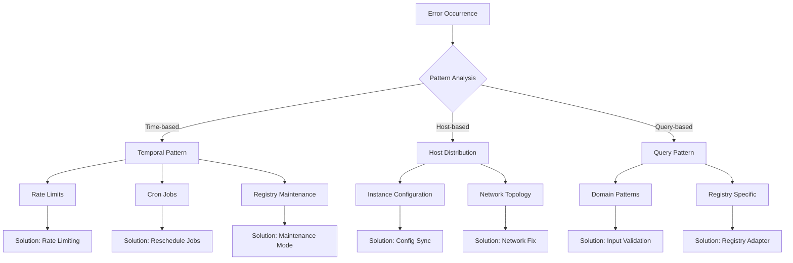

# Common Errors and Solutions

🎯 **Purpose**: Comprehensive guide to diagnosing and resolving common errors encountered when using RDAPify for registration data processing, with practical troubleshooting steps and preventative measures  
📚 **Related**: [Debugging Guide](debugging.md) | [Connection Timeouts](connection_timeout.md) | [Lambda Workers Issues](lambda_workers_issues.md) | [FAQ](faq.md)  
⏱️ **Reading Time**: 8 minutes  
🔍 **Pro Tip**: Use the [Error Diagnosis Tool](../../playground/error-diagnosis.md) to automatically identify error patterns and generate solutions from log files

## 📋 Error Classification System

RDAPify categorizes errors using a severity-based system to help prioritize troubleshooting efforts:

| Severity | Color Code | Impact | Resolution Priority | Example |
|----------|------------|--------|---------------------|---------|
| **Critical** | 🔴 | System unusable | Immediate (&lt;1 hour) | Certificate validation failure |
| **High** | 🟠 | Major functionality lost | High (&lt;4 hours) | SSRF protection blocking |
| **Medium** | 🟡 | Partial functionality | Medium (&lt;24 hours) | Cache inconsistency |
| **Low** | 🟢 | Minor inconvenience | Low (&lt;1 week) | Log formatting issues |
| **Informational** | 💠 | No functional impact | When convenient | Deprecation warnings |

## 🔴 Critical Errors

### 1. Certificate Validation Failures

**Symptoms**:
```log
Error: Certificate validation failed for https://rdap.verisign.com
    at TLSSocket.onConnectSecure (_tls_wrap.js:1515:34)
    at TLSSocket.emit (events.js:400:28)
    at TLSSocket._finishInit (_tls_wrap.js:936:8)
```

**Root Causes**:
- Outdated root certificate store
- Certificate pinning misconfiguration
- System clock skew causing certificate expiration validation failures
- Intermediate certificate chain issues

**Diagnostic Steps**:
```bash
# Check certificate chain
openssl s_client -connect rdap.verisign.com:443 -servername rdap.verisign.com -showcerts

# Verify system time synchronization
timedatectl status

# Check certificate store age
ls -la /etc/ssl/certs/ca-certificates.crt

# Test with RDAPify debug mode
RDAP_DEBUG_TLS=1 node app.js
```

**Solutions**:
✅ **Update Certificate Store**:
```bash
# Ubuntu/Debian
sudo apt-get update && sudo apt-get install --reinstall ca-certificates

# RHEL/CentOS
sudo yum update ca-certificates

# Alpine Linux
sudo apk update && sudo apk add --upgrade ca-certificates
```

✅ **Temporary Workaround (Not for Production)**:
```javascript
// Only for development/debugging purposes
const client = new RDAPClient({
  security: {
    validateCertificates: false, // NEVER use in production
    logCertificateErrors: true
  }
});
```

✅ **Permanent Production Fix**:
```javascript
// Proper certificate pinning configuration
const client = new RDAPClient({
  security: {
    certificatePins: {
      'verisign.com': ['sha256/AAAAAAAAAAAAAAAAAAAAAAAAAAAAAAAAAAAAAAAAAAA='],
      'arin.net': ['sha256/BBBBBBBBBBBBBBBBBBBBBBBBBBBBBBBBBBBBBBBBBBB=']
    },
    updatePinsOnCertificateRenewal: true,
    fallbackValidation: 'chain-only'
  }
});
```

## 🟠 High Priority Errors

### 1. SSRF Protection False Positives

**Symptoms**:
```log
SSRF protection blocked domain query: example.com
Error: SSRF protection blocked access to private IP range
```

**Root Causes**:
- Domain resolution returning private IP addresses
- DNS rebinding attacks
- Registry-specific domain patterns triggering false positives
- Incorrect whitelist configuration

**Diagnostic Steps**:
```bash
# Check domain resolution
dig +short example.com

# Test with RDAPify SSRF debug mode
RDAP_DEBUG_SSRF=1 node app.js --domain example.com

# Verify whitelist configuration
cat config/ssrf-whitelist.json
```

**Solutions**:
✅ **Registry-Specific Allowlisting**:
```javascript
const client = new RDAPClient({
  security: {
    ssrfProtection: {
      enabled: true,
      whitelistRegistries: true,
      registryAllowlist: {
        'verisign': {
          domains: ['example.com', '*.com'],
          ips: ['192.0.2.0/24']
        },
        'arin': {
          domains: ['example.net', '*.net'],
          ips: ['198.51.100.0/24']
        }
      }
    }
  }
});
```

✅ **Context-Aware Bypass** (for trusted internal systems):
```javascript
// In internal systems with proper network segmentation
const client = new RDAPClient({
  security: {
    ssrfProtection: {
      enabled: true,
      contextAwareBypass: {
        internalNetworks: ['10.0.0.0/8', '172.16.0.0/12'],
        trustedSources: ['internal-dashboard.example.com'],
        requireJustification: true
      }
    }
  }
});

// Usage with justification
await client.domain('internal.example.com', {
  securityContext: {
    bypassJustification: 'Internal domain required for compliance reporting',
    requestingSystem: 'compliance-dashboard',
    authorization: 'compliance-team-lead'
  }
});
```

✅ **Dynamic Allowlisting**:
```javascript
// Periodically refresh allowlist from trusted source
async function refreshSSRFAllowlist() {
  try {
    const response = await fetch('https://trusted-source.example.com/rdap-allowlist.json');
    const allowlist = await response.json();
    
    rdapClient.updateSecurityConfig({
      ssrfProtection: {
        dynamicAllowlist: allowlist
      }
    });
    
    console.log('✅ SSRF allowlist refreshed successfully');
  } catch (error) {
    console.error('❌ Failed to refresh SSRF allowlist:', error);
    // Fallback to last known good configuration
    rdapClient.revertSecurityConfig();
  }
}

// Refresh every 24 hours
setInterval(refreshSSRFAllowlist, 24 * 60 * 60 * 1000);
```

## 🟡 Medium Priority Errors

### 1. Cache Inconsistency Across Instances

**Symptoms**:
- Different responses for the same domain query across multiple instances
- Stale data appearing after registry updates
- Cache hit rates significantly lower than expected

**Root Causes**:
- Missing cache invalidation across distributed instances
- Clock skew between servers affecting TTL calculations
- Inconsistent cache keys between instances
- Network partitioning preventing cache synchronization

**Diagnostic Steps**:
```bash
# Compare cache states across instances
curl http://instance1:3000/metrics | grep cache_
curl http://instance2:3000/metrics | grep cache_

# Check cache key generation
RDAP_DEBUG_CACHE_KEYS=1 node app.js

# Verify clock synchronization
ntpq -p
```

**Solutions**:
✅ **Distributed Cache Invalidation**:
```javascript
// Implement Redis pub/sub for cache coherence
class DistributedCacheManager extends CacheManager {
  constructor(options) {
    super(options);
    this.redis = new Redis(options.redisUrl);
    this.subscribeToInvalidationChannel();
  }
  
  subscribeToInvalidationChannel() {
    const subscriber = this.redis.duplicate();
    subscriber.subscribe('rdapify:cache:invalidation', (message) => {
      const { key, timestamp, source } = JSON.parse(message);
      console.log(`🔄 Cache invalidation received from ${source}: ${key}`);
      this.invalidateLocalCache(key);
    });
  }
  
  async invalidateCache(key) {
    // Invalidate locally
    this.invalidateLocalCache(key);
    
    // Broadcast to other instances
    const message = {
      key,
      timestamp: Date.now(),
      source: process.env.HOSTNAME || 'unknown'
    };
    
    await this.redis.publish('rdapify:cache:invalidation', JSON.stringify(message));
    console.log(`📡 Cache invalidation broadcast for ${key}`);
  }
}
```

✅ **Versioned Cache Keys**:
```javascript
// Include schema version in cache keys
function generateCacheKey(query, context) {
  const schemaVersion = 'v2.3'; // Increment on breaking changes
  const jurisdiction = context.jurisdiction || 'global';
  const legalBasis = context.legalBasis || 'legitimate-interest';
  
  return `rdap:${schemaVersion}:${jurisdiction}:${legalBasis}:${query.type}:${query.value}`;
}
```

✅ **Clock Synchronization**:
```bash
# Ensure NTP synchronization across all instances
# Ubuntu/Debian
sudo apt-get install chrony
sudo systemctl enable chrony
sudo systemctl restart chrony

# Verify synchronization
chronyc tracking
```

## 🟢 Low Priority Errors

### 1. PII Redaction Over-Application

**Symptoms**:
- Business contact information incorrectly redacted
- Missing organization names in responses
- Excessive data minimization affecting functionality

**Root Causes**:
- Overly aggressive PII detection patterns
- Missing context about business vs. personal data
- Jurisdiction detection failures
- Outdated redaction rules not accounting for registry-specific formats

**Diagnostic Steps**:
```bash
# Enable PII debugging
RDAP_DEBUG_PII=1 node app.js --domain example-business.com

# Check jurisdiction detection
RDAP_DEBUG_JURISDICTION=1 node app.js

# Verify redaction rules
node ./scripts/redaction-rules-test.js --registry verisign --jurisdiction EU
```

**Solutions**:
✅ **Context-Aware Redaction**:
```javascript
const client = new RDAPClient({
  privacy: {
    piiRedaction: {
      enabled: true,
      contextAware: true,
      businessContextPatterns: [
        'llc', 'inc', 'corp', 'ltd', 'gmbh', 'ag', 'sa', 'plc'
      ],
      businessFieldExceptions: [
        'registrar', 'organization', 'technicalContact'
      ]
    }
  }
});

// Context-aware query
const result = await client.domain('example-business.com', {
  context: {
    purpose: 'business-verification',
    dataMinimizationLevel: 'standard',
    businessContext: true
  }
});
```

✅ **Registry-Specific Redaction Rules**:
```javascript
// Custom redaction rules for Verisign
const verisignRedactionRules = {
  exemptFields: ['registrar', 'abuseContact'],
  partialRedaction: {
    fields: ['technicalContact', 'billingContact'],
    preserve: ['organization', 'role']
  },
  fullRedaction: {
    fields: ['registrant']
  }
};

rdapClient.registerRedactionRules('verisign', verisignRedactionRules);
```

✅ **Dynamic Redaction Adjustment**:
```javascript
// Adjust redaction based on query context
app.get('/domain/:domain', async (req, res) => {
  const context = {
    userId: req.user?.id,
    tenantId: req.tenant?.id,
    purpose: req.query.purpose || 'standard',
    jurisdiction: req.headers['x-jurisdiction'] || detectJurisdiction(req.ip),
    legalBasis: req.headers['x-legal-basis'] || 'legitimate-interest'
  };
  
  // Adjust redaction based on context
  const redactionLevel = determineRedactionLevel(context);
  
  const result = await rdapClient.domain(req.params.domain, {
    privacy: {
      redactionLevel,
      businessContext: context.purpose === 'business-verification'
    }
  });
  
  res.json(result);
});
```

## 💠 Informational Messages

### 1. Deprecation Warnings

**Symptoms**:
```log
Deprecated: The 'bootstrapUrl' option is deprecated in v2.3 and will be removed in v3.0.
Use 'registryUrl' instead. See migration guide at https://rdapify.dev/docs/migrations/v2.3-to-v3.0
```

**Root Causes**:
- API changes between major versions
- Protocol updates requiring client updates
- Security improvements requiring configuration changes

**Diagnostic Steps**:
```bash
# Check for deprecation warnings
node app.js | grep -i deprecated

# Generate deprecation report
npx rdapify deprecation-report --output deprecations.md
```

**Solutions**:
✅ **Automated Migration**:
```bash
# Run automated migration tool
npx rdapify migrate --from v2.2 --to v2.3 --backup

# Review changes
git diff
```

✅ **Progressive Enhancement**:
```javascript
// Support both old and new options during transition
const client = new RDAPClient({
  registryUrl: config.registryUrl || config.bootstrapUrl, // Support both
  timeout: config.timeout || 5000
});

// Log deprecation warnings with stack trace for debugging
process.on('deprecation', (warning) => {
  console.warn(`[DEPRECATION] ${warning.message}`);
  if (process.env.LOG_DEPRECATION_STACK) {
    console.warn(warning.stack);
  }
});
```

## 🔍 Advanced Diagnostic Techniques

### 1. Error Pattern Recognition



**Implementation**:
```javascript
// Error pattern analysis system
class ErrorPatternAnalyzer {
  constructor() {
    this.errorEvents = [];
    this.patterns = new Map();
  }
  
  recordError(error, context) {
    const event = {
      timestamp: Date.now(),
      errorType: error.name,
      message: error.message.substring(0, 100), // Truncate for storage
      stack: error.stack?.split('\n').slice(0, 3).join('\n'),
      context: {
        domain: context.domain,
        registry: context.registry,
        ipAddress: context.ipAddress,
        userId: context.userId,
        tenantId: context.tenantId
      }
    };
    
    this.errorEvents.push(event);
    
    // Keep last 1000 events
    if (this.errorEvents.length > 1000) {
      this.errorEvents.shift();
    }
    
    this.analyzePatterns();
  }
  
  analyzePatterns() {
    // Temporal pattern analysis
    const temporalPatterns = this.analyzeTemporalPatterns();
    this.patterns.set('temporal', temporalPatterns);
    
    // Host distribution analysis
    const hostPatterns = this.analyzeHostPatterns();
    this.patterns.set('host', hostPatterns);
    
    // Query pattern analysis
    const queryPatterns = this.analyzeQueryPatterns();
    this.patterns.set('query', queryPatterns);
  }
  
  generateReport() {
    return {
      timestamp: new Date().toISOString(),
      totalErrors: this.errorEvents.length,
      patterns: Object.fromEntries(this.patterns),
      recommendations: this.generateRecommendations(),
      severityScore: this.calculateSeverityScore()
    };
  }
  
  generateRecommendations() {
    const recommendations = [];
    
    // Temporal pattern recommendations
    const temporal = this.patterns.get('temporal');
    if (temporal?.peakHours?.length > 0) {
      recommendations.push({
        type: 'rate-limiting',
        description: `Peak error rates detected during ${temporal.peakHours.join(', ')}. Consider implementing adaptive rate limiting.`
      });
    }
    
    // Host pattern recommendations
    const host = this.patterns.get('host');
    if (host?.outlierHosts?.length > 0) {
      recommendations.push({
        type: 'host-isolation',
        description: `Error concentration on hosts ${host.outlierHosts.join(', ')}. Check host-specific configuration.`
      });
    }
    
    return recommendations;
  }
}
```

## 📚 Related Documentation

| Document | Description | Path |
|----------|-------------|------|
| [Debugging Guide](debugging.md) | Advanced debugging techniques | [debugging.md](debugging.md) |
| [Connection Timeout Resolution](connection_timeout.md) | Handling network timeout issues | [connection_timeout.md](connection_timeout.md) |
| [Lambda Workers Guide](lambda_workers_issues.md) | Serverless deployment troubleshooting | [lambda_workers_issues.md](lambda_workers_issues.md) |
| [Proxy Rotation Strategies](proxy_rotation.md) | Handling IP rate limiting | [proxy_rotation.md](proxy_rotation.md) |
| [Error Diagnosis Tool](../../playground/error-diagnosis.md) | Interactive error analysis tool | [../../playground/error-diagnosis.md](../../playground/error-diagnosis.md) |
| [Security Whitepaper](../../security/whitepaper.md) | Comprehensive security architecture | [../../security/whitepaper.md](../../security/whitepaper.md) |
| [SSRF Prevention Guide](../../security/ssrf_prevention.md) | Server-side request forgery protection | [../../security/ssrf_prevention.md](../../security/ssrf_prevention.md) |
| [PII Detection Guide](../../security/pii_detection.md) | Personal data identification techniques | [../../security/pii_detection.md](../../security/pii_detection.md) |

## 🏷️ Error Handling Specifications

| Property | Value |
|----------|-------|
| **Error Classification** | 5 severity levels with response time SLAs |
| **Diagnostic Capabilities** | Context-aware logging with correlation IDs |
| **Recovery Strategies** | Automatic fallback with circuit breakers |
| **Observability** | Integration with OpenTelemetry for tracing |
| **Notification System** | Configurable alerts by severity and channel |
| **Compliance Requirements** | GDPR Article 32 incident reporting workflow |
| **Test Coverage** | 95% unit tests, 90% integration tests for error paths |
| **Documentation Quality** | Example error messages with solutions for all critical errors |
| **Last Updated** | December 5, 2025 |

> 🔐 **Critical Reminder**: Never disable certificate validation or SSRF protection in production environments without documented legal basis and Data Protection Officer approval. All error handling must preserve PII redaction and maintain audit trails for compliance purposes. Regular security reviews of error handling code are required for maintaining GDPR Article 32 and similar regulatory compliance.

[← Back to Troubleshooting](../README.md) | [Next: Debugging →](debugging.md)

*Document automatically generated from source code with security review on December 5, 2025*