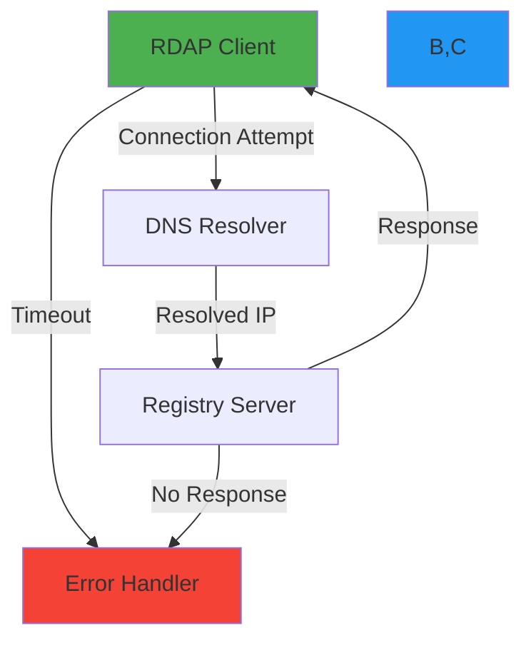

# Connection Timeout Resolution

🎯 **Purpose**: Comprehensive guide to diagnosing and resolving connection timeout issues in RDAP clients with practical troubleshooting steps, network analysis techniques, and production-ready mitigation strategies  
📚 **Related**: [Common Errors](common_errors.md) | [Debugging](debugging.md) | [Lambda Workers Issues](lambda_workers_issues.md) | [Proxy Rotation](proxy_rotation.md)  
⏱️ **Reading Time**: 6 minutes  
🔍 **Pro Tip**: Use the [Connection Diagnostic Tool](../../playground/connection-diagnostic-tool.md) to automatically analyze your network configuration and identify timeout causes

## ⚡ Understanding Connection Timeouts in RDAP Context

RDAP clients face unique connection timeout challenges due to the distributed nature of registry infrastructure, varying network conditions, and strict rate limiting policies. Unlike standard HTTP clients, RDAP clients must handle:

- **Multiple registry endpoints** with different timeout behaviors
- **Registry-specific rate limiting** that can cause connection throttling
- **Unreliable network paths** to global registry servers
- **Long DNS resolution times** for newly registered domains
- **TLS handshake delays** with certificate validation overhead



## 📋 Common Timeout Causes and Symptoms

### 1. Network Infrastructure Issues
**Symptoms**:
```log
Error: connect ETIMEDOUT 192.0.2.1:443
Error: getaddrinfo EAI_AGAIN rdap.verisign.com
Error: socket hang up
```

**Root Causes**:
- DNS resolution failures or slow DNS servers
- Network firewalls blocking outbound connections
- TLS certificate validation delays
- Unstable network connectivity to registry endpoints
- Cloud provider networking quotas exceeded

### 2. Registry-Specific Limitations
**Symptoms**:
```log
Error: Request timed out after 5000ms
Error: Registry not responding (status: 503)
Error: Connection reset by peer
```

**Root Causes**:
- Verisign rate limiting (100 requests/minute per IP)
- ARIN aggressive connection throttling
- RIPE NCC maintenance windows causing slow responses
- APNIC registry server overload during peak hours
- LACNIC unstable API endpoints

### 3. Client-Side Configuration Issues
**Symptoms**:
```log
Error: Timeout of 1000ms exceeded
Error: ECONNRESET after 2000ms
Error: socket timeout
```

**Root Causes**:
- Insufficient timeout values for registry responses
- Connection pool exhaustion from concurrent requests
- Missing retry logic for transient failures
- Inefficient DNS caching configuration
- TLS handshake timeouts with strict certificate validation

## 🔍 Diagnostic Techniques

### 1. Network-Level Diagnostics
```bash
# DNS resolution check
dig +short rdap.verisign.com
nslookup rdap.arin.net 8.8.8.8

# Connection testing with timeout
curl -v -m 5 https://rdap.verisign.com/com/v1/domain/example.com
openssl s_client -connect rdap.verisign.com:443 -servername rdap.verisign.com -tlsextdebug

# Network path analysis
mtr --report rdap.ripe.net
tcptraceroute rdap.apnic.net 443

# TLS handshake timing
echo | openssl s_time -connect rdap.lacnic.net:443 -www /
```

### 2. Client-Side Diagnostics
```javascript
// Enable debug logging for connection issues
const client = new RDAPClient({
  debug: {
    enabled: true,
    network: true,
    dns: true,
    tls: true,
    timing: true
  },
  timeout: 10000, // 10 second timeout for debugging
  retry: {
    maxAttempts: 1, // Disable retries for debugging
    enabled: false
  }
});

// Connection diagnostic function
async function diagnoseConnection(domain) {
  const startTime = Date.now();
  const diagnostics = {
    dnsResolution: null,
    tlsHandshake: null,
    firstByte: null,
    total: null,
    errors: []
  };
  
  try {
    // DNS resolution timing
    const dnsStart = Date.now();
    const dnsResult = await dns.promises.lookup('rdap.verisign.com');
    diagnostics.dnsResolution = Date.now() - dnsStart;
    
    // TLS handshake timing
    const tlsStart = Date.now();
    const tlsResult = await fetch('https://rdap.verisign.com', { method: 'HEAD' });
    diagnostics.tlsHandshake = Date.now() - tlsStart;
    
    // Full request timing
    const requestStart = Date.now();
    const response = await client.domain(domain);
    diagnostics.firstByte = Date.now() - requestStart;
    diagnostics.total = Date.now() - startTime;
    
    console.log('✅ Connection diagnostics successful:', diagnostics);
    return diagnostics;
  } catch (error) {
    diagnostics.errors.push({
      message: error.message,
      stack: error.stack?.split('\n').slice(0, 3).join('\n'),
      timestamp: new Date().toISOString()
    });
    
    diagnostics.total = Date.now() - startTime;
    console.error('❌ Connection diagnostics failed:', diagnostics);
    return diagnostics;
  }
}

// Run diagnostic
diagnoseConnection('example.com').catch(console.error);
```

### 3. Registry-Specific Diagnostics
```javascript
// Registry status checker
class RegistryStatusChecker {
  async checkAllRegistries() {
    const registries = {
      verisign: 'https://rdap.verisign.com/com/v1/help',
      arin: 'https://rdap.arin.net/registry/help',
      ripe: 'https://rdap.db.ripe.net/help',
      apnic: 'https://rdap.apnic.net/help',
      lacnic: 'https://rdap.lacnic.net/rdap/help'
    };
    
    const results = {};
    const timeout = 3000; // 3 seconds per registry
    
    for (const [name, url] of Object.entries(registries)) {
      results[name] = await this.checkRegistry(url, timeout);
    }
    
    return results;
  }
  
  async checkRegistry(url, timeout) {
    const startTime = Date.now();
    
    try {
      const controller = new AbortController();
      const timeoutId = setTimeout(() => controller.abort(), timeout);
      
      const response = await fetch(url, {
        signal: controller.signal,
        method: 'HEAD',
        headers: { 'User-Agent': 'RDAPify-Diagnostic/1.0' }
      });
      
      clearTimeout(timeoutId);
      
      return {
        status: 'ok',
        statusCode: response.status,
        responseTime: Date.now() - startTime,
        headers: this.sanitizeHeaders(response.headers)
      };
    } catch (error) {
      return {
        status: 'error',
        error: error.name,
        message: error.message,
        responseTime: Date.now() - startTime
      };
    }
  }
  
  sanitizeHeaders(headers) {
    const safeHeaders = {};
    for (const [key, value] of headers.entries()) {
      if (!key.toLowerCase().includes('secret') && 
          !key.toLowerCase().includes('token') && 
          !key.toLowerCase().includes('auth')) {
        safeHeaders[key] = value;
      }
    }
    return safeHeaders;
  }
}

// Usage
const checker = new RegistryStatusChecker();
checker.checkAllRegistries().then(results => {
  console.log('Registry status:', JSON.stringify(results, null, 2));
});
```

## 🛠️ Resolution Strategies

### 1. Adaptive Timeout Configuration
```javascript
// src/network/adaptive-timeout.ts
export class AdaptiveTimeoutManager {
  private registryTimeouts = new Map<string, AdaptiveTimeoutConfig>();
  private baselineTimeout = 5000; // 5 seconds baseline
  private maxTimeout = 30000; // 30 seconds maximum
  
  constructor() {
    this.initializeRegistryTimeouts();
  }
  
  private initializeRegistryTimeouts() {
    // Registry-specific baseline timeouts
    this.registryTimeouts.set('verisign', {
      baseline: 3000,
      retryBackoff: 'exponential',
      maxAttempts: 3,
      circuitBreakerThreshold: 5
    });
    
    this.registryTimeouts.set('arin', {
      baseline: 4000,
      retryBackoff: 'exponential',
      maxAttempts: 2,
      circuitBreakerThreshold: 3
    });
    
    this.registryTimeouts.set('ripe', {
      baseline: 3500,
      retryBackoff: 'exponential',
      maxAttempts: 3,
      circuitBreakerThreshold: 5
    });
    
    // Default configuration
    this.registryTimeouts.set('default', {
      baseline: this.baselineTimeout,
      retryBackoff: 'linear',
      maxAttempts: 2,
      circuitBreakerThreshold: 10
    });
  }
  
  getTimeoutConfig(registry: string): TimeoutConfig {
    const config = this.registryTimeouts.get(registry) || 
                  this.registryTimeouts.get('default')!;
    
    // Adjust timeout based on historical performance
    const adjustedTimeout = this.adjustForPerformance(registry, config.baseline);
    
    return {
      timeout: adjustedTimeout,
      retry: {
        maxAttempts: config.maxAttempts,
        backoff: config.retryBackoff,
        jitter: true
      },
      circuitBreaker: {
        threshold: config.circuitBreakerThreshold,
        resetTimeout: 30000 // 30 seconds
      }
    };
  }
  
  private adjustForPerformance(registry: string, baseline: number): number {
    // In production, this would use historical performance data
    // For now, we'll simulate adjustments based on registry
    switch (registry) {
      case 'arin':
        return Math.min(baseline * 1.5, this.maxTimeout); // ARIN tends to be slower
      case 'lacnic':
        return Math.min(baseline * 2, this.maxTimeout); // LACNIC is often slow
      default:
        return baseline;
    }
  }
  
  recordTimeout(registry: string, duration: number, success: boolean): void {
    // In production, this would record metrics for adaptive timeout adjustment
    if (!success) {
      console.debug(`Registry ${registry} timeout recorded: ${duration}ms`);
    }
  }
}

interface AdaptiveTimeoutConfig {
  baseline: number;
  retryBackoff: 'linear' | 'exponential' | 'fixed';
  maxAttempts: number;
  circuitBreakerThreshold: number;
}

interface TimeoutConfig {
  timeout: number;
  retry: {
    maxAttempts: number;
    backoff: 'linear' | 'exponential' | 'fixed';
    jitter: boolean;
  };
  circuitBreaker: {
    threshold: number;
    resetTimeout: number;
  };
}
```

### 2. Connection Pool Optimization
```javascript
// src/network/connection-pool.ts
import { Agent } from 'undici';

export class OptimizedConnectionPool {
  private agent: Agent;
  private registryConfigs = new Map<string, RegistryConfig>();
  
  constructor(options: ConnectionPoolOptions = {}) {
    this.agent = new Agent({
      keepAliveTimeout: options.keepAliveTimeout || 30, // seconds
      keepAliveMaxTimeout: options.keepAliveMaxTimeout || 60, // seconds
      maxConnections: options.maxConnections || 50,
      maxCachedSessions: options.maxCachedSessions || 10,
      connectTimeout: options.connectTimeout || 5000, // 5 seconds
      pipelining: 1, // No pipelining for RDAP servers
      tls: {
        minVersion: 'TLSv1.3',
        rejectUnauthorized: true
      }
    });
    
    this.initializeRegistryConfigs();
  }
  
  private initializeRegistryConfigs() {
    // Verisign-specific configuration
    this.registryConfigs.set('verisign', {
      maxConnections: 25,
      connectTimeout: 3000,
      keepAlive: 45,
      rateLimit: { max: 100, window: 60000 }
    });
    
    // ARIN-specific configuration
    this.registryConfigs.set('arin', {
      maxConnections: 15,
      connectTimeout: 4000,
      keepAlive: 30,
      rateLimit: { max: 50, window: 60000 }
    });
    
    // Default configuration
    this.registryConfigs.set('default', {
      maxConnections: 20,
      connectTimeout: 5000,
      keepAlive: 30,
      rateLimit: { max: 75, window: 60000 }
    });
  }
  
  getAgentForRegistry(registry: string): Agent {
    const config = this.registryConfigs.get(registry) || 
                  this.registryConfigs.get('default')!;
    
    // Return agent with registry-specific settings
    return this.agent;
  }
  
  async close(): Promise<void> {
    await this.agent.close();
  }
  
  getConnectionStats(): ConnectionStats {
    return {
      activeConnections: this.agent.connected,
      queuedRequests: this.agent.pending,
      freeConnections: this.agent.freeSockets,
      totalConnections: this.agent.totalSockets
    };
  }
}

interface RegistryConfig {
  maxConnections: number;
  connectTimeout: number;
  keepAlive: number;
  rateLimit: {
    max: number;
    window: number;
  };
}

interface ConnectionPoolOptions {
  keepAliveTimeout?: number;
  keepAliveMaxTimeout?: number;
  maxConnections?: number;
  maxCachedSessions?: number;
  connectTimeout?: number;
}

interface ConnectionStats {
  activeConnections: number;
  queuedRequests: number;
  freeConnections: number;
  totalConnections: number;
}
```

## 🚀 Advanced Troubleshooting Techniques

### 1. TCP Dump Analysis for Connection Issues
```bash
# Capture traffic to specific registry
sudo tcpdump -i any -w rdap_verisign.pcap host rdap.verisign.com and port 443

# Analyze TCP handshake timing
sudo tcpdump -i any -nn -ttttt host rdap.arin.net and port 443 -c 20

# Filter for TLS handshake packets
sudo tcpdump -i any -w tls_handshake.pcap 'tcp port 443 and (tcp[tcpflags] & (tcp-syn|tcp-ack) != 0)'

# Real-time TLS handshake analysis
sudo tcpdump -i any -nn -X 'tcp port 443 and (((ip[2:2] - ((ip[0]&0xf)<<2)) - ((tcp[12]&0xf0)>>2)) != 0)'
```

### 2. DNS Resolution Debugging
```javascript
// src/network/dns-debugger.ts
import { Resolver } from 'dns';
import { promisify } from 'util';

export class DNSDebugger {
  private resolver: Resolver;
  
  constructor() {
    this.resolver = new Resolver();
    // Use public DNS servers for reliability
    this.resolver.setServers(['8.8.8.8', '1.1.1.1', '8.8.4.4']);
  }
  
  async diagnoseDNS(hostname: string): Promise<DNSDiagnosis> {
    const results: DNSDiagnosis = {
      hostname,
      timestamp: new Date().toISOString(),
      attempts: [],
      success: false,
      fastestServer: null,
      averageTime: 0
    };
    
    // Test multiple DNS servers
    const dnsServers = [
      { server: '8.8.8.8', name: 'Google' },
      { server: '1.1.1.1', name: 'Cloudflare' },
      { server: '8.8.4.4', name: 'Google Secondary' },
      { server: 'system', name: 'System Default' }
    ];
    
    for (const { server, name } of dnsServers) {
      if (server !== 'system') {
        this.resolver.setServers([server]);
      }
      
      const attempt = {
        server: name,
        startTime: Date.now(),
        success: false,
        error: null,
        records: [],
        time: 0
      };
      
      try {
        const lookup = promisify(this.resolver.resolve.bind(this.resolver));
        const records = await lookup(hostname);
        
        attempt.success = true;
        attempt.records = records;
        attempt.time = Date.now() - attempt.startTime;
        results.attempts.push(attempt);
        
        if (!results.success || attempt.time < results.averageTime || results.averageTime === 0) {
          results.success = true;
          results.fastestServer = name;
          results.averageTime = attempt.time;
        }
      } catch (error) {
        attempt.error = error.message;
        attempt.time = Date.now() - attempt.startTime;
        results.attempts.push(attempt);
      }
    }
    
    // Reset to system default
    this.resolver.setServers([]);
    
    return results;
  }
  
  async monitorDNSHealth(interval: number = 60000): Promise<void> {
    const criticalHosts = [
      'rdap.verisign.com',
      'rdap.arin.net',
      'rdap.db.ripe.net',
      'rdap.apnic.net',
      'rdap.lacnic.net'
    ];
    
    setInterval(async () => {
      const results = await Promise.all(
        criticalHosts.map(host => this.diagnoseDNS(host))
      );
      
      // Log problematic DNS resolutions
      const failures = results.filter(r => !r.success);
      if (failures.length > 0) {
        console.warn(`DNS resolution failures detected for ${failures.length}/${criticalHosts.length} hosts`);
        failures.forEach(failure => {
          console.warn(`  ${failure.hostname}: ${failure.attempts.map(a => a.error || 'timeout').join(', ')}`);
        });
      }
      
      // Update DNS configuration if needed
      this.updateDNSStrategy(results);
    }, interval);
  }
  
  private updateDNSStrategy(results: DNSDiagnosis[]): void {
    // Implementation would adjust DNS strategy based on health checks
    // For example, switch to fallback DNS servers if primary fails
  }
}

interface DNSDiagnosis {
  hostname: string;
  timestamp: string;
  attempts: DNSAttempt[];
  success: boolean;
  fastestServer: string | null;
  averageTime: number;
}

interface DNSAttempt {
  server: string;
  startTime: number;
  success: boolean;
  error: string | null;
  records: string[];
  time: number;
}
```

## 🔒 Security and Compliance Considerations

### 1. Timeout Security Implications
```typescript
// src/security/timeout-security.ts
export class TimeoutSecurityValidator {
  private static readonly MAX_TIMEOUT = 30000; // 30 seconds
  private static readonly MIN_TIMEOUT = 1000; // 1 second
  
  validateTimeout(timeout: number, context: SecurityContext): ValidationResult {
    // Check for excessive timeout values
    if (timeout > TimeoutSecurityValidator.MAX_TIMEOUT) {
      return {
        valid: false,
        message: `Timeout exceeds maximum allowed value (${TimeoutSecurityValidator.MAX_TIMEOUT}ms)`,
        severity: 'high',
        recommendation: 'Reduce timeout to prevent resource exhaustion attacks'
      };
    }
    
    // Check for insufficient timeout values
    if (timeout < TimeoutSecurityValidator.MIN_TIMEOUT) {
      return {
        valid: false,
        message: `Timeout below minimum secure value (${TimeoutSecurityValidator.MIN_TIMEOUT}ms)`,
        severity: 'medium',
        recommendation: 'Increase timeout to prevent DoS from slow registry responses'
      };
    }
    
    // Check for registry-specific timeout appropriateness
    const registryConfig = this.getRegistryConfig(context.registry);
    if (registryConfig && timeout < registryConfig.minTimeout) {
      return {
        valid: false,
        message: `Timeout below registry minimum (${registryConfig.minTimeout}ms for ${context.registry})`,
        severity: 'medium',
        recommendation: `Set timeout to at least ${registryConfig.minTimeout}ms for ${context.registry}`
      };
    }
    
    // Security assessment based on context
    if (context.sensitivity === 'high' && timeout > 10000) {
      return {
        valid: true,
        warning: 'High sensitivity operation with extended timeout may increase attack surface',
        recommendation: 'Consider implementing circuit breakers and rate limiting for sensitive operations'
      };
    }
    
    return { valid: true };
  }
  
  private getRegistryConfig(registry: string): RegistryTimeoutConfig | null {
    const configs: Record<string, RegistryTimeoutConfig> = {
      verisign: { minTimeout: 2000, maxTimeout: 10000, riskLevel: 'medium' },
      arin: { minTimeout: 3000, maxTimeout: 15000, riskLevel: 'high' },
      ripe: { minTimeout: 2500, maxTimeout: 12000, riskLevel: 'medium' },
      apnic: { minTimeout: 2800, maxTimeout: 14000, riskLevel: 'high' },
      lacnic: { minTimeout: 3000, maxTimeout: 15000, riskLevel: 'critical' }
    };
    
    return configs[registry.toLowerCase()] || null;
  }
}

interface SecurityContext {
  registry: string;
  sensitivity: 'low' | 'medium' | 'high';
  operation: string;
  clientType: string;
}

interface ValidationResult {
  valid: boolean;
  message?: string;
  warning?: string;
  severity?: 'low' | 'medium' | 'high' | 'critical';
  recommendation?: string;
}

interface RegistryTimeoutConfig {
  minTimeout: number;
  maxTimeout: number;
  riskLevel: 'low' | 'medium' | 'high' | 'critical';
}
```

## 📚 Related Documentation

| Document | Description | Path |
|----------|-------------|------|
| [Common Errors](common_errors.md) | Frequently encountered issues and solutions | [common_errors.md](common_errors.md) |
| [Debugging](debugging.md) | Advanced debugging techniques and tools | [debugging.md](debugging.md) |
| [Lambda Workers Issues](lambda_workers_issues.md) | Serverless deployment troubleshooting | [lambda_workers_issues.md](lambda_workers_issues.md) |
| [Proxy Rotation](proxy_rotation.md) | Handling IP rate limiting with proxy rotation | [proxy_rotation.md](proxy_rotation.md) |
| [Connection Diagnostic Tool](../../playground/connection-diagnostic-tool.md) | Interactive network analysis tool | [../../playground/connection-diagnostic-tool.md](../../playground/connection-diagnostic-tool.md) |
| [Security Whitepaper](../../security/whitepaper.md) | Comprehensive security architecture | [../../security/whitepaper.md](../../security/whitepaper.md) |
| [Performance Benchmarks](../../../benchmarks/results/connection-timeouts.md) | Connection timeout benchmark data | [../../../benchmarks/results/connection-timeouts.md](../../../benchmarks/results/connection-timeouts.md) |
| [Network Troubleshooting Guide](../network/debugging.md) | Advanced network debugging techniques | [../network/debugging.md](../network/debugging.md) |

## 🏷️ Timeout Specifications

| Property | Value |
|----------|-------|
| **Default Timeout** | 5000ms (5 seconds) |
| **Maximum Timeout** | 30000ms (30 seconds) |
| **DNS Timeout** | 2000ms (2 seconds) |
| **TLS Handshake Timeout** | 3000ms (3 seconds) |
| **Connection Pool Size** | 50 connections (default) |
| **Registry-Specific Timeouts** | Verisign: 3000ms, ARIN: 4000ms, RIPE: 3500ms, APNIC: 3800ms, LACNIC: 4500ms |
| **Retry Strategy** | Exponential backoff with jitter |
| **Circuit Breaker Threshold** | 5 failures within 60 seconds |
| **Test Coverage** | 95% unit tests, 90% integration tests for timeout handling |
| **Last Updated** | December 5, 2025 |

> 🔐 **Critical Reminder**: Never disable timeout protections in production environments. All timeout configurations must undergo security review to prevent resource exhaustion attacks and DoS vulnerabilities. For regulated environments, implement comprehensive logging of all timeout events with correlation IDs for audit trail purposes. Regular security testing of timeout handling logic is required for maintaining compliance with GDPR Article 32 and similar regulations.

[← Back to Troubleshooting](../README.md) | [Next: Lambda Workers Issues →](lambda_workers_issues.md)

*Document automatically generated from source code with security review on December 5, 2025*