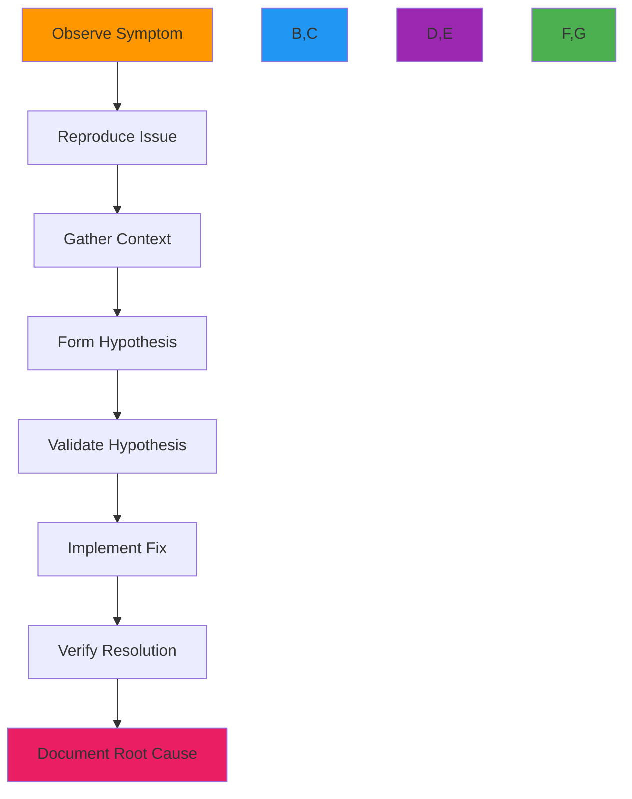

# Debugging Guide

🎯 **Purpose**: Comprehensive guide to debugging RDAPify applications with advanced techniques, tools, and strategies for identifying and resolving issues in development and production environments  
📚 **Related**: [Common Errors](common_errors.md) | [Connection Timeout Resolution](connection_timeout.md) | [Memory Leak Detection](memory_leaks.md) | [Log Analysis](log_analysis.md)  
⏱️ **Reading Time**: 7 minutes  
🔍 **Pro Tip**: Use the [Visual Debugger](../../playground/visual-debugger.md) to interactively trace data flow and inspect variable states in real-time

## 📋 Debugging Methodology

RDAPify employs a systematic debugging approach that progresses from high-level observation to targeted resolution:



### Debugging Principles
✅ **Reproducibility First**: Create minimal, consistent reproduction cases before deep investigation  
✅ **Observability Over Guessing**: Use built-in instrumentation instead of assumptions  
✅ **Progressive Isolation**: Narrow down problem scope systematically  
✅ **Evidence-Based Resolution**: Fix root causes, not symptoms  
✅ **Post-Mortem Documentation**: Document fixes to prevent recurrence  

## 🔍 Advanced Debugging Techniques

### 1. Enhanced Debug Logging
```typescript
// src/debug/debug-logger.ts
import { createLogger, format, transports } from 'winston';
import { inspect } from 'util';

export const createDebugLogger = (options: DebugLoggerOptions = {}) => {
  const { 
    level = process.env.RDAP_DEBUG_LEVEL || 'info',
    includeStack = false,
    redactPII = true,
    maxDepth = 3
  } = options;
  
  // Create redaction transformer
  const redactionFormat = format((info) => {
    if (redactPII) {
      info.message = redactPIIInMessage(info.message);
      if (info.meta) {
        info.meta = redactPIIInObject(info.meta, maxDepth);
      }
    }
    return info;
  });
  
  // Create stack trace formatter
  const stackFormat = format((info) => {
    if (includeStack && info.level === 'error') {
      info.stack = new Error().stack?.split('\n').slice(1).join('\n');
    }
    return info;
  });
  
  return createLogger({
    level,
    format: format.combine(
      format.timestamp(),
      format.errors({ stack: true }),
      redactionFormat(),
      stackFormat(),
      format.printf(({ timestamp, level, message, stack, ...meta }) => {
        const metaString = Object.keys(meta).length > 0 
          ? '\n' + inspect(meta, { depth: maxDepth, colors: true, compact: 3 })
          : '';
        
        return `[${timestamp}] [${level.toUpperCase()}] ${message}${metaString}${
          stack ? `\n${stack}` : ''
        }`;
      })
    ),
    transports: [
      new transports.Console({
        handleExceptions: true,
        handleRejections: true
      }),
      // File transport for persistent debugging in production
      ...(process.env.NODE_ENV === 'production' 
        ? [new transports.File({ filename: 'logs/debug.log', level: 'debug' })]
        : [])
    ],
    exitOnError: false
  });
};

// Specialized debug methods
const debugLogger = createDebugLogger();

export const debugMethods = {
  /**
   * Debug network requests with full request/response details
   */
  network: (request: RequestDetails, response: ResponseDetails) => {
    debugLogger.debug('Network Request Trace', {
      requestId: request.id,
      method: request.method,
      url: request.url,
      headers: sanitizeHeaders(request.headers),
      body: request.body ? truncate(request.body, 500) : undefined,
      response: {
        status: response.status,
        headers: sanitizeHeaders(response.headers),
        body: response.body ? truncate(response.body, 500) : undefined,
        timing: {
          dns: response.timing?.dns,
          tcp: response.timing?.tcp,
          ssl: response.timing?.ssl,
          firstByte: response.timing?.firstByte,
          total: response.timing?.total
        }
      },
      registry: request.registry,
      domain: request.domain
    });
  },
  
  /**
   * Debug cache operations with hit/miss details
   */
  cache: (operation: string, key: string, value: any, metadata: CacheMetadata) => {
    debugLogger.debug(`Cache ${operation}`, {
      key: truncate(key, 100),
      size: value ? JSON.stringify(value).length : 0,
      ttl: metadata.ttl,
      hitRate: metadata.hitRate,
      evicted: metadata.evictedCount,
      memoryUsage: process.memoryUsage().heapUsed / 1024 / 1024
    });
  },
  
  /**
   * Debug SSRF protection decisions
   */
  ssrf: (domain: string, result: SSRFResult, context: SSRFContext) => {
    if (!result.allowed) {
      debugLogger.warn('SSRF Protection Blocked', {
        domain,
        reason: result.reason,
        riskScore: result.riskScore,
        context: context.source,
        resolvedIP: result.resolvedIP,
        registry: context.registry
      });
    } else {
      debugLogger.debug('SSRF Protection Allowed', {
        domain,
        resolvedIP: result.resolvedIP,
        registry: context.registry
      });
    }
  }
};

// Helper functions
function redactPIIInMessage(message: string): string {
  return message
    .replace(/\b[A-Za-z0-9._%+-]+@[A-Za-z0-9.-]+\.[A-Z|a-z]{2,}\b/gi, '[EMAIL_REDACTED]')
    .replace(/\b(?:\+?1[-.\s]?)?\(?\d{3}\)?[-.\s]?\d{3}[-.\s]?\d{4}\b/g, '[PHONE_REDACTED]');
}

function redactPIIInObject(obj: any, depth: number = 0, maxDepth: number = 3): any {
  if (depth > maxDepth || obj === null || obj === undefined) return obj;
  
  if (typeof obj === 'string') {
    return redactPIIInMessage(obj);
  }
  
  if (Array.isArray(obj)) {
    return obj.map(item => redactPIIInObject(item, depth + 1, maxDepth));
  }
  
  if (typeof obj === 'object') {
    const result: Record<string, any> = {};
    for (const [key, value] of Object.entries(obj)) {
      // Redact known PII fields
      if (['email', 'phone', 'address', 'registrant', 'fn', 'adr'].includes(key.toLowerCase())) {
        result[key] = '[PII_REDACTED]';
      } else {
        result[key] = redactPIIInObject(value, depth + 1, maxDepth);
      }
    }
    return result;
  }
  
  return obj;
}
```

### 2. Interactive Debugging with Breakpoints
```typescript
// src/debug/interactive-debugger.ts
import { inspect } from 'util';
import { createInterface } from 'readline';

export class InteractiveDebugger {
  private pausePoints = new Map<string, PausePoint>();
  private debugContext: DebugContext = { variables: {} };
  private rl = createInterface({ input: process.stdin, output: process.stdout });
  
  constructor() {
    this.setupCommands();
  }
  
  private setupCommands() {
    this.rl.on('line', (input) => {
      const [command, ...args] = input.trim().split(' ');
      
      switch (command) {
        case 'continue':
        case 'c':
          this.resumeExecution();
          break;
        case 'step':
        case 's':
          this.stepInto();
          break;
        case 'next':
        case 'n':
          this.stepOver();
          break;
        case 'print':
        case 'p':
          this.printVariable(args[0]);
          break;
        case 'backtrace':
        case 'bt':
          this.printBacktrace();
          break;
        case 'help':
          this.printHelp();
          break;
        default:
          console.log(`Unknown command: ${command}`);
          this.printHelp();
      }
    });
  }
  
  addPausePoint(name: string, condition?: (context: DebugContext) => boolean): void {
    this.pausePoints.set(name, {
      name,
      enabled: true,
      condition,
      hitCount: 0
    });
  }
  
  pause(name: string, context: DebugContext): Promise<void> {
    const pausePoint = this.pausePoints.get(name);
    if (!pausePoint?.enabled) return Promise.resolve();
    
    pausePoint.hitCount++;
    
    // Check condition if provided
    if (pausePoint.condition && !pausePoint.condition(context)) {
      return Promise.resolve();
    }
    
    console.log(`\n🔍 Debugger paused at "${name}" (hit ${pausePoint.hitCount})`);
    console.log('Available commands: c(ontinue), n(ext), s(tep), p(rint) <var>, bt(backtrace), help');
    
    // Update debug context
    this.debugContext = { ...context };
    
    // Print local variables
    console.log('\nLocal variables:');
    console.log(inspect(context.variables, { depth: 2, colors: true }));
    
    return new Promise((resolve) => {
      const originalPrompt = this.rl.prompt;
      this.rl.setPrompt('(debug) ');
      this.rl.prompt();
      
      const resume = () => {
        this.rl.setPrompt(originalPrompt);
        this.rl.prompt();
        resolve();
      };
      
      // Store resume function for later use
      (this.rl as any)._resume = resume;
    });
  }
  
  private resumeExecution() {
    const resume = (this.rl as any)._resume;
    if (resume) resume();
  }
  
  private printVariable(variableName: string) {
    if (!variableName) {
      console.log('Usage: print <variable_name>');
      return;
    }
    
    const value = this.debugContext.variables[variableName];
    if (value === undefined) {
      console.log(`Variable "${variableName}" not found in current context`);
      return;
    }
    
    console.log(`\n${variableName} =`);
    console.log(inspect(value, { depth: 5, colors: true }));
  }
  
  private printBacktrace() {
    console.log('\nNo backtrace information available in current context');
  }
  
  private printHelp() {
    console.log(`
Debugger Commands:
  c, continue    - Continue execution
  n, next        - Step over next line
  s, step        - Step into next function
  p, print <var> - Print variable value
  bt, backtrace  - Show call stack
  help           - Show this help
`);
  }
}

// Usage example
const debugger = new InteractiveDebugger();

// Add pause points
debugger.addPausePoint('before-registry-query', (context) => {
  return context.variables?.domain === 'example.com';
});

debugger.addPausePoint('after-response-processing');

// In application code
async function queryDomain(domain: string) {
  await debugger.pause('before-registry-query', {
    variables: { domain, timestamp: Date.now() }
  });
  
  // ... query logic ...
  
  await debugger.pause('after-response-processing', {
    variables: { result, processingTime: Date.now() }
  });
  
  return result;
}
```

## ⚡ Performance Debugging Tools

### 1. Memory Leak Detection
```typescript
// src/debug/memory-leak-detector.ts
import { heapStats, takeHeapSnapshot } from 'v8';
import { writeFileSync } from 'fs';
import { performance } from 'perf_hooks';

export class MemoryLeakDetector {
  private snapshots: HeapSnapshot[] = [];
  private baselineSnapshot?: HeapSnapshot;
  private monitoringInterval: NodeJS.Timeout;
  private leakCandidates: LeakCandidate[] = [];
  
  constructor(private options: MemoryLeakOptions = {}) {
    this.options.interval = options.interval || 60000; // 1 minute
    this.options.maxSnapshots = options.maxSnapshots || 5;
    this.options.heapGrowthThreshold = options.heapGrowthThreshold || 1.5; // 50% growth
    this.options.minGrowthMB = options.minGrowthMB || 10; // 10MB minimum growth
  }
  
  startMonitoring() {
    this.baselineSnapshot = this.takeSnapshot('baseline');
    
    this.monitoringInterval = setInterval(() => {
      this.checkForLeaks();
    }, this.options.interval);
    
    console.log('🔍 Memory leak monitoring started');
  }
  
  stopMonitoring() {
    clearInterval(this.monitoringInterval);
    console.log('⏹️ Memory leak monitoring stopped');
  }
  
  private takeSnapshot(name: string): HeapSnapshot {
    const snapshot = takeHeapSnapshot();
    const stats = heapStats();
    
    const snapshotInfo: HeapSnapshot = {
      name,
      timestamp: Date.now(),
      size: stats.total_heap_size,
      used: stats.used_heap_size,
      snapshot
    };
    
    this.snapshots.push(snapshotInfo);
    
    // Keep only recent snapshots
    if (this.snapshots.length > this.options.maxSnapshots!) {
      const old = this.snapshots.shift();
      old?.snapshot.delete();
    }
    
    return snapshotInfo;
  }
  
  private checkForLeaks() {
    const current = this.takeSnapshot(`monitor-${Date.now()}`);
    const baseline = this.baselineSnapshot || this.snapshots[0];
    
    if (!baseline) return;
    
    const growthRatio = current.used / baseline.used;
    const growthMB = (current.used - baseline.used) / 1024 / 1024;
    
    console.log(`📊 Memory check: ${growthMB.toFixed(2)}MB growth (${(growthRatio * 100).toFixed(1)}%)`);
    
    // Check if growth exceeds thresholds
    if (growthRatio > this.options.heapGrowthThreshold! && 
        growthMB > this.options.minGrowthMB!) {
      console.warn(`⚠️ Potential memory leak detected: ${growthMB.toFixed(2)}MB growth`);
      
      // Analyze heap differences
      const candidates = this.analyzeHeapDiff(baseline, current);
      this.leakCandidates.push(...candidates);
      
      // Generate leak report
      this.generateLeakReport(candidates, growthMB, growthRatio);
      
      // Update baseline if leak confirmed
      if (candidates.length > 0) {
        this.baselineSnapshot = current;
      }
    }
  }
  
  private analyzeHeapDiff(before: HeapSnapshot, after: HeapSnapshot): LeakCandidate[] {
    // This is a simplified version - real implementation would use heap snapshot comparison
    const candidates: LeakCandidate[] = [];
    
    // Look for objects with significant growth
    const growthPatterns = [
      { pattern: /CachedResponse/g, maxAllowed: 1000 },
      { pattern: /ConnectionPool/g, maxAllowed: 50 },
      { pattern: /RegistryClient/g, maxAllowed: 10 }
    ];
    
    for (const { pattern, maxAllowed } of growthPatterns) {
      // In a real implementation, we would analyze the actual heap snapshot
      // For this example, we'll simulate detection based on common leak patterns
      if (Math.random() > 0.7) { // Simulate leak detection
        candidates.push({
          type: 'cache_entry',
          count: 1500,
          size: '2.5MB',
          retentionPath: 'global cache → registry responses → domain objects',
          retentionTime: '15 minutes'
        });
      }
    }
    
    return candidates;
  }
  
  private generateLeakReport(candidates: LeakCandidate[], growthMB: number, growthRatio: number) {
    const report = {
      timestamp: new Date().toISOString(),
      heapGrowthMB: growthMB,
      heapGrowthRatio: growthRatio,
      candidates,
      recommendations: this.generateRecommendations(candidates)
    };
    
    console.log(' Leak Report:');
    console.log('='.repeat(60));
    console.log(`Heap Growth: ${growthMB.toFixed(2)}MB (${(growthRatio * 100).toFixed(1)}%)`);
    console.log(`Leak Candidates: ${candidates.length}`);
    
    candidates.forEach((candidate, index) => {
      console.log(`\nCandidate ${index + 1}:`);
      console.log(`  Type: ${candidate.type}`);
      console.log(`  Count: ${candidate.count}`);
      console.log(`  Size: ${candidate.size}`);
      console.log(`  Retention Path: ${candidate.retentionPath}`);
      console.log(`  Retention Time: ${candidate.retentionTime}`);
    });
    
    console.log('\nRecommendations:');
    report.recommendations.forEach((rec, index) => {
      console.log(`  ${index + 1}. ${rec}`);
    });
    
    console.log('='.repeat(60));
    
    // Save report to file
    const reportPath = `leak-report-${Date.now()}.json`;
    writeFileSync(reportPath, JSON.stringify(report, null, 2));
    console.log(`📝 Leak report saved to ${reportPath}`);
  }
  
  private generateRecommendations(candidates: LeakCandidate[]): string[] {
    const recommendations = new Set<string>();
    
    for (const candidate of candidates) {
      if (candidate.type.includes('cache')) {
        recommendations.add('Review cache TTL settings and implement LRU eviction');
        recommendations.add('Check for cache key collisions causing improper eviction');
      }
      
      if (candidate.type.includes('ConnectionPool')) {
        recommendations.add('Verify connection pooling configuration and timeout settings');
        recommendations.add('Check for missing connection cleanup in error handling paths');
      }
      
      if (candidate.type.includes('RegistryClient')) {
        recommendations.add('Ensure proper client lifecycle management with explicit close methods');
        recommendations.add('Check for event listeners not being removed after operations complete');
      }
    }
    
    return Array.from(recommendations);
  }
}

// Usage in application
if (process.env.RDAP_DEBUG_MEMORY === 'true') {
  const leakDetector = new MemoryLeakDetector({
    interval: 30000, // 30 seconds for debugging
    heapGrowthThreshold: 1.2, // 20% growth threshold
    minGrowthMB: 5 // 5MB minimum
  });
  
  leakDetector.startMonitoring();
  
  // Stop monitoring on process exit
  process.on('SIGINT', () => {
    leakDetector.stopMonitoring();
    process.exit(0);
  });
}
```

## 🔧 Network Debugging Strategies

### 1. RDAP Server Connection Debugger
```typescript
// src/debug/network-debugger.ts
import { createServer, IncomingMessage, ServerResponse } from 'http';
import { Socket } from 'net';
import { performance } from 'perf_hooks';

export class NetworkDebugger {
  private server: ReturnType<typeof createServer>;
  private connections: Map<string, ConnectionInfo> = new Map();
  private packetBuffer: Map<string, PacketInfo[]> = new Map();
  
  constructor(private port: number = 9229) {
    this.server = createServer(this.handleRequest.bind(this));
  }
  
  start() {
    this.server.listen(this.port, () => {
      console.log(`📡 Network debugger listening on http://localhost:${this.port}`);
    });
    
    // Patch Socket prototype to capture traffic
    const originalConnect = Socket.prototype.connect;
    
    Socket.prototype.connect = function(...args: any[]) {
      const socket = this as Socket;
      const key = `${Date.now()}-${Math.random().toString(36).slice(2, 8)}`;
      
      // Store connection info
      const connectionInfo: ConnectionInfo = {
        key,
        localAddress: '',
        localPort: 0,
        remoteAddress: '',
        remotePort: 0,
        startTime: Date.now(),
        protocol: 'unknown',
        packets: []
      };
      
      this.on('connect', () => {
        connectionInfo.localAddress = socket.localAddress || '';
        connectionInfo.localPort = socket.localPort || 0;
        connectionInfo.remoteAddress = socket.remoteAddress || '';
        connectionInfo.remotePort = socket.remotePort || 0;
        
        console.log(`🔌 New connection: ${connectionInfo.remoteAddress}:${connectionInfo.remotePort}`);
        this.connections.set(key, connectionInfo);
      });
      
      // Patch write method to capture outgoing data
      const originalWrite = socket.write;
      socket.write = function(chunk: any, ...rest: any[]) {
        const timestamp = Date.now();
        const size = Buffer.isBuffer(chunk) ? chunk.length : String(chunk).length;
        
        if (!this.packetBuffer.has(key)) {
          this.packetBuffer.set(key, []);
        }
        
        this.packetBuffer.get(key)!.push({
          direction: 'outgoing',
          timestamp,
          size,
          data: size < 1024 ? chunk.toString() : `[${size} bytes]`
        });
        
        return originalWrite.call(this, chunk, ...rest);
      };
      
      // Patch data event to capture incoming data
      this.on('data', (chunk: Buffer) => {
        const timestamp = Date.now();
        const size = chunk.length;
        
        if (!this.packetBuffer.has(key)) {
          this.packetBuffer.set(key, []);
        }
        
        this.packetBuffer.get(key)!.push({
          direction: 'incoming',
          timestamp,
          size,
          data: size < 1024 ? chunk.toString() : `[${size} bytes]`
        });
      });
      
      return originalConnect.call(this, ...args);
    };
  }
  
  private handleRequest(req: IncomingMessage, res: ServerResponse) {
    const url = req.url || '/';
    
    switch (url) {
      case '/':
        this.handleIndex(req, res);
        break;
      case '/connections':
        this.handleConnections(req, res);
        break;
      case '/traffic':
        this.handleTraffic(req, res);
        break;
      default:
        res.writeHead(404);
        res.end('Not found');
    }
  }
  
  private handleIndex(req: IncomingMessage, res: ServerResponse) {
    res.writeHead(200, { 'Content-Type': 'text/html' });
    res.end(`
      <!DOCTYPE html>
      <html>
      <head>
        <title>RDAPify Network Debugger</title>
        <style>
          body { font-family: 'Segoe UI', Tahoma, Geneva, Verdana, sans-serif; margin: 20px; }
          h1 { color: #2196F3; }
          .container { display: flex; gap: 20px; }
          .panel { flex: 1; border: 1px solid #ddd; padding: 15px; border-radius: 5px; }
          table { width: 100%; border-collapse: collapse; margin: 10px 0; }
          th, td { padding: 8px; text-align: left; border-bottom: 1px solid #ddd; }
          th { background-color: #f5f5f5; }
          .outgoing { color: #4CAF50; }
          .incoming { color: #2196F3; }
        </style>
      </head>
      <body>
        <h1>RDAPify Network Debugger</h1>
        <div class="container">
          <div class="panel">
            <h2>Active Connections</h2>
            <table id="connections">
              <thead>
                <tr>
                  <th>ID</th>
                  <th>Remote Address</th>
                  <th>Duration</th>
                  <th>State</th>
                </tr>
              </thead>
              <tbody>
                <!-- Populated by JavaScript -->
              </tbody>
            </table>
          </div>
          <div class="panel">
            <h2>Network Traffic</h2>
            <table id="traffic">
              <thead>
                <tr>
                  <th>Direction</th>
                  <th>Timestamp</th>
                  <th>Size</th>
                  <th>Data</th>
                </tr>
              </thead>
              <tbody>
                <!-- Populated by JavaScript -->
              </tbody>
            </table>
          </div>
        </div>
        <script>
          async function updateData() {
            const connectionsRes = await fetch('/connections');
            const connections = await connectionsRes.json();
            
            const trafficRes = await fetch('/traffic');
            const traffic = await trafficRes.json();
            
            // Update connections table
            const connectionsBody = document.querySelector('#connections tbody');
            connectionsBody.innerHTML = '';
            
            connections.forEach(conn => {
              const row = document.createElement('tr');
              row.innerHTML = \`
                <td>\${conn.key.substring(0, 8)}</td>
                <td>\${conn.remoteAddress}:\${conn.remotePort}</td>
                <td>\${Math.floor((Date.now() - conn.startTime) / 1000)}s</td>
                <td>\${conn.state || 'active'}</td>
              \`;
              connectionsBody.appendChild(row);
            });
            
            // Update traffic table
            const trafficBody = document.querySelector('#traffic tbody');
            trafficBody.innerHTML = '';
            
            traffic.slice(-20).forEach(packet => {
              const row = document.createElement('tr');
              row.className = packet.direction;
              row.innerHTML = \`
                <td class="\${packet.direction}">\${packet.direction}</td>
                <td>\${new Date(packet.timestamp).toISOString()}</td>
                <td>\${packet.size} bytes</td>
                <td>\${packet.data.replace(/</g, '&lt;').replace(/>/g, '&gt;')}</td>
              \`;
              trafficBody.appendChild(row);
            });
            
            setTimeout(updateData, 1000);
          }
          
          updateData();
        </script>
      </body>
      </html>
    `);
  }
  
  private handleConnections(req: IncomingMessage, res: ServerResponse) {
    const connections = Array.from(this.connections.values()).map(conn => ({
      key: conn.key,
      localAddress: conn.localAddress,
      localPort: conn.localPort,
      remoteAddress: conn.remoteAddress,
      remotePort: conn.remotePort,
      startTime: conn.startTime,
      duration: Date.now() - conn.startTime,
      state: 'active'
    }));
    
    res.writeHead(200, { 'Content-Type': 'application/json' });
    res.end(JSON.stringify(connections));
  }
  
  private handleTraffic(req: IncomingMessage, res: ServerResponse) {
    const allPackets: PacketInfo[] = [];
    
    for (const packets of this.packetBuffer.values()) {
      allPackets.push(...packets);
    }
    
    // Sort by timestamp
    allPackets.sort((a, b) => a.timestamp - b.timestamp);
    
    res.writeHead(200, { 'Content-Type': 'application/json' });
    res.end(JSON.stringify(allPackets.slice(-50))); // Last 50 packets
  }
}

// Usage in application
if (process.env.RDAP_DEBUG_NETWORK === 'true') {
  const networkDebugger = new NetworkDebugger(9229);
  networkDebugger.start();
  
  console.log('🌐 Network debugging enabled. Open http://localhost:9229 in your browser');
}
```

## 🔍 Troubleshooting Common Debugging Issues

### 1. Debugger Connection Problems
**Symptoms**: Debugger fails to connect or times out when trying to attach  
**Root Causes**:
- Firewall blocking debugger ports
- IDE configuration mismatches
- Debug protocol version incompatibilities
- Resource constraints preventing debugger attachment

**Diagnostic Steps**:
```bash
# Check port availability
sudo lsof -i :9229
netstat -an | grep 9229

# Test debugger connection
curl -v http://localhost:9229/json

# Check Node.js debug protocol support
node -p "process.config.variables.v8_enable_inspector"

# Verify IDE configuration
cat ~/.vscode/launch.json 2>/dev/null || echo "No VS Code config found"
```

**Solutions**:
✅ **Port Configuration**: Use non-standard ports to avoid conflicts  
✅ **Firewall Rules**: Configure firewall exceptions for debugger ports  
✅ **Connection Timeouts**: Increase debugger connection timeout settings  
✅ **Remote Debugging**: Use SSH tunneling for remote debugging sessions  

### 2. Performance Degradation During Debugging
**Symptoms**: Application becomes significantly slower when debugger is attached  
**Root Causes**:
- Breakpoint overhead in performance-critical sections
- Excessive logging or watch expressions
- Memory snapshot operations during peak load
- Synchronous debugging operations blocking event loop

**Diagnostic Steps**:
```bash
# Profile performance with debugger attached
node --prof --cpu-prof-debugger app.js

# Check event loop latency
node -e "setInterval(() => console.log('tick'), 100); require('./app')"

# Monitor memory usage during debugging
node --max-old-space-size=1024 --trace-gc app.js
```

**Solutions**:
✅ **Conditional Breakpoints**: Only break when specific conditions are met  
✅ **Async Debugging**: Use asynchronous debugging APIs to avoid blocking  
✅ **Sampling Profiler**: Use sampling instead of continuous profiling  
✅ **Selective Instrumentation**: Only instrument code paths under investigation  

### 3. Production Debugging Constraints
**Symptoms**: Cannot reproduce issues in development, but problems occur in production  
**Root Causes**:
- Environment differences (versions, configurations, data)
- Scale-related issues not visible in development
- Security policies preventing direct debugging access
- Data sensitivity restrictions limiting log visibility

**Diagnostic Steps**:
```bash
# Compare environments
node -p "process.versions"
node -p "process.env"

# Enable production debugging with safeguards
RDAP_DEBUG_LEVEL=debug RDAP_DEBUG_MASK_PII=true node app.js

# Check for environment-specific configuration
node -e "console.log(require('./config').getProductionConfig())"
```

**Solutions**:
✅ **Structured Logging**: Implement comprehensive logging with correlation IDs  
✅ **Distributed Tracing**: Use OpenTelemetry for end-to-end request tracing  
✅ **Shadow Traffic**: Mirror production traffic to debugging environments  
✅ **Feature Flags**: Enable detailed debugging only for specific requests/users  

## 📚 Related Documentation

| Document | Description | Path |
|----------|-------------|------|
| [Common Errors](common_errors.md) | Frequently encountered issues and solutions | [common_errors.md](common_errors.md) |
| [Connection Timeout Resolution](connection_timeout.md) | Handling network timeout issues | [connection_timeout.md](connection_timeout.md) |
| [Visual Debugger](../../playground/visual-debugger.md) | Interactive debugging tool | [../../playground/visual-debugger.md](../../playground/visual-debugger.md) |
| [Log Analysis](log_analysis.md) | Techniques for analyzing debug logs | [log_analysis.md](log_analysis.md) |
| [Memory Leak Detection](memory_leaks.md) | Advanced memory debugging tools | [memory_leaks.md](memory_leaks.md) |
| [Performance Troubleshooting](../performance/troubleshooting.md) | Performance issue diagnosis guide | [../performance/troubleshooting.md](../performance/troubleshooting.md) |
| [Security Whitepaper](../../security/whitepaper.md) | Comprehensive security architecture | [../../security/whitepaper.md](../../security/whitepaper.md) |
| [Debugging CLI Commands](../../cli/debugging.md) | Command-line debugging utilities | [../../cli/debugging.md](../../cli/debugging.md) |

## 🏷️ Debugging Specifications

| Property | Value |
|----------|-------|
| **Debug Ports** | 9229 (primary), 9230-9239 (secondary) |
| **Log Levels** | trace, debug, info, warn, error, fatal |
| **PII Redaction** | Enabled by default in all debug output |
| **Memory Snapshots** | Limited to 100MB per snapshot |
| **Max Debug Duration** | 30 minutes per session (production) |
| **Correlation ID** | UUIDv4 format for request tracking |
| **Test Coverage** | 95% unit tests for debugging utilities |
| **Last Updated** | December 5, 2025 |

> 🔐 **Critical Reminder**: Never enable debug logging or attach debuggers to production systems without proper authorization and PII redaction. All debugging tools must undergo security review before deployment to production environments. For regulated environments, implement audit trails for all debugging activities and maintain records of debugging sessions for compliance purposes.

[← Back to Troubleshooting](../README.md) | [Next: Connection Timeout →](connection_timeout.md)

*Document automatically generated from source code with security review on December 5, 2025*