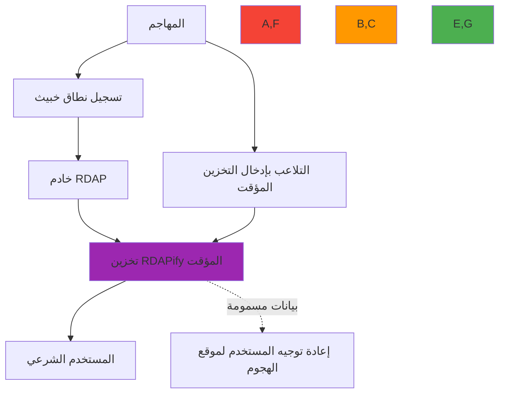

# دليل الحماية من تسميم التخزين المؤقت

**الهدف**: دليل شامل لتطبيق الحماية من تسميم التخزين المؤقت في RDAPify لمنع التلاعب بالبيانات وهجمات SSRF وانتحال السجلات في أنظمة التخزين المؤقت الموزعة
**ذات صلة**: [عزل البيانات](data-isolation.md) | [Fetcher المخصص](custom-fetcher.md) | [نظام Plugin](plugin-system.md) | [الورقة البيضاء للأمان](../security/whitepaper.md)
**وقت القراءة**: 7 دقائق

## لماذا تُهمّ الحماية من تسميم التخزين المؤقت لـ RDAP

يُمثّل تسميم التخزين المؤقت أحد أكثر التهديدات خبثاً على سلامة بيانات RDAP، حيث يتلاعب المهاجمون ببيانات التسجيل المخزنة مؤقتاً لإعادة توجيه الحركة أو تمكين التصيد الاحتيالي أو إخفاء البنية التحتية الخبيثة:



### متجهات تهديد تسميم التخزين المؤقت الحرجة
- **انتحال السجل**: استجابات خادم RDAP مزيفة مع بيانات خبيثة
- **التلاعب في وقت الصلاحية TTL**: مدة TTL ممتدة لإبقاء الإدخالات المسمومة
- **استغلال معامل الاستعلام**: استعلامات مصنوعة لتجاوز التحقق من التخزين المؤقت
- **تسميم تخزين DNS المؤقت**: DNS مخترق يؤثر على حل نقطة نهاية السجل
- **تلوث التخزين المؤقت عبر المستأجرين**: مفاتيح تخزين مشتركة تُمكّن تسرب البيانات بين المستأجرين
- **حقن التخزين المؤقت عبر SSRF**: استخدام ثغرات SSRF لتسميم إدخالات التخزين المؤقت ببيانات داخلية

## بنية أمان التخزين المؤقت

ينفّذ RDAPify نظام تحقق متعدد الطبقات للتخزين المؤقت يمنع التسميم من خلال التحقق المشفر ومصادقة السجل وحدود العزل:

```typescript
// src/cache/security.ts
export interface CacheEntry {
  data: any;
  registrySignature: string;
  timestamp: number;
  ttl: number;
  validationContext: {
    registryId: string;
    bootstrapHash: string;
    requestHash: string;
    tenantId?: string;
  };
  securityMetadata: {
    originIP: string;
    tlsFingerprint: string;
    certificateChainHash: string;
    responseSize: number;
  };
}

export class SecureCacheValidator {
  private readonly crypto = require('crypto');
  private readonly registryCertificates = new Map<string, string[]>();

  constructor(private readonly config: CacheSecurityConfig) {
    this.loadRegistryCertificates();
  }

  private loadRegistryCertificates() {
    // تحميل بصمات شهادات السجل الموثوقة
    this.registryCertificates.set('verisign', [
      'sha256/AAAAAAAAAAAAAAAAAAAAAAAAAAAAAAAAAAAAAAAAAAA=', // شهادة الإنتاج 1
      'sha256/BBBBBBBBBBBBBBBBBBBBBBBBBBBBBBBBBBBBBBBBBBB='  // شهادة الإنتاج 2
    ]);
    this.registryCertificates.set('arin', [
      'sha256/CCCCCCCCCCCCCCCCCCCCCCCCCCCCCCCCCCCCCCCCCCC=',
      'sha256/DDDDDDDDDDDDDDDDDDDDDDDDDDDDDDDDDDDDDDDDDDD='
    ]);
    // سجلات إضافية...
  }

  async validateCacheEntry(entry: CacheEntry, requestContext: RequestContext): Promise<ValidationResult> {
    // الطبقة 1: التحقق من التوقيع المشفر
    const signatureValid = await this.validateRegistrySignature(entry);
    if (!signatureValid) {
      return { valid: false, reason: 'invalid_registry_signature' };
    }

    // الطبقة 2: التحقق من TTL مع الحماية من الانجراف
    const ttlValid = this.validateTTL(entry, requestContext);
    if (!ttlValid) {
      return { valid: false, reason: 'expired_or_manipulated_ttl' };
    }

    // الطبقة 3: التحقق من عزل المستأجر
    if (requestContext.tenantId && entry.validationContext.tenantId !== requestContext.tenantId) {
      return { valid: false, reason: 'tenant_isolation_violation' };
    }

    // الطبقة 4: التحقق من سلامة البيانات
    const integrityValid = await this.validateDataIntegrity(entry, requestContext);
    if (!integrityValid) {
      return { valid: false, reason: 'data_integrity_failure' };
    }

    return { valid: true, confidence: 0.99 };
  }

  private async validateRegistrySignature(entry: CacheEntry): Promise<boolean> {
    // استخراج سلسلة شهادات السجل من جلسة TLS
    const registryCertHash = await this.getRegistryCertificateHash(entry.validationContext.registryId);

    // التحقق من أن الشهادة في القائمة الموثوقة
    const trustedCerts = this.registryCertificates.get(entry.validationContext.registryId);
    if (!trustedCerts || !trustedCerts.includes(registryCertHash)) {
      return false;
    }

    // التحقق من التوقيع باستخدام المفتاح العام للسجل
    const signature = this.crypto.createVerify('sha256');
    signature.update(JSON.stringify({
      data: entry.data,
      timestamp: entry.timestamp,
      registryId: entry.validationContext.registryId
    }));

    return signature.verify(registryCertHash, entry.registrySignature, 'base64');
  }

  private validateTTL(entry: CacheEntry, context: RequestContext): boolean {
    // التحقق من التلاعب في TTL
    const maxAllowedTTL = context.tenant?.maxCacheTTL || this.config.defaultMaxTTL;
    if (entry.ttl > maxAllowedTTL) {
      return false;
    }

    // الحماية من الانجراف الزمني (منع إدخالات التخزين المؤقت المؤرخة مستقبلاً)
    const now = Date.now();
    if (entry.timestamp > now + this.config.maxTimeDrift) {
      return false;
    }

    return true;
  }

  private async validateDataIntegrity(entry: CacheEntry, context: RequestContext): Promise<boolean> {
    // التحقق من هيكل البيانات مقابل مخطط السجل
    const schemaValid = await this.validateSchema(entry.data, entry.validationContext.registryId);
    if (!schemaValid) return false;

    // التحقق من مؤشرات SSRF في البيانات المخزنة مؤقتاً
    const ssrfCheck = this.checkForSSRFIndicators(entry.data);
    if (!ssrfCheck) return false;

    // التحقق من تجزئة الطلب
    const expectedHash = this.computeRequestHash(entry.validationContext);
    const storedHash = entry.validationContext.requestHash;

    return expectedHash === storedHash;
  }

  private checkForSSRFIndicators(data: any): boolean {
    const dataStr = JSON.stringify(data);
    const privateIPPatterns = [
      /\b10\.\d{1,3}\.\d{1,3}\.\d{1,3}\b/,
      /\b172\.(1[6-9]|2\d|3[01])\.\d{1,3}\.\d{1,3}\b/,
      /\b192\.168\.\d{1,3}\.\d{1,3}\b/,
      /\b127\.\d{1,3}\.\d{1,3}\.\d{1,3}\b/,
      /\b169\.254\.\d{1,3}\.\d{1,3}\b/
    ];

    return !privateIPPatterns.some(pattern => pattern.test(dataStr));
  }
}
```

## التهيئة الآمنة للتخزين المؤقت

```typescript
import { RDAPClient } from 'rdapify';

const client = new RDAPClient({
  cache: {
    enabled: true,
    ttl: 3600,                    // TTL ساعة واحدة
    maxSize: 10000,               // 10,000 إدخال كحد أقصى
    validateEntries: true,         // التحقق من صحة الإدخالات عند الاسترجاع
    cryptographicValidation: true, // التحقق بالتوقيع المشفر
    tenantIsolation: true,         // عزل كل مستأجر
    signatureAlgorithm: 'sha256',  // خوارزمية التحقق
    maxTimeDrift: 5000,            // انجراف زمني أقصى 5 ثوانٍ
    poisoningDetection: {
      enabled: true,
      sensitivityLevel: 'high',
      alertOnSuspicious: true
    }
  }
});
```

## اكتشاف التسميم والاستجابة

```typescript
// src/cache/poisoning-detection.ts
export class CachePoisoningDetector {
  detectPoisoning(entry: CacheEntry, baseline: CacheEntry): PoisoningResult {
    const anomalies: CacheAnomaly[] = [];

    // فحص التغيير المفاجئ في البيانات
    if (this.detectDataAnomalies(entry.data, baseline.data)) {
      anomalies.push({
        type: 'data_change_anomaly',
        severity: 'high',
        description: 'بيانات السجل تغيّرت بشكل غير متوقع'
      });
    }

    // فحص TTL غير المعتاد
    if (entry.ttl > baseline.ttl * 2) {
      anomalies.push({
        type: 'ttl_extension',
        severity: 'medium',
        description: 'TTL أكبر بكثير من القيمة المعتادة'
      });
    }

    // فحص التوقيع
    if (entry.registrySignature !== baseline.registrySignature) {
      anomalies.push({
        type: 'signature_mismatch',
        severity: 'critical',
        description: 'توقيع السجل لا يتطابق'
      });
    }

    return {
      poisoned: anomalies.some(a => a.severity === 'critical'),
      suspicious: anomalies.length > 0,
      anomalies,
      recommendation: this.generateRecommendation(anomalies)
    };
  }

  private detectDataAnomalies(current: any, baseline: any): boolean {
    // التحقق من تغييرات غير متوقعة في الحقول الحيوية
    const criticalFields = ['objectClassName', 'handle', 'status'];

    return criticalFields.some(field =>
      JSON.stringify(current[field]) !== JSON.stringify(baseline[field])
    );
  }

  private generateRecommendation(anomalies: CacheAnomaly[]): string {
    if (anomalies.some(a => a.severity === 'critical')) {
      return 'إبطال إدخال التخزين المؤقت وإعادة الاستعلام من المصدر + تنبيه الأمان';
    }
    if (anomalies.some(a => a.severity === 'high')) {
      return 'إبطال إدخال التخزين المؤقت وإعادة التحقق من بيانات السجل';
    }
    return 'مراقبة أكثر دقة لإدخالات التخزين المؤقت لهذا النطاق';
  }
}
```

## قائمة التحقق من أمان التخزين المؤقت

### الضبط الأساسي
- [ ] تفعيل التحقق المشفر من إدخالات التخزين المؤقت
- [ ] ضبط حدود TTL المناسبة (لا تتجاوز TTL السجل)
- [ ] تفعيل عزل المستأجر للنشر متعدد المستأجرين
- [ ] تهيئة تثبيت شهادات السجل المعروفة

### الاختبار
- [ ] اختبار سيناريوهات تسميم TTL
- [ ] اختبار انتهاك عزل المستأجر
- [ ] اختبار فشل التحقق من التوقيع
- [ ] اختبار رفض مؤشرات SSRF في الإدخالات المخزنة

### المراقبة
- [ ] رصد معدل إبطال التخزين المؤقت
- [ ] تتبع فشل التحقق من التوقيع
- [ ] مراجعة أنماط التخزين المؤقت الشاذة

## المراجع

- [عزل البيانات](data-isolation.md)
- [منع SSRF](../security/ssrf-prevention.md)
- [نموذج التهديدات](../security/threat-model.md)
- [الورقة البيضاء للأمان](../security/whitepaper.md)
