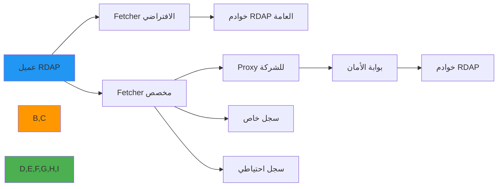

# دليل تنفيذ Fetcher المخصص

**الهدف**: دليل شامل لتطبيق fetchers مخصصة في RDAPify للتعامل مع متطلبات الشبكة المتخصصة وضبط الـ proxy وقيود الأمان مع الحفاظ على التوافق مع البروتوكول
**ذات صلة**: [نظام Plugin](plugin-system.md) | [Resolver المخصص](custom-resolver.md) | [Normalizer المخصص](custom-normalizer.md) | [Middleware](middleware.md)
**وقت القراءة**: 7 دقائق

## لماذا تُهمّ Fetchers المخصصة

يعمل الـ fetcher الافتراضي لـ RDAPify بشكل جيد في معظم حالات الاستخدام، لكن بيئات المؤسسات كثيراً ما تتطلب معالجة شبكية متخصصة:



### حالات الاستخدام الشائعة للـ Fetchers المخصصة
- **قيود الشبكة في الشركات**: التكامل مع أنظمة proxy للمؤسسة وبوابات الأمان
- **الوصول إلى السجل الخاص**: الاستعلام عن نقاط نهاية RDAP الداخلية أو الخاصة غير المتاحة عبر تمهيد IANA
- **متطلبات التوافر العالي**: تطبيق الفشل الآمن بين نقاط نهاية السجل المتعددة
- **متطلبات الامتثال**: تطبيق ضبط TLS محدد للبيئات المنظّمة
- **تحسين الأداء**: استراتيجيات تجميع الاتصالات المخصصة للسيناريوهات ذات الإنتاجية العالية
- **عزل الشبكة**: التعامل مع البيئات المعزولة هوائياً ببروتوكولات نقل بيانات متخصصة

## مواصفات واجهة Fetcher

يجب أن تنفّذ جميع الـ fetchers المخصصة واجهة `Fetcher`:

```typescript
// src/fetcher.ts
import { RegistryConfig } from '../types';

export interface FetcherRequest {
  url: string;
  method?: 'GET' | 'HEAD' | 'POST';
  headers?: Record<string, string>;
  timeout?: number;
  registry?: RegistryConfig;
  options?: any;
}

export interface FetcherResponse {
  status: number;
  statusText: string;
  headers: Headers;
  body: string | Buffer;
  url: string;
  redirected: boolean;
  ok: boolean;
}

export interface Fetcher {
  /**
   * تنفيذ طلب شبكي مع سياق خاص بـ RDAP
   * @param request - كائن طلب RDAP fetcher
   * @returns وعد يحلّ إلى استجابة fetcher
   * @throws FetchError مع معلومات خطأ مفصّلة
   */
  fetch(request: FetcherRequest): Promise<FetcherResponse>;

  /**
   * فحص الصحة للتحقق من اتصالية fetcher
   * @returns وعد يحلّ إلى حالة الصحة
   */
  healthCheck?(): Promise<boolean>;

  /**
   * تنظيف الموارد عندما لا يكون fetcher مطلوباً بعد الآن
   */
  close?(): Promise<void>;
}
```

### معالجة الأخطاء المطلوبة
يجب على الـ fetchers المخصصة رمي أخطاء موحدة تتكامل مع نظام أخطاء RDAPify:

```typescript
// src/errors.ts
export class FetchError extends Error {
  constructor(
    message: string,
    public readonly code: string,
    public readonly details?: any,
    public readonly originalError?: Error
  ) {
    super(message);
    this.name = 'FetchError';
  }

  static fromNetworkError(error: Error, url: string): FetchError {
    if (error.message.includes('ECONNREFUSED')) {
      return new FetchError('Connection refused', 'CONNECTION_REFUSED', { url }, error);
    }
    if (error.message.includes('ETIMEDOUT')) {
      return new FetchError('Request timed out', 'REQUEST_TIMEOUT', { url }, error);
    }
    if (error.message.includes('ENOTFOUND')) {
      return new FetchError('DNS lookup failed', 'DNS_FAILURE', { url }, error);
    }
    return new FetchError('Network error', 'NETWORK_ERROR', { url, message: error.message }, error);
  }

  static fromResponse(response: FetcherResponse): FetchError | null {
    if (response.status >= 400 && response.status < 500) {
      return new FetchError('Client error', 'CLIENT_ERROR', {
        url: response.url,
        status: response.status,
        statusText: response.statusText
      });
    }
    if (response.status >= 500) {
      return new FetchError('Server error', 'SERVER_ERROR', {
        url: response.url,
        status: response.status,
        statusText: response.statusText
      });
    }
    return null;
  }
}
```

## أنماط التنفيذ الحيوية الأمنية

### 1. حماية SSRF في Fetchers المخصصة
```typescript
// src/custom-fetchers/ssrf-protected-fetcher.ts
import { Fetcher, FetcherRequest, FetcherResponse } from '../fetcher';
import { FetchError } from '../errors';
import { isPrivateIP, extractHostname } from '../security/utils';

export class SSRFProtectedFetcher implements Fetcher {
  private readonly allowedDomains: Set<string>;
  private readonly proxyUrl?: string;

  constructor(options: {
    allowedDomains?: string[];
    proxyUrl?: string;
    allowPrivateIPs?: boolean;
  } = {}) {
    this.allowedDomains = new Set(options.allowedDomains || []);
    this.proxyUrl = options.proxyUrl;

    // إشارة تحذير إذا تم تعطيل SSRF
    if (options.allowPrivateIPs) {
      console.warn(
        '[SECURITY WARNING] تم تعطيل حماية SSRF. ' +
        'استخدم هذا فقط في بيئات التطوير ذات المناطق الموثوقة.'
      );
    }
  }

  async fetch(request: FetcherRequest): Promise<FetcherResponse> {
    const hostname = extractHostname(request.url);

    // التحقق من قائمة السماح إذا تم ضبطها
    if (this.allowedDomains.size > 0 && !this.allowedDomains.has(hostname)) {
      throw new FetchError(
        `Domain ${hostname} not in allowlist`,
        'SSRF_PROTECTION_BLOCKED',
        { url: request.url, hostname }
      );
    }

    // فحص IP الخاص
    if (await isPrivateIP(hostname)) {
      throw new FetchError(
        `Blocked request to private IP: ${hostname}`,
        'SSRF_PROTECTION_BLOCKED',
        { url: request.url, hostname }
      );
    }

    // تنفيذ الطلب الفعلي
    return this.executeRequest(request);
  }

  private async executeRequest(request: FetcherRequest): Promise<FetcherResponse> {
    const fetchOptions: RequestInit = {
      method: request.method || 'GET',
      headers: request.headers,
      signal: AbortSignal.timeout(request.timeout || 5000)
    };

    const targetUrl = this.proxyUrl
      ? `${this.proxyUrl}/${encodeURIComponent(request.url)}`
      : request.url;

    const response = await fetch(targetUrl, fetchOptions);

    return {
      status: response.status,
      statusText: response.statusText,
      headers: response.headers,
      body: await response.text(),
      url: response.url,
      redirected: response.redirected,
      ok: response.ok
    };
  }

  async healthCheck(): Promise<boolean> {
    try {
      const response = await this.fetch({
        url: 'https://data.iana.org/rdap/dns.json',
        timeout: 3000
      });
      return response.ok;
    } catch {
      return false;
    }
  }
}
```

### 2. Fetcher مع Proxy للشركة
```typescript
// src/custom-fetchers/corporate-proxy-fetcher.ts
export class CorporateProxyFetcher implements Fetcher {
  constructor(private proxyConfig: {
    host: string;
    port: number;
    auth?: { username: string; password: string };
    bypass?: string[];
  }) {}

  async fetch(request: FetcherRequest): Promise<FetcherResponse> {
    const hostname = extractHostname(request.url);

    // تجاوز الـ proxy للنطاقات المُعفاة
    if (this.proxyConfig.bypass?.some(b => hostname.endsWith(b))) {
      return this.directFetch(request);
    }

    // التوجيه عبر الـ proxy للشركة
    return this.proxyFetch(request);
  }

  private async proxyFetch(request: FetcherRequest): Promise<FetcherResponse> {
    const proxyUrl = `http://${this.proxyConfig.host}:${this.proxyConfig.port}`;
    const headers: Record<string, string> = {
      ...request.headers,
      'X-Forwarded-For': 'rdapify-client'
    };

    if (this.proxyConfig.auth) {
      const { username, password } = this.proxyConfig.auth;
      const credentials = Buffer.from(`${username}:${password}`).toString('base64');
      headers['Proxy-Authorization'] = `Basic ${credentials}`;
    }

    const response = await fetch(request.url, {
      method: request.method || 'GET',
      headers,
      // ضبط الـ proxy في Node.js عبر متغيرات البيئة
    });

    return {
      status: response.status,
      statusText: response.statusText,
      headers: response.headers,
      body: await response.text(),
      url: response.url,
      redirected: response.redirected,
      ok: response.ok
    };
  }

  private async directFetch(request: FetcherRequest): Promise<FetcherResponse> {
    const response = await fetch(request.url, {
      method: request.method || 'GET',
      headers: request.headers,
      signal: AbortSignal.timeout(request.timeout || 5000)
    });

    return {
      status: response.status,
      statusText: response.statusText,
      headers: response.headers,
      body: await response.text(),
      url: response.url,
      redirected: response.redirected,
      ok: response.ok
    };
  }
}
```

## التكامل مع RDAPify

```typescript
import { RDAPClient } from 'rdapify';
import { SSRFProtectedFetcher } from './custom-fetchers/ssrf-protected-fetcher';

const customFetcher = new SSRFProtectedFetcher({
  allowedDomains: [
    'rdap.verisign.com',
    'rdap.arin.net',
    'rdap.ripe.net',
    'rdap.apnic.net',
    'rdap.lacnic.net'
  ]
});

const client = new RDAPClient({
  fetcher: customFetcher
});

// استخدام عادي
const result = await client.domain('example.com');
```

## الاعتبارات الأمنية

**تحذيرات مهمة**:

1. **احتفظ دائماً بحماية SSRF**: لا تُعطّل التحقق من IP الخاص في الإنتاج
2. **استخدم HTTPS فقط**: لا تسمح باتصالات HTTP النصية الصريحة
3. **تحقق من شهادات TLS**: لا تُعطّل `rejectUnauthorized` في الإنتاج
4. **أدرّ المهل الزمنية**: دائماً اضبط مهلاً لمنع تعليق الطلبات
5. **سجّل الأحداث الأمنية**: سجّل الحظر والانتهاكات للمراجعة

```typescript
// مثال: التحقق من HTTPS قبل الطلب
if (!request.url.startsWith('https://')) {
  throw new FetchError(
    'Only HTTPS connections are allowed',
    'PROTOCOL_NOT_ALLOWED',
    { url: request.url }
  );
}
```

## الاختبار

```typescript
import { SSRFProtectedFetcher } from './ssrf-protected-fetcher';

describe('SSRFProtectedFetcher', () => {
  const fetcher = new SSRFProtectedFetcher({
    allowedDomains: ['rdap.verisign.com']
  });

  it('يحظر النطاقات غير المدرجة في قائمة السماح', async () => {
    await expect(
      fetcher.fetch({ url: 'https://malicious.example.com/rdap' })
    ).rejects.toThrow('SSRF_PROTECTION_BLOCKED');
  });

  it('يحظر عناوين IP الخاصة', async () => {
    await expect(
      fetcher.fetch({ url: 'http://192.168.1.1/rdap' })
    ).rejects.toThrow('SSRF_PROTECTION_BLOCKED');
  });

  it('يسمح بالنطاقات الموجودة في قائمة السماح', async () => {
    const response = await fetcher.fetch({
      url: 'https://rdap.verisign.com/com/v1/domain/example.com'
    });
    expect(response.ok).toBe(true);
  });
});
```

## المراجع

- [نظام Plugin](plugin-system.md)
- [Resolver المخصص](custom-resolver.md)
- [منع SSRF](../security/ssrf-prevention.md)
