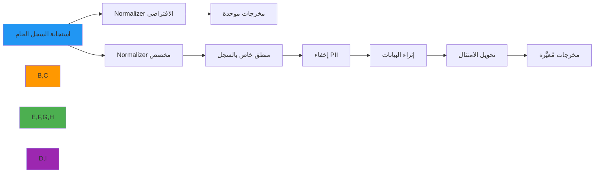

# دليل تنفيذ Normalizer المخصص

**الهدف**: دليل شامل لتطبيق normalizers مخصصة في RDAPify للتعامل مع تحويل البيانات المتخصص وإخفاء PII وتطبيع استجابات السجلات المحددة مع الحفاظ على التوافق مع البروتوكول
**ذات صلة**: [نظام Plugin](plugin-system.md) | [Fetcher المخصص](custom-fetcher.md) | [Resolver المخصص](custom-resolver.md)
**وقت القراءة**: 7 دقائق

## لماذا تُهمّ Normalizers المخصصة

يتعامل الـ normalizer الافتراضي لـ RDAPify مع هياكل استجابة RDAP القياسية، لكن تطبيقات السجلات في العالم الحقيقي كثيراً ما تتطلب منطق تحويل متخصص:



### حالات الاستخدام الشائعة للـ Normalizers المخصصة
- **تحويلات خاصة بالسجل**: التعامل مع الحقول والهياكل غير القياسية من RIRs محددة
- **إخفاء PII المحسّن**: تطبيق أنماط إخفاء مخصصة للمتطلبات القضائية (GDPR، CCPA، PDPL)
- **إثراء البيانات**: تعزيز استجابات RDAP بمصادر بيانات خارجية لاستخبارات الأعمال
- **توافق التنسيق**: تحويل البيانات المُعيَّرة إلى تنسيقات متوافقة مع WHOIS القديم لتكامل الأنظمة
- **تحويلات الامتثال**: تطبيق معالجة بيانات خاصة بالاختصاص القضائي للنشر العالمي
- **اكتشاف الشذوذ**: تحديد وتصنيف أنماط التسجيل المشبوهة أثناء التطبيع

## مواصفات واجهة Normalizer

يجب أن تنفّذ جميع الـ normalizers المخصصة واجهة `DataNormalizer`:

```typescript
// src/normalizer.ts
import { RawResponse, NormalizedData, NormalizationContext } from '../types';

export interface NormalizationResult {
  data: NormalizedData;
  metadata: {
    sourceRegistry: string;
    normalizationVersion: string;
    transformations: string[];
    piiRedacted: boolean;
    confidenceScore: number;
  };
  warnings?: string[];
}

export interface DataNormalizer {
  /**
   * تطبيع استجابة السجل الخام إلى تنسيق موحد
   * @param rawResponse - استجابة RDAP الخام من السجل
   * @param context - سياق التطبيع مع ضبط الأمان والامتثال
   * @returns وعد يحلّ إلى بيانات مُعيَّرة مع بيانات وصفية
   * @throws NormalizationError مع معلومات خطأ مفصّلة
   */
  normalize(rawResponse: RawResponse, context: NormalizationContext): Promise<NormalizationResult>;

  /**
   * التحقق من صحة البيانات المُعيَّرة مقابل متطلبات مخطط RFC 7480
   * @param data - البيانات المُعيَّرة للتحقق
   * @returns نتيجة التحقق مع حالة الامتثال
   */
  validate(data: NormalizedData): ValidationResult;

  /**
   * تطبيق سياسات إخفاء PII على البيانات المُعيَّرة
   * @param data - البيانات المُعيَّرة للإخفاء
   * @param context - سياق الأمان مع سياسات الإخفاء
   * @returns بيانات مُخفاة مع مسار تدقيق
   */
  redactPII(data: NormalizedData, context: NormalizationContext): PIIResult;

  /**
   * تنظيف الموارد عندما لا يكون normalizer مطلوباً بعد الآن
   */
  close?(): Promise<void>;
}
```

### معالجة الأخطاء المطلوبة
```typescript
// src/errors.ts
export class NormalizationError extends Error {
  constructor(
    message: string,
    public readonly code: string,
    public readonly details?: any,
    public readonly originalError?: Error
  ) {
    super(message);
    this.name = 'NormalizationError';
  }

  static fromSchemaViolation(field: string, expected: string, actual: string): NormalizationError {
    return new NormalizationError(
      `Schema validation failed for field: ${field}`,
      'SCHEMA_VIOLATION',
      { field, expected, actual }
    );
  }

  static fromPIIRedactionFailure(field: string, reason: string): NormalizationError {
    return new NormalizationError(
      `PII redaction failed for field: ${field}`,
      'PII_REDACTION_FAILURE',
      { field, reason }
    );
  }

  static fromRegistryFormat(registry: string, error: Error): NormalizationError {
    return new NormalizationError(
      `Normalization failed for ${registry} registry response`,
      'REGISTRY_FORMAT_ERROR',
      { registry, message: error.message },
      error
    );
  }
}
```

## أنماط التنفيذ الحيوية الأمنية

### 1. إخفاء PII الواعي بالسياق
```typescript
// src/custom-normalizers/privacy-aware-normalizer.ts
import { DataNormalizer, NormalizationContext, NormalizationResult } from '../normalizer';
import { NormalizationError } from '../errors';
import { detectPII, applyRedactionPolicy } from '../security/pii-detection';

export class PrivacyAwareNormalizer implements DataNormalizer {
  private readonly redactionPolicies: Record<string, RedactionPolicy>;

  constructor(options: {
    redactionPolicies?: Record<string, RedactionPolicy>;
    defaultPolicy?: RedactionPolicy;
  } = {}) {
    this.redactionPolicies = options.redactionPolicies || {
      'gdpr': {
        fields: ['email', 'tel', 'adr', 'fn'],
        patterns: [/contact/i, /personal/i],
        replacements: {
          email: '[EMAIL REDACTED]',
          tel: '[PHONE REDACTED]',
          adr: '[ADDRESS REDACTED]',
          fn: '[NAME REDACTED]'
        }
      },
      'ccpa': {
        fields: ['email', 'tel', 'adr'],
        patterns: [/contact/i],
        replacements: {
          email: '[EMAIL REDACTED]',
          tel: '[PHONE REDACTED]',
          adr: '[ADDRESS REDACTED]'
        }
      }
    };
  }

  async normalize(rawResponse: RawResponse, context: NormalizationContext): Promise<NormalizationResult> {
    try {
      // التطبيع الأساسي
      const normalized = this.normalizeStructure(rawResponse);

      // تطبيق إخفاء PII بناءً على الولاية القضائية
      const redactionResult = this.redactPII(normalized, context);

      return {
        data: redactionResult.data,
        metadata: {
          sourceRegistry: context.registry || 'unknown',
          normalizationVersion: '1.0.0',
          transformations: ['structure_normalization', 'pii_redaction'],
          piiRedacted: redactionResult.redactedFields.length > 0,
          confidenceScore: 0.95
        },
        warnings: redactionResult.warnings
      };
    } catch (error) {
      throw NormalizationError.fromRegistryFormat(
        context.registry || 'unknown',
        error
      );
    }
  }

  validate(data: NormalizedData): ValidationResult {
    const errors: string[] = [];

    // التحقق من الحقول المطلوبة
    if (!data.objectClassName) {
      errors.push('Missing required field: objectClassName');
    }

    // التحقق من عدم وجود PII غير مُخفاة
    const piiCheck = detectPII(data, { jurisdiction: 'global' });
    if (piiCheck.detectedFields.length > 0) {
      errors.push(`Unredacted PII detected: ${piiCheck.detectedFields.map(f => f.field).join(', ')}`);
    }

    return {
      valid: errors.length === 0,
      errors,
      timestamp: new Date().toISOString()
    };
  }

  redactPII(data: NormalizedData, context: NormalizationContext): PIIResult {
    const jurisdiction = context.jurisdiction || 'global';
    const policy = this.redactionPolicies[jurisdiction] ||
                   this.redactionPolicies['gdpr']; // الافتراضي لـ GDPR

    return applyRedactionPolicy(data, policy);
  }

  private normalizeStructure(raw: RawResponse): NormalizedData {
    return {
      objectClassName: raw.objectClassName || 'unknown',
      handle: raw.handle,
      status: Array.isArray(raw.status) ? raw.status : [raw.status].filter(Boolean),
      entities: (raw.entities || []).map(e => this.normalizeEntity(e)),
      events: (raw.events || []).map(e => this.normalizeEvent(e)),
      links: (raw.links || []).map(l => this.normalizeLink(l)),
      remarks: raw.remarks || [],
      // بيانات وصفية
      rdapConformance: raw.rdapConformance || []
    };
  }

  private normalizeEntity(entity: any) {
    return {
      objectClassName: 'entity',
      handle: entity.handle,
      roles: entity.roles || [],
      vcardArray: entity.vcardArray || []
    };
  }

  private normalizeEvent(event: any) {
    return {
      eventAction: event.eventAction,
      eventDate: event.eventDate
    };
  }

  private normalizeLink(link: any) {
    return {
      href: link.href,
      rel: link.rel,
      type: link.type
    };
  }
}
```

### 2. Normalizer خاص بالسجل
```typescript
// src/custom-normalizers/arin-normalizer.ts
export class ARINNormalizer implements DataNormalizer {
  async normalize(rawResponse: RawResponse, context: NormalizationContext): Promise<NormalizationResult> {
    // معالجة تنسيقات خاصة بـ ARIN
    const normalized = this.handleARINSpecificFields(rawResponse);

    return {
      data: normalized,
      metadata: {
        sourceRegistry: 'arin',
        normalizationVersion: '1.0.0',
        transformations: ['arin_specific_normalization'],
        piiRedacted: false,
        confidenceScore: 0.98
      }
    };
  }

  private handleARINSpecificFields(raw: any) {
    // ARIN يستخدم 'ref' بدلاً من 'links' في بعض الحالات
    const links = raw.links || (raw.ref ? [{ href: raw.ref, rel: 'self' }] : []);

    // ARIN قد يتضمن 'net' بدلاً من الحقول القياسية
    return {
      ...raw,
      links,
      // تطبيع حقول POC الخاصة بـ ARIN
      entities: this.normalizeARINEntities(raw.entities || raw.orgRef ? [raw.orgRef] : [])
    };
  }

  private normalizeARINEntities(entities: any[]) {
    return entities.filter(Boolean).map(e => ({
      objectClassName: 'entity',
      handle: e.handle || e['@handle'],
      roles: e.roles || ['registrant'],
      vcardArray: e.vcardArray || []
    }));
  }

  validate(data: NormalizedData): ValidationResult {
    return { valid: true, errors: [], timestamp: new Date().toISOString() };
  }

  redactPII(data: NormalizedData, context: NormalizationContext): PIIResult {
    // تفويض لمحرك إخفاء PII الافتراضي
    return applyDefaultRedaction(data, context);
  }
}
```

## التكامل مع RDAPify

```typescript
import { RDAPClient } from 'rdapify';
import { PrivacyAwareNormalizer } from './custom-normalizers/privacy-aware-normalizer';

const normalizer = new PrivacyAwareNormalizer({
  redactionPolicies: {
    'EU': {
      fields: ['email', 'tel', 'adr', 'fn', 'org'],
      patterns: [/contact/i, /personal/i, /address/i],
      replacements: {
        email: '[REDACTED FOR PRIVACY]',
        tel: '[REDACTED FOR PRIVACY]',
        adr: '[REDACTED FOR PRIVACY]',
        fn: '[REDACTED FOR PRIVACY]'
      }
    }
  }
});

const client = new RDAPClient({
  normalizer,
  privacy: {
    jurisdiction: 'EU'
  }
});

const result = await client.domain('example.com');
```

## قائمة التحقق من أمان الـ Normalizer

- [ ] تنفيذ إخفاء PII قبل إعادة البيانات
- [ ] التحقق من صحة الإدخال قبل التحويل
- [ ] رمي `NormalizationError` الموحدة عند الفشل
- [ ] التحقق من عدم تسرب PII في رسائل الخطأ
- [ ] اختبار مع استجابات السجلات الفعلية

## المراجع

- [نظام Plugin](plugin-system.md)
- [اكتشاف PII](../security/pii-detection.md)
- [Fetcher المخصص](custom-fetcher.md)
