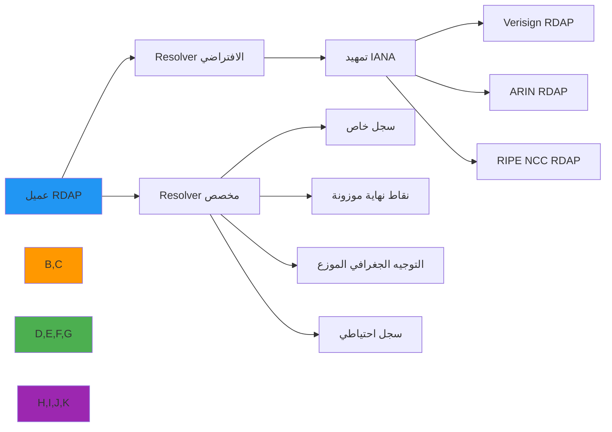

# دليل تنفيذ Resolver المخصص

**الهدف**: دليل شامل لتطبيق resolvers مخصصة في RDAPify للتعامل مع اكتشاف السجلات المتخصص وعمليات التمهيد وتوجيه السجلات المتعددة مع الحفاظ على التوافق مع البروتوكول وحدود الأمان
**ذات صلة**: [نظام Plugin](plugin-system.md) | [Fetcher المخصص](custom-fetcher.md) | [Normalizer المخصص](custom-normalizer.md)
**وقت القراءة**: 7 دقائق

## لماذا تُهمّ Resolvers المخصصة

يتعامل الـ resolver الافتراضي لـ RDAPify مع اكتشاف تمهيد IANA القياسي، لكن بيئات المؤسسات كثيراً ما تتطلب توجيهاً متخصصاً للسجلات:



### حالات الاستخدام الشائعة للـ Resolvers المخصصة
- **اكتشاف السجل الخاص**: توجيه الاستعلامات إلى نقاط نهاية RDAP الداخلية غير الموجودة في تمهيد IANA
- **التحسين الجغرافي**: توجيه الاستعلامات إلى نقاط نهاية السجل الخاصة بالمنطقة لتحقيق زمن انتقال أقل
- **موازنة الحمل**: توزيع الحركة عبر نقاط نهاية السجل المتعددة للموثوقية
- **توجيه الامتثال**: التوجيه بناءً على متطلبات إقامة البيانات (GDPR، CCPA، إلخ)
- **تكامل الأنظمة القديمة**: الجسر بين RDAP وأنظمة WHOIS القديمة مع التعيين المخصص
- **التوافر العالي**: تطبيق استراتيجيات الفشل الآمن بين نقاط نهاية السجل الأساسية والاحتياطية

## مواصفات واجهة Resolver

يجب أن تنفّذ جميع الـ resolvers المخصصة واجهة `RegistryResolver`:

```typescript
// src/resolver.ts
import { RegistryConfig, BootstrapData } from '../types';

export interface RegistryResolution {
  registry: RegistryConfig;
  source: 'bootstrap' | 'cache' | 'custom' | 'fallback';
  ttl?: number;
  metadata?: {
    confidence: number;      // 0.0-1.0 درجة الثقة في الحل
    latency: number;         // مللي ثانية للحل
    attempts: number;        // عدد محاولات الحل
    path: string[];          // مسار الحل المتخذ
  };
}

export interface RegistryResolver {
  /**
   * حل النطاق إلى ضبط السجل المناسب
   * @param query - النطاق أو IP أو ASN للحل
   * @param queryType - 'domain' أو 'ip' أو 'asn'
   * @param options - خيارات الحل
   * @returns وعد يحلّ إلى ضبط السجل
   * @throws ResolutionError مع معلومات خطأ مفصّلة
   */
  resolve(query: string, queryType: 'domain' | 'ip' | 'asn', options?: {
    cacheTTL?: number;
    timeout?: number;
    fallbackStrategy?: 'none' | 'closest-match' | 'all-registries';
    strictMode?: boolean;
  }): Promise<RegistryResolution>;

  /**
   * تحديث بيانات التمهيد من المصادر الموثوقة
   * @returns وعد يحلّ إلى بيانات تمهيد محدَّثة
   */
  refreshBootstrap?(): Promise<BootstrapData>;

  /**
   * فحص الصحة لاتصالية resolver
   * @returns وعد يحلّ إلى حالة الصحة
   */
  healthCheck?(): Promise<boolean>;

  /**
   * تنظيف الموارد عندما لا يكون resolver مطلوباً بعد الآن
   */
  close?(): Promise<void>;
}
```

### معالجة الأخطاء المطلوبة
```typescript
// src/errors.ts
export class ResolutionError extends Error {
  constructor(
    message: string,
    public readonly code: string,
    public readonly details?: any,
    public readonly originalError?: Error
  ) {
    super(message);
    this.name = 'ResolutionError';
  }

  static fromResolutionFailure(query: string, queryType: string, attempts: number): ResolutionError {
    return new ResolutionError(
      `Failed to resolve ${queryType} ${query} after ${attempts} attempts`,
      'RESOLUTION_FAILED',
      { query, queryType, attempts }
    );
  }

  static fromInvalidTLD(tld: string): ResolutionError {
    return new ResolutionError(
      `No registry found for TLD: ${tld}`,
      'INVALID_TLD',
      { tld }
    );
  }

  static fromTimeout(query: string, timeoutMs: number): ResolutionError {
    return new ResolutionError(
      `Resolution timed out for ${query} after ${timeoutMs}ms`,
      'RESOLUTION_TIMEOUT',
      { query, timeoutMs }
    );
  }
}
```

## مثال Resolver مخصص

### Resolver بخريطة ثابتة
```typescript
// src/custom-resolvers/static-map-resolver.ts
export class StaticMapResolver implements RegistryResolver {
  private readonly registryMap: Map<string, RegistryConfig>;
  private readonly fallbackResolver?: RegistryResolver;

  constructor(options: {
    registryMap: Record<string, string>; // TLD/ASN/CIDR → عنوان URL لـ RDAP
    fallbackResolver?: RegistryResolver;
  }) {
    this.registryMap = new Map(
      Object.entries(options.registryMap).map(([key, url]) => [
        key,
        { url, type: 'rdap' as const }
      ])
    );
    this.fallbackResolver = options.fallbackResolver;
  }

  async resolve(
    query: string,
    queryType: 'domain' | 'ip' | 'asn',
    options?: ResolverOptions
  ): Promise<RegistryResolution> {
    const startTime = Date.now();

    // استخراج المفتاح للبحث
    const key = this.extractKey(query, queryType);
    const registry = this.findRegistry(key);

    if (registry) {
      return {
        registry,
        source: 'custom',
        ttl: 3600,
        metadata: {
          confidence: 1.0,
          latency: Date.now() - startTime,
          attempts: 1,
          path: ['static-map']
        }
      };
    }

    // الرجوع إلى resolver الاحتياطي
    if (this.fallbackResolver) {
      const fallbackResult = await this.fallbackResolver.resolve(query, queryType, options);
      return { ...fallbackResult, source: 'fallback' };
    }

    throw ResolutionError.fromInvalidTLD(key);
  }

  private extractKey(query: string, queryType: string): string {
    switch (queryType) {
      case 'domain':
        // استخراج امتداد TLD
        const parts = query.split('.');
        return parts[parts.length - 1].toLowerCase();
      case 'ip':
        // استخراج الأوكتيت الأول لمطابقة /8
        return query.split('.')[0];
      case 'asn':
        return query.replace(/^AS/i, '');
      default:
        return query;
    }
  }

  private findRegistry(key: string): RegistryConfig | undefined {
    return this.registryMap.get(key);
  }

  async refreshBootstrap(): Promise<BootstrapData> {
    // في التطبيقات الثابتة، نُعيد الخريطة الحالية
    return {
      services: Array.from(this.registryMap.entries()).map(([key, config]) => ({
        tld: key,
        url: config.url
      }))
    };
  }

  async healthCheck(): Promise<boolean> {
    return true; // الخرائط الثابتة صحية دائماً
  }
}
```

### Resolver مع موازنة الحمل
```typescript
// src/custom-resolvers/load-balanced-resolver.ts
export class LoadBalancedResolver implements RegistryResolver {
  private readonly endpoints: Map<string, string[]>;
  private endpointCounters = new Map<string, number>();

  constructor(endpoints: Record<string, string[]>) {
    this.endpoints = new Map(Object.entries(endpoints));
  }

  async resolve(query: string, queryType: 'domain' | 'ip' | 'asn'): Promise<RegistryResolution> {
    const tld = this.extractTLD(query, queryType);
    const availableEndpoints = this.endpoints.get(tld);

    if (!availableEndpoints || availableEndpoints.length === 0) {
      throw ResolutionError.fromInvalidTLD(tld);
    }

    // Round-robin بسيط
    const counter = (this.endpointCounters.get(tld) || 0) % availableEndpoints.length;
    this.endpointCounters.set(tld, counter + 1);

    const selectedEndpoint = availableEndpoints[counter];

    return {
      registry: { url: selectedEndpoint, type: 'rdap' },
      source: 'custom',
      ttl: 300,
      metadata: {
        confidence: 0.9,
        latency: 0,
        attempts: 1,
        path: ['load-balanced', selectedEndpoint]
      }
    };
  }

  private extractTLD(query: string, queryType: string): string {
    if (queryType === 'domain') {
      const parts = query.split('.');
      return parts[parts.length - 1].toLowerCase();
    }
    return query;
  }

  validate(data: any): ValidationResult {
    return { valid: true, errors: [], timestamp: new Date().toISOString() };
  }

  redactPII(data: any, context: any): any {
    return data;
  }
}
```

## التكامل مع RDAPify

```typescript
import { RDAPClient } from 'rdapify';
import { StaticMapResolver } from './custom-resolvers/static-map-resolver';

// Resolver بخريطة ثابتة للنطاقات الداخلية
const privateResolver = new StaticMapResolver({
  registryMap: {
    'internal': 'https://rdap.internal.example.com',
    'corp': 'https://rdap.corp.example.com',
    'test': 'https://rdap.test.example.com'
  }
});

const client = new RDAPClient({
  resolver: privateResolver
});

// الاستعلام عن نطاق داخلي
const result = await client.domain('myservice.internal');
```

## اعتبارات الأمان

**تحذيرات مهمة**:

1. **تحقق من النطاقات قبل الحل**: لا تحل النطاقات قبل التحقق من الصحة الأساسية
2. **تطبيق حماية SSRF**: تأكد أن الـ resolver المخصص لا يسمح بالحل إلى عناوين IP الخاصة
3. **سجّل قرارات الحل**: احتفظ بمسار تدقيق لجميع قرارات الحل للمراجعة الأمنية
4. **اضبط مهلاً**: دائماً اضبط مهلاً للاستعلامات الخارجية
5. **احمِ بيانات التمهيد الخاصة**: لا تكشف عن أسرار التوجيه الداخلي

## الاختبار

```typescript
describe('StaticMapResolver', () => {
  const resolver = new StaticMapResolver({
    registryMap: {
      'com': 'https://rdap.verisign.com/com/v1/',
      'net': 'https://rdap.verisign.com/net/v1/'
    }
  });

  it('يحل نطاق .com بشكل صحيح', async () => {
    const result = await resolver.resolve('example.com', 'domain');
    expect(result.registry.url).toBe('https://rdap.verisign.com/com/v1/');
    expect(result.source).toBe('custom');
  });

  it('يرمي خطأ للنطاقات غير المعروفة', async () => {
    await expect(
      resolver.resolve('example.xyz', 'domain')
    ).rejects.toThrow('INVALID_TLD');
  });
});
```

## المراجع

- [نظام Plugin](plugin-system.md)
- [Fetcher المخصص](custom-fetcher.md)
- [منع SSRF](../security/ssrf-prevention.md)
- [RFC 7484 - تمهيد RDAP](https://tools.ietf.org/html/rfc7484)
