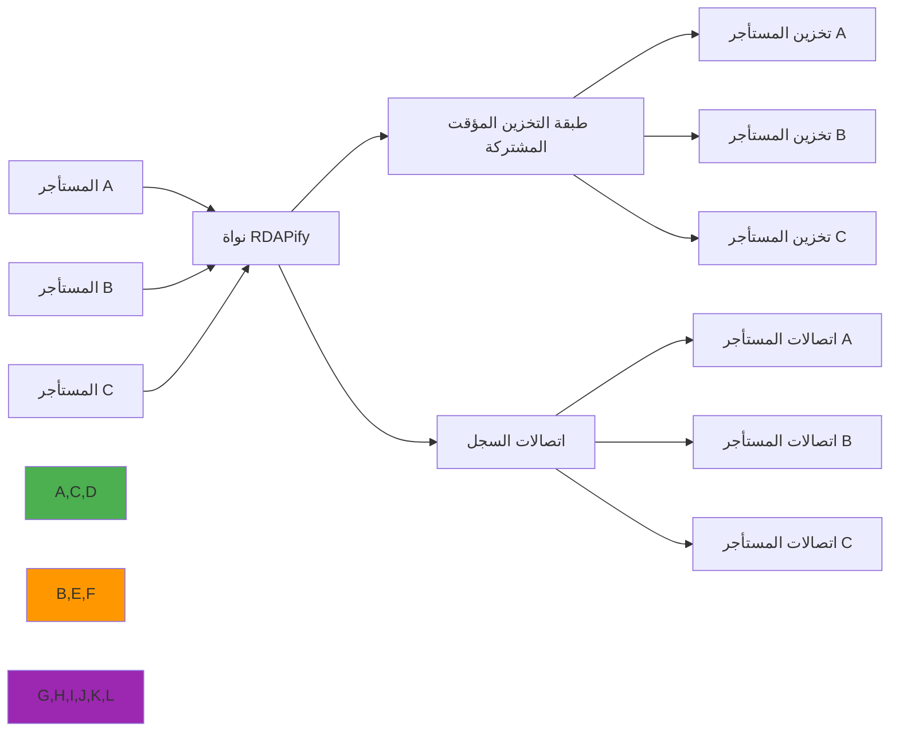

# دليل بنية عزل البيانات

**الهدف**: دليل شامل لتطبيق عزل البيانات القوي في RDAPify لضمان فصل بيانات المستأجرين والامتثال التنظيمي وحدود الأمان في عمليات النشر متعددة المستأجرين
**ذات صلة**: [نظام Plugin](plugin-system.md) | [Fetcher المخصص](custom-fetcher.md) | [Middleware](middleware.md) | [الورقة البيضاء للأمان](../security/whitepaper.md)
**وقت القراءة**: 8 دقائق

## لماذا يُهمّ عزل البيانات لتطبيقات RDAP

يعالج RDAPify بيانات تسجيل حساسة تتطلب حدود عزل صارمة في البيئات متعددة المستأجرين. عزل البيانات ليس مجرد ميزة — إنه متطلب أمني وامتثال أساسي:



### متطلبات عزل البيانات الحيوية
- **فصل المستأجرين**: لا يوجد تسرب للبيانات عبر المستأجرين تحت أي ظرف
- **الامتثال التنظيمي**: تلبية GDPR المادة 32 وCCPA القسم 1798.100 ومتطلبات حماية البيانات الأخرى
- **حدود التدقيق**: حدود تسجيل واضحة لعمليات تدقيق الامتثال والتحقيقات الجنائية
- **عزل الموارد**: منع مشاكل "الجار الصاخب" من التأثير على جودة الخدمة
- **احتواء نطاق الفشل**: التأكد من أن الأعطال الخاصة بالمستأجر لا تتسلسل إلى مستأجرين آخرين

## بنية عزل البيانات الأساسية

### 1. طبقات العزل متعدد المستأجرين
يُطبّق RDAPify عزل البيانات من خلال طبقات تكميلية متعددة:

| الطبقة | نطاق الحماية | آلية التطبيق | الأهمية |
|--------|--------------|----------------|---------|
| **سياق الطلب** | تحديد المستأجر والتحقق منه | مطالبات JWT، التحقق من مفتاح API | حرج |
| **معالجة البيانات** | إخفاء PII ومعالجة خاصة بالمستأجر | محرك تطبيع واعٍ بالسياق | حرج |
| **عزل التخزين المؤقت** | منع تسميم التخزين المؤقت والوصول عبر المستأجرين | مفاتيح تخزين مؤقت وسياسات إخلاء خاصة بالمستأجر | حرج |
| **تجميع الاتصالات** | فصل المستأجرين على مستوى الشبكة | مجمعات اتصال خاصة بالمستأجر مع فصل جلسات SSL | عالٍ |
| **حدود التخزين** | فصل البيانات الدائمة | مخططات قاعدة بيانات ومفاتيح تشفير خاصة بالمستأجر | حرج |
| **تسجيل التدقيق** | تطبيق حد الامتثال | مسارات تدقيق خاصة بالمستأجر مع الحماية من التلاعب | حرج |

### 2. نشر سياق المستأجر
```typescript
// src/isolation/tenant-context.ts
import { Session } from 'express-session';
import { IncomingMessage } from 'http';

export interface TenantContext {
  id: string;                    // معرف المستأجر الفريد
  name: string;                  // اسم المستأجر المقروء للإنسان
  dataResidency: string[];       // المناطق الجغرافية المسموح بها لتخزين البيانات
  complianceProfile: {
    gdpr: boolean;               // امتثال GDPR مُفعّل
    ccpa: boolean;               // امتثال CCPA مُفعّل
    pdpl: boolean;               // امتثال PDPL السعودي
  };
  securityProfile: {
    allowPrivateIPs: boolean;    // إعدادات حماية SSRF
    redactPII: boolean;          // مستوى إخفاء PII
    maxConcurrentRequests: number; // ضبط تحديد المعدل
  };
  isolationLevel: 'strict' | 'standard' | 'development'; // حدود العزل
  encryptionKey?: string;        // مفتاح تشفير خاص بالمستأجر (مُدوَّر)
  auditTrail: boolean;           // متطلبات تسجيل التدقيق
}

export class TenantContextManager {
  private static instance: TenantContextManager;
  private contextStore = new WeakMap<IncomingMessage | Session, TenantContext>();

  // نمط singleton
  public static getInstance(): TenantContextManager {
    if (!TenantContextManager.instance) {
      TenantContextManager.instance = new TenantContextManager();
    }
    return TenantContextManager.instance;
  }

  // استخراج سياق المستأجر من طلب HTTP
  public extractFromRequest(req: IncomingMessage): TenantContext {
    // الاستخراج من رمز JWT
    const token = this.extractToken(req);
    if (token) {
      return this.validateToken(token);
    }

    // الاستخراج من مفتاح API
    const apiKey = this.extractAPIKey(req);
    if (apiKey) {
      return this.validateAPIKey(apiKey);
    }

    // الرجوع إلى المستأجر الافتراضي (للتطوير فقط)
    if (process.env.NODE_ENV === 'development') {
      return this.getDefaultTenant();
    }

    throw new Error('Tenant context required but not provided');
  }

  // تطبيق حدود العزل
  public enforceIsolation(context: TenantContext, data: any, registry: string): any {
    // تطبيق إخفاء PII الخاص بالمستأجر
    if (context.securityProfile.redactPII) {
      data = this.applyPIIRedaction(data, context);
    }

    // تطبيق متطلبات إقامة البيانات
    if (context.dataResidency.length > 0) {
      data = this.enforceDataResidency(data, context.dataResidency, registry);
    }

    // تطبيق سياسات الأمان الخاصة بالمستأجر
    data = this.applySecurityPolicies(data, context);

    return data;
  }

  private applyPIIRedaction(data: any, context: TenantContext): any {
    // إخفاء PII واعٍ بالسياق بناءً على ملف امتثال المستأجر
    const redactionPolicy = {
      gdpr: context.complianceProfile.gdpr,
      ccpa: context.complianceProfile.ccpa,
      fields: context.securityProfile.redactPII ?
        ['email', 'tel', 'adr', 'fn', 'org'] : [],
      patterns: context.securityProfile.redactPII ?
        [/contact/i, /personal/i, /address/i] : []
    };

    return redactPII(data, redactionPolicy);
  }

  private enforceDataResidency(data: any, allowedRegions: string[], registry: string): any {
    // تعيين السجل إلى المنطقة
    const registryRegions: Record<string, string> = {
      'verisign': 'north-america',
      'arin': 'north-america',
      'ripe': 'europe',
      'apnic': 'asia-pacific',
      'lacnic': 'latin-america'
    };

    const registryRegion = registryRegions[registry.toLowerCase()] || 'global';

    if (!allowedRegions.includes(registryRegion) && !allowedRegions.includes('global')) {
      throw new DataResidencyError(
        `Registry ${registry} is in region ${registryRegion} which is not allowed for this tenant`,
        { allowedRegions, registryRegion }
      );
    }

    return data;
  }
}
```

## عزل التخزين المؤقت

```typescript
// src/cache/tenant-isolation.ts
export class TenantIsolatedCache {
  private readonly cache: Map<string, CacheEntry> = new Map();

  // توليد مفتاح تخزين مؤقت معزول للمستأجر
  private generateKey(tenantId: string, query: string, queryType: string): string {
    // تضمين معرف المستأجر في مفتاح التخزين المؤقت
    // يمنع هذا الوصول عبر المستأجرين
    const hmac = createHmac('sha256', tenantId);
    hmac.update(`${queryType}:${query}`);
    return `tenant:${tenantId}:${hmac.digest('hex')}`;
  }

  async get(tenantContext: TenantContext, query: string, queryType: string): Promise<any | null> {
    const key = this.generateKey(tenantContext.id, query, queryType);
    const entry = this.cache.get(key);

    if (!entry) return null;

    // التحقق من انتهاء صلاحية التخزين المؤقت
    if (Date.now() > entry.expiresAt) {
      this.cache.delete(key);
      return null;
    }

    // التحقق من عدم تجاوز حدود الامتثال
    if (entry.tenantId !== tenantContext.id) {
      // لا يجب أن يحدث هذا أبداً، لكن ندقق للأمان الإضافي
      throw new IsolationViolationError(
        `Cache entry belongs to different tenant: ${entry.tenantId}`
      );
    }

    return entry.data;
  }

  async set(
    tenantContext: TenantContext,
    query: string,
    queryType: string,
    data: any,
    ttl: number
  ): Promise<void> {
    const key = this.generateKey(tenantContext.id, query, queryType);

    this.cache.set(key, {
      data,
      tenantId: tenantContext.id,
      createdAt: Date.now(),
      expiresAt: Date.now() + (ttl * 1000),
      complianceProfile: tenantContext.complianceProfile
    });
  }

  // إخلاء التخزين المؤقت لمستأجر معين
  async evictTenant(tenantId: string): Promise<number> {
    let count = 0;
    const prefix = `tenant:${tenantId}:`;

    for (const key of this.cache.keys()) {
      if (key.startsWith(prefix)) {
        this.cache.delete(key);
        count++;
      }
    }

    return count;
  }
}
```

## التكامل متعدد المستأجرين

```typescript
import { RDAPClient } from 'rdapify';
import { TenantContextManager } from './isolation/tenant-context';
import { TenantIsolatedCache } from './cache/tenant-isolation';

// تهيئة مدير سياق المستأجر
const contextManager = TenantContextManager.getInstance();
const isolatedCache = new TenantIsolatedCache();

// Express middleware لتضمين سياق المستأجر
app.use((req, res, next) => {
  try {
    const tenantContext = contextManager.extractFromRequest(req);
    req.tenantContext = tenantContext;
    next();
  } catch (error) {
    res.status(401).json({ error: 'Unauthorized: tenant context required' });
  }
});

// نقطة نهاية API
app.get('/rdap/domain/:domain', async (req, res) => {
  const { tenantContext } = req;
  const { domain } = req.params;

  const client = new RDAPClient({
    cache: {
      adapter: {
        get: (key) => isolatedCache.get(tenantContext, domain, 'domain'),
        set: (key, value, ttl) => isolatedCache.set(tenantContext, domain, 'domain', value, ttl)
      }
    },
    privacy: {
      jurisdiction: tenantContext.complianceProfile.gdpr ? 'EU' : 'global',
      redactEmails: tenantContext.securityProfile.redactPII
    }
  });

  const result = await client.domain(domain);

  // تطبيق عزل المستأجر على الاستجابة
  const isolatedResult = contextManager.enforceIsolation(tenantContext, result, 'domain');

  res.json(isolatedResult);
});
```

## اختبار عزل المستأجرين

```typescript
describe('عزل المستأجرين', () => {
  it('يمنع وصول مستأجر A إلى بيانات مستأجر B', async () => {
    const tenantA = { id: 'tenant-a', /* ... */ };
    const tenantB = { id: 'tenant-b', /* ... */ };
    const cache = new TenantIsolatedCache();

    // مستأجر A يخزن البيانات
    await cache.set(tenantA, 'example.com', 'domain', { domain: 'example.com' }, 3600);

    // مستأجر B يحاول الوصول - يجب الحصول على null
    const result = await cache.get(tenantB, 'example.com', 'domain');
    expect(result).toBeNull();
  });

  it('يطبّق سياسة GDPR للمستأجر الأوروبي', async () => {
    const euTenant = {
      id: 'eu-tenant',
      complianceProfile: { gdpr: true, ccpa: false, pdpl: false },
      securityProfile: { redactPII: true }
    };

    const manager = TenantContextManager.getInstance();
    const sensitiveData = {
      fn: 'John Doe',
      email: 'john@example.com'
    };

    const result = manager.enforceIsolation(euTenant, sensitiveData, 'verisign');

    expect(result.fn).not.toBe('John Doe');
    expect(result.email).not.toBe('john@example.com');
  });
});
```

## قائمة التحقق من عزل البيانات

### التهيئة
- [ ] تفعيل عزل التخزين المؤقت للمستأجرين
- [ ] ضبط HMAC لتوليد مفاتيح التخزين المؤقت المعزولة
- [ ] تطبيق مصادقة المستأجر في جميع نقاط الدخول
- [ ] تهيئة سياسات امتثال خاصة بالمستأجر

### الاختبار
- [ ] اختبار منع الوصول عبر المستأجرين
- [ ] التحقق من عزل التخزين المؤقت
- [ ] اختبار تطبيق سياسات الامتثال
- [ ] اختبار تطبيق متطلبات إقامة البيانات

### المراقبة
- [ ] رصد محاولات الوصول عبر المستأجرين
- [ ] تتبع استخدام الموارد لكل مستأجر
- [ ] مراجعة سجلات التدقيق بانتظام بحثاً عن انتهاكات العزل

## المراجع

- [الحماية من تسميم التخزين المؤقت](cache-poisoning-protection.md)
- [نموذج الأمان](../security/security-model.md)
- [إطار الامتثال](../security/compliance.md)
- [GDPR المادة 32](https://gdpr-info.eu/art-32-gdpr/)
