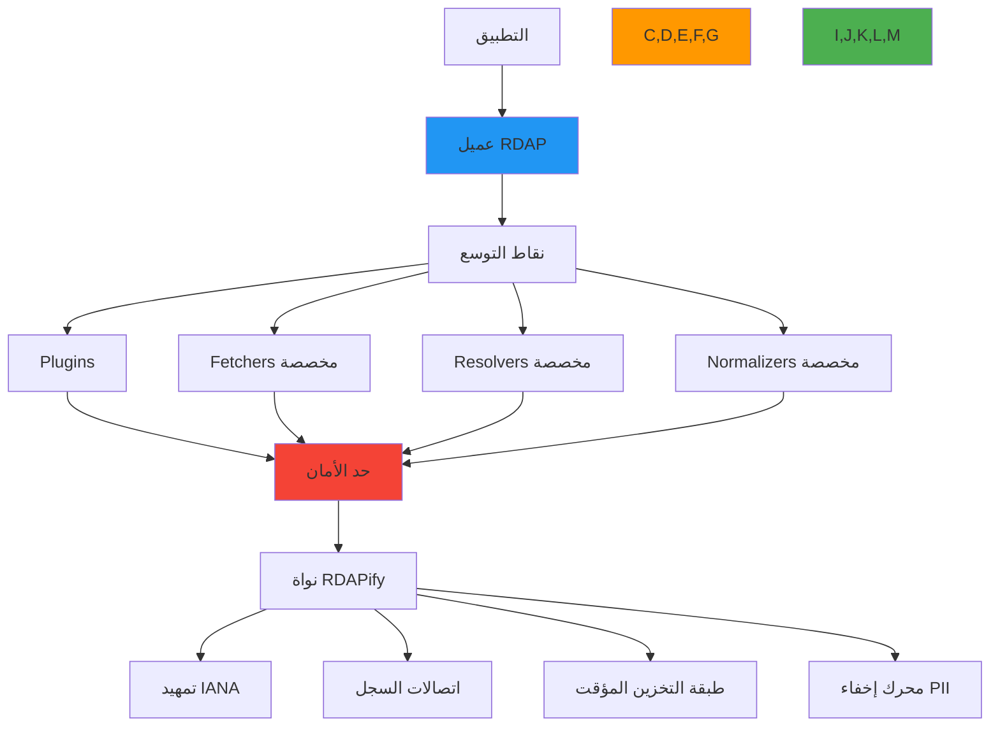

# توسيع بنية RDAPify

**الهدف**: دليل شامل لتوسيع الوظائف الأساسية لـ RDAPify من خلال plugins والمحوّلات والتطبيقات المخصصة مع الحفاظ على حدود الأمان وخصائص الأداء
**ذات صلة**: [نظام Plugin](plugin-system.md) | [Fetcher المخصص](custom-fetcher.md) | [Resolver المخصص](custom-resolver.md) | [Normalizer المخصص](custom-normalizer.md)
**وقت القراءة**: 7 دقائق

## نظرة عامة على بنية التوسع

توفر بنية التوسع في RDAPify نقاط تكامل متعددة مصممة لاحتياجات تخصيص مختلفة مع الحفاظ على حدود أمان صارمة:



### فلسفة التوسع
- **الأمان بشكل افتراضي**: تعمل جميع الامتدادات ضمن حدود sandbox صارمة
- **التحسين التدريجي**: تعمل الوظائف الأساسية بدون امتدادات
- **استقرار الواجهة**: تحافظ واجهات برمجة التطبيقات للامتداد على ضمانات الإصدار الدلالي
- **الحفاظ على الامتثال**: لا يمكن للامتدادات تجاوز ضوابط الخصوصية والأمان
- **حدود الأداء**: حدود الموارد تمنع الامتدادات من تدهور الوظائف الأساسية
- **قابلية الاختبار**: يجب أن تجتاز جميع الامتدادات التحقق الأمني والامتثال

## أنواع الامتداد وحالات الاستخدام

### 1. امتدادات Plugin
```typescript
// src/extensions/plugins.ts
interface PluginExtension {
  /**
   * تهيئة plugin مع الوصول إلى الخدمات الأساسية
   * @param context - سياق Plugin مع حدود الأمان
   */
  init(context: PluginContext): Promise<void>;

  /**
   * معالجة الطلب قبل المعالجة الأساسية
   * @param request - كائن طلب RDAP
   * @param context - سياق Plugin
   * @returns الطلب المعدَّل أو undefined للاستمرار
   */
  onRequest?(request: RDAPRequest, context: PluginContext): Promise<RDAPRequest | void>;

  /**
   * معالجة الاستجابة بعد المعالجة الأساسية
   * @param response - كائن استجابة RDAP
   * @param context - سياق Plugin
   * @returns الاستجابة المعدَّلة أو undefined للاستمرار
   */
  onResponse?(response: RDAPResponse, context: PluginContext): Promise<RDAPResponse | void>;

  /**
   * معالجة الأخطاء أثناء المعالجة
   * @param error - كائن الخطأ
   * @param context - سياق Plugin
   */
  onError?(error: Error, context: PluginContext): Promise<void>;

  /**
   * تنظيف الموارد عند الإيقاف
   */
  shutdown?(): Promise<void>;
}

// مثال على امتداد Plugin
class ThreatIntelligencePlugin implements PluginExtension {
  private threatService: ThreatService;

  async init(context: PluginContext) {
    this.threatService = context.getService('threatIntelligence');

    // تسجيل سياسة الأمان
    context.registerSecurityPolicy({
      requires: ['network_access', 'threat_data_access'],
      isolationLevel: 'moderate'
    });
  }

  async onResponse(response: RDAPResponse, context: PluginContext): Promise<RDAPResponse | void> {
    try {
      // المعالجة فقط إذا كانت استخبارات التهديدات مُفعَّلة لهذا السياق
      if (!context.getConfig('threatIntelligence.enabled', false)) {
        return;
      }

      // الحصول على درجة تهديد النطاق
      const threatScore = await this.threatService.getScore(response.domain);

      // إضافة استخبارات التهديدات دون الكشف عن البيانات الخام
      return {
        ...response,
        threatAssessment: {
          riskScore: Math.min(100, threatScore.score * 100),
          categories: threatScore.categories,
          lastUpdated: new Date().toISOString()
        }
      };
    } catch (error) {
      // لا تُفشل المعالجة الأساسية أبداً بسبب أخطاء Plugin
      context.log('warn', `Threat intelligence failed: ${error.message}`);
      return response;
    }
  }
}
```

### 2. محوّلات التخزين المؤقت المخصصة
```typescript
// src/extensions/cache-adapters.ts
interface CacheAdapter {
  get(key: string): Promise<CacheEntry | null>;
  set(key: string, value: CacheEntry, ttl: number): Promise<void>;
  delete(key: string): Promise<void>;
  clear(): Promise<void>;
  has(key: string): Promise<boolean>;
}

// مثال: محوّل Redis للتخزين المؤقت الموزع
class RedisCache implements CacheAdapter {
  constructor(private redis: RedisClient) {}

  async get(key: string): Promise<CacheEntry | null> {
    const data = await this.redis.get(key);
    return data ? JSON.parse(data) : null;
  }

  async set(key: string, value: CacheEntry, ttl: number): Promise<void> {
    await this.redis.setex(key, ttl, JSON.stringify(value));
  }

  async delete(key: string): Promise<void> {
    await this.redis.del(key);
  }

  async clear(): Promise<void> {
    await this.redis.flushdb();
  }

  async has(key: string): Promise<boolean> {
    return (await this.redis.exists(key)) === 1;
  }
}
```

## تركيب الامتدادات

```typescript
import { RDAPClient } from 'rdapify';
import { StaticMapResolver } from './resolvers/static-map-resolver';
import { PrivacyAwareNormalizer } from './normalizers/privacy-aware-normalizer';
import { SSRFProtectedFetcher } from './fetchers/ssrf-protected-fetcher';
import { ThreatIntelligencePlugin } from './plugins/threat-intelligence';
import { RedisCache } from './cache/redis-cache';

const client = new RDAPClient({
  // Resolver مخصص
  resolver: new StaticMapResolver({
    registryMap: {
      'internal': 'https://rdap.internal.company.com'
    }
  }),

  // Normalizer مخصص
  normalizer: new PrivacyAwareNormalizer({
    redactionPolicies: { 'EU': gdprPolicy }
  }),

  // Fetcher مخصص
  fetcher: new SSRFProtectedFetcher({
    allowedDomains: ['rdap.verisign.com', 'rdap.arin.net']
  }),

  // Plugins
  plugins: [new ThreatIntelligencePlugin()],

  // تخزين مؤقت مخصص
  cache: new RedisCache(redisClient),

  // ضبط الأمان
  privacy: { jurisdiction: 'EU' },
  audit: { enabled: true }
});
```

## ضمانات عقد الامتداد

### ما يمكن للامتدادات فعله
- تعديل الطلبات قبل المعالجة
- تعزيز الاستجابات ببيانات إضافية
- تنفيذ منطق تخزين مؤقت مخصص
- إضافة تسجيل مخصص ومقاييس
- تطبيق منطق عمل مخصص

### ما لا يمكن للامتدادات فعله
- تجاوز حماية SSRF
- تعطيل إخفاء PII
- الوصول إلى بيانات الـ plugins الأخرى
- تجاوز حدود الموارد
- تعديل ضبط الأمان الأساسي

## إرشادات الأداء

```typescript
// وصف Plugin جيد مع تعريف موارد
const optimizedPlugin: PluginExtension = {
  metadata: {
    // ...
    securityProfile: 'moderate',
    resourceLimits: {
      maxMemoryMB: 64,
      maxExecutionMs: 1000,
      maxNetworkKBps: 256
    }
  },

  async onResponse(response: RDAPResponse, context: PluginContext) {
    // استخدام تجميع للعمليات المكلفة
    const cachedResult = await context.cache.get(`threat:${response.domain}`);
    if (cachedResult) return { ...response, ...cachedResult };

    // تنفيذ العملية المكلفة مرة واحدة فقط
    const enrichment = await this.expensiveOperation(response.domain);
    await context.cache.set(`threat:${response.domain}`, enrichment, 3600);

    return { ...response, ...enrichment };
  }
};
```

## اختبار الامتدادات

```typescript
import { createTestClient, mockRegistry } from 'rdapify/testing';

describe('ThreatIntelligencePlugin', () => {
  it('يُضيف تقييم التهديد للاستجابات', async () => {
    const mockThreatService = {
      getScore: jest.fn().mockResolvedValue({ score: 0.8, categories: ['malware'] })
    };

    const client = createTestClient({
      plugins: [new ThreatIntelligencePlugin(mockThreatService)]
    });

    mockRegistry('example.com', { domain: 'example.com', status: ['active'] });

    const result = await client.domain('example.com');
    expect(result.threatAssessment).toBeDefined();
    expect(result.threatAssessment.riskScore).toBe(80);
  });

  it('لا يُفشل الاستعلام عند فشل الـ plugin', async () => {
    const mockThreatService = {
      getScore: jest.fn().mockRejectedValue(new Error('Service unavailable'))
    };

    const client = createTestClient({
      plugins: [new ThreatIntelligencePlugin(mockThreatService)]
    });

    mockRegistry('example.com', { domain: 'example.com', status: ['active'] });

    // يجب أن ينجح الاستعلام حتى لو فشل الـ plugin
    const result = await client.domain('example.com');
    expect(result.domain).toBe('example.com');
  });
});
```

## المراجع

- [نظام Plugin](plugin-system.md)
- [Fetcher المخصص](custom-fetcher.md)
- [Resolver المخصص](custom-resolver.md)
- [Normalizer المخصص](custom-normalizer.md)
- [Middleware](middleware.md)
