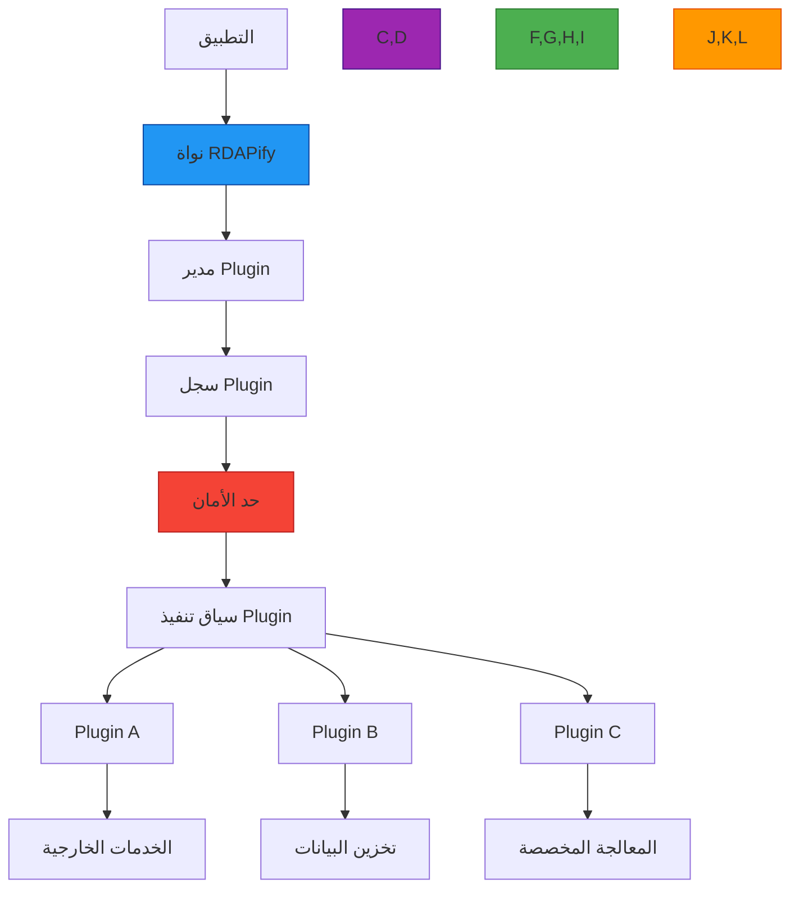

# بنية نظام Plugin

**الهدف**: دليل شامل لنظام plugin في RDAPify لتوسيع الوظائف الأساسية مع الحفاظ على حدود الأمان ومتطلبات الامتثال
**ذات صلة**: [توسيع RDAPify](extending.md) | [Middleware](middleware.md) | [الورقة البيضاء للأمان](../security/whitepaper.md)
**وقت القراءة**: 8 دقائق

## النظرة العامة المعمارية

يتبع نظام plugin في RDAPify بنية أمنية متعددة الطبقات تعزل تنفيذ الـ plugin من الوظائف الأساسية مع توفير نقاط توسع غنية:



### مبادئ Plugin الأساسية
- **الأمان أولاً**: تنفيذ جميع الـ plugins ضمن حدود sandbox صارمة
- **Zero Trust**: يتطلب التواصل بين الـ plugins ترخيصاً صريحاً
- **الدفاع المتعمق**: طبقات أمان متعددة تمنع تصعيد الـ plugin
- **الامتثال بالتصميم**: لا يمكن للـ plugins تجاوز إخفاء PII أو ضوابط الامتثال الأخرى
- **حدود الأداء**: حدود الموارد تمنع الـ plugins من تدهور الوظائف الأساسية

## بنية نظام Plugin

### 1. المكونات الأساسية
```typescript
// src/plugin-system/index.ts
interface PluginMetadata {
  id: string;           // معرف Plugin الفريد
  version: string;      // إصدار SemVer
  name: string;         // الاسم المقروء للإنسان
  description: string;  // وصف موجز
  author: string;       // معلومات المؤلف
  license: string;      // معلومات الترخيص
  requiredPermissions: string[]; // صلاحيات الأمان المطلوبة
  compatibility: {
    coreVersion: string;
    nodeVersion: string;
  };
  securityProfile: 'strict' | 'moderate' | 'development';
}

interface PluginContext {
  // سياق معزول لتنفيذ Plugin
  config: Record<string, any>;
  logger: Logger;       // مُسجِّل في sandbox
  services: {           // وصول محدود للخدمات
    cache: CacheService;
    metrics: MetricsService;
    security: SecurityService;
  };
  storage: PluginStorage; // تخزين معزول
  network: NetworkController; // وصول شبكي مُتحكَّم به
}

interface PluginLifecycle {
  onRegister?: (context: PluginContext) => Promise<void>;
  onInitialize?: (context: PluginContext) => Promise<void>;
  beforeRequest?: (context: PluginContext, request: any) => Promise<any>;
  afterRequest?: (context: PluginContext, response: any) => Promise<any>;
  onError?: (context: PluginContext, error: Error) => Promise<void>;
  onShutdown?: (context: PluginContext) => Promise<void>;
}
```

### 2. تنفيذ حد الأمان
```typescript
// src/plugin-system/sandbox.ts
export class PluginSandbox {
  private isolate: Isolate;
  private securityPolicy: SecurityPolicy;
  private resourceLimiter: ResourceLimiter;

  constructor(plugin: PluginMetadata, context: PluginContext) {
    // إنشاء سياق V8 معزول
    this.isolate = new Isolate({
      memoryLimit: 128, // حد ذاكرة 128 ميغابايت
      timeLimit: 5000,  // حد تنفيذ 5 ثوانٍ
      snapshot: this.createSecuritySnapshot()
    });

    // تطبيق سياسة الأمان بناءً على بيانات وصف Plugin
    this.securityPolicy = new SecurityPolicy({
      allowNetwork: plugin.requiredPermissions.includes('network'),
      allowFilesystem: plugin.requiredPermissions.includes('filesystem'),
      allowChildProcesses: false,
      allowEval: false,
      allowExternalModules: plugin.requiredPermissions.includes('modules')
    });

    // حدود الموارد بناءً على ملف الأمان
    this.resourceLimiter = new ResourceLimiter({
      cpuQuota: plugin.securityProfile === 'strict' ? 10 : 25,
      memoryQuota: plugin.securityProfile === 'strict' ? 64 : 128,
      networkQuota: plugin.securityProfile === 'strict' ? 128 : 512 // كيلوبايت/ثانية
    });
  }

  async execute(lifecycleHook: string, payload: any): Promise<any> {
    // تطبيق سياسة الأمان قبل التنفيذ
    this.securityPolicy.validate(lifecycleHook, payload);

    // التحقق من حدود الموارد
    this.resourceLimiter.validate();

    try {
      // التنفيذ في سياق معزول
      return await this.isolate.run(lifecycleHook, payload);
    } catch (error) {
      // معالجة انتهاكات الأمان
      if (error instanceof SecurityViolationError) {
        this.handleSecurityViolation(error);
        throw new Error(`Plugin security violation: ${error.message}`);
      }

      // معالجة حدود الموارد
      if (error instanceof ResourceLimitError) {
        this.handleResourceViolation(error);
        throw new Error(`Plugin resource limit exceeded: ${error.message}`);
      }

      throw error;
    }
  }
}
```

## إنشاء Plugin

### Plugin بسيط
```typescript
import { Plugin, PluginContext } from 'rdapify';

const myPlugin: Plugin = {
  metadata: {
    id: 'my-custom-plugin',
    version: '1.0.0',
    name: 'My Custom Plugin',
    description: 'Plugin مخصص للتسجيل',
    author: 'فريقي',
    license: 'MIT',
    requiredPermissions: [],
    compatibility: {
      coreVersion: '>=0.2.0',
      nodeVersion: '>=20'
    },
    securityProfile: 'strict'
  },

  async onInitialize(context: PluginContext) {
    context.logger.info('تهيئة Plugin');
  },

  async afterRequest(context: PluginContext, response: any) {
    context.logger.info(`تم استلام استجابة لـ: ${response.domain}`);
    return response; // يجب إعادة الاستجابة
  },

  async onError(context: PluginContext, error: Error) {
    context.logger.error(`خطأ في Plugin: ${error.message}`);
  }
};
```

### تسجيل Plugin
```typescript
import { RDAPClient } from 'rdapify';

const client = new RDAPClient({
  plugins: [myPlugin]
});

// أو ديناميكياً
client.registerPlugin(myPlugin);
```

## الصلاحيات الأمنية

| الصلاحية | الوصف | مستوى الخطر |
|---------|-------|------------|
| `network` | الوصول إلى الشبكة الخارجية | عالٍ |
| `filesystem` | قراءة/كتابة الملفات | عالٍ |
| `modules` | تحميل وحدات خارجية | متوسط |
| `metrics` | الوصول إلى مقاييس النظام | منخفض |
| `cache` | قراءة/كتابة التخزين المؤقت | منخفض |

## دورة حياة Plugin

```
تسجيل → تهيئة → [beforeRequest → معالجة → afterRequest] → إيقاف التشغيل
            ↓                                    ↓
         onError ←←←←←←←←←←←←←←←←←←←←← onError
```

1. **onRegister**: يُستدعى عند تسجيل Plugin لأول مرة
2. **onInitialize**: يُستدعى عند تهيئة Plugin مع بدء العميل
3. **beforeRequest**: يُستدعى قبل كل طلب RDAP
4. **afterRequest**: يُستدعى بعد كل استجابة ناجحة
5. **onError**: يُستدعى عند حدوث خطأ في المعالجة
6. **onShutdown**: يُستدعى عند إيقاف تشغيل العميل

## معالجة الأخطاء

```typescript
const robustPlugin: Plugin = {
  metadata: { /* ... */ },

  async afterRequest(context: PluginContext, response: any) {
    try {
      // منطق Plugin
      const enriched = await enrichData(response);
      return enriched;
    } catch (error) {
      // سجّل الخطأ لكن أعد الاستجابة الأصلية
      context.logger.warn(`فشل إثراء Plugin: ${error.message}`);
      return response; // الرجوع الرشيق إلى الاستجابة الأصلية
    }
  }
};
```

## اعتبارات الأداء

- يجب أن تنتهي الـ plugins خلال 5 ثوانٍ (قابل للضبط)
- حد الذاكرة: 128 ميغابايت لكل plugin
- حدود الشبكة: 512 كيلوبايت/ثانية للملفات المعتدلة
- لا تقم بعمليات مكلفة متزامنة في الخطافات

## المراجع

- [توسيع RDAPify](extending.md)
- [Middleware](middleware.md)
- [الورقة البيضاء للأمان](../security/whitepaper.md)
