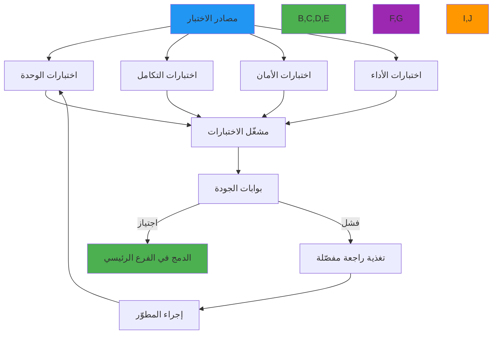

# إطار الاختبار والمنهجية

**الهدف**: دليل شامل لإطار الاختبار في RDAPify يغطي اختبارات الوحدة والتكامل والتحققات الأمنية ومعايير الأداء لضمان التوافق مع البروتوكول والموثوقية
**ذات صلة**: [نظام Plugin](plugin-system.md) | [Fetcher المخصص](custom-fetcher.md) | [Resolver المخصص](custom-resolver.md)
**وقت القراءة**: 7 دقائق

## فلسفة وبنية الاختبار

ينفّذ RDAPify استراتيجية اختبار متعددة الطبقات تتحقق من الوظائف والأمان والأداء والامتثال عبر جميع البيئات:



### مبادئ الاختبار الأساسية
- **أمان باختبار محرَّك**: التحقق من الخصائص الأمنية قبل الوظائف
- **التحقق من RFC أولاً**: كل ميزة مُتحقَّق منها مقابل مواصفات سلسلة RFC 7480
- **بيانات العالم الحقيقي**: متجهات الاختبار مستمدة من استجابات السجلات الفعلية (مُعيَّرة الهوية)
- **صفر إيجابيات كاذبة**: يجب أن تكون جميع الاختبارات حتمية بدون تقلّب
- **الأداء كمتطلب**: المعايير هي معايير قبول وليست تفكيراً لاحقاً
- **تغطية الامتثال**: متطلبات GDPR/CCPA مُتحقَّق منها من خلال تغطية الاختبار

## بنية إطار الاختبار

### 1. تنظيم طبقة الاختبار
```typescript
// test/structure.ts
export interface TestLayer {
  unitTests: {
    core: string[];
    security: string[];
    performance: string[];
  };
  integrationTests: {
    registries: {
      verisign: string[];
      arin: string[];
      ripe: string[];
      apnic: string[];
      lacnic: string[];
    };
    network: string[];
    caching: string[];
  };
  securityTests: {
    ssrf: string[];
    piiRedaction: string[];
    certificateValidation: string[];
    rateLimiting: string[];
  };
  performanceTests: {
    benchmarks: string[];
    loadTests: string[];
    stressTests: string[];
  };
  complianceTests: {
    gdpr: string[];
    ccpa: string[];
    dataRetention: string[];
  };
}
```

### 2. ضبط مشغّل الاختبارات
```typescript
// vitest.config.ts
import { defineConfig } from 'vitest/config';
import { coverageConfig } from './coverage.config';

export default defineConfig({
  test: {
    globals: true,
    environment: 'node',
    setupFiles: ['./test/setup.ts'],
    include: ['test/**/*.{test,spec}.{js,mjs,cjs,ts,mts,cts,jsx,tsx}'],
    exclude: ['**/node_modules/**', '**/dist/**', '**/.{idea,git,cache,output,temp}/**'],
    coverage: coverageConfig,
    pool: 'threads',
    poolOptions: {
      threads: {
        maxThreads: Math.max(1, (require('os').cpus().length / 2) | 0),
        minThreads: 1,
        isolate: true
      }
    },
    testTimeout: 10000, // 10 ثوانٍ
    hookTimeout: 5000, // 5 ثوانٍ
    reporters: ['default', 'json', 'junit'],
    outputFile: {
      json: './test-results/coverage/coverage-final.json',
      junit: './test-results/test-results.xml'
    },
    // محاكاة واعية بالأمان
    mockReset: true,
    clearMocks: true,
    restoreMocks: true,
    // ضبط اختبار خاص بالبروتوكول
    alias: {
      '#test-utils': new URL('./test/utils', import.meta.url).href,
      '#test-vectors': new URL('./test-vectors', import.meta.url).href
    }
  }
});
```

## أنماط كتابة الاختبار

### اختبارات الوحدة الأساسية
```typescript
// tests/unit/client.test.ts
import { RDAPClient } from '../src';

describe('RDAPClient', () => {
  let client: RDAPClient;

  beforeEach(() => {
    client = new RDAPClient({
      timeout: 5000,
      privacy: { redactEmails: true }
    });
  });

  afterEach(async () => {
    await client.close();
  });

  describe('domain()', () => {
    it('يحل استعلام النطاق بنجاح', async () => {
      const mockFetcher = createMockFetcher({
        'example.com': { objectClassName: 'domain', ldhName: 'example.com' }
      });

      const clientWithMock = new RDAPClient({ fetcher: mockFetcher });
      const result = await clientWithMock.domain('example.com');

      expect(result).toBeDefined();
      expect(result.ldhName).toBe('example.com');
    });

    it('يُخفي بيانات البريد الإلكتروني في الاستجابة', async () => {
      const mockFetcher = createMockFetcher({
        'example.com': {
          objectClassName: 'domain',
          ldhName: 'example.com',
          entities: [{
            vcardArray: ['vcard', [['email', {}, 'text', 'admin@example.com']]]
          }]
        }
      });

      const result = await new RDAPClient({
        fetcher: mockFetcher,
        privacy: { redactEmails: true }
      }).domain('example.com');

      const emails = extractEmails(result);
      expect(emails).not.toContain('admin@example.com');
    });
  });
});
```

### اختبارات الأمان
```typescript
// tests/security/ssrf.test.ts
describe('حماية SSRF', () => {
  const ssrfAttempts = [
    { input: '127.0.0.1', description: 'عنوان loopback' },
    { input: '10.0.0.1', description: 'IP خاص RFC 1918' },
    { input: '172.16.0.1', description: 'IP خاص RFC 1918' },
    { input: '192.168.1.1', description: 'IP خاص RFC 1918' },
    { input: '169.254.169.254', description: 'خدمة بيانات التعريف السحابية' },
    { input: '::1', description: 'IPv6 loopback' }
  ];

  test.each(ssrfAttempts)(
    'يحظر الطلب إلى $input ($description)',
    async ({ input }) => {
      const client = new RDAPClient();
      await expect(client.ip(input)).rejects.toThrow(/SSRF|private IP|blocked/i);
    }
  );

  it('يسمح لعناوين IP العامة الصالحة', async () => {
    const client = new RDAPClient();
    const mockFetcher = createMockFetcher({ '8.8.8.8': { objectClassName: 'ip network' } });
    const result = await new RDAPClient({ fetcher: mockFetcher }).ip('8.8.8.8');
    expect(result).toBeDefined();
  });
});
```

### اختبارات التكامل
```typescript
// tests/integration/registries.test.ts
describe('التكامل مع السجلات الحقيقية', () => {
  // ملاحظة: هذه الاختبارات تتطلب اتصالاً بالشبكة
  // تشغيلها مع: npm run test:integration

  it.skip('يستعلم عن example.com من Verisign', async () => {
    const client = new RDAPClient();
    const result = await client.domain('example.com');

    expect(result.ldhName).toBe('example.com');
    expect(result.objectClassName).toBe('domain');
  });

  it.skip('يستعلم عن 8.8.8.8 من ARIN', async () => {
    const client = new RDAPClient();
    const result = await client.ip('8.8.8.8');

    expect(result.objectClassName).toBe('ip network');
    expect(result.startAddress).toBeDefined();
  });
});
```

### اختبارات الامتثال
```typescript
// tests/compliance/gdpr.test.ts
describe('امتثال GDPR', () => {
  const sensitiveResponse = {
    objectClassName: 'domain',
    entities: [{
      roles: ['registrant'],
      vcardArray: ['vcard', [
        ['fn', {}, 'text', 'John Doe'],
        ['email', {}, 'text', 'john@example.com'],
        ['tel', {}, 'text', '+1-555-1234'],
        ['adr', {}, 'text', ['', '', '123 Main St', 'City', 'ST', '12345', 'US']]
      ]]
    }]
  };

  it('يُخفي جميع حقول PII بموجب GDPR', async () => {
    const client = new RDAPClient({
      privacy: {
        jurisdiction: 'EU',
        redactEmails: true,
        redactPhones: true,
        redactAddresses: true,
        redactNames: true
      }
    });

    const mockFetcher = createMockFetcher({ 'example.com': sensitiveResponse });
    const result = await new RDAPClient({ fetcher: mockFetcher, privacy: { jurisdiction: 'EU' } }).domain('example.com');

    const vcard = extractVcard(result);
    expect(vcard.email).not.toBe('john@example.com');
    expect(vcard.tel).not.toBe('+1-555-1234');
    expect(vcard.fn).not.toBe('John Doe');
  });

  it('يُضيف إشعارات GDPR إلى الاستجابة', async () => {
    const client = new RDAPClient({ privacy: { jurisdiction: 'EU' } });
    const mockFetcher = createMockFetcher({ 'example.com': sensitiveResponse });
    const result = await new RDAPClient({ fetcher: mockFetcher, privacy: { jurisdiction: 'EU' } }).domain('example.com');

    const gdprNotice = result.notices?.find(n => n.title === 'GDPR COMPLIANCE');
    expect(gdprNotice).toBeDefined();
  });
});
```

## تغطية الاختبار المطلوبة

### حدود التغطية
```json
{
  "coverageThreshold": {
    "global": {
      "branches": 80,
      "functions": 80,
      "lines": 80,
      "statements": 80
    },
    "./src/security/": {
      "branches": 100,
      "functions": 100,
      "lines": 100,
      "statements": 100
    }
  }
}
```

### الحالات الطرفية المطلوبة

**اختبارات الأمان (مطلوبة 100%)**:
- جميع نطاقات IP الخاصة RFC 1918
- عناوين IPv6 loopback
- خدمات بيانات التعريف السحابية
- هجمات تهريب البروتوكول
- هجمات ترميز URL

**اختبارات الامتثال**:
- إخفاء GDPR لجميع حقول PII
- إخفاء CCPA للحقول المطلوبة
- الاحتفاظ بالبيانات وفق السياسة

## أدوات الاختبار المساعدة

```typescript
// test/utils/index.ts

// إنشاء fetcher مزيّف للاختبار
export function createMockFetcher(
  responses: Record<string, any>
): MockFetcher {
  return {
    fetch: async (request: FetcherRequest) => {
      const query = extractQueryFromUrl(request.url);
      const response = responses[query];

      if (!response) {
        return { status: 404, ok: false, body: JSON.stringify({ errorCode: 404 }) };
      }

      return {
        status: 200,
        ok: true,
        body: JSON.stringify(response),
        headers: new Headers({ 'content-type': 'application/rdap+json' }),
        statusText: 'OK',
        url: request.url,
        redirected: false
      };
    }
  };
}

// استخراج بيانات vcard من الاستجابة
export function extractVcard(response: any): Record<string, any> {
  const entity = response.entities?.[0];
  if (!entity?.vcardArray?.[1]) return {};

  return Object.fromEntries(
    entity.vcardArray[1].map(([key, , , value]: any) => [key, value])
  );
}

// استخراج جميع عناوين البريد الإلكتروني من الاستجابة
export function extractEmails(response: any): string[] {
  const emails: string[] = [];
  JSON.stringify(response).replace(
    /[a-z0-9._%+-]+@[a-z0-9.-]+\.[a-z]{2,}/gi,
    (match) => { emails.push(match); return match; }
  );
  return emails;
}
```

## تشغيل مجموعات الاختبار

```bash
# جميع الاختبارات
npm test

# اختبارات الوحدة فقط
npm run test:unit

# اختبارات الأمان فقط
npm run test:security

# اختبارات التكامل (تتطلب شبكة)
npm run test:integration

# اختبار ملف واحد
npx jest tests/unit/ssrf.test.ts

# مع تغطية
npm run test -- --coverage

# وضع المراقبة
npm run dev
```

## المراجع

- [Jest](https://jestjs.io/)
- [RFC 7483 - تنسيق استجابة RDAP](https://tools.ietf.org/html/rfc7483)
- [OWASP - الاختبار الأمني](https://owasp.org/www-project-web-security-testing-guide/)
- [نموذج الأمان](../security/security-model.md)
