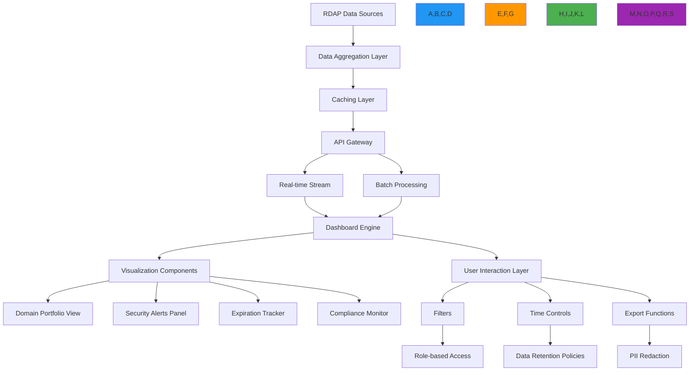

# وصفة مكونات لوحة المعلومات

> **يتطلب `@rdapify/pro`** — الميزات الموصوفة في هذا الدليل مُوفَّرة من الحزمة التجارية [`@rdapify/pro`](https://github.com/rdapify/RDAPify-Pro). ثبّتها إلى جانب `rdapify` لاستخدام هذه الوظائف.

**الغرض**: دليل شامل لتطبيق مكونات لوحة معلومات في الوقت الفعلي ومدركة للأمان لتصور بيانات تسجيل RDAP مع التركيز على الأداء والامتثال وتجربة المستخدم
**ذات صلة**: [خدمة المراقبة](monitoring_service.md) | [بوابة API](api_gateway.md) | [تجميع البيانات](data_aggregation.md) | [تحليل الأنماط](pattern_analysis.md)
**وقت القراءة**: 8 دقائق

## نظرة عامة على معمارية لوحة المعلومات

يوفر نظام لوحة المعلومات في RDAPify طبقة تصور موحدة لبيانات التسجيل مع أمان على مستوى المؤسسات وتحديثات في الوقت الفعلي وعرض بيانات مدرك للامتثال:



### المبادئ الأساسية للوحة المعلومات
- **ذكاء في الوقت الفعلي**: تحديثات مباشرة للتغييرات الحرجة في التسجيل مع كمون أقل من ثانية
- **تصور مدرك للامتثال**: اختزال تلقائي للبيانات الشخصية وعرض بيانات مدرك للاختصاص القضائي
- **وصول البيانات المستند إلى الأدوار**: أذونات دقيقة تتحكم في رؤية لوحة المعلومات حسب دور المستخدم
- **معمارية عدم الثقة**: التحقق من صحة جميع وصول البيانات مقابل سياسات الأمان قبل التصور
- **العرض المحسّن للأداء**: التحميل الكسول والقوائم المجازية وكثافة البيانات التكيفية
- **التفاعلات الجاهزة للتدقيق**: مسار تدقيق كامل لجميع تفاعلات لوحة المعلومات وتصدير البيانات

## أنماط التطبيق

### 1. لوحة معلومات محفظة النطاقات في الوقت الفعلي
```typescript
// src/dashboard/domain-portfolio.ts
import { RDAPClient } from 'rdapify';
import { PortfolioManager } from '../../portfolio/portfolio-manager';
import { SecurityContext } from '../../types';
import { ComplianceEngine } from '../../security/compliance';

export class DomainPortfolioDashboard {
  private portfolioManager: PortfolioManager;
  private rdapClient: RDAPClient;
  private complianceEngine: ComplianceEngine;
  private websocketServer: WebSocketServer;

  constructor(options: {
    portfolioManager?: PortfolioManager;
    rdapClient?: RDAPClient;
    complianceEngine?: ComplianceEngine;
    websocketServer?: WebSocketServer;
  } = {}) {
    this.portfolioManager = options.portfolioManager || new PortfolioManager();
    this.rdapClient = options.rdapClient || new RDAPClient({
      cache: true,
      privacy: true,
      timeout: 5000,
      retry: { maxAttempts: 3, backoff: 'exponential' }
    });
    this.complianceEngine = options.complianceEngine || new ComplianceEngine();
    this.websocketServer = options.websocketServer || new WebSocketServer();
  }

  async renderDashboard(
    portfolioId: string,
    context: SecurityContext,
    filters: DashboardFilters = {}
  ): Promise<DashboardView> {
    // Get portfolio data with compliance context
    const portfolio = await this.portfolioManager.getPortfolio(portfolioId, context);

    // Apply filters and compliance transformations
    const filteredDomains = this.applySecurityFilters(portfolio.domains, context, filters);
    const compliantDomains = await this.complianceEngine.applyComplianceTransformations(filteredDomains, context);

    // Get real-time analytics
    const analytics = await this.getPortfolioAnalytics(compliantDomains, context);

    // Create dashboard view
    const dashboard: DashboardView = {
      id: `dashboard-${portfolioId}-${Date.now()}`,
      timestamp: new Date().toISOString(),
      portfolio: {
        id: portfolio.id,
        name: portfolio.name,
        totalDomains: portfolio.domains.length,
        criticalDomains: portfolio.domains.filter(d => d.criticality === 'critical').length
      },
      summary: {
        criticalAlerts: analytics.criticalAlerts,
        expiringSoon: analytics.expiringSoon,
        securityRisks: analytics.securityRisks,
        complianceStatus: analytics.complianceStatus
      },
      domains: compliantDomains.map(domain => this.createDomainCard(domain, context)),
      filters: {
        applied: filters,
        available: this.getAvailableFilters(portfolio, context)
      }
    };

    // Set up real-time updates if requested
    if (context.realtimeUpdates) {
      this.setupRealtimeUpdates(portfolioId, context, dashboard.id);
    }

    return dashboard;
  }

  private applySecurityFilters(domains: Domain[], context: SecurityContext, filters: DashboardFilters): Domain[] {
    let result = [...domains];

    // Apply security level filtering
    if (context.securityLevel === 'restricted') {
      result = result.filter(domain => domain.criticality !== 'low');
    }

    // Apply role-based filtering
    if (context.userRole === 'analyst') {
      result = result.filter(domain =>
        ['security', 'compliance'].includes(domain.category)
      );
    }

    // Apply explicit filters
    if (filters.criticality) {
      result = result.filter(domain => domain.criticality === filters.criticality);
    }

    if (filters.expirationThreshold) {
      result = result.filter(domain =>
        this.getDaysUntilExpiration(domain) <= filters.expirationThreshold!
      );
    }

    return result;
  }

  private createDomainCard(domain: Domain, context: SecurityContext): DomainCard {
    return {
      domain: domain.name,
      criticality: domain.criticality,
      registrar: domain.registrar?.name || 'Unknown',
      expirationDate: this.formatDate(domain.expirationDate),
      lastUpdated: this.formatDate(domain.lastChecked),
      status: domain.status || 'active',
      securityScore: this.calculateSecurityScore(domain),
      complianceStatus: this.getComplianceStatus(domain, context),
      riskLevel: this.calculateRiskLevel(domain),
      actions: context.userRole === 'admin' ? ['edit', 'alert', 'export'] : []
    };
  }

  private async setupRealtimeUpdates(portfolioId: string, context: SecurityContext, dashboardId: string): Promise<void> {
    // Create WebSocket channel for this dashboard
    const channel = `dashboard:${dashboardId}`;

    // Subscribe to real-time updates
    this.websocketServer.subscribe(channel, async (message) => {
      if (message.type === 'domain_change') {
        // Validate message security context
        if (!this.validateMessageContext(message, context)) {
          return;
        }

        // Process domain change
        const updatedDomain = await this.processDomainChange(message.domain, context);

        // Send update to clients
        await this.websocketServer.publish(channel, {
          type: 'domain_update',
          domain: updatedDomain,
          timestamp: new Date().toISOString()
        });
      }
    });

    // Cleanup on disconnect
    this.websocketServer.onDisconnect(channel, () => {
      this.portfolioManager.stopRealtimeMonitoring(portfolioId);
    });
  }

  private getRefreshInterval(context: SecurityContext): number {
    // Critical security dashboards refresh more frequently
    if (context.userRole === 'security' && context.securityLevel === 'high') {
      return 5000; // 5 seconds
    }

    // Standard dashboards
    return 30000; // 30 seconds
  }
}
```

### 2. مكوّن لوحة تنبيهات الأمان
```typescript
// src/dashboard/security-alerts.ts
import { WebSocketServer } from './websocket-server';
import { ThreatIntelligenceService } from '../../security/threat-intelligence';
import { AlertManager } from '../../alerts/alert-manager';
import { ComplianceEngine } from '../../security/compliance';

export class SecurityAlertPanel {
  private websocketServer: WebSocketServer;
  private threatIntelligence: ThreatIntelligenceService;
  private alertManager: AlertManager;
  private complianceEngine: ComplianceEngine;

  constructor(options: {
    websocketServer?: WebSocketServer;
    threatIntelligence?: ThreatIntelligenceService;
    alertManager?: AlertManager;
    complianceEngine?: ComplianceEngine;
  } = {}) {
    this.websocketServer = options.websocketServer || new WebSocketServer();
    this.threatIntelligence = options.threatIntelligence || new ThreatIntelligenceService();
    this.alertManager = options.alertManager || new AlertManager();
    this.complianceEngine = options.complianceEngine || new ComplianceEngine();
  }

  async renderAlertPanel(
    portfolioId: string,
    context: SecurityContext,
    options: AlertPanelOptions = {}
  ): Promise<AlertPanelView> {
    // Get recent alerts with security context
    const alerts = await this.alertManager.getRecentAlerts(portfolioId, {
      ...context,
      maxAlerts: options.maxAlerts || 50,
      severityThreshold: options.severityThreshold || 'medium'
    });

    // Apply compliance transformations
    const compliantAlerts = await this.complianceEngine.applyComplianceTransformations(alerts, context);

    // Get threat intelligence context
    const enrichedAlerts = await this.enrichAlertsWithThreatIntelligence(compliantAlerts, context);

    // Create alert panel view
    const panel: AlertPanelView = {
      id: `alert-panel-${portfolioId}-${Date.now()}`,
      timestamp: new Date().toISOString(),
      summary: {
        totalAlerts: alerts.length,
        criticalAlerts: alerts.filter(a => a.severity === 'critical').length,
        highAlerts: alerts.filter(a => a.severity === 'high').length,
        unresolvedAlerts: alerts.filter(a => !a.resolved).length
      },
      alerts: enrichedAlerts.map(alert => this.createAlertCard(alert, context)),
      filters: {
        timeRange: options.timeRange || '24h',
        severityLevels: ['critical', 'high', 'medium'],
        alertTypes: ['registrar_change', 'nameserver_change', 'status_change', 'expiration_warning']
      },
      actions: context.userRole === 'security' ? ['resolve', 'escalate', 'investigate'] : []
    };

    return panel;
  }
}
```

### 3. مبادئ التصميم الأساسية للوحة المعلومات

| المبدأ | التطبيق | المثال |
|--------|---------|--------|
| **التحديث في الوقت الفعلي** | اشتراكات WebSocket للتغييرات الحرجة | تنبيهات انتهاء صلاحية النطاق في أقل من ثانية |
| **التحكم في الوصول المستند إلى الأدوار** | فلترة قائمة على الأدوار على مستوى البيانات | المحللون يرون فقط مجالات الأمان والامتثال |
| **الامتثال بشكل افتراضي** | اختزال تلقائي للبيانات الشخصية قبل العرض | رسائل البريد الإلكتروني مُختزلة في جميع طرق العرض |
| **مسار التدقيق** | تسجيل تفاعل شامل لجميع تصدير البيانات | أحداث مُسجَّلة لجميع استعلامات لوحة المعلومات |
| **التحسين التدريجي** | بيانات ثابتة مع تحديثات في الوقت الفعلي اختيارية | اللوحة تعمل بدون WebSocket |

[← العودة إلى التحليلات](../README.md)
