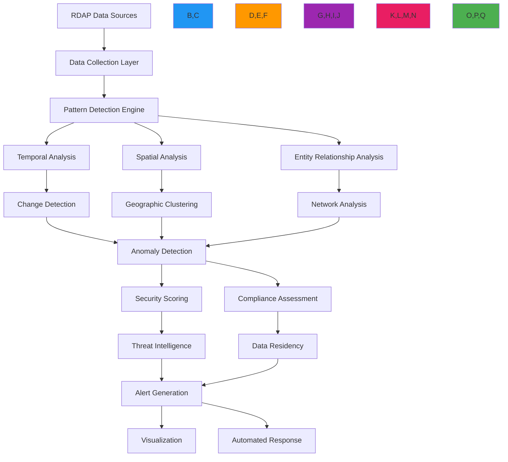

# وصفة تحليل الأنماط

> **يتطلب `@rdapify/pro`** — الميزات الموصوفة في هذا الدليل مُوفَّرة من الحزمة التجارية [`@rdapify/pro`](https://github.com/rdapify/RDAPify-Pro). ثبّتها إلى جانب `rdapify` لاستخدام هذه الوظائف.

**الغرض**: دليل شامل لتطبيق أنظمة الكشف عن الأنماط المتقدمة وتحليلها لبيانات تسجيل RDAP مع اكتشاف الشذوذات المدرك للأمان وتقنيات التحليل الحافظة للامتثال
**ذات صلة**: [رسم خرائط العلاقات](relationship_mapping.md) | [محفظة النطاقات](domain_portfolio.md) | [أدوات التصور](../analytics/visualization_tools.md) | [تجميع البيانات](data_aggregation.md)
**وقت القراءة**: 7 دقائق

## نظرة عامة على معمارية تحليل الأنماط

يوفر RDAPify إطار تحليل أنماط متطور يكتشف الأنماط ذات المعنى في بيانات التسجيل مع الحفاظ على حدود أمان صارمة ومتطلبات الامتثال:



### المبادئ الأساسية لتحليل الأنماط
- **التحليل متعدد الأبعاد**: دمج الأنماط الزمنية والمكانية والعلائقية للحصول على رؤى شاملة
- **الكشف المدرك للسياق**: ضبط حساسية الكشف بناءً على حرجية النطاق وسياق الأعمال
- **الأنماط الحافظة للخصوصية**: الكشف عن الأنماط دون كشف البيانات الشخصية من خلال الخصوصية التفاضلية والتجميع
- **العتبات التكيفية**: ضبط عتبات الكشف ديناميكياً بناءً على خطوط الأساس التاريخية
- **التحليل المستنير بالتهديدات**: دمج استخبارات التهديدات لإعطاء الأولوية للأنماط ذات الصلة بالأمان
- **التفسير المدرك للامتثال**: تكييف تفسير الأنماط بناءً على الاختصاص القضائي وحالة الموافقة

## أنماط التطبيق

### 1. محرك الكشف عن الأنماط الزمنية
```typescript
// src/patterns/temporal-analysis.ts
import { RDAPClient } from 'rdapify';
import { PatternDetectionContext } from '../types';
import { ThreatIntelligenceService } from '../security/threat-intelligence';

export class TemporalPatternEngine {
  private rdapClient: RDAPClient;
  private threatIntelligence: ThreatIntelligenceService;
  private patternCache = new Map<string, TemporalPattern[]>();

  constructor(options: {
    rdapClient?: RDAPClient;
    threatIntelligence?: ThreatIntelligenceService;
    cacheTTL?: number;
  } = {}) {
    this.rdapClient = options.rdapClient || new RDAPClient({
      cache: true,
      privacy: true,
      timeout: 5000,
      retry: { maxAttempts: 3, backoff: 'exponential' }
    });

    this.threatIntelligence = options.threatIntelligence || new ThreatIntelligenceService();
    this.cacheTTL = options.cacheTTL || 86400000; // 24 hours default
  }

  async detectTemporalPatterns(domains: string[], context: PatternDetectionContext): Promise<PatternAnalysisResult> {
    const cacheKey = this.generateCacheKey(domains, context);
    const cached = this.patternCache.get(cacheKey);

    if (cached && Date.now() - cached.timestamp < this.cacheTTL) {
      return {
        patterns: cached,
        timestamp: new Date().toISOString(),
        source: 'cache'
      };
    }

    // Collect historical data for each domain
    const historicalData = await Promise.all(
      domains.map(domain => this.collectHistoricalData(domain, context))
    );

    // Detect temporal patterns
    const patterns = this.analyzeTemporalPatterns(historicalData, context);

    // Apply threat intelligence scoring
    const scoredPatterns = await this.applyThreatScoring(patterns, context);

    // Cache results
    this.patternCache.set(cacheKey, {
      patterns: scoredPatterns,
      timestamp: Date.now()
    });

    return {
      patterns: scoredPatterns,
      timestamp: new Date().toISOString(),
      source: 'real-time'
    };
  }

  private analyzeTemporalPatterns(historicalData: DomainHistory[], context: PatternDetectionContext): TemporalPattern[] {
    const patterns: TemporalPattern[] = [];

    for (const data of historicalData) {
      // Detect rapid changes
      const rapidChanges = this.detectRapidChanges(data, context);
      if (rapidChanges.length > 0) {
        patterns.push({
          type: 'rapid_change',
          domain: data.domain,
          severity: this.calculateSeverity(rapidChanges.length, context),
          confidence: rapidChanges.reduce((sum, change) => sum + (change.confidence || 0.5), 0) / rapidChanges.length,
          details: {
            changes: rapidChanges,
            timeframe: '24h',
            baseline: data.baseline
          },
          timestamp: new Date().toISOString()
        });
      }

      // Detect cyclical patterns
      const cyclicalPatterns = this.detectCyclicalPatterns(data, context);
      if (cyclicalPatterns.length > 0) {
        patterns.push({
          type: 'cyclical_change',
          domain: data.domain,
          severity: 'medium',
          confidence: cyclicalPatterns.reduce((sum, pattern) => sum + (pattern.confidence || 0.5), 0) / cyclicalPatterns.length,
          details: {
            patterns: cyclicalPatterns,
            period: '7d',
            predictability: 0.8
          },
          timestamp: new Date().toISOString()
        });
      }

      // Detect expiration patterns
      const expirationPattern = this.detectExpirationPattern(data, context);
      if (expirationPattern) {
        patterns.push(expirationPattern);
      }
    }

    return patterns;
  }

  private detectRapidChanges(data: DomainHistory, context: PatternDetectionContext): ChangeEvent[] {
    const changes: ChangeEvent[] = [];

    // Analyze recent events
    for (let i = 0; i < data.events.length - 1; i++) {
      const current = data.events[i];
      const next = data.events[i + 1];

      // Calculate time difference in hours
      const timeDiff = (new Date(next.timestamp).getTime() - new Date(current.timestamp).getTime()) / (1000 * 60 * 60);

      // Detect rapid changes (less than 24 hours between significant changes)
      if (timeDiff < 24 && this.isSignificantChange(current, next)) {
        changes.push({
          type: 'rapid_change',
          oldValue: current.value,
          newValue: next.value,
          timestamp: next.timestamp,
          confidence: this.calculateChangeConfidence(current, next, context),
          riskScore: this.calculateChangeRisk(current, next, context)
        });
      }
    }

    return changes;
  }
}
```

### 2. أنواع الأنماط المكتشفة

| نوع النمط | الوصف | مستوى الشدة | إجراء الاستجابة |
|-----------|-------|-------------|----------------|
| **التغيير السريع** | تغييرات متعددة في أقل من 24 ساعة | عالية | تحقيق فوري |
| **التغيير الدوري** | تغييرات بفترات منتظمة يمكن التنبؤ بها | متوسطة | مراقبة مستمرة |
| **نمط انتهاء الصلاحية** | نطاق على وشك الانتهاء | متغيرة | تنبيه التجديد |
| **شذوذ السجل** | تغيير غير عادي في السجل | حرجة | مراجعة أمنية |
| **تغيير خادم الأسماء** | تغيير في البنية التحتية لـ DNS | عالية | التحقق من سلسلة الثقة |
| **تغيير حالة النطاق** | تعديل حالة EPP | متوسطة إلى عالية | تدقيق السياسة |

### 3. التكامل مع استخبارات التهديدات
```typescript
// src/patterns/threat-scoring.ts
export class ThreatScoringEngine {
  async scorePatternsWithThreatIntelligence(
    patterns: TemporalPattern[],
    context: PatternDetectionContext
  ): Promise<ScoredPattern[]> {
    return Promise.all(
      patterns.map(async pattern => {
        // Get threat context
        const threatContext = await this.getThreatContext(pattern.domain, context);

        // Calculate composite threat score
        const threatScore = this.calculateCompositeScore({
          patternSeverity: pattern.severity,
          threatIntelligenceScore: threatContext.score,
          historicalRisk: threatContext.historicalRisk,
          jurisdictionRisk: this.getJurisdictionRisk(context.jurisdiction)
        });

        return {
          ...pattern,
          threatScore,
          threatContext,
          recommendedAction: this.getRecommendedAction(threatScore),
          complianceImplications: this.getComplianceImplications(pattern, context)
        };
      })
    );
  }

  private calculateCompositeScore(factors: ScoreFactors): number {
    const weights = {
      patternSeverity: 0.4,
      threatIntelligenceScore: 0.3,
      historicalRisk: 0.2,
      jurisdictionRisk: 0.1
    };

    return Object.entries(weights).reduce((total, [factor, weight]) => {
      return total + (factors[factor as keyof ScoreFactors] * weight);
    }, 0);
  }

  private getRecommendedAction(score: number): RecommendedAction {
    if (score >= 0.8) return { action: 'immediate_investigation', priority: 'critical' };
    if (score >= 0.6) return { action: 'security_review', priority: 'high' };
    if (score >= 0.4) return { action: 'monitor_closely', priority: 'medium' };
    return { action: 'routine_monitoring', priority: 'low' };
  }
}
```

[← العودة إلى التحليلات](../README.md)
