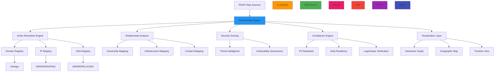

# وصفة رسم خرائط العلاقات

> **يتطلب `@rdapify/pro`** — الميزات الموصوفة في هذا الدليل مُوفَّرة من الحزمة التجارية [`@rdapify/pro`](https://github.com/rdapify/RDAPify-Pro). ثبّتها إلى جانب `rdapify` لاستخدام هذه الوظائف.

**الغرض**: دليل شامل لتطبيق أنظمة رسم خرائط علاقات النطاقات مع RDAPify لتصور وتحليل علاقات بيانات التسجيل مع الحفاظ على حدود الأمان ومتطلبات الامتثال
**ذات صلة**: [محفظة النطاقات](domain_portfolio.md) | [تحليل الأنماط](../analytics/pattern_analysis.md) | [أدوات التصور](../analytics/visualization_tools.md) | [تجميع البيانات](data_aggregation.md)
**وقت القراءة**: 7 دقائق

## نظرة عامة على معمارية رسم خرائط العلاقات

يوفر RDAPify إطاراً قوياً لرسم خرائط وتحليل العلاقات بين النطاقات وعناوين IP وأرقام ASN والمسجلين مع ضوابط أمان وامتثال على مستوى المؤسسات:



### المبادئ الأساسية لرسم خرائط العلاقات
- **تحليل الكيانات**: التعرف الدقيق على الكيانات ذات الصلة عبر أنظمة السجل المختلفة
- **العلاقات المدركة للسياق**: التمييز بين علاقات الملكية والبنية التحتية والإدارة
- **الحفاظ على الخصوصية**: رسم خرائط العلاقات دون كشف البيانات الشخصية من خلال الخصوصية التفاضلية والتجميع
- **درجات العلاقات الديناميكية**: حساب درجات قوة العلاقات وثقتها مع مقاييس عدم اليقين
- **التحليل متعدد الأبعاد**: دعم أبعاد العلاقات الزمنية والجغرافية والتنظيمية
- **التصور المدرك للامتثال**: تكييف عروض العلاقات بناءً على الاختصاص القضائي وحالة الموافقة

## أنماط التطبيق

### 1. محرك تحليل الكيانات والعلاقات
```typescript
// src/relationship/entity-resolver.ts
import { RDAPClient } from 'rdapify';
import { RelationshipContext } from '../types';
import { ComplianceEngine } from '../security/compliance';

export class EntityRelationshipEngine {
  private rdapClient: RDAPClient;
  private complianceEngine: ComplianceEngine;
  private relationshipCache = new Map<string, RelationshipGraph>();

  constructor(options: {
    rdapClient?: RDAPClient;
    complianceEngine?: ComplianceEngine;
    cacheTTL?: number;
  } = {}) {
    this.rdapClient = options.rdapClient || new RDAPClient({
      cache: true,
      privacy: true,
      timeout: 5000,
      retry: { maxAttempts: 3, backoff: 'exponential' }
    });

    this.complianceEngine = options.complianceEngine || new ComplianceEngine();
    this.cacheTTL = options.cacheTTL || 3600000; // 1 hour default
  }

  async mapDomainRelationships(domain: string, context: RelationshipContext): Promise<RelationshipGraph> {
    const cacheKey = this.generateCacheKey(domain, context);
    const cached = this.relationshipCache.get(cacheKey);

    if (cached && Date.now() - cached.timestamp < this.cacheTTL) {
      return cached;
    }

    // Start with domain resolution
    const domainData = await this.rdapClient.domain(domain, {
      privacy: context.redactPII,
      legalBasis: context.legalBasis
    });

    // Resolve related entities
    const entities = await this.resolveRelatedEntities(domainData, context);

    // Build relationship graph
    const graph = this.buildRelationshipGraph(domainData, entities, context);

    // Apply compliance transformations
    const compliantGraph = await this.complianceEngine.applyComplianceTransformations(graph, context);

    // Calculate relationship scores
    const scoredGraph = this.calculateRelationshipScores(compliantGraph, context);

    // Cache result
    this.relationshipCache.set(cacheKey, {
      ...scoredGraph,
      timestamp: Date.now()
    });

    return scoredGraph;
  }

  private async resolveRelatedEntities(domainData: any, context: RelationshipContext): Promise<RelatedEntity[]> {
    const entities: RelatedEntity[] = [];
    const processedHandles = new Set<string>();

    // Process registrar
    if (domainData.registrar?.handle && !processedHandles.has(domainData.registrar.handle)) {
      entities.push({
        id: domainData.registrar.handle,
        type: 'registrar',
        name: domainData.registrar.name,
        country: domainData.registrar.country,
        relationships: [{
          type: 'registrar',
          target: domainData.domain,
          strength: 1.0,
          confidence: 0.95
        }]
      });
      processedHandles.add(domainData.registrar.handle);
    }

    // Process nameservers
    for (const ns of domainData.nameservers || []) {
      try {
        const nsData = await this.rdapClient.domain(ns, {
          privacy: context.redactPII,
          cache: true
        });

        entities.push({
          id: ns,
          type: 'nameserver',
          name: ns,
          relationships: [{
            type: 'nameserver',
            target: domainData.domain,
            strength: 0.8,
            confidence: 0.9
          }]
        });
      } catch (error) {
        // Continue if nameserver lookup fails
      }
    }

    return entities;
  }

  private buildRelationshipGraph(
    domainData: any,
    entities: RelatedEntity[],
    context: RelationshipContext
  ): RelationshipGraph {
    return {
      nodes: [
        { id: domainData.domain, type: 'domain', data: domainData },
        ...entities.map(e => ({ id: e.id, type: e.type, data: e }))
      ],
      edges: entities.flatMap(e =>
        e.relationships.map(rel => ({
          source: e.id,
          target: rel.target,
          type: rel.type,
          strength: rel.strength,
          confidence: rel.confidence
        }))
      ),
      metadata: {
        domain: domainData.domain,
        timestamp: new Date().toISOString(),
        jurisdiction: context.jurisdiction,
        complianceLevel: context.complianceLevel
      }
    };
  }
}
```

### 2. أنواع العلاقات المدعومة

| نوع العلاقة | الوصف | المصدر | قوة العلاقة |
|------------|-------|--------|------------|
| **الملكية** | العلاقة بين المسجِّل والنطاق | سجل RDAP | 1.0 (مؤكدة) |
| **السجل** | ارتباط المسجِّل بالنطاق | سجل RDAP | 0.95 (عالية) |
| **خادم الأسماء** | علاقة DNS للبنية التحتية | سجل RDAP | 0.8 (جيدة) |
| **عنوان IP** | ارتباط النطاق بالعناوين | قرار DNS | 0.7 (متوسطة) |
| **ASN** | ارتباط شبكة النظام المستقل | بيانات التوجيه | 0.6 (تقريبية) |
| **التاريخي** | علاقات الملكية السابقة | بيانات RDAP المؤرشفة | 0.4 (منخفضة) |

### 3. تصور الرسم البياني للعلاقات
```typescript
// src/visualization/graph-renderer.ts
export class RelationshipGraphRenderer {
  renderGraph(graph: RelationshipGraph, options: RenderOptions): SVGElement {
    const { nodes, edges } = graph;

    // Apply layout algorithm
    const layout = this.applyForceDirectedLayout(nodes, edges, options);

    // Create SVG elements
    const svg = this.createSVGElement(options.width, options.height);

    // Render edges first (below nodes)
    edges.forEach(edge => {
      const edgeElement = this.createEdgeElement(edge, layout);
      svg.appendChild(edgeElement);
    });

    // Render nodes
    nodes.forEach(node => {
      const nodeElement = this.createNodeElement(node, layout, options);
      svg.appendChild(nodeElement);
    });

    // Add interaction handlers
    this.addInteractionHandlers(svg, graph, options);

    return svg;
  }

  private createNodeElement(
    node: GraphNode,
    layout: LayoutResult,
    options: RenderOptions
  ): SVGElement {
    const nodeColors: Record<string, string> = {
      domain: '#2196F3',
      registrar: '#4CAF50',
      nameserver: '#FF9800',
      ip: '#3F51B5',
      asn: '#E91E63'
    };

    const circle = document.createElementNS('http://www.w3.org/2000/svg', 'circle');
    circle.setAttribute('cx', String(layout.positions[node.id].x));
    circle.setAttribute('cy', String(layout.positions[node.id].y));
    circle.setAttribute('r', String(this.getNodeRadius(node)));
    circle.setAttribute('fill', nodeColors[node.type] || '#9E9E9E');

    // Apply PII-aware labels
    const label = this.createLabel(node, options.piiRedacted);

    const group = document.createElementNS('http://www.w3.org/2000/svg', 'g');
    group.appendChild(circle);
    group.appendChild(label);

    return group;
  }
}
```

[← العودة إلى التحليلات](../README.md)
