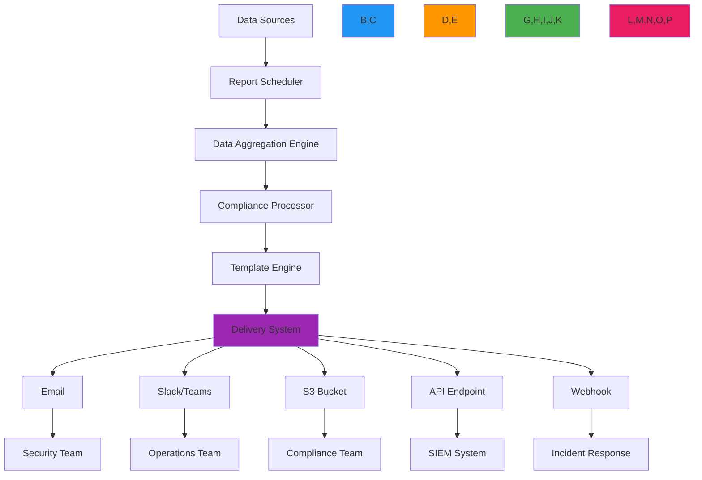

# وصفة أتمتة التقارير

> **يتطلب `@rdapify/pro`** — الميزات الموصوفة في هذا الدليل مُوفَّرة من الحزمة التجارية [`@rdapify/pro`](https://github.com/rdapify/RDAPify-Pro). ثبّتها إلى جانب `rdapify` لاستخدام هذه الوظائف.

**الغرض**: دليل شامل لتطبيق أنظمة تقارير آلية ومدركة للامتثال مع RDAPify لمراقبة محفظة النطاقات وتنبيهات الأمان والامتثال التنظيمي
**ذات صلة**: [التقارير المجدولة](scheduled_reports.md) | [محفظة النطاقات](domain_portfolio.md) | [التنبيهات الحرجة](critical_alerts.md) | [تجميع البيانات](data_aggregation.md)
**وقت القراءة**: 7 دقائق

## نظرة عامة على معمارية أتمتة التقارير

يوفر نظام أتمتة التقارير في RDAPify إطاراً موحداً للذكاء الآلي للنطاقات مع أمان وامتثال وتميز تشغيلي على مستوى المؤسسات:



### مبادئ التقارير الأساسية
- **الامتثال بشكل افتراضي**: توليد تقارير متوافقة مع GDPR/CCPA مع اختزال تلقائي للبيانات الشخصية
- **جدولة مدفوعة بالأعمال**: جدولة مرنة مبنية على حرجية الأعمال ومتطلبات الامتثال
- **التسليم متعدد القنوات**: دعم البريد الإلكتروني وSlack وS3 وواجهات API وأنظمة الإشعارات للمؤسسات
- **الذكاء السياقي**: تتضمن التقارير سياق الأعمال وليس فقط بيانات التسجيل الخام
- **الجاهزية للتدقيق**: مسارات تدقيق كاملة لجميع أنشطة توليد التقارير وتسليمها
- **تحسين الموارد**: دفعات ذكية وتخزين مؤقت لتقليل تأثير السجل والتكاليف

## أنماط التطبيق

### 1. جوهر مجدول التقارير
```typescript
// src/reporting/scheduler.ts
import { CronJob } from 'cron';
import { ReportConfig, ReportTemplate, DeliveryChannel } from '../types';
import { ComplianceEngine } from '../security/compliance';
import { DataAggregator } from '../aggregation/aggregator';

export class ReportScheduler {
  private jobs = new Map<string, CronJob>();
  private reportConfigs = new Map<string, ReportConfig>();
  private complianceEngine: ComplianceEngine;
  private dataAggregator: DataAggregator;

  constructor(options: {
    complianceEngine?: ComplianceEngine;
    dataAggregator?: DataAggregator;
    storage?: ReportStorage;
  } = {}) {
    this.complianceEngine = options.complianceEngine || new ComplianceEngine();
    this.dataAggregator = options.dataAggregator || new DataAggregator();
    this.storage = options.storage || new ReportStorage();
  }

  async registerReport(config: ReportConfig): Promise<string> {
    // Validate report configuration
    this.validateReportConfig(config);

    // Generate unique report ID
    const reportId = `report_${Date.now()}_${Math.random().toString(36).slice(2, 10)}`;

    // Store configuration
    await this.storage.storeReportConfig(reportId, config);
    this.reportConfigs.set(reportId, config);

    // Create and start scheduler
    await this.createSchedule(reportId, config);

    return reportId;
  }

  private async createSchedule(reportId: string, config: ReportConfig): Promise<void> {
    // Parse schedule expression
    const cronExpression = this.parseSchedule(config.schedule);

    // Create scheduled job
    const job = new CronJob(cronExpression, async () => {
      try {
        await this.executeReport(reportId, config);
      } catch (error) {
        console.error(`Report execution failed for ${reportId}:`, error.message);
        await this.handleError(reportId, config, error);
      }
    }, null, true, 'UTC');

    this.jobs.set(reportId, job);
  }

  private async executeReport(reportId: string, config: ReportConfig): Promise<void> {
    const startTime = Date.now();
    const executionId = `exec_${Date.now()}_${Math.random().toString(36).slice(2, 8)}`;

    try {
      // Load data with compliance context
      const data = await this.loadData(config, executionId);

      // Generate report content
      const reportContent = await this.generateReportContent(data, config, executionId);

      // Apply compliance transformations
      const compliantContent = await this.complianceEngine.applyComplianceTransformations(
        reportContent,
        config.complianceContext
      );

      // Deliver report
      const deliveryResults = await this.deliverReport(compliantContent, config, executionId);

      // Record execution
      await this.recordExecution(reportId, executionId, {
        startTime,
        endTime: Date.now(),
        status: 'success',
        itemCount: data.items.length,
        deliveryResults
      });

    } catch (error) {
      // Record failed execution
      await this.recordExecution(reportId, executionId, {
        startTime,
        endTime: Date.now(),
        status: 'failed',
        error: error.message
      });

      throw error;
    }
  }
}
```

### 2. قنوات تسليم التقارير
```typescript
// src/reporting/delivery.ts
export class ReportDeliveryManager {
  private channels = new Map<string, DeliveryChannel>();

  constructor() {
    this.registerDefaultChannels();
  }

  private registerDefaultChannels() {
    // Email delivery
    this.channels.set('email', new EmailDeliveryChannel({
      encryption: 'tls',
      authentication: 'oauth2',
      rateLimit: { maxPerHour: 100 }
    }));

    // Slack delivery
    this.channels.set('slack', new SlackDeliveryChannel({
      webhook: process.env.SLACK_WEBHOOK_URL,
      formatting: 'blocks'
    }));

    // S3 storage
    this.channels.set('s3', new S3DeliveryChannel({
      bucket: process.env.REPORTS_BUCKET,
      encryption: 'AES256',
      retention: { days: 90 }
    }));

    // API endpoint
    this.channels.set('api', new APIDeliveryChannel({
      authentication: 'bearer',
      retry: { maxAttempts: 3, backoff: 'exponential' }
    }));

    // Webhook
    this.channels.set('webhook', new WebhookDeliveryChannel({
      signatureAlgorithm: 'hmac-sha256',
      timeout: 5000
    }));
  }

  async deliver(
    report: CompliantReport,
    config: ReportConfig,
    executionId: string
  ): Promise<DeliveryResult[]> {
    const results: DeliveryResult[] = [];

    for (const channelConfig of config.deliveryChannels) {
      const channel = this.channels.get(channelConfig.type);
      if (!channel) continue;

      try {
        // Apply channel-specific PII transformation
        const channelReport = await this.applyChannelTransformations(
          report,
          channelConfig,
          config.complianceContext
        );

        // Deliver to channel
        const result = await channel.deliver(channelReport, channelConfig);
        results.push(result);

      } catch (error) {
        results.push({
          channel: channelConfig.type,
          status: 'failed',
          error: error.message,
          timestamp: new Date().toISOString()
        });
      }
    }

    return results;
  }
}
```

### 3. أنواع التقارير المدعومة

| نوع التقرير | الوصف | التكرار المقترح | الجمهور المستهدف |
|------------|-------|----------------|-----------------|
| **ملخص الأمان** | التهديدات الأمنية للنطاق وتنبيهات الشذوذات | يومي | فريق الأمان |
| **تقرير الامتثال** | حالة GDPR/CCPA وانتهاكات البيانات | أسبوعي | فريق الامتثال |
| **حالة المحفظة** | نظرة عامة على صحة محفظة النطاقات | أسبوعي | الإدارة |
| **تقرير انتهاء الصلاحية** | النطاقات التي تنتهي صلاحيتها في الأفق | يومي | فريق العمليات |
| **تدقيق النشاط** | سجل نشاط استعلام النظام | شهري | فريق الامتثال |
| **تقرير الأداء** | مقاييس أداء الاستعلام والتخزين المؤقت | ربع سنوي | فريق الهندسة |

[← العودة إلى التحليلات](../README.md)
