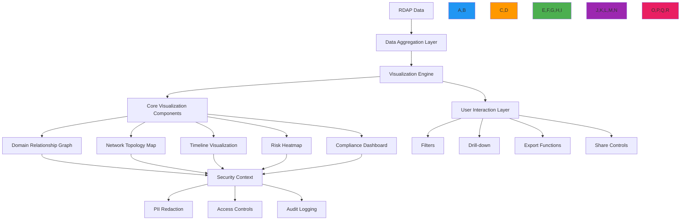

# وصفة أدوات التصور

> **يتطلب `@rdapify/pro`** — الميزات الموصوفة في هذا الدليل مُوفَّرة من الحزمة التجارية [`@rdapify/pro`](https://github.com/rdapify/RDAPify-Pro). ثبّتها إلى جانب `rdapify` لاستخدام هذه الوظائف.

**الغرض**: دليل شامل لتطبيق أدوات تصور البيانات التفاعلية لبيانات تسجيل RDAP مع تحليلات في الوقت الفعلي وتصورات مدركة للأمان ولوحات معلومات صديقة للامتثال
**ذات صلة**: [مكونات لوحة المعلومات](dashboard_components.md) | [تحليل الأنماط](pattern_analysis.md) | [رسم خرائط العلاقات](relationship_mapping.md) | [أتمتة التقارير](reporting_automation.md)
**وقت القراءة**: 8 دقائق

## نظرة عامة على معمارية التصور

يوفر RDAPify إطار تصور بيانات موحد يحول بيانات التسجيل المعقدة إلى تمثيلات بصرية بديهية وتفاعلية مع الحفاظ على حدود أمان صارمة ومتطلبات الامتثال:



### مبادئ التصور الأساسية
- **تصورات غنية بالسياق**: إظهار العلاقات والأنماط وليس فقط نقاط البيانات الخام
- **الإفصاح التدريجي**: البدء بنظرة عامة عالية المستوى مع السماح بالتعمق في التفاصيل
- **العرض الذي يضع الأمان أولاً**: التصورات تحترم اختزال البيانات الشخصية وضوابط الوصول على كل مستوى
- **التحسين للأداء**: التعامل مع مجموعات البيانات الكبيرة بعرض سلس وتفاعلات استجابية
- **الوعي بالامتثال**: التصورات تتكيف مع متطلبات الاختصاص القضائي وحالة الموافقة
- **إمكانية الوصول أولاً**: متوافق مع WCAG 2.1 AA مع التنقل بلوحة المفاتيح ودعم قارئ الشاشة

## أنماط التطبيق

### 1. رسم بياني تفاعلي لعلاقات النطاقات
```typescript
// src/visualization/domain-graph.ts
import { ForceGraph2D, ForceGraph3D } from 'react-force-graph';
import { RDAPClient } from 'rdapify';
import { VisualizationSecurity } from './security';
import { ComplianceEngine } from '../security/compliance';

export class DomainRelationshipVisualizer {
  private rdapClient: RDAPClient;
  private securityEngine: VisualizationSecurity;
  private complianceEngine: ComplianceEngine;
  private colorScheme = {
    domain: '#2196F3',
    registrar: '#4CAF50',
    nameserver: '#FF9800',
    contact: '#9C27B0',
    asn: '#E91E63',
    ip: '#3F51B5',
    securityRisk: '#F44336'
  };

  constructor(options: {
    rdapClient?: RDAPClient;
    securityEngine?: VisualizationSecurity;
    complianceEngine?: ComplianceEngine;
    colorScheme?: Record<string, string>;
  } = {}) {
    this.rdapClient = options.rdapClient || new RDAPClient({
      cache: true,
      privacy: true,
      timeout: 5000,
      retry: { maxAttempts: 3, backoff: 'exponential' }
    });

    this.securityEngine = options.securityEngine || new VisualizationSecurity();
    this.complianceEngine = options.complianceEngine || new ComplianceEngine();
    this.colorScheme = { ...this.colorScheme, ...(options.colorScheme || {}) };
  }

  async createDomainGraph(
    domain: string,
    context: VisualizationContext,
    options: GraphOptions = {}
  ): Promise<ForceGraphProps> {
    // Get domain data with security context
    const domainData = await this.rdapClient.domain(domain, {
      privacy: context.redactPII,
      legalBasis: context.legalBasis
    });

    // Get related entities
    const relatedEntities = await this.getRelatedEntities(domainData, context);

    // Apply compliance transformations
    const compliantEntities = await this.complianceEngine.applyComplianceTransformations(relatedEntities, context);

    // Create graph nodes and links
    const { nodes, links } = this.createGraphStructure(domainData, compliantEntities, context);

    // Apply security context to visualization
    const secureNodes = this.securityEngine.applyNodeSecurity(nodes, context);
    const secureLinks = this.securityEngine.applyLinkSecurity(links, context);

    return {
      nodes: secureNodes,
      links: secureLinks,
      options: {
        width: options.width || 800,
        height: options.height || 600,
        nodeColor: this.getNodeColor.bind(this),
        nodeLabel: this.getNodeLabel.bind(this),
        nodeVal: this.getNodeSize.bind(this),
        linkColor: this.getLinkColor.bind(this),
        linkWidth: this.getLinkWidth.bind(this),
        linkLabel: this.getLinkLabel.bind(this),
        onNodeClick: this.handleNodeClick.bind(this),
        onLinkClick: this.handleLinkClick.bind(this),
        cooldownTime: 15000,
        dagMode: options.layout || 'radial'
      },
      context: {
        domain,
        timestamp: new Date().toISOString(),
        securityLevel: context.securityLevel,
        complianceLevel: context.complianceLevel
      }
    };
  }
}
```

### 2. خريطة حرارة للمخاطر
```typescript
// src/visualization/risk-heatmap.ts
export class RiskHeatmapVisualizer {
  async createRiskHeatmap(
    domains: string[],
    context: VisualizationContext
  ): Promise<HeatmapData> {
    // Collect risk data for all domains
    const riskData = await Promise.all(
      domains.map(async domain => {
        const data = await this.rdapClient.domain(domain, {
          privacy: context.redactPII
        });

        return {
          domain,
          riskScore: this.calculateRiskScore(data, context),
          riskDimensions: {
            security: this.calculateSecurityRisk(data),
            compliance: this.calculateComplianceRisk(data, context),
            expiration: this.calculateExpirationRisk(data),
            infrastructure: this.calculateInfrastructureRisk(data)
          }
        };
      })
    );

    // Create heatmap matrix
    return {
      domains: riskData.map(d => d.domain),
      dimensions: ['security', 'compliance', 'expiration', 'infrastructure'],
      matrix: this.buildHeatmapMatrix(riskData),
      colorScale: {
        low: '#4CAF50',
        medium: '#FF9800',
        high: '#F44336',
        critical: '#B71C1C'
      },
      thresholds: {
        low: 0.3,
        medium: 0.5,
        high: 0.7,
        critical: 0.9
      }
    };
  }

  private buildHeatmapMatrix(riskData: DomainRiskData[]): number[][] {
    return riskData.map(domain => [
      domain.riskDimensions.security,
      domain.riskDimensions.compliance,
      domain.riskDimensions.expiration,
      domain.riskDimensions.infrastructure
    ]);
  }
}
```

### 3. مكونات التصور المتاحة

| المكوّن | الوصف | حالة الاستخدام |
|--------|-------|---------------|
| **رسم بياني قوة** | رسم بياني تفاعلي لعلاقات النطاق | استكشاف العلاقات |
| **خريطة حرارة المخاطر** | تقييم المخاطر متعدد الأبعاد | لوحات معلومات الأمان |
| **تصور الخط الزمني** | تتبع التغييرات التاريخية | التحقيق في الحوادث |
| **خريطة الشبكة الجغرافية** | توزيع النطاقات الجغرافي | تحليل الامتثال |
| **لوحة معلومات الامتثال** | نظرة عامة على حالة الامتثال | التقارير التنظيمية |
| **مخطط انتهاء الصلاحية** | تتبع تواريخ انتهاء الصلاحية | عمليات المحفظة |

### 4. اعتبارات إمكانية الوصول
```typescript
// src/visualization/accessibility.ts
export class AccessibleVisualization {
  applyAccessibilityFeatures(visualization: HTMLElement, context: AccessibilityContext): void {
    // Add ARIA labels
    visualization.setAttribute('role', 'img');
    visualization.setAttribute('aria-label', this.generateAltText(context));

    // Add keyboard navigation
    this.addKeyboardNavigation(visualization);

    // Add high contrast mode support
    if (context.highContrast) {
      this.applyHighContrastTheme(visualization);
    }

    // Add screen reader text
    const srText = this.createScreenReaderText(context);
    visualization.insertBefore(srText, visualization.firstChild);
  }

  private generateAltText(context: AccessibilityContext): string {
    return `رسم بياني لعلاقات النطاق يعرض ${context.nodeCount} عقدة و${context.edgeCount} اتصال. ` +
      `مستوى المخاطر الأعلى: ${context.maxRiskLevel}.`;
  }
}
```

[← العودة إلى التحليلات](../README.md)
