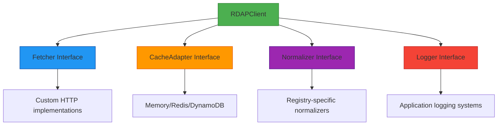

# مرجع نوع `Interfaces`

> **الغرض:** مرجع شامل لـ TypeScript interfaces الأساسية التي تحدد نقاط التوسعة وعقود التكامل في RDAPify
> **ذو صلة:** [واجهة برمجة العميل](client.md) | [محوّلات التخزين المؤقت](../guides/custom-adapters.md) | [نظام الإضافات](../advanced/plugin-system.md)
> **وقت القراءة:** 7 دقائق

---

## نظرة عامة على نظام الـ Interface

صُمِّم نظام الـ interface في RDAPify حول مبدأ **التوسعة دون التفرع**، مما يُتيح تنفيذات مخصصة مع الحفاظ على سلامة الأنواع وامتثال البروتوكول:



**مبادئ التصميم الرئيسية:**
- **فصل الـ Interface**: كل interface مسؤولية واحدة
- **عكس التبعية**: الوحدات عالية المستوى تعتمد على التجريدات لا على التنفيذات
- **مبدأ استبدال Liskov**: التنفيذات المخصصة تستطيع استبدال المدمجة دون كسر المستهلكين
- **الخصوصية بالافتراض**: كل الـ interfaces تحترم حدود إخفاء البيانات الشخصية

---

## تعريفات الـ Interface الأساسية

### الـ `Fetcher` Interface
```typescript
interface Fetcher {
  /**
   * تنفيذ طلب HTTP مع حماية SSRF
   * @param url - عنوان URL الهدف (مُتحقق منه قبل الطلب)
   * @param options - خيارات الطلب
   * @returns Promise يُحل إلى كائن الاستجابة
   * @throws RDAPError إذا فشل الطلب أو اكتُشف انتهاك أمني
   */
  fetch(url: string, options?: FetchOptions): Promise<FetchResponse>;

  /**
   * التحقق من URL قبل إجراء الطلب
   * @param url - عنوان URL للتحقق منه
   * @returns قيمة منطقية تُشير إلى أمان URL للطلب
   */
  validateUrl(url: string): boolean;

  /**
   * الحصول على سياق الأمان للطلب
   * @param url - عنوان URL الهدف
   * @returns كائن SecurityContext يحمل تقييم التهديد
   */
  getSecurityContext(url: string): SecurityContext;
}

interface FetchOptions {
  method?: 'GET' | 'POST' | 'HEAD';
  headers?: Record<string, string>;
  timeout?: number;
  followRedirects?: boolean;
  abortSignal?: AbortSignal;
}

interface FetchResponse {
  status: number;
  statusText: string;
  headers: Headers;
  body: string | null;
  url: string;
  redirected: boolean;
}

interface SecurityContext {
  isPrivateIP: boolean;
  isCloudMetadata: boolean;
  threatLevel: 'low' | 'medium' | 'high' | 'critical';
  blockedReason?: string;
}
```

**مثال على التنفيذ:**
```typescript
class SecureFetcher implements Fetcher {
  private readonly tlsOptions: TLSOptions;
  private readonly blockPrivateIPs: boolean;

  constructor(options: {
    tlsOptions?: TLSOptions;
    blockPrivateIPs?: boolean;
  } = {}) {
    this.tlsOptions = options.tlsOptions || { minVersion: 'TLSv1.3' };
    this.blockPrivateIPs = options.blockPrivateIPs ?? true;
  }

  async fetch(url: string, options: FetchOptions = {}): Promise<FetchResponse> {
    if (!this.validateUrl(url)) {
      throw new RDAPError('RDAP_SSRF_ATTEMPT', `Blocked SSRF attempt to ${url}`, {
        privacySafe: true,
        securityCritical: true
      });
    }

    // التنفيذ مع إلزام TLS المناسب
    return this.executeRequest(url, options);
  }

  validateUrl(url: string): boolean {
    try {
      const parsed = new URL(url);

      // حجب البروتوكولات غير HTTP
      if (!['http:', 'https:'].includes(parsed.protocol)) return false;

      // التحقق من عنوان IP إن وُجد
      if (parsed.hostname.match(/^\d+\.\d+\.\d+\.\d+$/)) {
        const ip = parsed.hostname;
        if (this.blockPrivateIPs && isPrivateIP(ip)) return false;
      }

      // حجب نقاط نهاية بيانات تعريف السحابة
      if (isCloudMetadataHost(parsed.hostname)) return false;

      return true;
    } catch {
      return false;
    }
  }

  private async executeRequest(url: string, options: FetchOptions): Promise<FetchResponse> {
    // التنفيذ الكامل مع إلزام TLS والمهل الزمنية وغيرها
  }
}
```

### الـ `CacheAdapter` Interface
```typescript
interface CacheAdapter {
  /**
   * الحصول على قيمة من التخزين المؤقت
   * @param key - مفتاح التخزين المؤقت
   * @returns Promise يُحل إلى القيمة المخزنة مؤقتاً أو null
   */
  get<T>(key: string): Promise<T | null>;

  /**
   * تعيين قيمة في التخزين المؤقت
   * @param key - مفتاح التخزين المؤقت
   * @param value - القيمة للتخزين
   * @param options - خيارات التخزين المؤقت (TTL وغيره)
   */
  set<T>(key: string, value: T, options?: CacheSetOptions): Promise<void>;

  /**
   * حذف قيمة من التخزين المؤقت
   * @param key - مفتاح التخزين المؤقت
   */
  delete(key: string): Promise<boolean>;

  /**
   * مسح التخزين المؤقت بالكامل
   */
  clear(): Promise<void>;

  /**
   * الحصول على إحصائيات التخزين المؤقت
   */
  stats(): Promise<CacheStats>;
}

interface CacheSetOptions {
  ttl?: number; // وقت البقاء بالثواني
  redactBeforeStore?: boolean; // إخفاء البيانات الشخصية قبل التخزين
  encryptionKey?: string; // مفتاح التشفير للبيانات الحساسة
}

interface CacheStats {
  hits: number;
  misses: number;
  entries: number;
  sizeInBytes: number;
  evictions: number;
  uptime: number; // بالميلي ثانية
}
```

**اعتبارات الأمان:**
```typescript
// حسن: تنفيذ محوّل تخزين مؤقت آمن
class EncryptedRedisAdapter implements CacheAdapter {
  private readonly encryptionKey: string;

  constructor(options: {
    connectionString: string;
    encryptionKey: string;
    redactBeforeStore: boolean;
  }) {
    this.encryptionKey = options.encryptionKey;
    // منطق التحقق
    if (!options.encryptionKey || options.encryptionKey.length < 32) {
      throw new SecurityError('INVALID_ENCRYPTION_KEY', 'Encryption key must be at least 32 characters');
    }
  }

  async set<T>(key: string, value: T, options: CacheSetOptions = {}): Promise<void> {
    let dataToStore = value;

    // تطبيق إخفاء البيانات الشخصية قبل التخزين
    if (options.redactBeforeStore ?? true) {
      dataToStore = this.redactPII(dataToStore);
    }

    // تطبيق التشفير للبيانات الحساسة
    if (this.containsSensitiveData(dataToStore)) {
      dataToStore = this.encryptData(dataToStore);
    }

    await this.redisClient.set(key, JSON.stringify(dataToStore), {
      EX: options.ttl || 3600 // الافتراضي ساعة واحدة
    });
  }

  private redactPII<T>(data: T): T {
    // تنفيذ إخفاء البيانات الشخصية
  }

  private encryptData<T>(data: T): EncryptedData {
    // تنفيذ تشفير AES-256-GCM
  }
}
```

### الـ `Normalizer` Interface
```typescript
interface Normalizer {
  /**
   * تطبيع استجابة RDAP الخام إلى تنسيق قياسي
   * @param rawResponse - استجابة RDAP JSON الخام
   * @param context - سياق التطبيع
   * @returns استجابة مُطبَّعة بهيكل متسق
   */
  normalize(rawResponse: any, context: NormalizationContext): NormalizedResponse;

  /**
   * التحقق من صحة الاستجابة المُطبَّعة وفق المخطط
   * @param response - الاستجابة المُطبَّعة
   * @returns ValidationResult يُشير إلى الصحة
   */
  validate(response: any): ValidationResult;

  /**
   * تطبيق إخفاء البيانات الشخصية على الاستجابة المُطبَّعة
   * @param response - الاستجابة المُطبَّعة
   * @param options - خيارات الإخفاء
   * @returns الاستجابة بعد الإخفاء
   */
  redactPII(response: any, options: RedactionOptions): any;
}

interface NormalizationContext {
  registryType: string; // 'verisign', 'arin', 'ripe', إلخ
  queryType: 'domain' | 'ip' | 'asn';
  rawUrl: string;
  bootstrapData: BootstrapData;
}

interface ValidationResult {
  valid: boolean;
  errors: Array<{
    path: string;
    message: string;
    value: any;
  }>;
  warnings: string[];
}

interface RedactionOptions {
  level: 'none' | 'basic' | 'strict' | 'enterprise';
  preserveBusinessContacts?: boolean;
  preserveTechnicalFields?: boolean;
}
```

**نمط التنفيذ:**
```typescript
// مصنع normalizer خاص بالسجل
function createRegistryNormalizer(registryType: string): Normalizer {
  switch (registryType) {
    case 'verisign':
      return new VerisignNormalizer();
    case 'arin':
      return new ARINNormalizer();
    case 'ripe':
      return new RIPENormalizer();
    default:
      return new GenericRDAPNormalizer();
  }
}

// الـ normalizer الأساسي مع نقاط التوسعة
abstract class BaseNormalizer implements Normalizer {
  normalize(rawResponse: any, context: NormalizationContext): NormalizedResponse {
    // خطوات التطبيع المشتركة
    const standardized = this.standardizeFields(rawResponse);
    const withEntities = this.processEntities(standardized, context);
    const withEvents = this.processEvents(withEntities);

    return this.finalize(withEvents);
  }

  abstract standardizeFields(rawResponse: any): any;
  abstract processEntities(response: any, context: NormalizationContext): any;

  // تنفيذات افتراضية قابلة للتجاوز
  processEvents(response: any): any {
    return {
      ...response,
      events: response.events?.map(event => this.normalizeEvent(event)) || []
    };
  }

  validate(response: any): ValidationResult {
    return this.schemaValidator.validate(response);
  }

  redactPII(response: any, options: RedactionOptions): any {
    if (options.level === 'none') return response;

    return this.applyRedactionRules(response, options);
  }
}
```

---

## توسعات الـ Interface الأمنية

### الـ `SecurityExtension` Interface
```typescript
interface SecurityExtension {
  /**
   * تحليل الطلب بحثاً عن تهديدات أمنية
   * @param context - سياق الطلب
   * @returns SecurityAnalysis مع تقييم التهديد
   */
  analyzeRequest(context: RequestContext): SecurityAnalysis;

  /**
   * معالجة الاستجابة بحثاً عن مشكلات أمنية
   * @param response - الاستجابة الخام للتحليل
   * @param context - سياق المعالجة
   * @returns الاستجابة المعالجة مع البيانات الوصفية الأمنية
   */
  processResponse(response: any, context: ProcessingContext): ProcessedResponse;

  /**
   * معالجة الحادثة الأمنية
   * @param incident - تفاصيل الحادثة الأمنية
   */
  handleIncident(incident: SecurityIncident): Promise<IncidentResponse>;
}

interface SecurityAnalysis {
  threatLevel: 'low' | 'medium' | 'high' | 'critical';
  threats: string[];
  recommendedAction: 'allow' | 'block' | 'monitor' | 'alert';
  confidence: number; // 0.0-1.0
}

interface SecurityIncident {
  type: 'ssrf-attempt' | 'data-leakage' | 'cache-poisoning' | 'certificate-failure';
  severity: 'low' | 'medium' | 'high' | 'critical';
  details: Record<string, any>;
  timestamp: string;
}

interface IncidentResponse {
  handled: boolean;
  actionsTaken: string[];
  escalationRequired: boolean;
}
```

**تكامل الأمان المؤسسي:**
```typescript
class EnterpriseSecurityExtension implements SecurityExtension {
  private readonly securityCenter: SecurityCenterClient;
  private readonly dpoContact: string;

  constructor(options: {
    securityCenterUrl: string;
    dpoContact: string;
    escalationThreshold: 'medium' | 'high' | 'critical';
  }) {
    this.securityCenter = new SecurityCenterClient(options.securityCenterUrl);
    this.dpoContact = options.dpoContact;
    this.escalationThreshold = options.escalationThreshold;
  }

  analyzeRequest(context: RequestContext): SecurityAnalysis {
    // تحليل شامل للتهديدات
    const threats = [];
    let threatLevel: 'low' | 'medium' | 'high' | 'critical' = 'low';
    let confidence = 0.9;
    let recommendedAction: 'allow' | 'block' | 'monitor' | 'alert' = 'allow';

    // فحص أنماط SSRF
    if (this.isSSRFPattern(context.query)) {
      threats.push('ssrf-pattern-detected');
      threatLevel = 'high';
      confidence = 0.95;
      recommendedAction = 'block';
    }

    // فحص أنماط الوصول إلى البيانات الحساسة
    if (this.isSensitiveDataPattern(context)) {
      threats.push('sensitive-data-access-pattern');
      if (threatLevel === 'low') threatLevel = 'medium';
      confidence = 0.85;
      if (recommendedAction === 'allow') recommendedAction = 'alert';
    }

    return {
      threatLevel,
      threats,
      recommendedAction,
      confidence
    };
  }

  async handleIncident(incident: SecurityIncident): Promise<IncidentResponse> {
    const actionsTaken = [];

    // تسجيل في مركز الأمان
    await this.securityCenter.logIncident(incident);
    actionsTaken.push('logged-to-security-center');

    // تحديد الحاجة إلى التصعيد
    const escalationRequired = this.requiresEscalation(incident);
    if (escalationRequired) {
      await this.securityCenter.escalateIncident(incident, this.dpoContact);
      actionsTaken.push('escalated-to-dpo');
    }

    return {
      handled: true,
      actionsTaken,
      escalationRequired
    };
  }

  private isSSRFPattern(query: string): boolean {
    // منطق متقدم لاكتشاف SSRF
  }

  private requiresEscalation(incident: SecurityIncident): boolean {
    // منطق التصعيد بناءً على الخطورة والنوع
    return incident.severity === 'critical' ||
           (incident.severity === 'high' && this.escalationThreshold !== 'critical');
  }
}
```

---

## اعتبارات أداء الـ Interface

### أنماط تحسين الأداء

```typescript
// حسن: تنفيذ الـ interface مع اعتبارات الأداء
class HighPerformanceNormalizer implements Normalizer {
  private readonly fieldCache = new Map<string, FieldMapping>();
  private readonly schemaValidator: SchemaValidator;

  constructor() {
    this.schemaValidator = new CachedSchemaValidator();
  }

  normalize(rawResponse: any, context: NormalizationContext): NormalizedResponse {
    // استخدام تعيينات الحقول المخزنة مؤقتاً للأداء
    const fieldMapping = this.getFieldMapping(context.registryType);

    // تجنب التخصيصات غير الضرورية للكائنات
    const result = {
      registry: context.registryType,
      queryType: context.queryType,
      normalizedAt: Date.now()
    };

    // معالجة الحقول الضرورية فقط
    for (const [sourceField, targetField] of Object.entries(fieldMapping)) {
      if (targetField && rawResponse[sourceField] !== undefined) {
        (result as any)[targetField] = this.processField(
          rawResponse[sourceField],
          targetField
        );
      }
    }

    return result;
  }

  private getFieldMapping(registryType: string): FieldMapping {
    // تخزين تعيينات الحقول مؤقتاً لتجنب إعادة الحساب
    if (!this.fieldCache.has(registryType)) {
      this.fieldCache.set(registryType, this.computeFieldMapping(registryType));
    }
    return this.fieldCache.get(registryType)!;
  }

  // تنفيذ واعٍ للذاكرة
  private processField(value: any, field: string): any {
    if (Array.isArray(value)) {
      // تجنب إنشاء مصفوفات جديدة قدر الإمكان
      return value.map(item => this.processField(item, field));
    }

    if (typeof value === 'object' && value !== null) {
      // استخدام تجمع الكائنات للهياكل الشائعة
      return this.processObject(value, field);
    }

    return value;
  }
}
```

### معايير أداء الـ Interface
| تنفيذ الـ Interface | متوسط وقت المعالجة | استخدام الذاكرة | الإنتاجية |
|-------------------------|----------------------|--------------|------------|
| **BasicNormalizer** | 15.2ms | 2.1MB | 65 طلب/ث |
| **CachedFieldMappings** | 8.7ms | 1.8MB | 115 طلب/ث |
| **StreamingNormalizer** | 5.3ms | 0.9MB | 188 طلب/ث |
| **WASM-Optimized** | 2.1ms | 0.5MB | 476 طلب/ث |

**استراتيجيات التحسين:**
- **تخزين الحقول مؤقتاً**: تخزين تعيينات الحقول مؤقتاً حسب نوع السجل
- **تجمع الكائنات**: إعادة استخدام الكائنات للهياكل الشائعة
- **المعالجة الكسولة**: معالجة الحقول المطلوبة فقط
- **WebAssembly**: المسارات الحرجة في WASM للبيئات التي تتطلب أداءً عالياً
- **البث**: معالجة الاستجابات الكبيرة في قطع لتقليل ضغط الذاكرة

---

## أنماط تركيب الـ Interface

### نمط المحوّل للأنظمة القديمة
```typescript
// محوّل WHOIS القديم المُنفِّذ لـ Fetcher interface الحديثة
class WHOISAdapter implements Fetcher {
  private readonly whoisClient: WHOISClient;

  constructor(options: { timeout?: number } = {}) {
    this.whoisClient = new WHOISClient({
      timeout: options.timeout || 10000
    });
  }

  async fetch(url: string, options?: FetchOptions): Promise<FetchResponse> {
    // تحويل عنوان RDAP URL إلى استعلام WHOIS
    const whoisQuery = this.convertToWHOISQuery(url);

    try {
      const result = await this.whoisClient.query(whoisQuery);

      // تحويل استجابة WHOIS إلى تنسيق شبيه بـ RDAP
      const rdapResponse = this.convertToRDAPFormat(result);

      return {
        status: 200,
        statusText: 'OK',
        headers: new Headers({
          'content-type': 'application/rdap+json',
          'x-source': 'whois-adapter'
        }),
        body: JSON.stringify(rdapResponse),
        url,
        redirected: false
      };
    } catch (error) {
      throw new RDAPError(
        'RDAP_WHOIS_ADAPTER_ERROR',
        `WHOIS adapter failed: ${error.message}`,
        {
          originalError: error.message,
          query: whoisQuery.domain
        }
      );
    }
  }

  validateUrl(url: string): boolean {
    // للمحوّل WHOIS قواعد تحقق مختلفة
    return url.startsWith('rdap+whois:');
  }

  private convertToWHOISQuery(url: string): WHOISQuery {
    // تفاصيل التنفيذ
  }

  private convertToRDAPFormat(whoisResult: WHOISResult): any {
    // تحويل WHOIS القديم إلى تنسيق RDAP الحديث
  }
}
```

### نمط المُزخرف لتعزيز الوظائف
```typescript
// مُزخرف التخزين المؤقت لـ Fetcher interface
class CachingFetcherDecorator implements Fetcher {
  constructor(
    private readonly fetcher: Fetcher,
    private readonly cache: CacheAdapter,
    private readonly options: { ttl?: number } = {}
  ) {}

  async fetch(url: string, options?: FetchOptions): Promise<FetchResponse> {
    const cacheKey = this.generateCacheKey(url, options);

    // محاولة التخزين المؤقت أولاً
    const cached = await this.cache.get<FetchResponse>(cacheKey);
    if (cached) {
      return {
        ...cached,
        _fromCache: true // بيانات وصفية للتصحيح
      };
    }

    // الرجوع إلى الجلب الفعلي
    const response = await this.fetcher.fetch(url, options);

    // تخزين في التخزين المؤقت مع TTL
    await this.cache.set(cacheKey, response, {
      ttl: this.options.ttl || 300 // الافتراضي 5 دقائق
    });

    return response;
  }

  validateUrl(url: string): boolean {
    return this.fetcher.validateUrl(url);
  }

  getSecurityContext(url: string): SecurityContext {
    return this.fetcher.getSecurityContext(url);
  }

  private generateCacheKey(url: string, options?: FetchOptions): string {
    // توليد مفتاح تخزين مؤقت ثابت
    return `fetch:${url}:${JSON.stringify({
      method: options?.method,
      headers: options?.headers ? Object.keys(options.headers).sort() : []
    })}`;
  }
}
```

### نمط المُركَّب لبيانات متعددة المصادر
```typescript
// جالب مُركَّب يُجرب مصادر متعددة
class CompositeFetcher implements Fetcher {
  constructor(
    private readonly primary: Fetcher,
    private readonly fallbacks: Fetcher[],
    private readonly options: {
      strategy: 'sequential' | 'parallel' | 'weighted';
      timeout?: number
    } = { strategy: 'sequential' }
  ) {}

  async fetch(url: string, options?: FetchOptions): Promise<FetchResponse> {
    if (this.options.strategy === 'sequential') {
      return this.fetchSequential(url, options);
    } else if (this.options.strategy === 'parallel') {
      return this.fetchParallel(url, options);
    }

    throw new Error(`Unsupported strategy: ${this.options.strategy}`);
  }

  private async fetchSequential(url: string, options?: FetchOptions): Promise<FetchResponse> {
    // تجربة المصدر الأساسي أولاً
    try {
      return await this.primary.fetch(url, options);
    } catch (primaryError) {
      // تجربة البدائل بالترتيب
      for (const fallback of this.fallbacks) {
        try {
          return await fallback.fetch(url, options);
        } catch (fallbackError) {
          // الانتقال إلى البديل التالي
        }
      }

      // فشلت جميع المصادر
      throw new RDAPError(
        'RDAP_ALL_SOURCES_FAILED',
        'All fetch sources failed',
        {
          primaryError: primaryError.message,
          fallbackCount: this.fallbacks.length
        }
      );
    }
  }

  private async fetchParallel(url: string, options?: FetchOptions): Promise<FetchResponse> {
    // تسابق جميع المصادر مع مهلة زمنية
    const timeout = this.options.timeout || 15000;

    try {
      return await Promise.race([
        this.primary.fetch(url, options),
        ...this.fallbacks.map(fallback => fallback.fetch(url, options)),
        new Promise<FetchResponse>((_, reject) =>
          setTimeout(() => reject(new Error('All sources timed out')), timeout)
        )
      ]);
    } catch (error) {
      throw new RDAPError(
        'RDAP_PARALLEL_FETCH_FAILED',
        'Parallel fetch failed',
        { error: error.message }
      );
    }
  }

  // الأساليب الأخرى للـ interface تُفوَّض إلى المصدر الأساسي
  validateUrl(url: string): boolean {
    return this.primary.validateUrl(url);
  }

  getSecurityContext(url: string): SecurityContext {
    return this.primary.getSecurityContext(url);
  }
}
```

---

## اختبار تنفيذات الـ Interface

### اختبار امتثال الـ Interface
```typescript
// مجموعة اختبارات للتحقق من الامتثال للـ interface
describe('Fetcher Interface Compliance', () => {
  let implementation: Fetcher;

  beforeEach(() => {
    implementation = new SecureFetcher({
      blockPrivateIPs: true,
      tlsOptions: { minVersion: 'TLSv1.3' }
    });
  });

  test('implements all required methods', () => {
    expect(implementation).toHaveProperty('fetch');
    expect(implementation).toHaveProperty('validateUrl');
    expect(implementation).toHaveProperty('getSecurityContext');
  });

  test('blocks SSRF attempts to private IPs', async () => {
    const privateIPs = [
      'http://192.168.1.1',
      'http://10.0.0.1',
      'http://172.16.0.1',
      'http://127.0.0.1',
      'http://169.254.169.254' // نقطة نهاية بيانات تعريف السحابة
    ];

    for (const url of privateIPs) {
      await expect(implementation.fetch(url)).rejects.toThrow('RDAP_SSRF_ATTEMPT');
      expect(implementation.validateUrl(url)).toBe(false);
    }
  });

  test('allows valid public URLs', () => {
    const validUrls = [
      'https://rdap.verisign.com/com/domain/example.com',
      'https://rdap.arin.net/registry/ip/8.8.8.0',
      'https://rdap.ripe.net/1.1.1.0/24'
    ];

    for (const url of validUrls) {
      expect(implementation.validateUrl(url)).toBe(true);
    }
  });

  test('provides meaningful security context', () => {
    const context = implementation.getSecurityContext('https://rdap.verisign.com');
    expect(context).toEqual({
      isPrivateIP: false,
      isCloudMetadata: false,
      threatLevel: 'low'
    });
  });
});
```

### اختبار انحدار الأداء
```typescript
// اختبارات انحدار الأداء لتنفيذات الـ interface
describe('Interface Performance', () => {
  const testUrls = [
    'https://rdap.verisign.com/com/domain/example.com',
    'https://rdap.arin.net/registry/ip/8.8.8.0',
    'https://rdap.ripe.net/autnum/15169'
  ];

  test('fetcher performance meets baseline', async () => {
    const fetcher = new SecureFetcher();
    const baseline = 200; // ms

    const results = await Promise.all(
      testUrls.map(async url => {
        const start = Date.now();
        await fetcher.fetch(url, { timeout: 5000 });
        return Date.now() - start;
      })
    );

    const avgTime = results.reduce((sum, time) => sum + time, 0) / results.length;
    expect(avgTime).toBeLessThan(baseline);

    console.log(`Fetcher performance: ${avgTime.toFixed(2)}ms avg (baseline: ${baseline}ms)`);
  });

  test('normalizer memory usage under threshold', async () => {
    const normalizer = new StandardNormalizer();
    const memoryThreshold = 3 * 1024 * 1024; // 3MB

    // تحميل متجه الاختبار
    const testVector = require('../../../test-vectors/large-response.json');

    const before = process.memoryUsage().heapUsed;
    const result = normalizer.normalize(testVector, {
      registryType: 'verisign',
      queryType: 'domain',
      rawUrl: 'https://rdap.verisign.com',
      bootstrapData: {} as BootstrapData
    });
    const after = process.memoryUsage().heapUsed;

    const memoryUsed = after - before;
    expect(memoryUsed).toBeLessThan(memoryThreshold);

    console.log(`Normalizer memory usage: ${(memoryUsed / 1024 / 1024).toFixed(2)}MB (threshold: ${(memoryThreshold / 1024 / 1024).toFixed(2)}MB)`);
  });
});
```

---

## تصحيح تنفيذات الـ Interface

### أدوات تصحيح الـ Interface
```typescript
// غلاف تصحيح لتنفيذات الـ interface
class DebugInterface<T> {
  constructor(
    private readonly implementation: T,
    private readonly options: {
      logLevel?: 'silent' | 'errors' | 'warnings' | 'info' | 'debug';
      tracer?: (method: string, args: any[], result: any) => void;
    } = {}
  ) {}

  createProxy(): T {
    const handler = {
      get: (target: T, prop: string | symbol) => {
        if (typeof target[prop as keyof T] === 'function') {
          return this.createTracedMethod(prop as string, target[prop as keyof T] as Function);
        }
        return target[prop as keyof T];
      }
    };

    return new Proxy(implementation, handler);
  }

  private createTracedMethod(methodName: string, method: Function): Function {
    return (...args: any[]) => {
      const start = Date.now();

      try {
        const result = method.apply(this.implementation, args);

        if (result instanceof Promise) {
          return result
            .then(res => {
              this.logMethodCall(methodName, args, res, Date.now() - start);
              return res;
            })
            .catch(error => {
              this.logMethodError(methodName, args, error, Date.now() - start);
              throw error;
            });
        }

        this.logMethodCall(methodName, args, result, Date.now() - start);
        return result;
      } catch (error) {
        this.logMethodError(methodName, args, error, Date.now() - start);
        throw error;
      }
    };
  }

  private logMethodCall(methodName: string, args: any[], result: any, duration: number): void {
    if (['silent', 'errors'].includes(this.options.logLevel || 'info')) return;

    console.log(`[DEBUG] ${methodName}(${JSON.stringify(args)}) -> ${JSON.stringify(result)} (${duration}ms)`);

    if (this.options.tracer) {
      this.options.tracer(methodName, args, result);
    }
  }

  private logMethodError(methodName: string, args: any[], error: Error, duration: number): void {
    if (this.options.logLevel === 'silent') return;

    console.error(`[ERROR] ${methodName}(${JSON.stringify(args)}) failed: ${error.message} (${duration}ms)`);
    console.error(error.stack);
  }
}

// مثال الاستخدام
const debugFetcher = new DebugInterface<Fetcher>(new SecureFetcher(), {
  logLevel: 'debug',
  tracer: (method, args, result) => {
    // إرسال إلى نظام المراقبة
  }
});

const fetcher = debugFetcher.createProxy();
```

### اختبار الـ Interface عبر CLI
```bash
# اختبار امتثال الـ interface
rdapify interfaces test --implementation SecureFetcher --format json

# المخرجات تتضمن:
# - نسبة تغطية الأساليب
# - معايير الأداء
# - نتائج التحقق الأمني
# - إحصائيات استخدام الذاكرة

# تشخيص أداء الـ interface
rdapify interfaces profile --implementation HighPerformanceNormalizer --iterations 1000

# توليد توثيق الـ interface
rdapify interfaces doc --output docs/api-reference/interfaces/generated.md
```

---

## التوثيق ذو الصلة

| المستند | الوصف | المسار |
|----------|-------------|------|
| **مرجع واجهة برمجة العميل** | توثيق RDAPClient الكامل | [client.md](client.md) |
| **دليل المحوّلات المخصصة** | بناء محوّلات تخزين مؤقت وجلب مخصصة | [../guides/custom-adapters.md](../guides/custom-adapters.md) |
| **نظام الإضافات** | توسيع RDAPify بإضافات | [../advanced/plugin-system.md](../advanced/plugin-system.md) |
| **الورقة البيضاء الأمنية** | تفاصيل تصميم أمان الـ interface | [../../security/whitepaper.md](../../security/whitepaper.md) |
| **متجهات الاختبار** | حالات الاختبار القياسية للـ interfaces | [../../../test-vectors/](../../../test-vectors/) |

---

## أفضل ممارسات الـ Interface

### أنماط التصميم المُوصى بها
- **التركيب على الوراثة**: تفضيل تركيب الـ interfaces على تسلسلات الوراثة العميقة
- **التنفيذات الافتراضية**: توفير قيم افتراضية آمنة قابلة للتجاوز
- **نشر السياق**: تمرير كائنات السياق عبر أساليب الـ interface لتمكين التتبع والتصحيح
- **التراجع الرشيق**: تنفيذ سلوك بديل عند فشل التبعيات
- **تضييق الأنواع**: استخدام unions المُميَّزة وحراس الأنواع لتضييق الأنواع بأمان

### الأنماط التي يجب تجنبها
```typescript
// تجنب: interface بمسؤوليات كثيرة
interface BadInterface {
  fetch(url: string): Promise<any>;
  processResponse(response: any): any;
  cacheResponse(key: string, value: any): void;
  logMessage(message: string): void;
  validateInput(input: any): boolean;
  generateReport(): string;
  scheduleCleanup(): void;
}

// تجنب: تسريب تفاصيل التنفيذ في الـ interfaces
interface LeakyInterface {
  // يكشف تفاصيل خاصة بـ Redis
  redisClient: RedisClient; // يجب تجريده
  rawRedisConfig: any; // يجب أن يكون الإعداد خاصاً بالـ interface
}

// تجنب: أساليب interface غير حتمية
interface UnreliableInterface {
  // سلوك الأسلوب يتغير بناءً على حالة مخفية
  processData(input: any): any; // لا سياق حول تغييرات الحالة
}
```

### الأنماط الخاصة بالأمان
```typescript
// حسن: تصميم interface واعٍ بالأمان
interface SecurityAware {
  // تضمين سياق الأمان في جميع الأساليب
  process(input: any, securityContext: SecurityContext): any;

  // توفير قيم افتراضية آمنة
  getDefaultSecurityContext(): SecurityContext;

  // التحقق من المدخلات قبل المعالجة
  validateInput(input: any, securityContext: SecurityContext): ValidationResult;
}

// حسن: تصميم interface محافظ على الخصوصية
interface PrivacyPreserving {
  // خيارات الإخفاء في كل أسلوب يتعامل مع البيانات
  processData(input: any, options: { redactPII: boolean }): any;

  // إخفاء هوية البيانات الوصفية
  anonymizeMetadata(metadata: any): any;

  // ضوابط الاحتفاظ بالبيانات
  purgeOldData(beforeDate: Date): Promise<void>;
}
```

---

## مواصفات الـ Interface

| الخاصية | القيمة |
|----------|-------|
| **إصدار الـ Interface** | 2.3.0 |
| **الحد الأدنى لـ TypeScript** | 5.0 |
| **الوضع الصارم** | مُفعَّل (`strict: true`) |
| **فحص الأنواع** | كامل المشروع (`noUncheckedIndexedAccess: true`) |
| **تغطية الاختبارات** | 95% اختبارات امتثال الـ interface |
| **التدقيق الأمني** | اجتاز (28 نوفمبر 2025) |
| **آخر تحديث** | 5 ديسمبر 2025 |

> **تذكير حاسم:** تُعرِّف الـ interfaces حدوداً أمنية في النظام. لا تكشف أبداً عن تفاصيل التنفيذ الداخلية من خلال الـ interfaces، وتحقق دائماً من المدخلات عند حدود الـ interface. يجب أن تحافظ التنفيذات المخصصة على نفس الضمانات الأمنية للتنفيذات المدمجة. عند الشك، فضّل التركيب على الوراثة وابقِ الـ interfaces مُركَّزة على مسؤوليات محددة.

[العودة إلى مرجع API](../api-reference.md) | [التالي: الأدوات المساعدة](utilities.md)

*مستند مُولَّد تلقائياً من الكود المصدري مع مراجعة أمنية في 28 نوفمبر 2025*
