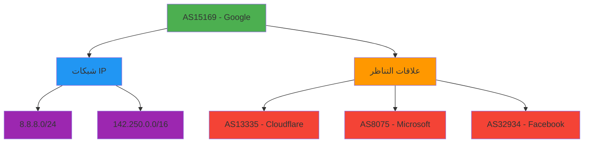

# مرجع نوع `ASNResponse`

> **الغرض:** مرجع شامل لـ interface الـ `ASNResponse` التي تمثّل بيانات تسجيل نظام مستقل (ASN) المُطبَّعة في RDAP
> **ذو صلة:** [واجهة برمجة RDAPClient](../client.md) | [أسلوب ASN](../methods/asn.md) | [نوع Entity](entity.md) | [استجابة IP](ip-response.md)
> **وقت القراءة:** 6 دقائق

---

## تعريف النوع

```typescript
interface ASNResponse extends CoreResponse {
  // معلومات ASN الأساسية
  asn: number;
  handle: string;
  name?: string;
  description?: string;
  rawHandle?: string;

  // معلومات المنظمة والكيانات
  entities: {
    registrant?: Entity;
    technicalContact?: Entity;
    administrativeContact?: Entity;
    abuseContact?: Entity;
  };

  // معلومات الشبكة
  ipRanges: string[];              // نطاقات CIDR المرتبطة بهذا الـ ASN
  country: string;                 // رمز الدولة بحرفين (ISO 3166-1)
  countryName?: string;            // الاسم الكامل للدولة
  parentHandle?: string;           // معرّف تخصيص ASN الأم

  // معلومات RIR
  rir: 'arin' | 'ripencc' | 'apnic' | 'lacnic' | 'afrinic';

  // أحداث التسجيل
  events: Array<{
    action: 'registration' | 'last changed' | 'reassignment' | 'transfer';
    date: string;                 // تنسيق ISO 8601
    timestamp: number;            // طابع زمني Unix بالميلي ثانية
    actor?: string;               // معرّف الكيان المسؤول عن التغيير
  }>;

  // علاقات التناظر (إذا كان includePeers: true)
  peers?: Array<{
    asn: number;
    handle: string;
    relationship: 'customer' | 'provider' | 'peer' | 'sibling' | 'transit';
    description?: string;
    asPath?: string[];            // معلومات مسار AS إن توفرت
  }>;

  // البيانات الوصفية ذات الصلة بالأمان
  abuseEmail?: string;             // بريد إلكتروني مباشر للإبلاغ عن الإساءة
  whoisServer?: string;            // خادم WHOIS بديل إذا كان RDAP غير متاح
  routingPolicy?: string;          // معلومات سياسة توجيه BGP
  delegatedStatus?: 'allocated' | 'assigned' | 'sub-allocated';

  // البيانات الوصفية
  _meta: {
    registry: string;              // معرّف RIR (مثل 'arin')
    sourceUrl: string;             // عنوان URL الأصلي لنقطة نهاية RDAP
    queryTime: number;             // مدة الاستعلام بالميلي ثانية
    cached: boolean;               // هل جاءت النتيجة من التخزين المؤقت
    redacted: boolean;             // هل جرى إخفاء البيانات الشخصية
    schemaVersion: string;         // إصدار مخطط RDAP
    allocationType: 'direct' | 'indirect' | 'legacy';
    networkCount: number;          // عدد شبكات IP في هذا الـ ASN
    rawResponse?: any;             // استجابة RDAP الخام (فقط إذا كان includeRaw: true)
  };
}
```

---

## مرجع الخصائص

### خصائص ASN الأساسية
| الخاصية | النوع | مطلوبة | الوصف | مثال |
|----------|------|----------|-------------|---------|
| `asn` | `number` | نعم | رقم النظام المستقل (16-بت أو 32-بت) | `15169`، `13335` |
| `handle` | `string` | نعم | المعرّف/المعرِّف المُخصَّص من السجل | `'GOGL'`، `'CLOUDFLARENET'` |
| `name` | `string` | لا | اسم المنظمة المرتبطة بالـ ASN | `'Google LLC'`، `'Cloudflare, Inc.'` |
| `description` | `string` | لا | حقل وصف الـ ASN | `'Google Global ASN'` |
| `rawHandle` | `string` | لا | المعرّف الخام من السجل (قبل التطبيع) | `'AS15169'` |

### خصائص الكيانات
تحتوي استجابات ASN على كيانات متعددة بأدوار مختلفة:
```typescript
entities: {
  registrant?: Entity;               // المنظمة الأساسية التي سجّلت الـ ASN
  technicalContact?: Entity;         // جهة الاتصال التقنية لعمليات الشبكة
  administrativeContact?: Entity;   // جهة الاتصال الإدارية للتسجيل
  abuseContact?: Entity;             // جهة الاتصال للإساءة (حاسمة للإبلاغ الأمني)
}
```

> **ملاحظة حول الخصوصية:** عند تفعيل `privacy: true` (الافتراضي)، تُخفى بيانات الكيانات الشخصية تلقائياً:
> ```json
> {
>   "entities": {
>     "technicalContact": {
>       "name": "REDACTED",
>       "email": "REDACTED@redacted.invalid",
>       "phone": "REDACTED"
>     },
>     "abuseContact": {
>       "name": "REDACTED",
>       "email": "network-abuse@google.com",
>       "phone": "REDACTED"
>     }
>   }
> }
> ```

### خصائص الشبكة
```typescript
ipRanges: string[];                // نطاقات CIDR المرتبطة بهذا الـ ASN
country: string;                   // رمز الدولة بحرفين (ISO 3166-1)
countryName?: string;              // الاسم الكامل للدولة
parentHandle?: string;             // معرّف تخصيص ASN الأم (إن وُجد)
```

### معلومات RIR
```typescript
rir: 'arin' | 'ripencc' | 'apnic' | 'lacnic' | 'afrinic';
```
- **ARIN**: أمريكا الشمالية
- **RIPE NCC**: أوروبا، الشرق الأوسط، آسيا الوسطى
- **APNIC**: آسيا والمحيط الهادئ
- **LACNIC**: أمريكا اللاتينية والكاريبي
- **AFRINIC**: أفريقيا

### خصائص الأحداث
تتتبع أحداث تسجيل ASN التغييرات في دورة الحياة:
```typescript
events: Array<{
  action: 'registration' | 'last changed' | 'reassignment' | 'transfer';
  date: string;                    // سلسلة تاريخ ISO 8601 (مثل '2000-03-30T00:00:00Z')
  timestamp: number;               // طابع زمني Unix بالميلي ثانية
  actor?: string;                  // معرّف الكيان المسؤول عن التغيير
}>
```

**أنواع الأحداث الشائعة:**
- `registration`: التخصيص الأولي للـ ASN
- `last changed`: آخر تعديل على بيانات الـ ASN
- `reassignment`: إعادة تعيين الـ ASN لمنظمة مختلفة
- `transfer`: نقل الـ ASN بين المنظمات

### علاقات التناظر
```typescript
peers?: Array<{
  asn: number;                     // رقم الـ ASN المتناظر
  handle: string;                  // معرّف السجل للمتناظر
  relationship: 'customer' | 'provider' | 'peer' | 'sibling' | 'transit';
  description?: string;            // وصف إضافي للعلاقة
  asPath?: string[];               // معلومات مسار AS إن توفرت
}>
```

**أنواع العلاقات:**
- `customer`: ASN عميل مصب
- `provider`: ASN مزوّد مصدر
- `peer`: ASN متناظر متكافئ (تناظر بدون تسوية)
- `sibling`: ASN ذو صلة تحت نفس المنظمة
- `transit`: ASN مزوّد عبور

### الخصائص الأمنية
```typescript
abuseEmail?: string;               // بريد إلكتروني مباشر للإبلاغ عن الإساءة
whoisServer?: string;              // خادم WHOIS بديل
routingPolicy?: string;            // معلومات سياسة توجيه BGP
delegatedStatus?: 'allocated' | 'assigned' | 'sub-allocated';
```

### خصائص البيانات الوصفية
```typescript
_meta: {
  registry: string;                // معرّف RIR (مثل 'arin')
  sourceUrl: string;               // عنوان URL الأصلي لنقطة نهاية RDAP
  queryTime: number;               // مدة الاستعلام بالميلي ثانية
  cached: boolean;                 // هل جاءت النتيجة من التخزين المؤقت
  redacted: boolean;               // هل جرى إخفاء البيانات الشخصية
  schemaVersion: string;           // إصدار مخطط RDAP
  allocationType: 'direct' | 'indirect' | 'legacy'; // نوع التخصيص
  networkCount: number;            // عدد شبكات IP في هذا الـ ASN
  rawResponse?: any;               // استجابة RDAP الخام (فقط إذا كان includeRaw: true)
}
```

---

## اعتبارات الخصوصية والأمان

### اعتبارات الخصوصية الخاصة بـ ASN
تكشف بيانات تسجيل ASN تفاصيل بنية الإنترنت الحرجة التي تتطلب معالجة دقيقة:



**قواعد الإخفاء المُطبَّقة:**
- **جهات الاتصال الفردية** → إخفاء كامل إذا كانت شخصية
- **جهات الاتصال التجارية** → الحفاظ على البريد الإلكتروني، إخفاء الأسماء/الهواتف
- **التفاصيل التقنية** → محفوظة بالسياق المناسب
- **نطاقات الشبكة** → محفوظة بالكامل (بيانات البنية التحتية)
- **علاقات التناظر** → مُخفاة للشبكات الخاصة
- **المعرّفات التنظيمية** → محفوظة (معرّفات تقنية غير شخصية)

### نمذجة التهديدات الأمنية
يمكن استخدام بيانات ASN من قِبل المدافعين والمهاجمين على حدٍّ سواء:

| التهديد | التأثير | التخفيف |
|--------|--------|------------|
| **الاستطلاع على الشبكة** | تحديد البنية التحتية التنظيمية | تحديد عمق علاقات ASN، تحديد معدل الطلبات |
| **التحضير لاختطاف BGP** | استهداف الـ ASNs الضعيفة للهجمات | مراقبة تغييرات ASN، التنبيه عند النقل |
| **رسم خريطة سلسلة التوريد** | تحديد تبعيات البنية التحتية الحرجة | إخفاء علاقات التناظر الحساسة |
| **تحديد أهداف هجمات الحرمان من الخدمة** | إيجاد البنية التحتية للشبكة الحرجة | تنفيذ ضوابط الوصول لبيانات ASN |

> **ملاحظة أمنية حاسمة:** تكشف بيانات تسجيل ASN تفاصيل بنية الإنترنت الحرجة. حافظ دائماً على `privacy: true` وقيّد الوصول إلى موظفي الأمن وعمليات الشبكة المعتمدين فقط. لا تكشف أبداً عن بيانات تسجيل ASN غير مُخفاة في تطبيقات العملاء دون أساس قانوني صريح وموافقة مسؤول حماية البيانات.

---

## أمثلة الاستخدام

### استرداد معلومات ASN الأساسية
```typescript
import { RDAPClient, ASNResponse } from 'rdapify';

const client = new RDAPClient({ privacy: true });

async function getASNInfo(asn: number): Promise<void> {
  try {
    const result: ASNResponse = await client.asn(asn);

    // معلومات ASN الأساسية
    console.log(`ASN: AS${result.asn}`);
    console.log(`Organization: ${result.entities.registrant?.name || 'REDACTED'}`);
    console.log(`Country: ${result.countryName || result.country}`);

    // نطاقات IP
    console.log(`Network Ranges (${result.ipRanges.length}):`);
    result.ipRanges.slice(0, 5).forEach(range => {
      console.log(`- ${range}`);
    });
    if (result.ipRanges.length > 5) {
      console.log(`... و${result.ipRanges.length - 5} نطاق إضافي`);
    }

    // جهة الاتصال الأمنية
    if (result.entities.abuseContact?.email) {
      console.log(`Abuse Contact: ${result.entities.abuseContact.email}`);
    }

    // تاريخ التسجيل
    const registration = result.events.find(e => e.action === 'registration');
    if (registration) {
      console.log(`Registered: ${new Date(registration.date).toLocaleDateString()}`);
    }
  } catch (error) {
    console.error(`Failed to retrieve ASN info for AS${asn}:`, error.message);
  }
}

// الاستخدام
getASNInfo(15169); // Google
```

### النمط المتقدم: مراقبة أمان BGP
```typescript
// نظام مراقبة أمان BGP
async function monitorASNForSecurity(asn: number): Promise<ASNSecurityReport> {
  try {
    const result = await client.asn(asn, {
      privacy: true,
      includePeers: true,
      relationshipDepth: 2,
      priority: 'critical' // أولوية أعلى للمراقبة الأمنية
    });

    // تحليل الـ ASN بحثاً عن مخاطر أمنية
    const risks = [];

    // فحص عمليات النقل الأخيرة (مؤشر محتمل على الاختطاف)
    const recentTransfers = result.events.filter(e =>
      e.action === 'transfer' &&
      Date.now() - new Date(e.date).getTime() < 30 * 86400000 // 30 يوماً
    );

    if (recentTransfers.length > 0) {
      risks.push({
        type: 'recent-transfer',
        severity: 'high',
        details: `${recentTransfers.length} نقل في آخر 30 يوماً`
      });
    }

    // فحص غياب جهة اتصال الإساءة (مخاطرة أمنية)
    if (!result.entities.abuseContact || !result.entities.abuseContact.email) {
      risks.push({
        type: 'missing-abuse-contact',
        severity: 'medium',
        details: 'لا تتوفر جهة اتصال للإبلاغ الأمني'
      });
    }

    // فحص علاقات التناظر بحثاً عن أنماط مشبوهة
    const peerAnalysis = analyzePeeringRelationships(result.peers || []);

    return {
      asn,
      organization: result.entities.registrant?.name,
      country: result.country,
      networkCount: result.ipRanges.length,
      risks,
      peerAnalysis,
      lastUpdated: new Date().toISOString(),
      recommendation: generateSecurityRecommendation(risks)
    };
  } catch (error) {
    if (error.code === 'RDAP_NOT_FOUND') {
      return {
        asn,
        status: 'unallocated',
        riskScore: 95, // ASNs غير المُخصَّصة ذات مخاطرة عالية
        recommendation: 'حجب حركة المرور من هذا الـ ASN - غير مُخصَّص'
      };
    }
    throw error;
  }
}

// الاستخدام في خط الأنابيب الأمني لـ BGP
const securityReport = await monitorASNForSecurity(15169);
if (securityReport.risks.length > 0) {
  await alertSecurityTeam(securityReport);
}
```

---

## الأنواع ذات الصلة

### الأنواع الأساسية
| النوع | العلاقة | الوصف |
|------|--------------|-------------|
| [`Entity`](entity.md) | تركيب | يمثّل المنظمات أو الأفراد المرتبطين بالـ ASN |
| [`Network`](network.md) | تركيب | هيكل البنية التحتية للشبكة المستخدم في نطاقات IP |
| [`Contact`](contact.md) | تركيب | معلومات الاتصال داخل الكيانات |
| [`Event`](event.md) | تركيب | تنسيق الحدث القياسي المستخدم في مصفوفة الأحداث |

### أنواع الاستجابة
| النوع | العلاقة | الوصف |
|------|--------------|-------------|
| [`IPResponse`](ip-response.md) | مكمّل | بيانات تسجيل عنوان IP للشبكات داخل الـ ASN |
| [`DomainResponse`](domain-response.md) | مكمّل | بيانات تسجيل النطاق للنطاقات المستضافة على شبكات ASN |
| [`RawRDAPResponse`](raw-response.md) | أصل | هيكل استجابة RDAP الخام العام الذي يُطبَّع |

---

## اعتبارات الأداء

### أنماط استخدام الذاكرة
نوع `ASNResponse` له خصائص ذاكرة يمكن التنبؤ بها:
- **استجابة صغيرة** (بيانات ASN أساسية): ~1.8 كيلوبايت
- **استجابة قياسية** (مع جهات الاتصال والأحداث): ~4.5 كيلوبايت
- **مع التناظر** (10 علاقات تناظر): ~8 كيلوبايت
- **استجابة كاملة** (مع البيانات الخام والعلاقات): ~15-20 كيلوبايت

### استراتيجيات التحسين
```typescript
// حسن: طلب الحقول الضرورية فقط للمسارات الحرجة
const lightweightResult = await client.asn(15169, {
  normalization: {
    fields: ['asn', 'name', 'ipRanges', 'country']
  }
});

// حسن: تعطيل التناظر عند عدم الحاجة إليه
const fastResult = await client.asn(15169, {
  includePeers: false,
  relationshipDepth: 0
});

// حسن: معالجة دُفعية لعمليات البحث عن ASN
const asns = [15169, 13335, 8075, 32934];
const results = await Promise.all(asns.map(asn =>
  client.asn(asn, { priority: 'low', timeout: 5000 })
));
```

### إستراتيجية التخزين المؤقت لبيانات ASN
```typescript
// حسن: تخزين مؤقت تكيّفي بناءً على استقرار ASN
const client = new RDAPClient({
  cache: {
    ttl: {
      default: 86400 * 7,        // 7 أيام لمعظم الـ ASNs (تغييرات نادرة)
      criticalInfrastructure: 3600, // ساعة واحدة للبنية التحتية الحرجة
      securityMonitored: 300      // 5 دقائق للـ ASNs الخاضعة للمراقبة الأمنية
    },
    max: 5000,                   // تخزين مؤقت لـ 5,000 سجل ASN
    redactBeforeStore: true      // إخفاء دائم قبل التخزين
  }
});
```

---

## أنماط الاختبار

### اختبار الوحدة مع استجابات وهمية
```typescript
// استجابة ASNResponse وهمية للاختبار
const mockASNResponse: ASNResponse = {
  asn: 15169,
  handle: 'GOGL',
  name: 'Google LLC',
  description: 'Google Global ASN',
  entities: {
    registrant: {
      name: 'Google LLC',
      handle: 'GOGL',
      roles: ['registrant'],
      country: 'US'
    },
    abuseContact: {
      name: 'REDACTED',
      email: 'network-abuse@google.com',
      phone: 'REDACTED'
    }
  },
  ipRanges: ['8.8.8.0/24', '8.8.4.0/24', '142.250.0.0/16'],
  country: 'US',
  countryName: 'United States',
  rir: 'arin',
  events: [
    {
      action: 'registration',
      date: '2000-03-30T00:00:00Z',
      timestamp: 954345600000
    },
    {
      action: 'last changed',
      date: '2023-01-15T08:23:45Z',
      timestamp: 1673769825000
    }
  ],
  peers: [
    {
      asn: 13335,
      handle: 'CLOUDFLARENET',
      relationship: 'peer',
      description: 'Cloudflare peering relationship'
    },
    {
      asn: 8075,
      handle: 'MICROSOFT',
      relationship: 'peer',
      description: 'Microsoft peering relationship'
    }
  ],
  _meta: {
    registry: 'arin',
    sourceUrl: 'https://rdap.arin.net/registry/asn/15169',
    queryTime: 210,
    cached: false,
    redacted: true,
    schemaVersion: '1.0',
    allocationType: 'direct',
    networkCount: 128
  }
};

// حالة اختبار باستخدام البيانات الوهمية
test('processes ASN registration date correctly', () => {
  const registrationEvent = mockASNResponse.events.find(e => e.action === 'registration');
  expect(registrationEvent).toBeDefined();
  expect(new Date(registrationEvent!.date).getFullYear()).toBe(2000);
});
```

---

## الامتثال للبروتوكول

### معايير RFC المُنفَّذة
- **RFC 7483**: استجابات JSON لـ RDAP
- **RFC 7484**: إيجاد خادم RDAP المعتمد
- **RFC 6960**: بيانات تسجيل ASN
- **RFC 7300**: تخصيصات ASN لأغراض خاصة
- **RFC 7482**: تنسيق استعلام عنوان IP (لنطاقات الشبكة)

### السلوك الخاص بـ RIR
تُطبّق سجلات الإنترنت الإقليمية المختلفة RDAP الخاص بـ ASN بتنوعات:

| RIR | المعالجة الخاصة | خصائص البيانات |
|-----|------------------|----------------------|
| **ARIN** (أمريكا الشمالية) | بيانات تناظر غنية، معلومات اتصال تفصيلية | جهات اتصال إساءة واسعة، تخصيصات شبكة تفصيلية |
| **RIPE NCC** (أوروبا) | متوافق مع GDPR افتراضياً، بيانات شخصية محدودة | رسم خرائط علاقات شبكة قوي، تاريخ تخصيص شامل |
| **APNIC** (آسيا والمحيط الهادئ) | متطلبات امتثال خاصة بالدولة | تاريخ تفويض تفصيلي، جهات اتصال إساءة قوية مع إخفاء |
| **LACNIC** (أمريكا اللاتينية) | دعم متعدد اللغات | معلومات اتصال شاملة مع ضوابط الخصوصية |
| **AFRINIC** (أفريقيا) | قيود الموارد تؤثر على الأداء | هيكل بيانات مبسط لكن كامل مع تركيز أمني |

### تطبيع تنسيق ASN
تُطبّع RDAPify تنسيقات ASN تلقائياً:
```typescript
// جميع الاستعلامات التالية متكافئة
await client.asn(15169);
await client.asn('15169');
await client.asn('AS15169');
await client.asn('as15169');
await client.asn(0x3B41); // التنسيق الست عشري (15169 بالست عشري)
```

---

## مواصفات النوع

| الخاصية | القيمة |
|----------|-------|
| **إصدار النوع** | 2.3.0 |
| **امتثال RFC** | سلسلة RFC 7480 |
| **تغطية RIR** | ARIN, RIPE NCC, APNIC, LACNIC, AFRINIC |
| **دعم تنسيق ASN** | نعم (16-بت من 0 إلى 65535) و(32-بت من 0 إلى 4294967295) |
| **دعم بيانات التناظر** | نعم (يعتمد على السجل) |
| **دعم التخزين المؤقت** | نعم (في الذاكرة، Redis، محوّلات مخصصة) |
| **دعم العمل دون إنترنت** | نعم (مع ضوابط القِدَم) |
| **متوافق مع GDPR** | نعم (مع privacy: true) |
| **متوافق مع CCPA** | نعم (مع privacy: true) |
| **آخر تحديث** | 5 ديسمبر 2025 |

> **تذكير حاسم:** تكشف بيانات تسجيل ASN تفاصيل بنية الإنترنت الحرجة التي يمكن للمهاجمين استغلالها في الاستطلاع على الشبكة والهجمات المستهدفة. نفّذ دائماً ضوابط وصول صارمة، وحافظ على إخفاء البيانات الشخصية، وقيّد عرض بيانات ASN لموظفي الأمن المعتمدين. لا تكشف أبداً عن بيانات تسجيل ASN غير مُخفاة في تطبيقات العملاء دون أساس قانوني صريح وموافقة مسؤول حماية البيانات.

[العودة إلى مرجع الأنواع](index.md) | [التالي: نوع Contact](contact.md)

*مستند مُولَّد تلقائياً من الكود المصدري مع مراجعة أمنية في 28 نوفمبر 2025*
