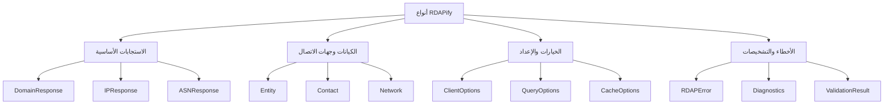

# فهرس مرجع الأنواع

> **الغرض:** مرجع شامل لجميع أنواع TypeScript وinterfaces المستخدمة في مكتبة RDAPify
> **ذو صلة:** [واجهة برمجة العميل](../client.md) | [أسلوب domain](../methods/domain.md) | [أسلوب ip](../methods/ip.md) | [أسلوب asn](../methods/asn.md)
> **وقت القراءة:** 3 دقائق

---

## نظرة عامة على نظام الأنواع

صُمِّم نظام الأنواع في RDAPify حول **ثلاثة مبادئ أساسية**:
- **سلامة الأنواع**: TypeScript interfaces صارمة تمنع أخطاء وقت التشغيل
- **الخصوصية بالافتراض**: الأنواع تعكس حدود إخفاء البيانات الشخصية والامتثال
- **امتثال البروتوكول**: الأنواع تعكس مواصفات RDAP RFC مع تسمية دقيقة للحقول

نظام الأنواع مُنظَّم في **أربع فئات رئيسية**:



---

## مرجع فئات الأنواع

### الاستجابات الأساسية
أنواع تمثّل استجابات استعلام RDAP المُطبَّعة

| النوع | الوصف | التوثيق |
|------|-------------|---------------|
| `DomainResponse` | بيانات تسجيل النطاق المُطبَّعة | [domain-response.md](./domain-response.md) |
| `IPResponse` | بيانات تسجيل عنوان IP المُطبَّعة | [ip-response.md](./ip-response.md) |
| `ASNResponse` | بيانات نظام مستقل مُطبَّعة | [asn-response.md](./asn-response.md) |
| `BootstrapResponse` | استجابة خدمة IANA Bootstrap | [bootstrap-response.md](./bootstrap-response.md) |
| `RawRDAPResponse` | هيكل استجابة RDAP الخام العام | [raw-response.md](./raw-response.md) |

### الكيانات وجهات الاتصال
أنواع للمنظمات والأفراد ومعلومات الاتصال

| النوع | الوصف | التوثيق |
|------|-------------|---------------|
| `Entity` | كيان عام (منظمة/فرد) | [entity.md](./entity.md) |
| `Contact` | معلومات الاتصال مع معالجة البيانات الشخصية | [contact.md](./contact.md) |
| `Network` | معلومات تخصيص الشبكة والتوجيه | [network.md](./network.md) |
| `Registrar` | تمثيل مشغّل السجل | [registrar.md](./registrar.md) |
| `Relationship` | البيانات الوصفية لعلاقة الكيان | [relationship.md](./relationship.md) |

### الخيارات والإعداد
أنواع لإعداد العميل وخيارات الاستعلام

| النوع | الوصف | التوثيق |
|------|-------------|---------------|
| `ClientOptions` | خيارات مُنشئ RDAPClient | [client-options.md](./client-options.md) |
| `DomainQueryOptions` | خيارات خاصة باستعلام النطاق | [domain-options.md](./domain-options.md) |
| `IPQueryOptions` | خيارات خاصة باستعلام IP | [ip-options.md](./ip-options.md) |
| `ASNQueryOptions` | خيارات خاصة باستعلام ASN | [asn-options.md](./asn-options.md) |
| `CacheOptions` | معاملات إعداد التخزين المؤقت | [cache-options.md](./cache-options.md) |
| `SecurityOptions` | إعداد الأمان والخصوصية | [security-options.md](./security-options.md) |

### الأخطاء والتشخيصات
أنواع لمعالجة الأخطاء والمعلومات التشخيصية

| النوع | الوصف | التوثيق |
|------|-------------|---------------|
| `RDAPError` | هيكل خطأ RDAP المُوحَّد | [errors.md](./errors.md) |
| `Diagnostics` | تشخيصات الاستعلام ومقاييس الأداء | [diagnostics.md](./diagnostics.md) |
| `ValidationResult` | نتائج التحقق من صحة المخطط | [validation-result.md](./validation-result.md) |
| `SSRFAttempt` | اكتشاف تزوير الطلبات من جانب الخادم | [ssrf-attempt.md](./ssrf-attempt.md) |
| `ComplianceWarning` | تحذيرات الخصوصية والامتثال | [compliance-warning.md](./compliance-warning.md) |

### أنواع العلاقات
أنواع لرسم خرائط العلاقات بين الكيانات

| النوع | الوصف | التوثيق |
|------|-------------|---------------|
| `RelationshipGraph` | هيكل رسم بياني لعلاقات الكيانات | [relationship-graph.md](./relationship-graph.md) |
| `NetworkHierarchy` | تسلسل هرمي لتخصيص شبكة IP | [network-hierarchy.md](./network-hierarchy.md) |
| `PeeringRelationship` | علاقات التناظر والتوجيه لـ ASN | [peering-relationship.md](./peering-relationship.md) |
| `DomainPortfolio` | رسم خريطة ملكية النطاقات المرتبطة | [domain-portfolio.md](./domain-portfolio.md) |

---

## أنماط تركيب الأنواع

### الأنماط الشائعة للأنواع
```typescript
// حسن: نمط النوع التركيبي
interface DomainResponse extends CoreResponse {
  domain: string;
  nameservers: Array<NetworkEndpoint>; // نوع شبكة قابل لإعادة الاستخدام
  events: Array<Event>; // نوع حدث مُوحَّد
  entities: Record<EntityRole, Entity>; // رسم خريطة كيانات قائمة على الدور
}

// حسن: نمط النوع المحافظ على الخصوصية
type RedactedContact = Contact & {
  name: 'REDACTED' | string; // union type لحالات الإخفاء
  email: `REDACTED@redacted.invalid` | string;
  phone: 'REDACTED' | string;
  address: Array<'REDACTED' | string>;
};

// حسن: نمط النوع المتوافق مع البروتوكول
interface RDAPEvent {
  action: 'registration' | 'last changed' | 'expiration' | 'deletion'; // قيم متوافقة مع RFC
  date: ISO8601String; // نوع سلسلة مخصص للتواريخ بتنسيق ISO
  actor?: EntityHandle; // مرجع الفاعل الاختياري
}
```

### أدوات الأنواع المتقدمة
```typescript
// أدوات تركيب الأنواع
type WithMetadata<T> = T & {
  _metadata: {
    registry: string;
    queryTime: number;
    cached: boolean;
    redacted: boolean;
  };
};

// تحويل النوع المحافظ على الخصوصية
type RedactPII<T> = {
  [P in keyof T]: T[P] extends Contact
    ? RedactedContact
    : T[P] extends Array<infer U>
      ? U extends Contact
        ? Array<RedactedContact>
        : Array<U>
      : T[P];
};

// مثال الاستخدام
type SafeDomainResponse = RedactPII<DomainResponse>;
```

---

## أنواع الأمان والامتثال

### تصميم الأنواع بالخصوصية أولاً
صُمِّمت أنواع RDAPify مع مراعاة حدود الخصوصية:

```typescript
interface PrivacySettings {
  redactPII: boolean;           // مفتاح تبديل إخفاء البيانات الشخصية العام
  redactionLevel: 'basic' | 'strict' | 'enterprise'; // تحكم دقيق
  preserveBusinessContacts: boolean; // الإبقاء على رسائل البريد الإلكتروني التجارية ظاهرة
  anonymizeForAnalytics: boolean;   // إخفاء هوية إضافي لبيانات القياس عن بُعد
}

interface ComplianceMetadata {
  gdprCompliant: boolean;       // حالة الامتثال لـ GDPR المادة 6
  ccpaReady: boolean;           // الاستعداد لـ CCPA/CPRA
  dataRetentionDays: number;    // فترة انتهاء صلاحية البيانات التلقائية
  lawfulBasis: 'consent' | 'contract' | 'legitimate-interest' | 'legal-obligation';
  dataSubjectRights: {
    access: boolean;
    rectification: boolean;
    erasure: boolean;
    portability: boolean;
  };
}
```

### أنواع حدود الأمان
```typescript
// أنواع حماية SSRF
interface SSRFProtection {
  blockPrivateIPs: boolean;     // نطاقات RFC 1918
  blockCloudMetadata: boolean;  // نقاط نهاية بيانات تعريف AWS/Azure/GCP
  allowedIPRanges?: string[];   // النطاقات المُدرجة في القائمة البيضاء
  blockedDomains?: string[];    // النطاقات المُدرجة في القائمة السوداء
}

// أنواع التحقق من الشهادة
interface CertificateValidation {
  minTLSVersion: 'TLSv1.2' | 'TLSv1.3';
  pinCertificates?: Record<string, string[]>; // {hostname: [sha256 pins]}
  rejectUnauthorized: boolean;
  trustedCAs?: string[]; // شهادات CA بتنسيق PEM
}
```

---

## أنماط استيراد الأنواع

### أنماط الاستيراد الموصى بها
```typescript
// حسن: استيراد أنواع محددة (مناسب لـ tree-shaking)
import type { DomainResponse, Contact } from 'rdapify/types';

// حسن: استيراد جميع الأنواع من فئة
import type * as EntityTypes from 'rdapify/types/entities';

// حسن: الاستيراد مع التسمية البديلة للوضوح
import type { DomainResponse as RDAPDomain } from 'rdapify/types';

// تجنب: استيراد جميع الأنواع إلا عند الضرورة
import type * as RDAPTypes from 'rdapify/types';
```

### توسيع الأنواع
للتوسعات والإضافات المخصصة:
```typescript
// توسيع الأنواع الموجودة بالدمج التصريحي
declare module 'rdapify/types' {
  interface DomainResponse {
    _customExtension?: {
      riskScore: number;
      securityTags: string[];
    };
  }

  interface ClientOptions {
    customAnalyzers?: Array<(response: any) => any>;
  }
}
```

---

## الاختبار مع الأنواع

### أنماط الاختبار المدفوع بالأنواع
```typescript
// اختبار صحة الأنواع مع Jest
import { DomainResponse } from 'rdapify/types';

test('domain response matches type contract', () => {
  const mockResponse: DomainResponse = {
    domain: 'example.com',
    nameservers: [{ hostname: 'ns1.example.com' }],
    events: [{
      action: 'registration',
      date: '1995-08-14T04:00:00Z'
    }],
    registrar: {
      name: 'REDACTED',
      email: 'REDACTED@redacted.invalid'
    }
  };

  expect(mockResponse).toHaveProperty('domain');
  expect(mockResponse.registrar).toHaveProperty('name', 'REDACTED');
});

// اختبار حارس النوع
function isDomainResponse(data: any): data is DomainResponse {
  return data && typeof data.domain === 'string' && Array.isArray(data.nameservers);
}

test('type guard correctly validates domain responses', () => {
  expect(isDomainResponse({ domain: 'example.com', nameservers: [] })).toBe(true);
  expect(isDomainResponse({ invalid: 'structure' })).toBe(false);
});
```

### اختبار التشويش مع الأنواع
```typescript
import { fc } from 'fast-check';
import { DomainResponse } from 'rdapify/types';

// توليد بيانات عشوائية متوافقة مع هيكل النوع
fc.assert(
  fc.property(
    fc.record({
      domain: fc.domain(),
      nameservers: fc.array(fc.record({ hostname: fc.hostname() })),
      events: fc.array(fc.record({
        action: fc.constantFrom('registration', 'last changed', 'expiration'),
        date: fc.date().map(d => d.toISOString())
      }))
    }),
    (data) => {
      // يجب قبول البيانات الصالحة
      expect(isDomainResponse(data)).toBe(true);
    }
  )
);
```

---

## ميزات الأنواع المتقدمة

### الأنواع الشرطية للسلوك في وقت التشغيل
```typescript
// نوع يتغير بناءً على الخيارات
type ResponseType<T extends QueryOptions> =
  T['redactPII'] extends true
    ? RedactedDomainResponse
    : FullDomainResponse;

// الاستخدام
function queryDomain<T extends DomainQueryOptions>(
  domain: string,
  options: T
): Promise<ResponseType<T>> {
  // تفاصيل التنفيذ
}
```

### الأنواع القالبية للعمليات العامة
```typescript
// النوع العام للعمليات الدُفعية
type BatchResult<T> = {
  successful: Array<{ query: string; result: T }>;
  failed: Array<{ query: string; error: RDAPError }>;
  summary: {
    total: number;
    successRate: number;
    averageLatency: number;
  };
};

// الاستخدام مع أنواع استجابة مختلفة
type BatchDomainResult = BatchResult<DomainResponse>;
type BatchIPResult = BatchResult<IPResponse>;
```

### unions المُميَّزة لتنوعات البروتوكول
```typescript
// تنوعات الاستجابة الخاصة بالسجل
type RegistryResponse =
  | { registry: 'verisign'; version: '3.0'; data: VerisignDomainData }
  | { registry: 'arin'; version: '2.1'; data: ArinIPData }
  | { registry: 'ripe'; version: '1.2'; data: RIPEEntityData };

function processRegistryResponse(response: RegistryResponse) {
  switch (response.registry) {
    case 'verisign':
      // TypeScript يعلم أن response.data من نوع VerisignDomainData
      return processVerisign(response.data);
    case 'arin':
      return processARIN(response.data);
    // ...
  }
}
```

---

## التوثيق ذو الصلة

| المستند | الوصف | المسار |
|----------|-------------|------|
| **مرجع واجهة برمجة العميل** | التوثيق الكامل للـ API | [../client.md](../client.md) |
| **أسلوب domain** | تفاصيل تنفيذ استعلام النطاق | [../methods/domain.md](../methods/domain.md) |
| **الورقة البيضاء الأمنية** | تفاصيل نموذج أمان الأنواع | [../../security/whitepaper.md](../../security/whitepaper.md) |
| **ضوابط الخصوصية** | تنفيذ إخفاء البيانات الشخصية في الأنواع | [../privacy-controls.md](../privacy-controls.md) |
| **مسار التطبيع** | كيفية بناء الأنواع من الاستجابات الخام | [../../core-concepts/normalization.md](../../core-concepts/normalization.md) |
| **متجهات الاختبار** | بيانات اختبار قياسية للتحقق من الأنواع | [../../../test-vectors/](../../../test-vectors/) |

---

## أفضل ممارسات الأنواع

### المُوصى به
- استخدم أنواعاً محددة بدلاً من `any` أو `unknown` حيثما أمكن
- استفد من تركيب الأنواع على الوراثة
- استخدم الأنواع المُعلَّمة (branded types) لحدود التحقق
- وظّف حراس الأنواع للفحص في وقت التشغيل
- وثّق الأنواع المخصصة بتعليقات JSDoc

### ما يجب تجنبه
- تجنب إنشاء أنواع متداخلة معقدة بشكل مفرط
- لا تستخدم تأكيدات النوع (`as`) دون تحقق
- تجنب خلط بيانات البيانات الشخصية وغيرها في نفس النوع دون علامات الإخفاء
- لا تُعطّل الوضع الصارم لـ TypeScript من أجل راحة الأنواع

### الأنماط الخاصة بالأمان
```typescript
// حسن: نوع حد الخصوصية
type RedactionBoundary = {
  _isRedacted: true; // علامة لتضييق النوع
  [key: string]: any;
};

// حسن: نوع تثبيت الشهادة
type CertificatePin = {
  hostname: string;
  pins: Array<{
    algorithm: 'sha256' | 'sha1';
    hash: string;
    expires: Date;
  }>;
  enforce: boolean;
};
```

---

## معلومات الإصدار

| الخاصية | القيمة |
|----------|-------|
| **إصدار نظام الأنواع** | 2.3.0 |
| **الحد الأدنى لـ TypeScript** | 5.0 |
| **الوضع الصارم** | مُفعَّل (`strict: true`) |
| **فحص الأنواع** | كامل المشروع (`noUncheckedIndexedAccess: true`) |
| **تاريخ التوليد** | 5 ديسمبر 2025 |
| **امتثال RFC** | سلسلة RFC 7480 |

> **تذكير أمني:** توفر الأنواع سلامة في وقت التجميع لكنها لا تستطيع إلزام ضمانات الخصوصية أو الأمان في وقت التشغيل. تحقق دائماً من البيانات في وقت التشغيل، خاصةً عند اجتياز حدود الثقة. استخدم ميزات التحقق والإخفاء المدمجة في RDAPify بدلاً من الاعتماد فقط على أنواع TypeScript للأمان.

[العودة إلى مرجع API](../api-reference.md) | [التالي: أنواع استجابة النطاق](./domain-response.md)

*مستند مُولَّد تلقائياً من الكود المصدري مع مراجعة أمنية في 28 نوفمبر 2025*
