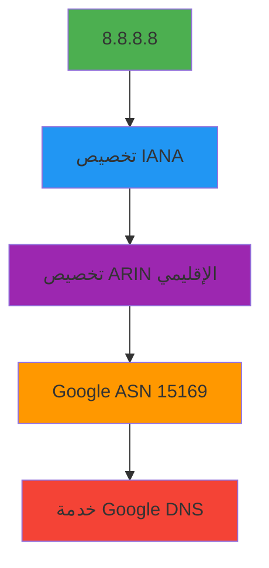

# مرجع نوع `IPResponse`

> **الغرض:** مرجع شامل لـ interface الـ `IPResponse` التي تمثّل بيانات تسجيل عنوان IP المُطبَّعة في RDAP
> **ذو صلة:** [واجهة برمجة RDAPClient](../client.md) | [أسلوب IP](../methods/ip.md) | [نوع Entity](entity.md) | [التسلسل الهرمي للشبكة](../guides/geo-caching.md)
> **وقت القراءة:** 6 دقائق

---

## تعريف النوع

```typescript
interface IPResponse extends CoreResponse {
  // معلومات IP الأساسية
  ip: string;
  cidr: string;
  type: 'ipv4' | 'ipv6';
  version: 4 | 6;
  startAddress: string;
  endAddress: string;
  prefixLength: number;

  // معلومات الشبكة
  name?: string;
  handle: string;
  country: string;
  countryName?: string;
  parentHandle?: string;
  rir: 'arin' | 'ripencc' | 'apnic' | 'lacnic' | 'afrinic';

  // علاقات الكيانات (مع إخفاء البيانات الشخصية افتراضياً)
  entities: {
    registrant?: Entity;
    technicalContact?: Entity;
    administrativeContact?: Entity;
    abuseContact?: Entity;
  };

  // أحداث التسجيل
  events: Array<{
    action: 'registration' | 'last changed' | 'delegation' | 'reassignment';
    date: string; // تنسيق ISO 8601
    timestamp: number; // طابع زمني Unix
    actor?: string;
  }>;

  // التسلسل الهرمي للشبكة
  hierarchy?: {
    parent?: IPResponse;
    children?: IPResponse[];
    siblings?: IPResponse[];
  };

  // البيانات الوصفية ذات الصلة بالأمان
  abuseEmail?: string;
  whoisServer?: string;
  routingPolicy?: string;
  delegatedStatus?: 'allocated' | 'assigned' | 'sub-allocated';

  // البيانات الوصفية للموقع الجغرافي (تقريبية)
  geolocation?: {
    region?: string;
    city?: string;
    coordinates?: [number, number]; // [خط العرض، خط الطول]
    accuracyRadius?: number; // بالكيلومترات
    source: 'registry' | 'geoip' | 'manual';
  };

  // البيانات الوصفية
  _meta: {
    registry: string; // مثل 'arin', 'ripe'
    sourceUrl: string; // عنوان URL الأصلي لنقطة نهاية RDAP
    queryTime: number; // مدة الاستعلام بالميلي ثانية
    cached: boolean; // هل جاءت النتيجة من التخزين المؤقت
    redacted: boolean; // هل جرى إخفاء البيانات الشخصية
    schemaVersion: string; // إصدار مخطط RDAP
    networkType: 'allocated' | 'assigned' | 'reserved';
    rawResponse?: any; // استجابة RDAP الخام (فقط إذا كان includeRaw: true)
  };
}
```

---

## مرجع الخصائص

### خصائص IP الأساسية
| الخاصية | النوع | مطلوبة | الوصف | مثال |
|----------|------|----------|-------------|---------|
| `ip` | `string` | نعم | تنسيق عنوان IP القانوني | `'8.8.8.8'`، `'2001:4860::8888'` |
| `cidr` | `string` | نعم | تدوين CIDR لكتلة الشبكة | `'8.8.8.0/24'`، `'2001:4860::/32'` |
| `type` | `'ipv4' \| 'ipv6'` | نعم | نوع إصدار IP | `'ipv4'`، `'ipv6'` |
| `version` | `4 \| 6` | نعم | رقم إصدار IP | `4`، `6` |
| `startAddress` | `string` | نعم | أول عنوان في النطاق (تنسيق عشري) | `'8.8.8.0'`، `'2001:4860::'` |
| `endAddress` | `string` | نعم | آخر عنوان في النطاق (تنسيق عشري) | `'8.8.8.255'`، `'2001:4860:0:ffff:ffff:ffff:ffff:ffff'` |
| `prefixLength` | `number` | نعم | طول بادئة الشبكة (CIDR) | `24`، `32` |

### خصائص الشبكة
```typescript
name?: string;          // اسم الشبكة (مثل 'GOOGLE-DNS')
handle: string;         // المعرّف المُخصَّص من السجل (مثل 'NET-8-8-8-0-1')
country: string;        // رمز الدولة بحرفين (ISO 3166-1)
countryName?: string;   // الاسم الكامل للدولة
parentHandle?: string;  // معرّف تخصيص الشبكة الأم
rir: 'arin' | 'ripencc' | 'apnic' | 'lacnic' | 'afrinic'; // سجل إنترنت إقليمي
```

### خصائص الكيانات
تحتوي استجابات IP على كيانات متعددة بأدوار محددة:
```typescript
entities: {
  registrant?: Entity;               // المنظمة التي سجّلت كتلة IP
  technicalContact?: Entity;         // جهة الاتصال التقنية لعمليات الشبكة
  administrativeContact?: Entity;   // جهة الاتصال الإدارية للتخصيص
  abuseContact?: Entity;             // جهة الاتصال للإساءة (حاسمة للإبلاغ الأمني)
}
```

> **ملاحظة حول الخصوصية:** عند تفعيل `privacy: true` (الافتراضي)، تُخفى بيانات الكيانات الشخصية تلقائياً:
> ```json
> {
>   "entities": {
>     "technicalContact": {
>       "name": "REDACTED",
>       "email": "REDACTED@redacted.invalid",
>       "phone": "REDACTED"
>     },
>     "abuseContact": {
>       "name": "REDACTED",
>       "email": "network-abuse@google.com",
>       "phone": "REDACTED"
>     }
>   }
> }
> ```

### خصائص الأحداث
تتتبع أحداث تسجيل IP تاريخ التخصيص:
```typescript
events: Array<{
  action: 'registration' | 'last changed' | 'delegation' | 'reassignment';
  date: string;            // سلسلة تاريخ ISO 8601 (مثل '2007-03-13T00:00:00Z')
  timestamp: number;       // طابع زمني Unix بالميلي ثانية
  actor?: string;          // معرّف الكيان المسؤول عن التغيير
}>
```

**أنواع الأحداث الشائعة:**
- `registration`: التخصيص الأولي لكتلة IP
- `last changed`: آخر تعديل على بيانات التخصيص
- `delegation`: تعيين لمنظمة مصب
- `reassignment`: نقل بين المنظمات

### خصائص التسلسل الهرمي
```typescript
hierarchy?: {
  parent?: IPResponse;      // التخصيص الأم (مثل كتلة /16 تحتوي على /24)
  children?: IPResponse[];  // التخصيصات الفرعية (شبكات فرعية أكثر تحديداً)
  siblings?: IPResponse[];  // التخصيصات المتشابهة في نفس مستوى التسلسل الهرمي
}
```

**مثال على التسلسل الهرمي:**
```
8.0.0.0/8 (ARIN)
├── 8.8.0.0/16 (Google)
│   ├── 8.8.4.0/24 (Google Public DNS)
│   └── 8.8.8.0/24 (Google Public DNS)
└── 8.9.0.0/16 (منظمة أخرى)
```

### خصائص الأمان والموقع الجغرافي
```typescript
// معلومات جهة الاتصال الأمنية
abuseEmail?: string;                   // بريد إلكتروني مباشر للإبلاغ عن الإساءة
whoisServer?: string;                  // خادم WHOIS بديل
routingPolicy?: string;                // سياسة توجيه BGP إن توفرت
delegatedStatus?: 'allocated' | 'assigned' | 'sub-allocated';

// بيانات الموقع الجغرافي التقريبي
geolocation?: {
  region?: string;                     // الولاية/المنطقة (مثل 'California')
  city?: string;                       // اسم المدينة (مثل 'Mountain View')
  coordinates?: [number, number];      // [خط العرض، خط الطول]
  accuracyRadius?: number;             // الدقة بالكيلومترات
  source: 'registry' | 'geoip' | 'manual'; // مصدر البيانات
}
```

> **ملاحظة حول الموقع الجغرافي:** بيانات الموقع الجغرافي المُقدَّمة من السجلات غالباً ما تقتصر على دقة مستوى الدولة. بيانات المدينة/المنطقة قد تكون تقريبية أو غير متاحة.

### خصائص البيانات الوصفية
```typescript
_meta: {
  registry: string;                    // معرّف RIR (مثل 'arin')
  sourceUrl: string;                   // عنوان URL الأصلي لنقطة نهاية RDAP
  queryTime: number;                   // مدة الاستعلام بالميلي ثانية
  cached: boolean;                     // هل جاءت النتيجة من التخزين المؤقت
  redacted: boolean;                   // هل جرى إخفاء البيانات الشخصية
  schemaVersion: string;               // إصدار مخطط RDAP
  networkType: 'allocated' | 'assigned' | 'reserved'; // نوع التخصيص
  rawResponse?: any;                   // استجابة RDAP الخام (فقط إذا كان includeRaw: true)
}
```

---

## اعتبارات الخصوصية والأمان

### اعتبارات الخصوصية الخاصة بـ IP
تكشف بيانات تسجيل IP تفاصيل البنية التحتية التنظيمية التي تتطلب معالجة دقيقة:



**قواعد الإخفاء المُطبَّقة:**
- **جهات الاتصال الفردية** → إخفاء كامل إذا كانت شخصية
- **جهات الاتصال التجارية** → الحفاظ على البريد الإلكتروني، إخفاء الأسماء/الهواتف
- **أسماء الشبكات** → محفوظة (معرّفات غير شخصية)
- **التفاصيل الجغرافية** → مقتصرة على مستوى الدولة افتراضياً
- **المعرّفات التنظيمية** → محفوظة (معرّفات تقنية غير شخصية)

### الوقاية من SSRF لاستعلامات IP
تتضمن عمليات البحث عن IP حماية معززة ضد تزوير الطلبات من جانب الخادم:

```typescript
// حماية مدمجة ضد عمليات بحث IP الخاصة
const result = await client.ip('192.168.1.1');
// يُلقي خطأ RDAP_SSRF_ATTEMPT — محجوب افتراضياً

// حماية ضد الوصول إلى خدمة البيانات الوصفية
const result = await client.ip('169.254.169.254');
// يُلقي خطأ RDAP_SSRF_ATTEMPT — محجوب افتراضياً
```

> **ملاحظة أمنية حاسمة:** يمكن أن تكشف بيانات تسجيل IP عن سطح هجوم تنظيمي. حافظ دائماً على `privacy: true` وقيّد التفاصيل الجغرافية بما يخدم حاجتك. لا تكشف أبداً عن بيانات تسجيل IP غير مُخفاة في تطبيقات العملاء دون أساس قانوني صريح وموافقة مسؤول حماية البيانات.

---

## أمثلة الاستخدام

### استرداد معلومات IP الأساسية
```typescript
import { RDAPClient, IPResponse } from 'rdapify';

const client = new RDAPClient({ privacy: true });

async function getIPInfo(ip: string): Promise<void> {
  try {
    const result: IPResponse = await client.ip(ip);

    // معلومات IP الأساسية
    console.log(`IP: ${result.ip}`);
    console.log(`Network: ${result.cidr}`);
    console.log(`Organization: ${result.entities.registrant?.name || 'REDACTED'}`);
    console.log(`Country: ${result.countryName || result.country}`);

    // جهة الاتصال الأمنية
    if (result.entities.abuseContact?.email) {
      console.log(`Abuse Contact: ${result.entities.abuseContact.email}`);
    }

    // التسلسل الهرمي للشبكة
    if (result.hierarchy?.parent) {
      console.log(`Parent Network: ${result.hierarchy.parent.cidr}`);
      console.log(`Parent Organization: ${result.hierarchy.parent.entities.registrant?.name || 'REDACTED'}`);
    }
  } catch (error) {
    console.error(`Failed to retrieve IP info for ${ip}:`, error.message);
  }
}

// الاستخدام
getIPInfo('8.8.8.8');
```

### النمط المتقدم: تحليل حدود الشبكة
```typescript
// إيجاد حدود تخصيص الشبكة للتقسيم الأمني
async function findNetworkBoundaries(ip: string): Promise<NetworkBoundary[]> {
  const result = await client.ip(ip, {
    includeNetworkHierarchy: true,
    relationshipDepth: 2
  });

  const boundaries: NetworkBoundary[] = [];

  // إضافة الشبكة الحالية
  boundaries.push({
    cidr: result.cidr,
    organization: result.entities.registrant?.name,
    country: result.country,
    level: 0
  });

  // إضافة الشبكات الأم
  let current = result.hierarchy?.parent;
  let level = 1;
  while (current && level <= 2) {
    boundaries.push({
      cidr: current.cidr,
      organization: current.entities.registrant?.name,
      country: current.country,
      level
    });
    current = current.hierarchy?.parent;
    level++;
  }

  return boundaries;
}

// الاستخدام لتوليد قواعد جدار الحماية
const boundaries = await findNetworkBoundaries('142.250.185.206');
console.log('Network hierarchy:');
boundaries.forEach(b => {
  console.log(`Level ${b.level}: ${b.cidr} - ${b.organization} (${b.country})`);
});
```

### نمط المراقبة الأمنية
```typescript
// نظام تقييم سمعة IP
async function getIPReputation(ip: string): Promise<IPReputation> {
  try {
    const ipData = await client.ip(ip, {
      privacy: true,
      priority: 'high' // أولوية أعلى للمراقبة الأمنية
    });

    // استخراج الإشارات ذات الصلة بالأمان
    const signals = {
      orgReputation: getOrganizationReputation(ipData.entities.registrant?.name),
      countryRisk: getCountryRiskScore(ipData.country),
      allocationAge: calculateAllocationAge(ipData.events),
      recentChanges: hasRecentChanges(ipData.events),
      abuseHistory: await checkAbuseHistory(ipData.entities.abuseContact?.email)
    };

    // حساب درجة المخاطرة الموزونة
    const riskScore = calculateRiskScore(signals);

    return {
      ip,
      cidr: ipData.cidr,
      organization: ipData.entities.registrant?.name,
      country: ipData.country,
      riskScore,
      confidence: 0.9, // ثقة عالية لبيانات السجل
      signals,
      lastUpdated: new Date().toISOString()
    };
  } catch (error) {
    if (error.code === 'RDAP_NOT_FOUND') {
      return {
        ip,
        riskScore: 95, // عناوين IP غير المُخصَّصة ذات مخاطرة عالية
        confidence: 0.8,
        reason: 'IP not found in registry databases'
      };
    }
    throw error;
  }
}

// الاستخدام في خط الأنابيب الأمني
const reputation = await getIPReputation('185.143.229.0');
if (reputation.riskScore > 80) {
  await blockIP(reputation.ip, `High risk score: ${reputation.riskScore}`);
}
```

---

## الأنواع ذات الصلة

### الأنواع الأساسية
| النوع | العلاقة | الوصف |
|------|--------------|-------------|
| [`Entity`](entity.md) | تركيب | يمثّل المنظمات أو الأفراد المرتبطين بتخصيص IP |
| [`Network`](network.md) | تركيب | هيكل البنية التحتية للشبكة المستخدم في التسلسل الهرمي |
| [`Contact`](contact.md) | تركيب | معلومات الاتصال داخل الكيانات |
| [`Event`](event.md) | تركيب | تنسيق الحدث القياسي المستخدم في مصفوفة الأحداث |

### أنواع الاستجابة
| النوع | العلاقة | الوصف |
|------|--------------|-------------|
| [`DomainResponse`](domain-response.md) | مكمّل | بيانات تسجيل النطاق، تُستخدم غالباً مع عمليات بحث IP لرسم خرائط البنية التحتية |
| [`ASNResponse`](asn-response.md) | مكمّل | بيانات نظام مستقل لتحليل التوجيه والملكية |
| [`RawRDAPResponse`](raw-response.md) | أصل | هيكل استجابة RDAP الخام العام الذي يُطبَّع |

---

## اعتبارات الأداء

### أنماط استخدام الذاكرة
نوع `IPResponse` له خصائص ذاكرة يمكن التنبؤ بها:
- **استجابة صغيرة** (بيانات IP أساسية): ~1.5 كيلوبايت
- **استجابة قياسية** (مع جهات الاتصال والأحداث): ~4 كيلوبايت
- **مع التسلسل الهرمي** (3 مستويات): ~12 كيلوبايت
- **استجابة كاملة** (مع البيانات الخام والعلاقات): ~20-25 كيلوبايت

### استراتيجيات التحسين
```typescript
// حسن: طلب الحقول الضرورية فقط للمسارات الحرجة من حيث الأداء
const lightweightResult = await client.ip('8.8.8.8', {
  normalization: {
    fields: ['cidr', 'country', 'entities.registrant.name']
  }
});

// حسن: تعطيل التسلسل الهرمي عند عدم الحاجة إليه
const fastResult = await client.ip('8.8.8.8', {
  includeNetworkHierarchy: false,
  relationshipDepth: 0
});

// حسن: استخدام تدوين CIDR لعمليات بحث الكتل
// استعلام واحد لكتلة الشبكة بالكامل
const blockResult = await client.ip('8.8.8.0/24');
```

### إستراتيجية التخزين المؤقت لبيانات IP
```typescript
// حسن: تخزين مؤقت تكيّفي بناءً على استقرار الشبكة
const client = new RDAPClient({
  cache: {
    ttl: {
      default: 86400,           // 24 ساعة لمعظم التخصيصات (تغييرات نادرة)
      infrastructure: 3600,     // ساعة واحدة للبنية التحتية الحرجة
      securityMonitored: 300     // 5 دقائق للـ IPs الخاضعة للمراقبة الأمنية
    },
    max: 10000,                 // تخزين مؤقت لـ 10,000 شبكة IP
    redactBeforeStore: true     // إخفاء دائم قبل التخزين
  }
});
```

---

## أنماط الاختبار

### اختبار الوحدة مع استجابات وهمية
```typescript
// استجابة IPResponse وهمية للاختبار
const mockIPResponse: IPResponse = {
  ip: '8.8.8.8',
  cidr: '8.8.8.0/24',
  type: 'ipv4',
  version: 4,
  startAddress: '8.8.8.0',
  endAddress: '8.8.8.255',
  prefixLength: 24,
  handle: 'NET-8-8-8-0-1',
  country: 'US',
  countryName: 'United States',
  entities: {
    registrant: {
      name: 'Google LLC',
      handle: 'GOGL',
      roles: ['registrant'],
      country: 'US'
    },
    abuseContact: {
      name: 'REDACTED',
      email: 'network-abuse@google.com',
      phone: 'REDACTED'
    }
  },
  events: [
    {
      action: 'registration',
      date: '2007-03-13T00:00:00Z',
      timestamp: 1173744000000
    }
  ],
  rir: 'arin',
  _meta: {
    registry: 'arin',
    sourceUrl: 'https://rdap.arin.net/registry/ip/8.8.8.0',
    queryTime: 185,
    cached: false,
    redacted: true,
    schemaVersion: '1.0',
    networkType: 'allocated'
  }
};

// حالة اختبار باستخدام البيانات الوهمية
test('processes IP registration date correctly', () => {
  const registrationEvent = mockIPResponse.events.find(e => e.action === 'registration');
  expect(registrationEvent).toBeDefined();
  expect(new Date(registrationEvent!.date).getFullYear()).toBe(2007);
});
```

### الاختبار الأمني لحماية SSRF
```typescript
// اختبار حماية SSRF لنطاقات IP الخاصة
describe('IP SSRF Protection', () => {
  let client: RDAPClient;

  beforeAll(() => {
    client = new RDAPClient({ privacy: true });
  });

  test('blocks private IP lookups', async () => {
    const privateIPs = [
      '192.168.1.1',
      '10.0.0.1',
      '172.16.0.1',
      '127.0.0.1',
      '169.254.169.254', // نقطة نهاية بيانات تعريف السحابة
      '255.255.255.255'  // عنوان البث
    ];

    for (const ip of privateIPs) {
      await expect(client.ip(ip)).rejects.toThrow('RDAP_SSRF_ATTEMPT');
    }
  });

  test('allows public IP lookups', async () => {
    const publicIPs = [
      '8.8.8.8',
      '1.1.1.1',
      '142.250.185.206',
      '2001:4860:4860::8888'
    ];

    for (const ip of publicIPs) {
      await expect(client.ip(ip)).resolves.toBeDefined();
    }
  });
});
```

---

## أوامر CLI لتحليل الشبكة
```bash
# تصور التسلسل الهرمي للشبكة
rdapify network 8.8.8.8 --hierarchy --depth 3

# مخرج بالصيغة:
# 8.8.8.0/24 (Google LLC)
# └── 8.8.0.0/16 (Google LLC)
#     └── 8.0.0.0/8 (Level 3 Communications)

# تحليل سمعة IP
rdapify ip 8.8.8.8 --reputation --security --include-abuse

# تحليل دُفعات IP مع تقييم المخاطر
rdapify batch-ip analysis --file suspicious-ips.txt --output risks.csv
```

---

## الامتثال للبروتوكول

### معايير RFC المُنفَّذة
- **RFC 7483**: استجابات JSON لـ RDAP
- **RFC 7484**: إيجاد خادم RDAP المعتمد
- **RFC 7482**: تنسيق استعلام عنوان IP
- **RFC 8521**: بيانات تسجيل عنوان IP في RDAP
- **RFC 7300**: تخصيصات ASN لأغراض خاصة (ذات صلة بتخصيصات IP)

### السلوك الخاص بـ RIR
تُطبّق سجلات الإنترنت الإقليمية المختلفة بروتوكول RDAP بتنوعات:

| RIR | المعالجة الخاصة | خصائص البيانات |
|-----|------------------|----------------------|
| **ARIN** (أمريكا الشمالية) | بيانات جهة اتصال الإساءة الغنية، تنوعات مخطط JSON | تسلسل هرمي تفصيلي للشبكة، سجل أحداث واسع |
| **RIPE NCC** (أوروبا) | متوافق مع GDPR افتراضياً، بيانات شخصية محدودة | رسم خرائط علاقات شبكة قوي، تاريخ تخصيص تفصيلي |
| **APNIC** (آسيا والمحيط الهادئ) | متطلبات امتثال خاصة بالدولة | تاريخ تفويض تفصيلي، جهات اتصال إساءة قوية مع إخفاء |
| **LACNIC** (أمريكا اللاتينية) | دعم متعدد اللغات | معلومات اتصال شاملة مع ضوابط الخصوصية |
| **AFRINIC** (أفريقيا) | قيود الموارد تؤثر على الأداء | هيكل بيانات مبسط لكن كامل مع تركيز أمني |

---

## مواصفات النوع

| الخاصية | القيمة |
|----------|-------|
| **إصدار النوع** | 2.3.0 |
| **امتثال RFC** | سلسلة RFC 7480 |
| **تغطية RIR** | ARIN, RIPE NCC, APNIC, LACNIC, AFRINIC |
| **دعم IPv4** | نعم (شبكات الفئة A/B/C، تدوين CIDR) |
| **دعم IPv6** | نعم (عناوين 128-بت كاملة، تدوين مضغوط) |
| **دعم الموقع الجغرافي** | نعم (مستوى الدولة من بيانات السجل، مستوى المدينة من مصادر خارجية) |
| **دعم التخزين المؤقت** | نعم (في الذاكرة، Redis، محوّلات مخصصة) |
| **دعم العمل دون إنترنت** | نعم (مع ضوابط القِدَم) |
| **متوافق مع GDPR** | نعم (مع privacy: true) |
| **متوافق مع CCPA** | نعم (مع privacy: true) |
| **آخر تحديث** | 5 ديسمبر 2025 |

> **تذكير حاسم:** يمكن أن تكشف بيانات تسجيل IP تفاصيل البنية التحتية التنظيمية التي يمكن للمهاجمين استغلالها في الاستطلاع. نفّذ دائماً ضوابط وصول صارمة، وحافظ على إخفاء البيانات الشخصية، وقيّد التفاصيل الجغرافية بما يخدم حاجتك. لا تكشف أبداً عن بيانات تسجيل IP غير مُخفاة في تطبيقات العملاء دون أساس قانوني صريح وموافقة مسؤول حماية البيانات.

[العودة إلى مرجع الأنواع](index.md) | [التالي: نوع استجابة ASN](asn-response.md)

*مستند مُولَّد تلقائياً من الكود المصدري مع مراجعة أمنية في 28 نوفمبر 2025*
