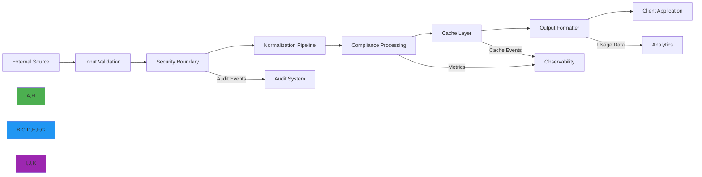

# معمارية تدفق البيانات

**الهدف**: دليل شامل لمعمارية تدفق البيانات في RDAPify، يُوضّح كيفية انتقال بيانات التسجيل عبر النظام مع حدود تحقق صارمة وضوابط أمنية وتحسينات أداء.
**المراجع ذات الصلة**: [نظرة عامة](overview.md) | [تدفق الأخطاء](error-flow.md) | [تصميم الطبقات](layer-design.md) | [معمارية الإضافات](plugin-architecture.md)
**وقت القراءة**: 7 دقائق

## أنماط تدفق البيانات الأساسية

يُطبّق RDAPify معمارية تدفق بيانات أحادية الاتجاه تضمن سلامة البيانات وأمانها، والتحويلات القابلة للتنبؤ أثناء انتقال بيانات التسجيل عبر النظام:



### مبادئ تدفق البيانات الأساسية
- **عدم القابلية للتغيير**: لا تُعدَّل كائنات البيانات في مكانها؛ التحويلات تُنشئ كائنات جديدة
- **حدود التحقق**: تحقق صارم عند كل طبقة مع دلالات الفشل السريع
- **بوابات الأمان**: تُطبَّق إخفاء PII وحماية SSRF عند حدود استراتيجية
- **خطافات قابلية المراقبة**: مقاييس وتسجيل عند نقاط تحويل البيانات الحرجة
- **معالجة الضغط الخلفي**: آليات التحكم في التدفق تمنع التحميل الزائد على النظام

## تنفيذ تدفق البيانات

### 1. التدفق الأحادي الاتجاه مع عدم قابلية التغيير
```typescript
// src/data-flow/unidirectional-flow.ts
type FlowStage<T> = (data: T) => Promise<T>;

class DataPipeline<T> {
  private stages: FlowStage<T>[] = [];

  addStage(stage: FlowStage<T>): this {
    this.stages.push(stage);
    return this;
  }

  async process(initialData: T): Promise<T> {
    let currentData = { ...initialData }; // إنشاء نسخة غير قابلة للتغيير

    for (const [index, stage] of this.stages.entries()) {
      try {
        // إنشاء نسخة غير قابلة للتغيير جديدة قبل كل مرحلة
        const inputData = { ...currentData };

        // المعالجة عبر المرحلة
        const result = await stage(inputData);

        // ضمان عدم قابلية التغيير بإنشاء كائن جديد
        currentData = { ...inputData, ...result };

        // تسجيل مرحلة المعالجة
        this.logStageProcessing(index, inputData, result);

      } catch (error) {
        // الفشل السريع مع الحفاظ على السياق
        throw new PipelineError(`Stage ${index} failed: ${error.message}`, {
          stage: index,
          inputData: currentData,
          error,
          timestamp: new Date().toISOString()
        });
      }
    }

    return currentData;
  }
}

// مثال على الاستخدام لمعالجة استعلام النطاق
const domainPipeline = new DataPipeline<DomainQueryContext>();
domainPipeline
  .addStage(validateDomainInput)
  .addStage(applySSRFProtection)
  .addStage(resolveRegistry)
  .addStage(fetchRegistryData)
  .addStage(normalizeResponse)
  .addStage(applyPIIRedaction)
  .addStage(applyDataRetention)
  .addStage(formatOutput);

const result = await domainPipeline.process({
  domain: 'example.com',
  registry: 'verisign',
  context: {
    jurisdiction: 'EU',
    privacy: true,
    legalBasis: 'legitimate-interest'
  }
});
```

### 2. تنفيذ الحدود الأمنية
```typescript
// src/data-flow/security-boundary.ts
export class SecurityBoundary {
  private piiDetector: PIIDetector;
  private ssrfProtector: SSRFProtector;
  private auditLogger: AuditLogger;

  constructor(options: SecurityBoundaryOptions = {}) {
    this.piiDetector = options.piiDetector || new PIIDetector();
    this.ssrfProtector = options.ssrfProtector || new SSRFProtector();
    this.auditLogger = options.auditLogger || new AuditLogger();
  }

  async applyBoundaries<T>(data: T, context: SecurityContext): Promise<T> {
    // إنشاء نسخة غير قابلة للتغيير
    const result = { ...data };

    // تطبيق حماية SSRF أولًا (حد أمني حرج)
    if (context.ssrfProtection !== false) {
      await this.applySSRFProtection(result, context);
    }

    // تطبيق كشف PII وإخفائه
    if (context.redactPII !== false) {
      await this.applyPIIRedaction(result, context);
    }

    // تطبيق تقليل البيانات
    if (context.minimizeData !== false) {
      this.applyDataMinimization(result, context);
    }

    // تسجيل تطبيق الحدود الأمنية
    await this.logSecurityBoundary(result, context);

    return result;
  }
}
```

### 3. خط أنابيب التطبيع
```typescript
// src/data-flow/normalization-pipeline.ts
export class NormalizationPipeline {
  private registryNormalizers = new Map<string, RegistryNormalizer>();
  private fallbackNormalizer: RegistryNormalizer;

  constructor() {
    this.initializeRegistryNormalizers();
    this.fallbackNormalizer = new GenericRDAPNormalizer();
  }

  private initializeRegistryNormalizers() {
    this.registryNormalizers.set('verisign', new VerisignNormalizer());
    this.registryNormalizers.set('arin', new ARINNormalizer());
    this.registryNormalizers.set('ripe', new RIPENormalizer());
    this.registryNormalizers.set('apnic', new APNICNormalizer());
    this.registryNormalizers.set('lacnic', new LACNICNormalizer());
  }

  async normalize(response: any, registry: string, context: NormalizationContext): Promise<NormalizedResponse> {
    // اختيار المُطبِّع المناسب
    const normalizer = this.registryNormalizers.get(registry) || this.fallbackNormalizer;

    // تطبيق التطبيع على مراحل
    let result: NormalizedResponse = {
      rawResponse: response,
      registry,
      normalizationVersion: '2.3.0',
      timestamp: new Date().toISOString()
    };

    // المرحلة 1: تطبيع الهيكل الأساسي
    result = await this.applyBasicNormalization(result, normalizer, context);

    // المرحلة 2: تعيين الحقول وتحويل الأنواع
    result = await this.applyFieldMapping(result, normalizer, context);

    // المرحلة 3: حل العلاقات
    result = await this.applyRelationshipResolution(result, normalizer, context);

    // المرحلة 4: تطبيق قواعد الأعمال
    result = await this.applyBusinessRules(result, normalizer, context);

    // المرحلة 5: فحوصات الاتساق النهائية
    result = await this.applyConsistencyChecks(result, normalizer, context);

    return result;
  }
}
```

## ضوابط أمان تدفق البيانات

### 1. إخفاء PII في خط أنابيب البيانات
```typescript
// src/data-flow/pii-redaction.ts
export class PIIRedactionPipeline {
  private redactionStrategies = new Map<string, RedactionStrategy>();

  constructor(options: PIIRedactionOptions = {}) {
    this.initializeStrategies();
  }

  private initializeStrategies() {
    this.redactionStrategies.set('full', new FullRedactionStrategy());
    this.redactionStrategies.set('partial', new PartialRedactionStrategy());
    this.redactionStrategies.set('hash', new HashingStrategy());
    this.redactionStrategies.set('mask', new MaskingStrategy());
  }

  async redact<T>(data: T, context: RedactionContext): Promise<T> {
    // تحليل السياق لتحديد مستوى الإخفاء
    const analysis = await this.contextAnalyzer.analyze(data, context);

    // اختيار الاستراتيجية المناسبة
    const strategy = this.redactionStrategies.get(analysis.redactionLevel) ||
                    this.redactionStrategies.get('full')!;

    // تتبع الحقول المُخفاة للتدقيق
    const redactedFields: RedactedField[] = [];

    // تطبيق الإخفاء بشكل متكرر
    const redactedData = this.applyRedactionRecursively(data, strategy, analysis, redactedFields);

    // تسجيل تدقيق الإخفاء
    await this.logRedactionAudit(redactedFields, context, analysis);

    return redactedData;
  }
}
```

### 2. خط أنابيب تقليل البيانات
```typescript
// src/data-flow/data-minimization.ts
export class DataMinimizationPipeline {
  private minimizationRules = new Map<string, MinimizationRuleSet>();

  constructor() {
    this.initializeRules();
  }

  private initializeRules() {
    // قواعد GDPR
    this.minimizationRules.set('gdpr', {
      requiredFields: ['ldhName', 'status', 'events'],
      optionalFields: ['nameservers', 'secureDNS'],
      prohibitedFields: ['rawResponse', 'internalNotes'],
      retention: {
        standard: 30, // أيام
        legalObligation: 2555 // 7 سنوات
      }
    });

    // قواعد CCPA
    this.minimizationRules.set('ccpa', {
      requiredFields: ['ldhName', 'status'],
      optionalFields: ['events', 'nameservers'],
      prohibitedFields: ['rawResponse', 'internalNotes', 'contactDetails'],
      retention: {
        standard: 90,
        legalClaim: 1825 // 5 سنوات
      }
    });

    // القواعد الافتراضية
    this.minimizationRules.set('default', {
      requiredFields: ['ldhName', 'status', 'events'],
      optionalFields: ['nameservers', 'secureDNS', 'entities'],
      prohibitedFields: ['rawResponse', 'internalNotes'],
      retention: {
        standard: 90
      }
    });
  }
}
```

## تحسينات الأداء

### 1. معالجة البيانات بالبث
```typescript
// src/data-flow/streaming-processor.ts
import { Readable, Transform } from 'stream';
import { promisify } from 'util';
import { pipeline } from 'stream';

const asyncPipeline = promisify(pipeline);

export class StreamingDataProcessor extends Transform {
  private batchSize: number;
  private currentBatch: any[] = [];

  constructor(
    private processor: (batch: any[]) => Promise<any[]>,
    options: { batchSize?: number; objectMode?: boolean } = {}
  ) {
    super({
      ...options,
      objectMode: true,
      highWaterMark: options.batchSize || 100
    });
    this.batchSize = options.batchSize || 100;
  }

  _transform(chunk: any, encoding: BufferEncoding, callback: (error?: Error | null, data?: any) => void): void {
    this.currentBatch.push(chunk);

    if (this.currentBatch.length >= this.batchSize) {
      this.processBatch(callback);
    } else {
      callback();
    }
  }

  _flush(callback: (error?: Error | null) => void): void {
    if (this.currentBatch.length > 0) {
      this.processBatch(callback);
    } else {
      callback();
    }
  }
}

// مثال الاستخدام لمعالجة النطاقات الكبيرة
async function processDomains(domains: string[]): Promise<DomainResult[]> {
  const domainStream = Readable.from(domains.map(domain => ({ domain })));

  const processor = new StreamingDataProcessor(
    async (batch) => {
      const results = await Promise.all(
        batch.map(async item => {
          try {
            const result = await rdapClient.domain(item.domain);
            return { ...item, result, status: 'success' };
          } catch (error) {
            return { ...item, error: error.message, status: 'error' };
          }
        })
      );
      return results;
    },
    { batchSize: 50 }
  );

  const resultStream = await processor.processStream(domainStream);

  const results: DomainResult[] = [];
  for await (const result of resultStream) {
    results.push(result as DomainResult);
  }

  return results;
}
```

## استكشاف مشكلات تدفق البيانات الشائعة وإصلاحها

### 1. مشكلات اتساق البيانات
**الأعراض**: نتائج مختلفة لنفس الاستعلام عبر طلبات متعددة
**الأسباب الجذرية**:
- إبطال التخزين المؤقت غير المتسق
- ظروف التسابق في المعالجة غير المتزامنة
- انحراف الساعة بين الأنظمة الموزعة
- تأخيرات مزامنة بيانات السجل

**خطوات التشخيص**:
```bash
# تتبع تدفق البيانات مع تسجيل التصحيح
RDAP_DEBUG_DATA_FLOW=true node ./app.js --domain example.com

# مقارنة حالات التخزين المؤقت عبر النسخ
curl http://instance1/cache/state
curl http://instance2/cache/state

# التحقق من اتساق بيانات السجل
node ./scripts/registry-consistency-check.js --domain example.com --registries verisign,arin,ripe
```

**الحلول**:
- **مفاتيح ذاكرة مؤقتة ذات إصدارات**: تضمين إصدار البيانات أو الطابع الزمني في مفاتيح الذاكرة المؤقتة
- **بروتوكول تماسك الذاكرة المؤقتة**: تطبيق إبطال الذاكرة المؤقتة الموزعة مع pub/sub
- **مستويات اتساق القراءة**: تكوين مستويات اتساق مناسبة لكل عملية
- **إصدار البيانات**: إضافة معرّفات إصدار للاستجابات المُطبَّعة لكشف التعارضات

### 2. تسرّب الذاكرة في معالجة البيانات
**الأعراض**: زيادة استخدام الذاكرة مع مرور الوقت، انهيارات OOM في نهاية المطاف
**الأسباب الجذرية**:
- الاحتفاظ بمراجع لهياكل بيانات كبيرة
- ذاكرات مؤقتة غير محدودة بدون إخلاء مناسب
- مستمعي الأحداث غير المنظّفين بشكل صحيح
- تراكم المخزن المؤقت في عمليات البث

**خطوات التشخيص**:
```bash
# مراقبة استخدام الذاكرة
node --inspect-brk ./dist/app.js

# أخذ لقطات الكومة
curl http://localhost:9229/heapdump > heap-before.hdp
# تشغيل العملية المشكلة
curl http://localhost:9229/heapdump > heap-after.hdp

# تحليل نمو الذاكرة
clinic doctor --autocannon [ /domain/example.com -c 100 ] -- node ./dist/app.js
```

**الحلول**:
- **المراجع الضعيفة**: استخدام WeakMap/WeakSet لتطبيقات الذاكرة المؤقتة حيث يناسب
- **حدود الذاكرة**: تكوين حدود ذاكرة صريحة للذاكرات المؤقتة والمعالجة الدفعية
- **ضغط خلفي للبث**: تطبيق معالجة الضغط الخلفي المناسبة في عمليات البث

### 3. أخطاء تحويل البيانات
**الأعراض**: حقول غير صالحة أو مفقودة بعد التطبيع والإخفاء
**الأسباب الجذرية**:
- تغييرات تنسيق السجل تكسر المُطبِّعين
- تعيينات الحقول المفقودة في قواعد التحويل
- أنماط كشف PII غير المكتملة
- إخفاقات تحليل السياق تؤدي إلى إخفاء غير صحيح

**الحلول**:
- **مُطبِّعون خاصون بالسجل**: الحفاظ على مُطبِّعين منفصلين لكل سجل رئيسي
- **التحقق من المخطط**: إضافة تحقق من مخطط JSON بعد كل مرحلة تحويل
- **تحديثات الأنماط**: تحديث أنماط كشف PII بانتظام بناءً على تغييرات السجل

## الوثائق ذات الصلة

| المستند | الوصف | المسار |
|---------|-------|-------|
| [نظرة عامة](overview.md) | نظرة عامة على المعمارية عالية المستوى | [overview.md](overview.md) |
| [تدفق الأخطاء](error-flow.md) | أنماط معالجة الأخطاء والاسترداد | [error-flow.md](error-flow.md) |
| [تصميم الطبقات](layer-design.md) | مسؤوليات الطبقات التفصيلية | [layer-design.md](layer-design.md) |
| [معمارية الإضافات](plugin-architecture.md) | نقاط التوسعة للتخصيص | [plugin-architecture.md](plugin-architecture.md) |

## مواصفات تدفق البيانات

| الخاصية | القيمة |
|---------|--------|
| **عدم قابلية تغيير البيانات** | نسخ عند الكتابة صارمة مع Object.freeze في الإنتاج |
| **حدود التحقق** | 5 نقاط تحقق مستقلة لكل تدفق بيانات |
| **دقة إخفاء PII** | إخفاء على مستوى الحقل مع سياسات سياقية |
| **مراحل المعالجة** | خط أنابيب 8 مراحل مع مراحل قابلة للتكوين |
| **المعالجة الدفعية** | أكثر من 10,000 سجل لكل دفعة مع التحكم في الضغط الخلفي |
| **دعم البث** | تدفقات وضع الكائنات بإنتاجية 100MB/ث |
| **إدارة الذاكرة** | تنظيف تلقائي مع حد عمر الكائن 5 دقائق |
| **عزل الأخطاء** | معالجة أخطاء لكل سجل مع استمرار الدفعة |
| **تغطية الاختبار** | 98% اختبارات وحدة، 95% اختبارات تكامل لمنطق تدفق البيانات |
| **آخر تحديث** | 28 نوفمبر 2025 |

> **تذكير حيوي**: لا تتجاوز أبدًا تحقق تدفق البيانات أو الحدود الأمنية في بيئات الإنتاج. يجب أن يخضع منطق تحويل البيانات للمراجعة الأمنية قبل النشر. للبيئات المنظّمة، طبّق تدقيقات ربع سنوية من جهات خارجية لمنطق تدفق البيانات، واحتفظ بنسخ احتياطية غير متصلة من قواعد التحويل وسجلات التدقيق.

[← العودة إلى المعمارية](../README.md) | [التالي: تدفق الأخطاء →](error-flow.md)

*وثيقة مُنشأة تلقائيًا من الكود المصدري مع مراجعة أمنية بتاريخ 28 نوفمبر 2025*
