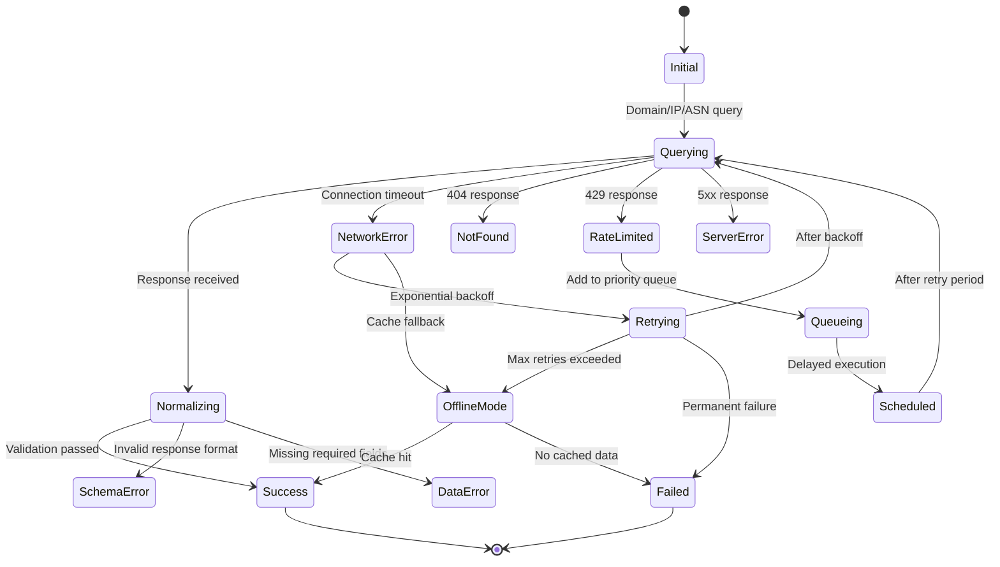

# معمارية تدفق الأخطاء

**الهدف**: دليل شامل لمعمارية معالجة الأخطاء في RDAPify، يُوضّح آلات الحالة وإستراتيجيات استرداد الإخفاقات وأنماط المرونة لمعالجة بيانات التسجيل بصلابة.
**المراجع ذات الصلة**: [نظرة عامة](overview.md) | [تدفق البيانات](data-flow.md) | [تصميم الطبقات](layer-design.md) | [معمارية الإضافات](plugin-architecture.md)
**وقت القراءة**: 7 دقائق

## نظرة عامة على آلة حالة الأخطاء

يُطبّق RDAPify آلة حالة أخطاء متطورة تُحوّل الإخفاقات العابرة إلى تجارب مستخدم قابلة للتنبؤ مع مسارات استرداد واضحة:



### مبادئ معالجة الأخطاء الأساسية
- **الفشل السريع**: رفض الطلبات غير الصالحة مبكرًا بأكواد أخطاء واضحة
- **التدهور الرشيق**: توفير آليات احتياطية عند إخفاق الأنظمة الأساسية
- **الاسترداد القابل للتنبؤ**: استراتيجيات إعادة محاولة محدّدة مع التراجع الأسي
- **الحفاظ على السياق**: الحفاظ على سياق الخطأ عبر الحدود لأغراض التصحيح
- **الوعي بالأمان**: عدم تسريب المعلومات الحساسة في رسائل الأخطاء

## تنفيذ معالجة الأخطاء

### 1. تنفيذ آلة الحالة
```typescript
// src/architecture/error-state-machine.ts
export enum ErrorState {
  INITIAL = 'initial',
  QUERYING = 'querying',
  NORMALIZING = 'normalizing',
  NETWORK_ERROR = 'network_error',
  RATE_LIMITED = 'rate_limited',
  NOT_FOUND = 'not_found',
  SERVER_ERROR = 'server_error',
  SCHEMA_ERROR = 'schema_error',
  DATA_ERROR = 'data_error',
  RETRYING = 'retrying',
  QUEUEING = 'queueing',
  SCHEDULED = 'scheduled',
  OFFLINE_MODE = 'offline_mode',
  SUCCESS = 'success',
  FAILED = 'failed'
}

export class ErrorStateMachine {
  private currentState: ErrorState = ErrorState.INITIAL;
  private retries = 0;
  private lastError: Error | null = null;

  constructor(private options: StateMachineOptions = {}) {
    this.options.maxRetries = options.maxRetries || 3;
    this.options.baseRetryDelay = options.baseRetryDelay || 1000;
    this.options.maxRetryDelay = options.maxRetryDelay || 30000;
    this.options.offlineEnabled = options.offlineEnabled !== false;
  }

  transition(event: ErrorEvent, context: ErrorContext): TransitionResult {
    const previousState = this.currentState;

    try {
      const handler = this.getTransitionHandler(`${previousState}:${event}`);
      if (!handler) {
        throw new StateTransitionError(`No handler for transition`, {
          currentState: previousState,
          event,
          context
        });
      }

      const result = handler(context);
      this.currentState = result.nextState;
      return result;
    } catch (error) {
      this.currentState = ErrorState.FAILED;
      throw error;
    }
  }
}
```

### 2. استراتيجية التراجع الأسي
```typescript
// src/architecture/retry-strategy.ts
export class ExponentialBackoffStrategy {
  constructor(
    private baseDelay: number = 1000,
    private maxDelay: number = 30000,
    private maxRetries: number = 3,
    private jitterFactor: number = 0.1
  ) {}

  calculateDelay(retryCount: number): number {
    // حساب التأخير الأسي: baseDelay * 2^retryCount
    const exponentialDelay = this.baseDelay * Math.pow(2, retryCount);

    // إضافة اهتزاز لمنع العواصف الرعدية
    const jitter = exponentialDelay * this.jitterFactor * Math.random();

    // تطبيق التأخير الأقصى
    return Math.min(exponentialDelay + jitter, this.maxDelay);
  }

  shouldRetry(error: Error, retryCount: number): boolean {
    if (retryCount >= this.maxRetries) {
      return false;
    }

    // عدم إعادة المحاولة لأخطاء أمنية
    if (error instanceof SecurityError) {
      return false;
    }

    // عدم إعادة المحاولة لأخطاء التحقق
    if (error instanceof ValidationError) {
      return false;
    }

    // إعادة المحاولة لأخطاء الشبكة وأخطاء الخادم المؤقتة
    if (error instanceof NetworkError || error instanceof ServerError) {
      return true;
    }

    // إعادة المحاولة لأخطاء تحديد المعدل مع تأخير أطول
    if (error instanceof RateLimitError) {
      return retryCount < 5; // المزيد من المحاولات لتحديد المعدل
    }

    return false;
  }
}
```

### 3. قاطع الدائرة
```typescript
// src/architecture/circuit-breaker.ts
export enum CircuitState {
  CLOSED = 'closed',   // الدائرة مغلقة - الطلبات مسموح بها
  OPEN = 'open',       // الدائرة مفتوحة - الطلبات محجوبة
  HALF_OPEN = 'half_open' // نصف مفتوح - يختبر الاسترداد
}

export class CircuitBreaker {
  private state: CircuitState = CircuitState.CLOSED;
  private failureCount = 0;
  private lastFailureTime: Date | null = null;
  private successCount = 0;

  constructor(
    private failureThreshold: number = 5,
    private timeout: number = 60000,    // 60 ثانية
    private successThreshold: number = 2
  ) {}

  async execute<T>(operation: () => Promise<T>): Promise<T> {
    if (this.state === CircuitState.OPEN) {
      if (this.shouldAttemptReset()) {
        this.state = CircuitState.HALF_OPEN;
      } else {
        throw new CircuitOpenError('Circuit breaker is OPEN', {
          failureCount: this.failureCount,
          lastFailure: this.lastFailureTime,
          nextAttempt: new Date(this.lastFailureTime!.getTime() + this.timeout)
        });
      }
    }

    try {
      const result = await operation();
      this.onSuccess();
      return result;
    } catch (error) {
      this.onFailure(error as Error);
      throw error;
    }
  }

  private onSuccess(): void {
    this.failureCount = 0;

    if (this.state === CircuitState.HALF_OPEN) {
      this.successCount++;
      if (this.successCount >= this.successThreshold) {
        this.state = CircuitState.CLOSED;
        this.successCount = 0;
      }
    }
  }

  private onFailure(error: Error): void {
    this.failureCount++;
    this.lastFailureTime = new Date();

    if (this.state === CircuitState.HALF_OPEN) {
      this.state = CircuitState.OPEN;
      this.successCount = 0;
    } else if (this.failureCount >= this.failureThreshold) {
      this.state = CircuitState.OPEN;
    }
  }

  private shouldAttemptReset(): boolean {
    if (!this.lastFailureTime) return false;
    return Date.now() - this.lastFailureTime.getTime() >= this.timeout;
  }
}
```

## إستراتيجيات التدهور الرشيق

### 1. وضع عدم الاتصال مع الذاكرة المؤقتة
```typescript
// src/architecture/offline-mode.ts
export class OfflineModeManager {
  private cacheManager: CacheManager;
  private networkMonitor: NetworkMonitor;

  constructor(options: OfflineModeOptions = {}) {
    this.cacheManager = options.cacheManager || new CacheManager();
    this.networkMonitor = options.networkMonitor || new NetworkMonitor();
  }

  async executeWithFallback<T>(
    operation: () => Promise<T>,
    cacheKey: string,
    context: OperationContext
  ): Promise<T> {
    try {
      // محاولة العملية الأساسية
      const result = await operation();

      // تحديث الذاكرة المؤقتة عند النجاح
      await this.cacheManager.set(cacheKey, result, context);

      return result;
    } catch (error) {
      // التحقق إذا كان الخطأ مرتبطًا بالشبكة
      if (this.isNetworkError(error as Error)) {
        // محاولة الحصول على البيانات المخزنة
        const cachedData = await this.cacheManager.get<T>(cacheKey, context);

        if (cachedData !== null) {
          // إرجاع البيانات المخزنة مع تحذير
          console.warn(`[OFFLINE_MODE] Using cached data for ${cacheKey}`);
          return cachedData;
        }
      }

      // إعادة رمي الخطأ إذا لم يكن الاحتياط ممكنًا
      throw error;
    }
  }

  private isNetworkError(error: Error): boolean {
    return error instanceof NetworkError ||
           error instanceof TimeoutError ||
           (error as any).code === 'ECONNREFUSED' ||
           (error as any).code === 'ENOTFOUND';
  }
}
```

### 2. معالجة الأخطاء بالتدفق الهرمي
```typescript
// src/architecture/hierarchical-error-handler.ts
export class HierarchicalErrorHandler {
  private handlers: Map<string, ErrorHandler[]> = new Map();

  registerHandler(errorType: string, handler: ErrorHandler, priority: number = 0): void {
    if (!this.handlers.has(errorType)) {
      this.handlers.set(errorType, []);
    }

    const handlers = this.handlers.get(errorType)!;
    handlers.push({ handler, priority });
    handlers.sort((a, b) => b.priority - a.priority);
  }

  async handle(error: Error, context: ErrorContext): Promise<ErrorResolution> {
    // إيجاد المعالجات المناسبة
    const errorType = error.constructor.name;
    const handlers = [
      ...(this.handlers.get(errorType) || []),
      ...(this.handlers.get('Error') || []) // معالجات العودة للأخطاء العامة
    ];

    for (const { handler } of handlers) {
      try {
        const resolution = await handler.handle(error, context);

        if (resolution.handled) {
          return resolution;
        }
      } catch (handlerError) {
        console.error(`Error handler failed:`, handlerError);
        continue;
      }
    }

    // إذا لم يُعالج أي خطأ، إرجاع حل افتراضي
    return {
      handled: true,
      action: 'fail',
      error: this.sanitizeError(error),
      message: 'An unexpected error occurred'
    };
  }

  private sanitizeError(error: Error): SanitizedError {
    return {
      type: error.constructor.name,
      message: this.sanitizeMessage(error.message),
      timestamp: new Date().toISOString()
    };
  }

  private sanitizeMessage(message: string): string {
    // إزالة المعلومات الحساسة المحتملة من رسائل الأخطاء
    return message
      .replace(/\b(?:\d{1,3}\.){3}\d{1,3}\b/g, '[IP_REDACTED]')
      .replace(/(?:password|key|secret|token)=\S+/gi, '[CREDENTIAL_REDACTED]')
      .replace(/\b[A-Za-z0-9._%+-]+@[A-Za-z0-9.-]+\.[A-Z|a-z]{2,}\b/g, '[EMAIL_REDACTED]');
  }
}
```

## أنماط المرونة

### 1. معالجة أخطاء الدُفعات
```typescript
// src/architecture/batch-error-handler.ts
export class BatchErrorHandler {
  private partialResultsEnabled: boolean;
  private checkpointEnabled: boolean;

  constructor(options: BatchErrorOptions = {}) {
    this.partialResultsEnabled = options.partialResults !== false;
    this.checkpointEnabled = options.checkpoints !== false;
  }

  async processBatch<T, R>(
    items: T[],
    processor: (item: T) => Promise<R>,
    options: BatchProcessingOptions = {}
  ): Promise<BatchResult<R>> {
    const results: BatchItemResult<R>[] = [];
    let processedCount = 0;
    let errorCount = 0;
    const maxFailures = options.maxFailures ?? Infinity;

    for (const [index, item] of items.entries()) {
      try {
        const result = await processor(item);
        results.push({
          index,
          item,
          result,
          status: 'success'
        });
        processedCount++;

        // حفظ نقطة التفتيش دوريًا
        if (this.checkpointEnabled && processedCount % (options.checkpointInterval ?? 100) === 0) {
          await this.saveCheckpoint(results, index, options.checkpointPath);
        }

      } catch (error) {
        errorCount++;
        results.push({
          index,
          item,
          error: this.sanitizeError(error as Error),
          status: 'error'
        });

        // التحقق من تجاوز الحد الأقصى للإخفاقات
        if (errorCount > maxFailures) {
          if (!this.partialResultsEnabled) {
            throw new BatchProcessingError(
              `Maximum failures exceeded: ${errorCount}`,
              { processedCount, errorCount, results }
            );
          }

          // إعادة النتائج الجزئية إذا كانت مُفعَّلة
          return {
            completed: false,
            processedCount,
            errorCount,
            results,
            terminatedEarly: true,
            reason: 'max_failures_exceeded'
          };
        }
      }
    }

    return {
      completed: true,
      processedCount,
      errorCount,
      results,
      terminatedEarly: false
    };
  }

  private async saveCheckpoint(results: any[], lastIndex: number, path?: string): Promise<void> {
    if (!path) return;

    const checkpoint = {
      timestamp: new Date().toISOString(),
      lastProcessedIndex: lastIndex,
      completedCount: results.filter(r => r.status === 'success').length,
      errorCount: results.filter(r => r.status === 'error').length
    };

    // حفظ نقطة التفتيش بدون بيانات حساسة
    await fs.writeFile(path, JSON.stringify(checkpoint, null, 2));
  }

  private sanitizeError(error: Error): SanitizedError {
    return {
      type: error.constructor.name,
      message: error.message,
      code: (error as any).code
    };
  }
}
```

## استكشاف أنماط الأخطاء الشائعة وإصلاحها

### 1. أخطاء انتهاء مهلة الاتصال
**الأعراض**: طلبات تتوقف بدون استجابة، انتهاء المهلة بعد `--timeout` ms
**التشخيص**:
```bash
# تمكين تسجيل الشبكة التصحيحي
rdapify domain example.com --debug=network --verbose

# اختبار الاتصال المباشر بالسجل
curl -v "https://rdap.verisign.com/com/v1/domain/example.com"

# تتبع مسار الشبكة
traceroute rdap.verisign.com
```

**الحلول**:
- **زيادة مهلة الاتصال**: `rdapify domain example.com --timeout=15000`
- **تكوين إعادة المحاولة**: `rdapify domain example.com --max-retries=5 --retry-backoff=exponential`
- **التحقق من إعداد الوكيل**: التأكد من أن إعداد الوكيل لا يضيف زمن استجابة زائدًا

### 2. أخطاء تحديد المعدل 429
**الأعراض**: استجابات `429 Too Many Requests` من السجلات
**التشخيص**:
```bash
# التحقق من حالة تحديد المعدل
rdapify domain example.com --debug=ratelimit

# عرض قيود معدل السجل الحالية
rdapify config show rate-limits
```

**الحلول**:
- **تقليل التزامن**: `rdapify batch domain domains.txt --concurrency=2`
- **إضافة تأخيرات بين الطلبات**: `rdapify batch domain domains.txt --rate-limit=30/60`
- **تفعيل التراجع التكيّفي**: `rdapify config set rate-limit.adaptive true`

### 3. أخطاء التحقق من البيانات
**الأعراض**: `SchemaError` أو `DataError` بعد تلقي الاستجابة
**التشخيص**:
```bash
# اختبار التطبيع مع استجابة سجل خام
node ./scripts/normalizer-test.js --registry verisign --response raw-response.json

# التحقق من الاستجابة بالتسجيل المفصّل
rdapify domain example.com --debug=normalization --verbose
```

**الحلول**:
- **تحديث المُطبِّعين**: التحقق من التغييرات الأخيرة في تنسيق السجل
- **تفعيل الوضع الاحتياطي**: `rdapify config set normalization.strict false`
- **الإبلاغ عن المشكلة**: فتح مشكلة مع نموذج الاستجابة على GitHub

## الوثائق ذات الصلة

| المستند | الوصف | المسار |
|---------|-------|-------|
| [نظرة عامة](overview.md) | نظرة عامة على المعمارية عالية المستوى | [overview.md](overview.md) |
| [تدفق البيانات](data-flow.md) | خط أنابيب معالجة البيانات التفصيلي | [data-flow.md](data-flow.md) |
| [تصميم الطبقات](layer-design.md) | مسؤوليات الطبقات التفصيلية | [layer-design.md](layer-design.md) |
| [معمارية الإضافات](plugin-architecture.md) | نقاط التوسعة للتخصيص | [plugin-architecture.md](plugin-architecture.md) |

## مواصفات تدفق الأخطاء

| الخاصية | القيمة |
|---------|--------|
| **حالات آلة الحالة** | 14 حالة مع انتقالات محدّدة |
| **استراتيجية إعادة المحاولة** | تراجع أسي مع اهتزاز |
| **الحد الأقصى لإعادة المحاولة** | 3 (قابل للتكوين حتى 10) |
| **تأخير إعادة المحاولة الأساسي** | 1000ms |
| **تأخير إعادة المحاولة الأقصى** | 30,000ms |
| **عتبة قاطع الدائرة** | 5 إخفاقات |
| **مهلة قاطع الدائرة** | 60,000ms |
| **دعم وضع عدم الاتصال** | بيانات مخزنة مؤقتًا مع تحذير الإخلاء |
| **عزل أخطاء الدُفعات** | معالجة لكل سجل مع استمرار الدُفعة |
| **تعقيم رسائل الأخطاء** | إخفاء تلقائي لـ IP/بريد إلكتروني/بيانات اعتماد |
| **آخر تحديث** | 28 نوفمبر 2025 |

> **تذكير حيوي**: لا تُعطّل قواطع الدائرة أو منطق إعادة المحاولة في بيئات الإنتاج. يجب أن تراجع رسائل الأخطاء جهات أمنية لضمان عدم تسريب معلومات حساسة. في البيئات المنظّمة، طبّق مراقبة مركزية للأخطاء مع إنذار استباقي لأنماط الإخفاق.

[← العودة إلى المعمارية](../README.md) | [التالي: معمارية الإضافات →](plugin-architecture.md)

*وثيقة مُنشأة تلقائيًا من الكود المصدري مع مراجعة أمنية بتاريخ 28 نوفمبر 2025*
