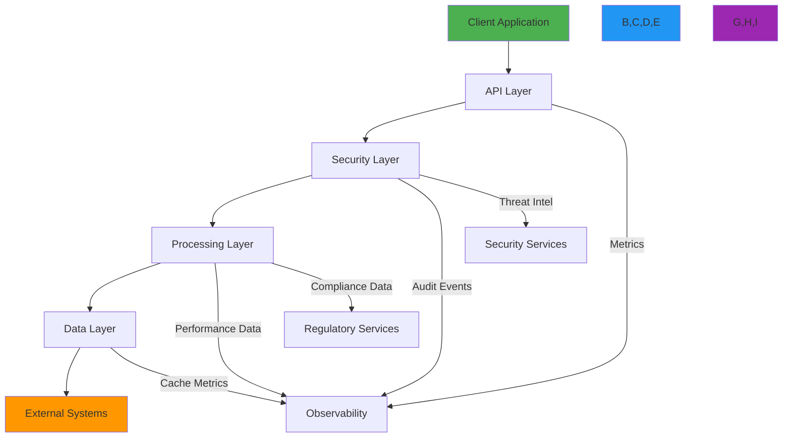
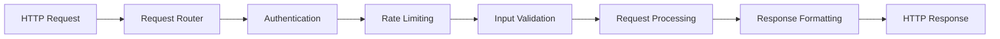
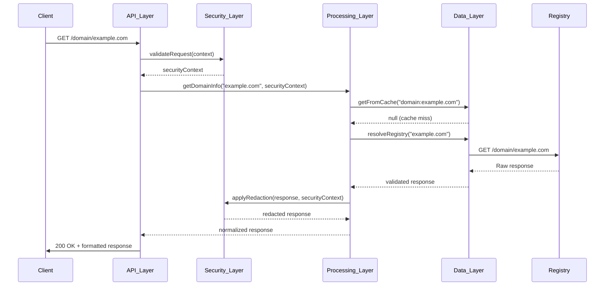
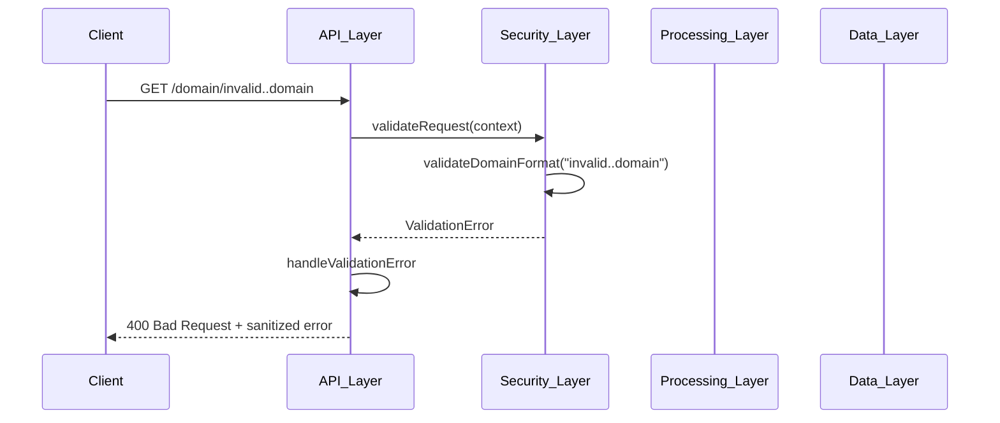

# معمارية تصميم الطبقات

**الهدف**: دليل شامل لتصميم المعمارية الطبقية في RDAPify، يُوضّح المسؤوليات والحدود وأنماط التفاعل بين الطبقات المعمارية لمعالجة بيانات التسجيل بأمان وكفاءة.
**المراجع ذات الصلة**: [نظرة عامة](overview.md) | [تدفق البيانات](data-flow.md) | [تدفق الأخطاء](error-flow.md) | [معمارية الإضافات](plugin-architecture.md)
**وقت القراءة**: 7 دقائق

## نظرة عامة على المعمارية الطبقية

يُطبّق RDAPify معمارية طبقية صارمة ذات حدود ومسؤوليات محدّدة بوضوح لضمان فصل المخاوف وعزل الأمان وقابلية الصيانة:



### مبادئ الطبقات الأساسية
- **فصل صارم للمخاوف**: كل طبقة تمتلك مسؤولية حصرية لوظائف محددة
- **تبعيات أحادية الاتجاه**: التبعيات تتدفق للأسفل فقط (الطبقات العليا تعتمد على السفلى)
- **حدود أمنية**: كل طبقة تُطبّق ضوابط أمنية ومصادقة مستقلة
- **عزل الأداء**: قيود الموارد وقواطع الدائرة تمنع الإخفاقات المتتالية
- **قابلية الاختبار**: يمكن اختبار الطبقات بشكل منعزل باستخدام استراتيجيات المحاكاة المناسبة

## مسؤوليات الطبقات وحدودها

### 1. طبقة API
**المسؤولية الأساسية**: الواجهة بين العملاء الخارجيين ووظائف النظام الداخلي



**المكوّنات الرئيسية**:
- **موجّه الطلبات**: يُوجّه الطلبات إلى المعالجات المناسبة بناءً على المسار والأسلوب
- **المُصادِق**: يُتحقَّق من مفاتيح API ورموز JWT ومعلومات الجلسة
- **محدّد المعدل**: يُطبّق حصص الطلبات بحدود تكيّفية بناءً على سلوك العميل
- **مُتحقَّق المدخلات**: يُتحقَّق من معاملات الطلب مقابل تعريفات المخطط
- **مُنسّق الاستجابة**: يُحوّل البيانات الداخلية إلى تنسيقات العميل (JSON، XML، إلخ)

**قواعد الحدود**:
- يجب ألا تصل مباشرةً إلى مخازن البيانات الداخلية
- يجب ألا تُطبّق منطق الأعمال أو قواعد معالجة البيانات
- يجب تعقيم جميع المدخلات قبل تمريرها للطبقات الأدنى
- يجب ألا تُسرّب معلومات النظام الداخلي في رسائل الأخطاء

**مثال التنفيذ**:
```typescript
// src/api-layer/api-router.ts
export class APILayer {
  private router: Router;
  private authenticator: Authenticator;
  private rateLimiter: RateLimiter;
  private validator: InputValidator;
  private formatter: ResponseFormatter;

  constructor(options: APILayerOptions = {}) {
    this.router = options.router || express.Router();
    this.authenticator = options.authenticator || new JWTAuthenticator();
    this.rateLimiter = options.rateLimiter || new TokenBucketRateLimiter();
    this.validator = options.validator || new SchemaValidator();
    this.formatter = options.formatter || new JSONResponseFormatter();
  }

  initialize(): Router {
    // تطبيق الوسيط بترتيب صارم
    this.router.use(this.authenticator.middleware());
    this.router.use(this.rateLimiter.middleware());
    this.router.use(this.corsMiddleware());

    // تسجيل المسارات
    this.registerDomainRoutes();
    this.registerIPRoutes();
    this.registerASNRoutes();
    this.registerHealthRoutes();

    // وسيط معالجة الأخطاء (في النهاية)
    this.router.use(this.errorHandlerMiddleware());

    return this.router;
  }

  private registerDomainRoutes(): void {
    this.router.get('/domain/:domain', async (req: Request, res: Response) => {
      try {
        // التحقق من صحة المدخلات
        const validation = this.validator.validateDomainQuery(req.params.domain);
        if (!validation.valid) {
          throw new BadRequestError(validation.message, { code: 'INVALID_DOMAIN' });
        }

        // إنشاء سياق المعالجة
        const context = this.createProcessingContext(req);

        // التفويض إلى طبقة المعالجة
        const domainService = this.getDomainService();
        const result = await domainService.getDomainInfo(validation.domain, context);

        // تنسيق وإرجاع الاستجابة
        const formatted = this.formatter.formatDomainResponse(result, context);
        res.json(formatted);
      } catch (error) {
        this.handleError(error, res, 'domain_query');
      }
    });
  }

  private corsMiddleware(): RequestHandler {
    return (req, res, next) => {
      const allowedOrigins = [
        'https://rdapify.dev',
        'https://playground.rdapify.dev'
      ];

      const origin = req.headers.origin || '';
      if (allowedOrigins.includes(origin)) {
        res.header('Access-Control-Allow-Origin', origin);
      }

      res.header('Access-Control-Allow-Methods', 'GET, OPTIONS');
      res.header('Access-Control-Allow-Headers', 'Content-Type, Authorization, X-Request-ID');
      res.header('Access-Control-Max-Age', '86400'); // 24 ساعة

      if (req.method === 'OPTIONS') {
        res.sendStatus(204);
        return;
      }

      next();
    };
  }

  private handleError(error: Error, res: Response, operation: string): void {
    // ضمان عدم تسريب التفاصيل الداخلية
    const safeError = this.errorSanitizer.sanitize(error, operation);

    // تسجيل الخطأ (النسخة المعقّمة)
    this.auditLogger.log('api_error', {
      operation,
      errorType: safeError.name,
      statusCode: safeError instanceof HTTPError ? safeError.statusCode : 500,
      timestamp: new Date().toISOString()
    });

    // إرسال الاستجابة المناسبة
    if (safeError instanceof HTTPError) {
      res.status(safeError.statusCode).json({
        error: safeError.code,
        message: safeError.message,
        timestamp: new Date().toISOString()
      });
    } else {
      res.status(500).json({
        error: 'internal_server_error',
        message: 'An unexpected error occurred',
        timestamp: new Date().toISOString()
      });
    }
  }
}
```

### 2. طبقة الأمان
**المسؤولية الأساسية**: تطبيق سياسات الأمان والحماية من التهديدات عند جميع الحدود

**المكوّنات الرئيسية**:
- **SSRFProtector**: يحجب هجمات تزوير الطلبات من جهة الخادم
- **PIIDetector**: يُحدّد المعلومات الشخصية التعريفية في الاستجابات
- **RedactionEngine**: يُطبّق سياسات إخفاء PII الخاصة بكل اختصاص قضائي
- **AccessController**: يُطبّق التحكم في الوصول المبني على الأدوار وعزل المستأجرين
- **AuditLogger**: يُنشئ مسارات تدقيق غير قابلة للتغيير لجميع العمليات ذات الصلة بالأمان

**قواعد الحدود**:
- يجب أن تعمل على بيانات من الطبقات العليا قبل تمريرها للطبقات الأدنى
- يجب الحفاظ على نشر سياق الأمان عبر حدود الطبقات
- يجب تطبيق الدفاع المتعمق مع نقاط تحقق مستقلة متعددة
- يجب عدم الوثوق بالبيانات من المصادر الخارجية دون تحقق

### 3. طبقة المعالجة
**المسؤولية الأساسية**: تنفيذ منطق الأعمال وتحويل البيانات

**المكوّنات الرئيسية**:
- **Normalizer**: يُحوّل الاستجابات الخاصة بالسجلات إلى تنسيق موحّد
- **ErrorHandler**: يُطبّق قواطع الدائرة واستراتيجيات الاحتياط
- **BatchProcessor**: يعالج العمليات الضخمة مع قيود الموارد
- **ComplianceEngine**: يُطبّق GDPR وCCPA والمتطلبات التنظيمية الأخرى
- **CacheManager**: يُطبّق استراتيجيات التخزين المؤقت مع إدارة TTL والحجم

**قواعد الحدود**:
- يجب ألا تصل مباشرةً إلى الأنظمة الخارجية (يجب استخدام طبقة البيانات)
- يجب ألا تُطبّق سياسات الأمان (يجب استخدام طبقة الأمان)
- يجب التحقق من صحة جميع البيانات المستلمة من الطبقات الأدنى قبل المعالجة
- يجب ضمان عدم قابلية تغيير البيانات أثناء عمليات التحويل

### 4. طبقة البيانات
**المسؤولية الأساسية**: استرجاع البيانات والاستمرارية والتكامل مع الأنظمة الخارجية

**المكوّنات الرئيسية**:
- **RegistryDiscovery**: يستخدم بيانات الإقلاع من IANA للعثور على السجلات الموثوقة
- **ConnectionPool**: يُدير اتصالات HTTP/2 مع keep-alive
- **DataCache**: يُطبّق تخزينًا مؤقتًا متعدد المستويات مع إخلاء LRU
- **DataStore**: يتعامل مع التخزين الدائم للبيانات المخزنة والبيانات التشغيلية
- **OfflineMode**: يُوفّر الوصول إلى البيانات المخزنة أثناء انقطاعات الشبكة

**قواعد الحدود**:
- يجب تطبيق إعادة المحاولة وقواطع الدائرة للتبعيات الخارجية
- يجب التحقق من صحة جميع البيانات المستلمة من الأنظمة الخارجية قبل الإرجاع
- يجب ألا تُطبّق منطق الأعمال أو سياسات الأمان
- يجب الحفاظ على حدود الاتصال وقيود المهلة

## أنماط تفاعل الطبقات

### 1. تدفق معالجة الطلبات


### 2. تدفق نشر الأخطاء


## أنماط تحسين الأداء

### 1. استراتيجية التخزين المؤقت الخاصة بالطبقة
```typescript
// src/data-layer/cache-manager.ts
export class CacheManager {
  private memoryCache: LRUCache<string, any>;
  private redisCache?: Redis;
  private filesystemCache?: FilesystemCache;

  constructor(private options: CacheOptions = {}) {
    // إعداد ذاكرة مؤقتة متعددة المستويات
    this.memoryCache = new LRUCache({
      max: options.memoryMax || 10000,
      ttl: options.memoryTTL || 3600000, // ساعة واحدة
      updateAgeOnGet: true
    });

    // تهيئة الذاكرة المؤقتة الموزعة إذا كانت مُعدَّة
    if (options.redisUrl) {
      this.redisCache = new Redis(options.redisUrl, {
        maxRetriesPerRequest: 3,
        retryStrategy: (times) => Math.min(times * 50, 2000)
      });
    }

    // تهيئة الذاكرة المؤقتة الدائمة إذا لزم
    if (options.filesystemPath) {
      this.filesystemCache = new FilesystemCache(options.filesystemPath);
    }
  }

  async get<T>(key: string, context: CacheContext): Promise<T | null> {
    // تجربة الذاكرة المؤقتة أولًا (الأسرع)
    const memoryResult = this.memoryCache.get(key);
    if (memoryResult) {
      this.trackCacheHit('memory', context);
      return memoryResult;
    }

    // تجربة ذاكرة Redis المؤقتة إذا كانت متاحة
    if (this.redisCache) {
      try {
        const redisData = await this.redisCache.get(key);
        if (redisData) {
          const parsed = JSON.parse(redisData);
          this.memoryCache.set(key, parsed); // ترقية إلى الذاكرة
          this.trackCacheHit('redis', context);
          return parsed;
        }
      } catch (error) {
        this.handleCacheError('redis', error, context);
      }
    }

    // تجربة ذاكرة نظام الملفات للتخزين الدائم
    if (this.filesystemCache) {
      try {
        const fsData = await this.filesystemCache.get(key);
        if (fsData) {
          this.memoryCache.set(key, fsData); // ترقية إلى الذاكرة
          if (this.redisCache) {
            this.redisCache.setex(key, 3600, JSON.stringify(fsData));
          }
          this.trackCacheHit('filesystem', context);
          return fsData;
        }
      } catch (error) {
        this.handleCacheError('filesystem', error, context);
      }
    }

    this.trackCacheMiss(context);
    return null;
  }
}
```

## استكشاف مشكلات الطبقات الشائعة وإصلاحها

### 1. انتهاكات حدود الطبقات
**الأعراض**: ثغرات أمنية، تسرّب بيانات، أو سلوك غير متوقع بسبب الفصل غير الصحيح للطبقات
**الأسباب الجذرية**:
- الوصول المباشر إلى مكوّنات الطبقات الأدنى من الطبقات الأعلى
- تجاوز ضوابط الأمان بالوصول المباشر للأنظمة الداخلية
- التحقق المفقود عند حدود الطبقات
- معالجة الأخطاء غير المتسقة عبر الطبقات

**خطوات التشخيص**:
```bash
# التحقق من انتهاكات حدود الطبقات
node ./scripts/layer-boundary-analyzer.js --path src/

# تتبع تدفق البيانات عبر الطبقات
node --inspect-brk ./dist/app.js --trace-layers

# التحقق من رسم الاعتماديات
dependency-cruiser --validate .dependency-cruiser.json src/
```

**الحلول**:
- **حقن الاعتماديات الصارم**: تطبيق حدود الطبقات عبر حاويات حقن الاعتماديات
- **عقود واجهة الطبقات**: تعريف واجهات TypeScript صريحة لتفاعلات الطبقات
- **اختبارات المعمارية**: تطبيق اختبارات آلية تُتحقَّق من قواعد فصل الطبقات
- **مراجعات الكود**: تضمين فحوصات حدود الطبقات في قوائم مراجعة الكود

### 2. عدم اتساق التخزين المؤقت عبر الطبقات
**الأعراض**: طبقات مختلفة ترجع بيانات مختلفة لنفس الاستعلام، تقديم بيانات قديمة
**الأسباب الجذرية**:
- استراتيجيات إبطال التخزين المؤقت غير المتسقة بين الطبقات
- آليات تماسك الذاكرة المؤقتة المفقودة للأنظمة الموزعة
- انحراف الساعة بين الأنظمة مما يؤثر على حسابات TTL
- إصدار الذاكرة المؤقتة المفقود لتغييرات المخطط

**الحلول**:
- **إدارة مركزية للتخزين المؤقت**: تطبيق مدير تخزين مؤقت واحد تستخدمه جميع الطبقات
- **مفاتيح ذاكرة مؤقتة مُصدَّرة**: تضمين إصدار المخطط في مفاتيح الذاكرة المؤقتة لمنع مشكلات البيانات القديمة
- **إبطال الذاكرة المؤقتة الموزعة**: استخدام Redis pub/sub أو قائمة الرسائل لتماسك الذاكرة المؤقتة

### 3. تدهور الأداء في تفاعلات الطبقات
**الأعراض**: زيادة زمن الاستجابة مع تدفق الطلبات عبر الطبقات، ارتفاعات CPU/ذاكرة أثناء الأحمال الذروة
**الحلول**:
- **نقل البيانات غير القابل للتغيير**: استخدام هياكل بيانات غير قابلة للتغيير مع مراجع مشتركة بين الطبقات
- **معالجة البث**: تطبيق واجهات البث لعمليات نقل البيانات الكبيرة بين الطبقات
- **حدود الموارد**: تطبيق حدود موارد صارمة عند كل حد طبقة
- **تجميع الاتصالات**: إعادة استخدام الاتصالات بين الطبقات مع إدارة دورة حياة صحيحة

## الوثائق ذات الصلة

| المستند | الوصف | المسار |
|---------|-------|-------|
| [نظرة عامة](overview.md) | نظرة عامة على المعمارية عالية المستوى | [overview.md](overview.md) |
| [تدفق البيانات](data-flow.md) | خط أنابيب معالجة البيانات التفصيلي | [data-flow.md](data-flow.md) |
| [تدفق الأخطاء](error-flow.md) | أنماط معالجة الأخطاء والاسترداد | [error-flow.md](error-flow.md) |
| [معمارية الإضافات](plugin-architecture.md) | نقاط التوسعة والتخصيص | [plugin-architecture.md](plugin-architecture.md) |
| [سجلات قرارات المعمارية](decision-records.md) | قرارات التصميم التاريخية | [decision-records.md](decision-records.md) |

## مواصفات الطبقات

| الخاصية | القيمة |
|---------|--------|
| **عدد الطبقات** | 4 طبقات أساسية (API، الأمان، المعالجة، البيانات) |
| **اتجاه الاعتمادية** | للأسفل فقط (أعلى → أدنى) |
| **الحدود الأمنية** | 1 لكل طبقة مع تحقق مستقل |
| **أهداف الأداء** | أقل من 5ms لكل طبقة لـ 95% من الطلبات |
| **تغطية الاختبار** | 98% اختبارات وحدة، 95% اختبارات تكامل لكل طبقة |
| **عزل الفشل** | قواطع دائرة بين جميع حدود الطبقات |
| **نقل البيانات** | كائنات غير قابلة للتغيير مع مراجع مشتركة |
| **قابلية المراقبة** | مقاييس، تسجيل، تتبع عند جميع حدود الطبقات |
| **آخر تحديث** | 28 نوفمبر 2025 |

> **تذكير حيوي للمعمارية**: لا تتجاوز أبدًا حدود الطبقات أو تُعطّل ضوابط الأمان في بيئات الإنتاج. يجب أن تخضع جميع تفاعلات الطبقات للمراجعة الأمنية قبل النشر. في النشر المؤسسي، طبّق مجالس مراجعة معمارية مخصصة لتقييم قرارات تصميم الطبقات فصليًا، وأجرِ اختبارات اختراق سنوية لآليات تطبيق الحدود.

[← العودة إلى المعمارية](../README.md) | [التالي: معمارية الإضافات →](plugin-architecture.md)

*وثيقة مُنشأة تلقائيًا من الكود المصدري مع مراجعة أمنية بتاريخ 28 نوفمبر 2025*
