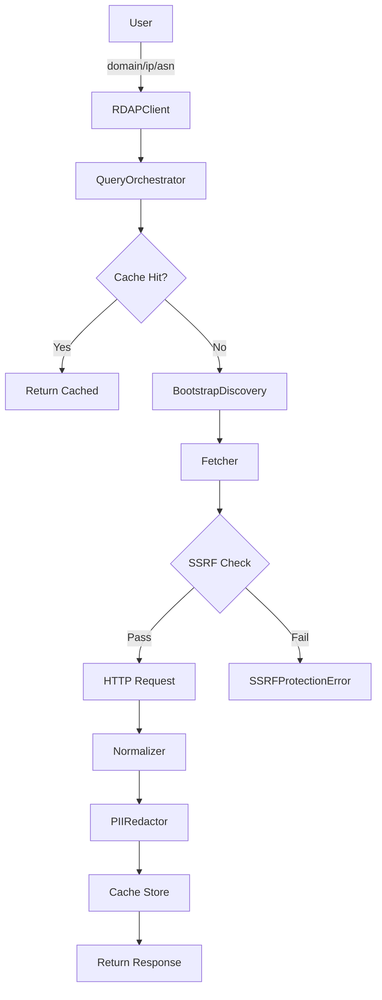
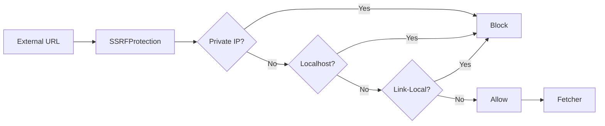

# نظرة عامة على المعمارية

## المعمارية الحالية (v0.1.2)

يتّبع RDAPify **تصميمًا معياريًا متعدد الطبقات** مع فصل واضح للمخاوف.

### هيكل الوحدات

```
src/
├── client/              # الواجهة البرمجية العامة والتنسيق
│   ├── RDAPClient.ts           # فئة العميل الرئيسية
│   └── QueryOrchestrator.ts    # منطق تنفيذ الاستعلام
│
├── fetcher/             # HTTP والاكتشاف
│   ├── Fetcher.ts              # عميل HTTP مع إعادة المحاولة
│   ├── BootstrapDiscovery.ts   # خدمة الإقلاع من IANA
│   └── SSRFProtection.ts       # طبقة الأمان
│
├── normalizer/          # تحويل البيانات
│   ├── Normalizer.ts           # تطبيع الاستجابة
│   └── PIIRedactor.ts          # ضوابط الخصوصية
│
├── cache/               # بنية التخزين المؤقت
│   ├── CacheManager.ts         # تنسيق التخزين المؤقت
│   └── InMemoryCache.ts        # تنفيذ ذاكرة LRU المؤقتة
│
├── types/               # تعريفات الأنواع
│   ├── entities.ts             # كيانات RDAP
│   ├── enums.ts                # التعدادات
│   ├── errors.ts               # هرم الأخطاء
│   ├── options.ts              # أنواع الإعداد
│   ├── responses.ts            # نماذج الاستجابة
│   └── index.ts                # الأنواع العامة
│
└── utils/               # الأدوات المساعدة
    ├── validators/             # التحقق من صحة المدخلات
    └── helpers/                # الدوال المساعدة
```

### تدفق البيانات



### مبادئ التصميم الرئيسية

#### 1. الأمان بشكل افتراضي
- جميع عناوين URL الخارجية مُتحقَّق منها عبر `SSRFProtection`
- نطاقات IP الخاصة محجوبة (RFC 1918)
- التحقق من الشهادات مُفرَض
- إخفاء PII مُفعَّل بشكل افتراضي

#### 2. الخصوصية بالتصميم
- كشف PII التلقائي وإخفائه
- الامتثال لـ GDPR/CCPA مدمج
- ضوابط خصوصية قابلة للتكوين
- لا احتفاظ بالبيانات بعد وقت بقاء التخزين المؤقت

#### 3. تحسين الأداء
- تخزين مؤقت ذكي مع إخلاء LRU
- وقت بقاء قابل للتكوين (افتراضي: ساعة واحدة)
- بيانات الإقلاع مُخزَّنة مؤقتًا (24 ساعة)
- دعم الاستعلامات المتوازية

#### 4. مرونة الأخطاء
- منطق إعادة المحاولة مع التراجع الأسي
- التدهور الرشيق
- سياق الخطأ التفصيلي
- معالجة الأخطاء الآمنة من حيث الأنواع

### مسؤوليات المكوّنات

#### RDAPClient
- **الغرض**: واجهة الواجهة البرمجية العامة
- **المسؤوليات**:
  - إدارة الإعداد
  - تهيئة المكوّنات
  - كشف الأساليب العامة
- **التبعيات**: جميع الوحدات الأخرى

#### QueryOrchestrator
- **الغرض**: خط أنابيب تنفيذ الاستعلام
- **المسؤوليات**:
  - التحقق من الصحة → التخزين المؤقت → الاكتشاف → الجلب → التطبيع → الإخفاء
  - تطبيق نمط الاستعلام المشترك
  - نشر الأخطاء
- **التبعيات**: Cache، Bootstrap، Fetcher، Normalizer، PIIRedactor

#### Fetcher
- **الغرض**: الاتصال عبر HTTP
- **المسؤوليات**:
  - طلبات HTTP مع مهلة
  - معالجة إعادة التوجيه
  - تحليل الاستجابة
  - تكامل حماية SSRF
- **التبعيات**: SSRFProtection

#### BootstrapDiscovery
- **الغرض**: اكتشاف خوادم RDAP
- **المسؤوليات**:
  - جلب بيانات الإقلاع من IANA
  - تعيين TLD/IP/ASN لخادم
  - إدارة ذاكرة الإقلاع المؤقتة
- **التبعيات**: Fetcher

#### Normalizer
- **الغرض**: توحيد الاستجابة
- **المسؤوليات**:
  - RDAP خام → استجابة مكتوبة
  - استخراج الحقول وتعيينها
  - تنسيق مخرجات متسق
- **التبعيات**: لا شيء (تحويل بحت)

#### PIIRedactor
- **الغرض**: حماية الخصوصية
- **المسؤوليات**:
  - كشف أنماط PII
  - إخفاء البيانات
  - قواعد إخفاء قابلة للتكوين
- **التبعيات**: لا شيء (تحويل بحت)

#### CacheManager
- **الغرض**: تنسيق التخزين المؤقت
- **المسؤوليات**:
  - اختيار استراتيجية التخزين المؤقت
  - إدارة وقت البقاء TTL
  - تتبع الإحصاءات
- **التبعيات**: تنفيذات ICache

### معمارية الأمان



**قواعد حماية SSRF:**
- حجب نطاقات RFC 1918 الخاصة (10.0.0.0/8، 172.16.0.0/12، 192.168.0.0/16)
- حجب localhost (127.0.0.0/8، ::1)
- حجب link-local (169.254.0.0/16، fe80::/10)
- حجب الإرسال المتعدد والبث
- التحقق قبل دقة DNS (منع إعادة ربط DNS)

### المعمارية المستقبلية (v0.2.0+)

**التحسينات المخطّطة:**
1. **المعمارية الطبقية**: فصل صارم للنواة/البنية التحتية/النطاق/الأمان
2. **نظام الإضافات**: محوّلات cache/fetcher/normalizer قابلة للتوسيع
3. **تعدد الأوقات التشغيلية**: دعم أصلي لـ Bun/Deno/Cloudflare Workers
4. **التخزين المؤقت المتقدم**: Redis، جغرافيًا موزَّع، هرمي
5. **قابلية المراقبة**: مقاييس، تتبع، تسجيل منظّم

انظر `ROADMAP.md` للجدول الزمني التفصيلي.

### استراتيجية الاختبار

- **اختبارات الوحدة**: سلوك الوحدة الفردية
- **اختبارات التكامل**: وظائف العميل من البداية إلى النهاية
- **البيانات التجريبية**: استجابات RDAP حقيقية من السجلات الكبرى
- **التغطية**: تغطية كود تزيد عن 90% مُحافظ عليها

### خصائص الأداء

- **البدء الأول**: ~50-100ms (جلب الإقلاع)
- **استعلام مخزَّن مؤقتًا**: أقل من 1ms
- **استعلام غير مخزَّن**: ~100-500ms (تعتمد على الشبكة)
- **الذاكرة**: ~10-50MB (تعتمد على حجم التخزين المؤقت)
- **الإنتاجية**: أكثر من 100 استعلام/ثانية (مخزَّنة مؤقتًا)

### التبعيات

**الإنتاج:**
- `ipaddr.js` - تحليل عنوان IP ومطابقة CIDR
- `tslib` - مساعدات وقت تشغيل TypeScript

**لا تبعيات HTTP خارجية** - يستخدم واجهة `fetch` الأصلية.

### التوافق

- **Node.js**: 16.x، 18.x، 20.x+
- **TypeScript**: 5.x
- **أنظمة الوحدات**: ESM + CJS
- **المستقبل**: Bun، Deno، Cloudflare Workers

---

**آخر تحديث**: 26 يناير 2026
**الإصدار**: 0.1.2
