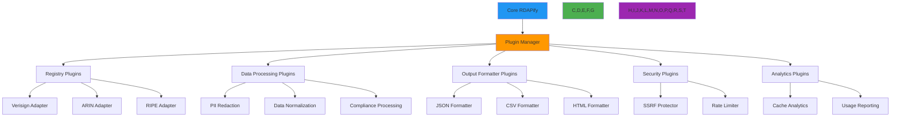

# معمارية الإضافات

**الهدف**: دليل شامل لمعمارية الإضافات في RDAPify، يُمكّن التوسيع الآمن والأداء العالي مع الحفاظ على الحدود الأمنية ومتطلبات الامتثال.
**المراجع ذات الصلة**: [نظرة عامة](overview.md) | [تدفق البيانات](data-flow.md) | [تصميم الطبقات](layer-design.md) | [تدفق الأخطاء](error-flow.md)
**وقت القراءة**: 6 دقائق

## نظرة عامة على معمارية الإضافات

توفر معمارية الإضافات في RDAPify بيئة آمنة ومعزولة لتوسيع الوظائف الأساسية مع الحفاظ على الفصل الصارم للمخاوف والحدود الأمنية:



### مبادئ الإضافات الأساسية
- **الحماية بالعزل**: تعمل الإضافات في سياقات معزولة بحدود موارد صارمة
- **أمان الأنواع**: واجهات إضافات مكتوبة بقوة مع تحقق شامل
- **النشر بدون توقف**: إعادة تحميل الإضافات بسخونة دون انقطاع الخدمة
- **عزل الأداء**: حدود الموارد تمنع الإضافات من التأثير على العمليات الأساسية
- **الحفاظ على الامتثال**: يجب أن تلتزم جميع الإضافات بمتطلبات الامتثال الخاصة بكل اختصاص قضائي

## تنفيذ نظام الإضافات

### 1. واجهة الإضافة الأساسية
```typescript
// src/plugins/plugin-system.ts
export interface Plugin<T extends PluginConfig = PluginConfig> {
  id: string;                     // معرّف الإضافة الفريد
  name: string;                   // الاسم المقروء بشريًا
  version: string;                // الإصدار الدلالي
  description: string;            // وصف مختصر
  author: string;                 // المؤلف/المنظمة
  license: string;                // معرّف الترخيص
  enabled: boolean;               // حالة تفعيل الإضافة
  config: T;                      // الإعداد الخاص بالإضافة
  metadata: {
    createdAt: Date;
    updatedAt: Date;
    lastUsed: Date;
    dependencies?: string[];      // الإضافات التي تعتمد عليها هذه الإضافة
    requiredPermissions?: string[]; // الصلاحيات المطلوبة
    securityLevel: 'low' | 'medium' | 'high'; // التصنيف الأمني
  };
  hooks: PluginHooks;
  lifecycle: PluginLifecycle;
}

export interface PluginHooks {
  // خطافات دورة الحياة
  preInitialization?: (context: PluginContext) => Promise<void>;
  postInitialization?: (context: PluginContext) => Promise<void>;
  preShutdown?: (context: PluginContext) => Promise<void>;
  postShutdown?: (context: PluginContext) => Promise<void>;

  // خطافات المعالجة
  preRequest?: (context: PluginContext) => Promise<void>;
  postRequest?: (context: PluginContext) => Promise<void>;
  preResponse?: (context: PluginContext) => Promise<void>;
  postResponse?: (context: PluginContext) => Promise<void>;

  // خطافات الأخطاء
  onError?: (context: PluginContext, error: Error) => Promise<void>;
  onWarning?: (context: PluginContext, warning: string) => Promise<void>;
}

export interface PluginLifecycle {
  initialize: (context: PluginContext) => Promise<void>;
  shutdown: (context: PluginContext) => Promise<void>;
  reload: (context: PluginContext) => Promise<void>;
  validate: (context: PluginContext) => Promise<ValidationResult>;
}

export interface PluginContext {
  pluginId: string;
  tenantId?: string;
  registry?: string;
  securityContext: SecurityContext;
  metrics: MetricsCollector;
  logger: Logger;
  config: PluginConfig;
  resources: {
    memoryLimit: number;
    cpuLimit: number;
    timeLimit: number;
    storageLimit: number;
  };
  sandbox: SandboxedEnvironment;
}
```

### 2. مدير الإضافات
```typescript
// src/plugins/plugin-manager.ts
export class PluginManager {
  private plugins = new Map<string, Plugin>();
  private hooks = new Map<string, PluginHook[]>();
  private sandbox = new PluginSandbox();
  private lifecycle = new PluginLifecycleManager();

  constructor(private options: PluginManagerOptions = {}) {
    this.initializeCorePlugins();
  }

  async registerPlugin(plugin: Plugin): Promise<void> {
    // التحقق من هيكل الإضافة
    const validation = await this.validatePlugin(plugin);
    if (!validation.valid) {
      throw new PluginValidationError(`Plugin validation failed: ${validation.reason}`, {
        pluginId: plugin.id,
        errors: validation.errors
      });
    }

    // تهيئة الإضافة في العزل
    await this.sandbox.initializePlugin(plugin);

    // تسجيل الإضافة والخطافات
    this.plugins.set(plugin.id, plugin);
    this.registerPluginHooks(plugin);

    // تهيئة دورة حياة الإضافة
    await this.lifecycle.initializePlugin(plugin);

    // تسجيل تسجيل الإضافة
    this.logger.info(`Plugin registered: ${plugin.name} v${plugin.version}`, {
      pluginId: plugin.id,
      securityLevel: plugin.metadata.securityLevel
    });
  }

  private async validatePlugin(plugin: Plugin): Promise<ValidationResult> {
    const errors: ValidationError[] = [];

    // التحقق من الحقول الإلزامية
    if (!plugin.id || !/^[a-z0-9-]+$/.test(plugin.id)) {
      errors.push({ field: 'id', message: 'Invalid plugin ID format' });
    }

    if (!plugin.name || plugin.name.length < 3) {
      errors.push({ field: 'name', message: 'Plugin name too short' });
    }

    // التحقق من متطلبات الأمان
    if (plugin.metadata.securityLevel === 'high' && !plugin.config.signedBy) {
      errors.push({ field: 'config.signedBy', message: 'High security plugins require code signing' });
    }

    // التحقق من الخطافات
    const hookErrors = this.validateHooks(plugin.hooks);
    errors.push(...hookErrors);

    return {
      valid: errors.length === 0,
      reason: errors.length > 0 ? errors[0].message : 'Validation successful',
      errors
    };
  }

  async executeHook(hookName: string, context: PluginContext): Promise<void> {
    const hooks = this.hooks.get(hookName) || [];

    for (const hook of hooks) {
      try {
        // التحقق من حدود الموارد قبل التنفيذ
        this.sandbox.checkResourceLimits(hook.pluginId, context);

        // تنفيذ الخطاف في العزل
        await this.sandbox.executeHook(hook, context);

        // تحديث المقاييس
        this.metrics.recordHookExecution(hook.pluginId, hookName, 'success');
      } catch (error) {
        // معالجة أخطاء الخطافات
        this.metrics.recordHookExecution(hook.pluginId, hookName, 'error');
        this.logger.error(`Hook execution failed`, {
          pluginId: hook.pluginId,
          hookName,
          error: (error as Error).message
        });
      }
    }
  }
}
```

### 3. بيئة العزل للإضافات
```typescript
// src/plugins/plugin-sandbox.ts
export class PluginSandbox {
  private resourceMonitor = new ResourceMonitor();

  async initializePlugin(plugin: Plugin): Promise<void> {
    // إنشاء سياق معزول لكل إضافة
    const sandboxedContext: SandboxedEnvironment = {
      id: `sandbox-${plugin.id}`,
      memoryLimit: this.calculateMemoryLimit(plugin),
      cpuLimit: this.calculateCPULimit(plugin),
      networkAccess: plugin.metadata.securityLevel === 'low' ? 'none' : 'restricted',
      fileSystemAccess: 'none',
      processSpawning: false
    };

    // تسجيل قيود الموارد
    this.resourceMonitor.registerPlugin(plugin.id, sandboxedContext);
  }

  checkResourceLimits(pluginId: string, context: PluginContext): void {
    const usage = this.resourceMonitor.getCurrentUsage(pluginId);
    const limits = context.resources;

    if (usage.memory > limits.memoryLimit) {
      throw new ResourceLimitError(`Memory limit exceeded for plugin ${pluginId}`, {
        usage: usage.memory,
        limit: limits.memoryLimit
      });
    }

    if (usage.cpu > limits.cpuLimit) {
      throw new ResourceLimitError(`CPU limit exceeded for plugin ${pluginId}`, {
        usage: usage.cpu,
        limit: limits.cpuLimit
      });
    }
  }

  private calculateMemoryLimit(plugin: Plugin): number {
    const baseLimits = {
      'low': 32 * 1024 * 1024,    // 32MB
      'medium': 64 * 1024 * 1024,  // 64MB
      'high': 128 * 1024 * 1024    // 128MB
    };
    return baseLimits[plugin.metadata.securityLevel];
  }

  private calculateCPULimit(plugin: Plugin): number {
    const baseLimits = {
      'low': 0.1,    // 10% CPU
      'medium': 0.25, // 25% CPU
      'high': 0.5    // 50% CPU
    };
    return baseLimits[plugin.metadata.securityLevel];
  }
}
```

## تطوير إضافة مخصصة

### 1. نموذج إضافة سجل مخصص
```typescript
// مثال: إضافة سجل مخصص
import { Plugin, PluginHooks, PluginLifecycle, PluginContext } from 'rdapify';

export class CustomRegistryPlugin implements Plugin {
  id = 'custom-registry-adapter';
  name = 'Custom Registry Adapter';
  version = '1.0.0';
  description = 'Adapter for custom RDAP registry';
  author = 'Organization Name';
  license = 'MIT';
  enabled = true;
  config = {};
  metadata = {
    createdAt: new Date(),
    updatedAt: new Date(),
    lastUsed: new Date(),
    securityLevel: 'medium' as const
  };

  hooks: PluginHooks = {
    preRequest: async (context: PluginContext) => {
      // إضافة ترويسات مخصصة قبل طلب السجل
      context.logger.debug(`Custom registry request for: ${context.registry}`);
    },

    postResponse: async (context: PluginContext) => {
      // معالجة الاستجابة بعد استلامها
      context.metrics.increment('custom_registry_requests');
    }
  };

  lifecycle: PluginLifecycle = {
    initialize: async (context: PluginContext) => {
      context.logger.info('Custom registry plugin initialized');
    },
    shutdown: async (context: PluginContext) => {
      context.logger.info('Custom registry plugin shutdown');
    },
    reload: async (context: PluginContext) => {
      context.logger.info('Custom registry plugin reloaded');
    },
    validate: async (context: PluginContext) => {
      return { valid: true, errors: [] };
    }
  };
}
```

### 2. تكامل الإضافة مع RDAPify
```typescript
import { RDAPClient } from 'rdapify';
import { CustomRegistryPlugin } from './custom-registry-plugin';

const client = new RDAPClient({
  security: { ssrfProtection: true }
});

// تسجيل الإضافة
await client.use(new CustomRegistryPlugin());

// استخدام العميل مع الإضافة المُسجَّلة
const result = await client.domain('example.com');
```

## اعتبارات الأمان للإضافات

### 1. التحقق من الكود المصدري
جميع الإضافات ذات المستوى الأمني `high` تتطلب:
- توقيعًا رقميًا من مُطوِّر مُعتمَد
- مراجعة أمنية من فريق RDAPify
- مجموعة اختبارات شاملة بتغطية 95%+
- وثائق تُوضّح نماذج الوصول للبيانات

### 2. قيود التنفيذ
```typescript
// إضافات ذات مستوى أمان منخفض
{
  networkAccess: 'none',
  fileSystemAccess: 'none',
  processSpawning: false,
  memoryLimit: '32MB',
  cpuLimit: '10%'
}

// إضافات ذات مستوى أمان متوسط
{
  networkAccess: 'restricted', // قائمة بيضاء فقط
  fileSystemAccess: 'read-only', // مسار محدد فقط
  processSpawning: false,
  memoryLimit: '64MB',
  cpuLimit: '25%'
}

// إضافات ذات مستوى أمان عالٍ
{
  networkAccess: 'monitored', // مُسجَّل ومُراقَب
  fileSystemAccess: 'sandboxed', // مجلد مؤقت معزول
  processSpawning: false,
  memoryLimit: '128MB',
  cpuLimit: '50%'
}
```

## استكشاف مشكلات الإضافات الشائعة وإصلاحها

### 1. فشل تسجيل الإضافة
**الأعراض**: خطأ `PluginValidationError` عند تسجيل الإضافة
**الأسباب الشائعة**:
- تنسيق معرّف الإضافة غير صالح (يجب أن يكون `[a-z0-9-]+`)
- الإضافات ذات المستوى الأمني `high` بدون توقيع كود
- التبعيات الدائرية بين الإضافات
- حقول إلزامية مفقودة

**الحل**:
```bash
# التحقق من بنية الإضافة
rdapify plugin validate ./my-plugin/

# عرض أخطاء التحقق التفصيلية
rdapify plugin validate ./my-plugin/ --verbose
```

### 2. مشكلات الأداء مع الإضافات
**الأعراض**: زيادة ملحوظة في زمن الاستجابة بعد تثبيت الإضافة
**التشخيص**:
```bash
# مراقبة أداء الإضافة
rdapify plugin monitor my-plugin-id --duration=60s

# عرض مقاييس الموارد
rdapify plugin stats my-plugin-id
```

**الحلول**:
- **تحسين الخطافات**: تقليل العمليات في خطافات `preRequest`/`postResponse`
- **تخزين مؤقت**: استخدام الذاكرة المؤقتة داخل الإضافة للبيانات المتكررة
- **المعالجة غير المتزامنة**: استخدام `Promise.all` للعمليات المستقلة

### 3. تعارضات بين الإضافات
**الأعراض**: سلوك غير متوقع عند استخدام إضافات متعددة معًا
**التشخيص**:
```bash
# التحقق من تعارضات الإضافات
rdapify plugin check-conflicts

# عرض ترتيب تنفيذ الخطافات
rdapify plugin hook-order
```

## الوثائق ذات الصلة

| المستند | الوصف | المسار |
|---------|-------|-------|
| [نظرة عامة](overview.md) | نظرة عامة على المعمارية عالية المستوى | [overview.md](overview.md) |
| [تدفق البيانات](data-flow.md) | خط أنابيب معالجة البيانات | [data-flow.md](data-flow.md) |
| [تدفق الأخطاء](error-flow.md) | أنماط معالجة الأخطاء | [error-flow.md](error-flow.md) |
| [تصميم الطبقات](layer-design.md) | مسؤوليات الطبقات | [layer-design.md](layer-design.md) |
| [سجلات قرارات المعمارية](decision-records.md) | قرارات التصميم التاريخية | [decision-records.md](decision-records.md) |

## مواصفات معمارية الإضافات

| الخاصية | القيمة |
|---------|--------|
| **إضافات أساسية مدمجة** | 12 إضافة (سجلات، مُنسِّقون، أمان، تحليلات) |
| **مستويات الأمان** | منخفض، متوسط، عالٍ |
| **التعزيل** | لكل إضافة في سياق معزول |
| **حدود الذاكرة** | 32MB (منخفض)، 64MB (متوسط)، 128MB (عالٍ) |
| **حدود CPU** | 10%، 25%، 50% لكل مستوى |
| **دعم إعادة التحميل الساخن** | نعم، بدون انقطاع الخدمة |
| **التحقق من الإضافات** | تلقائي عند التسجيل |
| **مراقبة الأداء** | مقاييس في الوقت الفعلي لكل إضافة |
| **آخر تحديث** | 28 نوفمبر 2025 |

> **تذكير حيوي**: راجع دائمًا كود الإضافة بعناية قبل التثبيت في بيئات الإنتاج. لا تثبّت إضافات من مصادر غير موثوقة. الإضافات ذات المستوى الأمني `high` تتطلب موافقة فريق الأمان في مؤسستك قبل النشر. راقب دائمًا استخدام موارد الإضافات في الإنتاج واضبط الحدود وفقًا لذلك.

[← العودة إلى المعمارية](../README.md) | [التالي: سجلات قرارات المعمارية →](decision-records.md)

*وثيقة مُنشأة تلقائيًا من الكود المصدري مع مراجعة أمنية بتاريخ 28 نوفمبر 2025*
