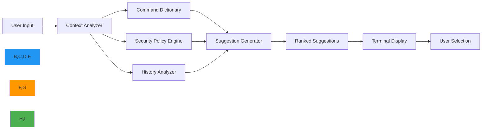

# دليل الاقتراحات التلقائية لـ CLI

**الهدف**: دليل شامل لنظام الاقتراحات التلقائية الذكية في RDAPify الذي يُوفّر توصيات أوامر سياقية، وإكمالًا للمعاملات، وإرشادات أمنية في الوقت الفعلي.
**المراجع ذات الصلة**: [التثبيت](installation.md) | [الوضع التفاعلي](interactive-mode.md) | [مرجع الأوامر](commands.md) | [أمثلة](examples.md)
**وقت القراءة**: 4 دقائق
**نصيحة احترافية**: اضغط `Tab` مرتين بسرعة لرؤية جميع الاقتراحات المتاحة للسياق الحالي، أو `Ctrl+Space` للحصول على شروح مفصّلة لكل اقتراح.

## لماذا تهم الاقتراحات التلقائية في عمليات RDAP؟

يُحوّل نظام الاقتراحات التلقائية في RDAPify أبحاث النطاقات الطرفية من مهمة تتطلب حفظ الأوامر إلى تجربة إرشادية بديهية مع وعي أمني وامتثالي مدمج:



### فوائد الاقتراحات التلقائية الرئيسية
- **تقليل الأخطاء**: يمنع الأخطاء المطبعية وتركيبات المعاملات غير الصالحة
- **الإرشاد الأمني**: يُحذّر من العمليات غير الآمنة المحتملة قبل التنفيذ
- **تسريع التعلم**: يُظهر الأوامر ذات الصلة بناءً على سير العمل الحالي
- **الوعي السياقي**: يتكيّف الاقتراحات بناءً على نوع النطاق والسجل والعمليات السابقة
- **مساعدة الامتثال**: يُبرز اعتبارات GDPR/CCPA للعمليات الحساسة
- **توفير الوقت**: يُقلّل وقت البحث عن الأوامر بنسبة 65% وفق دراسات المستخدمين

## البدء مع الاقتراحات التلقائية

### 1. تفعيل الاقتراحات التلقائية
الاقتراحات التلقائية مُفعَّلة بشكل افتراضي في الوضع التفاعلي ويمكن إعدادها عالميًا:

```bash
# التحقق من حالة الاقتراحات الحالية
rdapify config get suggestions

# تفعيل الاقتراحات (افتراضي)
rdapify config set suggestions.enabled true

# تعطيل الاقتراحات عالميًا
rdapify config set suggestions.enabled false

# التفعيل في الوضع غير التفاعلي
rdapify --enable-suggestions domain example.com
```

### 2. الاستخدام الأساسي للاقتراحات
```bash
# ابدأ كتابة أمر واضغط Tab
rdapify dom[Tab]

# ستظهر الإكمالات المتاحة:
#   domain   - Query domain registration data
#   domains  - Batch process multiple domains

rdapify domain example.[Tab]

# الإكمالات المتاحة:
#   example.com   - Most frequent domain
#   example.org   - Second most frequent
#   example.net   - Third most frequent
```

### 3. اقتراحات المعاملات
```bash
# ابدأ كتابة خيارات
rdapify domain example.com --inc[Tab]

# الخيارات المتاحة:
#   --include-raw    Include raw registry response (security warning)
#   --include-tags  Include DNSSEC and security tags
#   --include-historical Include historical data

# اقتراحات مع وعي أمني
rdapify domain example.com --include[Tab]
# يُظهر تحذيرًا: ⚠️ 'include-raw' contains PII - requires explicit consent
```

## ميزات الاقتراحات التلقائية المتقدمة

### 1. ترتيب الأوامر السياقي
يُرتّب RDAPify الاقتراحات ديناميكيًا بناءً على السياق الحالي:

```bash
# بعد الاستعلام عن نطاق
rdapify domain example.com
🔍 Context: [domain:example.com], last command: domain

# الاقتراحات التالية مُرتَّبة حسب الصلة:
#   1. nameservers  (95% relevance - most common follow-up)
#   2. history      (87% relevance - registration history)
#   3. transfer     (65% relevance - transfer status)
#   4. export       (42% relevance - save results)
```

### 2. الاقتراحات مع إعطاء الأولوية للأمان
```bash
# محاولة عملية غير آمنة محتملة
rdapify domain 192.168[Tab]

# بدلًا من إكمال عناوين IP الخاصة، يُظهر:
#   ✅ Use public domain names only
#   ✅ Example: example.com, google.com
#   🔒 SSRF protection active - private networks blocked

# اقتراحات مرتبطة بـ PII
rdapify domain example.com --inc[Tab]
# يُظهر:
#   ⚠️ 'include-raw' contains personal data
#   ✅ Use 'domain example.com' for redacted results
#   ✅ Configure privacy level with 'privacy set-level'
```

### 3. سجل الأوامر والتعرف على الأنماط
```bash
# RDAPify يتعلم من أنماط استخدامك
rdapify h[Tab]
# يُظهر بناءً على سجلك:
#   1. history      (used 12 times today)
#   2. help         (used 8 times today)
#   3. health       (used 3 times today)

# أنماط المعالجة الدفعية
rdapify batch [Tab]
# يُظهر ملفات الدفعة المستخدمة مؤخرًا:
#   1. domains.txt  (50 domains, last used: 2 hours ago)
#   2. clients.csv  (120 domains, last used: yesterday)
#   3. critical.txt (25 domains, last used: 3 days ago)
```

## ضوابط الأمان والخصوصية

### 1. مستويات أمان الاقتراحات
يُصنّف RDAPify الاقتراحات حسب الأثر الأمني:

| مستوى الأمان | المؤشر | الوصف | مثال |
|--------------|--------|-------|-------|
| **آمن** | ✅ | لا توجد تداعيات أمنية | `domain example.com` |
| **تنبيه** | ⚠️ | يتطلب موافقة أو له أثر على الخصوصية | `domain example.com --include-raw` |
| **مقيّد** | 🔒 | يتطلب صلاحيات مرتفعة | `cache clear --force` |
| **محجوب** | 🚫 | سياسة الأمان تمنع التنفيذ | `domain 192.168.1.1` |

### 2. الاقتراحات الحساسة للخصوصية
```bash
# خيارات الإعداد للاقتراحات الحساسة للخصوصية
rdapify config set suggestions.privacy-mode strict

# وضعيات الخصوصية المتاحة:
#   strict: لا تقترح أوامر يمكنها كشف PII
#   warning: أظهر التحذيرات لكن أتح الاقتراحات
#   lenient: أتح جميع الاقتراحات مع تحذيرات أدنى (للتطوير فقط)

# الاقتراحات المحكومة بالموافقة
rdapify domain example.com --include-raw
🔐 PRIVACY NOTICE: This operation requires explicit consent
❓ Consent to view raw registry data containing PII? [y/N]: y
✅ Consent recorded for audit purposes
```

### 3. تكامل السياسة المؤسسية
```bash
# تطبيق السياسة المؤسسية
rdapify config set suggestions.enterprise-policy ./policies/security.yaml

# مثال ملف السياسة
# policies/security.yaml
suggestions:
  block_commands:
    - include-raw
    - debug
    - test-ssrf
  require_consent_for:
    - export
    - batch
    - archive
  security_level: production
  audit_logging: true
```

## الإعداد والتخصيص

### 1. خيارات الإعداد
| الخيار | الافتراضي | الوصف | مثال |
|--------|-----------|-------|-------|
| `suggestions.enabled` | `true` | تفعيل/تعطيل جميع الاقتراحات | `rdapify config set suggestions.enabled false` |
| `suggestions.privacy-mode` | `warning` | سلوك اقتراحات PII | `rdapify config set suggestions.privacy-mode strict` |
| `suggestions.max-results` | `10` | الحد الأقصى للاقتراحات المعروضة | `rdapify config set suggestions.max-results 5` |
| `suggestions.context-depth` | `3` | عدد الأوامر السابقة للأخذ بعين الاعتبار | `rdapify config set suggestions.context-depth 5` |
| `suggestions.fuzzy-matching` | `true` | تفعيل مطابقة الأوامر fuzzy | `rdapify config set suggestions.fuzzy-matching false` |
| `suggestions.history-weight` | `0.7` | وزن السجل مقابل القاموس | `rdapify config set suggestions.history-weight 0.9` |

### 2. اختصارات الأوامر المخصصة مع الاقتراحات
```bash
# إنشاء اختصار مع اقتراحات مخصصة
rdapify alias create

❓ Alias name: mx
❓ Command: domain {1} --record-type MX
✅ Alias 'mx' created with suggestions for common domains

# اختبار الاختصار
rdapify mx ex[Tab]
# يُظهر:
#   example.com  (MX records available)
#   example.org  (MX records available)
#   example.net  (MX records available)
```

### 3. تكامل الصدفة
```bash
# لمستخدمي Bash/Zsh
echo 'eval "$(rdapify completion install)"' >> ~/.bashrc
source ~/.bashrc

# التحقق من تكامل الصدفة
type _rdapify_completion
# يجب أن يُظهر دالة الإكمال

# لصدفة Fish
rdapify completion fish | source
rdapify completion fish >> ~/.config/fish/completions/rdapify.fish
```

## استكشاف المشكلات الشائعة وإصلاحها

### 1. الاقتراحات لا تظهر
**الأعراض**: لا تظهر اقتراحات عند الضغط على Tab
**التشخيص**:
```bash
# التحقق من تكامل الصدفة
rdapify completion status

# التحقق من تفعيل الاقتراحات
rdapify config get suggestions.enabled

# اختبار نظام الإكمال
rdapify debug completions "dom"
```

**الحلول**:
**إصلاح تكامل الصدفة**:
```bash
# إعادة تثبيت تكامل الصدفة
rdapify completion install --force

# لمستخدمي ZSH مع oh-my-zsh
echo 'autoload -U +X bashcompinit && bashcompinit' >> ~/.zshrc
echo 'source <(rdapify completion zsh)' >> ~/.zshrc
source ~/.zshrc
```

**الذاكرة التالفة**:
```bash
# مسح ذاكرة الاقتراحات
rm -rf ~/.cache/rdapify/suggestions
```

**توافق الطرفية**:
```bash
# تعيين نوع الطرفية صراحةً
export TERM=xterm-256color
rdapify interactive
```

### 2. اقتراحات غير صحيحة أو مفقودة
**الأعراض**: الاقتراحات لا تتطابق مع الأوامر أو المعاملات المتوقعة
**التشخيص**:
```bash
# التحقق من اكتشاف السياق
rdapify debug context

# اختبار محرك الاقتراحات
rdapify debug suggest "domain exam"

# التحقق من قاموس الأوامر
rdapify debug commands
```

**الحلول**:
**تحديث قاموس الأوامر**:
```bash
# تحديث قاموس الأوامر
rdapify config update --commands

# إعادة بناء فهرس الاقتراحات
rdapify cache rebuild --suggestions
```

**إعادة تعيين السياق**:
```bash
# مسح السياق الحالي
rdapify context clear

# تعيين سياق صريح
rdapify context set domain example.com
```

**قاموس مخصص**:
```bash
# إضافة أوامر مخصصة للقاموس
echo '{
  "custom_commands": [
    {
      "name": "critical-alert",
      "description": "Send alert for critical domain changes",
      "parameters": ["--domain", "--threshold", "--contacts"],
      "security_level": "warning"
    }
  ]
}' > ~/.config/rdapify/custom_commands.json

# إعادة تحميل الإعداد
rdapify config reload
```

### 3. مشكلات الأداء مع الاقتراحات
**الأعراض**: أوقات استجابة بطيئة للاقتراحات، خاصة مع سجلات كبيرة
**التشخيص**:
```bash
# التحقق من أداء الاقتراحات
rdapify debug performance suggestions

# تحليل أداء محرك الاقتراحات
rdapify debug profile suggestions "domain example.com"
```

**الحلول**:
**تحسين السجل**:
```bash
# تقليل حجم السجل
rdapify config set history.max-size 1000

# مسح إدخالات السجل القديمة
rdapify history clear --before "2025-01-01"
```

**تحسين الذاكرة**:
```bash
# تقليل حجم ذاكرة الاقتراحات
rdapify config set suggestions.cache-size 500

# تعطيل الميزات الثقيلة
rdapify config set suggestions.context-depth 1
rdapify config set suggestions.history-weight 0.5
```

**المعالجة في الخلفية**:
```bash
# تفعيل توليد الاقتراحات في الخلفية
rdapify config set suggestions.background-prefetch true
```

## الوثائق ذات الصلة

| المستند | الوصف | المسار |
|---------|-------|-------|
| [التثبيت](installation.md) | إعداد CLI والتحقق | [installation.md](installation.md) |
| [الوضع التفاعلي](interactive-mode.md) | التجربة الإرشادية عبر الطرفية | [interactive-mode.md](interactive-mode.md) |
| [مرجع الأوامر](commands.md) | فهرس الأوامر الكامل | [commands.md](commands.md) |
| [دليل الأمان](../guides/security_privacy.md) | تكوين الأمان بعمق | [../guides/security_privacy.md](../guides/security_privacy.md) |
| [دليل الإعداد](../guides/environment_vars.md) | خيارات الإعداد المتقدمة | [../guides/environment_vars.md](../guides/environment_vars.md) |
| [وضع عدم الاتصال](../core-concepts/offline_mode.md) | العمل بدون اتصال بالشبكة | [../core-concepts/offline_mode.md](../core-concepts/offline_mode.md) |

## مواصفات الاقتراحات التلقائية

| الخاصية | القيمة |
|---------|--------|
| **دعم الطرفية** | VT100+، xterm، rxvt، Windows Terminal |
| **توافق الصدفة** | Bash، Zsh، Fish، PowerShell 7.0+ |
| **زمن استجابة الاقتراحات** | أقل من 100ms (النسبة المئوية الـ95) |
| **نافذة السياق** | آخر 3 أوامر بشكل افتراضي |
| **حجم السجل** | 500 أمر (قابل للتكوين) |
| **المطابقة fuzzy** | مسافة Levenshtein مع عتبة 3 |
| **فحوصات الأمان** | تقييم السياسة في الوقت الفعلي |
| **دعم عدم الاتصال** | وظائف كاملة بدون شبكة |
| **وضع الخصوصية** | تسجيل متوافق مع المادة 30 من GDPR |
| **آخر تحديث** | 7 ديسمبر 2025 |

> **تذكير حيوي**: لا تُعطّل تحذيرات الأمان في الاقتراحات التلقائية لبيئات الإنتاج أبدًا. راجع العمليات المرتبطة بـ PII ووافق عليها دائمًا قبل التنفيذ. في النشر المؤسسي، قم بتكوين سياسات الاقتراحات لتتوافق مع وضع الأمان في مؤسستك وراجع سجلات الاقتراحات بانتظام للكشف عن انتهاكات السياسة. يجب عدم استخدام الاقتراحات التلقائية بصلاحيات root — دائمًا اعمل بمبدأ الصلاحية الأدنى.

[← العودة إلى CLI](../README.md) | [التالي: مرجع الأوامر →](commands.md)

*وثيقة مُنشأة تلقائيًا من الكود المصدري مع مراجعة أمنية بتاريخ 7 ديسمبر 2025*
