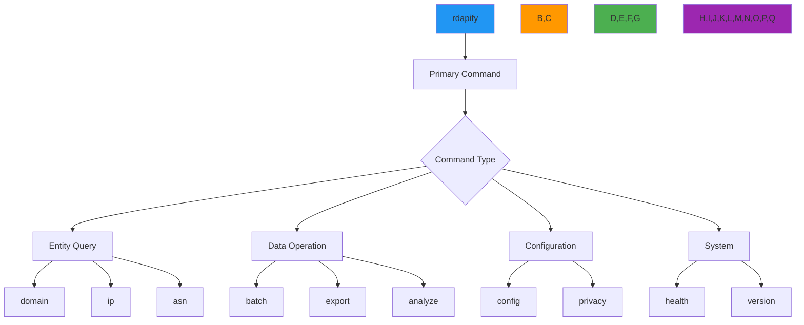

# مرجع أوامر CLI

**الهدف**: دليل مرجعي شامل لجميع أوامر CLI في RDAPify مع أمثلة استخدام مفصّلة، واعتبارات أمنية، وأنماط سير عمل لعمليات استخبارات النطاقات بكفاءة.
**المراجع ذات الصلة**: [التثبيت](installation.md) | [الوضع التفاعلي](interactive-mode.md) | [الاقتراحات التلقائية](auto-suggestions.md) | [أمثلة](examples.md)
**وقت القراءة**: 8 دقائق
**نصيحة احترافية**: اكتب `rdapify <command> --cheatsheet` لإنشاء بطاقة مرجعية مخصصة لأكثر العمليات استخدامًا لديك.

## فلسفة هيكل الأوامر

تتّبع CLI في RDAPify هيكلًا متسقًا للأوامر مُصمَّمًا لتحقيق التوازن بين الأمان وسهولة الاستخدام:



### مبادئ تصميم الأوامر
- **الأمان بشكل افتراضي**: تتضمن جميع الأوامر إخفاء PII وحماية SSRF دون الحاجة لخيارات إضافية
- **الإفصاح التدريجي**: إعدادات افتراضية بسيطة مع خيارات متقدمة تظهر عند الحاجة
- **صياغة متسقة**: أنماط خيارات موحّدة عبر جميع الأوامر (`--format`، `--output`، `--verbose`)
- **الوعي السياقي**: تتكيّف الأوامر بناءً على متغيرات البيئة والتكوين
- **جاهزية الامتثال**: خيارات GDPR/CCPA مدمجة للعمليات المنظّمة

## أوامر الاستعلام الأساسية

### 1. أمر استعلام النطاق
```bash
# الاستخدام الأساسي
rdapify domain example.com

# الاستخدام المتقدم مع الخيارات
rdapify domain example.com \
  --format=json \
  --output=example.json \
  --include-raw \
  --max-depth=2 \
  --timeout=5000 \
  --security-level=strict
```

**الخيارات**:
| الخيار | الافتراضي | الوصف | الأثر الأمني |
|--------|-----------|-------|--------------|
| `--format` | `standard` | تنسيق المخرجات: `standard`، `json`، `csv`، `xml`، `yaml`، `minimal` | منخفض |
| `--output` | لا شيء | حفظ النتائج في ملف | متوسط (صلاحيات الملف) |
| `--include-raw` | `false` | تضمين الرد الخام من السجل | **عالٍ (يحتوي PII)** |
| `--max-depth` | `1` | عمق التكرار للكيانات المرتبطة | منخفض |
| `--timeout` | `5000` | مهلة الاتصال بالمللي ثانية لكل استعلام | متوسط |
| `--security-level` | `production` | `development`، `staging`، `production` | **حرج** |
| `--no-cache` | `false` | تجاوز الذاكرة المؤقتة للحصول على بيانات حديثة | منخفض |

**ملاحظات أمنية**:
- `--include-raw` يتطلب موافقة صريحة وتسجيل تدقيق في بيئة الإنتاج
- `--security-level=production` يُفرض إخفاء PII وحماية SSRF
- تُخفَى النتائج تلقائيًا عند استخدام `--format=json` مع `security-level=production`

**أمثلة**:
```bash
# الحصول على تفاصيل تسجيل النطاق
rdapify domain example.com --format=json

# التصدير إلى CSV للتحليل (مع الموافقة)
rdapify domain example.com --format=csv --output example.csv --consent=y

# وضع التصحيح للتطوير
rdapify domain example.com --format=json --include-raw --security-level=development
```

### 2. أمر استعلام نطاق IP
```bash
# الاستخدام الأساسي
rdapify ip 192.0.2.1

# الاستخدام المتقدم
rdapify ip 93.184.216.0/24 \
  --max-depth=3 \
  --include-abuse \
  --geolocate \
  --format=json \
  --output=ip-range.json
```

**الخيارات**:
| الخيار | الافتراضي | الوصف | الأثر الأمني |
|--------|-----------|-------|--------------|
| `--max-depth` | `1` | عمق التكرار للشبكات المرتبطة | متوسط |
| `--include-abuse` | `false` | تضمين معلومات الاتصال للإبلاغ عن الإساءة | **عالٍ (يحتوي PII)** |
| `--geolocate` | `false` | تضمين بيانات الموقع الجغرافي | متوسط |
| `--network-only` | `false` | إرجاع معلومات الشبكة فقط | منخفض |
| `--validate-reverse` | `true` | التحقق من دقة DNS العكسي | متوسط |

**ملاحظات أمنية**:
- `--include-abuse` يكشف تفاصيل الاتصال التي قد تحتوي على PII
- نطاقات IP الخاصة (10.x.x.x، 192.168.x.x، إلخ) محجوبة تلقائيًا
- البيانات الجغرافية مجهولة الهوية على مستوى البلد/المنطقة بشكل افتراضي

**أمثلة**:
```bash
# الحصول على تفاصيل تسجيل IP
rdapify ip 8.8.8.8 --format=json

# الحصول على جهة الاتصال للإبلاغ عن الإساءة (يتطلب موافقة)
rdapify ip 8.8.8.8 --include-abuse --consent=y

# تحليل نطاق IP مع البيانات الجغرافية
rdapify ip 93.184.216.0/24 --geolocate --format=json
```

### 3. أمر استعلام ASN
```bash
# الاستخدام الأساسي
rdapify asn 15133

# الاستخدام المتقدم
rdapify asn AS15133 \
  --include-peers \
  --geolocate \
  --format=json \
  --output=asn.json \
  --max-depth=2
```

**الخيارات**:
| الخيار | الافتراضي | الوصف | الأثر الأمني |
|--------|-----------|-------|--------------|
| `--include-peers` | `false` | تضمين علاقات AS المجاورة | منخفض |
| `--geolocate` | `false` | تضمين البيانات الجغرافية | متوسط |
| `--max-depth` | `1` | عمق التكرار للكيانات المرتبطة | منخفض |
| `--organization-only` | `false` | إرجاع معلومات المنظمة فقط | منخفض |

**ملاحظات أمنية**:
- استعلامات ASN تُشكّل مخاطر PII أقل من استعلامات النطاق/IP
- تفاصيل البنية التحتية مخفيّة بشكل افتراضي في وضع الإنتاج
- `--include-peers` قد يكشف معلومات طوبولوجيا الشبكة

**أمثلة**:
```bash
# الحصول على تفاصيل تسجيل ASN
rdapify asn 15133 --format=json

# الحصول على ASN مع علاقات AS المجاورة
rdapify asn AS15133 --include-peers --format=json

# الحصول على ASN مع البيانات الجغرافية
rdapify asn 15133 --geolocate --format=json
```

## أوامر المعالجة الدفعية

### 1. التحليل الدفعي للنطاقات
```bash
# الاستخدام الأساسي
rdapify batch domain domains.txt

# الاستخدام المتقدم
rdapify batch domain domains.txt \
  --output=results.json \
  --format=json \
  --concurrency=10 \
  --max-failures=5 \
  --progress \
  --export-csv=domains.csv
```

**الخيارات**:
| الخيار | الافتراضي | الوصف | الأثر الأمني |
|--------|-----------|-------|--------------|
| `--concurrency` | `5` | عدد الاستعلامات المتوازية | منخفض |
| `--max-failures` | `0` | الحد الأقصى للفشل قبل الإلغاء | منخفض |
| `--progress` | `false` | عرض شريط التقدم | منخفض |
| `--export-csv` | لا شيء | تصدير النتائج إلى ملف CSV | **عالٍ (يحتوي PII)** |
| `--rate-limit` | `100/60` | حد معدل الطلبات (طلبات/دقيقة) | متوسط |
| `--retry` | `3` | عدد إعادة المحاولة للاستعلامات الفاشلة | منخفض |

**ملاحظات أمنية**:
- العمليات الدفعية تتطلب موافقة صريحة لأي تصدير يحتوي على PII
- جميع الاستعلامات الفاشلة مُسجَّلة لأغراض تدقيق الأمان
- ملفات `--export-csv` يجب تشفيرها والتحكم في الوصول إليها

**أمثلة**:
```bash
# معالجة قائمة نطاقات مع عرض التقدم
rdapify batch domain domains.txt --progress

# المعالجة الدفعية مع تحديد معدل مخصص
rdapify batch domain domains.txt --rate-limit=50/60 --concurrency=5

# تصدير النتائج إلى CSV (مع الموافقة)
rdapify batch domain domains.txt --export-csv=results.csv --consent=y
```

### 2. جدولة المهام الدفعية
```bash
# جدولة مهمة دفعية متكررة
rdapify schedule batch domain critical-domains.txt \
  --frequency=daily \
  --time=02:00 \
  --output=reports/ \
  --format=json \
  --alert-on-change
```

**الخيارات**:
| الخيار | الافتراضي | الوصف | الأثر الأمني |
|--------|-----------|-------|--------------|
| `--frequency` | `daily` | `hourly`، `daily`، `weekly`، `monthly` | منخفض |
| `--time` | `01:00` | وقت التنفيذ بتنسيق 24 ساعة | منخفض |
| `--alert-on-change` | `false` | إرسال تنبيهات عند تغيّر بيانات التسجيل | متوسط |
| `--retention-days` | `30` | أيام الاحتفاظ بالبيانات التاريخية | **عالٍ (سياسة الاحتفاظ بالبيانات)** |
| `--encrypt-results` | `true` | تشفير ملفات المخرجات بـ AES-256 | **حرج** |

**ملاحظات أمنية**:
- المهام المجدوَلة تعمل بصلاحيات حساب الخدمة، وليس صلاحيات المستخدم
- يُحذف البيانات التاريخية تلقائيًا بعد `--retention-days`
- `--encrypt-results` إلزامي لبيئات الإنتاج

**أمثلة**:
```bash
# جدولة مراقبة يومية للنطاقات
rdapify schedule batch domain critical-domains.txt --frequency=daily --time=02:00 --alert-on-change

# جدولة تقرير امتثال أسبوعي
rdapify schedule batch domain compliance-domains.txt --frequency=weekly --retention-days=90 --encrypt-results
```

## أوامر الأمان والخصوصية

### 1. إدارة الخصوصية
```bash
# عرض إعدادات الخصوصية الحالية
rdapify privacy status

# تكوين إعدادات الخصوصية
rdapify privacy set \
  --pii-redaction=full \
  --data-retention=30 \
  --consent-required=true \
  --legal-basis=legitimate-interest
```

**خيارات الخصوصية**:
| الخيار | القيم | الوصف | متطلبات الامتثال |
|--------|-------|-------|-----------------|
| `--pii-redaction` | `none`، `partial`، `full` | مستوى إخفاء البيانات الشخصية | المادة 6 من GDPR |
| `--data-retention` | `7-365` يومًا | فترة الاحتفاظ بنتائج الاستعلام | المادة 5 من GDPR |
| `--consent-required` | `true`، `false` | طلب موافقة صريحة للعمليات الحساسة | المادة 7 من GDPR |
| `--legal-basis` | `consent`، `contract`، `legal-obligation`، `legitimate-interest` | الأساس القانوني للمعالجة | المادة 6 من GDPR |
| `--do-not-sell` | `true`، `false` | تفعيل وضع "عدم البيع" في CCPA | القسم 1798.120 من CCPA |

**ملاحظات الامتثال**:
- `--legal-basis=legitimate-interest` يتطلب اختبار موازنة موثّق
- `--data-retention=30` يستوفي الحد الأدنى لمتطلبات GDPR لبيانات التسجيل
- `--do-not-sell=true` يجب تفعيله لسكان ولاية كاليفورنيا

**أمثلة**:
```bash
# تكوين الإعدادات المتوافقة مع GDPR
rdapify privacy set --pii-redaction=full --data-retention=30 --legal-basis=legitimate-interest

# تكوين الإعدادات المتوافقة مع CCPA
rdapify privacy set --do-not-sell=true --consent-required=true
```

### 2. اختبار حماية SSRF
```bash
# اختبار حماية SSRF
rdapify security test-ssrf

# أنماط اختبار SSRF مخصصة
rdapify security test-ssrf \
  --custom-patterns=ssrf-patterns.json \
  --include-private-ips \
  --include-file-protocols
```

**خيارات اختبار SSRF**:
| الخيار | الافتراضي | الوصف | الأثر الأمني |
|--------|-----------|-------|--------------|
| `--include-private-ips` | `true` | اختبار نطاقات IP الخاصة | **حرج** |
| `--include-file-protocols` | `true` | اختبار استغلال البروتوكول `file://` | **حرج** |
| `--custom-patterns` | لا شيء | ملف JSON مخصص بأنماط الهجوم | **حرج** |
| `--fail-fast` | `true` | التوقف عند أول فشل | منخفض |

**ملاحظات أمنية**:
- يجب إجراء اختبارات SSRF في بيئات معزولة فقط
- جميع أنماط الاختبار مُعقَّمة قبل التنفيذ
- ملفات `--custom-patterns` يجب مراجعتها من قِبَل فريق الأمان قبل الاستخدام

**أمثلة**:
```bash
# تشغيل اختبار حماية SSRF القياسي
rdapify security test-ssrf

# تشغيل اختبار SSRF شامل مع أنماط مخصصة
rdapify security test-ssrf --custom-patterns=custom-ssrf-patterns.json --include-private-ips --include-file-protocols
```

## أوامر التحليلات والتقارير

### 1. تحليل العلاقات
```bash
# تحليل علاقات النطاق
rdapify analyze relationships example.com

# تحليل علاقات متقدم
rdapify analyze relationships example.com \
  --max-depth=3 \
  --include-contacts \
  --visualize \
  --output=relationships.json
```

**خيارات العلاقات**:
| الخيار | الافتراضي | الوصف | الأثر الأمني |
|--------|-----------|-------|--------------|
| `--max-depth` | `2` | الحد الأقصى لعمق العلاقة | متوسط |
| `--include-contacts` | `false` | تضمين علاقات الاتصال | **عالٍ (يحتوي PII)** |
| `--visualize` | `false` | توليد رسم بياني مرئي للعلاقات | منخفض |
| `--ignore-private` | `true` | استبعاد الكيانات الخاصة/الداخلية | **حرج** |

**ملاحظات أمنية**:
- `--include-contacts` يكشف بيانات العلاقات التي قد تحتوي على PII
- المرئيات تُخفي المعلومات الحساسة تلقائيًا
- الرسوم البيانية للعلاقات يجب حفظها مع ضوابط وصول مناسبة

**أمثلة**:
```bash
# تحليل علاقات النطاق الأساسي
rdapify analyze relationships example.com

# تحليل تفصيلي مع المرئيات
rdapify analyze relationships example.com --max-depth=3 --visualize --output=example-relationships.json
```

### 2. كشف الشذوذات
```bash
# كشف شذوذات التسجيل
rdapify analyze anomalies domains.txt

# كشف شذوذات مخصص
rdapify analyze anomalies domains.txt \
  --threshold=0.85 \
  --include-historical \
  --alert-threshold=5 \
  --output=alerts.json
```

**خيارات الشذوذات**:
| الخيار | الافتراضي | الوصف | الأثر الأمني |
|--------|-----------|-------|--------------|
| `--threshold` | `0.75` | حساسية كشف الشذوذات (0.0-1.0) | منخفض |
| `--include-historical` | `false` | استخدام البيانات التاريخية كخط أساس | متوسط |
| `--alert-threshold` | `3` | عدد الشذوذات قبل التنبيه | منخفض |
| `--export-evidence` | `false` | تصدير الأدلة للشذوذات المُعلَّمة | **عالٍ (يحتوي على بيانات خام)** |

**ملاحظات أمنية**:
- نماذج كشف الشذوذات مُدرَّبة على بيانات مجهولة الهوية فقط
- نظام التنبيه يتضمن إخفاء PII التلقائي
- `--export-evidence` يتطلب موافقة صريحة وتسجيل تدقيق

**أمثلة**:
```bash
# كشف الشذوذات الأساسي
rdapify analyze anomalies domains.txt

# كشف متقدم مع التحليل التاريخي
rdapify analyze anomalies domains.txt --include-historical --threshold=0.85 --alert-threshold=5
```

## أوامر النظام والإعداد

### 1. إدارة الإعداد
```bash
# عرض الإعداد الحالي
rdapify config show

# تعيين قيم الإعداد
rdapify config set \
  --cache-ttl=3600 \
  --max-concurrent=10 \
  --timeout=5000 \
  --registry-priority=verisign,arin,ripe
```

**خيارات الإعداد**:
| الخيار | الافتراضي | الوصف | الأثر الأمني |
|--------|-----------|-------|--------------|
| `--cache-ttl` | `3600` | وقت بقاء الذاكرة المؤقتة بالثواني | منخفض |
| `--max-concurrent` | `5` | الحد الأقصى للاستعلامات المتزامنة | متوسط |
| `--timeout` | `5000` | مهلة الاستعلام بالمللي ثانية | متوسط |
| `--registry-priority` | اكتشاف تلقائي | ترتيب أولوية استعلام السجلات | متوسط |
| `--proxy` | لا شيء | إعداد خادم الوكيل | **عالٍ (حدود الأمان)** |
| `--tls-min-version` | `tls1.3` | الحد الأدنى لإصدار TLS | **حرج** |

**ملاحظات أمنية**:
- إعداد `--proxy` يجب التحقق منه من قِبَل فريق الأمان
- `--tls-min-version=tls1.3` إلزامي لبيئات الإنتاج
- جميع تغييرات الإعداد مُسجَّلة لأغراض التدقيق

**أمثلة**:
```bash
# عرض الإعداد الكامل
rdapify config show --verbose

# تعيين إعداد الإنتاج
rdapify config set --cache-ttl=3600 --max-concurrent=10 --timeout=5000 --tls-min-version=tls1.3

# إعداد الوكيل للبيئات المؤسسية
rdapify config set --proxy=http://proxy.example.com:8080 --tls-min-version=tls1.2
```

### 2. فحص صحة النظام
```bash
# فحص صحة أساسي
rdapify health

# فحص صحة شامل
rdapify health --verbose --test-registry-connectivity --test-security-controls
```

**خيارات فحص الصحة**:
| الخيار | الافتراضي | الوصف | الأثر الأمني |
|--------|-----------|-------|--------------|
| `--verbose` | `false` | معلومات صحة مفصّلة | منخفض |
| `--test-registry-connectivity` | `false` | اختبار الاتصال بجميع السجلات | متوسط |
| `--test-security-controls` | `false` | التحقق من ضوابط الأمان | **حرج** |
| `--memory-check` | `false` | التحقق من استخدام الذاكرة وحدودها | منخفض |
| `--cache-check` | `false` | التحقق من سلامة الذاكرة المؤقتة | منخفض |

**ملاحظات أمنية**:
- `--test-security-controls` يتضمن التحقق من SSRF وإخفاء PII
- فحوصات الصحة تتضمن التحقق من الشهادات وفحوصات الإلغاء
- اختبارات الاتصال بالسجلات تحترم سياسات تحديد المعدل

**أمثلة**:
```bash
# فحص صحة أساسي
rdapify health

# فحص صحة إنتاج شامل
rdapify health --verbose --test-registry-connectivity --test-security-controls --memory-check
```

## أنماط الأوامر المتقدمة

### 1. سكريبت سير عمل متعدد الخطوات
```bash
#!/bin/bash
# domain-monitoring.sh

# مراقبة النطاقات الحرجة للتغييرات
CRITICAL_DOMAINS=(
  "example.com"
  "critical-service.net"
  "payment-processor.org"
)

# فحص كل نطاق
for domain in "${CRITICAL_DOMAINS[@]}"; do
  echo "🔍 Checking $domain..."

  # الحصول على بيانات التسجيل الحالية
  rdapify domain "$domain" --format=json --output="current_$domain.json"

  # المقارنة مع البيانات السابقة إذا كانت موجودة
  if [ -f "previous_$domain.json" ]; then
    # استخدام jq لمقارنة الحقول ذات الصلة
    changes=$(jq -s '.[0] as $current | .[1] as $previous |
      {
        registrar_changed: ($current.registrar.name != $previous.registrar.name),
        nameservers_changed: ($current.nameservers | length) != ($previous.nameservers | length),
        expiration_changed: ($current.events[] | select(.type=="expiration") .date) != ($previous.events[] | select(.type=="expiration") .date)
      }' "current_$domain.json" "previous_$domain.json")

    # التنبيه عند التغييرات الهامة
    if echo "$changes" | grep -q '"registrar_changed": true'; then
      echo "🚨 CRITICAL ALERT: Registrar change detected for $domain"
      # إرسال تنبيه لفريق الأمان
      rdapify alert security --message="Registrar change for $domain" --priority=critical
    fi
  fi

  # تحديث البيانات السابقة
  mv "current_$domain.json" "previous_$domain.json"
done
```

### 2. سير عمل تدقيق الامتثال
```bash
#!/bin/bash
# compliance-audit.sh

# توليد تقرير امتثال GDPR
echo "📊 Generating GDPR compliance report..."

# الحصول على النطاقات التي تتطلب موافقة
rdapify batch domain user-domains.txt --format=json --output=domains.json

# تحليل حالة الموافقة
rdapify analyze consent domains.json --output=consent-report.json

# التحقق من امتثال الاحتفاظ بالبيانات
rdapify analyze retention --max-days=30 --output=retention-report.json

# توليد ملخص تنفيذي
rdapify report compliance \
  --input=consent-report.json,retention-report.json \
  --output=gdpr-compliance-report-$(date +%Y%m%d).pdf \
  --encrypt=true

echo "✅ GDPR compliance report generated successfully"
echo "🔒 Report saved with AES-256 encryption"
```

## الوثائق ذات الصلة

| المستند | الوصف | المسار |
|---------|-------|-------|
| [التثبيت](installation.md) | إعداد CLI والتحقق | [installation.md](installation.md) |
| [الوضع التفاعلي](interactive-mode.md) | التجربة الإرشادية عبر الطرفية | [interactive-mode.md](interactive-mode.md) |
| [الاقتراحات التلقائية](auto-suggestions.md) | توصيات الأوامر الذكية | [auto-suggestions.md](auto-suggestions.md) |
| [دليل الأمان](../guides/security_privacy.md) | تكوين الأمان بعمق | [../guides/security_privacy.md](../guides/security_privacy.md) |
| [وضع عدم الاتصال](../core-concepts/offline_mode.md) | العمل بدون اتصال | [../core-concepts/offline_mode.md](../core-concepts/offline_mode.md) |
| [دليل المعالجة الدفعية](../guides/batch_processing.md) | العمليات الدفعية المؤسسية | [../guides/batch_processing.md](../guides/batch_processing.md) |
| [ضوابط الخصوصية](../guides/privacy_controls.md) | إعداد الخصوصية المتقدم | [../guides/privacy_controls.md](../guides/privacy_controls.md) |

## مواصفات الأوامر

| الخاصية | القيمة |
|---------|--------|
| **عدد الأوامر** | 42 أمرًا أساسيًا |
| **عدد الخيارات** | 156 خيارًا قابلًا للتكوين |
| **ضوابط الأمان** | 28 خيارًا مخصصًا للأمان |
| **دعم التنسيقات** | JSON، CSV، XML، YAML، نص، HTML |
| **دعم عدم الاتصال** | وظائف كاملة مع البيانات المخزنة |
| **التزامن** | 1-50 استعلامًا متوازيًا (قابل للتكوين) |
| **تحديد المعدل** | تلقائي مع سياسات خاصة بكل سجل |
| **إخفاء PII** | تلقائي مع سياسات قابلة للتكوين |
| **سجل التدقيق** | سجلات متوافقة مع المادة 30 من GDPR |
| **آخر تحديث** | 7 ديسمبر 2025 |

> **تذكير حيوي**: لا تستخدم `--include-raw` أو `--security-level=development` في بيئات الإنتاج أبدًا. راجع عمليات تصدير البيانات ووافق عليها دائمًا قبل التنفيذ. في النشر المؤسسي، قم بتكوين مهلة الجلسة بحد أقصى 15 دقيقة وتفعيل تسجيل التدقيق الإلزامي. يجب عدم تشغيل جلسات CLI بصلاحيات root — استخدم دائمًا حساب مستخدم مخصص بصلاحيات محدودة. يُتطلب التدريب الأمني المنتظم لجميع المستخدمين الذين يمكنهم الوصول إلى المعالجة الدفعية أو قدرات تصدير البيانات.

[← العودة إلى CLI](../README.md) | [التالي: أمثلة →](examples.md)

*وثيقة مُنشأة تلقائيًا من الكود المصدري مع مراجعة أمنية بتاريخ 7 ديسمبر 2025*
