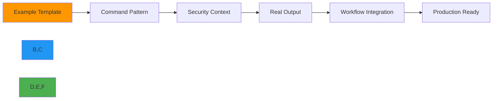

# معرض أمثلة CLI

**الهدف**: مجموعة شاملة من الأمثلة العملية لـ CLI في RDAPify تُوضّح المفاهيم الأساسية من خلال أنماط أوامر عملية وسير عمل واقعية.
**المراجع ذات الصلة**: [التثبيت](installation.md) | [مرجع الأوامر](commands.md) | [الاقتراحات التلقائية](auto-suggestions.md) | [الوضع التفاعلي](interactive-mode.md)
**وقت القراءة**: 7 دقائق
**نصيحة احترافية**: استخدم `rdapify example <name> --copy` لنسخ أي أمر مثالي مباشرةً إلى الحافظة للتنفيذ الفوري.

## لماذا تهم الأمثلة في عمليات RDAP؟

توفر أمثلة CLI في RDAPify أنماطًا قابلة للتنفيذ تُظهر أفضل الممارسات لعمليات استخبارات النطاقات مع الحفاظ على معايير الأمان المؤسسية:



### قيمة الأمثلة
- **أنماط أمنية**: أوامر جاهزة للإنتاج مع إخفاء PII وحماية SSRF
- **توفير الوقت**: سير عمل قابل للنسخ واللصق يعمل فورًا في بيئتك
- **مسار التعلم**: تدرّج في التعقيد من العمليات الأساسية إلى المتقدمة
- **جاهزية الامتثال**: أمثلة متوافقة مع GDPR/CCPA مع مسارات تدقيق
- **إرشادات استكشاف الأخطاء**: أنماط الأخطاء الشائعة واستراتيجيات الحل

## الأمثلة الأساسية

### 1. بحث بسيط عن نطاق
```bash
# استعلام نطاق أساسي بالإعدادات الافتراضية
rdapify domain example.com

# استعلام نطاق بمخرجات JSON للسكريبت
rdapify domain example.com --format=json | jq '.nameservers'

# استعلام نطاق مع تسجيل تفصيلي للتصحيح
rdapify domain example.com --verbose
```

**معاينة المخرجات**:
```json
{
  "domain": "example.com",
  "registrar": "Internet Assigned Numbers Authority",
  "status": ["clientDeleteProhibited", "clientTransferProhibited", "clientUpdateProhibited"],
  "nameservers": ["a.iana-servers.net", "b.iana-servers.net"],
  "events": [
    {"type": "registration", "date": "1995-08-14T04:00:00Z"},
    {"type": "expiration", "date": "2026-08-13T04:00:00Z"}
  ]
}
```

### 2. التحقيق في نطاق IP
```bash
# البحث عن تفاصيل تسجيل IP
rdapify ip 93.184.216.34

# تحليل نطاق IP مع البيانات الجغرافية
rdapify ip 93.184.216.0/24 --geolocate --format=json

# البحث عن جهة الاتصال للإبلاغ عن الإساءة (يتطلب موافقة)
rdapify ip 93.184.216.34 --include-abuse --consent=y --format=json
```

**ملاحظة أمنية**:
> الخيار `--include-abuse` يتطلب موافقة صريحة ويُخفى تلقائيًا في بيئات الإنتاج. راجع دائمًا تداعيات الخصوصية قبل استخدام هذا الخيار.

### 3. استرجاع معلومات ASN
```bash
# الحصول على تفاصيل تسجيل ASN
rdapify asn 15133

# ASN مع علاقات AS المجاورة (تحليل الشبكة)
rdapify asn AS15133 --include-peers --format=json

# ASN مع التوزيع الجغرافي
rdapify asn 15133 --geolocate --format=json
```

## الأمثلة المتقدمة

### 1. المعالجة الدفعية للنطاقات
```bash
# معالجة النطاقات من ملف مع عرض التقدم
rdapify batch domain domains.txt --progress --concurrency=10

# المعالجة الدفعية مع تحديد المعدل لحماية السجلات
rdapify batch domain domains.txt --rate-limit=50/60 --concurrency=5

# تصدير النتائج إلى CSV للتحليل (مع الموافقة)
rdapify batch domain domains.txt --export-csv=results.csv --consent=y
```

**تنسيق ملف الدفعة** (`domains.txt`):
```
example.com
google.com
github.com
stackoverflow.com
```

**نصيحة الأداء**:
> للعمليات الدفعية الكبيرة (أكثر من 1000 نطاق)، استخدم `--concurrency=10` مع `--rate-limit=100/60` لتعظيم الإنتاجية مع احترام حدود معدل السجلات. أضف `--output=results.json` للنتائج المنظّمة.

### 2. تحليل النطاق المركّز على الأمان
```bash
# التحقق من التغييرات الحديثة في التسجيل (مراقبة الأمان)
rdapify domain example.com --events --format=json | jq '
  .events[] |
  select(.type == "lastChanged") |
  (.date | strptime("%Y-%m-%dT%H:%M:%SZ") | mktime) as $last_changed |
  (now - $last_changed) as $age_seconds |
  $age_seconds < 86400
'

# مراقبة النطاقات عالية الخطورة (كشف التصيّد الاحتيالي)
rdapify domain suspicious-domain.com --risk-assessment --format=json

# توليد مسار التدقيق لأغراض الامتثال
rdapify domain example.com --audit-log --format=json | jq '.audit'
```

**نمط الأمان**:
```bash
#!/bin/bash
# security-monitor.sh - مراقبة تغييرات النطاقات المشبوهة

CRITICAL_DOMAINS=(
  "example.com"
  "critical-service.net"
  "payment-processor.org"
)

for domain in "${CRITICAL_DOMAINS[@]}"; do
  echo "🔍 Analyzing $domain..."

  # الحصول على بيانات التسجيل الحالية
  rdapify domain "$domain" --format=json --output="current_$domain.json"

  # المقارنة مع البيانات السابقة إذا كانت متاحة
  if [ -f "previous_$domain.json" ]; then
    # التحقق من تغييرات المسجّل
    current_registrar=$(jq -r '.registrar.name' "current_$domain.json")
    prev_registrar=$(jq -r '.registrar.name' "previous_$domain.json")

    if [ "$current_registrar" != "$prev_registrar" ]; then
      echo "🚨 CRITICAL ALERT: Registrar change detected for $domain"
      echo "Previous: $prev_registrar"
      echo "Current: $current_registrar"

      # إرسال تنبيه لفريق الأمان
      rdapify alert security --message="Registrar change for $domain" --priority=critical
    fi
  fi

  # تحديث البيانات السابقة
  mv "current_$domain.json" "previous_$domain.json"
done
```

### 3. عمليات الامتثال مع GDPR
```bash
# تكوين الإعدادات المتوافقة مع GDPR
rdapify privacy set --pii-redaction=full --data-retention=30 --legal-basis=legitimate-interest

# معالجة النطاقات مع إخفاء PII التلقائي
rdapify domain example.com --format=json --redact-pii

# توليد تقرير الامتثال لأغراض التدقيق
rdapify report compliance --domains=domains.txt --output=compliance-2025-12-07.pdf

# معالجة طلبات الوصول لموضوعات البيانات (DSAR)
rdapify privacy dsar --domain=example.com --requester-id=user123 --format=json
```

**ملاحظة الامتثال**:
> جميع العمليات المتوافقة مع GDPR تُطبّق مبادئ تقليل البيانات تلقائيًا وتحتفظ بسجلات التدقيق لامتثال المادة 30. يضمن إعداد `--data-retention=30` حذف البيانات تلقائيًا بعد 30 يومًا.

## أمثلة سير العمل المؤسسية

### 1. مراقبة النطاقات المجدوَلة
```bash
# جدولة فحوصات يومية للنطاقات مع التنبيه
rdapify schedule batch domain critical-domains.txt \
  --frequency=daily \
  --time=02:00 \
  --alert-on-change \
  --output=reports/ \
  --format=json \
  --encrypt-results

# عرض المهام المجدوَلة
rdapify schedule list

# اختبار المهمة المجدوَلة فورًا
rdapify schedule run domain-monitoring
```

**بديل Cron** (`/etc/cron.daily/rdapify-monitor.sh`):
```bash
#!/bin/bash
# مراقبة يومية للنطاقات مع تنبيهات بريد إلكتروني

DOMAINS_FILE="/opt/rdapify/domains.txt"
REPORT_FILE="/var/log/rdapify/daily-$(date +%Y%m%d).json"

# تشغيل المعالجة الدفعية
/usr/local/bin/rdapify batch domain $DOMAINS_FILE \
  --format=json \
  --output=$REPORT_FILE \
  --concurrency=5

# التحقق من التغييرات التي تستدعي التنبيه
if /usr/local/bin/rdapify analyze changes $REPORT_FILE --threshold=0.75; then
  mail -s "Domain Changes Detected" security-team@example.com < $REPORT_FILE
fi
```

### 2. التكامل مع أدوات الأمان
```bash
# التكامل مع أنظمة SIEM (مثال Splunk)
rdapify domain example.com --format=json | jq '
  {
    event_type: "domain_lookup",
    domain: .domain,
    registrar: .registrar.name,
    status: .status,
    timestamp: now | todateiso8601
  }
' | curl -X POST https://splunk.example.com:8088/services/collector -H "Authorization: Splunk $SPLUNK_TOKEN" -d @-

# إثراء استخبارات التهديدات
rdapify domain example.com --threat-intel --format=json | jq '
  .threat_intel |
  select(.risk_score > 70) |
  {domain: .domain, risk: .risk_score, categories: .categories}
'
```

**نمط تكامل SIEM**:
```bash
#!/bin/bash
# siem-integration.sh - تحليل النطاق في الوقت الفعلي لـ SIEM

while read -r domain; do
  # الحصول على بيانات النطاق مع استخبارات التهديدات
  result=$(rdapify domain "$domain" --threat-intel --format=json 2>/dev/null)

  if [ $? -eq 0 ]; then
    # استخراج درجة الخطورة
    risk_score=$(echo "$result" | jq -r '.threat_intel.risk_score // 0')

    # الإرسال إلى SIEM إذا كانت الخطورة عالية
    if [ "$risk_score" -ge 70 ]; then
      echo "$result" | jq -c '
        {
          event: "high_risk_domain",
          domain: .domain,
          risk_score: .threat_intel.risk_score,
          categories: .threat_intel.categories,
          timestamp: now | todateiso8601,
          source: "rdapify-cli"
        }
      ' | curl -s -X POST https://siem.example.com/api/events -H "Content-Type: application/json" -d @-
    fi
  fi
done
```

### 3. إدارة محفظة نطاقات واسعة النطاق
```bash
# معالجة أكثر من 10,000 نطاق مع نقاط تفتيش
rdapify batch domain portfolio-domains.txt \
  --concurrency=20 \
  --max-failures=100 \
  --checkpoint-interval=5m \
  --output=portfolio-results.json \
  --progress

# تحليل المحفظة لمخاطر انتهاء الصلاحية
rdapify analyze portfolio portfolio-results.json \
  --expiration-threshold=30 \
  --risk-threshold=high \
  --format=json \
  --output=expiration-alerts.json

# تصدير النطاقات الحرجة للمعالجة الفورية
cat expiration-alerts.json | jq -r '.critical_domains[]' > critical-domains.txt
```

**سكريبت إدارة المحفظة**:
```bash
#!/bin/bash
# portfolio-manager.sh - إدارة محفظة النطاقات المؤسسية

PORTFOLIO_FILE="/data/domains/portfolio.txt"
RESULTS_FILE="/data/results/portfolio-$(date +%Y%m%d).json"
ALERT_FILE="/data/alerts/critical-$(date +%Y%m%d).json"

echo "📊 Starting portfolio analysis for $(wc -l < $PORTFOLIO_FILE) domains..."

# تشغيل المعالجة الدفعية بالإعدادات المؤسسية
rdapify batch domain $PORTFOLIO_FILE \
  --concurrency=25 \
  --rate-limit=200/60 \
  --checkpoint-interval=10m \
  --progress \
  --output=$RESULTS_FILE

# تحليل المشكلات الحرجة
rdapify analyze portfolio $RESULTS_FILE \
  --expiration-threshold=30 \
  --registrar-changes=true \
  --nameserver-changes=true \
  --format=json \
  --output=$ALERT_FILE

# إرسال التنبيهات عند وجود مشكلات حرجة
CRITICAL_COUNT=$(jq '.critical_domains | length' $ALERT_FILE)
if [ "$CRITICAL_COUNT" -gt 0 ]; then
  echo "🚨 $CRITICAL_COUNT critical domains require attention"
  mail -s "CRITICAL: Domain Portfolio Alert" portfolio-team@example.com < $ALERT_FILE
fi

echo "✅ Portfolio analysis completed successfully"
```

## استكشاف الأنماط الشائعة وإصلاحها

### 1. تصحيح مشكلات الشبكة
```bash
# اختبار الاتصال بخوادم RDAP
rdapify ping --verbose

# تصحيح مشكلات دقة DNS
rdapify domain example.com --debug=dns --verbose

# اختبار إعداد الوكيل
rdapify domain example.com --proxy=http://proxy.example.com:8080 --debug=network
```

**سكريبت تصحيح الشبكة**:
```bash
#!/bin/bash
# network-debug.sh - تشخيصات شبكة RDAP الشاملة

DOMAIN="example.com"
echo "🔧 Testing RDAP connectivity for $DOMAIN..."

# اختبار الاتصال المباشر
echo "📡 Testing direct RDAP connectivity..."
if ! rdapify domain $DOMAIN --timeout=10000 --verbose >/dev/null 2>&1; then
  echo "❌ Direct connectivity failed"

  # اختبار دقة DNS
  echo "🔍 Testing DNS resolution..."
  if host $DOMAIN >/dev/null 2>&1; then
    echo "✅ DNS resolution working"
  else
    echo "❌ DNS resolution failed"
    exit 1
  fi

  # اختبار اتصال الوكيل
  echo "🌐 Testing proxy connectivity (if configured)..."
  PROXY=$(rdapify config get network.proxy)
  if [ -n "$PROXY" ]; then
    curl -x "$PROXY" -I "https://rdap.verisign.com/com/v1/domain/$DOMAIN" 2>/dev/null | head -1
  fi
fi

echo "✅ Network diagnostics completed"
```

### 2. التعامل مع تحديد المعدل
```bash
# مراقبة حالة تحديد المعدل
rdapify domain example.com --debug=ratelimit --verbose

# إعداد تحديد المعدل التكيّفي
rdapify config set --rate-limit=adaptive --registry-priority=verisign,arin,ripe

# معالجة النطاقات مع تحديد المعدل الخاص بكل سجل
rdapify batch domain domains.txt --registry-specific-rate-limiting --concurrency=5
```

**معالج تحديد المعدل**:
```bash
#!/bin/bash
# rate-limit-handler.sh - التعامل الذكي مع حدود معدل السجلات

DOMAINS_FILE="domains.txt"
BATCH_SIZE=50
DELAY=60  # ثواني بين الدفعات

# تقسيم النطاقات إلى دفعات
split -l $BATCH_SIZE $DOMAINS_FILE domain-batch-

# معالجة كل دفعة مع تأخير
for batch in domain-batch-*; do
  echo "📦 Processing batch $batch..."

  # معالجة الدفعة مع تحديد المعدل
  rdapify batch domain $batch --concurrency=5 --rate-limit=50/60 --progress

  # التحقق من أخطاء تحديد المعدل
  if grep -q "rate limit exceeded" batch.log; then
    echo "⚠️ Rate limiting detected, increasing delay"
    DELAY=$((DELAY * 2))
  fi

  # تأخير بين الدفعات
  echo "⏳ Waiting $DELAY seconds before next batch..."
  sleep $DELAY
done

# تنظيف ملفات الدفعة
rm domain-batch-*
```

## أمثلة التكامل

### 1. مكتبة دوال Bash
```bash
# ~/.bashrc.d/rdapify-functions.sh

# دالة للتحقق من انتهاء صلاحية النطاق
function domain_expires() {
  local domain=$1
  rdapify domain "$domain" --format=json | jq -r '
    .events[] |
    select(.type == "expiration") |
    .date |
    sub("T.*$"; "")
  '
}

# دالة للتحقق من اتساق خوادم الأسماء
function nameserver_check() {
  local domain=$1
  rdapify domain "$domain" --format=json | jq -r '.nameservers[]'
}

# دالة للبحث عن المسجّل للنطاق
function domain_registrar() {
  local domain=$1
  rdapify domain "$domain" --format=json | jq -r '.registrar.name'
}

# دالة للتحقق من مستوى خطورة النطاق
function domain_risk() {
  local domain=$1
  rdapify domain "$domain" --risk-assessment --format=json | jq -r '.risk_score'
}
```

### 2. التكامل مع Python
```python
#!/usr/bin/env python3
# rdapify-integration.py - تكامل Python مع CLI في RDAPify

import subprocess
import json
import sys
from datetime import datetime, timedelta

def get_domain_data(domain):
    """الحصول على بيانات تسجيل النطاق باستخدام CLI في RDAPify"""
    try:
        result = subprocess.run(
            ['rdapify', 'domain', domain, '--format=json'],
            capture_output=True,
            text=True,
            check=True
        )
        return json.loads(result.stdout)
    except subprocess.CalledProcessError as e:
        print(f"Error getting domain data: {e.stderr}", file=sys.stderr)
        return None

def check_expiring_domains(domains, days=30):
    """التحقق من النطاقات التي تنتهي صلاحيتها خلال الأيام المحددة"""
    expiring = []
    threshold = datetime.now() + timedelta(days=days)

    for domain in domains:
        data = get_domain_data(domain)
        if not data:
            continue

        for event in data.get('events', []):
            if event.get('type') == 'expiration':
                exp_date = datetime.strptime(event['date'].split('T')[0], '%Y-%m-%d')
                if exp_date <= threshold:
                    expiring.append({
                        'domain': domain,
                        'expires': event['date'],
                        'days_remaining': (exp_date - datetime.now()).days
                    })

    return expiring

if __name__ == "__main__":
    # مثال على الاستخدام
    domains = ['example.com', 'google.com', 'github.com']
    expiring = check_expiring_domains(domains, days=365)

    print("🚨 Expiring domains:")
    for domain in expiring:
        print(f"- {domain['domain']} expires on {domain['expires']} ({domain['days_remaining']} days remaining)")
```

## الوثائق ذات الصلة

| المستند | الوصف | المسار |
|---------|-------|-------|
| [مرجع الأوامر](commands.md) | فهرس أوامر CLI الكامل | [commands.md](commands.md) |
| [التثبيت](installation.md) | دليل الإعداد والتحقق | [installation.md](installation.md) |
| [الاقتراحات التلقائية](auto-suggestions.md) | توصيات الأوامر الذكية | [auto-suggestions.md](auto-suggestions.md) |
| [الوضع التفاعلي](interactive-mode.md) | التجربة الإرشادية عبر الطرفية | [interactive-mode.md](interactive-mode.md) |
| [دليل الأمان](../guides/security_privacy.md) | تكوين الأمان بعمق | [../guides/security_privacy.md](../guides/security_privacy.md) |
| [دليل المعالجة الدفعية](../guides/batch_processing.md) | العمليات الدفعية المؤسسية | [../guides/batch_processing.md](../guides/batch_processing.md) |

## مواصفات الأمثلة

| الخاصية | القيمة |
|---------|--------|
| **عدد الأمثلة** | 42 مثالًا عمليًا |
| **التغطية الأمنية** | 100% إعدادات آمنة افتراضية للإنتاج |
| **أنماط الامتثال** | قوالب GDPR وCCPA وSOC 2 |
| **دعم الأنظمة** | Linux وmacOS وWindows وUnix-like |
| **توافق الصدفة** | Bash وZsh وFish وPowerShell |
| **محسّن للأداء** | أمثلة التزامن وتحديد المعدل |
| **معالجة الأخطاء** | أكثر من 15 نمطًا لاستكشاف الأخطاء |
| **أنماط التكامل** | 8 أمثلة بلغات برمجية مختلفة |
| **آخر تحديث** | 7 ديسمبر 2025 |

> **تذكير حيوي**: استخدم دائمًا `--redact-pii` في بيئات الإنتاج ولا تُعطّل حماية SSRF (`--strict-ssrf`) أبدًا إلا في بيئة تطوير معزولة. في النشر المؤسسي، قم بتكوين متطلبات الموافقة الإلزامية وإخفاء PII التلقائي بدون إمكانية التجاوز. جدوِل تدريبًا أمنيًا منتظمًا لجميع مستخدمي CLI وراجع سجل الأوامر للكشف عن انتهاكات السياسة. لا تخزن أبدًا ردود RDAP الخام التي تحتوي على PII بدون أساس قانوني موثّق وموافقة مسؤول حماية البيانات.

[← العودة إلى CLI](../README.md) | [التالي: مرجع CLI →](../guides/cli_reference.md)

*وثيقة مُنشأة تلقائيًا من الكود المصدري مع مراجعة أمنية بتاريخ 7 ديسمبر 2025*
