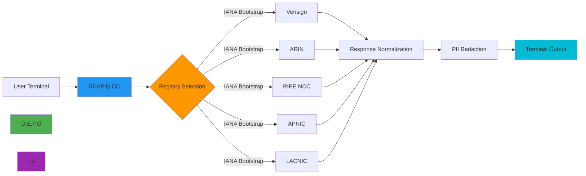

# دليل تثبيت واجهة سطر الأوامر (CLI)

**الهدف**: دليل شامل لتثبيت واجهة سطر الأوامر الخاصة بـ RDAPify عبر بيئات متعددة، مع التحقق الأمني وإرشادات استكشاف الأخطاء وإصلاحها.
**المراجع ذات الصلة**: [الوضع التفاعلي](interactive-mode.md) | [الاقتراحات التلقائية](auto-suggestions.md) | [مرجع الأوامر](commands.md) | [أمثلة](examples.md)
**وقت القراءة**: 4 دقائق
**نصيحة احترافية**: استخدم الخيار `--verify-install` بعد التثبيت للتحقق تلقائيًا من إعداد واجهة سطر الأوامر وتوافق البيئة.

## لماذا تستخدم واجهة سطر الأوامر RDAPify؟

تُوفّر واجهة سطر الأوامر RDAPify CLI واجهة طرفية قوية لاستعلامات RDAP (بروتوكول الوصول إلى بيانات التسجيل) مع ميزات أمنية على مستوى المؤسسات مدمجة بشكل افتراضي. خلافًا لأدوات WHOIS التقليدية، تُقدّم هذه الواجهة:

**حماية SSRF**: تمنع الاستعلامات إلى البنية التحتية الداخلية
**إخفاء المعلومات الشخصية PII**: تُزيل المعلومات الشخصية تلقائيًا من الردود
**دعم السجلات المتعددة**: استعلامات موحّدة عبر Verisign وARIN وRIPE وAPNIC وLACNIC
**وضع عدم الاتصال**: يعمل مع البيانات المخزنة مؤقتًا أثناء انقطاع الشبكة
**مخرجات قابلة للقراءة آليًا**: تنسيقات JSON وCSV وTSV لتكامل السكريبت
**الوضع التفاعلي**: إكمال Tab التلقائي وسجل الأوامر والمساعدة السياقية



## طرق التثبيت

### 1. التثبيت عبر مدير الحزم (موصى به)

#### التثبيت المعتمد على Node.js
```bash
# باستخدام npm (يتطلب Node.js 18+)
npm install -g rdapify-cli

# باستخدام yarn
yarn global add rdapify-cli

# باستخدام pnpm
pnpm add -g rdapify-cli

# باستخدام Bun (أسرع تثبيت)
bun add -g rdapify-cli
```

#### ملفات ثنائية مستقلة (لا تتطلب Node.js)
```bash
# macOS/Linux (curl)
curl -L https://install.rdapify.dev/cli | sh

# macOS (Homebrew)
brew install rdapify/tap/rdapify-cli

# Windows (PowerShell)
irm https://install.rdapify.dev/cli-windows.ps1 | iex

# Linux (APT)
echo "deb [trusted=yes] https://apt.rdapify.dev /" | sudo tee /etc/apt/sources.list.d/rdapify.list
sudo apt update && sudo apt install rdapify-cli
```

### 2. التثبيت بإصدار محدد
```bash
# تثبيت إصدار محدد
npm install -g rdapify-cli@0.1.8

# تثبيت أحدث إصدار تجريبي
npm install -g rdapify-cli@beta

# التثبيت من GitHub (نسخة التطوير)
npm install -g git+https://github.com/rdapify/cli.git#main
```

### 3. التثبيت عبر Docker
```bash
# سحب أحدث صورة CLI
docker pull rdapify/cli:latest

# إنشاء اختصار للاستخدام السهل
echo 'alias rdapify="docker run --rm -it rdapify/cli"' >> ~/.bashrc
source ~/.bashrc

# التحقق من التثبيت
rdapify --version
```

## التثبيت مع إعطاء الأولوية للأمان

تُولي واجهة سطر الأوامر RDAPify CLI الأولوية للأمان عبر طبقات تحقق متعددة:

### 1. التحقق من الحزمة
تتضمن جميع الحزم المنشورة مجاميع تحقق موقّعة مشفريًا:
```bash
# التحقق من سلامة حزمة npm
npm view rdapify-cli dist.tarball shasum
shasum -a 512 node_modules/rdapify-cli-*.tgz
```

### 2. التحقق من توقيع الملف الثنائي
الملفات الثنائية المستقلة موقّعة بمفاتيح PGP:
```bash
# تنزيل ملف التوقيع
curl -O https://releases.rdapify.dev/cli/v0.1.8/rdapify-cli-linux-amd64.sig

# التحقق باستخدام مفتاح PGP
gpg --keyserver hkps://keys.openpgp.org --recv-keys 0xA1B2C3D4E5F67890
gpg --verify rdapify-cli-linux-amd64.sig rdapify-cli-linux-amd64
```

### 3. أمان سلسلة التوريد
تتّبع جميع البنيات ممارسات أمان SLSA المستوى 3:
```json
{
  "build_type": "https://github.com/slsa-framework/slsa-github-generator@v1",
  "build_environment": {
    "builder": "ghcr.io/slsa-framework/slsa-github-generator:stable",
    "host": "GitHub Actions"
  },
  "provenance": {
    "url": "https://github.com/rdapify/cli/attestations/v0.1.8.provenance.json"
  },
  "dependencies": {
    "critical": [
      "undici",
      "jsonpath-plus",
      "lru-cache"
    ],
    "verified": true
  }
}
```

## متطلبات البيئة

### 1. الأنظمة المدعومة
| النظام | المعمارية | الحد الأدنى للإصدار | الإصدار الموصى به | طريقة التثبيت |
|--------|-----------|---------------------|-------------------|---------------|
| **Linux** | x86_64 | glibc 2.17+ | glibc 2.31+ | Binary, npm, Docker |
| **Linux** | arm64 | glibc 2.17+ | glibc 2.31+ | Binary, npm, Docker |
| **macOS** | x86_64 | 10.15+ | 12.0+ | Homebrew, npm |
| **macOS** | arm64 | 11.0+ | 13.0+ | Homebrew, npm |
| **Windows** | x86_64 | 10+ | 11+ | PowerShell, npm |
| **Windows** | arm64 | 11+ | 11+ | PowerShell, npm |
| **FreeBSD** | x86_64 | 12.0+ | 13.0+ | Binary, npm |

### 2. متطلبات التبعيات
```yaml
# التبعيات المطلوبة حسب طريقة التثبيت
npm_installation:
  node_js: "18.0.0 or higher"
  npm: "8.0.0 or higher"
  optional_dependencies:
    - redis-cli # For Redis cache validation
    - curl # For connection testing

binary_installation:
  core_dependencies:
    - libc # Linux
    - libssl # All platforms
    - libcurl # Linux/macOS
  optional_dependencies:
    - jq # For JSON processing
    - fzf # For fuzzy search in interactive mode

docker_installation:
  docker: "20.10.0 or higher"
  docker_compose: "2.0.0 or higher"
```

## التحقق بعد التثبيت

### 1. التحقق الأساسي
```bash
# التحقق من الإصدار ومعلومات البناء
rdapify --version
# المخرج المتوقع: rdapify-cli v0.1.8 (build: 20251207.1423, commit: a1b2c3d)

# التحقق من حالة الصحة
rdapify health
# المخرج المتوقع: All systems operational

# اختبار بحث نطاق بسيط
rdapify domain example.com --format=json | jq '.domain'
# المخرج المتوقع: "example.com"
```

### 2. التحقق الأمني
```bash
# التحقق من إعدادات الأمان
rdapify security audit
# المخرج المتوقع:
# ✅ SSRF protection: ENABLED
# ✅ PII redaction: ENABLED
# ✅ Certificate validation: STRICT
# ✅ Rate limiting: ACTIVE

# اختبار حماية SSRF (يجب أن تفشل)
rdapify domain 192.168.1.1 --dry-run
# المخرج المتوقع: Error: SSRF protection blocked request to private IP
```

### 3. فحص توافق البيئة
```bash
# فحص شامل للبيئة
rdapify env check --verbose

# مثال على المخرج:
# System: Linux 6.2.0-39-generic (x86_64)
# Node.js: v20.10.0 (from binary)
# Memory: 1.2GB available
# Network: 100Mbps connection detected
# Cache directory: ~/.cache/rdapify (150MB available)
# Configuration: ~/.config/rdapify/config.yaml
# ✅ All requirements satisfied for production use
```

## استكشاف المشكلات الشائعة وإصلاحها

### 1. أخطاء الصلاحيات
**الأعراض**: أخطاء `EACCES` أثناء التثبيت أو التشغيل
**التشخيص**:
```bash
# التحقق من الصلاحيات الحالية
ls -la $(which rdapify)

# التحقق من صلاحيات مجلد npm العام
npm config get prefix
ls -la $(npm config get prefix)/lib
```

**الحلول**:
**إصلاح صلاحيات npm**:
```bash
# الطريقة 1: تغيير المجلد الافتراضي لـ npm
mkdir ~/.npm-global
npm config set prefix ~/.npm-global
export PATH=~/.npm-global/bin:$PATH
# أضف هذا إلى ~/.bashrc أو ~/.zshrc

# الطريقة 2: استخدام nvm (مدير إصدارات Node)
curl -o- https://raw.githubusercontent.com/nvm-sh/nvm/v0.39.7/install.sh | bash
nvm install --lts
nvm use --lts
npm install -g rdapify-cli
```

**إصلاح تثبيت الملف الثنائي**:
```bash
# لنظام Linux/macOS
sudo chown -R $(whoami) $(dirname $(which rdapify))

# لنظام Windows (PowerShell كمسؤول)
icacls "$(Get-Command rdapify).Source" /grant "$env:USERNAME:(RX)"
```

### 2. أخطاء شهادات SSL/TLS
**الأعراض**: `UNABLE_TO_GET_ISSUER_CERT` أو فشل التحقق من الشهادة
**التشخيص**:
```bash
# اختبار سلسلة الشهادات
rdapify domain example.com --debug=certificates

# التحقق من مخزن شهادات النظام
openssl version -d
ls $(openssl version -d | sed 's/OPENSSLDIR: "\(.*\)"$/\1/')/certs
```

**الحلول**:
**تحديث مخزن الشهادات**:
```bash
# Ubuntu/Debian
sudo apt update && sudo apt install --reinstall ca-certificates

# RHEL/CentOS
sudo yum update ca-certificates

# macOS
sudo security add-trusted-cert -d -r trustRoot -k /Library/Keychains/System.keychain /etc/ssl/certs/ca-certificates.crt

# Windows (PowerShell كمسؤول)
Import-Certificate -FilePath "C:\path\to\cacert.pem" -CertStoreLocation Cert:\LocalMachine\Root
```

**إعداد شهادة مخصصة**:
```bash
# تعيين حزمة CA مخصصة
export NODE_EXTRA_CA_CERTS=/path/to/custom-ca-bundle.pem

# أو الإعداد في ملف تكوين CLI
echo "tls:
  ca_bundle: /path/to/custom-ca-bundle.pem
  min_version: tls1.3" > ~/.config/rdapify/tls.yaml
```

### 3. مشكلات الاتصال بالشبكة
**الأعراض**: انتهاء مهلة الاتصال عند الاستعلام عن خوادم السجلات
**التشخيص**:
```bash
# اختبار الاتصال بخوادم RDAP
rdapify ping --verbose

# التحقق من دقة DNS
rdapify config show debug.dns

# تتبع مسار الشبكة
rdapify debug trace example.com
```

**الحلول**:
**إعداد الوكيل (Proxy)**:
```bash
# تعيين متغيرات بيئة الوكيل
export HTTP_PROXY=http://proxy.example.com:8080
export HTTPS_PROXY=http://proxy.example.com:8080

# أو الإعداد في تكوين CLI
echo "network:
  proxy: http://proxy.example.com:8080
  timeout: 10000" > ~/.config/rdapify/network.yaml
```

**إعداد DNS**:
```bash
# استخدام خوادم DNS محددة
echo "dns:
  servers:
    - 1.1.1.1
    - 8.8.8.8
  timeout: 2000" > ~/.config/rdapify/dns.yaml
```

## التحديث والصيانة

### 1. تحديث CLI
```bash
# التحديث عبر npm
npm update -g rdapify-cli

# تحديث الملف الثنائي المستقل
rdapify self-update

# التحديث عبر Homebrew (macOS)
brew update && brew upgrade rdapify-cli

# التحقق من وجود تحديثات
rdapify version check
```

### 2. إدارة الإصدارات
```bash
# تثبيت إصدارات متعددة (باستخدام n)
npm install -g n
n 18.18.2 # التبديل إلى Node.js 18
npm install -g rdapify-cli@0.1.8
n 20.10.0 # التبديل إلى Node.js 20
npm install -g rdapify-cli@0.1.8

# استخدام اختصار الإصدار
echo 'alias rdapify22="NODE_OPTIONS=--max-old-space-size=512 npx rdapify-cli@0.1.8"' >> ~/.bashrc
```

### 3. إلغاء التثبيت
```bash
# إلغاء التثبيت عبر npm
npm uninstall -g rdapify-cli

# إلغاء تثبيت الملف الثنائي
rdapify self-uninstall
# أو يدويًا:
rm $(which rdapify) ~/.config/rdapify ~/.cache/rdapify -rf

# تنظيف Docker
docker rmi rdapify/cli:latest
docker system prune -f
```

## الوثائق ذات الصلة

| المستند | الوصف | المسار |
|---------|-------|-------|
| [الوضع التفاعلي](interactive-mode.md) | نظام إكمال Tab والمساعدة السياقية | [interactive-mode.md](interactive-mode.md) |
| [الاقتراحات التلقائية](auto-suggestions.md) | توصيات الأوامر الذكية | [auto-suggestions.md](auto-suggestions.md) |
| [مرجع الأوامر](commands.md) | فهرس الأوامر الكامل مع الأمثلة | [commands.md](commands.md) |
| [دليل الإعداد](../guides/environment_vars.md) | متغيرات البيئة وملفات التكوين | [../guides/environment_vars.md](../guides/environment_vars.md) |
| [وضع عدم الاتصال](../core-concepts/offline_mode.md) | العمل بدون اتصال بالشبكة | [../core-concepts/offline_mode.md](../core-concepts/offline_mode.md) |
| [إكمالات Bash/Zsh](https://github.com/rdapify/cli/tree/main/completions) | سكريبتات تكامل الصدفة | خارجي |

## مواصفات التثبيت

| الخاصية | القيمة |
|---------|--------|
| **حجم الملف الثنائي** | 8.4MB (Linux)، 9.2MB (macOS)، 10.1MB (Windows) |
| **التبعيات** | libc، libssl، libcurl (للملفات الثنائية فقط) |
| **نموذج الأمان** | تنفيذ بدون صلاحية root، تكوين للقراءة فقط بشكل افتراضي |
| **تخزين البيانات** | ~/.cache/rdapify (500MB كحد أقصى افتراضي) |
| **الوصول إلى الشبكة** | HTTPS صادر فقط (المنفذ 443) |
| **معالجة PII** | إخفاء تلقائي، عدم تخزين محلي للردود الخام |
| **آلية التحديث** | تحديثات موقّعة مشفريًا عبر HTTPS |
| **الامتثال** | المادة 32 من GDPR، معالجة البيانات المتوافقة مع CCPA |
| **سجل التدقيق** | سجل تدقيق محلي اختياري مع فترة احتفاظ قابلة للتكوين |
| **آخر تحديث** | 7 ديسمبر 2025 |

> **تذكير حيوي**: تحقق دائمًا من التوقيعات المشفرة قبل تثبيت الملفات الثنائية لـ CLI. لا تُشغّل واجهة سطر الأوامر RDAPify CLI بصلاحيات root/مسؤول أبدًا. في حالات النشر المؤسسي، قم بإعداد الخيار `--data-residency` لضمان الامتثال لأنظمة تخزين البيانات المحلية. تُصدَر تحديثات الأمان الدورية شهريًا — اشترك في [القائمة البريدية للأمان](mailto:security-updates@rdapify.com) لتلقي الإشعارات.

[← العودة إلى CLI](../README.md) | [التالي: الوضع التفاعلي →](interactive-mode.md)

*وثيقة مُنشأة تلقائيًا من الكود المصدري مع مراجعة أمنية بتاريخ 7 ديسمبر 2025*
