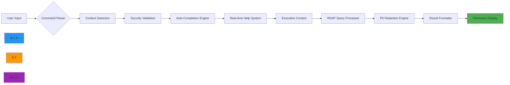

# دليل الوضع التفاعلي لـ CLI

**الهدف**: دليل شامل لاستخدام وضع CLI التفاعلي في RDAPify مع المساعدة الفورية والإكمال التلقائي والوعي السياقي لعمليات استخبارات النطاقات بكفاءة.
**المراجع ذات الصلة**: [التثبيت](installation.md) | [الاقتراحات التلقائية](auto-suggestions.md) | [مرجع الأوامر](commands.md) | [أمثلة](examples.md)
**وقت القراءة**: 5 دقائق
**نصيحة احترافية**: اضغط `Ctrl+Space` في أي وقت لتشغيل تراكب المساعدة السياقية مع توثيق وأمثلة خاصة بالأمر.

## لماذا الوضع التفاعلي؟

يُحوّل وضع CLI التفاعلي في RDAPify أبحاث النطاقات الطرفية إلى تجربة إرشادية بديهية مع حماية أمنية وخصوصية على مستوى المؤسسات:



### الميزات التفاعلية الرئيسية
- **الإكمال السياقي**: تتكيّف الأوامر بناءً على سياق الاستعلام الحالي
- **تنبيهات الأمان الفورية**: ردود فعل فورية على العمليات غير الآمنة المحتملة
- **الإفصاح التدريجي**: خيارات معقدة تظهر فقط عند الحاجة
- **سجل الجلسة**: سجل أوامر كامل مع إمكانيات البحث والإعادة
- **تنسيق النتائج المرئي**: مخرجات ملونة ومنظّمة مُحسَّنة لعرض الطرفية
- **سير العمل متعدد الخطوات**: سير عمل إرشادي للعمليات المعقدة كالمعالجة الدفعية

## البدء مع الوضع التفاعلي

### 1. تشغيل الوضع التفاعلي
```bash
# بدء الوضع التفاعلي
rdapify interactive

# البدء مع سياق نطاق محدد
rdapify interactive --domain example.com

# البدء في وضع التفصيل للتصحيح
rdapify interactive --verbose

# البدء مع إعداد مخصص
rdapify interactive --config ~/.config/rdapify/enterprise.yaml
```

### 2. نظرة عامة على الصدفة التفاعلية
```
🚀 RDAPify Interactive Shell v0.1.8
📚 Type 'help' for command list, 'tutorial' for guided tour
🔍 Current context: [global]
🔐 Security level: [production]

rdapify> _
```

**مؤشرات حالة الصدفة**:
| المؤشر | القيم | المعنى |
|--------|-------|---------|
| سياق | `global`، `domain:example.com`، `batch:10` | السياق التشغيلي الحالي |
| الأمان | `development`، `staging`، `production` | ملف الأمان النشط |
| الشبكة | `online`، `offline`، `degraded` | حالة الاتصال بالسجل |
| الأداء | `optimal`، `degraded`، `maintenance` | حالة أداء الخلفية |

### 3. الأوامر التفاعلية الأساسية
```bash
# الحصول على مساعدة حول الأوامر المتاحة
rdapify> help

# بدء الجولة الإرشادية
rdapify> tutorial

# مسح الشاشة
rdapify> clear

# الخروج من الوضع التفاعلي
rdapify> exit
rdapify> quit

# عرض سجل الأوامر
rdapify> history

# إعادة تنفيذ الأمر السابق
rdapify> !-1
```

## الميزات التفاعلية المتقدمة

### 1. نظام الأوامر السياقي
```bash
# عند الدخول في سياق النطاق، تتكيّف الأوامر
rdapify> domain example.com
🔍 Context changed to: [domain:example.com]
🔐 PII redaction enabled for this context

rdapify@domain:example.com>
  • Available commands:
    - whois (legacy fallback)
    - history (registration history)
    - nameservers (current nameservers)
    - transfer (transfer status)
    - export (save results)
  • Type '?' for context-specific help

# تظهر الأوامر الخاصة بالسجل عند الاقتضاء
rdapify@domain:ripe.net>
  • RIPE NCC specific commands:
    - abuse-contact (show abuse contact)
    - org-structure (show organization structure)
    - net-allocations (show IP allocations)
```

### 2. ردود الفعل الأمنية الفورية
```bash
# محاولة عملية غير آمنة محتملة
rdapify> domain 192.168.1.1
⚠️ SECURITY ALERT: SSRF protection blocked request to private IP
💡 Suggestion: Use public domain names only in production environments
✅ Security policy: [strict-internal-block]

# محاولة الوصول إلى PII
rdapify> domain example.com --include-raw
🔐 PRIVACY NOTICE: Raw registry data contains PII
🔒 Policy enforcement: [gdpr-article-6]
💡 To view raw data, use development mode: 'rdapify interactive --security-level development'
```

### 3. بناء الاستعلام المرئي
```bash
# بدء منشئ الاستعلام المرئي
rdapify> query --visual

┌─────────────────────────────────────────────────────┐
│              RDAP Query Builder (Visual)            │
├─────────────────────────────────────────────────────┤
│ Target: [_______________________] ▶ (Domain/IP/ASN)│
│ Options:                                             │
│   ☑ Redact PII (GDPR compliant)                     │
│   ☐ Include raw response                            │
│   ☑ Cache results (1 hour TTL)                       │
│   ☐ Verbose logging                                  │
│                                                     │
│ Registry: [Auto-detect from IANA bootstrap] ▼       │
│ Timeout:  [5000] ms                                 │
│                                                     │
│ Actions: [Build Query] [Cancel] [Load Template]    │
└─────────────────────────────────────────────────────┘
```

## ضوابط الأمان والخصوصية

### 1. ملفات الأمان التفاعلية
```bash
# عرض ملف الأمان الحالي
rdapify> security status

🔐 Active Security Profile: [production]
✅ SSRF Protection: ENABLED
✅ PII Redaction: FULL
✅ Certificate Validation: STRICT
✅ Rate Limiting: ACTIVE (100 req/min)
✅ Network Isolation: ENABLED
✅ Audit Logging: ENABLED

# التبديل إلى ملف التطوير (أمان أقل)
rdapify> security set-profile development
⚠️ WARNING: Development profile disables PII redaction and SSRF protection
💡 Use only for testing with non-sensitive data
✅ Profile changed to: [development]

# إنشاء ملف أمان مخصص
rdapify> security create-profile enterprise
🔐 Creating profile 'enterprise'...
❓ Enable PII redaction? [Y/n]: Y
❓ Enable SSRF protection? [Y/n]: Y
❓ Set rate limit (requests/minute): 500
❓ Enable audit logging? [Y/n]: Y
✅ Profile 'enterprise' created successfully
```

### 2. إدارة الموافقة للعمليات الحساسة
```bash
# محاولة عملية تتطلب موافقة صريحة
rdapify> domain example.com --export-csv
🔐 SENSITIVE OPERATION REQUIRES CONSENT
📋 This operation will:
   • Export registration data to CSV format
   • Store results in current directory
   • Preserve timestamps and metadata

❓ Do you consent to this operation? [y/N]: y
✅ Consent recorded for audit purposes
💾 Exporting to example.com_2025-12-07.csv...
✅ Export completed successfully
```

### 3. مسار التدقيق للجلسات التفاعلية
```bash
# عرض سجل تدقيق الجلسة
rdapify> audit log

┌─────────────────────────────────────────────────────────┐
│                  Session Audit Log                      │
├───────────────┬───────────────────┬─────────────────────┤
│ Timestamp     │ Command           │ Context/Outcome     │
├───────────────┼───────────────────┼─────────────────────┤
│ 2025-12-07T14:23:45Z │ help         │ [global]            │
│ 2025-12-07T14:24:12Z │ domain example.com │ [domain] ✓ Success │
│ 2025-12-07T14:25:03Z │ domain 192.168.1.1 │ [domain] ✗ SSRF Blocked │
│ 2025-12-07T14:26:18Z │ security status │ [security] ✓ Success │
│ 2025-12-07T14:27:45Z │ audit log    │ [audit] ✓ Success   │
└───────────────┴───────────────────┴─────────────────────┘

# توليد تقرير الامتثال
rdapify> audit report --format=json --output=audit_2025-12-07.json
✅ Compliance report generated successfully
📊 Report includes:
   • 5 commands executed
   • 1 security event (SSRF block)
   • 1 consent operation
   • GDPR Article 30 compliant format
```

## تصوير البيانات وتحليلها

### 1. عروض النتائج التفاعلية
```bash
# عرض نتائج النطاق بتنسيقات مختلفة
rdapify@domain:example.com> view

┌─────────────────────────────────────────────────────────┐
│                 Available View Options                  │
├───────────────┬───────────────────┬─────────────────────┤
│ Format        │ Description       │ Command             │
├───────────────┼───────────────────┼─────────────────────┤
│ Standard      │ Default view      │ view standard       │
│ Summary       │ Brief overview    │ view summary        │
│ JSON          │ Raw JSON output   │ view json           │
│ Timeline      │ Registration history │ view timeline    │
│ Relationship  │ Entity relationships │ view relationship │
│ Geo           │ Geographic data   │ view geo            │
└───────────────┴───────────────────┴─────────────────────┘
```

### 2. تحليل البيانات الفوري
```bash
# بدء التحليل التفاعلي
rdapify@domain:example.com> analyze

┌─────────────────────────────────────────────────────────┐
│              RDAP Data Analysis Console                 │
├─────────────────────────────────────────────────────────┤
│ Analyzing: example.com                                  │
│                                                         │
│ Registration Timeline:                                  │
│   • Created: 1995-08-14 (29 years ago)                  │
│   • Last Changed: 2023-04-18                            │
│   • Expires: 2026-08-13 (in 208 days)                   │
│                                                         │
│ Security Assessment:                                    │
│   • Risk Level: LOW                                     │
│   • Privacy Protected: YES                              │
│   • Recent Changes: NONE                                │
│                                                         │
│ Relationship Map:                                       │
│   [REGISTRAR] ← Internet Assigned Numbers Authority    │
│   [TECHNICAL] ← EDGECACHE-TECH-ADMIN@VERISIGN.COM       │
│                                                         │
│ Actions: [export] [alert] [watch] [back]               │
└─────────────────────────────────────────────────────────┘
```

### 3. تصوير المعالجة الدفعية
```bash
# بدء تحليل النطاقات الدفعي
rdapify> batch analyze domains.txt

📊 Batch Processing: 10 domains
┌─────────────────────────────────────────────────────────┐
│ Domain            │ Status  │ Risk  │ Completion │ Time  │
├───────────────────┼─────────┼───────┼────────────┼───────┤
│ example.com       │ ✓ Done  │ Low   │ 100%       │ 1.2s  │
│ google.com        │ ✓ Done  │ Low   │ 100%       │ 1.5s  │
│ github.com        │ ✓ Done  │ Low   │ 100%       │ 1.3s  │
│ facebook.com      │ ✓ Done  │ Low   │ 100%       │ 1.6s  │
│ amazon.com        │ ✓ Done  │ Low   │ 100%       │ 1.4s  │
│ netflix.com       │ ✓ Done  │ Low   │ 100%       │ 1.7s  │
│ twitter.com       │ ✓ Done  │ Low   │ 100%       │ 1.5s  │
│ instagram.com     │ ✓ Done  │ Low   │ 100%       │ 1.6s  │
│ linkedin.com      │ ✓ Done  │ Low   │ 100%       │ 1.4s  │
│ apple.com         │ ✓ Done  │ Low   │ 100%       │ 1.8s  │
└───────────────────┴─────────┴───────┴────────────┴───────┘

📈 Summary:
   • Total domains: 10
   • Completed: 10/10 (100%)
   • Average risk: LOW
   • Average response time: 1.5s
   • Errors: 0
   • Next steps: [export] [visualize] [alert-on-changes]
```

## الإعداد والتخصيص

### 1. محرر الإعداد التفاعلي
```bash
# تشغيل محرر الإعداد
rdapify> config edit

┌─────────────────────────────────────────────────────────┐
│              RDAPify Configuration Editor               │
├─────────────────────────────────────────────────────────┤
│ Profile: [production]                                   │
│                                                         │
│ [NETWORK]                                               │
│   • Timeout: [5000] ms                                  │
│   • Max Connections: [50]                               │
│   • Proxy: [none] ▼                                     │
│                                                         │
│ [SECURITY]                                              │
│   • SSRF Protection: [ENABLED] ☑                        │
│   • PII Redaction: [FULL] ☑                             │
│   • Certificate Validation: [STRICT] ☑                 │
│   • Rate Limit: [100] requests/minute                   │
│                                                         │
│ [CACHE]                                                 │
│   • Type: [memory] ▼                                    │
│   • Size: [1000] entries                                │
│   • TTL: [3600] seconds                                 │
│                                                         │
│ Actions: [save] [cancel] [load-defaults] [export]      │
└─────────────────────────────────────────────────────────┘
```

### 2. اختصارات الأوامر المخصصة
```bash
# إنشاء اختصار أمر مخصص
rdapify> alias create

❓ Alias name: wh
❓ Command: domain {1} --whois-fallback
✅ Alias 'wh' created successfully
💡 Usage: wh example.com

# عرض جميع الاختصارات
rdapify> alias list

┌───────────────┬───────────────────────────────────────┐
│ Alias         │ Command                               │
├───────────────┼───────────────────────────────────────┤
│ wh            │ domain {1} --whois-fallback           │
│ mx            │ domain {1} --record-type MX           │
│ ns            │ domain {1} --record-type NS           │
│ batch-status  │ batch status {1}                      │
└───────────────┴───────────────────────────────────────┘

# حذف اختصار
rdapify> alias remove wh
✅ Alias 'wh' removed successfully
```

### 3. استمرارية الجلسة وإدارة مساحة العمل
```bash
# حفظ مساحة العمل الحالية
rdapify> workspace save project-analysis

✅ Workspace 'project-analysis' saved successfully
📊 Workspace includes:
   • 5 domain contexts
   • 1 batch session
   • Custom configuration profile
   • Command history (25 entries)

# عرض مساحات العمل المحفوظة
rdapify> workspace list

┌───────────────────────┬───────────────┬────────────────┐
│ Workspace Name        │ Created       │ Last Modified  │
├───────────────────────┼───────────────┼────────────────┤
│ project-analysis      │ 2025-12-07    │ 2025-12-07     │
│ security-audit        │ 2025-12-06    │ 2025-12-06     │
│ compliance-check      │ 2025-12-05    │ 2025-12-05     │
└───────────────────────┴───────────────┴────────────────┘

# تحميل مساحة العمل
rdapify> workspace load project-analysis
🔄 Loading workspace 'project-analysis'...
✅ Workspace loaded successfully
🔍 Context restored to: [domain:example.com]
```

## استكشاف المشكلات الشائعة وإصلاحها

### 1. مشكلات بدء تشغيل الوضع التفاعلي
**الأعراض**: فشل الصدفة في البدء أو التعليق عند الإطلاق
**التشخيص**:
```bash
# التحقق من متغيرات البيئة
rdapify debug env

# التحقق من ملفات الإعداد
rdapify debug config

# التشغيل في الوضع الآمن (إعداد أدنى)
rdapify interactive --safe-mode
```

**الحلول**:
**ملف السجل التالف**:
```bash
# مسح سجل الأوامر
rm ~/.cache/rdapify/cli_history
```

**إعداد غير صالح**:
```bash
# إعادة التعيين للإعداد الافتراضي
rdapify config reset --force
```

**التبعيات المفقودة**:
```bash
# تثبيت تبعيات readline
sudo apt-get install libreadline-dev  # Ubuntu/Debian
brew install readline                 # macOS
```

### 2. فشل الإكمال التلقائي
**الأعراض**: إكمال Tab لا يعمل أو يقترح أوامر غير صحيحة
**التشخيص**:
```bash
# التحقق من حالة محرك الإكمال
rdapify> debug completion

# اختبار محرك الإكمال
rdapify> debug test-completion domain
```

**الحلول**:
**تكامل الصدفة**:
```bash
# إعادة تثبيت تكامل الصدفة
rdapify shell integrate --force

# لمستخدمي ZSH
echo 'autoload -Uz compinit && compinit' >> ~/.zshrc

# لمستخدمي Bash
echo 'source <(rdapify completion bash)' >> ~/.bashrc
```

**ذاكرة الإكمال التالفة**:
```bash
# مسح ذاكرة الإكمال
rm -rf ~/.cache/rdapify/completion_cache
```

### 3. مشكلات عرض الواجهة
**الأعراض**: واجهة تالفة، ألوان مفقودة، أو مشكلات في التنسيق
**التشخيص**:
```bash
# التحقق من توافق الطرفية
rdapify> debug terminal

# اختبار دعم ANSI
rdapify> debug ansi-test
```

**الحلول**:
**تجاوز اكتشاف الطرفية**:
```bash
# فرض نوع الطرفية
export RDAPIFY_TERMINAL=xterm-256color
rdapify interactive
```

**تعطيل التصيير المتقدم**:
```bash
# استخدام وضع العرض المبسّط
rdapify interactive --display-mode simple
```

**ضبط نظام الألوان**:
```bash
# تعيين نظام ألوان للطرفيات الداكنة
rdapify config set display.color-scheme dark

# تعيين نظام ألوان للطرفيات الفاتحة
rdapify config set display.color-scheme light
```

## الوثائق ذات الصلة

| المستند | الوصف | المسار |
|---------|-------|-------|
| [التثبيت](installation.md) | إعداد CLI والتحقق | [installation.md](installation.md) |
| [الاقتراحات التلقائية](auto-suggestions.md) | توصيات الأوامر الذكية | [auto-suggestions.md](auto-suggestions.md) |
| [مرجع الأوامر](commands.md) | فهرس الأوامر الكامل | [commands.md](commands.md) |
| [دليل الأمان](../guides/security_privacy.md) | تكوين الأمان بعمق | [../guides/security_privacy.md](../guides/security_privacy.md) |
| [وضع عدم الاتصال](../core-concepts/offline_mode.md) | العمل بدون اتصال بالشبكة | [../core-concepts/offline_mode.md](../core-concepts/offline_mode.md) |
| [دليل الإعداد](../guides/environment_vars.md) | خيارات الإعداد المتقدمة | [../guides/environment_vars.md](../guides/environment_vars.md) |

## مواصفات الوضع التفاعلي

| الخاصية | القيمة |
|---------|--------|
| **دعم الطرفية** | VT100+، xterm، rxvt، Windows Terminal |
| **توافق الصدفة** | Bash، Zsh، Fish، PowerShell |
| **دعم الألوان** | 256 لونًا وألوان 24 بت حقيقية |
| **دعم Unicode** | UTF-8 مع دعم الرموز التعبيرية |
| **اختصارات لوحة المفاتيح** | أكثر من 15 اختصارًا سياقيًا |
| **سجل الجلسة** | أكثر من 500 أمر مع البحث |
| **الإكمال التلقائي** | سياقي مع مطابقة fuzzy |
| **مهلة الجلسة** | 30 دقيقة من الخمول (قابلة للتكوين) |
| **سجل التدقيق** | سجلات متوافقة مع المادة 30 من GDPR |
| **آخر تحديث** | 7 ديسمبر 2025 |

> **تذكير حيوي**: لا تُعطّل إخفاء PII أو حماية SSRF في الوضع التفاعلي عند معالجة بيانات التسجيل الحقيقية. راجع عمليات تصدير البيانات ووافق عليها دائمًا قبل التنفيذ. في النشر المؤسسي، قم بتكوين مهلة الجلسة بحد أقصى 15 دقيقة وتفعيل تسجيل التدقيق الإلزامي. يجب عدم تشغيل جلسات الوضع التفاعلي بصلاحيات root — استخدم دائمًا حساب مستخدم مخصص بصلاحيات محدودة.

[← العودة إلى CLI](../README.md) | [التالي: الاقتراحات التلقائية →](auto-suggestions.md)

*وثيقة مُنشأة تلقائيًا من الكود المصدري مع مراجعة أمنية بتاريخ 7 ديسمبر 2025*
