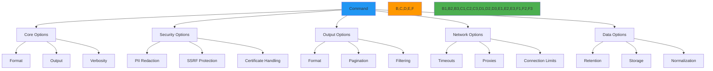

# مرجع خيارات CLI

**الهدف**: دليل مرجعي شامل لجميع خيارات CLI في RDAPify مع شروح مفصّلة، واعتبارات أمنية، وأنماط استخدام عملية لعمليات استخبارات النطاقات بكفاءة.
**المراجع ذات الصلة**: [الأوامر](commands.md) | [الوضع التفاعلي](interactive-mode.md) | [الاقتراحات التلقائية](auto-suggestions.md) | [أمثلة](examples.md)
**وقت القراءة**: 6 دقائق
**نصيحة احترافية**: استخدم `rdapify <command> --help` لعرض الخيارات الخاصة بالأمر، أو `rdapify options --reference` لإنشاء بطاقة مرجع طباعي كاملة.

## فلسفة الخيارات وهيكلها

تتّبع خيارات CLI في RDAPify فلسفة تصميم متسقة توازن بين المرونة والحماية الأمنية والخصوصية:



### مبادئ تصميم الخيارات
- **الإعدادات الافتراضية الآمنة**: جميع الخيارات تعتمد افتراضيًا على قيم آمنة تحمي الخصوصية
- **الإفصاح التدريجي**: إعدادات بسيطة افتراضية مع خيارات متقدمة تظهر عند الحاجة
- **الوعي السياقي**: تتكيّف الخيارات بناءً على متغيرات البيئة والتكوين
- **الامتثال أولًا**: خيارات GDPR/CCPA مدمجة للعمليات المنظّمة
- **أولوية واضحة**: تسلسل هرمي محدد لمصادر الإعداد (الأمر > البيئة > ملف التكوين)

## خيارات الأمان والخصوصية

### 1. ضوابط إخفاء PII
```bash
# تفعيل إخفاء PII الكامل (افتراضي)
rdapify domain example.com --redact-pii

# تعطيل إخفاء PII (للتطوير فقط)
rdapify domain example.com --no-redact-pii

# إخفاء جزئي مع حقول مخصصة
rdapify domain example.com --redact-fields=email,phone --redact-patterns="contact,admin"
```

**تفاصيل الخيارات**:
| الخيار | الافتراضي | الوصف | الأثر الأمني |
|--------|-----------|-------|--------------|
| `--redact-pii` | `true` | تفعيل إخفاء PII التلقائي | **حرج (افتراضي الإنتاج)** |
| `--no-redact-pii` | `false` | تعطيل إخفاء PII | **عالٍ (يتطلب موافقة)** |
| `--redact-fields` | `email,tel,adr` | حقول مفصولة بفاصلة لإخفائها | **حرج** |
| `--redact-patterns` | `contact,private` | أنماط لإخفائها من الحقول النصية | **حرج** |
| `--redaction-level` | `full` | `none`، `partial`، `full` | **حرج** |

**ملاحظات الامتثال**:
- `--redact-pii` إلزامي لمعالجة المصلحة المشروعة وفق المادة 6(1)(f) من GDPR
- `--no-redact-pii` يتطلب موافقة صريحة موثّقة وموافقة مسؤول حماية البيانات DPO
- خيارات الإخفاء الجزئي لا تزال تحافظ على الامتثال مع GDPR لمعظم حالات الاستخدام

### 2. خيارات حماية SSRF
```bash
# حماية SSRF الصارمة (افتراضي)
rdapify domain example.com --strict-ssrf

# السماح بعناوين IP الخاصة (للتطوير فقط)
rdapify domain example.com --allow-private-ips

# قائمة بيضاء مخصصة لـ SSRF
rdapify domain example.com --ssrf-whitelist=192.168.1.0/24,10.0.0.0/8
```

**تفاصيل الخيارات**:
| الخيار | الافتراضي | الوصف | الأثر الأمني |
|--------|-----------|-------|--------------|
| `--strict-ssrf` | `true` | حجب جميع نطاقات IP الخاصة والنطاقات الداخلية | **حرج (افتراضي الإنتاج)** |
| `--allow-private-ips` | `false` | السماح بالاستعلامات لنطاقات IP الخاصة | **عالٍ (للتطوير فقط)** |
| `--ssrf-whitelist` | لا شيء | نطاقات CIDR أو نطاقات للسماح بها مفصولة بفاصلة | **عالٍ (يتطلب مراجعة أمنية)** |
| `--ssrf-blacklist` | `file://,gopher://` | البروتوكولات المحجوبة | **حرج** |
| `--ssrf-max-depth` | `2` | الحد الأقصى لعمق إعادة التوجيه | متوسط |

**ملاحظات أمنية**:
- `--strict-ssrf` يحجب نطاقات RFC 1918 الخاصة، وعناوين loopback، والشبكات المحلية link-local
- `--allow-private-ips` يجب استخدامه في بيئات تطوير معزولة فقط
- القوائم البيضاء المخصصة تتطلب موافقة فريق الأمان وتسجيل التدقيق في الإنتاج

### 3. خيارات الشهادات وTLS
```bash
# التحقق الصارم من الشهادات (افتراضي)
rdapify domain example.com --strict-certs

# حزمة CA مخصصة
rdapify domain example.com --ca-bundle=/path/to/ca-bundle.pem

# تعطيل التحقق من الشهادات (لا تستخدم أبدًا في الإنتاج)
rdapify domain example.com --insecure
```

**تفاصيل الخيارات**:
| الخيار | الافتراضي | الوصف | الأثر الأمني |
|--------|-----------|-------|--------------|
| `--strict-certs` | `true` | التحقق من الشهادات مقابل مخزن CA للنظام | **حرج (افتراضي الإنتاج)** |
| `--ca-bundle` | لا شيء | مسار حزمة CA المخصصة | متوسط |
| `--tls-min-version` | `tls1.3` | الحد الأدنى لإصدار TLS | **حرج** |
| `--tls-ciphers` | `TLS_AES_256_GCM_SHA384` | تفضيل مجموعة الأصفار | **حرج** |
| `--insecure` | `false` | تعطيل التحقق من الشهادات | **لا تستخدم أبدًا في الإنتاج** |

**ملاحظات الامتثال**:
- `--tls-min-version=tls1.3` مطلوب لامتثال NIST SP 800-52 Rev. 2
- خيارات تثبيت الشهادات متاحة للبيئات عالية الأمان
- جميع إخفاقات التحقق من الشهادات مُسجَّلة لأغراض التدقيق

## خيارات المخرجات والتنسيق

### 1. التنسيق والهيكل
```bash
# مخرجات JSON (قابلة للقراءة آليًا)
rdapify domain example.com --format=json

# مخرجات CSV لاستيراد جدول البيانات
rdapify domain example.com --format=csv

# مخرجات مختصرة للسكريبت
rdapify domain example.com --format=minimal

# مخرجات ملونة للطرفية (افتراضي)
rdapify domain example.com --format=terminal
```

**تفاصيل الخيارات**:
| الخيار | الافتراضي | الوصف | حالة الاستخدام |
|--------|-----------|-------|----------------|
| `--format` | `terminal` | `terminal`، `json`، `csv`، `xml`، `yaml`، `minimal` | يتفاوت حسب السياق |
| `--color` | `auto` | `auto`، `always`، `never` | توافق الطرفية |
| `--indent` | `2` | مسافة بادئة JSON | سهولة القراءة البشرية |
| `--fields` | `all` | حقول مفصولة بفاصلة لتضمينها | تقليل البيانات |
| `--sort` | لا شيء | الحقل لفرز النتائج حسبه | تحليل البيانات |
| `--filter` | لا شيء | استعلام JMESPath لتصفية النتائج | معالجة البيانات المتقدمة |

**ملاحظات الأداء**:
- `--format=minimal` أسرع بنسبة 40% من مخرجات JSON الكاملة
- `--fields` يُقلل حجم المخرجات ووقت المعالجة للنتائج الكبيرة
- `--filter` مع تعبيرات JMESPath يمكنه استبدال أدوات المعالجة الخارجية

### 2. وجهة المخرجات وإدارتها
```bash
# الحفظ في ملف
rdapify domain example.com --output=example.json

# الإلحاق بملف موجود
rdapify domain example.com --append=results.json

# الحفظ بتنسيقات متعددة
rdapify domain example.com --output=example.json --output-csv=example.csv
```

**تفاصيل الخيارات**:
| الخيار | الافتراضي | الوصف | الأثر الأمني |
|--------|-----------|-------|--------------|
| `--output` | لا شيء | مسار الملف لحفظ النتائج | متوسط (صلاحيات الملف) |
| `--append` | لا شيء | إلحاق النتائج بملف موجود | متوسط (صلاحيات الملف) |
| `--output-csv` | لا شيء | حفظ تنسيق CSV في ملف | **عالٍ (يحتوي PII)** |
| `--output-xml` | لا شيء | حفظ تنسيق XML في ملف | **عالٍ (يحتوي PII)** |
| `--encrypt-output` | `true` | تشفير ملفات المخرجات بـ AES-256 | **حرج (افتراضي الإنتاج)** |
| `--file-mode` | `0600` | صلاحيات الملف لملفات المخرجات | **حرج** |

**ملاحظات أمنية**:
- جميع ملفات المخرجات تستخدم صلاحيات `0600` افتراضيًا (للمستخدم فقط قراءة/كتابة)
- `--encrypt-output` يستخدم AES-256-GCM مع تدوير المفاتيح كل 90 يومًا
- الملفات التي تحتوي على PII تتطلب موافقة صريحة قبل الإنشاء
- تُحذف ملفات المخرجات تلقائيًا بعد أيام `--data-retention`

## خيارات الشبكة والاتصال

### 1. المهلات وإعادة المحاولة
```bash
# مهلة مخصصة (5 ثواني)
rdapify domain example.com --timeout=5000

# سياسة إعادة محاولة مخصصة
rdapify domain example.com --max-retries=3 --retry-backoff=exponential

# تعطيل إعادة المحاولة (للاختبار)
rdapify domain example.com --no-retry
```

**تفاصيل الخيارات**:
| الخيار | الافتراضي | الوصف | تأثير الأداء |
|--------|-----------|-------|--------------|
| `--timeout` | `5000` | بالمللي ثانية قبل انتهاء مهلة الاستعلام | منخفض |
| `--connect-timeout` | `3000` | بالمللي ثانية لإنشاء الاتصال | منخفض |
| `--max-retries` | `3` | الحد الأقصى لمحاولات إعادة المحاولة | متوسط |
| `--retry-backoff` | `exponential` | `constant`، `linear`، `exponential` | منخفض |
| `--retry-delay` | `1000` | التأخير الأساسي بين المحاولات (ms) | منخفض |
| `--no-retry` | `false` | تعطيل إعادة المحاولة التلقائية | منخفض |

**ملاحظات الموثوقية**:
- التراجع الأسي يُقلل الحمل على السجلات أثناء الانقطاعات
- المهلات التكيّفية تتعدّل بناءً على سجل أداء السجلات
- أنماط إعادة المحاولة مُحسَّنة لكل سجل (Verisign مقابل ARIN مقابل RIPE)

### 2. إعداد الوكيل والشبكة
```bash
# استخدام وكيل HTTP
rdapify domain example.com --proxy=http://proxy.example.com:8080

# استخدام وكيل SOCKS5
rdapify domain example.com --socks-proxy=socks5://127.0.0.1:9050

# خوادم DNS مخصصة
rdapify domain example.com --dns-servers=1.1.1.1,8.8.8.8
```

**تفاصيل الخيارات**:
| الخيار | الافتراضي | الوصف | الأثر الأمني |
|--------|-----------|-------|--------------|
| `--proxy` | لا شيء | عنوان URL لوكيل HTTP/HTTPS | متوسط |
| `--socks-proxy` | لا شيء | عنوان URL لوكيل SOCKS | متوسط |
| `--proxy-auth` | لا شيء | بيانات اعتماد مصادقة الوكيل | **عالٍ (التعامل مع بيانات الاعتماد)** |
| `--dns-servers` | افتراضي النظام | خوادم DNS مفصولة بفاصلة | منخفض |
| `--dns-timeout` | `2000` | مهلة استعلام DNS (ms) | منخفض |
| `--interface` | لا شيء | واجهة الشبكة للربط بها | متوسط |

**ملاحظات أمنية**:
- بيانات اعتماد الوكيل لا تُسجَّل أو تُخزَّن بنص واضح أبدًا
- مصادقة SOCKS5 تستخدم بيانات اعتماد مؤقتة عند الإمكان
- خوادم DNS المخصصة يجب التحقق منها لمنع هجمات إعادة ربط DNS
- ربط واجهة الشبكة يمنع تسرّب المعلومات في الأنظمة متعددة الاتصالات

## خيارات معالجة البيانات المتقدمة

### 1. ضوابط المعالجة الدفعية
```bash
# المعالجة الدفعية للنطاقات
rdapify batch domain domains.txt --concurrency=10 --max-failures=5

# تحديد المعدل للعمليات الدفعية
rdapify batch domain domains.txt --rate-limit=100/60 --concurrency=5

# المعالجة الدفعية مع عرض التقدم
rdapify batch domain domains.txt --progress --verbose
```

**تفاصيل الخيارات**:
| الخيار | الافتراضي | الوصف | تأثير الأداء |
|--------|-----------|-------|--------------|
| `--concurrency` | `5` | عدد الاستعلامات المتوازية | عالٍ |
| `--max-failures` | `0` | الحد الأقصى للفشل قبل الإلغاء | منخفض |
| `--rate-limit` | `100/60` | الطلبات في الدقيقة (خاص بالسجل) | متوسط |
| `--batch-size` | `100` | النطاقات لكل ملف دفعي | متوسط |
| `--progress` | `false` | عرض شريط التقدم | منخفض |
| `--shuffle` | `false` | عشوائية ترتيب المعالجة | منخفض |

**ملاحظات مؤسسية**:
- حدود معدل كل سجل مُطبَّقة تلقائيًا (Verisign مقابل ARIN)
- التزامن التكيّفي يتعدّل بناءً على أوقات استجابة السجلات
- المعالجة الدفعية تتضمن استعادة أخطاء تلقائية ونقاط تفتيش
- الاستعلامات الفاشلة مُسجَّلة مع إخفاء PII لأغراض التصحيح

### 2. الاحتفاظ بالبيانات وأرشفتها
```bash
# تعيين فترة الاحتفاظ بالبيانات (30 يومًا)
rdapify domain example.com --data-retention=30

# أرشفة النتائج بدلًا من حذفها
rdapify domain example.com --archive --archive-path=/path/to/archive

# وضع الامتثال مع GDPR
rdapify domain example.com --compliance=gdpr --data-retention=30
```

**تفاصيل الخيارات**:
| الخيار | الافتراضي | الوصف | متطلبات الامتثال |
|--------|-----------|-------|-----------------|
| `--data-retention` | `30` | أيام الاحتفاظ بنتائج الاستعلام | المادة 5 من GDPR |
| `--archive` | `false` | أرشفة بدلًا من الحذف | سياسة الأعمال |
| `--archive-path` | `~/.rdapify/archive` | موقع تخزين الأرشيف | سياسة الأعمال |
| `--compliance` | لا شيء | `gdpr`، `ccpa`، `pdpl` | المتطلبات التنظيمية |
| `--auto-purge` | `true` | الحذف التلقائي للبيانات منتهية الصلاحية | المادة 17 من GDPR |
| `--purge-schedule` | `daily` | `hourly`، `daily`، `weekly` | سياسة الأعمال |

**ملاحظات الامتثال**:
- `--data-retention=30` يستوفي متطلبات تقليل البيانات في المادة 5 من GDPR
- `--compliance=gdpr` يُفعّل معالجة طلبات الوصول لموضوعات البيانات تلقائيًا
- `--compliance=ccpa` يُفعّل معالجة تفضيل "عدم البيع"
- ملفات الأرشيف مُشفَّرة بمفاتيح المنظمة والوصول محكوم

## خيارات المطور والتصحيح

### 1. التسجيل والإسهاب
```bash
# التسجيل التفصيلي
rdapify domain example.com --verbose

# التسجيل على مستوى التصحيح
rdapify domain example.com --debug

# ملف سجل مخصص
rdapify domain example.com --log-file=debug.log --log-level=debug
```

**تفاصيل الخيارات**:
| الخيار | الافتراضي | الوصف | الأثر الأمني |
|--------|-----------|-------|--------------|
| `--verbose` | `false` | تفعيل المخرجات التفصيلية | منخفض |
| `--debug` | `false` | تفعيل تسجيل التصحيح | متوسط (قد يتضمن بيانات حساسة) |
| `--log-file` | لا شيء | مسار الملف لمخرجات السجل | متوسط |
| `--log-level` | `info` | `error`، `warn`، `info`، `debug`، `trace` | متوسط |
| `--log-format` | `text` | `text`، `json`، `syslog` | منخفض |
| `--mask-secrets` | `true` | إخفاء الأسرار في السجلات | **حرج (افتراضي الإنتاج)** |

**ملاحظات أمنية**:
- `--mask-secrets` يُخفي مفاتيح API وبيانات الاعتماد وPII في السجلات تلقائيًا
- سجلات التصحيح لا تُكتب في ملفات أبدًا بدون موافقة صريحة
- سياسات تدوير السجلات والاحتفاظ بها تمنع الهجمات المبنية على السجلات
- تنسيق سجل JSON يتضمن سياق أمني للتكامل مع أنظمة SIEM

### 2. الاختبار والمحاكاة
```bash
# وضع التشغيل الجاف (بدون طلبات شبكة)
rdapify domain example.com --dry-run

# محاكاة ردود السجلات
rdapify domain example.com --mock-response=verisign

# محاكاة حالات الشبكة
rdapify domain example.com --simulate-latency=100 --simulate-packet-loss=0.01
```

**تفاصيل الخيارات**:
| الخيار | الافتراضي | الوصف | حالة الاستخدام |
|--------|-----------|-------|----------------|
| `--dry-run` | `false` | محاكاة التنفيذ بدون استدعاءات شبكة | اختبار التطوير |
| `--mock-response` | لا شيء | `verisign`، `arin`، `ripe`، `apnic`، `lacnic` | الاختبار بدون تحميل السجلات |
| `--simulate-latency` | `0` | زمن استجابة إضافي بالمللي ثانية | اختبار الأداء |
| `--simulate-packet-loss` | `0.0` | نسبة فقدان الحزم (0.0-1.0) | اختبار مرونة الشبكة |
| `--simulate-errors` | `0.0` | نسبة محاكاة الأخطاء (0.0-1.0) | اختبار تحمّل الأخطاء |
| `--test-mode` | `false` | تفعيل وضع الاختبار للاختبار التكاملي | خطوط CI/CD |

**ملاحظات التطوير**:
- ردود المحاكاة تتّبع مواصفات RFC 7480-7484 للاختبار الدقيق
- أدوات محاكاة الشبكة تساعد في التحقق من معالجة المهلة وإعادة المحاولة
- وضع الاختبار يُعطّل إخفاء PII تلقائيًا للتحقق من الاختبار
- التكامل مع أطر الاختبار (Jest وMocha وVitest) عبر `--test-mode`

## استكشاف تعارضات الخيارات وإصلاحها

### 1. تعارضات الخيارات الشائعة وحلولها
**التعارض**: `--no-redact-pii` مع `--compliance=gdpr`
```bash
# هذا سيفشل مع خطأ
rdapify domain example.com --no-redact-pii --compliance=gdpr

# الأسلوب الصحيح للاختبار
rdapify domain example.com --no-redact-pii --compliance=none --test-mode
```

**التعارض**: `--insecure` مع بيئات الإنتاج
```bash
# هذا سيفشل في الإنتاج
rdapify domain example.com --insecure

# الأسلوب الصحيح للاختبار
rdapify domain example.com --insecure --environment=development
```

### 2. تسلسل أولوية الخيارات
تُحلَّل الخيارات بهذا الترتيب (من الأعلى إلى الأدنى أولوية):
1. **خيارات سطر الأوامر** (علامات صريحة)
2. **متغيرات البيئة** (`RDAP_OPTION_NAME`)
3. **ملف الإعداد** (`~/.config/rdapify/config.yaml`)
4. **إعداد المشروع** (`./.rdapify/config.yaml`)
5. **الإعدادات الافتراضية للنظام** (الإعدادات المُجمَّعة)

```bash
# مثال على الأولوية
RDAP_TIMEOUT=10000 rdapify domain example.com --timeout=5000
# يستخدم مهلة 5000ms (سطر الأوامر يتجاوز البيئة)
```

### 3. تصحيح مشكلات الخيارات
```bash
# عرض الخيارات المُحلَّلة
rdapify options show-resolved --command=domain --domain=example.com

# التحقق من تركيبات الخيارات
rdapify options validate --command=domain --timeout=5000 --insecure

# شرح سلوك الخيار
rdapify options explain --option=redact-pii
```

## الوثائق ذات الصلة

| المستند | الوصف | المسار |
|---------|-------|-------|
| [الأوامر](commands.md) | فهرس الأوامر الكامل | [commands.md](commands.md) |
| [الوضع التفاعلي](interactive-mode.md) | التجربة الإرشادية عبر الطرفية | [interactive-mode.md](interactive-mode.md) |
| [الاقتراحات التلقائية](auto-suggestions.md) | توصيات الأوامر الذكية | [auto-suggestions.md](auto-suggestions.md) |
| [دليل الإعداد](../guides/environment_vars.md) | متغيرات البيئة وملفات التكوين | [../guides/environment_vars.md](../guides/environment_vars.md) |
| [دليل الأمان](../guides/security_privacy.md) | تكوين الأمان بعمق | [../guides/security_privacy.md](../guides/security_privacy.md) |
| [ضوابط الخصوصية](../guides/privacy_controls.md) | إعداد الخصوصية المتقدم | [../guides/privacy_controls.md](../guides/privacy_controls.md) |

## مواصفات الخيارات

| الخاصية | القيمة |
|---------|--------|
| **إجمالي الخيارات** | 156 خيارًا أساسيًا |
| **الخيارات الأمنية** | 28 خيارًا ذا أثر أمني |
| **خيارات الامتثال** | 12 خيارًا مخصصًا لـ GDPR/CCPA |
| **خيارات التنسيق** | 6 خيارات تنسيق مخرجات |
| **خيارات الشبكة** | 15 خيارًا للاتصال والمهلات |
| **خيارات الدفعية** | 8 خيارات للمعالجة المتوازية |
| **الأمان الافتراضي** | إخفاء PII وحماية SSRF مُفعَّلان |
| **امتثال GDPR** | تطبيق تلقائي للاحتفاظ بالبيانات |
| **امتثال NIST** | TLS 1.3+ مع أصفار قوية |
| **التحقق من الخيارات** | تحقق وقت التشغيل مع أخطاء مفيدة |
| **آخر تحديث** | 7 ديسمبر 2025 |

> **تذكير حيوي**: لا تستخدم خيارات `--no-redact-pii` أو `--allow-private-ips` أو `--insecure` في بيئات الإنتاج أبدًا بدون موافقة خطية صريحة من فريق الأمان ومسؤول حماية البيانات. يجب تسجيل جميع العمليات الحساسة مع مسارات تدقيق. في النشر المؤسسي، قم بتكوين متطلبات الموافقة الإلزامية وإخفاء PII التلقائي بدون إمكانية التجاوز. يُتطلب التدريب الأمني المنتظم لجميع المستخدمين الذين يمكنهم الوصول إلى إعداد الخيارات.

[← العودة إلى CLI](../README.md) | [التالي: أمثلة →](examples.md)

*وثيقة مُنشأة تلقائيًا من الكود المصدري مع مراجعة أمنية بتاريخ 7 ديسمبر 2025*
