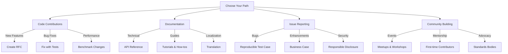
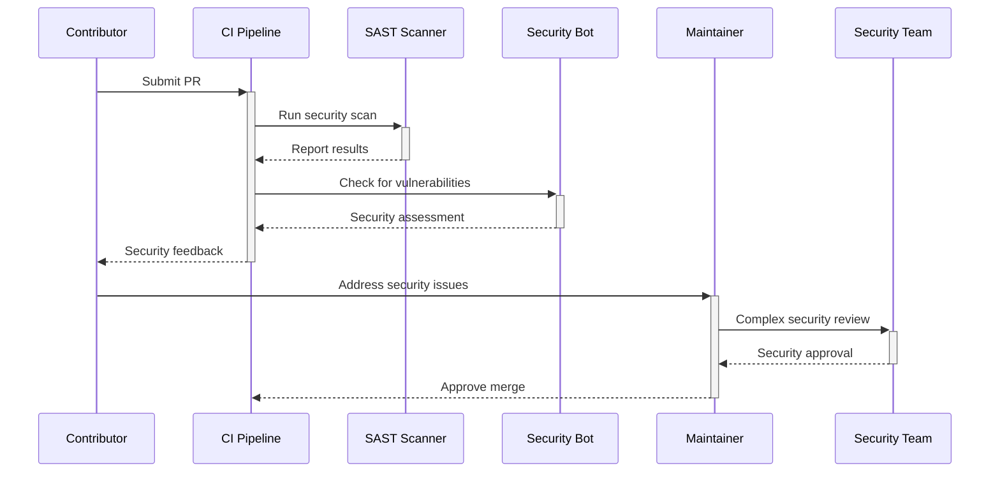

# المساهمة في RDAPify

**الغرض**: دليل شامل للمساهمة في مشروع RDAPify مع مسارات واضحة للمساهمة في الكود والتوثيق ومشاركة المجتمع مع الحفاظ على معايير الأمان والامتثال والهندسة المعمارية
**ذات صلة**: [مدونة السلوك](../../../CODE_OF_CONDUCT.md) | [الحوكمة](../../../GOVERNANCE.md) | [إعداد بيئة التطوير](development_setup.md) | [دليل الأسلوب](style_guide.md)
**وقت القراءة**: 5 دقائق

## فلسفة المساهمة

يُبنى RDAPify على مبدأ "الأمان بشكل افتراضي، والمرونة بالتصميم". نرحب بالمساهمات التي تعزز مهمتنا في توفير عميل RDAP الأكثر موثوقية والحافظ للخصوصية للبنية التحتية للإنترنت العالمية. نهجنا يوازن بين:

- **التميز التقني**: كود عالي الجودة مع تغطية اختبار شاملة
- **الأمان أولاً**: يجب أن تخضع كل مساهمة لمراجعة أمنية
- **التعاون الشامل**: مسارات واضحة للمساهمين من جميع مستويات الخبرة
- **التطوير المستدام**: قابلية الصيانة على المدى الطويل بدلاً من الإصلاحات السريعة
- **الحفاظ على الخصوصية**: حماية البيانات الشخصية مدمجة في كل طبقة من النظام

## عملية المساهمة

### 1. اختر مسار مساهمتك


### 2. سير عمل المساهمة
```bash
# 1. Set up development environment
git clone https://github.com/rdapify/rdapify.git
cd rdapify
npm ci

# 2. Create feature branch
git checkout -b feat/your-feature-name

# 3. Make changes with tests
#    - Code changes in src/
#    - Tests in test/
#    - Documentation in docs/
#    - Benchmarks in benchmarks/

# 4. Run validation checks
npm run validate
npm run test

# 5. Commit with conventional commit format
git commit -m "feat(core): add domain query optimization"
#    ^type   ^scope   ^description

# 6. Push and create PR
git push origin feat/your-feature-name
```

## إرشادات المساهمة التقنية

### 1. مساهمات الكود
**معايير هيكل الملفات**:
```markdown
src/
├── core/               # Core functionality
│   ├── client.ts       # Main client class
│   ├── types.ts        # TypeScript interfaces
│   ├── errors.ts       # Custom error definitions
│   └── utils.ts        # Utility functions
├── security/           # Security implementations
│   ├── ssrf.ts         # SSRF protection
│   └── pii-redaction.ts# PII redaction
├── network/            # Network handling
│   ├── fetcher.ts      # HTTP client
│   └── resolver.ts     # DNS resolver
└── cache/              # Caching strategies
    ├── memory.ts       # In-memory cache
    └── redis.ts        # Redis integration
```

**مبادئ الهندسة المعمارية**:
- **TypeScript**: التحقق الصارم من الأنواع مع `--noImplicitAny`
- **عدم التغيير**: تجنب الآثار الجانبية؛ استخدم الأنماط غير القابلة للتغيير
- **تغطية الاختبار**: تغطية وحدة 95% كحد أدنى للكود الجديد
- **الأداء**: قياس جميع التغييرات الحساسة للأداء
- **إدارة الموارد**: إغلاق الموارد دائماً (الاتصالات والمؤقتات)
- **الأمان**: لا تثق أبداً بالمدخلات الخارجية؛ تحقق من صحة جميع البيانات

### 2. مساهمات التوثيق
**هيكل التوثيق**:
```markdown
docs/
├── getting-started/    # Quick start guides
├── core-concepts/      # Fundamental concepts
├── api-reference/      # API documentation
├── guides/             # How-to guides
├── integrations/       # Integration guides
├── performance/        # Performance guides
├── security/           # Security documentation
└── architecture/       # System architecture
```

**معايير الجودة**:
- **الوضوح**: الكتابة للمطورين ذوي المعرفة الأساسية بالشبكات
- **الأمثلة**: تضمين أمثلة كود قابلة للتشغيل لجميع واجهات API
- **لقطات الشاشة**: استخدام لقطات شاشة موضّحة للمفاهيم المعقدة
- **المخططات**: إنشاء مخططات Mermaid لمعمارية النظام
- **إمكانية الوصول**: ضمان تباين الألوان وHTML الدلالي
- **التعريب**: وضع علامة على السلاسل القابلة للترجمة لـ i18n

### 3. متطلبات الاختبار
**أنواع الاختبارات**:
```typescript
// Example test structure
describe('Domain Query', () => {
  // Unit tests
  describe('Unit Tests', () => {
    test('parses valid domain response', () => {
      // Test specific functionality in isolation
    });
  });

  // Integration tests
  describe('Integration Tests', () => {
    test('queries real Verisign registry', async () => {
      // Test with real registries in test environment
      // Mock SSRF protection for security
    });
  });

  // Security tests
  describe('Security Tests', () => {
    test('blocks SSRF attempts to private IP ranges', async () => {
      // Test security boundaries
    });
  });

  // Performance tests
  describe('Performance Tests', () => {
    test('processes 1000 domains under 5 seconds', async () => {
      // Benchmark performance characteristics
    });
  });
});
```

**متطلبات تغطية الاختبار**:
- **اختبارات الوحدة**: تغطية 95% للوظائف، تغطية 90% للأسطر
- **اختبارات التكامل**: تغطية جميع نقاط نهاية السجل
- **اختبارات الأمان**: جميع متجهات التهديد من نموذج التهديد
- **اختبارات الأداء**: قياس مقارنة بمقاييس الأداء الأساسية

## متطلبات الأمان والامتثال

### 1. عملية مراجعة الأمان
يجب أن تجتاز جميع المساهمات مراجعة الأمان قبل الدمج:



**متطلبات الأمان**:
- **حماية SSRF**: يجب أن تمر جميع استدعاءات الشبكة عبر محدد الطلبات المحمي من SSRF
- **معالجة البيانات الشخصية**: لا تسجّل أو تكشف أبداً البيانات الشخصية في رسائل الخطأ
- **تقليل البيانات**: اجمع وعالج فقط البيانات الضرورية للوظيفة
- **التحقق من الشهادات**: لا تُعطّل أبداً التحقق من الشهادات
- **تحديد معدل الطلبات**: طبّق تحديد المعدل من جانب العميل لجميع السجلات
- **التحقق من المدخلات**: تحقق من صحة جميع المدخلات مقارنة بالمخططات المحددة

### 2. اعتبارات الامتثال
يجب أن تأخذ المساهمات بعين الاعتبار المتطلبات التنظيمية:

| اللائحة | التأثير على المساهمات | المراجعة المطلوبة |
|---------|----------------------|-------------------|
| **GDPR** | معالجة البيانات الشخصية، تقليل البيانات | موافقة مسؤول حماية البيانات |
| **CCPA** | حقوق المستهلك، عدم البيع | مراجعة قانونية |
| **SOC 2** | مسارات التدقيق، ضوابط الوصول | فريق الامتثال |
| **NIST 800-53** | ضوابط الأمان، الاستجابة للحوادث | فريق الأمان |
| **ISO 27001** | إدارة أمن المعلومات | فريق أمن المعلومات |

## المشاركة المجتمعية

### 1. المساهمات الأولى
نرحب بالمساهمين الجدد بدعم مخصص:

```bash
# Good first issues for newcomers
git issues --label "good first issue"

# Documentation improvements
git issues --label "documentation" --label "beginner-friendly"

# Mentorship program
npm run mentor --assignee your-github-username
```

**مسار المساهمة الأولى**:
1. اقرأ [مدونة السلوك](../../../CODE_OF_CONDUCT.md) و[دليل المساهمة](../../../CONTRIBUTING.md)
2. انضم إلى [Matrix/Element chat](https://matrix.to/#/#rdapify:matrix.org)
3. اختر مسألة ذات تسمية `good first issue` أو `documentation`
4. اطلب المسألة باستخدام `@rdapify-bot claim`
5. أنشئ طلب سحب مع `fixes #issue-number` في الوصف
6. تلقَّ الإرشاد من مساهم ذي خبرة

### 2. فعاليات المجتمع
نستضيف فعاليات منتظمة لبناء المجتمع:

| نوع الفعالية | التكرار | الشكل | الجمهور |
|------------|---------|-------|---------|
| **ساعات المكتب** | أسبوعياً (الخميس الساعة 2 مساءً UTC) | مكالمة فيديو | جميع المساهمين |
| **جلسات مراجعة الكود** | كل أسبوعين | برمجة ثنائية | المطورون |
| **سباقات التوثيق** | شهرياً | تعاون غير متزامن | الكتّاب |
| **مجموعة عمل الأمان** | شهرياً | تعمق تقني | خبراء الأمان |
| **لجنة المعايير** | ربع سنوي | مشاركة IETF | خبراء البروتوكول |

## البدء كمساهم

### 1. إعداد بيئة التطوير
```bash
# Clone repository
git clone https://github.com/rdapify/rdapify.git
cd rdapify

# Install dependencies
npm ci

# Build project
npm run build

# Run tests
npm test

# Start development server
npm run dev

# Generate documentation
npm run docs
```

### 2. قائمة فحص المساهمة
قبل تقديم طلب السحب، تأكد من:

**جودة الكود**:
- [ ] يجتاز `npm run validate`
- [ ] تغطية اختبار 95%+ للكود الجديد
- [ ] يتبع TypeScript strict mode
- [ ] لا توجد أخطاء lint (`npm run lint`)

**الأمان**:
- [ ] لا توجد ثغرات SSRF
- [ ] الحفاظ على اختزال البيانات الشخصية
- [ ] لا توجد بيانات اعتماد مُضمَّنة
- [ ] الحفاظ على التحقق من الشهادات

**التوثيق**:
- [ ] توثيق تغييرات API
- [ ] الميزات الجديدة لديها أمثلة استخدام
- [ ] توثيق تأثيرات الأداء
- [ ] توثيق الآثار الأمنية

**الأداء**:
- [ ] قياس مقارنة بالأداء الأساسي
- [ ] لا توجد تسريبات في الذاكرة
- [ ] تطبيق تنظيف الموارد
- [ ] معالجة أخطاء شاملة

**الامتثال**:
- [ ] مراعاة الآثار المترتبة على GDPR
- [ ] استيفاء متطلبات CCPA
- [ ] الحفاظ على مسارات التدقيق
- [ ] لا توجد انتهاكات تنظيمية

### 3. الحصول على المساعدة
**للأسئلة التقنية**:
```bash
# Join Matrix chat
https://matrix.to/#/#rdapify:matrix.org

# GitHub Discussions
https://github.com/rdapify/rdapify/discussions

# Office Hours
Every Thursday 2PM UTC
https://rdapify.dev/community/office-hours
```

**لأسئلة عملية المساهمة**:
```bash
# Contributing guide
https://rdapify.dev/docs/community/contributing

# Community forum
https://github.com/rdapify/rdapify/discussions/categories/contributing

# Mentor assignment
@rdapify-bot mentor
```

## مواصفات المساهمة

| الخاصية | القيمة |
|---------|--------|
| **أسلوب الكود** | TypeScript مع تنسيق Prettier |
| **إطار الاختبار** | Jest مع تقارير التغطية |
| **التوثيق** | Markdown مع مخططات Mermaid |
| **خط أنابيب CI** | GitHub Actions مع فحص الأمان |
| **حماية الفرع** | جميع الفروع الرئيسية محمية |
| **متطلبات المراجعة** | موافقة مشرفَين للتغييرات الجوهرية |
| **مراجعة الأمان** | مطلوبة لجميع طلبات السحب |
| **مراجعة الامتثال** | مطلوبة لتغييرات معالجة البيانات |
| **وقت الاستجابة للمسائل** | أقل من 24 ساعة للمسائل الجديدة |
| **وقت مراجعة طلبات السحب** | أقل من 48 ساعة للتغييرات غير الكاسرة |

> **تذكير حرج**: لا تُعطّل أبداً ضوابط الأمان، ولا تتخطَّ اختزال البيانات الشخصية، ولا تتحايل على متطلبات الامتثال في المساهمات. يجب أن يخضع جميع الكود لمراجعة أمنية قبل الدمج. أبلغ عن ثغرات الأمان من خلال قنوات الإفصاح المسؤول، وليس في المسائل العامة. ستُرفض المساهمات التي تُضعف الأمان أو الخصوصية أو الامتثال بصرف النظر عن مزاياها التقنية.

[← العودة إلى المجتمع](../README.md) | [التالي: الفعاليات →](events.md)

*وثيقة مُنشأة تلقائياً من الكود المصدري مع مراجعة أمنية في 28 نوفمبر 2025*
