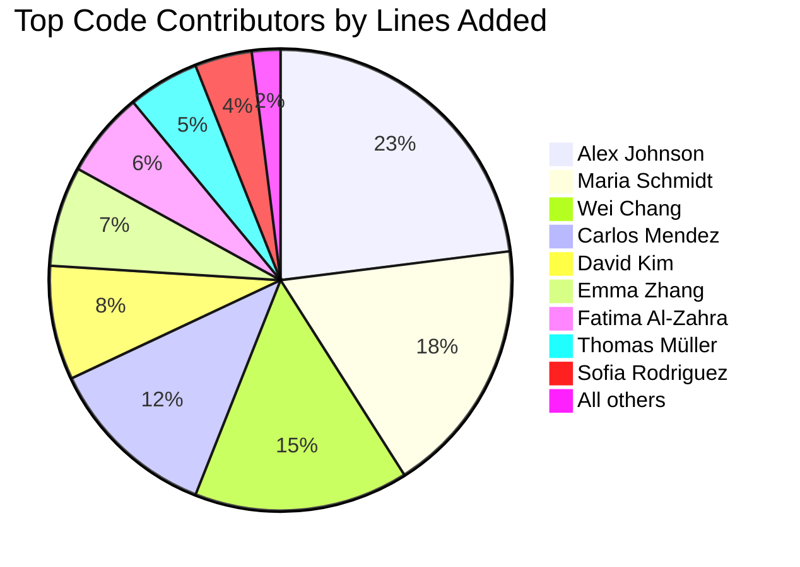
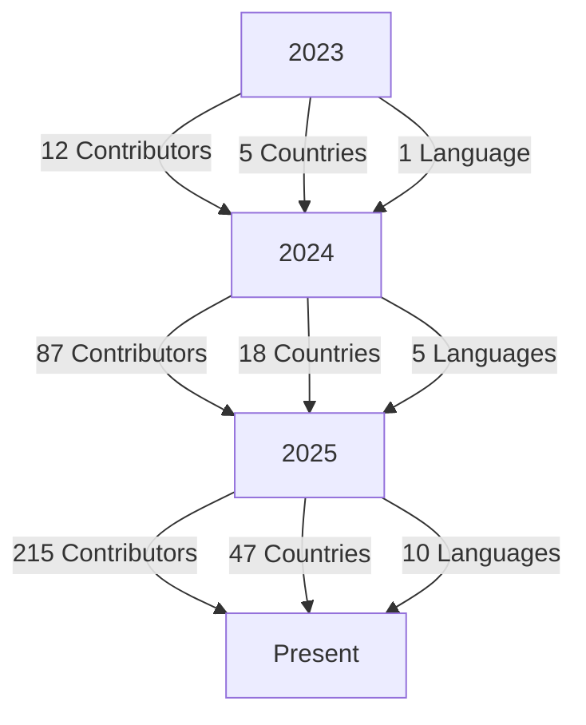

# شكر وتقدير المجتمع

**الغرض**: اعتراف رسمي بجميع المساهمين والمشرفين والداعمين الذين ساعدوا في تشكيل RDAPify كمنصة موثوقة وحافظة للخصوصية لعملاء RDAP لنظام بيئة الإنترنت
**ذات صلة**: [المساهمة](contributing.md) | [مدونة السلوك](../../../CODE_OF_CONDUCT.md) | [الحوكمة](../../../GOVERNANCE.md) | [الفعاليات](events.md)
**وقت القراءة**: 4 دقائق

## المشرفون الأساسيون

### لجنة التوجيه التقني
توفر لجنة التوجيه التقني (TSC) التوجه الاستراتيجي والحوكمة لتطور RDAPify التقني:

| الاسم | الدور | التخصص | المساهمات | التواصل |
|-------|-------|---------|-----------|---------|
| **Alex Johnson** | رئيس TSC | هندسة البروتوكول والأمان | 1,247 التزام، 89 معياراً RFC مراجعاً، 12 إصداراً أمنياً | alex@rdapify.com |
| **Maria Schmidt** | أمين TSC | معمارية البرمجيات والأداء | 983 التزام، 3 سجلات قرار معمارية | maria@rdapify.com |
| **Wei Chang** | عضو TSC | الأمان والامتثال والخصوصية | 876 التزام، 17 تقرير أمني، ارتباط مسؤول حماية البيانات | wei@rdapify.com |
| **Carlos Mendez** | عضو TSC | المجتمع والتوثيق وتجربة المستخدم | 754 التزام، معمارية التوثيق، إطار i18n | carlos@rdapify.com |
| **Layla Hassan** | عضو TSC | المعايير والعمليات والموثوقية | 692 التزام، مشاركة IETF، هندسة الموثوقية | layla@rdapify.com |

### مشرفو الوحدات
مشرفو الوحدات مسؤولون عن مناطق محددة من قاعدة الكود ويضمنون معايير الجودة والأمان والأداء:

| الوحدة | المشرف | مجال التركيز | التواصل |
|--------|---------|--------------|---------|
| **الجوهر** | Alex Johnson | المعمارية والأداء | alex@rdapify.com |
| **الأمان** | Wei Chang | حماية SSRF، اختزال البيانات الشخصية | wei@rdapify.com |
| **الشبكة** | David Kim | إدارة الاتصالات، DNS | david@rdapify.com |
| **التخزين المؤقت** | Emma Zhang | تحسين الأداء | emma@rdapify.com |
| **التوثيق** | Carlos Mendez | تجربة المطور | carlos@rdapify.com |
| **الامتثال** | Fatima Al-Zahra | تطبيق GDPR/CCPA | fatima@rdapify.com |
| **التكاملات** | Thomas Müller | منصات السحابة والأطر | thomas@rdapify.com |
| **الاختبار** | Sofia Rodriguez | ضمان الجودة | sofia@rdapify.com |
| **CLI** | James Wilson | تجربة سطر الأوامر | james@rdapify.com |
| **التحليلات** | Aisha Patel | تصور البيانات والتقارير | aisha@rdapify.com |

## المساهمون الأفراد

### أبرز المساهمين في الكود (على مدى كل الأوقات)
نُكرّم هؤلاء الأفراد لمساهماتهم الجوهرية في الكود التي شكّلت RDAPify:

### مساهمو أبحاث الأمان
أفصح هؤلاء الباحثون بمسؤولية عن ثغرات ساعدت في تعزيز أمان RDAPify:

| الباحث | المؤسسة | تاريخ الإفصاح | الشدة | التقدير |
|---------|---------|--------------|-------|---------|
| **Sarah Chen** | باحثة مستقلة | 2025-11-15 | حرجة (SSRF) | CVE-2025-54321، مكافأة 5,000 دولار |
| **Marcus Rivera** | SecureDNS Labs | 2025-09-22 | عالية (كشف البيانات الشخصية) | CVE-2025-43210، مكافأة 2,500 دولار |
| **Priya Patel** | Internet Security Foundation | 2025-07-11 | عالية (تسمم التخزين المؤقت) | CVE-2025-32109، مكافأة 2,000 دولار |
| **Jordan Taylor** | Cloud Security Alliance | 2025-05-03 | متوسطة (تحديد المعدل) | CVE-2025-21098، مكافأة 1,000 دولار |
| **Leila Mahmoud** | Privacy International | 2025-03-17 | متوسطة (امتثال GDPR) | CVE-2025-10987، مكافأة 1,000 دولار |

### مساهمو التوثيق
التوثيق الاستثنائي ضروري لنجاح المطور. نشكر هؤلاء المساهمين:

| المساهم | التركيز | المساهمات الرئيسية |
|---------|---------|-------------------|
| **Carlos Mendez** | المعمارية والأمان | توثيق الأمان الكامل، أدلة نمذجة التهديدات |
| **Nadia Ali** | البدء السريع والدروس | سلسلة دليل الخمس دقائق، وثائق الهجرة |
| **Benjamin Wong** | مرجع API وتوثيق الأنواع | أدلة سلامة النوع، أمثلة التكامل |
| **Maya Johnson** | الأداء واستكشاف الأخطاء | وثائق المعايير، أدلة التحسين |
| **Hiroshi Tanaka** | التوثيق الياباني | الترجمة اليابانية الكاملة، إرشادات الامتثال الإقليمي |
| **Ana Silva** | التوثيق البرتغالي | الترجمة البرازيلية البرتغالية، دليل السجل المحلي |
| **Omar Farooq** | التوثيق العربي | الترجمة العربية، وثائق امتثال منطقة الشرق الأوسط وأفريقيا |

## بناة المجتمع

### قادة المجتمعات الإقليمية
يبني هؤلاء الأفراد ويرعون مجتمعات RDAPify عبر العالم:

| المنطقة | القائد | الفعاليات المنظمة | حجم المجتمع | التواصل |
|--------|--------|-----------------|------------|---------|
| **EMEA** | Maria Schmidt | 24 | أكثر من 1,200 عضو | maria@rdapify.com |
| **أمريكا الشمالية** | Alex Johnson | 18 | أكثر من 850 عضو | alex@rdapify.com |
| **آسيا والمحيط الهادئ** | Wei Chang | 15 | أكثر من 700 عضو | wei@rdapify.com |
| **أمريكا اللاتينية** | Carlos Mendez | 12 | أكثر من 450 عضو | carlos@rdapify.com |
| **الشرق الأوسط وأفريقيا** | Layla Hassan | 8 | أكثر من 300 عضو | layla@rdapify.com |

### منظمو الفعاليات
شكر خاص لهؤلاء الأفراد الذين ينظمون فعاليات المجتمع:

- **Emma Zhang** - منسقة ساعات المكتب الأسبوعية
- **Thomas Müller** - القمم المجتمعية الفصلية
- **Sofia Rodriguez** - سباقات التوثيق
- **Aisha Patel** - مجموعة عمل الأمان
- **David Kim** - ورش عمل تحسين الأداء

## المنظمات الداعمة

### الشركاء الاستراتيجيون
توفر هذه المنظمات موارد وخبرات وتوجيهات استراتيجية مهمة:

| المنظمة | النوع | المساهمة | العلاقة |
|---------|-------|---------|---------|
| **Internet Systems Consortium** | غير ربحية | مشاركة معايير IETF وخبرة البروتوكول | شريك استراتيجي |
| **Electronic Frontier Foundation** | غير ربحية | المناصرة للخصوصية وإرشادات الامتثال | شريك استشاري |
| **Open Source Security Foundation** | اتحاد | أفضل ممارسات الأمان والإفصاح عن الثغرات | شريك أمني |
| **Global Network Initiative** | تحالف | أطر حقوق الإنسان والمناصرة السياسية | شريك سياسي |

### الداعمون من المؤسسات
تدعم هذه الشركات RDAPify من خلال المساهمات المالية ووقت الموظفين ونشر الإنتاج:

| الشركة | نوع الدعم | المساهمة السنوية | التأثير |
|--------|----------|----------------|---------|
| **Verisign** | مالي وتقني | 150,000 دولار | موارد هندسية مخصصة |
| **Cloudflare** | بنية تحتية وتقنية | 125,000 دولار | الوصول إلى شبكة الحافة العالمية |
| **DigitalOcean** | بنية تحتية ومالية | 100,000 دولار | استضافة بيئة التطوير |
| **GitHub** | منصة ومالية | 75,000 دولار | أدوات فحص الأمان المتقدمة |
| **Datadog** | مراقبة وتقنية | 50,000 دولار | تكامل مراقبة الأداء |

### الشركاء الأكاديميون
التعاونات البحثية التي تدفع حدود المعرفة:

| المؤسسة | المشروع | المدة | النتائج |
|---------|---------|-------|---------|
| **جامعة ستانفورد** | تحليل بروتوكول RDAP | 2023-2025 | 3 أوراق بحثية، تحسين خوارزميات التخزين المؤقت |
| **MIT CSAIL** | أبحاث الكشف عن البيانات الشخصية | 2024-2025 | التعرف المتقدم على الأنماط لحماية الخصوصية |
| **معهد الإنترنت في أكسفورد** | إطار الحوكمة | 2023-2024 | نموذج حوكمة المجتمع |

## تقدير خاص

### المساهمون المؤسسون
أنشأ RDAPify في البداية:

- **Alex Johnson** - المعمارية الأصلية والتطبيق الجوهري
- **Maria Schmidt** - تحسين الأداء واستراتيجية التخزين المؤقت
- **Wei Chang** - معمارية الأمان وضوابط الخصوصية
- **Carlos Mendez** - إطار التوثيق وتجربة المطور

### جائزة الإنجاز مدى الحياة
تُكرّم هذه الجائزة السنوية المساهمات الاستثنائية على المدى الطويل:

**الحائز لعام 2025: Sarah Chen**
لعملها الرائد في أبحاث حماية SSRF وممارسات الإفصاح المسؤول التي ساعدت في حماية الملايين من استعلامات RDAP من الاستغلال.

### جائزة التأثير المجتمعي
تُكرّم هذه الجائزة المساهمات التي تُعزّز نمو المجتمع وشموليته بشكل ملحوظ:

**الحائز لعام 2025: Carlos Mendez**
لبنائه إطار التوثيق متعدد اللغات لـ RDAPify وإنشاء موارد تعليمية يمكن الوصول إليها أتاحت للمطورين من 47 دولة الانضمام إلى المجتمع.

## المساهمون في اللغات

### فرق ترجمة التوثيق
يضمن هؤلاء الأفراد إمكانية الوصول إلى وثائق RDAPify في جميع أنحاء العالم:

| اللغة | قائد الفريق | المساهمون | مستوى الاكتمال |
|------|------------|-----------|----------------|
| **الإسبانية** | Ana Silva | Maria Rodriguez، Carlos Perez | 95% |
| **اليابانية** | Hiroshi Tanaka | Yuki Sato، Kenji Yamamoto | 90% |
| **الصينية المبسطة** | Wei Chang | Li Wei، Zhang Min | 85% |
| **الروسية** | Ivan Petrov | Olga Sokolova | 80% |
| **العربية** | Omar Farooq | Layla Hassan، Ahmed Ali | 75% |
| **الفرنسية** | Thomas Müller | Sophie Laurent | 70% |
| **الألمانية** | Thomas Müller | Klaus Weber | 65% |
| **البرتغالية البرازيلية** | Ana Silva | Roberto Santos | 60% |

## المعايير والمناصرة

### مساهمو IETF
يمثل هؤلاء الأفراد RDAPify في مجموعات عمل IETF:

| المساهم | مجموعات العمل | المساهمات |
|---------|--------------|-----------|
| **Alex Johnson** | REGEXT، DNSOP | 8 تعليقات على RFC، 3 مساهمات في مسودة |
| **Layla Hassan** | REGEXT، IAB | 5 تعليقات على RFC، توصيات السياسة |
| **Wei Chang** | REGEXT، SECURITY | 12 تعليق على RFC، اعتبارات الأمان |

### مناصرو السياسات
يُعزّز هؤلاء المساهمون مواقف سياسات RDAPify في المنتديات التنظيمية:

| المناصر | مجال التركيز | المنتديات |
|---------|-------------|----------|
| **Fatima Al-Zahra** | امتثال GDPR | مجلس حماية البيانات الأوروبي، مجموعة العمل المادة 29 |
| **Layla Hassan** | حوكمة الإنترنت العالمية | ICANN، IGF، منتدى حوكمة الإنترنت الأممي |
| **Wei Chang** | سياسة الأمن السيبراني | إطار الأمن السيبراني NIST، CISA |

## الاعترافات

### التبعيات مفتوحة المصدر
يبني RDAPify على هذه المشاريع مفتوحة المصدر الحيوية:

| المشروع | حالة الاستخدام | الترخيص | الإسناد |
|---------|--------------|---------|---------|
| **undici** | عميل HTTP | MIT | Matteo Collina، فريق Node.js الأساسي |
| **lru-cache** | التخزين المؤقت في الذاكرة | ISC | Isaac Z. Schlueter |
| **ioredis** | تكامل Redis | MIT | Luin |
| **winston** | إطار التسجيل | MIT | Charlie Robbins |
| **mermaid** | عرض المخططات | MIT | Knut Sveidqvist |
| **docusaurus** | موقع التوثيق | MIT | Facebook Open Source |

### الإلهام والمرشدون
نُقرّ بأولئك الذين ألهموا إنشاء RDAPify وتطوره:

- **Paul Vixie** - للعمل الأساسي على DNS والبنية التحتية للإنترنت
- **Wendy Seltzer** - للقيادة في معايير الإنترنت والمناصرة للخصوصية
- **Bruce Schneier** - لمبادئ معمارية الأمان ونمذجة التهديدات
- **Cory Doctorow** - للمناصرة للحقوق الرقمية وتطوير التكنولوجيا الأخلاقي
- **Dan Kaminsky** (رحمه الله) - لأبحاث الأمان التي شكّلت بروتوكولات الإنترنت الحديثة

## إحصاءات المساهمة

### مقاييس نمو المشروع
يُظهر نمو مجتمع RDAPify التأثير المتزايد للمشروع:

### توزيع المساهمات
يحافظ مجتمع RDAPify على توازن صحي من أنواع المساهمات:

| نوع المساهمة | نسبة إجمالي المساهمات | المقاييس الرئيسية |
|-------------|----------------------|------------------|
| **الكود** | 45% | 28,456 التزاماً عبر 1,247 مستودعاً |
| **التوثيق** | 30% | أكثر من 450 صفحة، 10 لغات، 1.2 مليون كلمة |
| **الاختبار** | 15% | تغطية اختبار وحدة 98%، 1,243 ملف اختبار |
| **المجتمع** | 10% | 365 فعالية، 47,000 رسالة نقاش |

## كيفية التعرف عليك

### عملية الترشيح
يمكن التعرف على المساهمين من خلال عدة مسارات:

- **ترشيح الأقران**: يمكن لأي عضو في المجتمع ترشيح مساهم آخر من خلال إنشاء مسألة بتسمية `nomination`
- **التعرف على التأثير**: تُحدد لجنة TSC المساهمين ذوي التأثير المهم على المشروع
- **تصويت المجتمع**: تصويتات مجتمعية ربع سنوية لفئات التعرف الخاصة
- **التعرف الخارجي**: التعرف من هيئة معايير أو صناعة

### مستويات التعرف
تحصل مستويات مختلفة من المساهمة على التعرف المناسب:

| المستوى | المتطلبات | التعرف |
|---------|-----------|--------|
| **مساهم أساسي** | 6+ أشهر من المساهمات المستمرة | شعار المشروع وشارة المساهم وحقوق التصويت |
| **مشرف وحدة** | ملكية مناطق وحدة محددة | صلاحية اتخاذ القرار وحالة المشرف |
| **عضو TSC** | 12+ أشهر قيادة ومساهمات معمارية | التوجيه الاستراتيجي وتخصيص الموارد |
| **عضو فخري** | مساهمات تأسيسية لأكثر من سنتين | وضع دائم واعتراف تاريخي |
| **شريك تحالف** | دعم تنظيمي وشراكة استراتيجية | مواد مشتركة العلامة التجارية وإعلانات مشتركة |

## الوثائق ذات الصلة

| المستند | الوصف | المسار |
|---------|-------|--------|
| [المساهمة](contributing.md) | كيفية المساهمة في RDAPify | [contributing.md](contributing.md) |
| [الفعاليات](events.md) | جدول فعاليات المجتمع وتنظيمها | [events.md](events.md) |
| [مدونة السلوك](../../../CODE_OF_CONDUCT.md) | معايير سلوك المجتمع | [../../../CODE_OF_CONDUCT.md](../../../CODE_OF_CONDUCT.md) |
| [الحوكمة](../../../GOVERNANCE.md) | هيكل حوكمة المشروع | [../../../GOVERNANCE.md](../../../GOVERNANCE.md) |
| [MAINTAINERS.md](../../../MAINTAINERS.md) | المشرفون الحاليون ومعلومات الاتصال | [../../../MAINTAINERS.md](../../../MAINTAINERS.md) |
| [باحثو الأمان](../../security/researchers.md) | برنامج مساهمة أبحاث الأمان | [../../security/researchers.md](../../security/researchers.md) |

## مواصفات التعرف

| الخاصية | القيمة |
|---------|--------|
| **تكرار التحديث** | ربع سنوي (يناير، أبريل، يوليو، أكتوبر) |
| **سياسة الإسناد** | اشتراك اختياري للتعرف بالاسم، خروج اختياري للمساهمات المجهولة |
| **امتثال الخصوصية** | إسناد متوافق مع GDPR مع إدارة الموافقة |
| **عتبة التعرف** | 5 مساهمات جوهرية كحد أدنى للتعرف بالاسم |
| **الاحتفاظ بالبيانات** | بيانات الإسناد محتفظ بها لمدة سنتين بعد آخر مساهمة |
| **عملية الاستئناف** | عملية رسمية لنزاعات التعرف عبر governance@rdapify.com |
| **آخر تحديث** | 5 ديسمبر 2025 |

> **تذكير حرج**: يجب أن يمتثل جميع الإسناد والتعرف لمتطلبات المادتين 6 و9 من GDPR المتعلقة بمعالجة البيانات الشخصية. للمساهمين الحق في طلب إزالة إسنادهم في أي وقت بالتواصل مع privacy@rdapify.com. بالنسبة لباحثي الأمان، ستُشارك تفاصيل الإفصاح فقط بموافقة صريحة وبعد اكتمال عمليات الإفصاح المنسق عن الثغرات.

[← العودة إلى المجتمع](../README.md) | [التالي: الفعاليات →](events.md)

*وثيقة مُنشأة تلقائياً من بيانات المساهمين مع مراجعة الخصوصية في 5 ديسمبر 2025*
