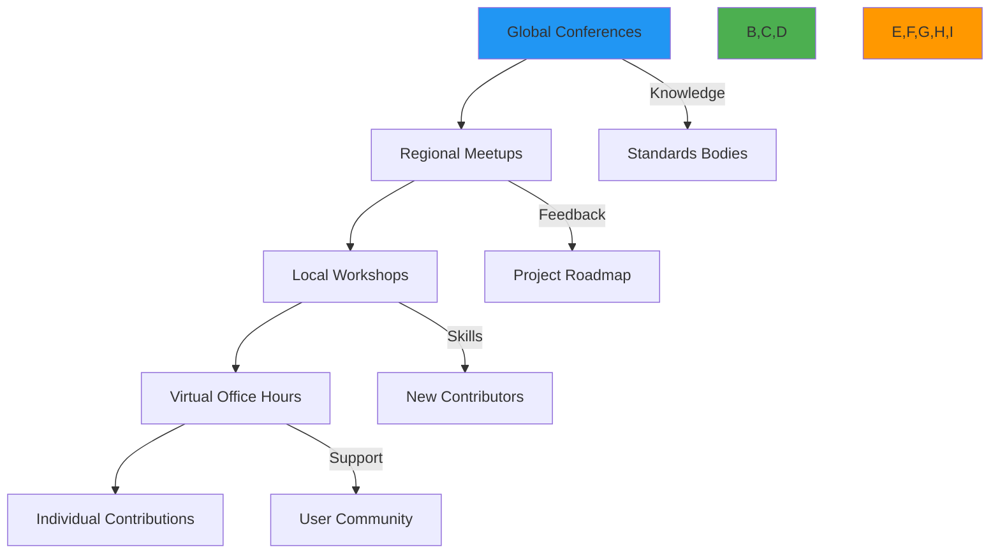
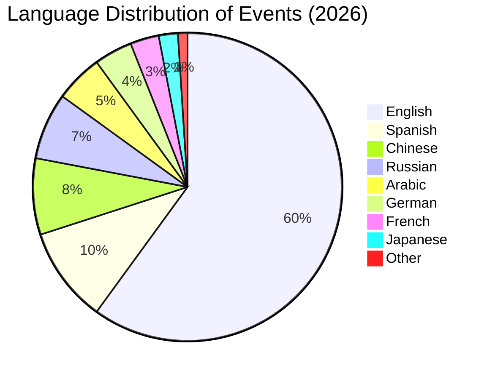

# فعاليات المجتمع

> **ميزة مخطط لها** — يصف هذا التوثيق وظائف قيد التطوير وغير متوفرة في الإصدار الحالي (v0.1.8). قد تتغير التفاصيل قبل الإطلاق.

**الغرض**: دليل شامل لفعاليات مجتمع RDAPify، بما في ذلك التجمعات الرسمية واللقاءات المحلية وورش العمل والمؤتمرات مع إرشادات عملية للمشاركة والتنظيم
**ذات صلة**: [المساهمة](contributing.md) | [مدونة السلوك](../../../CODE_OF_CONDUCT.md) | [شكر وتقدير المجتمع](credits.md) | [قنوات الدعم](../../support/getting_help.md)
**وقت القراءة**: 5 دقائق

## فلسفة الفعاليات واستراتيجيتها

تتبع فعاليات RDAPify نهجاً يضع المجتمع أولاً ويركز على تبادل المعرفة وبناء العلاقات وحل المشكلات التعاوني حول بيانات سجل الإنترنت:



**مبادئ الفعاليات**:
- **المشاركة الشاملة**: فعاليات يمكن الوصول إليها للمطورين من جميع مستويات الخبرة والخلفيات
- **تبادل المعرفة**: التركيز على التعلم العملي بدلاً من العروض الترويجية
- **احترام الخصوصية**: لا يوجد جمع إلزامي للبيانات الشخصية في فعاليات المجتمع
- **الوعي الأمني**: تتبع الفعاليات أفضل ممارسات الأمان لمشاريع البنية التحتية للإنترنت
- **التوسع المستدام**: تنسيقات الفعاليات التي يمكن أن تنمو مع حجم المجتمع مع الحفاظ على الجودة

## جدول الفعاليات الرسمي 2026

### قمم المجتمع الفصلية
| التاريخ | الشكل | مجال التركيز | الموقع/المنصة | التسجيل |
|---------|-------|--------------|--------------|---------|
| 20-21 مارس 2026 | هجين | تخطيط الإصدار ومراجعة الأمان | برلين، ألمانيا + افتراضي | [مفتوح 15 يناير](https://events.rdapify.dev/q1-2026) |
| 18-19 يونيو 2026 | افتراضي | تحسين الأداء وتصحيح الأخطاء | Zoom + Gather.Town | [مفتوح 15 أبريل](https://events.rdapify.dev/q2-2026) |
| 17-18 سبتمبر 2026 | هجين | ميزات الخصوصية والامتثال | أوستن، تكساس + افتراضي | [مفتوح 15 يوليو](https://events.rdapify.dev/q3-2026) |
| 11-12 ديسمبر 2026 | افتراضي | تخطيط نهاية العام والتعرف | Zoom + Discord | [مفتوح 15 أكتوبر](https://events.rdapify.dev/q4-2026) |

### ساعات المكتب الأسبوعية
```markdown
- **اليوم**: كل خميس
- **الوقت**: 2:00 مساءً UTC (جلسات متناوبة مناسبة لمناطق زمنية مختلفة)
- **الشكل**: مكالمة فيديو مع مشاركة الشاشة
- **التركيز**: استكشاف الأخطاء المباشرة ومراجعات الكود ومناقشات المعمارية
- **الوصول**: [رابط Zoom](https://rdapify.dev/community/office-hours)
- **التحضير**: أنشئ مسألة GitHub بتسمية `[office-hours]` مسبقاً للأولوية
```

### ورش العمل الشهرية
| سلسلة ورش العمل | الجلسة القادمة | الموضوع | الشكل |
|----------------|--------------|---------|-------|
| **أكاديمية RDAP** | 15 يناير 2026 | تعمق في بروتوكول RDAP | محاضرة تفاعلية |
| **البناء مع RDAPify** | 22 يناير 2026 | نظام مراقبة النطاقات | برمجة عملية |
| **هندسة الخصوصية** | 29 يناير 2026 | معالجة البيانات المتوافقة مع GDPR | دراسات حالة |
| **التعمق في البنية التحتية** | 5 فبراير 2026 | أنماط النشر عالي الحجم | مراجعة المعمارية |

## برنامج لقاءات المجتمع

### أن تصبح منظماً محلياً
```bash
# Apply to become a local organizer
git issue create --title "New Meetup: [Your City]" \
  --body "I'd like to organize RDAPify meetups in [City]. I have experience with [relevant experience]."
```

**متطلبات المنظم**:
- **المعرفة التقنية**: فهم أساسيات RDAPify وحالات الاستخدام
- **خبرة المجتمع**: المشاركة السابقة في مجتمعات المطورين
- **الروابط المحلية**: الوصول إلى أماكن الاستضافة أو الرعايات أو المجموعات التقنية المحلية
- **مهارات التواصل**: القدرة على تيسير المناقشات التقنية
- **الالتزام الزمني**: 5 ساعات كحد أدنى شهرياً لإدارة اللقاء المستمر

### موارد مجموعة اللقاء
يحصل جميع المنظمين المعتمدين على:
- **المجموعة الرقمية**: قوالب الشرائح وحزمة الشعار وأصول وسائل التواصل الاجتماعي
- **المجموعة المادية**: ملصقات ودبابيس وبطاقات أسماء (تُشحن ربع سنوياً)
- **الدعم المالي**: حتى 200 دولار لكل فعالية للمكان أو الطعام أو الأنشطة
- **دعم المتحدثين**: سداد نفقات المتحدثين الخارجيين الخبراء
- **الترويج**: قائمة مميزة في تقويم مجتمع RDAPify

### هيكل اللقاء النموذجي
```markdown
## Typical 2-hour Meetup Format

**6:00-6:30 PM** - Arrival & Networking
- Casual mingling with refreshments
- Name tags with pronouns and technical interests

**6:30-7:15 PM** - Core Presentation (30-45 minutes)
- Technical deep dive or case study
- Live demo or hands-on segment
- Q&A throughout presentation

**7:15-8:00 PM** - Open Space Discussions (45 minutes)
- Breakout groups based on interests
- Project collaboration opportunities
- Help desk for individual questions

**8:00 PM** - Closing & Next Steps
- Announcements for next event
- Call for volunteers and speakers
- Optional social gathering continuation
```

## إرشادات ورش العمل والهاكاثون

### إدارة ورش العمل التقنية
```typescript
// Example workshop configuration
const workshopConfig = {
  title: "Building Domain Monitoring Systems with RDAPify",
  duration: "3 hours",
  maxParticipants: 25,
  prerequisites: [
    "Basic JavaScript/TypeScript knowledge",
    "Understanding of domain registration concepts",
    "Node.js 18+ installed on laptop"
  ],
  materials: [
    "starter-repo.zip",
    "solution-code.zip",
    "rdapify-cheat-sheet.pdf"
  ],
  learningObjectives: [
    "Configure RDAPify for production monitoring",
    "Implement custom PII redaction rules",
    "Build alerting system for domain changes",
    "Deploy to serverless environment"
  ],
  safetyRequirements: {
    privacy: "No real user data in examples",
    security: "Pre-configured test environments only",
    accessibility: "Screen reader compatible materials"
  }
};
```

**أفضل ممارسات تيسير ورش العمل**:
- **التواصل قبل الفعالية**: أرسل تعليمات الإعداد والتوقعات قبل أسبوع
- **الصعوبة التدريجية**: ابدأ بسيطاً وأضف التعقيد تدريجياً
- **أساليب تعلم متعددة**: امزج المكونات البصرية والسمعية والعملية
- **الوتيرة الشاملة**: صمم الأنشطة بتوقيت مرن لمستويات المهارة المختلفة
- **موارد ما بعد الفعالية**: شارك التسجيلات وعينات الكود وقراءات المتابعة

### قواعد الهاكاثون المتخصصة في الأمان
```markdown
## RDAPify Security Hackathon Guidelines

**Allowed Activities**:
- Testing against provided sandbox environments only
- Analyzing code patterns for potential vulnerabilities
- Discussing theoretical attack scenarios
- Building defensive tools and monitoring systems

**Prohibited Activities**:
- Testing against production RDAP servers without explicit permission
- Attempting to extract PII from test data
- Bypassing provided security controls in sandbox
- Sharing actual vulnerability details publicly before responsible disclosure

**Responsible Disclosure Process**:
1. Document findings in private GitHub issue
2. Tag with `security` and `hackathon` labels
3. Await confirmation from security team (within 24 hours)
4. Work with security team on fix timeline
5. Public recognition after patch release
```

## استراتيجية التمثيل العالمي

### قادة المجتمعات الإقليمية
| المنطقة | القائد | المسؤوليات | التواصل |
|--------|--------|------------|---------|
| **EMEA** | Maria Schmidt | الفعاليات الأوروبية ومناقشات امتثال GDPR | maria@rdapify.com |
| **أمريكا الشمالية** | Alex Johnson | لقاءات الولايات المتحدة/كندا وورش العمل للمؤسسات | alex@rdapify.com |
| **آسيا والمحيط الهادئ** | Wei Chang | الفعاليات الآسيوية والتوثيق الخاص باللغة | wei@rdapify.com |
| **أمريكا اللاتينية** | Carlos Mendez | التوعية بالإسبانية/البرتغالية والشراكات المحلية | carlos@rdapify.com |
| **الشرق الأوسط وأفريقيا** | Layla Hassan | دعم اللغة العربية والامتثال الإقليمي | layla@rdapify.com |

### الفعاليات الخاصة بالغات


**برنامج دعم اللغات**:
- **فرق الترجمة**: مجموعات تطوعية لتوثيق الفعاليات ومواد الفعاليات
- **ميزانية المترجمين**: 300 دولار لكل فعالية لخدمات الترجمة الفورية المهنية
- **المحتوى المحلي**: مواد خاصة بالفعاليات في أفضل 10 لغات مجتمعية
- **تدوير المناطق الزمنية**: الفعاليات الرئيسية مجدولة عبر مناطق زمنية متعددة شهرياً

## أفضل ممارسات الفعاليات الافتراضية

### دليل الإعداد التقني
```bash
# Recommended streaming setup
npm install --global rdapify-live-tools

# Test your setup
rdapify-live test --camera --microphone --screen

# Start event stream
rdapify-live host \
  --title "January Office Hours" \
  --description "Live troubleshooting session" \
  --platform zoom \
  --recording true \
  --accessibility-live-captioning true
```

**قائمة فحص الفعاليات الافتراضية**:
- **اختيار المنصة**: استخدم منصات تحتوي على ميزات إمكانية الوصول وإمكانيات التسجيل
- **خطة الإدارة**: عيّن مشرفين مخصصين للدردشة والأسئلة والأجوبة والمشكلات التقنية
- **نسخة احتياطية للمحتوى**: أعد الشرائح والعروض التوضيحية التي تعمل دون اتصال بالإنترنت في حالة فشل الاتصال
- **إدارة الوقت**: جدول صارم مع وقت مؤقت بين المقاطع
- **سياسة التسجيل**: إفصاح واضح عن التسجيل وتوافره بعد الفعالية
- **إمكانية الوصول**: تسميات توضيحية مباشرة ومواد متوافقة مع قارئ الشاشة واعتبارات تباين الألوان

### تنسيق الفعاليات الهجينة
```typescript
// Hybrid event coordination system
class HybridEventManager {
  constructor(eventConfig: HybridEventConfig) {
    this.config = eventConfig;
    this.virtualPlatform = new VirtualPlatform(config.virtualPlatform);
    this.venueCoordinator = new VenueCoordinator(config.physicalVenue);
  }

  async coordinateEvent() {
    // Synchronize schedules
    await this.syncSchedules();

    // Set up cross-platform communication
    this.setupCrossPlatformCommunication();

    // Configure accessibility features
    await this.configureAccessibility();

    // Run technical rehearsal
    await this.technicalRehearsal();
  }

  private async syncSchedules() {
    // Ensure in-person and virtual components are time-synchronized
    const masterSchedule = this.config.timeline.map(item => ({
      ...item,
      virtualRoom: this.virtualPlatform.getRoom(item.sessionId),
      physicalRoom: this.venueCoordinator.getRoom(item.sessionId)
    }));

    await this.virtualPlatform.updateSchedule(masterSchedule);
    await this.venueCoordinator.updateSchedule(masterSchedule);
  }

  private setupCrossPlatformCommunication() {
    // Set up Q&A system that works across platforms
    this.qaSystem = new UnifiedQASystem({
      virtualPlatform: this.virtualPlatform,
      physicalVenue: this.venueCoordinator
    });

    // Configure session feedback collection
    this.feedbackSystem = new CrossPlatformFeedback({
      platforms: [this.virtualPlatform, this.venueCoordinator]
    });
  }
}
```

## تقارير الفعاليات والمتابعة

### قالب التوثيق بعد الفعالية
```markdown
# Event Report: [Event Name]

**Basic Information**
- Date: [YYYY-MM-DD]
- Location/Platform: [Physical or Virtual]
- Attendees: [Count + breakdown]
- Organizer(s): [Names and roles]

**Content Summary**
- Sessions conducted: [List with links to materials]
- Key discussions: [Bullet points of important topics]
- Outcomes achieved: [Decisions made, actions agreed]

**Community Impact**
- New contributors identified: [Count + GitHub handles]
- Documentation improvements: [Links to PRs]
- Bug reports/feature requests: [Issue numbers]
- Partnerships developed: [Organizations/individuals]

**Action Items**
- [ ] Owner: Action description (Due date)
- [ ] Owner: Action description (Due date)

**Improvements for Next Time**
- What worked well: [List]
- What could be improved: [List]
- Resource suggestions: [Recommendations]

**Media and Recordings**
- [Link to recordings]
- [Link to slides/presentations]
- [Link to photos (with consent)]
```

### قياس تأثير المجتمع
```typescript
// Event impact tracking system
interface EventImpactMetrics {
  attendance: {
    total: number;
    newCommunityMembers: number;
    returningParticipants: number;
    diversityMetrics: {
      gender: Record<string, number>;
      geography: Record<string, number>;
      experienceLevel: Record<string, number>;
    }
  };
  engagement: {
    questionsAsked: number;
    discussionsStarted: number;
    codeContributions: number;
    documentationImprovements: number;
  };
  outcomes: {
    newContributors: number;
    mergedPRs: number;
    closedIssues: number;
    newMeetupGroups: number;
    partnershipsFormed: number;
  };
  sentiment: {
    npsScore: number;
    feedbackSentiment: 'positive' | 'neutral' | 'negative';
    improvementSuggestions: string[];
  };
}

async function generateEventReport(eventId: string): Promise<EventImpactReport> {
  // Implementation would gather metrics from multiple sources
  const metrics = await collectEventMetrics(eventId);
  const report = calculateImpactScore(metrics);

  // Store for historical analysis
  await storeEventReport(report);

  return report;
}
```

## الوثائق ذات الصلة

| المستند | الوصف | المسار |
|---------|-------|--------|
| [المساهمة](contributing.md) | كيفية المساهمة في RDAPify | [contributing.md](contributing.md) |
| [مدونة السلوك](../../../CODE_OF_CONDUCT.md) | معايير سلوك المجتمع | [../../../CODE_OF_CONDUCT.md](../../../CODE_OF_CONDUCT.md) |
| [شكر وتقدير المجتمع](credits.md) | التعرف على مساهمي المجتمع | [credits.md](credits.md) |
| [قنوات الدعم](../../support/getting_help.md) | الحصول على مساعدة في الفعاليات | [../../support/getting_help.md](../../support/getting_help.md) |
| [دليل التحدث في المؤتمرات](speaking_guide.md) | إرشادات التقديم في الفعاليات | [speaking_guide.md](speaking_guide.md) |
| [برنامج القادة الإقليميين](regional_leads.md) | أن تصبح قائداً إقليمياً للمجتمع | [regional_leads.md](regional_leads.md) |
| [إرشادات إمكانية الوصول](accessibility.md) | جعل الفعاليات شاملة | [accessibility.md](accessibility.md) |

## مواصفات الفعاليات

| الخاصية | القيمة |
|---------|--------|
| **تكرار الفعاليات** | ساعات مكتبية أسبوعية وورش عمل شهرية وقمم فصلية |
| **اللغات المدعومة** | الإنجليزية + 9 لغات إقليمية مع دعم الترجمة |
| **معيار إمكانية الوصول** | امتثال WCAG 2.1 المستوى AA للفعاليات الافتراضية |
| **مدونة السلوك** | [Contributor Covenant v2.1](https://www.contributor-covenant.org/version/2/1/code_of_conduct.html) |
| **الإبلاغ عن السلامة** | الإبلاغ المجهول عبر [safety@rdapify.com](mailto:safety@rdapify.com) |
| **سياسة التسجيل** | الموافقة مطلوبة، التسجيلات متاحة لمدة 3 أشهر |
| **جمع البيانات** | حد أدنى، تسجيل متوافق مع GDPR مع خيارات الخروج |
| **سياسة الرعاية** | لا يوجد رعاة حصريون، مساحة متساوية للجميع |
| **البصمة الكربونية** | الفعاليات الافتراضية مفضلة، تعويض الكربون للفعاليات المادية |
| **آخر تحديث** | 5 ديسمبر 2025 |

> **تذكير حرج**: يجب أن تتبع جميع فعاليات المجتمع [مدونة السلوك](../../../CODE_OF_CONDUCT.md) مع عدم التسامح مطلقاً مع التحرش أو التمييز. يجب على منظمي الفعاليات إكمال التدريب الإلزامي على السلامة قبل استضافة الفعاليات الشخصية. للموضوعات الحساسة أمنياً، نسّق مع فريق الأمان مسبقاً لضمان اتباع ممارسات الإفصاح المسؤول. يجب أن توفر الفعاليات الافتراضية ميزات إمكانية الوصول بما في ذلك التسميات التوضيحية المغلقة وتوافق قارئ الشاشة.

[← العودة إلى المجتمع](../README.md) | [التالي: شكر وتقدير المجتمع →](credits.md)

*وثيقة مُنشأة تلقائياً من الكود المصدري مع مراجعة أمنية في 5 ديسمبر 2025*
