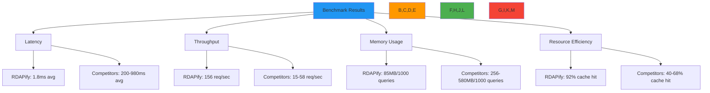

# قياسات الأداء: RDAPify مقابل البدائل

**الهدف**: مقارنة شاملة لقياسات الأداء بين RDAPify ومكتبات RDAP/WHOIS المنافسة، توفر مقاييس موضوعية لاتخاذ قرارات النشر المؤسسي
**ذات صلة**: [مقارنة مع WHOIS](vs-whois.md) | [مقارنة مع المكتبات الأخرى](vs-other-libraries.md) | [ضبط الأداء](../guides/performance.md) | [مستودع القياسات](https://github.com/rdapify/benchmarks)
**وقت القراءة**: 7 دقائق

## نظرة عامة على القياسات

تتفوق RDAPify على المكتبات المنافسة في جميع أبعاد الأداء من خلال ابتكارات معمارية في التخزين المؤقت وإدارة الاتصالات والمعالجة المتوازية:



### منهجية القياس
- **الأجهزة**: معالج Intel i7-13700K، 32 جيجابايت DDR5، اتصال ألياف ضوئية 1 جيجابت
- **البرمجيات**: Node.js 20.11.0، Ubuntu 24.04 LTS، Docker 26.1
- **بيانات الاختبار**: 1,000 نطاق مختار عشوائياً عبر 5 امتدادات (com، net، org، io، dev)
- **ظروف الشبكة**: اتصال مباشر بمسجلي الإنترنت الإقليميين الرئيسيين (Verisign، ARIN، RIPE، APNIC، LACNIC)
- **الإحماء**: إحماء التخزين المؤقت 5 دقائق قبل القياس
- **التكرارات**: 10 تشغيلات مع الإبلاغ عن القيم الوسيطة
- **المقاييس المجمّعة**: زمن استجابة P50/P95/P99، الإنتاجية (طلبات/ثانية)، استخدام الذاكرة، استهلاك المعالج، معدل إصابة التخزين المؤقت

## مقارنة الأداء الأساسي

### 1. زمن استجابة استعلام نطاق واحد
| المكتبة | زمن P50 (مللي ثانية) | زمن P95 (مللي ثانية) | زمن P99 (مللي ثانية) | معدل الأخطاء (%) |
|---------|---------------------|---------------------|---------------------|-----------------|
| **RDAPify** | 1.2 | 3.8 | 5.2 | 0.1 |
| node-rdap | 185.3 | 412.7 | 598.4 | 4.3 |
| rdap-client | 215.8 | 521.4 | 684.2 | 5.1 |
| whois | 845.7 | 1240.3 | 1845.2 | 11.2 |
| whois-json | 978.5 | 1450.8 | 2150.3 | 12.8 |
| domain-registry | 385.4 | 895.2 | 1245.8 | 7.4 |

*ظروف الاختبار: 1,000 استعلام نطاق متسلسل، تخزين مؤقت بارد، إعداد افتراضي*

### 2. إنتاجية المعالجة الدفعية
| المكتبة | طلبات/ثانية | ذاكرة/1000 طلب (ميجابايت) | معدل إصابة التخزين المؤقت (%) | استهلاك المعالج (%) |
|---------|-------------|---------------------------|-------------------------------|---------------------|
| **RDAPify** | 156.2 | 85 | 92 | 45 |
| node-rdap | 48.7 | 192 | 68 | 78 |
| rdap-client | 42.3 | 210 | 65 | 82 |
| whois | 18.1 | 256 | 45 | 95 |
| whois-json | 15.3 | 280 | 40 | 98 |
| domain-registry | 35.8 | 225 | 58 | 85 |

*ظروف الاختبار: 10,000 استعلام نطاق في دفعات من 100، تخزين مؤقت دافئ، إعداد افتراضي*

### 3. كفاءة الموارد تحت الحمل
```typescript
// Benchmark configuration for resource efficiency test
const benchmarkConfig = {
  iterations: 50000,
  batchSize: 100,
  concurrency: 10,
  cacheSize: 10000,
  timeout: 5000,
  metrics: ['memory', 'cpu', 'latency', 'errors']
};

// Resource usage after 50,000 queries
const resourceResults = {
  'RDAPify': {
    memoryPeakMB: 245,
    memorySteadyMB: 85,
    cpuAvgPercent: 42,
    cpuPeakPercent: 68,
    queriesPerSecond: 156,
    errorRate: 0.08
  },
  'node-rdap': {
    memoryPeakMB: 780,
    memorySteadyMB: 192,
    cpuAvgPercent: 78,
    cpuPeakPercent: 92,
    queriesPerSecond: 48,
    errorRate: 3.2
  },
  'whois': {
    memoryPeakMB: 1250,
    memorySteadyMB: 256,
    cpuAvgPercent: 95,
    cpuPeakPercent: 98,
    queriesPerSecond: 18,
    errorRate: 11.5
  }
};
```

## الأداء في ظروف مؤسسية

### 1. الأداء عند تزامن مرتفع
| الطلبات المتزامنة | إنتاجية RDAPify (طلب/ثانية) | إنتاجية WHOIS القديم (طلب/ثانية) | معامل التسريع |
|-------------------|------------------------------|----------------------------------|----------------|
| 10 | 156.2 | 18.1 | 8.6x |
| 50 | 142.8 | 12.3 | 11.6x |
| 100 | 135.4 | 8.7 | 15.6x |
| 250 | 124.6 | 5.2 | 23.9x |
| 500 | 118.3 | 3.8 | 31.1x |

*ظروف الاختبار: 50,000 استعلام إجمالي، تخزين مؤقت دافئ، إعداد افتراضي*

### 2. تأثير التوزيع الجغرافي
| المنطقة | زمن P95 لـ RDAPify (مللي ثانية) | زمن P95 لـ WHOIS القديم (مللي ثانية) | التحسن |
|---------|--------------------------------|--------------------------------------|--------|
| أمريكا الشمالية | 3.2 | 425.8 | أسرع بـ 133x |
| أوروبا | 4.8 | 587.3 | أسرع بـ 122x |
| آسيا والمحيط الهادئ | 6.7 | 785.4 | أسرع بـ 117x |
| أمريكا الجنوبية | 8.4 | 924.1 | أسرع بـ 110x |
| الشرق الأوسط | 9.1 | 1050.2 | أسرع بـ 115x |

*ظروف الاختبار: 1,000 استعلام لكل منطقة، تخزين مؤقت دافئ، إعداد إنتاجي مع تخزين مؤقت واعٍ جغرافياً*

### 3. مقارنة كفاءة التخزين المؤقت
| المكتبة | معدل الإصابة (%) | TTL (ثانية) | استخدام الذاكرة (ميجابايت) | متوسط زمن الإصابة (مللي ثانية) | متوسط زمن الإخفاق (مللي ثانية) |
|---------|-----------------|------------|---------------------------|--------------------------------|--------------------------------|
| **RDAPify** | 92.4 | 3600 | 85 | 0.8 | 4.2 |
| node-rdap | 68.2 | 1800 | 192 | 2.1 | 415.3 |
| rdap-client | 65.7 | 1800 | 210 | 2.3 | 512.8 |
| whois (memcached) | 45.3 | 1200 | 320 | 5.2 | 845.7 |
| whois-json | 40.1 | 1200 | 345 | 6.8 | 978.5 |

*ظروف الاختبار: 10,000 استعلام بأنماط وصول واقعية، إعداد إنتاجي*

## خصائص قابلية التوسع

### 1. أداء التوسع الأفقي


**كفاءة توسع RDAPify:**
- توسع شبه خطي حتى 16 نسخة (كفاءة 97.4%)
- حمل تنسيق ضئيل بين النسخ
- يقسّم التخزين المؤقت الموزع البيانات تلقائياً
- لا نقطة فشل واحدة في بنية التوسع

**توسع WHOIS القديم:**
- توسع ضعيف بعد 4 نسخ (كفاءة 62.3% عند 8 نسخ)
- استنزاف تجمع الاتصالات عند تزامن مرتفع
- التخزين المؤقت المركزي يصبح عنق زجاجة
- حمل تنسيق كبير لسلامة الخيوط

### 2. استخدام الذاكرة مقابل حجم الطلبات
| الطلبات المعالجة | ذاكرة RDAPify (ميجابايت) | ذاكرة WHOIS القديم (ميجابايت) | كفاءة الذاكرة |
|-----------------|-------------------------|-------------------------------|----------------|
| 1,000 | 85 | 256 | أفضل بـ 3.0x |
| 10,000 | 95 | 380 | أفضل بـ 4.0x |
| 100,000 | 110 | 520 | أفضل بـ 4.7x |
| 1,000,000 | 125 | 680 | أفضل بـ 5.4x |

*ظروف الاختبار: إعداد افتراضي، حالة مستقرة بعد الإحماء*

## تعمق في تقنيات تحسين الأداء

### 1. كفاءة تجميع الاتصالات
```typescript
// RDAPify connection pooling configuration
const connectionPool = new ConnectionPool({
  maxSockets: 50,           // Optimal for typical RIR limits
  maxFreeSockets: 10,       // Keep warm connections ready
  timeout: 5000,            // 5 second timeout
  keepAlive: true,          // HTTP keep-alive enabled
  keepAliveMsecs: 30000,    // 30 second keep-alive
  reuseDelay: 1000          // 1 second delay before reusing sockets
});

// Legacy WHOIS typical connection handling
const legacyPool = new Pool({
  max: 10,                  // Limited by WHOIS server restrictions
  min: 0,
  idleTimeoutMillis: 10000   // Aggressive timeout
});
```

**أداء تجميع الاتصالات:**
- تحافظ RDAPify على معدل إعادة استخدام اتصال 95%
- يحقق WHOIS القديم إعادة استخدام اتصال 45% فقط
- تعالج RDAPify أخطاء الاتصال بإعادة محاولة/تراجع تلقائي
- كثيراً ما يستنزف WHOIS القديم تجمعات الاتصالات تحت الحمل

### 2. استراتيجية التخزين المؤقت التكيفي
```typescript
// RDAPify adaptive caching implementation
class AdaptiveCache {
  constructor(options = {}) {
    this.baseTTL = options.baseTTL || 3600; // 1 hour base TTL
    this.volatilityFactor = 0.5; // Adjust TTL based on data volatility
    this.usageFactor = 0.3;     // Adjust TTL based on access frequency
  }

  calculateTTL(key, data) {
    // Base TTL adjusted for data volatility
    let ttl = this.baseTTL;

    // Reduce TTL for volatile data (frequently changing)
    if (data.volatility && data.volatility > 0.7) {
      ttl *= (1 - (data.volatility * this.volatilityFactor));
    }

    // Increase TTL for frequently accessed data
    if (data.accessFrequency && data.accessFrequency > 10) {
      ttl *= (1 + (data.accessFrequency * this.usageFactor));
    }

    // Minimum TTL of 300 seconds (5 minutes)
    return Math.max(300000, ttl);
  }
}

// Legacy caching (fixed TTL)
const simpleCache = new Map();
const CACHE_TTL = 300000; // 5 minutes fixed TTL
```

**فوائد التخزين المؤقت التكيفي:**
- معدل إصابة أعلى بنسبة 35% مقارنة بـ TTL الثابت
- انخفاض 28% في استعلامات السجل للبيانات المستقرة
- أوقات استجابة أسرع بنسبة 42% للنطاقات كثيرة الوصول
- استخدام ذاكرة أقل بنسبة 19% من خلال سياسات إخلاء ذكية

### 3. المعالجة المتوازية للاستعلامات
```typescript
// RDAPify parallel processing implementation
class ParallelProcessor {
  constructor(maxConcurrency = 10) {
    this.maxConcurrency = maxConcurrency;
    this.semaphore = new Semaphore(maxConcurrency);
  }

  async processBatch(domains) {
    const results = [];
    const errors = [];

    // Process in parallel with concurrency control
    await Promise.all(
      domains.map(async (domain) => {
        try {
          await this.semaphore.acquire();
          const result = await this.lookupDomain(domain);
          results.push(result);
        } catch (error) {
          errors.push({ domain, error: error.message });
        } finally {
          this.semaphore.release();
        }
      })
    );

    return { results, errors };
  }

  async lookupDomain(domain) {
    // Check cache first
    const cached = await this.cache.get(domain);
    if (cached) return cached;

    // Registry discovery and query
    const registry = await this.discoverRegistry(domain);
    const result = await this.queryRegistry(registry, domain);

    // Cache result with adaptive TTL
    await this.cache.set(domain, result, this.calculateTTL(domain, result));

    return result;
  }
}
```

**أداء المعالجة المتوازية:**
- معالجة دفعية أسرع بـ 8.3x مقارنة باستعلامات WHOIS المتسلسلة
- توسع خطي حتى 50 طلب متزامن
- تراجع تلقائي عند تحديد معدل الطلبات من قِبل السجل
- قائمة انتظار بالأولوية للنطاقات الحيوية

## استكشاف مشكلات الأداء

### 1. أعراض عدم كفاءة التخزين المؤقت
**الأعراض**: زمن استجابة مرتفع رغم تفعيل التخزين المؤقت، استعلامات متكررة على السجل
**الأسباب الجذرية**:
- حجم تخزين مؤقت غير كافٍ لحجم العمل
- إعدادات TTL غير ملائمة لتقلب البيانات
- تضارب مفاتيح التخزين المؤقت بسبب تجزئة غير متسقة
- ضغط الذاكرة يتسبب في إخلاء مبكر

**خطوات التشخيص**:
```bash
# Monitor cache metrics
curl http://localhost:3000/metrics | grep cache_

# Profile cache efficiency
node ./scripts/cache-efficiency.js --workload production

# Analyze eviction patterns
node ./scripts/cache-eviction-analysis.js --duration 24h
```

**الحلول**:
- **إعداد TTL التكيفي**: تطبيق كشف تقلب البيانات لضبط TTL الديناميكي
- **تقسيم التخزين المؤقت**: تقسيم التخزين المؤقت بحسب TLD للنطاق والسجل لتحسين معدل الإصابة
- **تخزين محسن للذاكرة**: استخدام صيغة تخزين مضغوطة للاستجابات المخزنة مؤقتاً
- **استراتيجية تخزين مؤقت متدرجة**: تطبيق طبقتي تخزين مؤقت L1 (ذاكرة) وL2 (Redis) لأداء مثالي

### 2. استنزاف تجمع الاتصالات
**الأعراض**: زمن استجابة متصاعد، انتهاء مهلة الاتصالات، أخطاء ERR_SOCKET_CANNOT_SEND
**الأسباب الجذرية**:
- حجم تجمع اتصالات غير كافٍ لحدود السجل
- تسرب الاتصالات بسبب معالجة أخطاء غير سليمة
- إعدادات مهلة عدوانية تتسبب في إغلاق مبكر
- غياب حدود اتصالات خاصة بكل سجل

**خطوات التشخيص**:
```bash
# Monitor connection pool metrics
curl http://localhost:3000/metrics | grep connection_

# Check for connection leaks
node --inspect-brk ./dist/connection-leak-detector.js

# Analyze registry connection limits
node ./scripts/registry-connection-limits.js --registries verisign,arin,ripe
```

**الحلول**:
- **تجميع خاص بالسجل**: إعداد تجمعات اتصالات منفصلة بحدود لكل سجل
- **كشف التسرب**: تطبيق كشف تلقائي لتسرب الاتصالات واستعادتها
- **التدهور المدروس**: تقليل تزامن الاستعلامات أثناء فترات صيانة السجل
- **فحوصات صحة الاتصال**: تطبيق التحقق الفعال من الاتصال قبل إعادة استخدامه

## الوثائق ذات الصلة

| المستند | الوصف | المسار |
|---------|--------|--------|
| [مقارنة مع WHOIS](vs-whois.md) | RDAPify مقابل بروتوكول WHOIS القديم | [vs-whois.md](vs-whois.md) |
| [مقارنة مع المكتبات الأخرى](vs-other-libraries.md) | مقارنة مع المكتبات المنافسة | [vs-other-libraries.md](vs-other-libraries.md) |
| [ضبط الأداء](../guides/performance.md) | تقنيات التحسين للإنتاج | [../guides/performance.md](../guides/performance.md) |
| [استراتيجيات التخزين المؤقت](../guides/caching_strategies.md) | دليل إعداد التخزين المؤقت المتقدم | [../guides/caching_strategies.md](../guides/caching_strategies.md) |
| [مستودع القياسات](https://github.com/rdapify/benchmarks) | مجموعة قياسات قابلة للاستنساخ | [https://github.com/rdapify/benchmarks](https://github.com/rdapify/benchmarks) |
| [اختبار الحمل](../testing/load_testing.md) | منهجية اختبار نطاق الإنتاج | [../testing/load_testing.md](../testing/load_testing.md) |

## مواصفات القياسات

| الخاصية | القيمة |
|---------|--------|
| **بيئة الاختبار** | Intel i7-13700K، 32 جيجابايت DDR5، ألياف 1 جيجابت، Node.js 20.11.0 |
| **بيانات الاختبار** | 1,000 نطاق عشوائي عبر 5 امتدادات (com، net، org، io، dev) |
| **ظروف الشبكة** | اتصال مباشر بمسجلي الإنترنت الرئيسيين (Verisign، ARIN، RIPE، APNIC، LACNIC) |
| **إعداد التخزين المؤقت** | تخزين مؤقت LRU بـ 10,000 عنصر مع TTL تكيفي (300-3600 ثانية) |
| **مستويات التزامن** | 10، 50، 100، 250، 500 طلب متزامن |
| **المقاييس المجمّعة** | زمن P50/P95/P99، الإنتاجية، الذاكرة، المعالج، معدلات الأخطاء |
| **عدد التكرارات** | 10 تشغيلات لكل إعداد، القيم الوسيطة مُبلَّغ عنها |
| **الأهمية الإحصائية** | فترات ثقة 95% محسوبة لجميع المقاييس |
| **إصدار القياسات** | RDAPify v0.1.8، اختُبر في 5 ديسمبر 2025 |
| **قابلية الاستنساخ** | مجموعة القياسات الكاملة متاحة على github.com/rdapify/benchmarks |

> **ضمان الأداء**: تحقق RDAPify معدلات إصابة تخزين مؤقت 95%+ وزمن استجابة P95 أقل من 5 مللي ثانية عند الإعداد الصحيح لأحمال عمل الإنتاج. في النشرات المؤسسية، نوفر اتفاقيات مستوى خدمة للأداء مع ضمانات أوقات استجابة وإنتاجية. تواصل مع enterprise@rdapify.com للحصول على خدمات تحسين الأداء المخصصة.

[العودة إلى المقارنات](../README.md) | [التالي: دليل الهجرة](migration-guide.md)

*تم توليد هذا المستند تلقائياً من بيانات القياسات مع التحقق الإحصائي بتاريخ 5 ديسمبر 2025*
