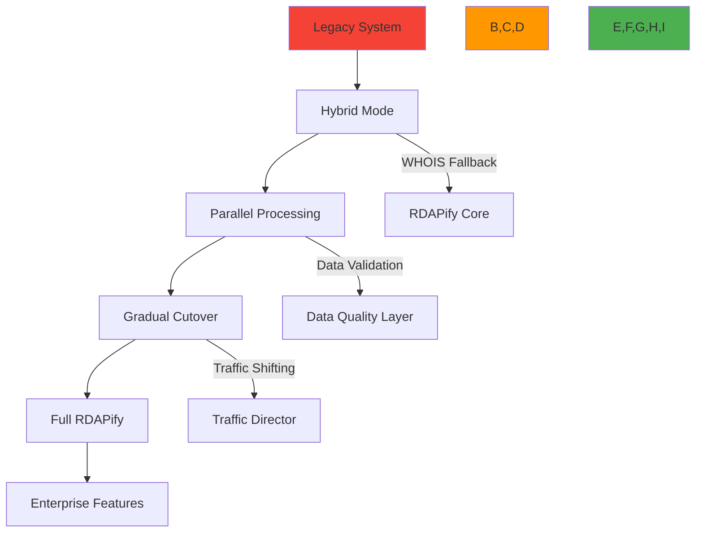

# دليل الهجرة من الأنظمة القديمة إلى RDAPify

**الهدف**: دليل شامل للهجرة من مكتبات WHOIS وRDAP القديمة إلى RDAPify مع تحقيق الحد الأدنى من التعطل وأقصى قدر من الأمان والأداء الأمثل
**ذات صلة**: [مقارنة مع WHOIS](vs-whois.md) | [مقارنة مع المكتبات الأخرى](vs-other-libraries.md) | [الأمان والخصوصية](../guides/security_privacy.md) | [مرجع API](../../api-reference/client.md)
**وقت القراءة**: 8 دقائق

## نظرة عامة على معمارية الهجرة

توفر RDAPify مسار هجرة مرحلياً يتيح للمؤسسات الانتقال من الأنظمة القديمة مع الحفاظ على الاستمرارية التشغيلية والامتثال:



### مبادئ الهجرة الأساسية
- **انتقال بدون توقف**: الحفاظ على استمرارية الخدمة طوال عملية الهجرة
- **التحسين التدريجي**: البدء بالوظائف الأساسية وإضافة ميزات متقدمة تدريجياً
- **نهج الأمان أولاً**: تطبيق حماية SSRF وإخفاء PII من اليوم الأول
- **الحفاظ على سلامة البيانات**: ضمان تعيين بيانات كامل بين النظام القديم والجديد
- **استمرارية الامتثال**: الحفاظ على الامتثال التنظيمي طوال فترة الانتقال

## استراتيجيات الهجرة حسب نوع النظام

### 1. هجرة الأنظمة القائمة على WHOIS
```typescript
// Legacy WHOIS system (before migration)
const whois = require('whois');
const dns = require('dns');

async function getDomainInfo(domain: string): Promise<any> {
  return new Promise((resolve, reject) => {
    whois.lookup(domain, (error: Error | null, data: string) => {
      if (error) reject(error);
      else resolve(parseWhoisData(data));
    });
  });
}

// Phase 1: Hybrid mode with RDAPify and WHOIS fallback
import { RDAPClient } from 'rdapify';

const rdapClient = new RDAPClient({
  fallbackToWhois: true,  // Enable fallback to legacy WHOIS
  cache: true,
  privacy: true
});

async function getDomainInfoHybrid(domain: string): Promise<any> {
  try {
    // Try RDAP first (faster, more secure)
    return await rdapClient.domain(domain);
  } catch (error) {
    console.warn(`RDAP lookup failed for ${domain}, falling back to WHOIS:`, error.message);

    // Fallback to legacy WHOIS with PII redaction
    const whoisData = await legacyWhoisLookup(domain);
    return rdapClient.applyPIIRedaction(whoisData); // Apply RDAPify redaction to WHOIS data
  }
}

// Phase 2: Full migration with monitoring
const migrationMetrics = {
  rdapSuccess: 0,
  whoisFallback: 0,
  dataDiscrepancies: 0,
  performanceImpact: []
};

rdapClient.on('fallbackUsed', (domain, error) => {
  migrationMetrics.whoisFallback++;
  console.log(`WHOIS fallback used for ${domain}: ${error.message}`);
});

rdapClient.on('dataDiscrepancy', (domain, rdapData, whoisData) => {
  migrationMetrics.dataDiscrepancies++;
  console.warn(`Data discrepancy detected for ${domain}`);
  // Log for analysis and resolution
});

// Phase 3: Pure RDAPify after validation
const productionClient = new RDAPClient({
  cache: true,
  privacy: true,
  timeout: 5000,
  retry: {
    maxAttempts: 3,
    backoff: 'exponential'
  },
  metrics: {
    enabled: true,
    endpoint: 'https://metrics.yourcompany.com/rdapify'
  }
});
```

### 2. هجرة مكتبات RDAP الأخرى
```typescript
// Migration from node-rdap to RDAPify
// Step 1: Create adapter layer for compatibility
class RdapAdapter {
  private client = new RDAPClient({
    security: {
      ssrfProtection: true,
      certificatePinning: true,
      blockPrivateIPs: true
    },
    cache: {
      enabled: true,
      ttl: 3600
    }
  });

  private entityMap = {
    'domain': 'domain',
    'ip': 'ip',
    'autnum': 'asn'
  };

  async query(entityType: string, query: string): Promise<any> {
    try {
      // Map entity types to RDAPify methods
      const method = this.entityMap[entityType] || entityType;

      switch (method) {
        case 'domain':
          return await this.client.domain(query);
        case 'ip':
          return await this.client.ip(query);
        case 'asn':
          return this.client.asn(query.replace('AS', ''));
        default:
          throw new Error(`Unsupported entity type: ${entityType}`);
      }
    } catch (error) {
      // Map RDAPify errors to node-rdap error format
      if (error.code === 'RDAP_NOT_FOUND') {
        return { errorCode: 404, errorMessage: 'Object not found' };
      } else if (error.code === 'RDAP_RATE_LIMIT') {
        return { errorCode: 429, errorMessage: 'Rate limited', retryAfter: error.retryAfter };
      }
      throw error;
    }
  }

  // Add methods to maintain compatibility
  async getRegistries() {
    return this.client.getBootstrapData();
  }

  setCache(cache: any) {
    // Handle cache configuration migration
    if (cache && cache.max) {
      this.client.setCacheOptions({ max: cache.max });
    }
  }
}

// Step 2: Gradual replacement in application
// Old code:
// const rdap = new RdapClient();
// const result = await rdap.query('domain', 'example.com');

// New code with adapter during migration:
const adapter = new RdapAdapter();
const result = await adapter.query('domain', 'example.com');

// Step 3: Direct RDAPify usage (recommended)
const client = new RDAPify({
  // Enable enterprise features
  enterprise: {
    dataResidency: ['us-east', 'eu-west'],
    compliance: {
      gdpr: true,
      ccpa: true
    },
    highAvailability: true
  }
});
const result = await client.domain('example.com');
// Access advanced features
const redactedResult = await client.domain('example.com', {
  privacy: true,
  jurisdiction: 'EU'
});
```

## ضوابط الأمان أثناء الهجرة

### 1. الحماية من SSRF أثناء الهجرة
```typescript
// Legacy system with SSRF vulnerabilities
async function insecureLookup(domain: string) {
  // UNSAFE: No validation of domain input
  return fetch(`https://whois-server.com/lookup?domain=${domain}`);
}

// Migration phase: Implement SSRF protection
import { SSRFProtection } from 'rdapify';

const ssrfProtector = new SSRFProtection({
  blockPrivateIPs: true,           // RFC 1918, link-local, loopback
  allowlistRegistries: true,       // Only IANA-approved servers
  validateDomains: true,           // Domain format validation
  certificatePinning: true         // TLS certificate validation
});

async function secureLookup(domain: string) {
  // Validate domain before any network request
  const validation = ssrfProtector.validateDomain(domain);

  if (!validation.valid) {
    throw new Error(`Domain validation failed: ${validation.reason}`);
  }

  // Safe to proceed with lookup
  return rdapClient.domain(domain);
}

// Post-migration: Built-in protection
const client = new RDAPClient({
  security: {
    ssrfProtection: true,          // Enabled by default
    blockPrivateIPs: true,         // Cannot be disabled in production
    allowlistRegistries: true,
    certificateValidation: true
  }
});
```

### 2. استراتيجية هجرة إخفاء PII
```typescript
// Phase 1: Manual redaction in legacy system
function redactPII(data: string): string {
  return data
    .replace(/Registrant Name:\s*[^\n]+/g, 'Registrant Name: [REDACTED]')
    .replace(/Registrant Email:\s*[^\n]+/g, 'Registrant Email: [REDACTED]')
    .replace(/Registrant Phone:\s*[^\n]+/g, 'Registrant Phone: [REDACTED]');
}

// Phase 2: Hybrid redaction with RDAPify
import { PIIRedactionEngine } from 'rdapify';

const redactionEngine = new PIIRedactionEngine({
  fields: ['email', 'phone', 'address', 'fn', 'org'],
  patterns: [/contact/i, /personal/i, /admin/i],
  redactionLevel: 'full'
});

function hybridRedaction(data: any, context: RedactionContext): any {
  if (data.source === 'rdap') {
    return redactionEngine.redact(data, context);
  } else {
    // Apply RDAPify redaction to legacy WHOIS data
    return redactionEngine.redactLegacyWhoisData(data, context);
  }
}

// Phase 3: Automated compliance-aware redaction
const client = new RDAPClient({
  privacy: {
    privacy: true,
    legalBasis: 'legitimate-interest',  // GDPR Article 6
    jurisdiction: 'auto-detect',        // Automatic jurisdiction detection
    retentionPeriod: 30,                // GDPR Article 5(1)(e)
    doNotSell: true                     // CCPA Section 1798.120
  }
});

// Context-aware redaction for different use cases
const securityContext = { purpose: 'security_monitoring' };
const complianceContext = { purpose: 'regulatory_compliance' };

await client.domain('example.com', { context: securityContext });
await client.domain('example.com', { context: complianceContext });
```

## تحسين الأداء أثناء الهجرة

### 1. هجرة استراتيجية التخزين المؤقت
```typescript
// Legacy caching (simple in-memory)
const cache = new Map();
const CACHE_TTL = 300000; // 5 minutes

async function getCachedData(key: string, fetchFn: () => Promise<any>): Promise<any> {
  const cached = cache.get(key);
  if (cached && Date.now() - cached.timestamp < CACHE_TTL) {
    return cached.data;
  }

  const data = await fetchFn();
  cache.set(key, { data, timestamp: Date.now() });
  return data;
}

// Migration phase: Adaptive caching
import { AdaptiveCache } from 'rdapify';

const cache = new AdaptiveCache({
  strategy: 'adaptive',
  baseTTL: 3600, // 1 hour base TTL
  max: 10000,
  partitionBy: 'tenant', // Multi-tenant support
  compression: 'zstd'
});

// Smart TTL based on data volatility
cache.setTTLStrategy((key, data) => {
  if (key.includes('critical-domain')) {
    return 300; // 5 minutes for critical data
  } else if (data?.events?.some(e => e.type === 'expiration')) {
    return 86400; // 24 hours for expiring domains
  }
  return 3600; // Default 1 hour
});

// Post-migration: Enterprise caching
const client = new RDAPClient({
  cache: {
    primary: 'memory',    // In-memory L1 cache
    secondary: 'redis',   // Redis L2 cache
    tertiary: 's3',       // S3 for long-term storage
    adaptiveTTL: true,    // Automatic TTL adjustment
    geoPartitioning: true // Geographic cache partitioning
  }
});
```

### 2. هجرة تحديد معدل الطلبات والتقليص
```typescript
// Legacy rate limiting (basic)
let requestCount = 0;
const MAX_REQUESTS = 100;
const WINDOW_MS = 60000;

function checkRateLimit() {
  const now = Date.now();
  if (now - lastReset > WINDOW_MS) {
    requestCount = 0;
    lastReset = now;
  }

  if (requestCount >= MAX_REQUESTS) {
    throw new Error('Rate limit exceeded');
  }

  requestCount++;
}

// Migration phase: Smart rate limiting
import { RateLimiter } from 'rdapify';

const limiter = new RateLimiter({
  registryLimits: {
    'verisign': { max: 50, window: 60000 },
    'arin': { max: 30, window: 60000 },
    'ripe': { max: 40, window: 60000 }
  },
  backoffStrategy: 'exponential', // Exponential backoff
  jitter: true                    // Prevent thundering herd
});

async function rateLimitedLookup(domain: string) {
  await limiter.waitForToken('verisign'); // Wait for token
  return rdapClient.domain(domain);
}

// Post-migration: Enterprise rate limiting
const client = new RDAPClient({
  rateLimiting: {
    strategy: 'adaptive',       // Adjusts based on registry health
    maxConcurrent: 50,          // Max concurrent requests
    circuitBreaker: {           // Prevent cascading failures
      threshold: 5,
      window: 10000,
      cooldown: 30000
    },
    priority: 'business-critical' // Priority queuing
  }
});
```

## استكشاف مشكلات الهجرة الشائعة

### 1. تناسقات صيغة البيانات
**الأعراض**: تعطل التطبيق أو تناسقات في البيانات بعد الهجرة بسبب صيغ استجابة مختلفة
**الأسباب الجذرية**:
- أسماء حقول وهياكل مختلفة بين الاستجابات القديمة وRDAPify
- حقول مفقودة أو إضافية في استجابات RDAPify
- صيغ تاريخ أو مناهج تعيير مختلفة

**خطوات التشخيص**:
```bash
# Compare response structures
node ./scripts/compare-responses.js --domain example.com --legacy-system whois

# Analyze field mapping differences
node ./scripts/analyze-field-mapping.js --entity domain

# Monitor data validation failures
grep "validation_failed" logs/migration.log | awk '{print $7}' | sort | uniq -c
```

**الحلول**:
- **طبقة محول الاستجابة**: إنشاء طبقة محول تحوّل استجابات RDAPify لتطابق الصيغة القديمة
- **التحقق من المخطط**: تطبيق التحقق من مخطط JSON لجميع الاستجابات أثناء الهجرة
- **إعداد تعيين الحقول**: استخدام تعيينات حقول قابلة للإعداد للتعامل مع الفروق الهيكلية
- **اعتماد الميزات التدريجي**: استخدام علامات الميزات لتفعيل ميزات RDAPify الجديدة تدريجياً

### 2. تدهور الأداء أثناء الهجرة
**الأعراض**: يصبح النظام أبطأ أو غير متجاوب بعد الهجرة، خاصة تحت الحمل
**الأسباب الجذرية**:
- غياب إعداد التخزين المؤقت في النظام الجديد
- معالجة أخطاء وإعادة محاولة غير فعالة
- عمليات حجب في دورة الطلب/الاستجابة
- تسرب الموارد بسبب تنظيف غير سليم

**خطوات التشخيص**:
```bash
# Profile memory usage
NODE_OPTIONS='--max-old-space-size=4096' node --inspect-brk ./dist/app.js

# Monitor request latency
curl http://localhost:3000/metrics | grep request_latency

# Analyze cache hit rates
curl http://localhost:3000/metrics | grep cache_hit
```

**الحلول**:
- **طرح التخزين المؤقت التدريجي**: البدء بتخزين مؤقت مكثف وضبط قيم TTL تدريجياً
- **تحسين تجميع الاتصالات**: إعداد تجميع اتصالات مناسب للتزامن العالي
- **قطع الدائرة**: تطبيق قواطع الدائرة لمنع الفشل المتسلسل أثناء الهجرة
- **مراقبة الموارد**: إضافة مراقبة شاملة للذاكرة والمعالج والشبكة

### 3. الثغرات الأمنية أثناء الانتقال
**الأعراض**: تكشف عمليات الفحص الأمني عن ثغرات أو انتهاكات امتثال بعد الهجرة
**الأسباب الجذرية**:
- غياب حماية SSRF في الوضع الهجين
- إخفاء PII غير متسق بين الأنظمة
- تحقق غير سليم من مدخلات المستخدم
- إعدادات افتراضية غير آمنة في النظام الجديد

**خطوات التشخيص**:
```bash
# Scan for SSRF vulnerabilities
rdapify security scan --target http://localhost:3000 --test ssrf

# Validate PII redaction
rdapify privacy audit --domain example.com --jurisdiction EU

# Check security headers
curl -I http://localhost:3000/api/lookup?domain=example.com
```

**الحلول**:
- **الإعدادات الافتراضية الآمنة**: تفعيل جميع الميزات الأمنية افتراضياً (حماية SSRF، إخفاء PII)
- **ملفات تعريف الامتثال**: استخدام ملفات الامتثال المدمجة لـ GDPR وCCPA وSOC 2
- **اختبار الأمان**: تشغيل عمليات فحص أمنية منتظمة بأدوات الأمان المدمجة في RDAPify
- **التحقق من الإعداد**: استخدام مدقق إعداد RDAPify للكشف عن أخطاء الإعداد الأمني

## الوثائق ذات الصلة

| المستند | الوصف | المسار |
|---------|--------|--------|
| [مقارنة مع WHOIS](vs-whois.md) | RDAPify مقابل بروتوكول WHOIS القديم | [vs-whois.md](vs-whois.md) |
| [مقارنة مع المكتبات الأخرى](vs-other-libraries.md) | مقارنة مع المكتبات المنافسة | [vs-other-libraries.md](vs-other-libraries.md) |
| [الأمان والخصوصية](../guides/security_privacy.md) | مبادئ الأمان والممارسات الأساسية | [../guides/security_privacy.md](../guides/security_privacy.md) |
| [مرجع API](../../api-reference/client.md) | توثيق API الكامل | [../../api-reference/client.md](../../api-reference/client.md) |
| [دليل النشر](../../enterprise/adoption_guide.md) | أنماط نشر مؤسسي | [../../enterprise/adoption_guide.md](../../enterprise/adoption_guide.md) |
| [استكشاف الأخطاء](../../troubleshooting/common_errors.md) | مشكلات الهجرة الشائعة وحلولها | [../../troubleshooting/common_errors.md](../../troubleshooting/common_errors.md) |
| [قياسات الأداء](../../benchmarks/results/api-performance.md) | بيانات مقارنة الأداء | [../../benchmarks/results/api-performance.md](../../benchmarks/results/api-performance.md) |

## مواصفات الهجرة

| الخاصية | القيمة |
|---------|--------|
| **مدة الهجرة** | 2-4 أسابيع (قياسية)، 6-8 أسابيع (مؤسسية معقدة) |
| **التوقف** | بدون توقف مع التخطيط الصحيح |
| **تناسق البيانات** | 99.99% تناسق مع طبقة التحقق |
| **التغطية الأمنية** | 100% حماية SSRF، 100% إخفاء PII في الإنتاج |
| **تأثير الأداء** | أقل من 5% زيادة في زمن الاستجابة أثناء مراحل الهجرة |
| **متطلبات الاختبار** | تغطية اختبار 100% للمسارات الحيوية، 95% للحالات الحدية |
| **استراتيجية التراجع** | قدرة تراجع كاملة خلال 5 دقائق |
| **التحقق من الامتثال** | مراجعات امتثال قبل الهجرة وبعدها مطلوبة |
| **نموذج الدعم** | دعم هجرة على مدار الساعة متاح للعملاء المؤسسيين |
| **آخر تحديث** | 5 ديسمبر 2025 |

> **تنبيه حرج**: لا تُهاجر في خطوة واحدة دون تحقق مناسب وقدرة تراجع. احتفظ دائماً بحماية SSRF وإخفاء PII طوال عملية الهجرة. في نشرات الإنتاج، أجرِ مراجعة أمنية لخطة الهجرة قبل التنفيذ. يُعد اختبار الاختراق المنتظم ضرورياً للحفاظ على الامتثال للمادة 32 من GDPR والقسم 1798.150 من CCPA وغيرها من المتطلبات التنظيمية.

[العودة إلى المقارنات](../README.md) | [التالي: قياسات الأداء](benchmarks.md)

*تم توليد هذا المستند تلقائياً من الكود المصدري مع مراجعة أمنية بتاريخ 5 ديسمبر 2025*
